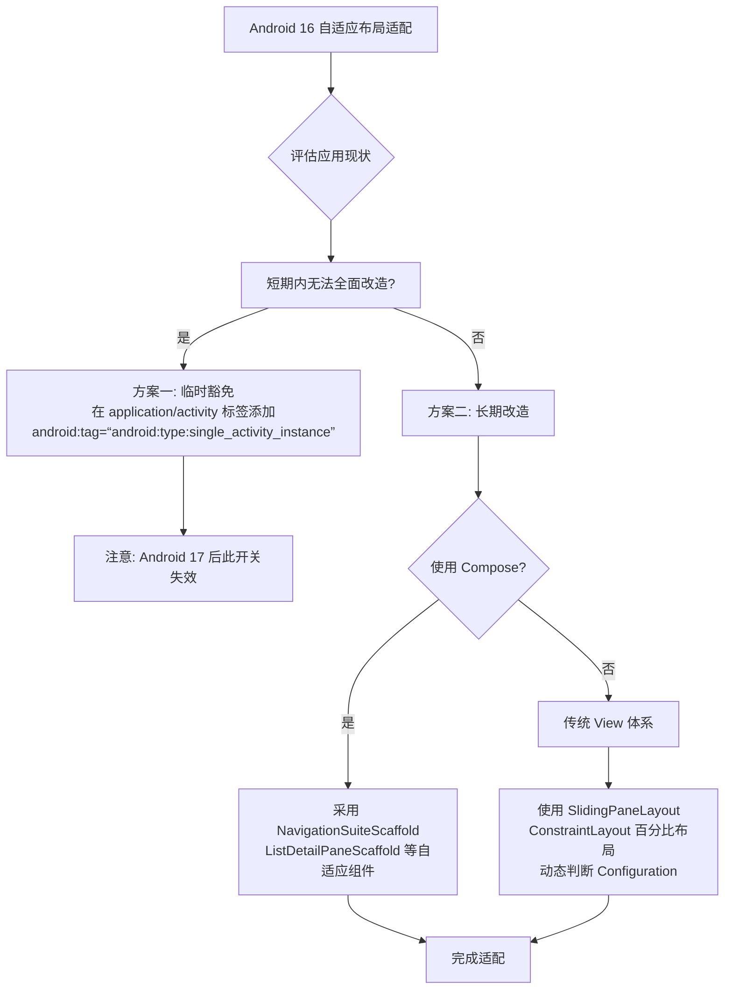
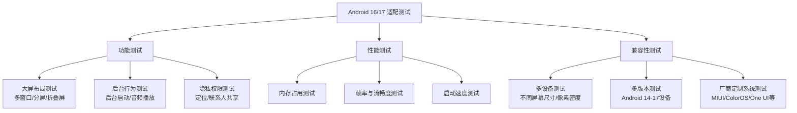
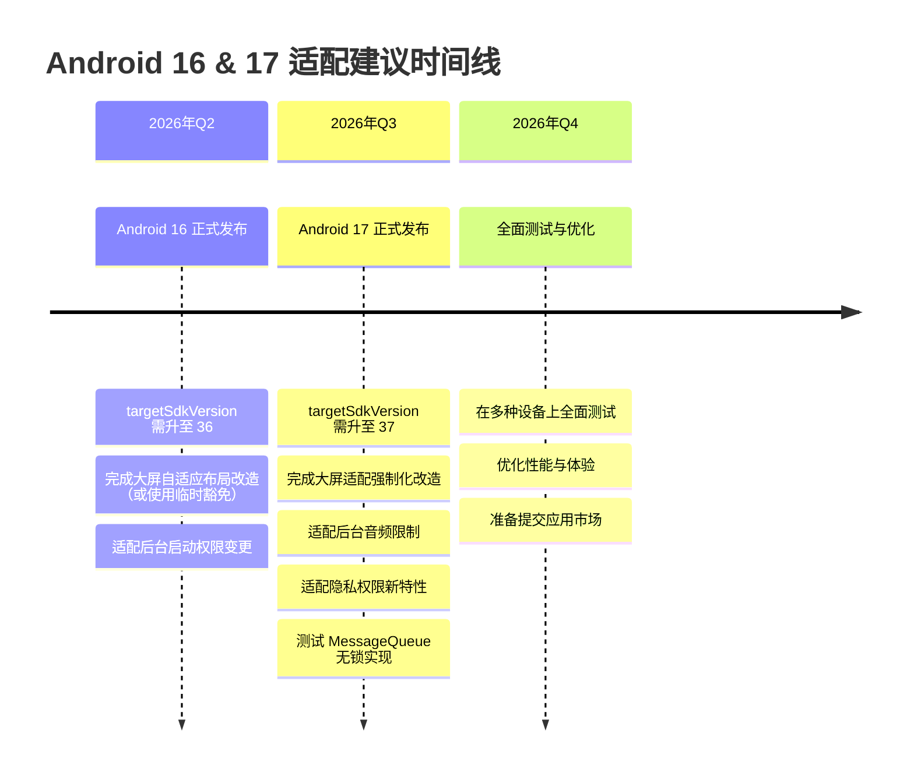

# 四大组件
## 1. Activity的四种启动模式及使用场景
Android 中 Activity 的启动模式决定了 Activity 实例的创建方式以及任务栈的归属。合理使用启动模式可以避免产生多余的实例，解决重复实例化问题和页面跳转逻辑混乱等问题。
### Android 共有四种启动模式：`standard`、`singleTop`、`singleTask`、`singleInstance`。此外，Android 5.0 (API 21) 还引入了一个动态的标志位组合，通常被称为第五种模式 `singleInstancePerTask`。
---
### 1. standard（标准模式 / 默认模式）
*   **行为特点**：每次启动 Activity 都会在当前任务栈中创建一个新的实例。谁启动了它，它就运行在启动它的那个 Activity 所在的任务栈里。
*   **应用场景**：绝大多数普通的页面跳转。
*   **注意**：使用 `Application` 或 `Service` 这种没有任务栈的 Context 去启动 standard 模式的 Activity 会报错，因为找不到任务栈放入。此时需要加 `FLAG_ACTIVITY_NEW_TASK` 标志位。
### 2. singleTop（栈顶复用模式）
*   **行为特点**：当启动一个 Activity 时，如果发现该 Activity **已经位于当前任务栈的栈顶**，则直接复用这个实例，并调用它的 `onNewIntent()` 方法，而不会创建新实例。如果不在栈顶，则依然创建新实例。
*   **应用场景**：
    *   **推送通知点击页**：从推送跳转到一个详情页，如果用户正在看这个详情页，再点推送不应该再开一个详情页，而是刷新当前页内容。
    *   **搜索页**：在搜索结果页再次点击“搜索”按钮，不需要叠加多个搜索结果页。
*   **生命周期变化**：`onCreate` -> `onNewIntent` -> `onRestart` -> `onStart` -> `onResume`（如果在栈顶被复用）。
### 3. singleTask（栈内复用模式）
*   **行为特点**：这是一种单例模式（针对特定任务栈）。启动该 Activity 时，系统会先在系统中查找是否存在它的实例：
    1.  如果不存在，则创建新实例并放入指定任务栈。
    2.  如果存在，但不在栈顶，系统会**将这个 Activity 之上的所有其他 Activity 全部出栈（clear top）**，使得该 Activity 位于栈顶，并调用它的 `onNewIntent()` 方法。
*   **应用场景**：
    *   **应用主页**：无论从哪里（比如从设置页、深层级页面）回到主页，都希望清空其上的页面，只保留主页，避免返回栈过深。
    *   **登录页/支付页**：登录成功后，不应该在返回栈里还能回到登录页。
*   **任务栈归属**：默认情况下，它运行在应用默认的任务栈中。但可以配合 `taskAffinity` 属性将其放入单独的任务栈。
### 4. singleInstance（单实例模式）
*   **行为特点**：这是一种极端的 singleTask 模式。具有此模式的 Activity 会独占一个任务栈，系统全局中**只能有一个该 Activity 的实例**。
    *   如果不存在，创建新实例并独占一个新任务栈。
    *   如果已存在，无论它在哪个任务栈，都会被复用，并调用 `onNewIntent()`。
*   **应用场景**：
    *   **系统级全局页面**：如来电界面（InCallScreen）、系统闹钟响铃界面。
    *   **跨应用共享的独立页面**：比如应用 A 和应用 B 都要调用某个第三方的地图导航全屏页，为了确保只有一个实例且独立于各自应用的栈，可以使用此模式。
*   **缺点**：由于独占任务栈，其内部的页面跳转逻辑和返回栈管理会比较反直觉，现代 Android 开发中**极少推荐使用**。
### 5. 补充：singleInstancePerTask (API 31 引入)
*   **行为特点**：与 `singleInstance` 类似，Activity 可以作为任务栈的根 Activity 并独占一个栈。但不同之处在于，**它允许其他 Activity 存在于它所在的栈中**。如果再次启动它，会根据情况复用或清空其上的 Activity。
*   **应用场景**：作为某个独立任务（如多窗口模式下的独立任务）的入口 Activity。
---
### 任务栈 与 Intent Flags
除了在 `AndroidManifest.xml` 中静态设置 `launchMode`，还可以在代码中通过 `Intent.addFlags()` 动态设置启动模式。常用的 Flags 有：
*   `FLAG_ACTIVITY_NEW_TASK`：效果类似于 `singleTask`，在新的任务栈中启动。
*   `FLAG_ACTIVITY_SINGLE_TOP`：效果等同于 `singleTop`。
*   `FLAG_ACTIVITY_CLEAR_TOP`：启动时，清除该 Activity 之上的所有 Activity。如果结合 `FLAG_ACTIVITY_NEW_TASK` 使用，效果类似于 `singleTask`。
**静态 vs 动态的区别**：
当 `Manifest` 和 `Intent Flags` 冲突时，**Intent Flags 的优先级更高**，会覆盖 Manifest 中的设置。同时，Manifest 无法指定 `CLEAR_TOP`，而 Intent Flags 无法指定 `singleInstance`。
### 总结速记表
| 启动模式 | 每次创建新实例？ | 复用条件 | 场景 |
| :--- | :--- | :--- | :--- |
| **standard** | 是 | 无 | 普通页面 |
| **singleTop** | 否（如果在栈顶） | 位于当前栈顶 | 推送跳转、搜索页 |
| **singleTask** | 否（如果在栈内） | 位于当前栈内（清空其上方） | 主页、登录页 |
| **singleInstance**| 否（全局唯一） | 全局存在（独占任务栈） | 系统来电、跨应用共享页 |


## 2. singleTask的onNewIntent调用时机和taskAffinity的关系
`taskAffinity` 决定了 `singleTask` Activity 所在的**目标任务栈**。`onNewIntent` 的调用时机取决于系统在哪个栈中找到该实例：
1. **不同栈复用**：如果该 Activity 已存在于其 `taskAffinity` 指定的栈中，系统会将其上方的 Activity 出栈，将其置顶，并调用 `onNewIntent`。
2. **同栈复用**：如果未指定 `taskAffinity`（默认为应用包名），它与启动者同栈。找到后清空其上方 Activity 并调用 `onNewIntent`。
3. **未找到实例**：如果目标栈中不存在该实例，则不调用 `onNewIntent`，而是在目标栈中新建实例并执行 `onCreate`。

## 3. onSaveInstanceState和onRestoreInstanceState的调用时机？哪些场景会触发
### 调用时机
1. **`onSaveInstanceState`**：在 Activity 变得容易被系统销毁**之前**调用。通常在 `onStop()` 之前（老版本 API 21 之前在 `onPause` 之前）。
2. **`onRestoreInstanceState`**：在 Activity 被系统销毁并**重新创建**之后调用。通常在 `onStart()` 之后、`onPostCreate()` 之前。*(注：只有在系统非正常销毁重建时才会触发，如果只是简单的页面切换回来不会触发)*。
### 触发场景（非用户主动销毁的场景）
1. **按 Home 键 / 切换到其他 App**：系统内存不足时可能被回收，触发保存。
2. **屏幕旋转**：配置改变导致 Activity 销毁重建，触发保存和恢复。
3. **内存不足被系统杀死**：低内存状态下，后台 Activity 被回收。
4. **从最近任务列表切回**：如果之前被系统回收过，此时触发恢复。
### 补充
*   **正常按 Back 键退出**：用户主动退出，不触发保存与恢复。
*   **恢复的两种途径**：`onRestoreInstanceState` 和 `onCreate` 中的 `Bundle` 参数，但官方推荐在 `onRestoreInstanceState` 中做恢复，因为系统调用它时必定有值，不需要判空。

## 4. Activity A启动Activity B，两个Activity的生命周期回调顺序是怎样的
正常情况下，A 启动 B 的生命周期回调顺序如下：
1. **A onPause()** (A 准备进入后台，先暂停，保证 B 能获取焦点)
2. **B onCreate()** 
3. **B onStart()**
4. **B onResume()** (B 准备完毕，进入前台并与用户交互)
5. **A onStop()** (A 完全被 B 遮挡，停止并退居后台)
**补充情况**：
*   **B 是透明/悬浮 Activity**：此时 A 没有被完全遮挡，A 的 `onStop()` **不会被调用**。
*   **B 是对话框主题的 Activity**：同上，只要 A 仍部分可见，就只走到 A 的 `onPause()`。

## 5. Service的onStartCommand返回值的区别(START_STICKY/START_NOT_STICKY/START_REDELIVER_INTENT)
`onStartCommand` 的返回值决定了 **Service 被系统因内存不足杀死后，系统的重建行为**：
1. **`START_NOT_STICKY`**（不粘）：
   * **行为**：被杀后不自动重启。只有当再次有组件调用 `startService()` 时才会重新创建。
   * **场景**：可中断的无状态后台任务（如网络轮询、拉取数据），丢失无影响，避免无谓重启浪费资源。
2. **`START_STICKY`**（粘）：
   * **行为**：被杀后系统会**自动重启**该 Service，但**不会保留之前的 Intent**。`onStartCommand` 会被回调，但 Intent 参数为 null。
   * **场景**：常驻型、有状态的服务（如后台播放音乐），重启后靠内部状态恢复，不依赖外部传入的 Intent。
3. **`START_REDELIVER_INTENT`**（重新投递）：
   * **行为**：被杀后系统会**自动重启**，并且会**再次把最后一次收到的 Intent 传给它**。
   * **场景**：必须执行完毕的指令型任务（如文件下载、发送邮件）。重启后根据 Intent 继续处理未完成的事务，防止任务丢失。

## 6. IntentService和普通Service的区别？为什么IntentService可以不手动stop
### 核心区别
1. **执行线程**：
   * 普通 Service：默认运行在**主线程**，直接处理耗时任务会导致 ANR。
   * IntentService：内部自带一个 **HandlerThread** 工作线程，所有任务都在**子线程**串行执行。
2. **任务处理方式**：
   * 普通 Service：每次 `startService` 都只回调 `onStartCommand`，需开发者自己管理多任务并发或排队。
   * IntentService：将多个任务请求加入队列，内部通过 Handler 串行处理，回调抽象方法 `onHandleIntent`。
3. **生命周期管理**：
   * 普通 Service：启动后需开发者手动调用 `stopSelf()` 或 `stopService()` 才会销毁。
   * IntentService：自带自动销毁逻辑。
### 为什么 IntentService 可以不手动 stop？
因为在底层实现中，IntentService 内部的 Handler 在处理完队列中的最后一个任务后，会自动调用 `stopSelf(startId)`。
系统会检查当前是否有未处理的任务，如果所有任务都已完成，Service 就会自动回调 `onDestroy()` 销毁自己，无需开发者干预。
**补充**：IntentService 在 Android 8.0 (API 30) 已被废弃。官方推荐使用 **JobIntentService** 或 **WorkManager** 来替代，以更好地适配后台执行限制。

## 7. BroadcastReceiver的静态注册和动态注册的区别？Android 8.0后对隐式广播的限制？哪个版本后，不再支持静态广播的注册？
### 静态注册 vs 动态注册的区别
| 特性 | 静态注册 | 动态注册 |
| :--- | :--- | :--- |
| **注册方式** | 在 `AndroidManifest.xml` 中通过 `<receiver>` 标签声明 | 在代码中通过 `registerReceiver()` 注册 |
| **生命周期** | 应用安装后常驻，**App 进程未启动时也能被唤醒**接收广播 | 依赖于注册者的组件生命周期，需手动 `unregisterReceiver()` 解绑 |
| **耗电与性能** | 容易被恶意利用，多个 App 静态注册同一广播会引发“广播风暴”，耗电严重 | 相对可控，随组件销毁而释放 |
| **接收优先级** | 可配置 `android:priority`，但受限 | 优先级通常高于静态注册 |
### Android 8.0 对隐式广播的限制
为了大幅降低后台应用互相唤醒造成的耗电和卡顿，Android 8.0 (API 26) 规定：
**大多数隐式广播（没有指定特定包名或组件名的广播）不再允许通过静态注册接收。**
当系统发送这些被限制的隐式广播时，静态注册的 Receiver 将无法被唤醒。
**例外情况（仍允许静态注册的常见广播）**：
* `ACTION_BOOT_COMPLETED`（开机完成）
* `ACTION_LOCKED_BOOT_COMPLETED`
* `ACTION_USER_INITIALIZE` 等
*(针对自身 App 发出的显式广播，或指定了目标包名的隐式广播，不受此限制)*

## 8. LocalBroadcastReceiver和BroadcastReceiver的区别
### 核心区别
1. **作用域与安全性**：
   * **LocalBroadcast**：仅在应用进程内发送和接收，数据不跨进程，绝对安全，其他 App 无法伪造或截获。
   * **全局 Broadcast**：跨进程通信，系统级广播可被其他 App 接收，存在安全风险（需防范恶意伪造或拦截）。
2. **底层实现机制**：
   * **LocalBroadcast**：底层完全基于 **Handler** 实现，利用了主线程的 `MessageQueue`，不涉及 Binder IPC 和系统服务。
   * **全局 Broadcast**：底层涉及 **Binder IPC**，需依赖系统底层服务 `ActivityManagerService(AMS)` 进行分发。
3. **性能与开销**：
   * **LocalBroadcast**：无跨进程开销，性能极高，无法静态注册（只能动态注册）。
   * **全局 Broadcast**：有 IPC 开销，比本地广播慢。
### 补充
**LocalBroadcastManager 已被废弃**：
由于 LocalBroadcastManager 容易引发主线程卡顿（注册/解绑和广播分发都在主线程进行）且不支持跨进程，Google 已在 AndroidX 中将其废弃。
**官方推荐替代方案**：
* 如果不需要跨进程：使用 **LiveData** 或 **RxJava**、**Flow** 等响应式框架。
* 如果需要跨进程：使用普通的 **BroadcastReceiver** 结合显式 Intent。

## 9. ContentProvider为什么适合跨进程数据共享？他的onCreate在什么时候调用
### 为什么适合跨进程数据共享？
1. **统一的访问接口**：提供了标准的 `CRUD`（增删改查）API，屏蔽了底层数据存储的细节。无论底层数据是 SQLite 数据库、文件还是网络，外部进程调用的方式完全一致。
2. **底层安全的 IPC 机制**：底层基于 **Binder** 机制实现跨进程通信。调用者调用的并不是真实的 Provider 对象，而是系统通过 Binder 代理生成的“影子”对象，自动处理了跨进程序列化。
3. **细粒度权限控制**：支持在 `AndroidManifest.xml` 中分别配置 `readPermission`、`writePermission`，甚至可以精确到 URI 级别的权限校验，保证数据安全性。
4. **解耦**：数据提供方和数据使用方完全解耦，使用方不需要知道数据怎么存的，只需拿到 URI 即可操作。
### onCreate 的调用时机
`ContentProvider` 的 `onCreate()` 在**应用进程启动时**由系统自动回调。
具体时机是：在 Application 对象创建之后，但在 Application 的 `onCreate()` 方法被调用**之前**。
*(这也是为什么在 ContentProvider 的 onCreate 中不应做过于耗时的初始化操作，否则会拖慢整个 App 的启动速度；同时，这也是很多开源库（如 LeakCanary、Firebase）利用 ContentProvider 实现无侵入初始化的原理。)*


# Fragment
## 1. Fragment的生命周期和Activity生命周期的对应关系
### Fragment 生命周期与 Activity 的对应关系
以 Activity A 承载 Fragment F 为例，正常启动时的回调顺序如下：
1. **Activity A** `onCreate()`
   * *此时可通过 `setContentView()` 加载 Fragment 布局，Fragment 被创建但尚未完全初始化。*
2. **Fragment F** `onAttach()` —— 绑定到 Activity
3. **Fragment F** `onCreate()` —— 初始化 Fragment 数据（非视图）
4. **Activity A** `onCreateView()` *(Activity 创建视图，通常在此处通过 LayoutInflate 加载包含 Fragment 的布局)*
5. **Fragment F** `onCreateView()` —— 创建 Fragment 的 UI 视图
6. **Fragment F** `onViewCreated()` —— View 已创建，可在此初始化控件
7. **Activity A** `onStart()`
8. **Fragment F** `onStart()`
9. **Activity A** `onResume()`
10. **Fragment F** `onResume()`
**核心规则**：
* **启动/恢复**：Activity 的生命周期方法先执行，然后再调用 Fragment 的对应方法。
* **暂停/销毁**：Fragment 的生命周期方法先执行，然后再调用 Activity 的对应方法。
### 其他状态的对应关系
1. **退到后台（Home键）**：
   * Fragment `onPause()` -> Activity `onPause()` -> Fragment `onStop()` -> Activity `onStop()`
2. **销毁（Back键退出）**：
   * Fragment `onPause()` -> Activity `onPause()` -> Fragment `onStop()` -> Activity `onStop()`
   * Fragment `onDestroyView()` -> Fragment `onDestroy()` -> Fragment `onDetach()` -> Activity `onDestroy()`
### 特殊方法说明
* `onAttach()`：Fragment 与 Activity 关联时调用，此时可获取 Activity 的 Context 引用。
* `onCreateView()`：创建 Fragment 的布局视图。
* `onDestroyView()`：Fragment 的视图被移除时调用，但 Fragment 实例依然存活。常用于清理与 View 相关的资源（如防止内存泄漏）。

## 2. Fragment的懒加载方案演进：setUserVisibleHint->FragmentMaxLifecycle->ViewPager2的BEHAVIOR_RESUME_ONLY_CURRENT_FRAGMENT
Fragment 懒加载的演进主要经历了三个阶段：
### 1. 传统方案：配合 `setUserVisibleHint`（已废弃）
* **场景**：早期与 `ViewPager` 配合使用。
* **原理**：通过重写 `setUserVisibleHint(boolean isVisibleToUser)`，当参数为 `true` 时表示对用户可见。结合一个 `isLoaded` 标志位，在可见时才触发数据加载。
* **痛点**：该方法会在 `onCreate` 之前调用，导致无法获取 UI 视图；且逻辑繁琐，容易出错。
### 2. 过渡方案：AndroidX 中的 `setMaxLifecycle`
* **场景**：AndroidX Fragment 1.2.0 后引入。
* **原理**：配合 `ViewPager2` 或 `FragmentStatePagerAdapter`，通过 `FragmentTransaction.setMaxLifecycle()` 限制不可见的 Fragment 最大生命周期停留在 `STARTED`。
* **效果**：不可见的 Fragment 不会进入 `RESUMED` 状态，从而不再触发 `setUserVisibleHint`。开发者只需在 `onResume()` 中加载数据，在 `onPause()` 停止加载。
### 3. 现代方案：基于 `Lifecycle` 的原生懒加载（当前推荐）
* **场景**：AndroidX Fragment 1.3.0 彻底废弃 `setUserVisibleHint` 后。
* **原理**：直接依赖 Fragment 的生命周期。通过 `FragmentStateAdapter` + `ViewPager2`，只有当前显示的 Fragment 会回调 `onResume()`，其他离屏 Fragment 保持 `STARTED` 或更低状态。
* **实现**：直接在 `onResume()` 中执行网络请求或数据加载，无需额外处理可见性逻辑。现代 Jetpack 导航组件同样适用此机制。

## 3. FragmentManager回退栈的原理？addToBackStack和popBackStack做了什么
### FragmentManager 回退栈原理
回退栈本质上是一个**记录 Fragment 事务的队列**。它保存的不是 Fragment 实例本身，而是**每次事务引发的状态变化**。当用户按下返回键或调用 `popBackStack()` 时，FragmentManager 会从栈顶取出最近一次的事务记录，并**反向执行**其中的操作（如添加变移除，替换变还原），从而让界面回退到上一个状态。
### addToBackStack 做了什么
* **记录状态**：将当前 `FragmentTransaction` 中所有的操作（add、replace、hide 等）打包成一个 `BackStackRecord` 对象。
* **压入栈顶**：将该记录压入 FragmentManager 维护的回退栈中。
* **不销毁实例**：与之对应，如果不调用 `addToBackStack`，事务提交后 Fragment 会被直接销毁（走 `onDestroy`），无法回退。
### popBackStack 做了什么
* **弹出栈顶**：将回退栈栈顶的事务记录弹出。
* **反向操作**：解析该记录中的操作，执行逆动作。例如，原事务是 `add`，此时就执行 `remove`；原事务是 `replace`，此时就恢复被替换掉的旧 Fragment。
* **同步状态**：触发相关 Fragment 生命周期的重新流转，并更新 UI 视图。
### 补充关键点
* **异步执行**：`popBackStack()` 是异步的，仅将弹出指令加入队列，具体操作在主线程下一轮消息处理时由 FragmentManager 执行。
* **同步等待**：如果需要在 pop 完成后立刻执行逻辑，应使用 `FragmentManager.registerOnBackStackChangedListener()` 监听，或使用 `popBackStackImmediate()`（不推荐在事务中频繁使用，易引发状态异常）。

## 4. Fragment重叠问题(Activity重建后Fragment被重复添加)怎么解决
Fragment 重叠问题是 Android 开发中非常经典的 Bug。
### 为什么会发生重叠？
当 Activity 因配置改变（如**屏幕旋转**）或**内存不足**被系统杀死并重建时，系统会默认**自动恢复 Activity 之前的 Fragment 状态**（通过 `onSaveInstanceState` 保存了 FragmentManager 的状态）。
如果开发者在 `onCreate` 中又直接 `new` 了一个新的 Fragment 并通过 `replace` 或 `add` 添加进去，就会导致：**系统恢复的旧 Fragment（通常无 UI 或隐藏在底层） + 新创建的 Fragment（显示在顶层）** 同时存在，视觉上表现为 UI 重叠。
### 解决方案
#### 方案一：官方推荐的最简做法（判断 Bundle）
在 Activity 的 `onCreate` 方法中，判断系统是否带有恢复的 savedInstanceState 数据。如果有，说明系统会自动恢复 Fragment，此时**不要再手动添加**。
```kotlin
override fun onCreate(savedInstanceState: Bundle?) {
    super.onCreate(savedInstanceState)
    setContentView(R.layout.activity_main)
    if (savedInstanceState == null) {
        // 只有在首次创建时才手动添加 Fragment
        val fragment = MyFragment.newInstance()
        supportFragmentManager.beginTransaction()
            .replace(R.id.fragment_container, fragment, "MY_TAG")
            .commit()
    }
    // 如果 savedInstanceState != null，系统会自动帮我们把之前的 Fragment 恢复到 R.id.fragment_container 中
}
```
#### 方案二：恢复时复用已有实例（使用 Tag 或 ID）
如果出于某些原因必须在重建时处理事务，或者使用了 ViewPager 等，可以通过 Tag 检查 Fragment 是否已经被系统恢复，避免重复 new。
```kotlin
override fun onCreate(savedInstanceState: Bundle?) {
    super.onCreate(savedInstanceState)
    setContentView(R.layout.activity_main)
    var fragment = supportFragmentManager.findFragmentByTag("MY_TAG")
    if (fragment == null) {
        fragment = MyFragment.newInstance()
    }
    
    // 此时如果 fragment 不为空，说明是系统恢复的，直接使用即可，不要再次 add
    // 如果为空，说明是首次创建，正常添加
    if (savedInstanceState == null) {
        supportFragmentManager.beginTransaction()
            .replace(R.id.fragment_container, fragment, "MY_TAG")
            .commit()
    }
}
```
#### 方案三：禁止系统自动保存 Fragment 状态（不推荐）
可以通过在 Activity 的 `onSaveInstanceState` 中不调用 `super.onSaveInstanceState()` 来阻止系统保存 Fragment 状态。
* **缺点**：会导致 Activity 中的其他状态（如用户输入的文本）也无法被恢复，治标不治本，**极其不推荐**。
### 总结
核心原则就是：**把系统的自动恢复机制考虑在内**。只要 `savedInstanceState != null`，就管住手，不要再去手动 `add/replace` 新的 Fragment。

## 5. replace和add+hide/show的区别和使用场景
在 Fragment 事务中，`replace` 和 `add + hide/show` 是两种截然不同的切换方案，它们的核心区别在于**是否销毁旧 Fragment 的视图和实例**。
### 1. `replace` 的行为与场景
* **底层行为**：相当于 `remove(旧Fragment) + add(新Fragment)`。旧 Fragment 的视图会被销毁（触发 `onDestroyView`），如果未加入回退栈，整个 Fragment 实例会被销毁（触发 `onDestroy` 和 `onDetach`）。
* **特点**：每次切换都会重新创建视图，每次都会重新走 `onCreateView` -> `onActivityCreated` 等生命周期，**内存占用低**，但**切换开销大**，可能有卡顿或闪烁。
* **使用场景**：
  * **单页面流转**：如登录 -> 主页 -> 详情页。前一个页面切换后不再需要保留状态，适合“用完即走”的场景。
  * **强状态隔离**：希望每次进入页面都是初始状态，不保留用户的滚动位置或表单输入。
### 2. `add + hide/show` 的行为与场景
* **底层行为**：
  * `add`：将新 Fragment 添加到容器。
  * `hide`：仅仅是将旧 Fragment 的 View 设置为 `View.GONE`（隐藏），**不触发任何生命周期回调**，视图结构和实例依然保存在内存中。
  * `show`：将 Fragment 的 View 设置为 `View.VISIBLE`，同样不触发生命周期回调（或仅触发对用户可见的回调）。
* **特点**：Fragment 实例和视图常驻内存，**切换速度极快**，无卡顿，能**完美保留页面状态**（如列表滚动位置）；但如果 Fragment 过多，**内存占用高**，容易引发 OOM。
* **使用场景**：
  * **底部导航栏（Tab 切换）**：如微信的“微信、通讯录、发现、我”。这几个主页需要频繁切换，且每次切换都要保持之前的滚动位置和状态。
  * **需要保留复杂表单状态的页面**：填写了一半的长表单，切换走再回来不能丢失数据。
### 3. 核心对比总结
| 对比项 | `replace` | `add + hide/show` |
| :--- | :--- | :--- |
| **旧 Fragment 视图** | 销毁 (`onDestroyView`) | 隐藏 (`View.GONE`)，不销毁 |
| **旧 Fragment 实例** | 销毁（未加入回退栈时） | 保留在内存中 |
| **切换速度** | 慢（需重建视图） | 快（仅改变 View 可见性） |
| **状态保留** | 不保留（每次都是初始状态） | 保留（滚动位置、表单数据等） |
| **内存占用** | 低 | 高（多 Fragment 常驻） |
| **生命周期影响** | 触发完整生命周期 | 基本不触发生命周期（可能触发 `onHiddenChanged`） |
### 补充注意点
使用 `add + hide/show` 配合 ViewPager 等场景时，由于 Fragment 生命周期不再重新流转，如果需要在切换时刷新数据或更新 UI，通常需要重写 Fragment 的 **`onHiddenChanged(boolean hidden)`** 方法，在其中判断 `if (!hidden)` 来执行可见时的逻辑。


# RecyclerView
## 1. RecyclerView的缓存机制：mAttachedScrap、mCachedViews、mRecyclePool、mViewCacheExtension各自的作用和最大容量
RecyclerView 的四级缓存机制是其高效滑动的核心，按照从内到外的查找和回收顺序，这四级缓存的作用和容量如下：
### 1. `mAttachedScrap` (一级缓存：屏幕内缓存)
* **作用**：用于在 `notifyDataSetChanged`、`notifyItemRangeChanged` 等**局部刷新**时，缓存当前仍在屏幕内但即将被重新绑定的 ViewHolder。它会在 layout 过程中直接复用，**不需要重新创建 View，也不需要重新调用 `onBindViewHolder`**。
* **特点**：生命周期极短，仅存在于每次布局过程之间。如果发生了位置变化，也可以通过 `mChangedScrap` 暂存发生改变的 ViewHolder。
* **最大容量**：**无限制**。容量等于当前屏幕上可见的 Item 数量加上预取的 Item 数量。
### 2. `mCachedViews` (二级缓存：屏幕外缓存)
* **作用**：用于缓存刚刚被滑出屏幕（被回收）的 ViewHolder。列表来回滑动时（如轻微上下抖动）直接命中此缓存，复用时**不需要重新创建 View，也不需要重新调用 `onBindViewHolder`**（因为数据原封不动保留着）。
* **特点**：这是一个 ArrayList，采用**LRU（最近最少使用）**策略，满了之后会优先淘汰最老的 ViewHolder，将其放入 `mRecyclePool`。
* **最大容量**：默认为 **2**。可以通过 `setItemViewCacheSize(int)` 修改。
### 3. `mViewCacheExtension` (三级缓存：自定义缓存)
* **作用**：留给开发者自定义的缓存层。开发者可以自己实现缓存逻辑，在 RecyclerView 未命中前两级缓存时，会调用此处的逻辑来获取 View。
* **特点**：几乎在实际开发中**不被使用**（极小众场景）。官方未提供默认实现，需要开发者继承 `ViewCacheExtension` 并自己管理数据的存取和类型匹配。
* **最大容量**：**无限制**，完全由开发者决定。
### 4. `mRecyclePool` (四级缓存：缓存池)
* **作用**：当 `mCachedViews` 满了之后，多余的 ViewHolder 会被清空数据（置空 position、flags 等）后放入此处。复用时**不需要重新创建 View，但必须重新调用 `onBindViewHolder`** 绑定新数据。
* **特点**：按 `viewType` 分类存储（使用 SparseArray）。这是跨 RecyclerView 共享缓存的关键（例如多个 RecyclerView 共用一个 Pool）。
* **最大容量**：**默认每种 viewType 最多存 5 个**。可以通过 `getRecycledViewPool().setMaxRecycledViews(type, max)` 修改。
### 总结表
| 缓存级别 | 作用 | 是否重新创建 View | 是否重新绑定数据 | 默认最大容量 |
| :--- | :--- | :--- | :--- | :--- |
| `mAttachedScrap` | 屏幕内局部刷新暂存 | 否 | 否 | 无限制（随屏幕Item数） |
| `mCachedViews` | 屏幕外来回滑动暂存 | 否 | 否 | 2 |
| `mViewCacheExtension`| 开发者自定义 | 取决于实现 | 取决于实现 | 无限制 |
| `mRecyclePool` | 跨 viewType、跨 RecyclerView 复用 | 否 | **是** | 每种 viewType 5 个 |

## 2. onCreateViewHolder和onBindViewHolder的调用时机？什么情况下onCreateViewHolder不调用
### 1. 两者的调用时机
* **`onCreateViewHolder`**：
  * **时机**：当 RecyclerView 需要一个新的 ViewHolder 来展示数据，但在所有级别的缓存（`Scrap`, `CachedViews`, `RecycledViewPool` 等）中**都没有找到可直接复用的 ViewHolder** 时触发。
  * **任务**：负责解析 XML 布局文件（`LayoutInflater.inflate`）并实例化 ItemView，然后将其包装成 ViewHolder 返回。这是一个相对耗时的操作。
* **`onBindViewHolder`**：
  * **时机**：当 RecyclerView 获得了一个 ViewHolder（无论是刚 `onCreateViewHolder` 创建的，还是从 `mRecyclePool` 复用的），但**需要为其绑定新的数据**时触发。
  * **任务**：负责将具体的数据设置到 ViewHolder 的控件上（如 `setText`, `setImageResource`）。
### 2. 什么情况下 `onCreateViewHolder` 不调用？
只要 RecyclerView 能从缓存中拿到现成的 ViewHolder，就不会调用 `onCreateViewHolder`。具体有以下几种情况：
1. **命中 `mAttachedScrap` 或 `mCachedViews`（一二级缓存）**：
   * **场景**：局部刷新（如 `notifyItemChanged`）或列表轻微来回滑动时滑出屏幕的 Item 又滑回来。
   * **原因**：这两个缓存保存的是带有原数据的完整 ViewHolder。复用时不仅跳过 `onCreateViewHolder`，**连 `onBindViewHolder` 都会跳过**，直接拿来用。
2. **命中 `mRecyclePool`（四级缓存）**：
   * **场景**：列表正常快速滑动，滑出屏幕很久的 Item 再次滑入。
   * **原因**：Pool 中存有同 `viewType` 的废旧 ViewHolder（只是被清空了数据）。复用时会跳过 `onCreateViewHolder`，但**必须调用 `onBindViewHolder`** 重新绑定新数据。
3. **多个 RecyclerView 共享同一个 `RecycledViewPool`**：
   * **场景**：例如 Tab 切换时多个 ViewPager + RecyclerView 的场景。
   * **原因**：如果在 Tab1 中创建了某种类型的 ViewHolder，切到 Tab2 时如果设置了 `setRecycledViewPool`，Tab2 可以直接复用 Tab1 创建过的 ViewHolder，无需重新创建。
4. **使用了 `RecyclerView.Prefetch`（预取功能）**：
   * **场景**：快速滑动列表时，系统会在 UI 空闲的间隙（通常在下一帧渲染前）提前创建并绑定即将进入屏幕的 Item。
   * **原因**：如果在滑动过程中该 Item 真正进入屏幕，且预取的 ViewHolder 还在缓存中，就直接复用，不再创建。

## 3. DiffUtil的原理？areItemsTheSame和areContentsTheSame的区别
### DiffUtil 的原理
`DiffUtil` 是一个用于计算两个列表（旧数据集和新数据集）差异的工具类。它的核心原理基于 **Eugene W. Myers 差分算法**。
1. **找出最小编辑距离**：DiffUtil 通过 Myers 算法计算将旧列表转换成新列表所需的最少操作次数（插入、删除、移动）。它能够以 $O(N)$ 的时间复杂度找出两个列表中相同的部分，从而避免不必要的整表刷新。
2. **定向分发更新事件**：计算出差异后，DiffUtil 会生成一个更新操作队列（包含 `insert`、`remove`、`move`、`update`），并将这些操作定向分发给 `Adapter`。这样 RecyclerView 就可以只刷新发生变化的那个 Item（局部刷新），而不是调用 `notifyDataSetChanged()` 触发全量重绘。
3. **线程限制**：DiffUtil 的计算过程是同步且可能耗时的（如果列表巨大），因此 Google 强制要求在后台线程计算 `DiffUtil.calculateDiff()`，然后回到主线程将结果分发给 Adapter。这也催生了 `ListAdapter` 和 `AsyncListDiffer` 的诞生。
### areItemsTheSame 和 areContentsTheSame 的区别
在使用 DiffUtil 时，我们需要实现 `DiffUtil.ItemCallback<T>` 中的这两个抽象方法，它们承担着不同的职责：
#### 1. `areItemsTheSame(oldItem, newItem)`
* **作用**：判断两个对象是否代表**同一个业务实体（同一条数据）**。
* **判断依据**：通常比较业务唯一标识符（如数据库的 `id`、用户的 `userId`）。
* **决定结果**：
  * 如果返回 **`false`**：DiffUtil 认为这是一个全新的 Item，会对旧 Item 执行删除操作，对新 Item 执行插入操作。
  * 如果返回 **`true`**：DiffUtil 认为这两个对象是“同一条数据”，接下来会进一步调用 `areContentsTheSame` 来检查其内容是否发生了变化。同时，这也使得 Item Change 动画（如淡入淡出）能够正确绑定到同一个 ViewHolder 上。
#### 2. `areContentsTheSame(oldItem, newItem)`
* **作用**：在 `areItemsTheSame` 返回 `true` 的前提下，判断这两个对象的**具体内容（显示的 UI 数据）是否完全一致**。
* **判断依据**：通常比较实体类中的所有展示字段（如 `name`, `age`, `avatarUrl` 等是否相等）。
* **决定结果**：
  * 如果返回 **`true`**：DiffUtil 认为虽然数据集更新了，但这条数据的显示内容没变，**什么都不做**，连 `notifyItemChanged` 都不调用，极致省性能。
  * 如果返回 **`false`**：DiffUtil 认为这条数据的内容变了，会针对这个 Item 调用 `notifyItemChanged`，触发该 Item 的局部刷新（重绑数据并播放变更动画）。
### 总结举例
假设有一个联系人列表：
* 旧数据：`User(id=1, name="张三", age=20)`
* 新数据：`User(id=1, name="张三", age=21)`
1. 首先 `areItemsTheSame` 判断 `old.id == new.id`，返回 `true`。（系统知道这还是张三，不是新插入的人）。
2. 接着 `areContentsTheSame` 判断，发现 `age` 变了，返回 `false`。
3. 最终结果：DiffUtil 只对张三这一个条目调用 `onBindViewHolder` 更新年龄，其他列表项纹丝不动。

## 4. notifyItemChanged和notifyDataSetChanged的性能差异
`notifyItemChanged` 和 `notifyDataSetChanged` 是 RecyclerView 刷新数据的两种不同方式，它们在性能上有极其显著的差异。
### 核心性能差异对比
| 对比维度 | `notifyItemChanged(position)` | `notifyDataSetChanged()` |
| :--- | :--- | :--- |
| **刷新范围** | **局部刷新**（仅针对指定 position 的 Item） | **全局刷新**（所有可见及缓存的 Item） |
| **缓存影响** | 仅将该 position 的 ViewHolder 标记为 `UPDATE`，复用机制依然高效 | **直接清空 `mAttachedScrap` 和 `mCachedViews`** 中的所有缓存 |
| **`onBindViewHolder`调用** | 仅被改变的 1 个 Item 调用 | 屏幕上所有可见 Item 都会重新调用 |
| **`onCreateViewHolder`调用**| 基本不调用（复用现成的） | 极有可能调用（因为缓存被清空，可能触发重新创建） |
| **动画支持** | 支持默认的局部变更动画（如淡入淡出） | **无动画**，整个列表瞬间闪烁重绘 |
### | **时间复杂度**| 接近 $O(1)$ | $O(N)$（N 为屏幕上可见的 Item 数量） |
---
### 1. `notifyDataSetChanged` 为什么性能差？
* **破坏缓存机制**：这是最致命的一点。调用该方法后，RecyclerView 会认为数据集发生了彻底的、未知的改变。为了保证数据一致性，它会将一二级缓存（`mAttachedScrap` 和 `mCachedViews`）中的内容全部废弃。
* **全量重新绑定**：所有当前屏幕上的 ViewHolder 都会被丢入 `mRecyclePool`（四级缓存）或者重新绑定。这意味着屏幕上的每一个 Item 都会强制走一次 `onBindViewHolder`，哪怕它的数据根本没变。
* **UI 卡顿**：如果 Item 布局复杂（包含图片、多层嵌套），大量的 `onBindViewHolder` 和重新布局渲染会在主线程消耗大量时间，导致掉帧卡顿。
* **丢失动画**：没有变更动画，用户体验生硬。
### 2. `notifyItemChanged` 为什么高效？
* **精准打击**：它只通知系统“某个特定位置的数据变了”。
* **保留缓存**：其他位置的 ViewHolder 在缓存池中纹丝不动，依然带有原有的数据和状态。
* **最小化绑定**：只有目标位置的 Item 会被标记为无效，进而重新调用一次 `onBindViewHolder` 来更新 UI，其他 Item 完全不受影响。
* **自带动画**：默认会触发该 Item 的变更动画（ItemAnimator），提升用户体验。
---
### 总结建议
1. **永远优先使用局部刷新**：在实际开发中，应尽量避免使用 `notifyDataSetChanged()`。
2. **常用的局部刷新 API**：
   * `notifyItemChanged(int)`：单条数据改变
   * `notifyItemInserted(int)`：插入一条
   * `notifyItemRemoved(int)`：删除一条
   * `notifyItemRangeChanged(int, int)`：批量改变
3. **终极方案 DiffUtil**：如果数据集是异步整体返回的（如网络请求返回新列表），难以手动判断哪里变了，不要用 `notifyDataSetChanged`，而是使用 **`DiffUtil`** 或 **`ListAdapter`**。DiffUtil 会在后台线程对比出新旧列表的差异，然后自动转化为最优的局部 `notifyItemXxx` 调用，性能远超全量刷新。

## 5. setHasFixedSize(true)的作用是什么
### `setHasFixedSize(true)` 的作用
调用 `setHasFixedSize(true)` 的核心作用是：**告诉 RecyclerView，它的尺寸不会因为内部 Adapter 内容的变化而改变。**
### 为什么它能提升性能？
1. **默认行为的开销**：
   如果不调用这个方法（默认为 `false`），每次 Adapter 的数据发生变化（如调用 `notifyItemInserted`、`notifyItemRemoved` 等），RecyclerView 都会认为**自己的边界可能受到了影响**。因此，它会强制请求一次重新布局，即触发 `requestLayout()`。这会导致整个视图树重新测量和布局，产生额外的性能开销。
2. **开启后的优化**：
   当设置为 `true` 时，RecyclerView 会认为：“无论我怎么增删数据，我的长宽尺寸是由父布局决定的，不会变”。因此，在数据发生增删时，RecyclerView **会跳过 `requestLayout()` 的调用**，仅执行内部 Item 的局部绑定和动画。这极大地提升了列表增删数据时的流畅度。
### 使用它的前提条件（非常重要）
并不是所有情况都能随便设置为 `true`。只有当满足以下条件时才能使用：
**RecyclerView 的尺寸不依赖于其内部的内容。**
* **适用场景**：
  * RecyclerView 的高度/宽度是固定值（如 `match_parent` 或具体的 dp 值）。
  * RecyclerView 的尺寸由父布局严格约束（如 `ConstraintLayout` 约束定的固定大小）。
* **不适用场景（会导致 Bug）**：
  * RecyclerView 的高度是 `wrap_content`。因为它需要根据 Item 的数量动态计算自身的高度/宽度，如果设为 `true`，尺寸将不会重新计算，导致 UI 显示异常。
### 总结
如果你的 RecyclerView 尺寸固定，强烈建议在初始化时调用 `setHasFixedSize(true)`，这是一种低成本、高收益的性能优化手段。

## 6. ItemDecoration是在onDraw还是onDrawOver中绘制的，与Item的Z序关系
`ItemDecoration` 的绘制并不只在其中一个方法中进行，而是通过重写 `onDraw()` 和 `onDrawOver()` 这两个方法来满足不同的绘制需求。它们与 Item View 的 Z 轴（层级）序关系是截然不同的。
### 1. 核心结论：Z 序关系
* **`onDraw()`**：绘制的内容在 **Item View 的下方**。
  * 即：`ItemDecoration.onDraw()` -> `Item View`。
  * 如果绘制的内容与 Item 重叠，**Item 会遮挡住 onDraw 绘制的内容**。
* **`onDrawOver()`**：绘制的内容在 **Item View 的上方**。
  * 即：`Item View` -> `ItemDecoration.onDrawOver()`。
  * 如果绘制的内容与 Item 重叠，**onDrawOver 绘制的内容会遮挡住 Item**。
### 2. 源码绘制顺序
在 RecyclerView 的 `draw()` 方法中，执行顺序严格如下：
1. 调用 `super.draw()`，即 ViewGroup 的绘制流程，这里面会触发 `dispatchDraw()` 绘制所有的子 View（Item）。
2. 在 `dispatchDraw()` **之前**，RecyclerView 会调用 `ItemDecoration.onDraw()`。
3. 在 `dispatchDraw()` **之后**，RecyclerView 会调用 `ItemDecoration.onDrawOver()`。
### 3. 两者的具体使用场景
#### `onDraw(Canvas c, RecyclerView parent, State state)`
* **绘制时机**：在绘制 Item 之前。
* **使用场景**：适合绘制**背景**或**不被遮挡的装饰**。
* **经典例子**：**列表分割线**。分割线通常画在两个 Item 之间的缝隙中，因为 Item 不会覆盖这个缝隙，所以画在底层还是顶层无所谓，官方默认实现在这里绘制。
* **注意**：由于此方法在 Item 绘制前执行，如果绘制工作量大，可能会拖慢 Item 的显示。
#### `onDrawOver(Canvas c, RecyclerView parent, State state)`
* **绘制时机**：在绘制 Item 之后。
* **使用场景**：适合绘制**前景**、**悬浮层**或**需要覆盖在 Item 之上**的装饰。
* **经典例子**：**带悬浮字母索引的通讯录**。顶部的字母 "A"、"B" 需要悬浮在列表最上方，并且当新的 Item 滑动到顶部时，悬浮字母要覆盖在 Item 之上，这就必须在 `onDrawOver` 中绘制。
### 总结
* 画在底层（被 Item 遮挡） -> 用 `onDraw()`。
* 画在顶层（遮挡 Item） -> 用 `onDrawOver()`。
* 两个方法都可以不重写，按需使用。


# 版本适配
## 1. Android 6.0：运行时权限模型的变化
## 2. Android7.0：FileProvider替代file://URI的原因和用法
## 3. Android8.0：通知渠道、后台服务限制、隐式广播限制
## 4. Android9.0：限制HTTP明文流量(network_security_config)、限制非SDK接口的调用
## 5. Android10：分区存储、后台定位权限分离
## 6. Android11：包可见性(queries)、分区存储强制执行
## 7. Android12：SplashScreen API、PendingIntent可变性声明、精确闹钟权限
## 8. Android13：通知运行时权限(POST_NOTIFICATIONS)、细粒度媒体权限
## 9. Android14：前台服务类型声明、scheduleExactAlarm权限收紧
## 10. Android15：边缘到边缘强制、16KB页面大小
## 11. Android16、Android17：
你正在为应用升级到 Android 16 和 Android 17 做准备，这确实是当前 Android 开发者的重要任务。下面我将为你梳理这两个版本的主要适配要点，并提供清晰的适配路线。
### 📱 Android 16 & 17 版本适配全指南
### 🎯 版本适配概览
以下是 Android 16 和 Android 17 的核心适配要点对比，帮助你快速了解重点：
| 适配领域 | Android 16 (API 36) | Android 17 (API 37) | 优先级 |
| :--- | :--- | :--- | :--- |
| **大屏自适应布局** | 引入特性，可临时豁免 | **强制启用**，移除豁免选项 | ⭐⭐⭐⭐⭐ |
| **后台行为限制** | 后台启动 Activity 权限变更 | **后台音频限制加强**，需前台服务 | ⭐⭐⭐⭐ |
| **安全与隐私** | 后台启动与浮窗权限关联 | **联系人选择性共享**、**精准/模糊定位** | ⭐⭐⭐⭐ |
| **系统性能与工具** | 引入次要版本概念（SDK_INT_FULL） | **MessageQueue 无锁实现**、**ProfilingManager 新触发器** | ⭐⭐⭐ |
| **新特性与能力** | 多窗口优化、Material You 增强 | **全局悬浮窗(Bubbles)**、**AI 智能体** | ⭐⭐⭐ |
### 📋 1. Android 16 核心适配
### 1.1 自适应布局适配
这是 Android 16 最重要的行为变更。Google 正推动应用更好地适应各种屏幕尺寸和方向。
**核心规则**：对于 `targetSdkVersion` 设为 36 的应用，在**最小宽度 ≥ 600dp** 的设备（如平板、大屏折叠屏展开态、桌面窗口）上，以下限制将被系统忽略：
-   `android:screenOrientation`：所有锁定值（如 `portrait`, `landscape`）均被忽略
-   `android:resizableActivity="false"`：设置不再生效
-   `android:minAspectRatio` / `android:maxAspectRatio`：无效果
-   运行时 API `setRequestedOrientation()` 被忽略，`getRequestedOrientation()` 返回值不再代表实际行为
**例外情况**：
-   **游戏应用**：在 Manifest 中通过 `android:appCategory="game"` 声明可豁免
-   **用户明确选择**：用户在设备设置中主动启用特定宽高比
-   **小屏设备**：屏幕最小宽度 < 600dp (sw600dp) 的设备不受影响
**适配方案**：

> 💡 **临时豁免方法**：在 `<activity>` 或 `<application>` 标签下添加属性 `android:tag="android:type:single_activity_instance"` 可暂时恢复旧行为，**但此方法在 Android 17 后将失效**，仅作为过渡方案。
**传统 View 体系的适配建议**：
-   使用 `SlidingPaneLayout` 实现双窗格布局
-   利用 `ConstraintLayout` 的百分比布局功能
-   通过 `Configuration` 类动态判断屏幕尺寸，加载不同布局
-   提供备用布局资源（如 `layout-sw600dp/`）
### 1.2 后台启动行为变更
Android 16 对后台启动 Activity 的权限进行了调整，废弃了 `MODE_BACKGROUND_ACTIVITY_START_ALLOWED`，新增了两个更精细的权限模式：
-   `MODE_BACKGROUND_ACTIVITY_START_ALLOW_ALWAYS`: 允许 `PendingIntent` 总是获得后台启动 Activity 的权限，适用于需要绕过后台启动限制的特定场景，但需谨慎使用
-   `MODE_BACKGROUND_ACTIVITY_START_ALLOW_IF_VISIBLE`: 仅在应用可见时才允许启动后台 Activity，最大限度降低对用户的干扰
### 1.3 其他重要变更
-   **后台启动与浮窗权限关联**：新增后台启动不拦截的场景，当调用者（无论在前台还是后台）具备悬浮窗权限时，被拉起的窗口将具备启动的权限
-   **次要版本概念**：Android 16 开始引入次要版本，2025年Q2发布主要版本（API 36），Q4发布次要版本（新增API，无行为变更）。新增 `SDK_INT_FULL` 和 `VERSION_CODES_FULL` 来区分
-   **多窗口与 Material You**：系统提供优化的多窗口模式，Material You 动态主题得到增强，支持更多自定义选项
### 📋 2. Android 17 核心适配
### 2.1 大屏适配强制化
Android 17 将 Android 16 的自适应布局从“建议”变为“**强制约束**”。这意味着：
-   **移除豁免选项**：Android 16 中的临时豁免开关将被废弃，不再可用
-   **不合规应用后果**：不响应式布局的应用将被系统降级、缩放或限制上架
-   **核心要求**：彻底摒弃硬编码尺寸（dp/px），必须采用响应式布局，如 `ConstraintLayout` 或 Jetpack Compose 的响应式组件
### 2.2 后台音频限制加强
这是 Android 17 对后台行为的重大限制：
-   **核心规则**：后台应用若未持有具备“**使用中能力 (WIU)**”的前台服务 (FGS)，其发起的音频播放、焦点请求将被拦截。`targetSdkVersion` 为 37 的应用直接崩溃。
-   **适配建议**：
    -   将后台音频播放和焦点管理迁移至 **Jetpack Media3 库**的 `MediaSessionService` 组件
    -   确保所有音频激活指令与前台服务启动均在用户可见的 Activity 界面内触发，或响应明确的媒体按键事件
    -   对于需要在后台发出提示音的应用（如物联网、蓝牙设备），改用高优先级 `Notification` 配合 `PendingIntent` 引导用户主动交互
### 2.3 隐私安全增强
Android 17 在隐私方面带来了多项改进：
-   **联系人选择性共享**：应用获取联系人信息时，用户可以只共享指定联系人，而无需开放整个通讯录
-   **定位权限精细化**：在授予定位权限时明确区分**精准定位**与**模糊定位**，并新增**一次性精准定位授权**选项
-   **设备防盗增强**：设备进入丢失模式后，即使他人掌握锁屏密码，也无法关闭追踪功能，需完成生物识别验证
### 2.4 系统性能与工具改进
-   **MessageQueue 无锁实现**：针对 `targetSdkVersion` 为 37 或更高版本的应用，`android.os.MessageQueue` 将采用新的无锁实现，可提升性能、减少丢帧。但可能破坏依赖 MessageQueue 私有字段或方法的客户端代码。
    -   **适配建议**：严禁通过运行时反射去窥探或修改 MessageQueue 的私有字段（如 `mMessages`）；UI 自动化测试团队需将 Espresso 升级至 3.7.0+，Robolectric 升级至 4.17+，并从 LEGACY 模式迁移至 PAUSED 模式。
-   **ProfilingManager 新触发器**：新增系统级触发器，帮助研发团队精准捕获线上难以复现的偶发性性能故障。
    -   **适配建议**：动态注册 `TRIGGER_TYPE_ANOMALY` 触发器，配置 `setRateLimitingPeriodHours()` 防高频触发，并编写回调函数在系统强杀前提前回捞 Heap Dump 或堆栈文件。
### 2.5 新特性与能力
-   **全局悬浮窗**：将原本仅限聊天应用使用的“气泡窗口”扩展至所有应用。用户可长按桌面应用图标，将应用以悬浮窗口形式固定在屏幕上。
-   **AI 智能体**：内置原生 Gemini Intelligence AI 驱动智能体系统，支持语音指令自动连贯完成订餐、叫车等复杂操作。
-   **系统界面优化**：对通知栏、快捷设置面板以及桌面小组件进行了视觉调整，引入更多模糊背景效果。
### 🛠️ 3. 通用适配流程与工具
### 3.1 版本配置与准备
首先确保你的开发环境配置正确：
```groovy
// build.gradle (Module: app)
android {
    compileSdkVersion 36 // 或 37
    defaultConfig {
        targetSdkVersion 36 // 或 37
        // ... 其他配置
    }
}
```
> ⚠️ **注意**：根据搜索结果，Google Play 要求应用 `targetSdkVersion` 需达到 36（Android 16）才能上架，而 Android 17 的适配截止时间根据金标联盟要求为 **2026年7月1日**。
### 3.2 使用兼容性框架工具
Android 提供了兼容性框架工具，允许你在不实际更改 `targetSdkVersion` 的情况下测试针对性的变更：
-   使用切换开关强制启用特定的针对性行为变更，评估对现有应用的影响
-   仅针对特定变更进行测试，而不必一次处理所有变更
-   通过 `adb` 命令在自动测试环境中启用和停用可切换的变更
### 3.3 测试策略

### 📅 4. 适配时间线建议

### 💎 总结与建议
1.  **立即行动**：不要等到最后期限才开始适配。Android 16 的自适应布局和 Android 17 的强制大屏适配是工作量最大的部分，需要尽早规划。
2.  **优先级排序**：先处理会导致应用崩溃或功能失效的严重问题（如后台音频限制、MessageQueue 反射），再处理体验问题（如大屏布局优化），最后考虑新特性集成。
3.  **利用官方资源**：密切关注 [Google 官方文档](https://developer.android.com/about/versions/16/behavior-changes-16) 和各大厂商（如[小米](https://dev.mi.com/xiaomihyperos/documentation/detail?pId=2035)、OPPO）的适配指南。
4.  **全面测试**：特别是在不同尺寸的设备（手机、平板、折叠屏）和不同厂商的系统上测试，确保体验一致。
5.  **渐进式升级**：如果应用复杂，可以考虑分阶段升级 `targetSdkVersion`，先升至 36 完成大部分适配，再逐步升至 37。
> 🚨 **重要提醒**：根据 Google Play 政策，`targetSdkVersion` 需达到 36 才能上架新应用或更新现有应用。而 Android 17 的适配截止时间（2026年7月1日）也在逼近，建议立即启动适配工作。
希望这份指南能帮助你顺利完成 Android 16 和 17 的适配工作！如果你在具体适配过程中遇到问题，可以查阅官方文档或寻求社区支持。


# 杂项基础

## 1. Serializable和Parcelable的区别？Parcelable为什么更快
`Serializable` 和 `Parcelable` 都是 Android 中用于对象序列化（将对象转换为可传输的字节流或数据流）的机制，但它们的设计初衷和底层实现截然不同。
### 一、 核心区别
| 对比项 | `Serializable` (Java 标准) | `Parcelable` (Android 专属) |
| :--- | :--- | :--- |
| **设计初衷** | 持久化存储（保存到文件、网络传输） | **内存间传递**（如 Intent、Binder 跨进程通信） |
| **实现方式** | 使用反射（可标记 `transient` 不序列化） | 手动实现 `writeToBundle` / `readFromBundle` |
| **性能开销** | 高。通过 I/O 读写流，且大量使用反射 | 低。直接在内存中进行读写，无反射 |
| **代码量** | 极少（仅需实现接口，声明 `serialVersionUID`） | 较多（需实现接口、重写方法、编写 CREATOR） |
| **跨平台性** | 好（标准 Java 特性） | 差（仅限 Android 环境） |
### | **可靠性** | 受 `serialVersionUID` 影响，版本兼容需谨慎 | 手动控制字段读写，版本兼容性由开发者完全掌控 |
---
### 二、 为什么 Parcelable 比 Serializable 快得多？
Parcelable 之所以在 Android 内存传递中远快于 Serializable，主要原因有以下三点：
#### 1. 零反射开销
* **Serializable 的痛点**：在序列化和反序列化时，Java 虚拟机需要通过**反射**去获取对象的所有字段信息、验证版本号、调用构造方法等。反射操作在运行时极其消耗 CPU 资源。
* **Parcelable 的优势**：它要求开发者**手动编写**读写逻辑（`writeInt`, `readString` 等）。在运行时，系统直接调用这些硬编码的方法去访问对象的具体字段，**完全绕过了反射**，直接进行内存级的赋值，速度极快。
#### 2. 纯内存操作 vs I/O 流设计
* **Serializable 的痛点**：`Serializable` 的底层设计是基于流（`ObjectOutputStream` / `ObjectInputStream`）的，它的设计初衷是为了持久化。即使是在内存中传递，它也会产生较多的 I/O 开销和对象创建开销。
* **Parcelable 的优势**：`Parcelable` 的设计初衷就是为了**内存级的 IPC（进程间通信）**。它的序列化结果直接写入到一个底层的 `Parcel` 容器（本质是一块共享内存的封装）中。读取时也是直接从这块内存中按顺序“掏”数据，没有任何磁盘 I/O 的设计包袱。
#### 3. 精准控制，无冗余操作
* **Serializable 的痛点**：Java 的默认序列化机制会记录对象的类信息、签名、层级关系等大量元数据，导致序列化后的数据体积较大。
* **Parcelable 的优势**：开发者只序列化自己**明确指定的字段**，没有多余的类元数据附加在其中。数据结构更紧凑，拷贝和传输的数据量更小。
---
### 三、 总结与使用建议
1. **Intent 传值 / Binder 通信**：**必须首选 `Parcelable`**。Android 系统自身的组件（如 `Bundle`, `Intent`）内部全部是使用 `Parcel` 机制，使用 `Parcelable` 可以做到最高效的跨进程传递。
2. **存入磁盘 / 网络传输**：可以使用 `Serializable`，或者转换为 JSON (如 Gson/Moshi)。但如果是极度追求性能的场景，依然可以自己实现 `Parcelable` 配合 `ParcelFileDescriptor` 进行持久化，但这通常开发成本较高。
3. **Kotlin 开发者的福音**：在 Kotlin 中，使用 `@Parcelize` 注解可以零样板代码实现 `Parcelable`，既保留了极高的性能，又解决了代码繁琐的问题。
   ```kotlin
   @Parcelize
   data class User(val id: Int, val name: String) : Parcelable
   ```

## 2. SparseArray和HashMap[Integer]的区别，什么场景用哪个
`SparseArray` 和 `HashMap<Integer, V>` 在 Android 开发中都是用来存储键值对的，但由于底层实现完全不同，它们在内存占用和执行效率上有显著差异。
### 一、 核心区别
| 对比项 | `SparseArray<V>` | `HashMap<Integer, V>` |
| :--- | :--- | :--- |
| **底层结构** | 两个独立数组（`int[] mKeys`, `Object[] mValues`） | 数组 + 链表 / 红黑树 (哈希表) |
| **Key的类型** | **基本数据类型 `int`** | **包装类 `Integer`** (需自动装箱) |
| **查找算法** | **二分查找** (Binary Search) | 哈希算法 (Hash + 取模) |
| **内存占用** | 极小 (无 Entry 对象开销，无额外指针) | 较大 (需创建 Node 对象，预分配容量等) |
| **时间复杂度** | 查找/插入/删除：**O(log N)** | 查找/插入/删除：**O(1)** (平均情况) |
### | **数据顺序** | **按 Key 从小到大排列** | 无序 |
---
### 二、 详细解析
#### 1. 为什么 SparseArray 更省内存？
* **避免自动装箱**：`HashMap` 的 Key 是 `Integer`，每次存入 `int` 值时都会触发自动装箱，在堆内存中创建一个 `Integer` 对象。`SparseArray` 直接使用 `int[]`，没有装箱开销。
* **无包装对象**：`HashMap` 每个键值对都需要封装成一个 `Node` 对象（包含 hash、key、value、next 指针）。而 `SparseArray` 直接将原始的 `int` 存在数组里，将 Value 存在另一个数组里，省去了大量对象创建的开销。
#### 2. 为什么 SparseArray 在数据量大时变慢？
* `SparseArray` 依赖**二分查找**来定位 Key 的位置，时间复杂度为 O(log N)。
* 当插入数据时，如果数组中间需要插入新元素，往往会触发 `System.arraycopy()`（数组搬移），这在数据量巨大时非常消耗 CPU。
* 相比之下，`HashMap` 通过哈希函数直接计算出数组下标，时间复杂度为 O(1)，即使发生哈希冲突，在链表长度小于 8 时查找也极快。
---
### 三、 使用场景建议
#### 选 `SparseArray` 的场景：
1. **数据量较小（通常 < 1000）**：此时二分查找的 O(log N) 性能差异几乎可以忽略不计，但省下的内存非常可观。
2. **Android 内存敏感场景**：例如在 `Adapter` 中缓存 View Holder、缓存 View 的位置、存储少量 UI 状态等。
3. **需要按 Key 有序遍历**：`SparseArray` 会自动按 Key 的升序排列，无需额外排序。
4. **Key 本身是连续或递增的 int**：这种情况下二分查找效率极高，且不需要频繁搬移数组。
#### 选 `HashMap<Integer, V>` 的场景：
1. **数据量较大（> 1000）**：数据量增大时，`SparseArray` 的二分查找和数组搬移会成为性能瓶颈，此时 `HashMap` 的 O(1) 查找优势明显。
2. **高频次的增删改查**：大量数据的频繁插入和删除，`HashMap` 的链表/红黑树操作远快于 `SparseArray` 的 `arraycopy`。
3. **需要高并发处理**：如果涉及多线程并发读写，可以直接使用 `ConcurrentHashMap`，而 `SparseArray` 是非线程安全的。
### 总结
在 Android 开发中，遵循一个原则：**默认优先使用 SparseArray 及其家族（SparseBooleanArray, SparseIntArray 等），除非数据量特别大或对性能要求极高时才切换到 HashMap。** 这也是 Android 官方推荐的性能优化实践之一。
* 补充：`ArrayMap<K, V>` 是另一个替代方案，当 Key 不是 `int`（比如是 String）但依然想省内存时，可以考虑 `ArrayMap`，它的设计思路与 `SparseArray` 类似（双数组+二分查找），但同样不适合大数据量。

## 3. WeakReference、SoftReference、PhantomReference的区别？GC是的行为差异？
在 Java/Android 中，`WeakReference`（弱引用）、`SoftReference`（软引用）和 `PhantomReference`（虚引用）是 Java 提供的三种非强引用类型，它们主要用来描述对象的不同可达性状态，以便垃圾回收器（GC）在不同场景下采取不同的回收策略。
### 一、 核心区别概览
| 引用类型 | 回收时机 | `get()` 方法返回值 | 主要应用场景 |
| :--- | :--- | :--- | :--- |
| **强引用**<br>(Strong) | **永不回收**（除非主动置空，否则宁愿 OOM 也不回收） | 对象本身 | 普通日常对象引用 |
| **软引用**<br>(Soft) | **内存不足时回收**（JVM 抛出 OOM 之前） | 对象或 `null` | 内存敏感的缓存（如大图片缓存） |
| **弱引用**<br>(Weak) | **下一次 GC 时回收**（无论内存是否充足） | 对象或 `null` | 防止内存泄漏（如 `Handler`、`WeakHashMap`） |
### | **虚引用**<br>(Phantom) | 随时可回收（形同虚设，无法通过它获取对象） | **永远返回 `null`** | 跟踪对象被 GC 回收的时机，管理堆外内存 |
---
### 二、 详细解析与 GC 行为差异
#### 1. SoftReference（软引用）
* **GC 行为**：当一个对象**只**被软引用关联时，如果 JVM 内存充足，GC 不会回收它；但如果在发生 GC 后内存依然不足（即将抛出 `OutOfMemoryError`），JVM 就会把软引用关联的对象加入回收队列进行回收。
* **特点**：生命周期比弱引用长一点，具有一定的“缓冲”作用。
* **使用场景**：适合做**内存敏感的缓存**。例如 Android 中的图片缓存，内存够用时直接从缓存拿图片，内存不够时 GC 自动清理掉，避免 OOM。
* **注意**：在 Android 开发中，官方现在更推荐使用 `LruCache` 来做内存缓存，因为软引用在不同设备上的回收时机不可控，可能导致缓存命中率低或引发频繁 GC。
#### 2. WeakReference（弱引用）
* **GC 行为**：当一个对象**只**被弱引用关联时，无论当前内存是否充足，**只要发生 GC（通常指 Young GC 或 Full GC），它就会被回收**。
* **特点**：生命周期非常短，只能存活到下一次垃圾回收之前。
* **使用场景**：最常用于**防止内存泄漏**。
  * **Android 中的典型应用**：在 `Handler` 持有 `Activity` 引用时，使用 `WeakReference<Activity>`，这样当 Activity 销毁时，不会被 Handler 阻止回收。
  * **底层容器**：`WeakHashMap`，它的 Key 是弱引用。常用于临时保存不阻碍对象回收的附加数据。
#### 3. PhantomReference（虚引用 / 幽灵引用）
* **GC 行为**：虚引用是最弱的一种引用，它**完全不影响**对象的生命周期。如果一个对象**仅**被虚引用关联，那么它和没有引用几乎一样，随时会被回收。
* **特点**：
  * **无法获取对象**：调用虚引用的 `get()` 方法**永远返回 `null`**，你无法通过它拿到对象实例。
  * **必须配合 ReferenceQueue 使用**：虚引用的唯一作用是在关联的对象被 GC 回收时，收到一个**系统通知**。当对象被回收时，JVM 会把这个虚引用加入到与之关联的 `ReferenceQueue` 中。
* **使用场景**：主要用于**跟踪对象被垃圾回收的活动**。
  * **典型应用**：`Cleaner` 机制（替代传统的 `finalize()` 方法）。Java 的 `DirectByteBuffer`（直接内存/堆外内存）就是利用虚引用来实现的。当 `DirectByteBuffer` 对象被 GC 回收时，通过监听 `ReferenceQueue`，触发底层的 `Unsafe.freeMemory()` 去释放真实的堆外内存，防止内存泄漏。
### 三、 引用队列 (ReferenceQueue) 的作用
除了强引用外，软、弱、虚引用都可以在构造时传入一个 `ReferenceQueue`。
```java
ReferenceQueue<Object> queue = new ReferenceQueue<>();
WeakReference<Object> weakRef = new WeakReference<>(new Object(), queue);
```
* 当引用的对象被 GC 回收后，**引用对象本身**（如 `weakRef` 这个包装类）会被加入到一个 pending 队列中，随后被放入我们传入的 `ReferenceQueue` 中。
* 开发者可以通过轮询 `ReferenceQueue` 来获知哪些对象被回收了。
* **差异**：弱引用和软引用可以选择是否搭配队列使用；**虚引用必须搭配队列使用**，因为这是它获取回收通知的唯一途径。
### 四、 总结记忆口诀
* **强**：死都不回收（除非主动断开）。
* **软**：内存不够才回收（OOM 前的救命稻草）。
* **弱**：看见 GC 就回收（防泄漏必备）。
* **虚**：跟没引用一样，只用来做回收后的监听（管理堆外内存）。

## 4. LayoutInflater.inflate的attachToRoot参数的作用
`LayoutInflater.inflate()` 方法中的 `attachToRoot` 参数是一个极其重要且容易让开发者踩坑的配置。它的核心作用是：**决定是否将解析出来的 XML 布局 View 直接添加到传入的 `root` 父布局中。**
下面从源码逻辑和实际应用场景详细解析它的作用。
### 一、 方法签名回顾
```java
public View inflate(int resource, ViewGroup root, boolean attachToRoot)
```
* `resource`：要加载的 XML 布局资源 ID。
* `root`：代表父布局（可能为 null）。
* `attachToRoot`：是否把加载的 View 添加到 `root` 中。
### 二、 `attachToRoot` 的三种实际场景分析
根据 `root` 是否为 null 以及 `attachToRoot` 的取值，行为会有显著差异：
#### 1. `root != null` 且 `attachToRoot == true`（最常见、最直观）
* **行为**：XML 被解析成 View 后，直接调用 `root.addView(view)` 将其添加到父布局中，并且**该方法返回的是 `root`**（而不是新解析出的 view）。
* **应用场景**：在 Activity 中动态添加布局。
  ```java
  // linearLayout 是当前 Activity 的根布局
  View view = LayoutInflater.from(this).inflate(R.layout.item, linearLayout, true);
  // 此时 view 就是 linearLayout，新解析的 item 已经被加进去了
  ```
#### 2. `root != null` 且 `attachToRoot == false`（最常用、最关键）
* **行为**：XML 被解析成 View 后，**不会**被添加到 `root` 中。但是！`root` 会参与解析过程的**布局参数（LayoutParams）计算**。该方法返回新解析出的 View。
* **核心作用：为子 View 生成正确的 LayoutParams**。
  * XML 的根节点（如 `<LinearLayout>`）如果设置了 `android:layout_width="match_parent"`，这个属性是给父布局看的。如果 `root` 为 null，系统不知道父布局是谁，就会忽略这些 `layout_xxx` 属性，导致根节点的宽高设置失效。
  * 传入 `root` 但 `attachToRoot` 为 false，系统会读取 `root` 的特征，为子 View 生成合适的 LayoutParams，保留了 XML 中设置的宽高属性。
* **应用场景**：在 `RecyclerView.Adapter` 的 `onCreateViewHolder` 中。
  ```java
  // 必须传 false！
  // 如果传 true，RecyclerView 会报错（因为 RecyclerView 不允许 Item 自己带有 parent）
  View view = LayoutInflater.from(parent.getContext()).inflate(R.layout.item, parent, false);
  return new ViewHolder(view);
  ```
#### 3. `root == null`（此时 `attachToRoot` 无论传什么都无意义）
* **行为**：没有父布局参考，XML 解析出的 View 没有任何 LayoutParams（为 null）。返回新解析出的 View。
* **后果**：XML 根节点上设置的 `android:layout_width="match_parent"` 等属性全部**失效**。最终 View 的宽高可能会变成 `wrap_content` 或者导致布局错乱。
* **应用场景**：用于创建对话框或独立浮窗的内容视图（没有明确父布局约束时），或者明确知道后续会手动设置 LayoutParams 的场景。
---
### 三、 总结与避坑指南
| `root` 状态 | `attachToRoot` 值 | 是否添加到父布局 | 返回值 | XML 根节点 `layout_xxx` 属性是否生效 |
| :--- | :--- | :--- | :--- | :--- |
| 不为 null | `true` | **是** | 返回 `root` | 生效 |
| 不为 null | `false` | **否** | 返回解析出的 `View` | **生效** |
| 为 null | 忽略 | 否 | 返回解析出的 `View` | **失效** |
**开发口诀（避坑）：**
1. **在 RecyclerView/ListView 的 Adapter 中**：必须用 `inflate(layout, parent, false)`。
2. **在 Fragment 的 `onCreateView` 中**：必须用 `inflate(layout, container, false)`。因为 FragmentManager 会自动帮你把返回的 View 加到 container 中，如果你传 true，会导致重复添加报错。
3. **在 Activity 中动态加 View**：如果你想直接把 View 加进某个 ViewGroup，传 `true`；如果你想拿到 View 做些处理后再手动 `addView`，传 `false`（千万别传 null 丢掉 LayoutParams）。

## 5. Java和Kotlin互相调用时，什么情况下会出现NullPointerException？@Nullable/@NonNull注解的作用
在 Java 和 Kotlin 混合开发时，虽然 Kotlin 以其强大的空安全机制著称，但在跨越语言边界（互操作）时，仍然可能引发 `NullPointerException` (NPE)。
### 一、 什么情况下会出现 NullPointerException？
Kotlin 和 Java 互调时的 NPE 主要集中在**“Kotlin 误判了 Java 的空安全性”**以及**“平台类型”**的处理上。主要有以下几种典型场景：
#### 1. 平台类型的不安全使用
当 Java 传给 Kotlin 一个对象时，Kotlin 无法确定该对象是否为 null，这种类型在 Kotlin 中被称为**平台类型**（记作 `Type!`，例如 `String!`）。
* **场景**：如果 Kotlin 开发者将这个平台类型赋值给一个**非空类型**的变量，并直接使用，一旦 Java 端传来的是 `null`，就会抛出 NPE。
  ```java
  // Java 代码
  public String getName() { return null; }
  ```
  ```kotlin
  // Kotlin 代码
  val name: String = getName() // 编译通过，但运行时抛出 NPE！
  println(name.length) 
  ```
#### 2. Java 重写 Kotlin 方法，返回 null
Kotlin 定义了返回非空类型的方法，但由 Java 实现时返回了 null。
  ```kotlin
  // Kotlin 接口
  interface User {
      fun getId(): String // 明确非空
  }
  ```
  ```java
  // Java 实现类
  public class UserImpl implements User {
      @Override
      public String getId() { return null; } // Java 端返回了 null
  }
  ```
  ```kotlin
  // Kotlin 调用
  val user: User = UserImpl()
  val id: String = user.getId() // 运行时抛出 NPE！Kotlin 会在边界处抛出带有 "must not be null" 提示的 NPE
  ```
#### 3. Kotlin 调用 Java 的泛型类型（类型擦除引发的 NPE）
Java 的泛型存在类型擦除，如果 Java 返回 `List<T>`，Kotlin 无法在编译期校验其中的元素是否为空。
  ```java
  // Java
  public List<String> getNames() { return Arrays.asList(null, "A"); }
  ```
  ```kotlin
  // Kotlin
  val names: List<String> = getNames() // 编译通过
  println(names[0].length) // 运行时抛出 NPE！因为第一个元素是 null
  ```
#### 4. 基本类型的装箱与拆箱
如果 Java 方法返回包装类型（如 `Integer`），而 Kotlin 以基本类型（如 `Int`）接收，若 Java 返回 `null` 则会触发 NPE。
  ```java
  // Java
  public Integer getCount() { return null; }
  ```
  ```kotlin
  // Kotlin
  val count: Int = getCount() // 运行时抛出 NPE！尝试将 null 赋值给非空 Int
  ```
---
### 二、 `@Nullable` / `@NonNull` 注解的作用
为了解决上述“Kotlin 不认识 Java 空安全性”的问题，Android 引入了注解（通常位于 `androidx.annotation` 或 `org.jetbrains.annotations` 包中）。它们的作用是**为 Java 补充空安全语义，充当 Kotlin 和 Java 之间的空安全翻译官**。
具体作用体现在以下两个方面：
#### 1. 提供严格的编译期检查
当 Java 代码添加了这些注解后，Kotlin 编译器就能识别它们，并将 Java 方法映射为对应的 Kotlin 可空或非空类型，从而在编译阶段阻止 NPE 的发生。
* **未加注解**：Java 的 `String getName()` 在 Kotlin 眼里是 `String!`（平台类型）。
* **加了 `@Nullable`**：Kotlin 会将其视为 `String?`。此时 Kotlin 代码如果直接调用 `name.length` 编译器会报错，强制要求做判空处理。
* **加了 `@NonNull`**：Kotlin 会将其视为 `String`。Kotlin 代码可以直接调用，但如果 Java 端违反契约返回了 null，Kotlin 会通过断言机制立刻抛出 NPE，而不是让错误潜伏到后续逻辑中。
#### 2. 契约式编程
### 注解明确了代码的契约：`@NonNull` 表示调用者不应该传 null，被调用者也保证不返回 null。这不仅帮助 Kotlin，也能帮助 Java 代码本身利用 IDE（如 Android Studio 的检查机制）在编译期发现潜在的空指针问题。
---
### 三、 最佳实践（如何避免互调 NPE）
1. **Java 端彻底标注**：在公共 API（尤其是会被 Kotlin 调用的类和方法）的所有参数、返回值、字段上显式添加 `@Nullable` 或 `@NonNull` 注解。
2. **Kotlin 端谨慎对待平台类型**：当调用没有加注解的 Java 库时，Kotlin 会得到平台类型（`Type!`）。**永远不要直接将平台类型赋值给非空变量**，应先做判空或将其视为可空类型处理：
   ```kotlin
   // 假设 getName() 没有注解
   val name: String? = getName() // 安全接收
   println(name?.length)
   ```
3. **Java 端重写 Kotlin 方法需自律**：Java 代码重写 Kotlin 的非空方法时，虽然 Java 编译器不报错，但开发者必须严格遵守契约，绝不返回 null。Kotlin 编译器通常会在字节码中插入 `Intrinsics.checkNotNull` 来做兜底校验。
