# 渲染原理
## 1. Flutter的三棵树(Wieget/Element/RenderObject)各自的生命周期和职责
**1. Widget (配置层)**
*   **职责**：持有不可变的配置信息，声明UI的结构。它是“蓝图”或“说明书”，不仅轻量且随时可以被重建。
*   **生命周期**：非常短暂。每次`setState`或父组件重建时，Widget都会被销毁并重新创建。
**2. Element (上下文/管理层)**
*   **职责**：充当Widget和RenderObject之间的桥梁。它持有UI树的结构（父子关系），管理状态，处理Diffing算法（比对新旧Widget），并负责维护树的稳定性。
*   **生命周期**：持久存在。在Widget重建时，Element会被保留（如果类型和Key没变），只有当Widget配置发生本质变化时才会被销毁或替换。
**3. RenderObject (渲染层)**
*   **职责**：负责实际的布局、绘制和命中测试。它持有大小、位置等几何信息，是真正显示在屏幕上的对象。
*   **生命周期**：持久存在。随Element的创建而创建，随Element的销毁而销毁，避免了频繁的内存分配，提高了性能。

## 2. setState调用后，从Wieget到屏幕上像素的完整链路
`setState` 调用后的完整更新链路如下，体现了三棵树的协作机制：
**1. 触发标记 (Element层)**
*   调用 `setState` 内部会执行 `markNeedsBuild()`。
*   当前 Element 被标记为 **"Dirty" (脏)** 状态，并被加入到全局的 **BuildOwner** 的脏列表中，等待下一帧的重建。
**2. Widget 重建**
*   Flutter 引擎调度帧刷新，调用 Element 的 `performRebuild()` 方法。
*   Element 调用对应的 `build()` 方法，根据最新状态创建一个 **全新的 Widget 树**。
*   **注意**：此阶段 Widget 是被一次性批量重建的，非常轻量。
**3. Element 更新与Diffing (Element层)**
*   Element 将新创建的 Widget 与自己持有的旧 Widget 进行比对。
*   **Key与类型一致**：Element 保留，调用 `update()` 方法更新内部 Widget 引用（指向新Widget），状态得以保留。
*   **Key或类型不一致**：Element 被卸载，旧 RenderObject 被移除；并根据新 Widget 创建新的 Element 和 RenderObject。
**4. RenderObject 更新**
*   若 Element 被保留，它会调用 RenderObject 的 `updateRenderObject()` 方法。
*   将新 Widget 的属性（如颜色、宽高）同步给 RenderObject。
*   若属性涉及布局或绘制变化，RenderObject 会调用 `markNeedsLayout()` 或 `markNeedsPaint()` 将自己标记为脏。
**5. 布局与绘制**
*   **布局**：管道遍历 RenderObject 树，计算每个节点的大小和位置（约束向下，尺寸向上）。
*   **绘制**：管道遍历 RenderObject 树，生成 **LayerTree (图层树)**，将绘制指令记录到位图或 Canvas 中。
**6. 合成与光栅化 (引擎层)**
*   **合成**：Flutter Framework 将 LayerTree 提交给 Flutter Engine。
*   **光栅化**：Engine 通过 Skia 或 Impeller 将图层树转换为 GPU 指令，最终在屏幕上生成像素。

## 3. Widget的canUpdate方法判断依据是什么？key和runtimeType的作用
`Widget.canUpdate` 是 Flutter 决定 **Element 复用** 还是 **销毁重建** 的核心逻辑。
### 1. 判断依据
`canUpdate` 方法的源码逻辑非常简单：
```dart
static bool canUpdate(Widget oldWidget, Widget newWidget) {
  return oldWidget.runtimeType == newWidget.runtimeType &&
         oldWidget.key == newWidget.key;
}
```
**判断规则：**
*   **true (复用)**：当新旧 Widget 的 `runtimeType` 和 `key` 都相等时，返回 true。Element 会被保留，执行更新操作。
*   **false (重建)**：只要 `runtimeType` 或 `key` 有一个不相等，返回 false。旧 Element 被销毁，为新 Widget 创建全新的 Element。
---
### 2. runtimeType 和 Key 的作用
#### **runtimeType (类型判断 - 第一道门槛)**
*   **作用**：确保 Widget 的“物种”一致。
*   **原理**：它是对象的运行时类型。比如从 `Text` 变成 `Image`，或者从 `Container` 变成 `SizedBox`，`runtimeType` 必然不同。
*   **意义**：不同类型的 Widget 通常对应不同的 RenderObject 和布局行为，无法直接复用，必须销毁重建。
#### **Key (身份标识 - 第二道门槛)**
*   **作用**：在同类型（`runtimeType` 相同）的 Widget 中区分不同的“个体”。
*   **原理**：
    *   **无 Key (null)**：默认情况下，同类型同位置的 Widget 被视为同一个，可以直接复用。
    *   **有 Key**：Flutter 会严格比对 Key 是否一致。
*   **意义**：
    *   **解决“错位”问题**：在列表排序、删除、插入场景中（如 `Row` 或 `ListView`），如果 Widget 类型相同（比如都是 `Container`），没有 Key 会导致 Element 复用错乱（状态串了）。
    *   **强制刷新**：如果你更改了 Widget 的 Key（即使类型和内容没变），`canUpdate` 返回 false，会强制销毁旧 Element 并创建新的，从而重置状态。
### 总结
*   **runtimeType** 决定了这能不能是同一个东西（大类）。
*   **key** 决定了这具体是哪个东西（个体ID）。
*   Element 复用的前提是：**大类对，ID也对**。

## 4. GlobalKey vs ValueKey vs ObjectKey vs UniqueKey的使用场景和区别
这四种 Key 的核心区别在于**判断相等的依据（匹配条件）**不同，以下是具体的使用场景和区别：
### 1. ValueKey (值匹配)
*   **匹配依据**：`==` 运算符（比较值）。
*   **使用场景**：适用于 Widget 具有唯一且简单的标识值。
*   **典型例子**：`ListView` 中的 Item 内容是简单的字符串或数字。
    *   例如：`TodoItemWidget(key: ValueKey('task_1'), ...)`。
    *   即使列表顺序打乱，Flutter 也能通过 `'task_1'` 这个值识别出是同一个组件，从而保留其状态（如滑动位置）。
### 2. ObjectKey (引用/对象匹配)
*   **匹配依据**：`identical()` 函数（比较内存地址/引用是否相同）。
*   **使用场景**：当 Widget 的标识是一个复杂的对象实例，且该对象没有重写 `==` 和 `hashCode`（或者重写后不符合预期）时。
*   **典型例子**：列表中的数据模型对象。
    *   例如：`UserCard(key: ObjectKey(userInstance), ...)`。
    *   即使两个 User 对象的属性值完全一样，但如果是两个不同的实例，`ObjectKey` 会认为它们不同，强制重建。
### 3. UniqueKey (唯一性/强制重建)
*   **匹配依据**：无。它只等于它自己。每次构建都会生成一个新的实例。
*   **使用场景**：**强制 Widget 销毁并重建**，用于重置状态。
*   **典型例子**：
    *   页面切换动画：需要旧页面消失，新页面出现，而不是复用。
    *   强制刷新：某个 Widget 的状态坏了或者需要重置，给它加 `UniqueKey`，Flutter 会认为它“变了”，从而销毁旧的 Element 并创建新的。
### 4. GlobalKey (全局访问/跨树复用)
*   **匹配依据**：全局唯一的标识（单例模式）。
*   **使用场景**：需要**跨组件访问状态**或**保留状态并在树的不同位置复用**。
*   **典型例子**：
    *   **访问子组件**：通过 `globalKey.currentState` 获取 `FormState` 进行表单验证。
    *   **保留状态**：在 `TabBarView` 中，切换 Tab 时希望前一个页面的状态（如滚动位置）不丢失，可以将 Widget 的 Key 设为 GlobalKey，这样即使 Widget 在树中被移动，Element 也会跟随 Key 移动并保留状态。
*   **注意**：开销较大，不应滥用。
---
### 总结对比表
| Key 类型 | 比较方式 | 核心作用 | 适用场景 |
| :--- | :--- | :--- | :--- |
| **ValueKey** | 比较值 (`==`) | 识别具有特定值的组件 | 列表项、简单的数据标识 |
| **ObjectKey** | 比较引用 (`identical`) | 识别特定对象实例 | 复杂模型对象、未重写 `==` 的类 |
| **UniqueKey** | 比较实例本身 | 强制不匹配 | 强制重置状态、页面切换动画 |
| **GlobalKey** | 全局唯一 | 访问 State / 跨树复用 | 表单验证、跨页面保持状态 |

## 5. RepaintBoundary的原理，什么时候使用他能减少重绘
### 1. 原理
`RepaintBoundary` 的核心原理是 **"图层隔离" (Layer Isolation)**。
在三棵树的协作中，它的作用机制如下：
1.  **创建独立图层**：
    当一个 Widget 被 `RepaintBoundary` 包裹时，Flutter 会强制为其对应的 RenderObject 创建一个独立的 **OffsetLayer**（通常是 `PictureLayer`）。
2.  **阻断重绘向上传导**：
    正常情况下，父组件重绘会递归导致所有子组件重绘。但如果子组件有 `RepaintBoundary`，当子组件自身需要重绘时，它只在自己的独立图层上绘制，**不会影响父组件**。
3.  **阻断重绘向下传导**：
    当父组件重绘时，如果父组件本身没有 `RepaintBoundary`，它会向子组件传导。但如果子组件有 `RepaintBoundary`，重绘请求会**在此处被拦截**。因为该子组件是一个独立的图层，父组件只需简单地复用这个图层的缓存快照，而无需重新执行子组件的绘制逻辑。
**总结原理**：它将渲染树切分成了多个独立的“重绘区域”，通过缓存合成结果，避免了一次重绘波及整棵树。
---
### 2. 什么时候使用能减少重绘？
并不是所有地方都适合加 `RepaintBoundary`，因为它会增加内存消耗（多了一个图层）。只有在以下场景使用才能带来性能收益：
#### **场景一：频繁局部重绘 (经典的“钟摆效应”)**
*   **情况**：一个复杂的静态背景上，有一个高频动画的小组件（如旋转的加载圈、跳动的心形、跑马灯）。
*   **用法**：给这个高频动画的小组件包裹 `RepaintBoundary`。
*   **效果**：动画每帧刷新时，只会重绘这个小组件所在的图层，不会导致背后那个复杂的静态背景跟随重绘。
#### **场景二：绘制成本极高的组件**
*   **情况**：某个 Widget 的 `paint` 方法逻辑非常复杂（例如涉及复杂的路径计算、图片解码混合、大量文字排版），且它通常不会频繁变化。
*   **用法**：给它包裹 `RepaintBoundary`。
*   **效果**：当父组件或其他兄弟组件重绘时，这个昂贵的组件可以直接使用缓存的位图，避免重复执行昂贵的绘制计算。
#### **场景三：列表滚动 (Flutter 内置优化)**
*   **情况**：`ListView`、`GridView` 滚动时。
*   **原理**：Flutter 已经默认为列表项包裹了 `RepaintBoundary`（通常在 `RepaintBoundary.wrap` 中处理）。这意味着滚出屏幕的 Item 和滚入的 Item 在绘制上是隔离的，避免了滚动操作导致整个列表重绘。
---
### 3. 什么时候不需要用 (甚至有副作用)
1.  **全局频繁重绘**：如果整个页面每一帧都在变化（如全屏游戏、粒子特效），加 `RepaintBoundary` 反而增加了图层合成开销，得不偿失。
2.  **简单的 Widget**：如果 Widget 只是显示简单的文本或色块，绘制成本极低，加 `RepaintBoundary` 增加的内存开销可能比重绘本身的成本还要高。
**最佳实践**：先通过 **Flutter DevTools** 的 Performance 面板定位性能瓶颈，看到哪部分不必要的重绘耗时最长，再精准添加 `RepaintBoundary`。

## 6. const构造函数对性能的影响，编译器能做什么优化
### 1. 对性能的影响
`const` 构造函数对性能的影响主要体现在 **减少对象创建** 和 **缩短 Widget 重建链路** 上：
*   **减少内存分配与GC压力**：
    在 Dart 中，`const` 修饰的对象是 **编译期常量**。对于同一个 `const` 构造函数调用，无论在代码中写了多少次，运行时只会创建 **一个实例**（Canonicalization，规范化）。
    *   *例子*：`const Text('Hello')` 在多处使用，内存中只会有一个 Widget 对象。
*   **加速 Widget 树重建 (缩短生命周期)**：
    这是 `const` 在 Flutter 中最大的性能收益点。
    *   当父组件调用 `setState` 重建时，Flutter 框架会调用 `Element.updateChild()`。
    *   在比对过程中，如果新 Widget 和旧 Widget 都是 `const` 且引用相同（`identical`），框架会直接跳过 `update` 和 `rebuild` 流程。
    *   **结果**：避免了 `build()` 方法的执行，避免了 `Element` 的更新逻辑，也避免了 `RenderObject` 的属性比对。对于复杂的深层 Widget 树，这能极大地节省 CPU 时间。
*   **优化 Flutter Web 启动速度**：
    在 Web 编译中，`const` 数据可以直接序列化到编译产物中，无需在运行时解析和创建，从而加快首屏加载速度。
---
### 2. 编译器能做什么优化
编译器在编译期 和运行时 两个阶段进行优化：
#### **编译期**
*   **常量折叠**：
    编译器会在编译阶段就计算出表达式的结果。
    *   *例子*：`const duration = Duration(seconds: 60 * 60);` 编译器直接算出 `3600秒`，不需要运行时再计算乘法。
*   **常量规范化**：
    编译器确保相同的 `const` 表达式指向同一个内存地址。
    *   *代码*：
        ```dart
        var a = const Text('Hi');
        var b = const Text('Hi');
        print(identical(a, b)); // true
        ```
        编译器只生成了一个 `Text` 对象，`a` 和 `b` 指向同一个对象。
#### **运行时**
*   **绕过构造函数调用**：
    创建普通对象需要分配内存、初始化字段、调用构造函数。而使用 `const` 创建对象时，Dart 虚拟机直接从内存映射中取出已有的规范对象，完全绕过了对象实例化的常规流程。
### 总结
**`const` 构造函数 = 编译期实例化 + 内存单例 + 更新时“短路”跳过。**
在 Flutter 开发中，如果一个 Widget 不依赖父组件的动态数据（如 `InheritedWidget` 或构造参数），强烈建议将其构造函数声明为 `const`，这是一种低成本高收益的性能优化手段。

## 7. Flutter的渲染引擎Skia/Impleller的区别，Impeller解决了Skia的什么问题
 🎯 核心结论：Impeller 是为 Flutter 量身定制的渲染引擎，旨在彻底解决 Skia 在着色器编译和性能瓶颈上的根本性问题，提供可预测的流畅渲染体验。
下面通过一个对比表格，快速了解两者的核心区别：
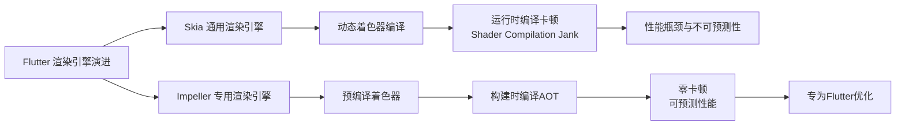
### 📊 Skia vs. Impeller 核心对比
| 维度 | Skia (传统引擎) | Impeller (新引擎) |
| :--- | :--- | :--- |
| **设计理念** | 通用2D图形库，支持Chrome、Android等多平台。 | **专为Flutter优化**，针对Flutter的渲染流程设计。 |
| **着色器处理** | **运行时动态编译**（JIT），首次使用时编译，可能导致**卡顿**。 | **构建时预编译**（AOT），所有着色器在编译阶段生成，**零运行时编译开销**。 |
| **性能表现** | 在低端设备或复杂动画场景下，易出现掉帧和卡顿。 | 首帧渲染时间大幅缩短，动画流畅度显著提升，帧率更稳定。 |
| **资源管理** | 动态分配，可能产生内存碎片，管理开销较大。 | 自建资源池，统一管理GPU资源，支持预分配和复用，内存占用更低。 |
| **平台适配** | 依赖桥接层，在iOS上性能损耗明显。 | 直接对接Metal（iOS）、Vulkan（Android），性能更接近原生。 |

 🐛 Skia 的核心问题与 Impeller 的解决方案
### 问题一：着色器编译卡顿（Shader Compilation Jank）
这是Skia最著名的性能问题。
*   **原理**：Skia使用SkSL（Skia Shading Language），这是一种在运行时根据绘图命令动态生成的着色器语言。当Flutter首次遇到一个新的绘制场景时，Skia需要：
    1. 生成SkSL代码。
    2. 将SkSL转换为GPU能理解的语言（如Metal SL或GLSL）。
    3. **在设备GPU上编译**这个着色器程序。
    这个编译过程可能耗时数百毫秒，导致数十帧的丢失，表现为界面卡顿或“白屏闪烁”。
*   **Impeller的解决方案**：**构建时预编译着色器**。Impeller的编译器模块在构建应用时，就将所有着色器源码编译为GPU可用的中间格式（如SPIR-V），并打包进应用。运行时直接使用，彻底消除了运行时编译带来的卡顿。
### 问题二：通用性带来的性能与优化限制
Skia是一个优秀的**通用**图形库，这既是优点也是缺点。
*   **限制**：为满足广泛的应用和平台需求，Skia包含了大量Flutter用不到的功能，其内部架构和优化方向无法完全贴合Flutter的特定渲染模式。例如，动态着色器编译是Skia的固有特性，Flutter难以完全优化。
*   **Impeller的解决方案**：**为Flutter量身定制**。Impeller可以专注于Flutter的渲染需求，采用更高效的算法和数据结构，例如使用**曲面细分（Tessellation）** 技术优化图形渲染，更高效地利用GPU。
### 问题三：架构与性能的不可预测性
*   **Skia**：其动态生成和编译着色器的机制，使得性能表现难以预测。同一个应用在不同设备、不同帧率下可能表现差异巨大。
*   **Impeller**：其设计目标之一就是**可预测的性能**。通过预编译和明确的资源管理，开发者可以更稳定地获得预期的渲染性能。
---
 🚀 Impeller 的架构优势与技术实现
Impeller采用了全新的分层架构，以实现高效渲染：
1.  **Aiks（高级绘图API）**：顶层接口，接收Flutter框架的绘制命令，并将其转换为更精细的实体。
2.  **Entities Framework（实体框架）**：核心组件。每个Entity是一个独立的渲染指令单元，包含变换矩阵、绘制内容等所有必要信息，是连接上层逻辑和底层GPU指令的桥梁。
3.  **HAL（硬件抽象层）**：为底层图形硬件提供统一接口，抽象了Metal、Vulkan、OpenGL等不同图形API的细节，确保Impeller的跨平台能力。
> 💡 **关键创新点**：Impeller大量使用现代图形API（如Metal和Vulkan）的特性，并实现了**多线程渲染**，可以并行处理多帧的工作负载，进一步提升了性能吞吐。
---
⚖️ 如何选择与迁移建议
| 场景 | 推荐引擎 | 说明 |
| :--- | :--- | :--- |
| **新项目开发** | **默认使用 Impeller** | Flutter 3.10+ 已在iOS默认启用，3.16+ 在Android API 29+ 默认启用，无需额外配置。 |
| **现有项目升级** | **逐步迁移至 Impeller** | 需注意首次迁移时可能出现渲染细节差异（字体、裁剪、纹理等），需进行充分测试。 |
| **特定老旧设备** | **可配置降级** | 若在特定设备（如搭载老旧GPU的机型）上遇到兼容性问题，可强制使用OpenGL后端作为兼容方案，兼顾稳定性与Impeller的核心优势。 |
| **需要极致兼容** | **保留 Skia 选项** | 对于需要支持非常老旧的Android设备或特殊图形驱动的项目，仍可保留Skia作为后端选项。 |
<details>
<summary>🔧 如何手动启用/切换渲染引擎？</summary>
**Android (Flutter 3.16+ 默认启用 Impeller Vulkan)**
```gradle
// 在 android/app/build.gradle 中
android {
    defaultConfig {
        // 可选：强制使用 OpenGL 后端（解决部分设备 Vulkan 兼容性问题）
        // manifestPlaceholders = [enableImpeller: "false"]
        manifestPlaceholders = [enableImpeller: "true", enableImpellerOpenGL: "true"]
    }
}
```
**iOS (Flutter 3.10+ 默认启用 Impeller Metal)**
```xml
<!-- 在 ios/Runner/Info.plist 中 -->
<key>FLTEnableImpeller</key>
<true/> <!-- 默认已启用 -->
<key>FLTEnableImpellerMetal</key>
<true/> <!-- 可选：明确使用 Metal 后端 -->
```
</details>
总而言之，Impeller通过**预编译着色器**和**专为Flutter优化的架构**，从根本上解决了Skia带来的性能瓶颈和卡顿问题，代表了Flutter渲染技术的未来。虽然迁移过程中可能遇到一些渲染细节的调整，但性能收益显著，值得投入精力进行适配和测试。


# 状态管理
## 1. setState->InheritedWidget->Provider->BLoC->GetX，各自的使用规模
根据项目复杂度和团队规模，Flutter 状态管理方案的选择路径清晰。以下是基于社区共识和项目实践总结的各方案适用规模：
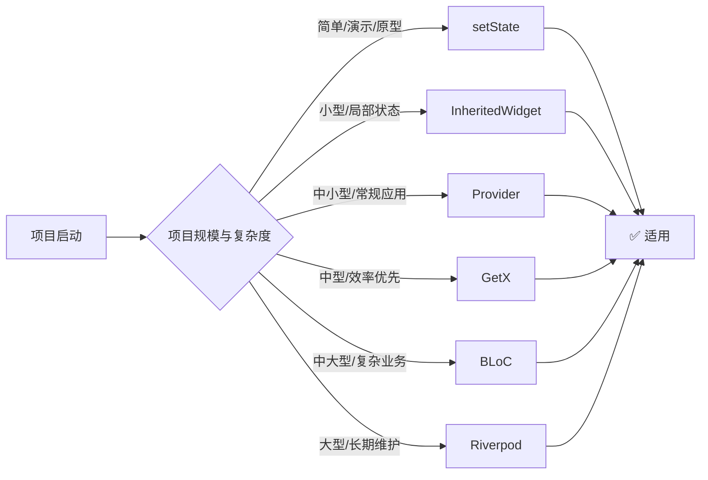
### 📊 各状态管理方案适用规模详解
| 方案 | 适用规模 | 核心特点 | 典型场景 |
| :--- | :--- | :--- | :--- |
| **`setState`** | **单页面/组件级** | 最简单直接，零依赖，但无法跨组件共享状态。 | 演示原型、表单输入、按钮状态等独立局部状态。 |
| **`InheritedWidget`** | **小型项目/简单共享** | Flutter原生机制，适合跨Widget层级传递数据，但样板代码较多，性能管理需手动处理。 | 共享主题、用户信息等简单全局数据，避免层层传参。 |
| **`Provider`** | **中小型项目** | 官方推荐，基于`InheritedWidget`封装，API简洁，轻量高效。 | 跨组件共享状态（如购物车、设置），是中小型应用的标准选择。 |
| **`GetX`** | **中小型/快速开发** | 全功能框架，集成状态、路由、依赖注入，代码极简，开发效率高。 | 快速原型、MVP、追求开发速度的商业项目。需注意大型项目中的维护风险。 |
| **`BLoC`** | **中大型/复杂业务** | 严格的业务逻辑与UI分离，基于流（Stream），可测试性和可维护性强，适合团队协作。 | 企业级应用、支付订单、多步骤流程等复杂业务逻辑。 |
| **`Riverpod`** | **大型/长期维护** | `Provider`的现代化演进，编译时安全、无`BuildContext`依赖、组合灵活，适用于架构质量要求高的项目。 | 大型应用的核心模块，对代码可维护性和安全性有极致要求。 |
> 💡 **选型建议**：遵循“最小必要”原则，从能解决问题的最简单方案开始，随着项目复杂度自然演进。例如，从`Provider`开始，遇到瓶颈时再考虑`Riverpod`或`BLoC`。
<details>
<summary>📖 深入理解：为什么不同规模要选不同的方案？</summary>
核心在于平衡**开发效率**、**代码可维护性**和**团队学习成本**：
*   **小规模**：状态简单，使用`setState`或`InheritedWidget`足以，引入复杂框架反而增加不必要的抽象和模板代码。
*   **中小规模**：状态开始复杂，需要跨组件共享。`Provider`提供了恰到好处的抽象，是官方推荐和社区主流，能兼顾效率和规范。
*   **中大规模**：业务逻辑复杂，需要清晰的分层和严格的单向数据流。`BLoC`的模式和`Riverpod`的编译时安全能有效管理复杂度，降低长期维护成本。
*   **效率与维护的权衡**：`GetX`以极简语法追求开发效率，但过度封装可能在大型项目中埋下维护隐患。而`BLoC`虽有模板代码，但其清晰的事件-状态模型是大型团队协作的坚实基础。
</details>

## 2. BLoc的核心思想？Stream作为状态管道的优缺点
### 🎯 BLoC 核心思想
BLoC（Business Logic Component）的核心思想是 **“将业务逻辑与UI完全分离”**，通过 **事件驱动** 和 **单向数据流** 来管理状态。其工作流程形成一个清晰的闭环：
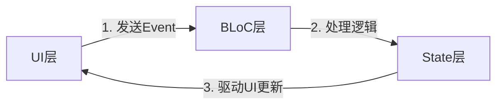
具体而言：
1.  **输入（Event）**：用户操作（如点击按钮）或系统事件被封装为事件对象，发送给BLoC。
2.  **处理（BLoC）**：BLoC接收事件，执行纯业务逻辑（如网络请求、计算），并生成新的状态。
3.  **输出（State）**：BLoC通过`emit()`发出新的状态对象，UI层监听状态变化并重新渲染。
这种模式强制实现了关注点分离，使得业务逻辑可以独立于UI进行测试和复用，极大地提升了代码的可维护性。
---
### 🔄 Stream 作为状态管道的优缺点
BLoC模式的核心实现依赖于Dart的 `Stream` 和 `StreamController`，它构成了状态流动的“管道”。以下是使用Stream作为状态管理的利弊分析：
### ✅ 优点
| 优点 | 说明 | 引用 |
| :--- | :--- | :--- |
| **响应式编程** | 天然支持异步数据流，能优雅处理用户输入、网络请求等事件序列。 |  |
| **关注点分离** | 业务逻辑被封装在BLoC类中，与UI组件解耦，代码结构清晰，易于维护。 |  |
| **高可测试性** | BLoC是纯Dart类，不依赖任何UI框架，可以轻松编写单元测试。 |  |
| **逻辑复用** | 同一个BLoC实例可以在多个UI组件中被共享和复用，避免重复代码。 |  |
| **精确控制更新** | 通过`StreamBuilder`或`BlocBuilder`，可以只重建依赖特定状态的UI部分，性能优化精准。 |  |
### ❌ 缺点
| 缺点 | 说明 | 引用 |
| :--- | :--- | :--- |
| **学习曲线陡峭** | 需要理解响应式编程、Stream、Sink、Subject等概念，对新手不够友好。 |  |
| **样板代码较多** | 需要定义Event、State类，并实现映射逻辑，相比其他方案代码量更大。 |  |
| **资源管理责任** | 需要手动关闭`StreamController`和取消订阅，否则可能导致内存泄漏。 |  |
| **可能过度设计** | 对于非常简单的状态（如单个按钮开关），引入完整的BLoC模式可能显得臃肿。 |  |

### 💡 选型建议：何时选择BLoC？
BLoC最适合 **中大型、业务逻辑复杂的应用**，尤其是对代码可维护性和团队协作有高要求的项目。如果你的应用需要处理复杂的表单、多步骤业务流程、实时数据同步或需要严格的可测试性，BLoC的架构优势将非常明显。
> ⚠️ **注意**：对于简单页面或快速原型，可以考虑更轻量的方案（如Provider、GetX），以避免“过度设计”。

## 3. GetX的响应式原理？obs变量的Rx机制是如何追踪依赖的
### 1. GetX 响应式原理核心：极简的“发布-订阅”模式
GetX 的响应式原理并不复杂，它没有使用 Flutter 框架层的 `InheritedWidget` 或 `Element` 依赖机制，而是自己在 Dart 层实现了一套轻量级的 **发布-订阅 (Publisher-Subscriber)** 模式。
其核心流程如下：
1.  **订阅**：当 UI 组件（通过 `Obx` 或 `GetBuilder`）读取响应式变量（如 `RxInt`）时，会自动将自己注册为该变量的监听者。
2.  **通知**：当变量值发生变化（如赋值操作）时，变量对象会遍历其监听者列表，发送通知。
3.  **更新**：监听者收到通知后，直接触发组件的 `setState`（或底层 `markNeedsBuild`），强制刷新 UI。
---
### 2. `Rx` 机制如何追踪依赖？
这是 GetX 最“黑魔法”的部分。它通过一个全局的 **上下文钩子** 来捕获依赖关系。
#### **核心参与者：**
1.  **`Rx` 对象 (发布者)**：继承自 `RxNotifier`，内部维护了一个监听者列表 `Map<GetStream, void Function(StreamSubscription)>`。
2.  **`RxImpl` / `GetStream`**：具体的流实现，负责管理数据的流动。
3.  **`GetObserver` (全局拦截器)**：GetX 会在 Flutter 的 `WidgetsBinding` 中注入一个自定义的 `GetObserver`，用于拦截所有 Widget 的构建过程。
4.  **`Obx` / `RxWidget` (订阅者)**：这是 UI 组件的包装器。
#### **追踪流程 (源码级解析)：**
**第一步：开启监听**
当你使用 `Obx(() => Text(controller.count.value))` 时，`Obx` 内部会调用 `GetObserver` 开始监听。它设置一个全局标记，表示“现在处于依赖收集模式”。
**第二步：触发 Getter**
`Obx` 的 `builder` 函数被执行。当读取 `controller.count.value` 时，会触发 `Rx` 类的 `get value` 方法。
**第三步：注册依赖**
在 `get value` 内部，GetX 会检查当前是否有激活的“监听上下文”（即 `Obx`）。如果有，它会将当前 `Obx` 的刷新回调函数添加到 `count` 这个 `Rx` 对象的监听者列表中。
*   *本质*：`Rx` 变量记住了“谁正在使用我”。
**第四步：移除依赖**
`Obx` 构建完成，关闭“依赖收集模式”。至此，`Rx` 变量与 `Obx` 建立了 1对1 的绑定关系。
**第五步：变更通知**
当你执行 `controller.count++` 时，实际上调用了 `set value`。
*   `Rx` 对象对比新旧值，发现不同。
*   它遍历自己的监听者列表，找到之前注册的 `Obx` 回调。
*   执行回调，触发 UI 更新。
---
### 3. 代码演示与总结
```dart
// 1. 定义响应式变量
var count = 0.obs; 
// 2. UI 绑定
Obx(() => Text("${controller.count.value}"))
/** 内部发生了什么？
 * 
 * [Obx 开始构建] -> [开启全局监听]
 *      ⬇
 * [读取 count.value] -> [Rx 检测到监听环境] -> [将 Obx 的更新函数加入 count 的订阅列表]
 *      ⬇
 * [Obx 构建结束] -> [关闭全局监听]
 * 
 * [用户操作: count++]
 *      ⬇
 * [Rx value setter 被调用] -> [遍历订阅列表] -> [调用 Obx 更新函数] -> [UI 刷新]
 */
```
### 总结
GetX 的 `Rx` 机制通过 **全局构建拦截** + **Getter 副作用** 实现了自动依赖追踪。
*   **优点**：无需手动管理 `addListener`，代码极度简洁，自动识别最小更新范围。
*   **缺点**：依赖全局静态变量（污染风险），且必须在 `Obx` 等 GetX 组件上下文中读取 `.value` 才能建立绑定，否则无法追踪。

## 4. Provider的ChangeNotifierProvider和StreamProvider的区别
`ChangeNotifierProvider` 和 `StreamProvider` 是 Provider 中两种最常用的数据源提供方式，核心区别在于 **状态管理的模型** 和 **数据更新的触发机制**。
### 1. 核心区别总结
| 维度 | ChangeNotifierProvider | StreamProvider |
| :--- | :--- | :--- |
| **数据源类型** | **主动型**：继承自 `ChangeNotifier` 的自定义类。 | **被动型**：Dart 原生的 `Stream` 对象。 |
| **更新机制** | 调用 `notifyListeners()` 手动触发通知。 | `Stream` 发出新数据事件 自动触发。 |
| **状态管理** | **可变状态**：直接修改对象内部的属性。 | **不可变状态**：每次更新发送一个新的数据对象。 |
| **适用场景** | 传统的面向对象业务逻辑、Flutter 原生风格。 | 数据库监听、实时通信、平台事件流、响应式编程。 |

### 2. ChangeNotifierProvider：传统的“通知者”模式
它是 Flutter 官方推荐的最标准模式，通常用于封装业务逻辑。
*   **原理**：
    *   Model 类混入 `ChangeNotifier` mixin。
    *   UI 通过 `Consumer` 或 `context.watch` 订阅。
    *   当数据改变时，必须显式调用 `notifyListeners()`，Provider 会通知所有监听者重建。
*   **代码特征**：
    ```dart
    // 1. Model：可变状态
    class Counter extends ChangeNotifier {
      int _count = 0;
      int get count => _count;
      
      void increment() {
        _count++;          // 修改内部状态
        notifyListeners(); // 👈 手动触发通知
      }
    }
    
    // 2. Providing
    ChangeNotifierProvider(create: (_) => Counter())
    
    // 3. Consuming
    Consumer<Counter>(builder: (_, counter, __) => Text('${counter.count}'))
    ```
*   **优缺点**：
    *   ✅ 符合面向对象思维，适合封装复杂的业务逻辑。
    *   ❌ 容易忘记调用 `notifyListeners()` 导致 UI 不更新；因为是可变状态，调试时追踪状态变化历史较难。
---
### 3. StreamProvider：响应式的“流”模式
它是对 Dart `Stream` 的封装，适用于数据随时间推移不断产生的场景。
*   **原理**：
    *   它监听一个 `Stream`，每次 `Stream` 发出新的数据事件，Provider 就会捕获这个新数据并通知 UI 更新。
    *   它将 Stream 的“推送”机制转换为 Widget 的“重建”机制。
*   **代码特征**：
    ```dart
    // 1. 数据源：不可变数据流
    Stream<int> counterStream() {
      return Stream.periodic(Duration(seconds: 1), (x) => x + 1);
    }
    
    // 2. Providing
    StreamProvider<int>(create: (_) => counterStream(), initialData: 0)
    
    // 3. Consuming
    Consumer<int>(builder: (_, count, __) => Text('$count'))
    ```
*   **典型场景**：
    *   **Firebase**：监听 Firestore 文档变化（`Firestore.instance.collection('...').snapshots()`）。
    *   **平台通道**：监听原生代码发来的 Event（如 GPS 位置更新、网络状态变化）。
    *   **状态管理演进**：作为连接 `BLoC` 或 `Riverpod` 的桥梁。
*   **优缺点**：
    *   ✅ **声明式**：UI 只需响应数据流的变化，无需关心业务逻辑细节。
    *   ✅ **不可变性**：每次都是新数据，易于测试和追踪。
    *   ❌ 需要理解 Stream 操作符（`map`, `where` 等），学习曲线较陡。
---
### 4. 如何选择？
*   **选 `ChangeNotifierProvider`**：
    *   如果你在写一个标准的 App 业务逻辑（如购物车、用户信息管理、表单状态）。
    *   如果你习惯面向对象编程，需要持有状态并在方法中修改它。
*   **选 `StreamProvider`**：
    *   如果你的数据源本身就是流（如 Firebase、WebSocket、位置服务）。
    *   如果你追求完全的响应式编程，喜欢处理不可变数据。
> **注意**：在实际开发中，`ChangeNotifierProvider` 使用频率远高于 `StreamProvider`，因为它更适合构建 App 的核心业务逻辑层。`StreamProvider` 更多用于对接外部数据源。

## 5. Riverpod解决了Provider的什么问题
Riverpod 作为 Provider 的“升级版”，其核心设计目标是解决 Provider 在复杂应用中暴露的**架构性缺陷**。通过分析多个来源，我们可以清晰地梳理出它主要解决了以下四大类问题：
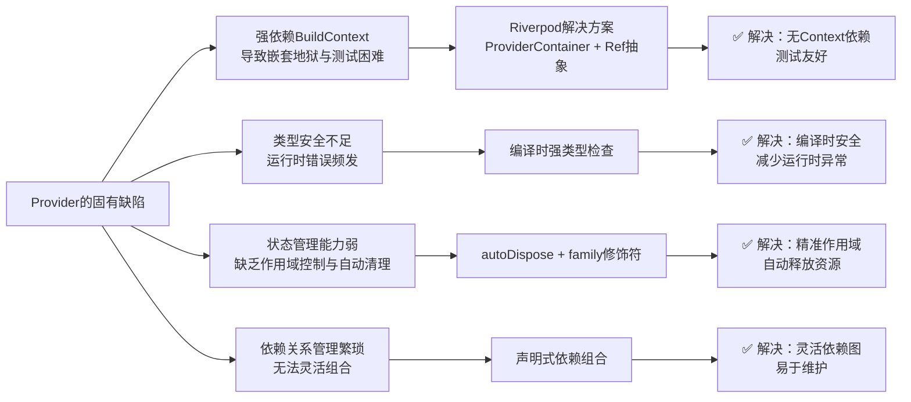
### 🔧 核心问题一：强依赖 BuildContext 的限制
Provider 基于 Flutter 的 `InheritedWidget` 机制，这带来了明显的局限性：
- **访问受限**：状态必须在 Widget 树内通过 `BuildContext` 获取，在纯 Dart 业务逻辑层、异步回调或非 Widget 类中难以使用。
- **嵌套冗余**：为了在不同作用域（全局、页面级）共享状态，需要多层嵌套 `MultiProvider`，导致代码结构复杂，形成“嵌套地狱”。
- **测试困难**：测试时需要模拟 `BuildContext`，增加了测试成本。
**Riverpod 的解决方案**：引入 `ProviderScope` 和 `ProviderContainer`，将状态管理从 Widget 树中完全解耦。所有 Provider 注册在独立的容器中，通过 `ref` 对象（而非 `BuildContext`）即可在任何地方访问状态。这彻底解决了上述三个子问题。
### 🛡️ 核心问题二：类型安全不足
Provider 存在显著的类型安全隐患：
- **运行时错误**：使用 `Provider.of<T>(context)` 时，如果类型 `T` 错误或 Provider 不存在，会在运行时抛出 `ProviderNotFoundException`。
- **缺乏编译期检查**：依赖字符串名称或类型查找 Provider，IDE 无法提供有效帮助，重构时容易遗漏修改。
**Riverpod 的解决方案**：基于 Dart 的泛型系统实现了**完全的编译时类型安全**。定义 Provider 时指定类型，访问时编译器会自动检查类型匹配，将大部分错误拦截在编译阶段，大大减少运行时异常。
### ⚙️ 核心问题三：状态管理能力弱
Provider 在状态生命周期和作用域控制上存在不足：
- **无自动清理**：状态不会被自动销毁，可能导致内存泄漏，尤其是当 Provider 持有流、定时器等资源时。
- **作用域混乱**：缺乏细粒度的作用域控制，全局状态和局部状态难以区分，可能导致不必要的全局状态污染。
- **异步支持不统一**：处理异步状态（如网络请求）需要使用 `FutureProvider` 或 `StreamProvider`，但与同步状态管理模型割裂，且处理加载/错误状态较为繁琐。
**Riverpod 的解决方案**：
- **`autoDispose` 修饰符**：让 Provider 在不再被监听时自动销毁，释放资源，防止内存泄漏。
- **`family` 修饰符**：支持基于参数创建多个独立实例，实现更细粒度的状态隔离。
- **统一的异步模型**：通过 `AsyncNotifierProvider` 和 `AsyncValue` 统一处理同步/异步状态，内置加载、数据、错误三种状态，简化异步逻辑。
### 🧩 核心问题四：依赖关系管理繁琐
Provider 在处理多个状态之间的依赖关系时较为笨拙：
- **组合困难**：多个 Provider 之间需要手动组合，缺乏声明式的依赖管理机制。
- **依赖传递复杂**：一个 Provider 依赖另一个 Provider 时，需要通过构造函数或 `ProxyProvider` 传递，代码冗余。
**Riverpod 的解决方案**：通过 `ref.watch()` 和 `ref.read()` 建立了**声明式的依赖图**。一个 Provider 可以轻松地监听其他 Provider 的变化，自动重新计算，依赖关系清晰且易于维护。这支持了强大的状态组合能力，符合响应式编程范式。
### 📊 Provider 与 Riverpod 核心差异对比
| 特性维度 | Provider | Riverpod | 解决的问题 |
| :--- | :--- | :--- | :--- |
| **架构依赖** | 依赖 `BuildContext` 与 `InheritedWidget` | 独立于 Widget 树，基于 `ProviderContainer` | 无 Context 限制，测试友好，告别嵌套地狱 |
| **类型安全** | 运行时检查，可能抛出 `ProviderNotFoundException` | **编译时强类型安全** | 错误提前发现，重构安全，IDE 支持好 |
| **状态生命周期** | 无自动清理，需手动管理 | **`autoDispose` 自动销毁** | 防止内存泄漏，资源管理高效 |
| **作用域控制** | 作用域固定，嵌套层级多 | **`family` 精准作用域** | 细粒度隔离，避免全局污染 |
| **异步支持** | `FutureProvider`/`StreamProvider` 分离处理 | **统一 `AsyncValue` 模型** | 简化异步状态管理，逻辑集中 |
| **依赖关系** | 手动组合，`ProxyProvider` 较复杂 | **声明式依赖图 (`ref.watch`)** | 组合灵活，依赖清晰，易于维护 |
### 💡 总结：为什么推荐新项目使用 Riverpod？
Riverpod 并非简单的语法糖，而是对状态管理方式的**根本性重构**。它从第一性原理出发，解决了 Provider 的设计缺陷，提供了更安全、更灵活、更易维护的解决方案。
> **核心结论**：对于**新项目，尤其是中大型或对代码质量有要求的项目，强烈推荐直接采用 Riverpod**。它已从实验性技术成长为 Flutter 生态中稳定、高效、现代的状态管理方案，完全适配 Flutter 3.x 和 Dart 的新特性。迁移成本相对较低，但长期收益——在代码可维护性、类型安全性和开发效率上——非常显著。

## 6. 你做的BLE项目为什么选择GetX，如果重做会选什么(参考问题1)
这是一个非常具有反思意义的项目复盘问题。BLE（蓝牙低功耗）项目具有其独特的业务特征，当初选择 GetX 以及现在的反思都应基于这些特征展开。
### 1. 当初为什么选择 GetX？
在当时的 BLE 项目背景下，选择 GetX 主要是基于**开发效率**和**业务特性**的考量：
*   **快速验证与交付压力**：
    BLE 硬件开发往往涉及联调，硬件端的不稳定性（固件Bug、连接中断）会导致软件端需要频繁修改逻辑。GetX 的“极速开发”特性（少模板代码、无需 Context）让我们能快速调整 UI 和业务逻辑，应对频繁变更。
*   **路由管理的便利性**：
    BLE App 的典型流程是：`扫描页 -> 连接中 -> 服务列表 -> 数据交互页`。GetX 的路由管理（`Get.to()`）非常轻量，且支持**路由守卫**（`GetMiddleware`），这在处理“未连接设备禁止进入详情页”等权限逻辑时非常直观。
*   **响应式编程与 Stream 的天然契合**：
    **这是最关键的一点**。BLE 的核心数据（设备扫描结果、连接状态、特征值变化）本质上都是 `Stream`。
    GetX 的 `Rx` 变量和 `GetBuilder` 可以非常容易地封装蓝牙插件的 Stream 事件。
    *   *例子*：将蓝牙连接状态（`BluetoothDeviceState`）直接映射为 `.obs` 变量，UI 层只需写 `Obx(() => Text(device.state.value))`，无需手动管理 StreamSubscription，极大简化了代码。
*   **全局状态管理**：
    BLE 设备一旦连接，往往是一个“全局单例”的概念（当前连的是哪个设备）。GetX 的依赖注入（`Get.put`）可以很方便地在任意页面获取当前设备实例，避免了 Context 传递的繁琐。
---
### 2. 如果重做，我会选择什么？
如果现在重做这个 BLE 项目，我会毫不犹豫地选择 **Riverpod (推荐) 或 BLoC**。
我倾向于 **Riverpod**，原因如下：
#### **(1) 解决“状态与生命周期”的痛点**
BLE 项目最大的坑在于**生命周期管理**。
*   **GetX 的问题**：GetX 的 Controller 默认是“长生不老”的（除非手动 `Get.delete`）。在 BLE 场景中，用户经常会在设备详情页断开连接并返回扫描页。如果忘记手动清理 Controller 中的 Stream 订阅，会导致内存泄漏，甚至出现“明明已经断开了，UI 还显示连接中”的幽灵 Bug。
*   **Riverpod 的优势**：`autoDispose` 修饰符是杀手锏。当用户退出页面（没有监听者）时，Provider 会自动销毁，我可以在 `ref.onDispose` 中统一处理蓝牙断开连接、关闭 Stream 订阅等逻辑。**这从根本上解决了资源释放问题。**
#### **(2) 处理异步数据的优雅性**
BLE 操作全是异步的（扫描中、连接中、连接成功、连接失败）。
*   **GetX 的问题**：需要手动维护一个 `State` 枚举（loading, success, error），并在 UI 中写大量的 `if-else` 判断。
*   **Riverpod 的优势**：使用 `AsyncValue`。它自带 `.when` 方法，自动处理 `loading`、`error`、`data` 三种状态，代码结构极其清晰，无需手动管理状态枚举。
#### **(3) 避免全局污染与单例陷阱**
*   **GetX 的问题**：GetX 依赖全局单例。如果有天产品经理要求“同时连接两台设备”，基于 GetX 的全局静态变量架构会面临巨大的重构风险。
*   **Riverpod 的优势**：使用 `family` 修饰符，我可以轻松创建基于 `deviceId` 的 Provider 实例，天然支持多设备连接场景，扩展性极强。
#### **(4) 类型安全与编译保障**
GetX 太过灵活（甚至支持动态路由），在大型项目中容易出现运行时错误。Riverpod 的编译时检查能给 BLE 这种底层逻辑复杂的模块提供更多安全感。

### 3. 总结与对比
| 维度 | GetX (当初的选择) | Riverpod (现在的选择) |
| :--- | :--- | :--- |
| **核心诉求** | **速度**：快速上线，代码量少。 | **稳健**：资源管理安全，架构可扩展。 |
| **生命周期** | **手动管理**：需在 `onClose()` 记得释放资源。 | **自动管理**：`autoDispose` 自动断开连接和释放流。 |
| **异步处理** | **手动判断**：维护 `isLoading` 变量。 | **内置支持**：`AsyncValue` 完美处理 BLE 的连接状态流转。 |
| **多设备支持** | **困难**：全局单例模式难以扩展。 | **原生支持**：`family` 修饰符轻松隔离多设备状态。 |
**结论**：
对于一个**Demo、原型或极其简单的单设备工具类 App**，GetX 依然是效率之王。
但对于**正规的商业级 BLE 项目**，尤其是考虑到长期维护、多设备扩展和复杂的生命周期管理，**Riverpod 的架构优势足以抵消其稍高的学习成本**，是更明智的选择。


# Platform Channel和原生混编
## 1. Platform Channel的三种类型(MethodChannel /EventChannel/ BasicMessageChannel)的区别
Platform Channel 是 Flutter 与原生平台（Android/iOS）通信的桥梁。这三种 Channel 的核心区别在于**通信模式**（单向调用 vs 双向流）和**数据交互方式**。
以下是详细的对比解析：
### 📊 核心区别概览
| 类型 | 通信模式 | 数据流向 | 核心用途 | 类比 |
| :--- | :--- | :--- | :--- | :--- |
| **MethodChannel** | **请求-响应** | 单次双向 | 调用原生方法并获取返回值 | `HTTP 请求` (Call API) |
| **EventChannel** | **原生 -> Flutter** | 持续单向 | 监听原生端的持续变化 | `WebSocket / Stream` |
| **BasicMessageChannel** | **消息传递** | 双向随意 | 自定义协议、高频二进制通信 | `Socket 原始通道` |

### 1. MethodChannel (方法调用通道)
这是最常用、最基础的 Channel。
*   **原理**：
    *   Flutter 发起一个方法调用，传递参数。
    *   原生端接收调用，执行逻辑，返回结果或错误。
    *   交互结束，连接断开。
*   **使用场景**：
    *   调用一次性功能：如**打开相机、获取电池电量、拨打电话、支付 SDK 调用**。
    *   需要原生计算并立即返回结果的场景。
*   **代码特征**：
    ```dart
    // Flutter 端
    final result = await platform.invokeMethod('getBatteryLevel');
    // 一次调用，一次返回，结束
    ```
### 2. EventChannel (事件流通道)
它基于 `Stream` 实现，专门用于处理持续的、多次的数据推送。
*   **原理**：
    *   Flutter 端监听。
    *   原生端准备好数据流，可以多次发送数据给 Flutter。
    *   Flutter 端取消监听时，原生端停止发送。
*   **使用场景**：
    *   **传感器数据**：加速度计、陀螺仪、GPS 位置更新。
    *   **连接状态监听**：蓝牙连接状态、网络状态变化。
    *   **持续的数据推送**：原生端下载进度回调。
*   **代码特征**：
    ```dart
    // Flutter 端
    EventChannel('accelerometer').receiveBroadcastStream().listen((event) {
      // 持续接收到数据
    });
    ```
### 3. BasicMessageChannel (基础消息通道)
这是最底层的通信方式，它不封装“方法调用”或“流”的概念，只是单纯的**消息收发**。
*   **原理**：
    *   使用自定义的消息编解码器。
    *   双方都可以随时向对方发送消息。
    *   支持全双工通信（Flutter <-> Native 互相发消息）。
*   **使用场景**：
    *   **高频通信**：MethodChannel 的封包解包有一定开销，如果是高频的少量数据（如实时同步编辑器内容），BasicMessageChannel 效率更高。
    *   **二进制数据传输**：传输图片原始数据、大文件块。
    *   **自定义协议**：如果你觉得 MethodChannel 的语义太重，想实现一套自己的通信协议。
*   **代码特征**：
    ```dart
    // Flutter 端
    final channel = BasicMessageChannel<String>('foo', StringCodec());
    channel.setMessageHandler((String? message) async {
      // 接收来自原生的消息
      print(message);
    });
    channel.send('Hello Native'); // 发送消息给原生
    ```
---
### 💡 总结与选型建议
1.  **绝大多数情况（95%）**：首选 **MethodChannel**。它符合直觉，能满足大多数功能调用需求。
2.  **需要持续监听数据**：选择 **EventChannel**。典型的就是传感器、蓝牙状态、GPS等。
3.  **追求极致性能或自定义协议**：选择 **BasicMessageChannel**。当 MethodChannel 成为性能瓶颈，或者需要双向持续对话时使用。

## 2. MethodChannel的通信是异步的，底层BinaryMessenger的实现原理
### 1. MethodChannel 的异步特性
MethodChannel 的通信之所以是异步的，主要基于以下两个原因：
1.  **跨线程通信的必然性**：
    *   Flutter 的 UI 运行在 **UI Runner**（对应 iOS 的 Main Thread / Android 的 Main Thread）。
    *   原生平台的插件逻辑通常也运行在主线程。
    *   虽然它们可能在同一个线程（如 iOS），但为了防止平台卡顿导致 Flutter UI 卡死，通信机制被设计为 **非阻塞**。Flutter 发起调用后立即返回一个 `Future`，不会暂停 Dart 代码的执行去等待原生返回。
2.  **底层架构的设计**：
    *   底层的 `BinaryMessenger` 接口定义就是异步的。
    *   当 Dart 调用 `invokeMethod` 时，消息被放入发送队列，Dart 代码继续执行。当原生处理完毕发回消息时，Dart 再通过回调处理结果。
---
### 2. 底层 BinaryMessenger 的实现原理
`BinaryMessenger` 是 Platform Channel 的核心运输层。它是一个抽象接口，具体的实现在不同平台略有不同，但核心流程一致。以 **Android** 端为例，其实现类是 `FlutterNativeView` (旧架构) 或 `FlutterJNI` / `DartExecutor` (新架构)。
#### 核心架构流程：
```mermaid
flowchart TD
    A[Dart端: MethodChannel] -->|编码消息| B[Dart端: BinaryMessenger]
    B -->|Dart_PostCObject| C[Native Engine (C++)]
    C -->|JNI / Platform Pipe| D[Platform端: BinaryMessenger]
    D -->|解码消息| E[Platform端: MethodChannel.Handler]
    
    E -->|处理逻辑| F[生成结果]
    F -->|编码结果| D
    D -->|JNI / Platform Pipe| C
    C -->|SendPort| B
    B -->|解码结果| A
```
#### 详细实现步骤：
**第一步：Dart 端发送**
*   `MethodChannel` 将调用参数序列化为二进制数据（StandardMessageCodec）。
*   调用 `BinaryMessenger.send(String channel, ByteData message)`。
*   底层通过 `dart:ui` 的原生 API（如 `_sendPlatformMessage`）将二进制数据传递给 Flutter Engine（C++ 层）。
**第二步：Engine 中转**
*   Flutter Engine 接收到二进制消息。
*   **关键点**：Engine 维护了一个消息路由表。
*   在 Android 上，Engine 通过 JNI 调用 Java 层的 `BinaryMessenger` 实现，将消息传递给原生主线程的消息队列。
**第三步：Platform 端接收**
*   原生端的 `BinaryMessenger`（如 Android 的 `FlutterJNI`）接收到消息。
*   根据通道名称查找注册的 `MessageHandler`。
*   `MethodChannel` 内部封装了一个 `MethodCallHandler`，它先解码二进制数据为 `MethodCall` 对象，然后回调给开发者的业务代码。
**第四步：响应回传**
*   开发者在原生代码中调用 `result.success(data)`。
*   `MethodChannel` 将数据编码回二进制。
*   调用 `BinaryMessenger.handlePlatformMessageResponse`（或类似方法）。
*   数据再次通过 JNI -> Engine -> Dart VM。
**第五步：Dart 端回调**
*   Dart VM 通过 `ReceivePort` 收到二进制数据。
*   `BinaryMessenger` 解码数据，触发 `Completer` 的 `complete` 方法，最终执行 `await` 之后的代码或 `.then()` 回调。
### 总结
`BinaryMessenger` 是一个**二进制消息的“邮递员”**：
1.  它不关心消息内容（只处理 `ByteData`），序列化/反序列化由上层 Codec 负责。
2.  它负责**线程调度**（Dart UI Runner <-> Platform Main Thread）。
3.  它维护了一张**路由表**（Channel Name -> Handler），确保消息准确送达对应的处理者。

## 3. Flutter调用原生代码的性能开销有多大，频繁调用时如何优化
Flutter 调用原生代码确实存在显著的性能开销。如果不加控制地频繁调用，会严重影响应用性能，导致掉帧。
以下是开销的具体构成分析以及针对频繁调用的优化策略。

### 一、 性能开销有多大？
Platform Channel 的通信过程可以概括为：**Dart -> 序列化 -> C++ Engine -> JNI/Platform -> 反序列化 -> 原生代码**。
其开销主要由以下三部分组成：
1.  **序列化与反序列化**：
    *   **最大瓶颈**。Flutter 默认使用 `StandardMessageCodec`，将 Dart 对象转换为二进制数据，原生端再转回原生对象。
    *   如果传递复杂对象（如大型 List、Map），CPU 消耗巨大，会产生大量的临时对象，增加 GC（垃圾回收）压力。
2.  **线程上下文切换**：
    *   Flutter 的 UI 运行在 UI Runner，原生代码通常运行在主线程。
    *   消息传递涉及跨线程通信，需要通过 Engine 中转。虽然这在现代手机上很快，但依然存在微秒级的延迟和锁竞争成本。
3.  **JNI / FFI 桥接成本**：
    *   在 Android 上，通过 JNI 调用 Java 方法本身有一定开销。
**结论**：一次简单的 MethodChannel 调用通常在 **1ms - 10ms** 之间（取决于数据量和设备性能）。虽然看起来很短，但如果在每一帧（16ms）内调用多次，或者传递大量数据，极易导致 UI 卡顿。
---
### 二、 频繁调用时的优化策略
针对频繁调用的场景（如实时数据传输、高频传感器、像素级交互），可以采用以下几种进阶优化方案：
#### 1. 批量聚合调用 —— 减少次数
这是最简单且最有效的优化手段。
*   **原理**：不要每产生一个数据就调用一次原生方法。在 Dart 端或原生端维护一个缓冲区，积攒一定数量（如每 10 个数据）或一定时间（如每 100ms）后，统一发送一次。
*   **场景**：高频日志上报、批量传感器数据上传。
*   **实现**：
    ```dart
    // 优化前：循环调用 100 次
    for (var item in items) {
      await platform.invokeMethod('addItem', item);
    }
    // 优化后：聚合调用 1 次
    await platform.invokeMethod('addItems', items);
    ```
#### 2. 使用 BasicMessageChannel 替代 MethodChannel
*   **原理**：`MethodChannel` 在每次调用时都会进行方法名称的字符串查找和校验，且语义上是“远程过程调用”，封装层级较高。
*   **优化**：`BasicMessageChannel` 更轻量，直接进行二进制消息传递，省去了方法查找的开销，适合高频、简单的数据通信。
#### 3. 使用 BinaryCodec 或 StringCodec (自定义编解码)
*   **原理**：默认的 `StandardMessageCodec` 为了通用性牺牲了性能。如果你能控制两端的数据格式，可以使用 `BinaryCodec` 直接传递二进制数据（如 Protocol Buffers、FlatBuffers 或纯 Byte数组），跳过繁琐的自动序列化过程。
*   **优化**：直接传递 `ByteBuffer`，在原生层通过指针操作解析，效率极高。
*   **代码示例**：
    ```dart
    // 使用 BasicMessageChannel + BinaryCodec 传递原始字节
    final channel = BasicMessageChannel<ByteData>('high_perf_channel', BinaryCodec());
    channel.send(byteData);
    ```
#### 4. 终极方案：dart:ffi (Foreign Function Interface)
对于**极致性能**要求的场景，Platform Channel 并不是最佳选择。
*   **原理**：FFI 允许 Dart 代码直接调用 C/C++ 库中的函数，**完全绕过了 Platform Channel 的消息机制、序列化和 JNI 桥接**。
*   **优势**：
    *   零拷贝或低拷贝数据传输。
    *   调用延迟从毫秒级降低到微秒级甚至纳秒级。
    *   可以在 Dart 的后台 isolate 中直接运行，完全不阻塞 UI。
*   **适用场景**：
    *   图像处理（如 OpenCV）。
    *   音视频编解码。
    *   大量数学计算。
    *   游戏物理引擎。
*   **架构变化**：
    *   *传统*：Dart -> Platform Channel -> Java/Kotlin (JVM) -> C/C++ (JNI)
    *   *FFI*：Dart -> C/C++ (直接内存共享)
#### 5. 异步流处理
如果数据是单向持续的，使用 `EventChannel` 或自定义 Stream。
*   不要在原生端频繁回调 Dart，而是在原生端开启一个 Stream。
*   Dart 端通过 `listen` 订阅。
*   虽然底层机制类似，但 Stream 模式能更好地利用背压机制，防止数据洪峰冲垮 UI 线程。
### 三、 优化方案对比表
| 方案 | 开发成本 | 性能提升 | 适用场景 |
| :--- | :--- | :--- | :--- |
| **批量聚合** | 低 | 中 | 偶发高频调用，逻辑简单 |
| **BasicMessageChannel** | 中 | 中 | 高频小数据通信 |
| **自定义二进制协议** | 高 | 高 | 大数据量传输，对体积敏感 |
| **dart:ffi** | 高 | **极高** | 计算密集型、图像/音视频处理 |
### 总结
**避免在帧回调（如 `Ticker`、`Animation`）中调用 Platform Channel**。
如果必须在每帧进行交互（例如自定义渲染引擎），**FFI** 是唯一的可行之路。对于普通的业务场景，**批量聚合**和**减少跨语言调用次数**是性价比最高的优化手段。

## 4. PlatformView(AndroidView/UiKitView)的性能问题和替代方案
PlatformView 是 Flutter 接入原生视图（如地图、WebView、相机预览）的桥梁。虽然它解决了“有和无”的问题，但在性能上一直存在争议。
以下是关于 PlatformView 的性能瓶颈分析以及替代方案。

### 一、 PlatformView 的性能问题根源
PlatformView 的性能问题主要集中在 **Android** 端，iOS 端相对较好但也有局限。
#### 1. Android 端的“模式之痛”
Android 平台经历了两种渲染模式的演变，各自存在不同的性能瓶颈：
*   **Virtual Display (虚拟显示模式 - 旧版/兼容模式)**：
    *   **原理**：将原生 View 渲染到一个虚拟的 Display 上，Flutter Engine 读取 Display 产生的纹理，再绘制到 Flutter 画布上。
    *   **性能坑点**：
        *   **双倍绘制**：原生 View 先画在虚拟屏幕，Flutter 再画在真实屏幕，增加了 GPU 负担。
        *   **内存拷贝**：像素数据的拷贝消耗大量内存和 CPU/GPU 带宽。
        *   **手势问题**：手势事件需要从 Flutter 层转发，转发链路长，容易丢失或延迟，导致“触摸不灵敏”。
*   **Hybrid Composition (混合合成模式 - 推荐模式)**：
    *   **原理**：Flutter 1.20+ 引入。不再截图，而是直接将原生 View “抠洞”插入到 Flutter 的视图层级中。
    *   **性能坑点**：
        *   **Surface 冲突**：Flutter 的 UI 绘制在 `FlutterSurfaceView` 或 `FlutterImageView` 上，而原生 View 可能也需要自己的 Surface。当两者叠加（如 Flutter 层叠在原生 View 上方）时，Android 系统需要处理复杂的合成，可能导致**过度绘制**。
        *   **SurfaceView 限制**：如果原生控件是 `SurfaceView`（如地图、视频播放器），由于其特殊性（拥有独立 Window），很难与 Flutter 的 Surface 完美融合，容易出现层级遮挡问题（Z-index 错乱）。
        *   **UI 线程抢占**：原生 View 的绘制和 Flutter 的绘制都在主线程，复杂的原生 View 可能阻塞 Flutter 的 UI 线程，导致掉帧。
#### 2. iOS 端 的局限
iOS 采用的是类似 Hybrid Composition 的机制，将 `UIView` 直接添加到 `FlutterViewController` 的 View 层级中。性能通常优于 Android 的 Virtual Display，但也存在问题：
*   **内存泄漏风险**：原生 View 的生命周期管理若不当，容易造成内存泄漏。
*   **交互延迟**：虽然比 Android Virtual Display 好，但相比于纯 Flutter Widget，事件响应链依然较长。
#### 3. 通用问题
*   **初始化耗时**：创建原生 View 涉及跨语言调用和原生类的初始化，比创建一个 Flutter Widget 慢得多，可能导致打开页面时的短暂白屏或卡顿。
---
### 二、 替代方案与优化策略
针对 PlatformView 的性能问题，根据业务场景不同，有以下几种替代或优化方案：
#### 方案 1：原生平台页面 —— 最佳性能
如果这个原生视图占据了整个屏幕（如全屏地图、WebView 浏览器），**不要使用 PlatformView**。
*   **做法**：使用 Flutter 开发页面 A（列表页），点击后使用原生代码开发页面 B（详情页）。通过 MethodChannel 控制页面跳转。
*   **优点**：完全避免了混合渲染的性能损耗，体验与原生 App 一致。
*   **缺点**：无法在 Flutter 页面上叠加 Flutter Widget（如悬浮按钮）。
#### 方案 2：纹理渲染 —— 推荐用于视频/相机
对于视频播放器、相机预览等“画面流”类控件，不要直接嵌入 View，而是传递纹理 ID。
*   **原理**：原生端将视频帧渲染到一个纹理上，Flutter 端通过 `Texture` Widget 绘制。
*   **优点**：
    *   性能极高，避免了 View 层级的复杂合成。
    *   GPU 直接处理纹理，没有 CPU 拷贝。
    *   Flutter 可以自由控制纹理的大小、圆角、裁剪，甚至添加 Flutter Widget 覆盖在上面。
*   **缺点**：无法处理复杂的原生交互（如 WebView 的点击输入），仅适用于画面展示。
*   **插件参考**：`video_player`、`camera` 插件底层均采用此方案。
#### 方案 3：Flutter 原生实现 —— 彻底摆脱原生依赖
如果是为了使用某个特定的 UI 组件（如复杂的图表、特定的 Button 样式），尽量寻找纯 Flutter 实现的库。
*   **做法**：在 Pub.dev 上寻找纯 Dart 实现的插件。
    *   地图：`flutter_map` (基于瓦片，非原生)。
    *   WebView：`flutter_inappwebview` (底层依然是 PlatformView，但在不断优化性能)。
    *   PDF：`pdfx` (纯 Dart 渲染)。
*   **优点**：无跨语言开销，性能最好，跨平台一致性最高。
#### 方案 4：优化 Hybrid Composition 参数 (针对 Android)
如果必须使用 PlatformView（如地图 SDK），在 Android 上可以调整创建模式。
在 `AndroidView` 的构造函数中，Flutter 提供了控制参数（具体参数随版本迭代可能有变，核心是控制渲染层级）：
*   尽量使用 **Hybrid Composition** 模式（默认）。虽然 Surface 合成有问题，但比 Virtual Display 的交互体验好得多。
*   如果遇到特定的层级遮挡 Bug，可以尝试设置 `FlutterFragment` 的渲染模式为 `FlutterView.RenderMode.texture`（这会让 Flutter 本身变成纹理，从而解决某些 Surface 冲突，但会增加内存消耗）。
#### 方案 5：复用池
如果需要在列表中频繁展示 PlatformView（**极度不推荐**），必须实现复用机制。
*   **做法**：不要在 `ListView.builder` 中频繁 `dispose` 和 `create` `AndroidView`。实现一个原生的 View 缓存池，Flutter 只负责显示和隐藏，不负责销毁。
*   **代价**：开发成本极高，内存占用高。
### 总结建议
| 场景 | 推荐方案 | 理由 |
| :--- | :--- | :--- |
| **全屏页面** (地图导航、浏览器) | **原生页面跳转** | 避免混合渲染，性能最佳。 |
| **视频/相机流** | **Texture Widget** | GPU 友好，支持 Flutter 叠加 UI。 |
| **小面积交互控件** | **PlatformView (Hybrid)** | 只要不是列表中大量出现，现代 Flutter 版本已能较好处理。 |
| **复杂列表项** | **纯 Flutter 实现** | 避免 `ListView` 中大量创建原生 View，否则掉帧严重。 |
| **极致性能要求** | **dart:ffi + 纯 Flutter 渲染** | 自绘 UI，避开原生 View 体系。 |


## 5. Texture Widget渲染原生内容的原理？和PlatformView的对比
`Texture` Widget 和 `PlatformView` 虽然都能显示原生内容，但它们底层的实现原理截然不同。**Texture 是“传递像素数据”，而 PlatformView 是“嵌入视图结构”。**
以下是详细的原理剖析和对比：

### 一、 Texture Widget 的渲染原理
Texture 的核心思想是 **“GPU 内存共享”**。它并不是把原生 View “搬”到 Flutter 里，而是把原生 View 绘制的结果（像素）共享给 Flutter。
#### 流程步骤：
1.  **创建纹理 ID**：
    *   原生端（Android/iOS）向 Flutter Engine 注册一个纹理对象，并生成一个唯一的 **Texture ID**。
2.  **原生端绘制**：
    *   原生代码将内容（如视频流、相机预览）绘制到一个特定的 Surface（Android 的 `SurfaceTexture` 或 iOS 的 `CVOpenGLESTextureCache` / `MetalTexture`）。
    *   **关键点**：这个绘制过程完全在原生侧完成，不依赖 Flutter 的 UI 线程。
3.  **内存共享**：
    *   这个 Surface 指向的是 GPU 中的一块显存。
    *   Flutter Engine 持有这块显存的引用。
4.  **Flutter 端渲染**：
    *   Flutter 中的 `Texture` Widget 持有那个 Texture ID。
    *   当 Flutter 合成图层时，GPU 直接读取这块共享的显存，将其作为位图贴在 Flutter 的控件树上。
**比喻**：
原生端像是在画板上画画，Texture Widget 像是一面镜子。Flutter 并没有把画板搬过来，而是通过镜子（Texture ID）实时展示画板上的内容。

### 二、 Texture vs PlatformView 深度对比
| 维度 | Texture Widget | PlatformView (Hybrid Composition) |
| :--- | :--- | :--- |
| **核心原理** | **像素流共享** | **视图层级嵌入** |
| **渲染方式** | 原生画在纹理上，Flutter 贴图。 | 原生 View 直接插入 Flutter 的视图树中。 |
| **性能** | **极高**。零拷贝（Zero-copy），仅消耗 GPU 显存带宽。 | **一般**。涉及复杂的图层合成，Android 上易有 Surface 冲突和过度绘制。 |
| **交互性** | **差**。无法接收点击、键盘等输入事件。需要自行封装 Channel 传递事件。 | **原生级**。完全保留原生 View 的事件响应能力（点击、滚动、输入）。 |
| **层级控制** | **完美**。像普通 Widget 一样，随意覆盖、裁剪、圆角。 | **有缺陷**。Android 上难以处理 Z-index 叠加，无法简单实现圆角裁剪。 |
| **适用场景** | 视频、相机、地图纹理、OpenGL 渲染流。 | WebView、地图 SDK、支付输入框、复杂表单。 |

### 三、 为什么 Texture 性能更好？
#### 1. 避开了 View 层级的复杂合成
PlatformView（尤其是 Android）需要将原生的 View 树结构同步到 Flutter 的渲染树中，这涉及到两个不同框架的布局协调。而 Texture 完全不管原生怎么布局，它只认最后生成的“一张图”，Flutter 只管把这张图画上去，逻辑极其简单。
#### 2. 零拷贝
在 Texture 方案中，数据始终在 GPU 显存中流转。原生端写入显存，Flutter 读取显存，没有 CPU 到 GPU 的来回拷贝，也没有 JNI 的数据传输消耗。
#### 3. 异步特性
Texture 的更新是硬件驱动的。视频帧更新时，原生端更新显存，Flutter 的下一帧渲染自动获取最新内容，不会阻塞 Dart 主线程。

### 四、 为什么 Texture 不能完全替代 PlatformView？
最核心的原因是 **交互能力的缺失**。
*   **Texture 只是一张“图片”**：从 Flutter 的角度看，Texture Widget 就是一张动态变化的图片（Image）。当你点击 Texture 时，Flutter 只会认为自己点击了一张图片，而**无法穿透**到原生 View 层去触发其内部的 `onClick` 事件。
*   **PlatformView 是一个“控件”**：PlatformView 保留了原生 View 的所有属性，包括触摸事件分发、焦点管理、输入法连接等。
**举例说明**：
*   **看视频**：只需要看画面，不需要点击视频内部的按钮 -> 选 **Texture**。
*   **看网页**：需要点击链接、滚动页面、输入文字 -> 必须选 **PlatformView**。
### 五、 总结与选型建议
1.  **首选 Texture**：如果是**纯展示类**的内容，特别是视频流、相机预览、外接设备画面，**Texture 是唯一的选择**。它的性能最好，且不会带来 PlatformView 的各种奇怪的 Bug（如黑屏、层级遮挡）。
2.  **被迫选 PlatformView**：如果原生内容需要**复杂的用户交互**（如 WebView 中的表单、地图中的 POI 点击、原生的登录界面），则必须忍受 PlatformView 的开销和潜在兼容性问题。
3.  **混合方案**：有些高级场景（如地图 SDK），推荐使用 **Texture 模式**（性能好）+ **Dart 层封装的点击事件**（通过 MethodChannel 将坐标传给原生模拟点击），以获得高性能和交互能力的平衡。很多现代的地图插件已经采用了这种模式。


# 性能优化
## 1. Flutter 列表性能优化：ListView.Builder vs ListView的区别？itemExtent参数的作用
在 Flutter 列表性能优化中，理解 `ListView` 和 `ListView.builder` 的区别，以及 `itemExtent` 的作用至关重要。这直接关系到列表的渲染效率和内存占用。
以下是详细的深度解析：
### 一、 ListView vs ListView.builder：核心区别
简单来说，**ListView 适用于“短列表”，ListView.builder 适用于“长列表”或“无限列表”。**
#### 1. 内部实现机制的区别
*   **ListView (默认构造函数)**：
    *   **一次性构建**：它会把所有子组件一次性全部构建出来。
    *   **原理**：内部本质上是一个 `SingleChildRenderObjectWidget` 的包装（或者普通的 RenderObject），它并不具备懒加载能力。虽然 Flutter 会通过 `clip` 裁剪掉屏幕外的内容，但**对应的 Widget 树和 Element 树已经被创建并保存在内存中**。
    *   **类比**：就像你买了一本书，出版社把整本书的所有页都印刷好放在你面前，你只看第一页，但后面的几百页都已经印好了占着空间。
*   **ListView.builder**：
    *   **懒加载**：它实现了“按需构建”。
    *   **原理**：内部使用 `SliverChildBuilderDelegate`。只有当子组件滚动进入视口时，才会调用 `itemBuilder` 创建 Widget；当滚出视口时，Widget 会被销毁或回收。
    *   **类比**：就像电子书阅读器，你看哪一页，它才渲染哪一页。你没翻到第 1000 页，那页的内容就不会加载。
#### 2. 性能对比表
| 维度 | ListView (默认) | ListView.builder |
| :--- | :--- | :--- |
| **加载时机** | 首次进入页面时**全部加载**。 | 滚动过程中**按需加载**。 |
| **内存占用** | **极高**。随着列表项数量线性增长。1000 个 Item = 1000 个 Widget 内存。 | **低且恒定**。仅保留屏幕可见区域附近的 Widget 内存。 |
| **首帧渲染时间** | **慢**。如果 Item 很多，构建全部 Widget 会阻塞主线程，导致卡顿甚至 ANR。 | **快**。只构建首屏可见的几个 Item。 |
| **适用场景** | 数据量少（< 20 个）、固定的短列表。 | 数据量大（> 50 个）、无限列表、动态数据。 |
> **最佳实践**：如果你不确定列表会有多长，**永远优先使用 `ListView.builder`**。即使列表很短，builder 的性能损耗也可以忽略不计。
---
### 二、 itemExtent 参数的作用：精准的性能加速器
`itemExtent` 是一个用于优化滚动性能的 `double` 类型参数，但它有一个严格的前提：**列表项必须具有相同的主轴长度**。
#### 1. 它解决了什么问题？
在滚动过程中，Flutter 需要计算列表的总高度，以确定滚动条的位置和当前应该显示哪些 Item。
*   **不使用 itemExtent**：
    Flutter 必须逐个构建子 Widget，计算出它们的高度，然后累加。这就像你要算出一摞书有多高，必须把每本书都拿出来量一下。
    *   **后果**：如果是大量数据，这种“先构建再测量”的过程会消耗大量 CPU，导致滚动卡顿。
*   **使用 itemExtent**：
    你直接告诉 Flutter：“每个 Item 高度都是 100”。
    *   **优化**：Flutter 就不需要构建 Widget 来测量高度了。它可以直接通过数学公式计算：
        `总高度 = itemExtent * Item数量`
        `当前索引 = 滚动偏移量 / itemExtent`
    *   **结果**：渲染引擎可以跳过大量的布局计算，直接定位到需要渲染的 Item，实现极速滚动。
#### 2. 代码示例
```dart
ListView.builder(
  itemCount: 1000,
  // 强制指定每个 Item 高度为 50
  itemExtent: 50.0, 
  itemBuilder: (context, index) {
    return Container(
      color: Colors.blue[(index % 9) * 100],
      child: Center(child: Text('Item $index')),
    );
  },
);
```
#### 3. 使用限制与副作用
*   **强制约束**：Item 的实际高度会被强制设为 `itemExtent`。如果 Item 内容原本只有 20px，设置 `itemExtent: 50`，Item 会被拉伸或留白；如果内容超过 50，内容会被裁剪。
*   **适用场景**：
    *   固定高度的 Item（如通讯录列表、设置项列表）。
    *   超大数据量的列表，用于极致性能优化。
#### 4. 扩展：prototypeItem 参数
如果你的 Item 高度固定，但你想保留 Item 自身的布局逻辑（不想硬编码高度数值），可以使用 `prototypeItem`：
```dart
ListView.builder(
  itemCount: 1000,
  // 传入一个典型的 Item 实例，ListView 会测量它的高度作为基准
  prototypeItem: const ListTile(title: Text('Prototype')),
  itemBuilder: (context, index) {
    return ListTile(title: Text('Item $index'));
  },
);
```
Flutter 会测量 `prototypeItem` 的高度，然后将其应用到所有 Item，既享受了自动测量的便利，又获得了 `itemExtent` 的性能优势。

### 三、 总结优化策略
1.  **选择构造函数**：只要列表项数量可能较多，**必须使用 `ListView.builder`**。
2.  **固定高度优化**：如果列表项高度一致，**务必使用 `itemExtent` 或 `prototypeItem`**。这能减少布局计算，显著提升滚动流畅度。
3.  **避免过度重绘**：在 `itemBuilder` 中，尽量减少复杂的嵌套，对于静态图片可以使用 `RepaintBoundary` 进行隔离。
通过这两层优化（懒加载 + 预知高度），Flutter 列表的滚动性能可以达到原生级别的丝滑。

## 2. 图片缓存：ImageCache的maximumSIze和maximumSizeBytes如何调优
`ImageCache` 是 Flutter 图片加载流程中的核心组件，位于 `PaintingBinding` 中。正确调优 `maximumSize`（缓存数量）和 `maximumSizeBytes`（缓存容量）对于内存管理和图片加载体验至关重要。
以下是关于这两个参数的深度解析和调优策略：
### 一、 两个参数的含义与机制
在调优之前，必须理解它们的工作原理：
1.  **`maximumSize` (缓存数量上限)**
    *   **默认值**：100。
    *   **含义**：缓存中最多保留多少张图片的“引用”。
    *   **机制**：这是一个“软限制”。当图片数量超过这个值时，会触发 LRU（最近最少使用）清理策略，尝试移除最近没被使用的图片，直到数量回到上限以内。
2.  **`maximumSizeBytes` (缓存容量上限)**
    *   **默认值**：100MB（`100 * 1024 * 1024`）。
    *   **含义**：缓存中所有图片解码后的总内存大小上限。
    *   **机制**：这是一个“硬限制”（相对而言）。一旦图片总大小超过这个阈值，会立即强制清理，直到低于该值。图片未解码前的压缩数据通常不计入此大小。
**核心冲突**：
Flutter 的缓存清理逻辑是**双重约束**。只要满足**任意一个**条件（数量超了 OR 容量超了），都会触发清理。因此，如果你的图片普遍很大，`maximumSize` 可能永远达不到上限，反而是 `maximumSizeBytes` 一直在起作用。

### 二、 调优策略：基于业务场景
默认配置并不适合所有应用。调优的核心在于平衡**内存占用（OOM 风险）**与**用户体验（重复加载延迟）**。
#### 1. 图片密集型应用（如电商、图库、相册）
这类应用的特点是：图片多、大图多、滑动频繁。
*   **痛点**：默认的 100MB 可能不够用，用户快速滑动时，刚划过的图片可能已被清理，回看时需要重新解码，导致“闪烁”或卡顿。但盲目增大内存又容易引发 OOM。
*   **调优建议**：
    *   **`maximumSizeBytes`**：**适度上调**。建议设置为可用内存的 1/8 或根据设备动态调整。例如设为 200MB - 300MB。
    *   **`maximumSize`**：**大幅上调**。如果应用有很多小图（缩略图），100 张太少。可以调整为 500 或 1000。
    *   **关键配合**：**必须使用 `cacheWidth` / `cacheHeight`**。这是最有效的优化。
        ```dart
        Image.network(
          url,
          // 强制解码为屏幕宽度的分辨率，而不是原图 4K 分辨率
          cacheWidth: (MediaQuery.of(context).size.width * devicePixelRatio).toInt(),
        )
        ```
        这样单张图片内存占用可减少 90%，相当于变相扩大了 `maximumSizeBytes` 的效用。
#### 2. 内容阅读型应用（如新闻、资讯）
特点：图片适中，但文章页可能很长，用户可能会回退。
*   **调优建议**：
    *   保持默认或略微增大 `maximumSize`。
    *   **关注大图/长图**：如果文章包含长图，单张图片解码后可能高达 20MB+。此时 `maximumSizeBytes` 限制会频繁触发清理。
    *   **策略**：不建议盲目增大内存，建议配合 `ResizeImage` 或手动指定 `cacheWidth` 压缩图片尺寸。
#### 3. 低端机型适配
Flutter 提供了获取设备内存的能力。
*   **动态调优代码示例**：
    ```dart
    void initImageCache() {
      // 获取设备物理内存
      int physicalMemory = SystemChannels.system.invokeMethod('getPhysicalMemory'); 
      // 或者使用 dart:io 的 ProcessInfo 总内存估算
      
      if (physicalMemory < 2 * 1024 * 1024 * 1024) { // 小于 2GB 内存
        // 低端机：保守策略，减少内存占用，容忍重复加载
        PaintingBinding.instance.imageCache.maximumSizeBytes = 50 * 1024 * 1024; // 50MB
        PaintingBinding.instance.imageCache.maximumSize = 50;
      } else {
        // 高端机：激进策略，提升体验
        PaintingBinding.instance.imageCache.maximumSizeBytes = 200 * 1024 * 1024; // 200MB
        PaintingBinding.instance.imageCache.maximumSize = 200;
      }
    }
    ```
---
### 三、 常见误区与陷阱
#### 1. 图片解码后的真实大小
很多开发者认为 `ImageCache` 存储的是网络下载的 JPG/PNG 数据（压缩后大小）。
**错误**。`ImageCache` 存储的是解码后的 `ImageStreamCompleter`，其大小计算公式通常为：`宽 * 高 * 4 (RGBA)`。
一张 1000x1000 的图片，解码后约占 4MB 内存。如果你的 `maximumSizeBytes` 是 100MB，理论上只能缓存 25 张这样的图片。
#### 2. 设置时机
必须在 `runApp()` 之前或 `main()` 函数中初始化。
```dart
void main() {
  // 确保 Binding 初始化
  WidgetsFlutterBinding.ensureInitialized();
  // 设置缓存策略
  PaintingBinding.instance.imageCache.maximumSizeBytes = 200 << 20; // 200MB
  runApp(MyApp());
}
```
#### 3. 缓存命中率 vs 内存压力
如果你发现列表滑动时经常看到图片占位符闪现，说明缓存被频繁清理。
*   **原因 A**：`maximumSizeBytes` 太小，大图把小图挤出了缓存。
*   **原因 B**：图片没有压缩，导致一张图占用了不必要的巨大内存。
*   **优化方向**：优先优化图片尺寸，其次增加缓存上限。
### 四、 总结建议
| 参数 | 默认值 | 调优方向 | 最佳实践 |
| :--- | :--- | :--- | :--- |
| **maximumSize** | 100 | 增大 (如 500+) | 仅当有大量重复小图（Icon、缩略图）时调整。 |
| **maximumSizeBytes** | 100MB | 根据设备调整 | 低端机 50MB，高端机 200MB+。**最关键的是配合 `cacheWidth` 使用。** |
**一句话总结**：最好的内存优化不是无限增大 `ImageCache` 的上限，而是通过 `cacheWidth` 控制图片解码后的尺寸，让单位内存能容纳更多图片。

## 3. SkSL预热时什么，为什么首次运行Flutter App会有着色器编译耗时
### 🎯 核心结论
**SkSL预热**是一种**将图形渲染着色器的编译过程提前**的技术，专门用于解决Flutter应用**首次运行时因着色器动态编译导致的卡顿**问题。而**首次运行卡顿**的根本原因在于，Flutter使用的Skia渲染引擎会在运行时动态生成并编译GPU着色器代码，这个过程可能消耗数百毫秒，导致数十帧的掉帧。
简单来说，SkSL预热就像是为你的Flutter应用准备了一份“着色器编译清单”，提前把编译工作做完了，用户第一次打开时就能享受流畅体验。

### 📊 问题全景：为什么首次运行会卡顿？
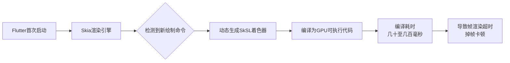
### 🔍 问题根源详解
1. **着色器编译的本质**：着色器是运行在GPU上的程序单元，负责具体的图形渲染计算。当Flutter首次渲染某些复杂效果（如渐变、裁剪、动画）时，Skia需要动态编译对应的着色器。
2. **时间敏感性**：流畅的动画需要在**16毫秒内完成一帧**的渲染（60fps）。而着色器编译可能需要**几十到几百毫秒**，直接导致数十帧的丢失。
3. **平台差异**：
   - **Android**：系统拥有**着色器机器码的持久缓存能力**，首次编译后的着色器可以被缓存，后续启动流畅。
   - **iOS**：由于iOS没有系统级的着色器缓存，**每次启动App都需要从零开始编译**，这是iOS平台Flutter卡顿问题更严重的主要原因。
> 💡 **关键认知**：原生App不需要预热，因为它们的UI框架（如iOS的Core Animation）使用的是**系统预编译、全局共享**的着色器，开发者极少需要自定义着色器。
---
### 🛠️ SkSL预热：解决方案详解
### 工作原理
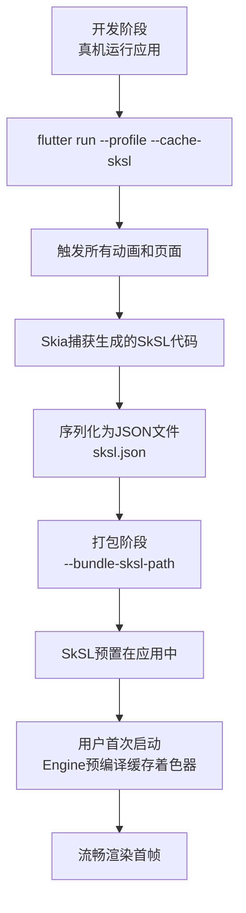
### 实战操作步骤
```bash
# 1. 在真机上以Profile模式运行并捕获SkSL
flutter run --profile --cache-sksl --purge-persistent-cache
# 2. 完整操作应用，触发所有可能的动画和渲染路径
# 3. 停止应用，生成flutter_01.sksl.json文件
# 4. 打包时包含预编译的着色器
flutter build apk --bundle-sksl-path flutter_01.sksl.json
# 或
flutter build ios --bundle-sksl-path flutter_ios.sksl.json
```
<details>
<summary>📖 深入了解SkSL与着色器编译过程</summary>
SkSL是Skia定义的着色器语言，是GLSL的变体。整个编译流程为：
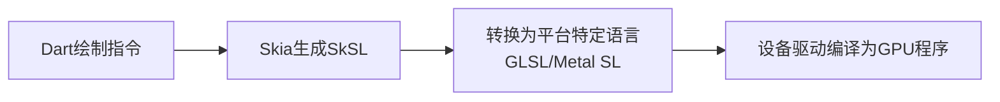
SkSL的优势在于它是**平台无关的中间表示**，可以编码设备特定参数，但最终仍需在运行时转换为平台的GPU语言（如GLSL或Metal SL）。
</details>
---
### ⚖️ 方案评估：优点与局限性
### ✅ 显著优点
| 维度 | 改进效果 |
|------|----------|
| **首帧耗时** | iPhone 4s从~300ms降至~80ms |
| **动画流畅度** | 卡顿帧显著减少，体验提升明显 |
| **可预测性** | 将编译时间从运行时移至编译期，性能更稳定 |
### ⚠️ 重要局限
1. **设备通用性问题**：不同设备捕获的SkSL配置文件**理论上不保证通用**。实际测试显示，iOS捕获的SkSL用于Android设备或模拟器上效果较好，但需实际测试。
2. **维护成本高**：
   - 每次升级Flutter SDK可能需要重新生成SkSL文件
   - 需要为iOS和Android分别构建不同的缓存文件
   - 需要用户操作整个应用流程并触发常见动画场景
3. **副作用**：
   - 增加应用包体积
   - 延长应用启动时间（需要预编译SkSL着色器）
   - 开发体验不友好
---
### 🔮 未来方向：Impeller渲染引擎
Flutter团队已经认识到SkSL预热的局限性，正在开发新一代渲染引擎**Impeller**来彻底解决问题。
### Impeller的革新
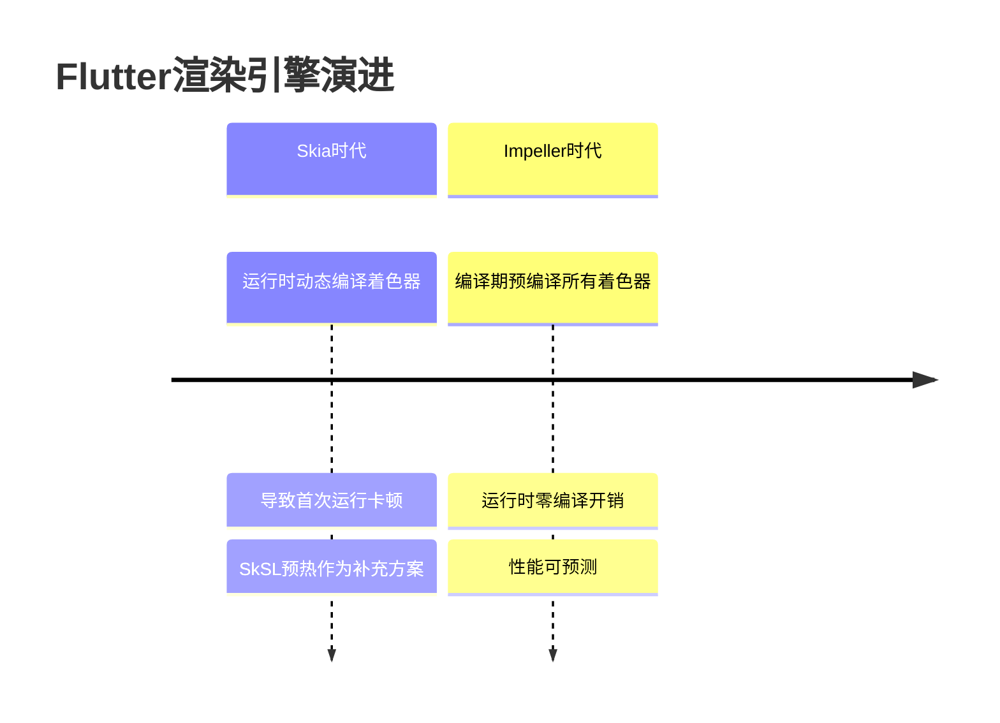
**核心改进**：
- **编译时预编译**：在构建Flutter Engine时就把所有可能用到的着色器变体预编译成平台原生GPU指令。
- **专为Flutter优化**：代码更精简，专为Flutter设计。
- **iOS默认使用**：Flutter 3.10开始，iOS默认使用Impeller渲染。
> 🚀 **实测数据**：Impeller将复杂动画P99帧耗时从22ms降至11ms，长列表滚动掉帧率从3.2%降至0.8%。
---
### 💎 最佳实践建议
### 场景选择指南
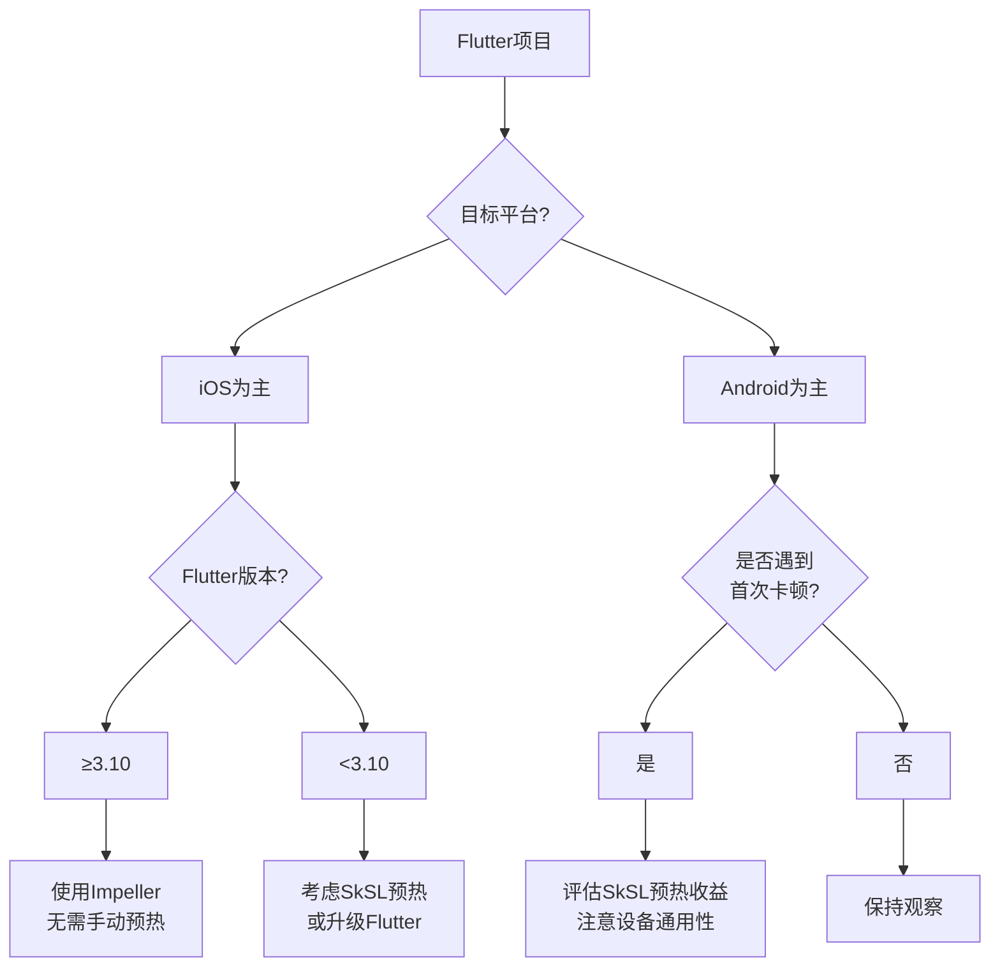
### 实施建议
1. **优先考虑升级**：如果项目允许，升级到Flutter 3.10+，利用Impeller解决iOS平台问题。
2. **针对性使用SkSL预热**：
   - 主要针对**iOS平台**进行优化（Android已有系统级缓存）
   - 为主要目标设备生成SkSL文件
   - 结合自动化测试流程，定期更新SkSL缓存
3. **性能监控**：使用DevTools监控着色器编译情况，确认预热效果。
---
### 📝 总结
SkSL预热是Flutter为解决**特定场景下着色器编译卡顿**而提供的**过渡性解决方案**，它通过提前编译着色器来优化首次运行体验，但存在设备通用性差、维护成本高等局限。随着Impeller渲染引擎的成熟，着色器编译问题正从架构层面得到根本解决，开发者应关注Flutter版本更新，适时采用新技术以获得更优性能。

## 4. Widget build方法中做了耗时计算怎么办，compute/Isolate如何迁移到Dart后台线程
在 Flutter 中，**`build` 方法是在主线程（UI Thread）上执行的**，千万不能进行耗时操作。一旦 `build` 方法阻塞，就会导致帧率下降（Jank），甚至造成 ANR（应用无响应）。
如果 `build` 方法中存在耗时计算（如复杂的数学运算、JSON 解析、大文件读写、加密解密等），必须将其迁移到后台线程。Dart 是单线程模型，通过 **Isolate** 实现并发。
以下是具体的解决方案和迁移步骤：

### 一、 解决方案对比
| 方案 | 适用场景 | 复杂度 | 特点 |
| :--- | :--- | :--- | :--- |
| **`Future` + `async`/`await`** | **假耗时操作**（如网络请求、Platform Channel）。 | 低 | **不开启新线程**，仅利用事件循环机制，不阻塞 UI。 |
| **`compute` 函数** | **一次性、轻量级计算**。 | 低 | 是 Isolate 的便捷封装，使用简单，适合大多数场景。 |
| **`Isolate` (长连接)** | **频繁、持续的计算**（如实时数据处理、高频传感器）。 | 高 | 避免频繁创建销毁 Isolate 的开销，支持双向通信。 |
> **注意**：如果是网络请求或数据库查询，它们本质上是异步 I/O，不需要 Isolate，直接用 `Future` 即可。Isolate 主要用于**CPU 密集型计算**。
---
### 二、 方案一：使用 `compute` 函数（推荐首选）
`compute` 是 Flutter 封装的高级 API，它会自动创建一个 Isolate，执行完任务后自动销毁并返回结果。
#### 代码示例：JSON 解析优化
假设我们要解析一个巨大的 JSON 字符串，如果在主线程解析会卡顿。
**1. 定义耗时函数**
**注意**：该函数必须是顶级函数或静态方法，不能是实例方法（因为不能访问 `this`）。
```dart
// 这是一个运行在后台隔离线程的函数
List<String> parseHugeJson(String jsonString) {
  // 模拟耗时计算
  // 例如使用 jsonDecode 进行复杂的解析
  final List<dynamic> parsed = jsonDecode(jsonString);
  return parsed.map((e) => e.toString()).toList();
}
```
**2. 在 Widget 中调用**
```dart
class MyWidget extends StatefulWidget {
  @override
  _MyWidgetState createState() => _MyWidgetState();
}
class _MyWidgetState extends State<MyWidget> {
  List<String>? _dataList;
  bool _isLoading = true;
  @override
  void initState() {
    super.initState();
    _loadData();
  }
  Future<void> _loadData() async {
    // 假设这是一个很大的 JSON 字符串
    String rawJson = '["item1", "item2", ...]'; 
    // 关键点：使用 compute 将任务抛给后台线程
    // 参数1：要执行的函数
    // 参数2：传给该函数的参数
    List<String> result = await compute(parseHugeJson, rawJson);
    if (mounted) {
      setState(() {
        _dataList = result;
        _isLoading = false;
      });
    }
  }
  @override
  Widget build(BuildContext context) {
    if (_isLoading) {
      return CircularProgressIndicator();
    }
    return ListView.builder(
      itemCount: _dataList?.length ?? 0,
      itemBuilder: (context, index) => Text(_dataList![index]),
    );
  }
}
```
---
### 三、 方案二：使用 `Isolate`（高性能场景）
`compute` 每次都会创建和销毁 Isolate，开销约 50ms-100ms。如果你需要**每秒多次**进行计算，使用 `compute` 反而会卡顿。这时需要使用 `Isolate.spawn` 建立一个长期运行的后台线程。
#### 核心流程图
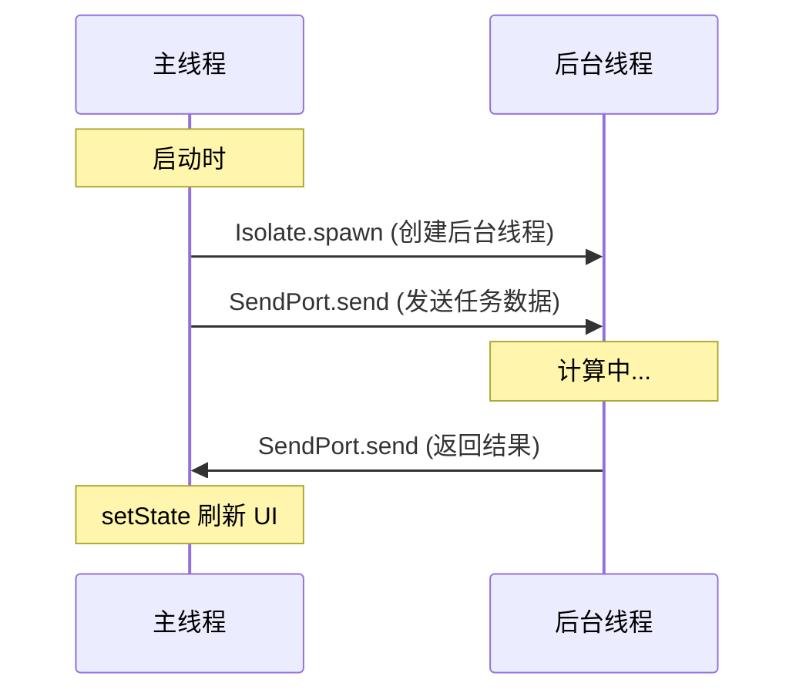
#### 代码实现
```dart
import 'dart:isolate';
import 'dart:async';
// 1. 定义消息模型（用于双向通信）
class _IsolateMessage {
  final SendPort sendPort;
  final String data;
  _IsolateMessage(this.sendPort, this.data);
}
class _MyWidgetState extends State<MyWidget> {
  Isolate? _isolate;
  ReceivePort? _receivePort;
  SendPort? _sendPort;
  @override
  void initState() {
    super.initState();
    _startIsolate();
  }
  // 启动 Isolate
  void _startIsolate() async {
    _receivePort = ReceivePort();
    
    // 创建 Isolate
    _isolate = await Isolate.spawn(
      _isolateEntryPoint, // 入口函数
      _receivePort!.sendPort, // 传递主线程的发送端口
    );
    // 监听来自后台线程的消息
    _receivePort!.listen((message) {
      if (message is SendPort) {
        // 第一次通信，后台线程把它的 SendPort 发过来，用于主线程发消息
        _sendPort = message;
      } else {
        // 接收计算结果
        print("收到计算结果: $message");
        setState(() {
          // 更新 UI
        });
      }
    });
  }
  // 发送任务给后台线程
  void _sendTaskToIsolate(String taskData) {
    if (_sendPort != null) {
      _sendPort!.send(taskData);
    }
  }
  // 后台线程入口函数（必须是顶级函数或静态方法）
  static void _isolateEntryPoint(SendPort mainSendPort) {
    ReceivePort receivePort = ReceivePort();
    
    // 告诉主线程我的接收端口是谁
    mainSendPort.send(receivePort.sendPort);
    // 监听主线程发来的任务
    receivePort.listen((message) {
      // 执行耗时计算
      String result = heavyCalculation(message as String);
      
      // 将结果发回主线程
      mainSendPort.send(result);
    });
  }
  static String heavyCalculation(String input) {
    // 模拟耗时操作
    return "Processed: $input";
  }
  @override
  void dispose() {
    _receivePort?.close();
    _isolate?.kill(priority: Isolate.immediate);
    super.dispose();
  }
  
  // ... build 方法省略
}
```
---
### 四、 最佳实践总结
1.  **代码隔离原则**：
    Isolate 之间**内存不共享**。你只能传递基本类型、集合或通过 `SendPort` 传递消息。**不能传递对象引用**。
2.  **UI 状态管理**：
    不要在 `build` 方法里调用 `compute`。应该在 `initState`、按钮点击回调或状态管理（Bloc/Provider）的逻辑层中触发计算，计算完成后调用 `setState` 或 `notifyListeners` 更新 UI。
3.  **Ffi 替代方案**：
    如果计算量极其巨大（如音视频编解码、AI 推理），建议使用 **C++/Rust** 实现逻辑，通过 **dart:ffi** 调用。这比 Isolate 性能更强，且可以直接操作内存，避免数据拷贝。
4.  **错误处理**：
    `compute` 和 `Isolate` 中的异常不会自动传播到主线程，需要通过 `try-catch` 捕获并通过消息机制将错误信息传回主线程。

## 5. Flutter DevTools的Performance面板怎么定位卡顿？Frame Chart的红色，紫色帧代表什么
Flutter DevTools 的 Performance 面板（性能面板）是解决卡顿问题的“手术刀”。要定位卡顿，核心在于分析 **Frame Rendering Chart（帧渲染图表）**。
以下是详细的定位步骤以及颜色代表的含义：

### 一、 Frame Chart 颜色解码：红、紫、绿代表什么？
Flutter 的目标是每帧渲染时间不超过 **16.67ms**（60fps）。
#### 1. 🟢 绿色
*   **含义**：**正常帧**。
*   **耗时**：渲染时间 < 16.67ms。
*   **状态**：UI 流畅，无需优化。
#### 2. 🔴 红色
*   **含义**：**严重卡顿**。
*   **耗时**：渲染时间 > 16.67ms。
*   **原理**：这一帧的计算量过大，导致错过了 VSync 信号，屏幕上会显示上一帧的内容，用户感知明显。
*   **定位方向**：
    *   通常是 **UI 线程** 耗时过长。
    *   **常见原因**：`build` 方法中执行了耗时计算、复杂的布局嵌套、过重的 `paint` 操作、或者大量对象的创建导致 GC 频繁触发。
#### 3. 🟣 紫色
*   **含义**：**GPU 线程瓶颈**。
*   **状态**：当前帧的 UI 线程可能很快，但 GPU 线程处理光栅化花的时间太长，导致整体超时。
*   **定位方向**：
    *   通常是 **光栅化** 过程中遇到困难。
    *   **常见原因**：
        *   静态缓存失效（如 `saveLayer` 调用过多）。
        *   **过度绘制**：屏幕同个区域绘制次数过多（如多层 Stack 叠加）。
        *   **复杂的裁剪/遮罩**：如 `ClipPath`、`ClipRRect` 在非正交方向上的大量使用。
        *   图片体积过大，解码耗时。
> **特殊颜色：浅灰/蓝色**（UI 线程/GPU 线程的空闲或轻负载状态）。
---
### 二、 如何定位卡顿：实操步骤
定位卡顿不是瞎猜，而是“三步走”：
#### 第一步：录制与复现
1.  打开 DevTools -> **Performance** 面板。
2.  点击 **Record** (圆形按钮)。
3.  在手机/模拟器上操作出现卡顿的场景（如快速滑动列表、打开复杂页面）。
4.  点击 **Stop** 停止录制。
#### 第二步：锁定“嫌疑人”（看图表）
1.  观察 **Flutter Frames** 图表。
2.  找到 **红色** 和 **紫色** 的长条柱子。
3.  点击其中一个“坏帧”。此时下方的详情区域会更新。
#### 第三步：审讯（分析火焰图）
点击坏帧后，重点观察下方的两个 Tab：**UI Thread** 和 **GPU Thread**。
**场景 A：UI 线程卡顿（红色帧常见）**
1.  看 **UI Thread** 的火焰图。
2.  **寻找宽条**：横向拉伸很长的色块。
3.  **定位代码**：
    *   如果是 `build`、`layout`、`paint` 很宽，说明 Flutter 框架层在处理你的 Widget 树时很吃力。
    *   如果发现你自己的方法名（如 `calculateData`）很宽，那就是你的代码写的慢。
4.  **查看调用栈**：点击火焰图中的色块，底部会显示 **StackTrace**，直接点击文件名即可跳转到 VS Code/Android Studio 对应代码行。
**场景 B：GPU 线程卡顿（紫色帧常见）**
5.  切换到 **Raster** (旧版叫 GPU Thread) Tab。
6.  如果看到 `PerformPresentation` 或 `Draw` 操作耗时极长。
7.  **分析工具**：点击 DevTools 左侧的 **Painting** (调色板图标) 或 **Performance Overlay** (在手机上显示)。
    *   打开手机上的 **Performance Overlay**：在代码中 `debugProfileBuildsEnabled = true` 或 Material App 中开启。
    *   检查 **Rasterizer** 这一栏，如果底部出现紫色的锯齿波峰，说明 GPU 负载过高。
    *   检查 **Overdraw**（过度绘制）：屏幕上颜色越红（非 Flutter 主题红，是调试覆盖层的红），说明绘制层数越多。
---
### 三、 常见卡顿模式与解法速查表
| 火焰图特征 | 可能原因 | 优化方案 |
| :--- | :--- | :--- |
| **`build` 耗时极长** | Widget 树过深、build 中有循环/IO操作 | 拆分 Widget、缓存数据、使用 `const` 构造函数。 |
| **`layout` 耗时极长** | 复杂的 Flex 布局计算 | 减少 `Flex`/`Column`/`Row` 嵌套，使用 `SizedBox` 固定大小。 |
| **`paint` 耗时极长** | 复杂的自定义绘制、大图片 | 使用 `RepaintBoundary` 隔离重绘区域。 |
| **`saveLayer` 调用频繁** | 透明度、裁剪、阴影特效 | 减少不必要的 `Opacity`、`ClipPath`；避免“万能”阴影。 |
| **`Shader Compilation`** | 首次运行卡顿 | 使用 SkSL 预热；或升级 Impeller 引擎。 |
| **`GC` (垃圾回收) 频繁** | 短时间内创建大量对象 | 优化数据结构，复用对象，避免在循环中创建 Widget。 |
### 总结
*   **红色帧**：看 UI 线程火焰图，找你的 Dart 代码哪里慢了（CPU 瓶颈）。
*   **紫色帧**：看 GPU 线程，找哪里绘图指令太复杂了（GPU 瓶颈，通常是特效、裁剪、过度绘制）。
通过点击具体的帧，再定位到火焰图中的宽条，最后跳转源码，这就是 Flutter 性能优化的标准闭环。


# 工程化
## 1. Flutter项目的模块化拆分策略？pubspec.yaml的依赖管理和版本冲突解决
### Flutter 项目模块化拆分与依赖管理实战指南
### 📊 模块化架构设计策略
Flutter 项目的模块化拆分是中大型项目演进的必经之路。基于搜索结果和实践经验，以下是推荐的**五层模块化架构**：
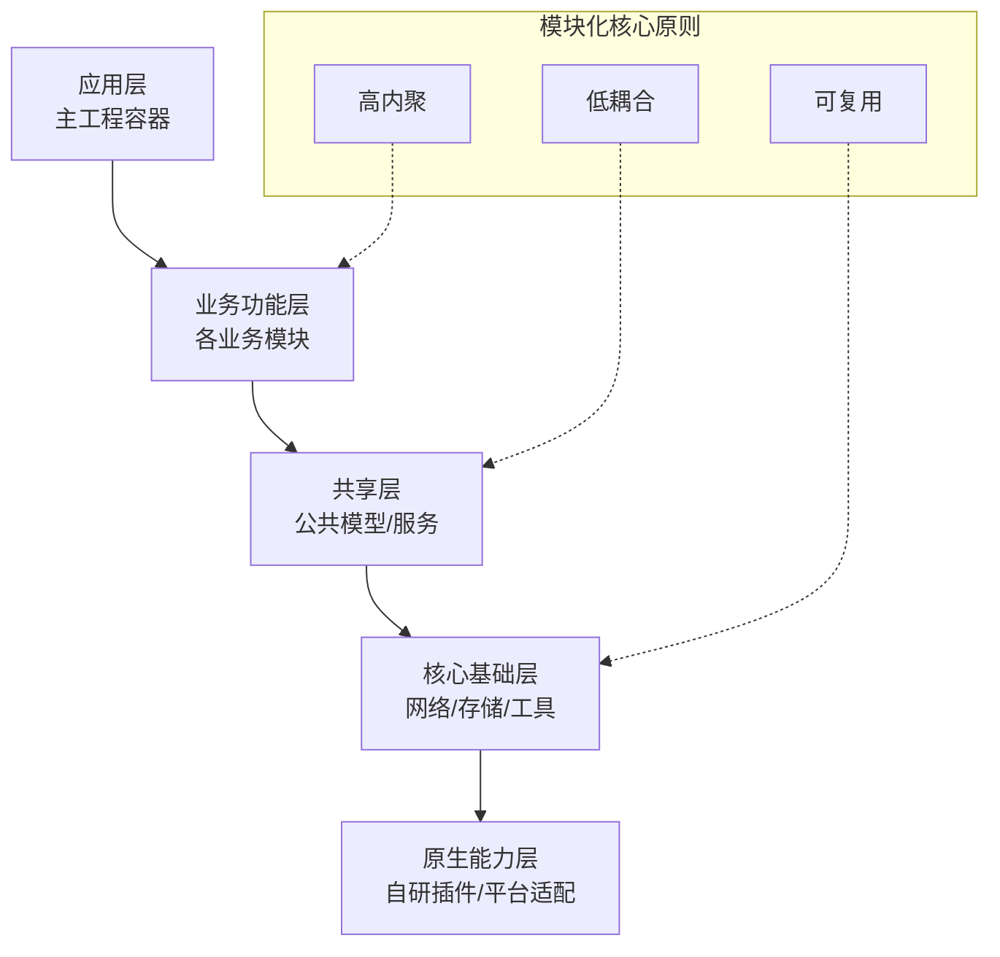
### 1. 分层架构详解
| 层级 | 职责 | 典型模块示例 | 依赖关系 |
|------|------|-------------|---------|
| **应用层** | 应用壳工程，组装各模块，处理全局配置 | `main_app` | 依赖所有业务模块 |
| **业务功能层** | 独立业务单元，可单独运行和测试 | `home`、`video`、`chat`、`profile` | 依赖共享层和核心层 |
| **共享层** | 跨模块共享的数据模型和服务 | `models`、`services`、`constants` | 依赖核心层 |
| **核心基础层** | 基础能力封装，技术无关性 | `network`、`database`、`utils`、`theme` | 仅依赖SDK和第三方库 |
| **原生能力层** | 平台特定能力封装 | `photo_picker`、`bluetooth`、`distributed_sync` | 依赖核心层和平台接口 |
### 2. 模块目录结构标准
```
my_app/
├── apps/                    # 应用壳工程
│   └── main_app/
│       ├── lib/
│       ├── pubspec.yaml
│       └── build.gradle
├── features/               # 业务功能模块
│   ├── home/
│   │   ├── lib/
│   │   ├── pubspec.yaml
│   │   └── test/
│   └── video/
├── shared/                 # 共享资源
│   ├── models/
│   └── services/
├── core/                   # 核心基础
│   ├── network/
│   ├── database/
│   └── utils/
└── plugins/                # 原生插件
    └── photo_picker/
```
### 3. 模块间通信机制
模块化后，模块间通信需要解耦，常见方式包括：
<details>
<summary>🔧 模块间通信方式对比</summary>
| 通信方式 | 适用场景 | 优点 | 缺点 |
|---------|---------|------|------|
| **路由导航** | 页面跳转 | 完全解耦，支持传参 | 需要统一路由表管理 |
| **事件总线** | 跨模块事件通知 | 解耦彻底，一对多通信 | 需要管理事件订阅，可能内存泄漏 |
| **服务定位** | 跨模块服务调用 | 简单直接 | 增加模块间耦合 |
| **接口抽象** | 模块间依赖 | 清晰的契约定义 | 需要定义公共接口 |
| **状态管理** | 全局状态共享 | 响应式更新 | 学习曲线较陡 |
</details>
### 📦 依赖管理策略
### 1. 版本约束规范
在 `pubspec.yaml` 中声明依赖时，应遵循语义化版本规范：
```yaml
dependencies:
  # 使用 ^ 约束，允许兼容性更新
  provider: ^6.0.0        # >=6.0.0 <7.0.0
  
  # 明确版本范围
  dio: '>=4.0.0 <5.0.0'   # 4.0.0 ≤ version < 5.0.0
  
  # 任何版本（不推荐）
  some_package: any       # 允许任何版本，存在风险
```
### 2. 版本冲突解决流程
当遇到版本冲突时，可遵循以下步骤：
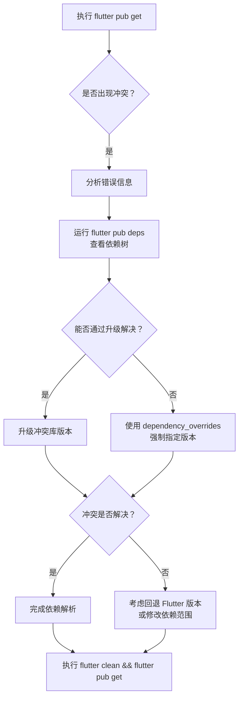
### 3. 高级依赖管理技巧
<details>
<summary>📖 依赖管理最佳实践</summary>
#### 1. **使用 `dependency_overrides` 解决冲突**
当无法通过常规方式解决冲突时，可以强制指定版本：
```yaml
# pubspec.yaml
dependencies:
  a_library: ^1.1.0
  b_library: ^2.1.0
dependency_overrides:
  # 强制使用特定版本
  c_library: ^4.0.0
```
#### 2. **本地路径依赖**
对于自研模块或插件，使用本地路径依赖：
```yaml
dependencies:
  # 本地路径依赖
  my_module:
    path: ./modules/my_module
    
  # Git 仓库依赖
  webview_flutter:
    git:
      url: git@github.com:user/webview.git
      ref: stable
```
#### 3. **平台特定配置**
对于需要支持鸿蒙等平台的项目，可采用**双配置文件方案**：
```
project/
├── pubspec.origin.yaml     # 原生平台配置
├── pubspec.ohos.yaml       # 鸿蒙平台配置
└── switch_platform.sh      # 切换脚本
```
</details>
### 🚀 实战案例：版本冲突解决
### 案例 1：传递依赖冲突
**问题场景**：两个库依赖同一个库的不同版本
```yaml
# 项目 pubspec.yaml
dependencies:
  a_library: ^1.1.0    # 依赖 c_library 2.0
  b_library: ^2.1.0    # 依赖 c_library 4.0
```
**解决方案**：
1. **分析依赖树**：运行 `flutter pub deps` 查看依赖关系
2. **尝试升级**：检查是否有兼容的新版本
3. **使用覆盖**：
```yaml
dependency_overrides:
  c_library: ^4.0.0
```
### 案例 2：Git 依赖冲突
**问题场景**：不同模块依赖同一 Git 仓库的不同 ref
```yaml
# 模块A
dependencies:
  webview_flutter:
    git:
      url: git@github.com:user/webview.git
      ref: stable        # 动态分支
# 模块B
dependencies:
  webview_flutter:
    git:
      url: git@github.com:user/webview.git
      ref: 1.1.2        # 静态标签
```
**解决方案**：统一 Git 引用，推荐使用固定标签
```yaml
# 所有模块统一使用
dependencies:
  webview_flutter:
    git:
      url: git@github.com:user/webview.git
      ref: 1.1.2        # 统一使用固定标签
```
### 案例 3：FFI 版本冲突
**问题场景**：本地模块依赖不同 FFI 版本
**解决方案**：在主项目 `pubspec.yaml` 中使用 `dependency_overrides` 强制统一版本
```yaml
dependency_overrides:
  ffi: ^2.0.1
```
### 📈 模块化与依赖管理最佳实践
### 1. 依赖管理策略
| 策略 | 说明 | 示例 |
|------|------|------|
| **固定版本** | 生产环境推荐，确保一致性 | `provider: 6.0.5` |
| **版本范围** | 开发环境可用，便于更新 | `dio: ^4.0.0` |
| **锁定文件** | 将 `pubspec.lock` 纳入版本控制 | 确保团队依赖一致 |
| **定期更新** | 定期运行 `flutter pub outdated` | 检查过时依赖 |
### 2. 模块化开发流程
1. **定义模块边界**：明确每个模块的职责和接口
2. **实现模块隔离**：每个模块有独立的 `pubspec.yaml`
3. **配置依赖关系**：遵循分层依赖原则，避免循环依赖
4. **统一构建脚本**：使用脚本管理多模块构建和测试
### 3. 常见问题与解决方案
<details>
<summary>❓ 常见问题解答</summary>
#### Q1: 如何处理模块间的循环依赖？
**A**: 重构模块架构，提取公共部分到共享层，使用接口或依赖注入解耦
#### Q2: 如何管理团队内的依赖版本？
**A**: 
- 使用 `pubspec.lock` 锁定版本
- 定期更新依赖，但需充分测试
- 建立依赖审查流程
#### Q3: 如何优化依赖下载速度？
**A**: 
- 配置镜像源
- 使用缓存服务器
- 预下载依赖包
#### Q4: 如何处理平台特定依赖？
**A**: 采用条件导入或平台分离策略
```dart
export 'platform_stub.dart'
    if (dart.library.io) 'platform_io.dart'
    if (dart.library.js) 'platform_js.dart';
```
</details>
### 🎯 总结与建议
### 模块化拆分建议
1. **从业务边界开始**：按业务功能划分模块，而不是技术层次
2. **渐进式重构**：不要一次性拆分，先提取基础模块和共享模块
3. **定义清晰接口**：每个模块只暴露必要的接口，内部实现隐藏
4. **文档化模块**：记录每个模块的职责、接口和依赖关系
### 依赖管理建议
1. **遵循语义化版本**：理解 `^`、`>`、`>=`、`<`、`<=` 等约束符号
2. **谨慎使用 `any`**：仅在解决冲突时临时使用，最终要替换为具体版本
3. **定期维护依赖**：定期检查并更新依赖，避免长期积累的版本差异
4. **使用依赖分析工具**：`flutter pub deps`、`flutter pub outdated` 帮助理解依赖树
### 最终建议
对于中大型 Flutter 项目，建议采用**分层模块化架构**，结合**严格的版本管理策略**。通过清晰的模块边界、合理的依赖关系和规范的版本约束，可以构建出易于维护、可扩展、团队协作友好的 Flutter 项目架构。
> 💡 **核心原则**：高内聚、低耦合、可测试、可复用。模块化不是目的，而是手段，目的是为了提升代码质量、开发效率和可维护性。

## 2. 热重载和热重启的区别，什么情况下热重载不生效
Hot Reload（热重载）和 Hot Restart（热重启）是 Flutter 开发效率的核心，但它们的作用范围和底层原理截然不同。理解这些区别能帮你解决“为什么代码改了但没变”的困惑。
### 一、 核心区别与原理
| 特性 | Hot Reload (热重载) | Hot Restart (热重启) |
| :--- | :--- | :--- |
| **快捷键** | `r` | `R` |
| **核心原理** | **增量更新**。将修改后的代码注入 Dart VM，VM 重新组装 Widget 树。 | **全量重启**。杀死当前进程，重新启动 App，重新运行 `main()`。 |
| **状态保留** | **保留**。App 的状态（如计数器数值、滚动位置、用户输入）不会丢失。 | **重置**。所有状态归零，回到 `main()` 初始状态。 |
| **速度** | 毫秒级。非常快。 | 较慢。需要几秒钟，取决于 App 复杂度。 |
| **执行范围** | 仅重跑 `build()` 方法。 | 重跑 `main()` 及所有初始化逻辑。 |

### 二、 Hot Reload 的工作原理（简述）
当你按下 `r` 时，Flutter 做了三件事：
1.  **扫描修改**：工具扫描自上次编译以来修改的 Dart 文件。
2.  **注入代码**：将修改后的代码发送给设备上的 Dart VM。
3.  **Widget 重建**：VM 触发 Flutter 框架，强制触发根 Widget 或子树的 `rebuild`。
**关键点**：Hot Reload **不会**重新执行 `main()` 函数，也不会重新初始化 `State` 对象。它仅仅是触发了 `build` 方法的重新调用。这既是它快的原因，也是它失效的原因。
---
### 三、 什么情况下 Hot Reload 不生效？
由于 Hot Reload 只是“局部重建”，以下场景它无法处理，必须使用 Hot Restart：
#### 1. 修改了 `main()` 函数中的代码
*   **原因**：Hot Reload 不会重新运行 `main()`。
*   **场景**：你修改了 `runApp(MyApp())` 中的参数，或者修改了 `main()` 里的初始化逻辑（如初始化 SDK、配置环境变量）。
*   **解法**：Hot Restart。
#### 2. 修改了全局变量或静态变量的初始值
*   **原因**：全局变量和静态变量是在 App 启动时初始化的，Hot Reload 不会重新初始化它们。
*   **场景**：
    ```dart
    int globalCount = 0; // 修改这里为 10，Hot Reload 不会生效，因为内存里它还是 0
    
    class MyStatic {
      static const String apiKey = 'OLD_KEY'; // 修改为 NEW_KEY
    }
    ```
*   **解法**：Hot Restart。
#### 3. 修改了 `State` 类的成员变量的初始化逻辑
*   **原因**：`State` 对象在 Hot Reload 中是保留的，不会重新创建。只有 `build()` 会重跑。
*   **场景**：
    ```dart
    class _MyWidgetState extends State<MyWidget> {
      // 如果你修改这里的初始值，比如改成 100，Hot Reload 不生效
      // 因为 State 对象没销毁，这个变量已经在上次启动时被赋值为 0 了。
      int _counter = 0; 
      @override
      Widget build(BuildContext context) {
        // 修改这里的代码，Hot Reload 生效
        return Text('$_counter');
      }
    }
    ```
*   **解法**：Hot Restart，或者在开发中提供一个“重置”按钮手动重置状态。
#### 4. `initState()` 或 `dispose()` 等生命周期方法的修改
*   **原因**：这些方法只在 State 创建和销毁时调用一次。Hot Reload 既不创建也不销毁 State，所以里面的代码改动（如修改初始化逻辑）不会执行。
*   **解法**：Hot Restart，或者导航退出页面再重新进入。
#### 5. 枚举类型 的修改
*   **原因**：修改枚举值（如添加、删除、改名）涉及到类型系统的根本变化，VM 无法热更新枚举结构。
*   **解法**：Hot Restart。
#### 6. 泛型类型修改
*   **场景**：将 `List<String>` 改为 `List<int>`。
*   **原因**：这改变了对象的运行时类型结构。
*   **解法**：Hot Restart。
#### 7. 修改了 Native 代码（Android/iOS）
*   **原因**：Hot Reload 仅针对 Dart 代码。
*   **场景**：修改了 `AndroidManifest.xml`、`Info.plist`、Gradle 配置、原生 Java/Kotlin/Swift/Objective-C 代码。
*   **解法**：停止运行，重新编译安装（`flutter run`）。
#### 8. 添加了新的资源文件
*   **场景**：在 `pubspec.yaml` 中声明了新的图片或字体，或者在 `assets` 目录下放了新文件。
*   **原因**：资源打包是在编译构建阶段完成的。
*   **解法**：通常需要 Hot Restart，有时甚至需要重新 `flutter run`（取决于资源是否被打包进新编译的产物）。
#### 9. 依赖包版本更新
*   **场景**：修改了 `pubspec.yaml` 中的依赖版本并运行了 `flutter pub get`。
*   **原因**：这涉及到底层库的二进制文件变更。
*   **解法**：Hot Restart。如果涉及原生依赖变更，可能需要重新编译安装。
---
### 四、 总结与最佳实践
1.  **优先使用 Hot Reload**：对于 90% 的 UI 布局调整、逻辑微调、文案修改，它是最快的。
2.  **遇到“怪事”先 Hot Restart**：如果你发现改动没生效，或者 UI 出现奇怪的报错（如 `Type mismatch`），先尝试 Hot Restart。
3.  **Native 改动必须重跑**：涉及原生层面的修改，别犹豫，直接 Stop 并重新 Run。
记住一句话：**Hot Reload 只是重绘了画面，Hot Restart 才是真正的重新开始。**

## 3. --release vs --profile vs --debug模式的区别
`--debug`、`--profile` 和 `--release` 是 Flutter 构建的三种主要模式，它们在**编译优化级别**、**运行时特性**、**性能表现**和**包体积**上有本质区别。
以下是详细的对比分析：
### 一、 核心区别总览
| 特性 | Debug (调试模式) | Profile (性能分析模式) | Release (发布模式) |
| :--- | :--- | :--- | :--- |
| **核心用途** | **开发与调试** | **性能分析与测试** | **正式发布** |
| **运行速度** | 慢 (未优化) | 较快 (接近 Release) | 最快 (完全优化) |
| **包体积** | 巨大 (包含调试信息) | 较大 | 最小 (压缩、混淆、优化) |
| **断点调试** | ✅ 支持 | ⚠️ 支持 (但会影响性能数据) | ❌ 不支持 |
| **Hot Reload**| ✅ 支持 | ❌ 不支持 | ❌ 不支持 |
| **断言** | ✅ 开启 (`assert` 生效) | ✅ 开启 | ❌ 关闭 |
| **VM状态** | Dart VM (JIT 模式) | Dart VM (AOT 模式) | AOT 编译 (预编译) |
| **DevTools** | 全功能支持 | **主要场景** (连接真机看帧率/内存) | 有限支持 (无法连接调试) |
| **代码混淆** | 否 | 否 | 是 (默认开启，安全) |

### 二、 详细解析
#### 1. Debug 模式 (默认模式)
*   **命令**：`flutter run` (不加参数) 或 `flutter run --debug`
*   **原理**：
    *   使用 **JIT (Just-In-Time)** 编译模式。
    *   Dart 代码在设备上即时编译运行。
    *   包含了完整的调试符号和服务端代码。
*   **特点**：
    *   **Hot Reload 基石**：因为是 JIT 模式，支持代码热重载。
    *   **断言开启**：代码中的 `assert(() { ... })` 代码块会执行，利于开发期检查逻辑错误。
    *   **性能极差**：代码未优化，且 VM 额外承担了调试服务，UI 流畅度远低于真机表现。
*   **适用场景**：
    *   写代码、调逻辑、修 UI 布局。
    *   **绝对不要**用 Debug 模式的性能表现来衡量 App 真实性能！
#### 2. Profile 模式 (性能分析模式)
*   **命令**：`flutter run --profile`
*   **原理**：
    *   使用 **AOT (Ahead-Of-Time)** 编译模式。
    *   编译后的机器码与 Release 模式基本一致，保留了运行时性能优化的所有特性。
    *   保留了调试接口，允许 DevTools 连接。
*   **特点**：
    *   **性能接近 Release**：去除了 Debug 模式的开销，帧率、内存表现与用户实际体验高度一致。
    *   **DevTools 连接**：可以通过 DevTools 观察帧率图表、内存泄漏、CPU 使用率等。
    *   **禁用 Hot Reload**：因为是 AOT 编译，无法动态更新代码。
*   **适用场景**：
    *   **性能优化必用**：检测卡顿、分析内存泄漏、定位掉帧原因。
    *   真机测试流畅度。
    *   **注意**：虽然支持断点，但打断点会严重拖慢运行速度，导致性能数据失真，分析性能时尽量避免打断点。
#### 3. Release 模式 (发布模式)
*   **命令**：`flutter run --release` 或 `flutter build apk/ipa`
*   **原理**：
    *   使用 **AOT** 编译，并进行 **Tree Shaking** (摇树优化)。
    *   移除所有调试符号、断言代码、开发工具接口。
    *   代码经过混淆 和压缩。
*   **特点**：
    *   **最快速度**：启动快、运行流畅。
    *   **最小体积**：剥离了无用代码和调试信息。
    *   **安全性**：代码混淆增加逆向难度。
    *   **无调试能力**：无法连接 DevTools，无法打日志 (print 可能会被系统过滤)，无法打断点。
*   **适用场景**：
    *   提交应用商店。
    *   给测试人员进行功能验收。
    *   给用户的最终版本。
---
### 三、 关键技术点深入：JIT vs AOT
理解这三种模式的区别，本质上理解 Flutter 的编译技术：
*   **Debug (JIT)**: 
    *   代码在运行时编译。
    *   灵活，支持热重载。
    *   运行时需要编译器介入，性能差。
*   **Profile / Release (AOT)**:
    *   代码在安装前就已经编译成机器码。
    *   运行时直接执行，无需编译器干预。
    *   性能好，但不支持动态修改代码。
---
### 四、 常见误区与最佳实践
1.  **误区**：“我在 Debug 模式下测试发现列表很卡，是不是 Flutter 性能不行？”
    *   **真相**：Debug 模式下的卡顿通常是 JIT 编译开销和调试服务开销造成的。**请务必在 Profile 模式下测试性能**。
2.  **误区**：“我想在真机上调试布局，用 Profile 模式吗？”
    *   **真相**：调试布局建议用 Debug 模式，因为需要 Hot Reload。如果需要看真机上的布局辅助线，可以使用 `debugPaintSizeEnabled = true`，这在 Profile 模式下也能用（虽然不建议在 Profile 下做过多的 UI 调试）。
3.  **最佳实践流程**：
    *   **功能开发** -> `Debug` 模式 (快速迭代)。
    *   **性能测试/找Bug** -> `Profile` 模式 (真实环境数据)。
    *   **打包发布** -> `Release` 模式 (最终交付)。
4.  **代码中的适配**：
    利用 Dart 的 `kDebugMode` 常量来区分逻辑：
    ```dart
    if (kDebugMode) {
      // 仅在调试模式下打印详细日志
      print('Verbose debug info...');
      // 或者添加一些辅助开发的 UI
    }
    
    if (kReleaseMode) {
      // 发布模式下的特殊逻辑，比如收集崩溃日志
    }
    ```
    *注意：`assert` 只在 Debug 模式运行，Profile 和 Release 会自动忽略。*

## 4. Flutter和原生代码混合路由管理，Flutter页面和Native页面如何相互跳转
在混合开发中，路由管理是最核心的痛点。原生和 Flutter 拥有各自独立的导航栈，如果管理不当，会导致页面错乱、内存泄漏或返回键失效。
以下是业界主流的混合路由管理方案，分为 **交互机制** 和 **栈管理策略** 两部分。

### 一、 核心交互机制
#### 1. Native 打开 Flutter 页面
这是最常见的场景。实现方式取决于是否使用混合栈框架（如 FlutterBoost）。
**方案 A：标准容器方案（适合简单混合或新项目）**
Native 端不直接打开 Flutter 页面，而是打开一个承载 Flutter 的 **容器**。
*   **Android**: `FlutterActivity` / `FlutterFragment`
*   **iOS**: `FlutterViewController`
**跳转流程**：
1.  Native 获取路由名（如 `"myflutterpage"`）。
2.  Native 启动 `FlutterActivity` / `FlutterViewController`。
3.  在容器初始化时，通过 `initialRoute` 参数将路由名传给 Flutter。
4.  Flutter 端在 `main.dart` 中解析路由并渲染对应 Widget。
**代码示例**：
```dart
// Native (Android)
Intent intent = FlutterActivity.createDefaultIntent(this)
    .withInitialRoute("/detail?id=123"); // 传递路由和参数
startActivity(intent);
```
**方案 B：单例复用方案（适合复杂业务，推荐 FlutterBoost）**
为了避免每次打开 Flutter 都重置状态，通常使用 **FlutterBoost**。
Native 打开的只是一个代理容器，实际渲染由 Boost 引擎管理。
*   **优点**：Flutter 引擎只需初始化一次，页面共享同一个 Navigator 栈，状态保留完美。
---
#### 2. Flutter 打开 Native 页面
Flutter 无法直接操作 Native 的 UI 组件，必须通过 **Platform Channel** 发送指令。
**实现流程**：
1.  定义 MethodChannel：`flutter_navigator`。
2.  Flutter 调用 `invokeMethod('openNativePage', params)`。
3.  Native 监听到方法，解析参数，执行原生的 `startActivity` 或 `pushViewController`。
**代码示例**：
**Flutter 端**：
```dart
static const platform = MethodChannel('flutter_navigator');
Future<void> openNativePage() async {
  try {
    await platform.invokeMethod('openProfile', {'userId': '1001'});
  } catch (e) {
    print(e);
  }
}
```
**Native 端**：
```kotlin
// Android
override fun configureFlutterEngine(flutterEngine: FlutterEngine) {
    MethodChannel(flutterEngine.dartExecutor.binaryMessenger, "flutter_navigator").setMethodCallHandler { call, result ->
        if (call.method == "openProfile") {
            val userId = call.argument<String>("userId")
            // 打开原生 Activity
            val intent = Intent(this, NativeProfileActivity::class.java)
            intent.putExtra("id", userId)
            startActivity(intent)
            result.success(null)
        }
    }
}
```
---
### 二、 进阶：混合栈管理策略
当页面层级加深（如：Native A -> Flutter B -> Native C -> Flutter D），管理变得复杂。
#### 1. 视觉统一：互为"黑盒"
*   **理念**：将 Flutter 页面视为一个“黑盒 Native 页面”。
*   **实现**：
    *   Flutter 页面跳转 Flutter 页面：使用 Flutter 自身的 `Navigator.push`。这在 Native 看来只是 Flutter 容器内部的变化，Native 感知不到。
    *   Native 页面跳转 Native 页面：使用原生跳转。
    *   **跨栈跳转**：通过 MethodChannel 触发。
#### 2. 返回键拦截（关键难点）
混合栈最怕“按返回键退出了整个 Flutter 容器，而不是退回 Flutter 上一个页面”。
**解决方案（以 Android 为例）**：
需要告知原生层：当前 Flutter 内部是否还有可返回的页面。
1.  **Flutter 端**：使用 `WillPopScope` (旧) 或 `PopScope` (新) 拦截返回事件，或者通过 MethodChannel 查询 `Navigator.canPop()`。
2.  **Native 端**：在 `FlutterActivity` 的 `onBackPressed()` 中判断：
    *   如果 Flutter 栈不为空 -> 通知 Flutter 执行 `Navigator.pop()`。
    *   如果 Flutter 栈为空 -> 执行 Native 的 `finish()` 销毁容器。
**伪代码**：
```kotlin
// Android Native
override fun onBackPressed() {
    // 询问 Flutter 是否能返回
    flutterEngine?.navigationChannel?.popRoute()?.let { wasPopped ->
        if (!wasPopped) {
            // Flutter 栈空了，销毁原生容器
            super.onBackPressed() 
        }
        // 如果 wasPopped 为 true，说明 Flutter 已处理返回，什么都不做
    }
}
```
---
### 三、 实际架构方案对比
| 方案 | 适用场景 | 优点 | 缺点 | 推荐指数 |
| :--- | :--- | :--- | :--- | :--- |
| **官方方案**<br>(FlutterActivity/VC) | 简单混合，仅少量页面。 | 原生支持，无需第三方库。 | 每次打开可能重新初始化引擎(如果不复用)，内存占用高，状态丢失。 | ⭐⭐ |
| **FlutterBoost**<br>(主流方案) | 复杂混合栈，大量交互。 | **统一路由管理**，引擎复用，生命周期对齐，解决返回键问题。 | 接入有一定成本，需要改造现有代码。 | ⭐⭐⭐⭐⭐ |
| **混合栈自研** | 有特殊定制需求的大厂。 | 完全可控。 | 开发维护成本极高，需处理 PlatformView、TextureView 等细节。 | ⭐⭐ |
### 四、 总结建议
1.  **简单场景**：如果只是 App 中某个独立模块用 Flutter，直接用 `FlutterActivity` 配合 `initialRoute` 即可。
2.  **复杂场景**：如果 Flutter 和 Native 页面交织频繁，**强烈建议接入 FlutterBoost**。它实现了 `Native Container` 与 `Flutter Router` 的映射，你只需像写原生代码一样打开页面，框架自动处理栈的同步和生命周期。
    *   例如：`BoostNavigator.instance.push("flutter_page")`，框架会自动判断是打开新容器还是复用当前容器。
