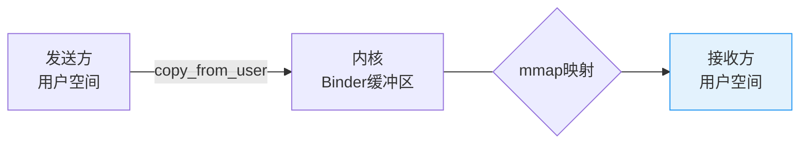
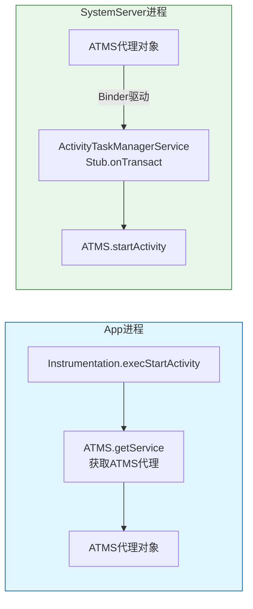
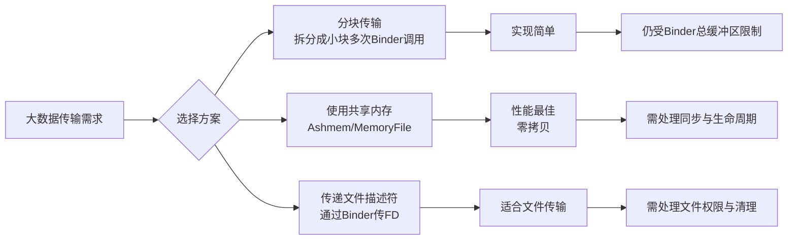
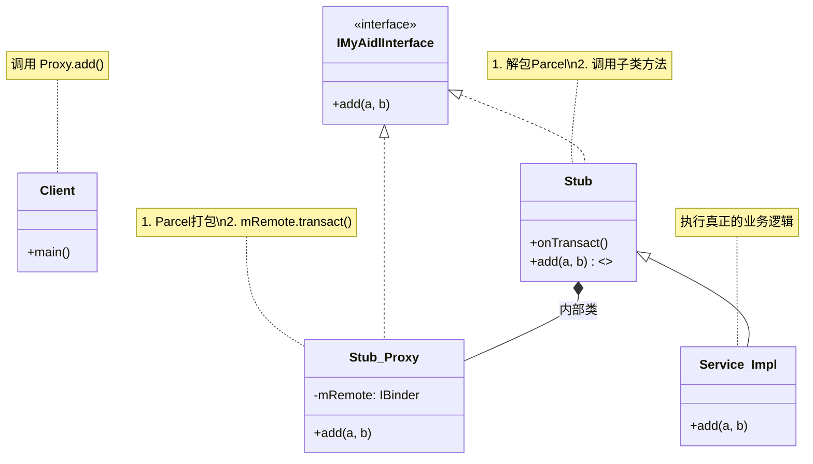
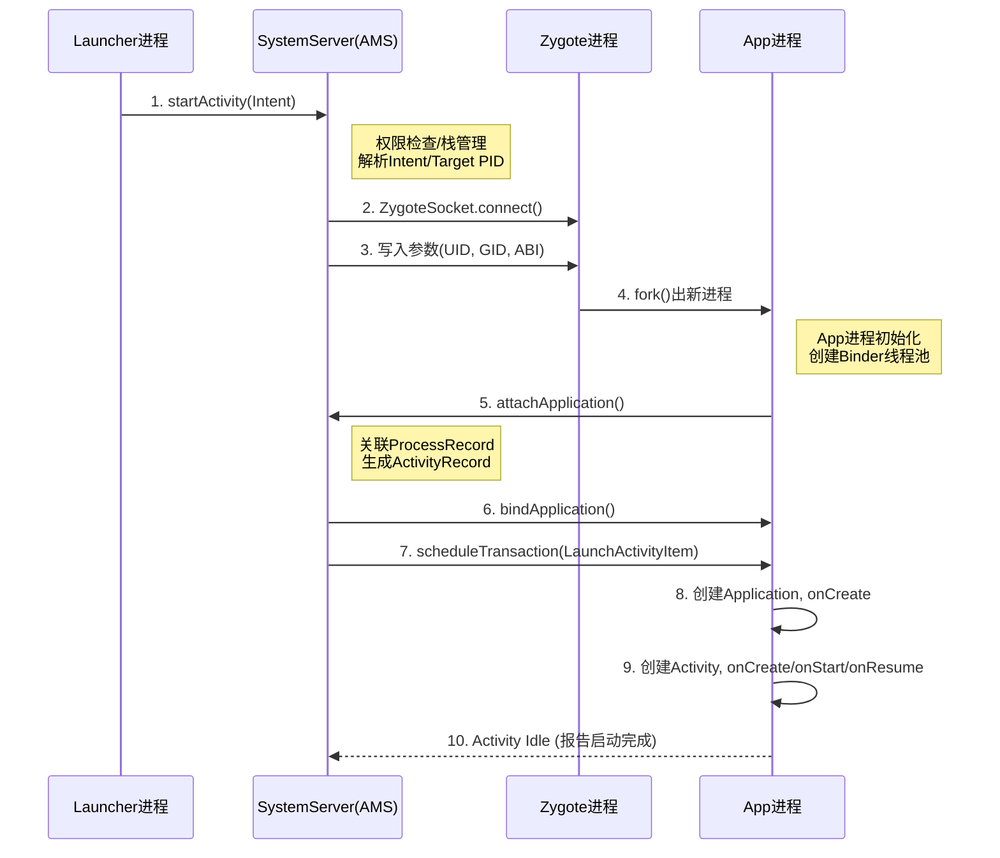
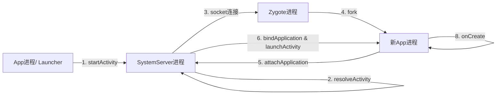
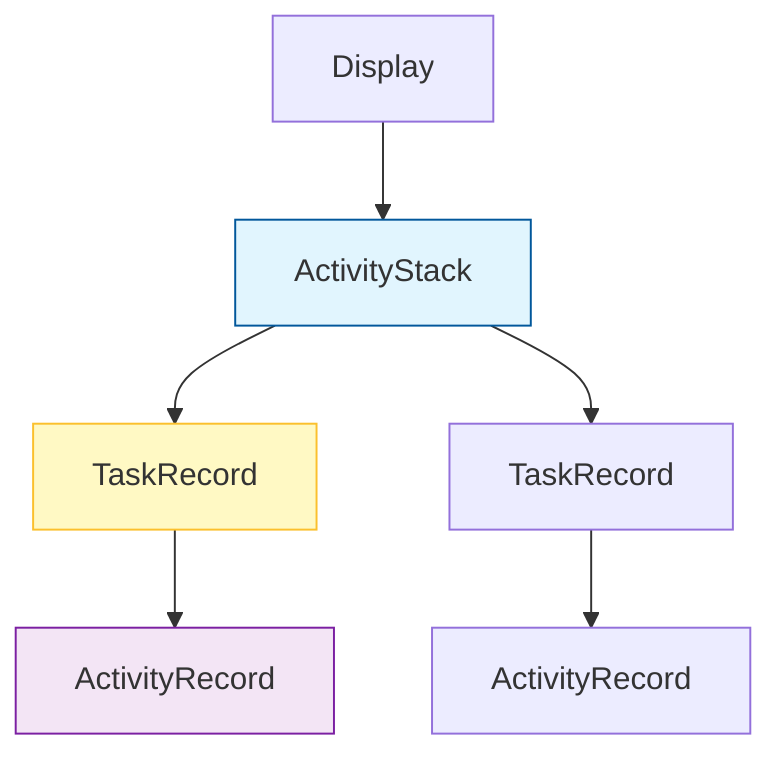
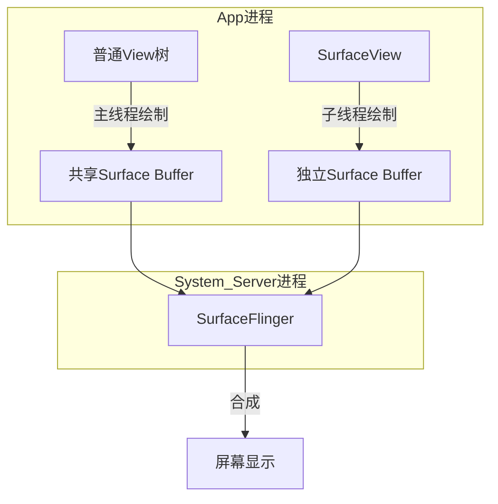
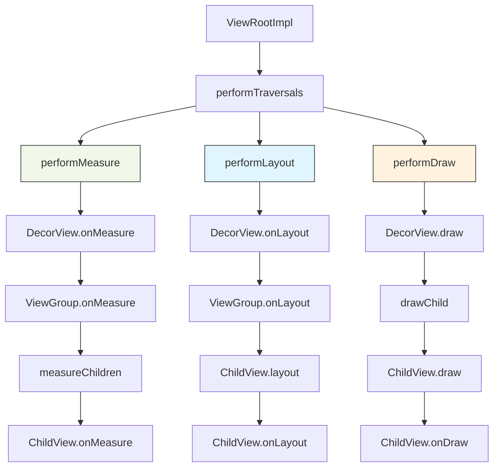

# Handler 机制

## 1. Handler、Looper、MessageQueue三者关系，用一句话讲清楚
Handler、Looper、MessageQueue三者关系紧密，共同构成Android的消息驱动机制，其核心关系可概括为：**一个线程对应一个Looper，一个Looper管理一个MessageQueue，而一个Looper可关联多个Handler**。具体关系如下：

| 组件 | 角色定位 | 与其他组件的关系 |
| :--- | :--- | :--- |
| **Looper** | 消息循环驱动者 | 与线程（Thread）**一一对应**。在构造时创建MessageQueue，通过`ThreadLocal`保证每个线程只有一个Looper实例。 |
| **MessageQueue** | 消息存储容器 | 与Looper**一一对应**。由Looper持有并管理，内部采用单链表结构，按消息执行时间排序。 |
| **Handler** | 消息发送与处理者 | **关联**一个Looper，从而间接持有其MessageQueue的引用。一个Looper可被多个Handler共享，实现线程间通信。 |
其协作流程可总结为：
1.  **初始化**：主线程默认已初始化Looper和MessageQueue。子线程需手动调用`Looper.prepare()`创建Looper和MessageQueue，再创建Handler。
2.  **发送**：Handler通过`sendMessage()`等方法将消息（Message）插入其关联的Looper所持有的MessageQueue中。
3.  **循环与处理**：Looper通过`loop()`方法进入无限循环，不断从MessageQueue中取出消息，并根据消息的`target`字段（指向发送该消息的Handler）回调Handler的`handleMessage()`方法进行处理。


## 2. Looper.loop()是个死循环，为什么不会导致ANR？
**核心原因：ANR源于“未响应”，而非“忙碌”。Looper的死循环是Android应用能够“响应”各种事件的基础机制。**
简要回答如下：
1.  **机制区别**：ANR（应用无响应）是指主线程在特定时间（如输入事件5秒内）未处理完消息。而`Looper.loop()`开启了消息循环，它**正是为了不断地接收并处理消息**（如点击事件、生命周期回调），从而避免ANR。
2.  **阻塞非卡死**：循环中的`MessageQueue.next()`调用native层的`epoll`机制进行等待。当消息队列为空时，线程会释放CPU资源进入休眠状态，直到新消息到达才会唤醒。这属于**可中断的等待**，并非占用CPU的忙循环。
3.  **生命保障**：如果`Looper.loop()`不循环（即退出），主线程执行完`main`方法就会结束，应用会直接退出。该循环保证了主线程一直存活，随时准备处理事件。
**结论**：`Looper.loop()`是主线程处理事务的引擎，它让线程保持待命以处理事件，只有当某个具体消息的处理逻辑耗时过长，阻塞了后续消息（包括ANR监测消息）的执行，才会导致ANR。


## 3. MessageQueue的next()方法在没有消息时做了什么，为什么不会阻塞UI线程？
**核心动作：通过Linux管道（Pipe）机制，使线程释放CPU资源进入休眠等待，直到新消息入队被唤醒。**
简要回答如下：
1.  **具体行为**：
    当队列为空或无即刻可执行消息时，`next()`内部调用`nativePollOnce()`。该方法通过Linux的**epoll机制**监听文件描述符，使线程进入**休眠状态**。
2.  **为何不阻塞UI**：
    *   **释放CPU**：休眠是内核层面的挂起，线程不再消耗CPU时间片，不会导致CPU资源耗尽或卡顿。
    *   **被动唤醒**：当其他线程通过Handler发送消息（`sendMessage`）时，会触发`MessageQueue`的`enqueueMessage`方法，该方法会向管道写入数据，唤醒沉睡的主线程继续执行`next()`逻辑。
**结论**：这是一种**“无消息时休眠，有消息时唤醒”**的高效IO复用机制，既保证了消息处理的实时性，又避免了死循环空转消耗性能。


## 4. IdleHandler的原理和使用场景是什么？Glide/LeakCanary中是怎么用的
**核心原理：利用MessageQueue空闲时（无即刻消息或阻塞等待时）回调的“闲时处理”机制。**
简要回答如下：
### 1. 原理
当`MessageQueue.next()`发现当前无消息可处理（或下个消息需等待未来某时刻）时，会遍历执行存储的`IdleHandler`队列。执行完毕后将其移除（除非`queueIdle`返回`true`要求保留）。
### 2. 使用场景
用于执行**非紧急、低优先级**的后台任务，避免在主线程繁忙时争抢资源导致卡顿。
### 3. 经典框架应用
*   **Glide**：在主线程空闲时触发内存缓存清理或预加载任务，确保不阻塞UI绘制。
*   **LeakCanary**：利用`IdleHandler`延迟触发内存泄漏检测分析。保证检测逻辑仅在UI线程完全空闲时执行，避免干扰用户操作或造成额外卡顿。


## 5. 屏障消息(SyncBarrier)是什么，异步消息(setAsynchronous)的典型使用场景？
**核心机制：通过拦截同步消息，优先处理异步消息的“优先级插队”手段。**
简要回答如下：
### 1. 屏障消息
一种特殊的`Message`（target为null）。当它被加入`MessageQueue`头部时，会阻塞队列中所有后续的**同步消息**，仅允许**异步消息**通过。
### 2. 异步消息
通过`setAsynchronous(true)`标记的消息。它不受同步屏障的影响，在屏障存在时仍能被正常取出并执行。
### 3. 典型使用场景
**UI渲染优先级保障**。
*   **场景**：Android系统为了保证界面流畅，在`ViewRootImpl`执行`scheduleTraversals`（绘制准备）时，会先发送屏障消息。
*   **作用**：此举“冻结”了主线程中普通的点击、跳转等同步业务逻辑，确保紧随其后的`Choreographer`发送的垂直同步信号（异步消息）能第一时间被处理，从而保证UI绘制任务不被繁杂的同步任务阻塞。


## 6. Message复用池(obtain/recycle)的实现原理？为什么不直接用new?
**核心机制：基于单链表实现的静态栈结构，通过CAS无锁操作复用Message对象。**
简要回答如下：
### 1. 实现原理
*   **存储结构**：`Message`类内部维护一个静态链表头`sPool`，最大容量50个。
*   **obtain()**：从链表头取出节点（头插法删除），重置标志位后返回；池空则`new`新对象。
*   **recycle()**：将用完的Message数据清空，插入链表头部（头插法插入）。
### 2. 为什么不直接用new
*   **性能优化**：频繁`new`对象会触发内存分配和GC回收，增加CPU开销导致卡顿。复用池实现了**零分配**获取对象，显著降低GC频率。
*   **减轻负担**：Message产生速度极快（如屏幕刷新、滚动列表），复用机制极大缓解了内存抖动压力。


## 7. postDelayed的延时精度能达到毫秒级吗，误差来源是什么？
**核心结论：无法保证精确的毫秒级触发，通常会有几十毫秒的误差。**
简要回答如下：
### 1. 精度问题
**达不到理论精度**。它仅保证在设定时间**之后**执行，而非**准时**执行。Android基于消息循环机制，属于非实时操作系统，不适合做高精度定时。
### 2. 误差来源
*   **线程阻塞**：主线程正在处理前一个耗时消息，导致循环堵塞在`dispatchMessage`，无法及时轮询到该延时消息。
*   **系统休眠**：设备在休眠状态下CPU停止运行，计时暂停，唤醒后才会处理（需结合`AlarmManager`或`WakeLock`解决）。
*   **调度延迟**：Linux线程调度有颗粒度，且`epoll`唤醒及方法调用栈执行本身也消耗时间。


## 8. 主线程Looper什么时候创建的，为什么new Handler()在主线程可以直接用，子线程不行
**核心结论：主线程Looper在应用启动时由系统自动创建，子线程需手动初始化。**
简要回答如下：
### 1. Looper创建时机
在`Application`启动流程的`main()`方法中，系统自动调用`Looper.prepareMainLooper()`完成创建，并通过`Looper.loop()`开启循环。
### 2. 为什么主线程可以直接new Handler
Handler构造函数默认获取**当前线程**的Looper（`Looper.myLooper()`）。主线程已由系统初始化好了Looper并存储在`ThreadLocal`中，故可直接获取使用。
### 3. 为什么子线程不行
子线程默认**没有关联Looper**，`Looper.myLooper()`返回`null`，直接`new Handler()`会抛出`RuntimeException`（"Can't create handler inside thread that has not called Looper.prepare()"）。必须先手动调用`Looper.prepare()`初始化。


## 9. 子线程可以创建Handler吗？需要做什么
**核心结论：可以创建，但必须先手动为该线程初始化Looper。**
简要回答如下：
### 1. 创建步骤
*   **准备Looper**：在创建Handler前，调用`Looper.prepare()`初始化当前线程的Looper及MessageQueue。
*   **创建Handler**：实例化Handler，编写`handleMessage`处理逻辑。
*   **开启循环**：调用`Looper.loop()`启动消息循环，否则消息无法被分发处理。
### 2. 典型模板
```java
class MyThread extends Thread {
    @Override
    public void run() {
        Looper.prepare(); // 1. 初始化
        Handler handler = new Handler() { ... }; // 2. 创建
        Looper.loop(); // 3. 循环
    }
}
```


## 10. HandlerThread和普通的Thread+Looper.prepare()有什么区别
**核心区别：HandlerThread是集成了Looper的标准化线程模板，解决了手动创建的复杂性与生命周期管理问题。**
简要回答如下：
### 1. 封装性
*   **HandlerThread**：继承自Thread，内部自动完成了`Looper.prepare()`和`Looper.loop()`的调用。开发者只需实例化即可获得一个具备消息循环能力的线程，无需手动编写模板代码。
*   **普通Thread**：需在`run()`方法中手动编写`Looper.prepare()`和`Looper.loop()`，容易遗漏或出错。
### 2. 生命周期管理
*   **HandlerThread**：提供了`getLooper()`和`quit()`/`quitSafely()`方法。`getLooper()`通过**同步锁机制**确保在Looper未创建完成前阻塞调用者，保证线程安全；`quit()`能安全终止循环。
*   **普通Thread**：需自行维护Looper引用及销毁逻辑，若在Looper未初始化完成时获取引用，会导致空指针或不可预测错误。


# Binder跨进程通信

## 1. Binder为什么只需要一次拷贝？他和Linux传统IPC(管道/Socket/共享内存)的本质区别是什么
**核心原理：通过mmap内存映射技术，在内核空间与接收方用户空间之间建立共享缓冲区，实现“一次拷贝”。** 其本质区别在于：**Binder是基于内存映射的RPC机制，而传统IPC是通用的数据传输通道。**
### 一、Binder为何只需一次拷贝？
传统IPC（如管道、Socket）需要**两次数据拷贝**：发送方用户空间 → 内核缓冲区 → 接收方用户空间。而Binder通过**内存映射(mmap)**优化了这一流程：

**具体流程**：
1.  **接收方初始化映射**：服务端进程调用`mmap()`，在内核空间分配一块缓冲区，并将其**直接映射**到自己的用户空间地址。
2.  **发送方拷贝数据**：客户端通过`copy_from_user()`将数据从自己的用户空间**拷贝一次**到内核的Binder缓冲区。
3.  **接收方直接读取**：由于接收方的用户空间与该内核缓冲区映射了**同一块物理内存**，因此可以直接读取数据，无需第二次拷贝。
> 💡 **关键点**：这次拷贝发生在**发送方**，接收方通过映射“零拷贝”获取数据。映射通常由**服务端**进程发起，因为服务端通常是数据的接收方和处理方。
### 二、与传统LinuxIPC的本质区别
Binder并非简单的共享内存，而是一种**结合了RPC（远程过程调用）和内存映射的专属通信机制**。下表总结了核心差异：

| 特性 | Binder | 共享内存 | Socket/管道 |
| :--- | :--- | :--- | :--- |
| **拷贝次数** | **1次** | 0次 | 2次 |
| **安全性** | **高**：内核级UID/PID校验，实名/匿名服务管控 | **低**：无权限控制，需自行同步 | **中**：依赖上层协议，接入点开放 |
| **通信模型** | **C/S架构**，面向对象，支持RPC | 共享数据区，需自行实现同步与通信协议 | 网络模型，通用但效率低 |
| **适用场景** | 高频、轻量级RPC调用（如系统服务交互） | 大数据量传输（如图像处理） | 跨网络通信或简单数据传递 |
| **开发复杂度** | **低**：AIDL自动生成代码，屏蔽底层细节 | **高**：需手动处理同步、错误、接口规范 | **中**：需手动处理序列化、协议解析 |
**本质区别解读**：
1.  **性能与安全的平衡**：Binder通过**一次拷贝**在性能上优于传统IPC，通过**内核级身份校验**在安全性上优于共享内存。
2.  **面向对象的通信**：Binder传输的是**方法和参数**（RPC），而非单纯的数据流。客户端拿到的是服务端接口的**代理对象**，调用方法如同调用本地方法，极大地简化了开发。
3.  **系统级集成**：Binder深度集成于Android架构，支撑四大组件、系统服务等所有跨进程交互，是Android的“血管”。
### 三、为何Android选择自研Binder？
Linux传统IPC无法满足移动操作系统的核心需求：
*   **性能要求**：移动设备资源有限，需减少拷贝和延迟。
*   **安全要求**：应用沙箱隔离，需内置、细粒度的权限控制。
*   **易用性要求**：面向开发者，需提供简洁的编程模型。
Binder正是在性能、安全、易用性三者间找到最佳平衡点的解决方案。它通过`mmap`实现高效传输，通过驱动内置UID/PID校验保障安全，通过AIDL和Proxy/Stub模式提供易用接口。

## 2. 从App调用startActivity到AMS处理，Binder调用链路是怎样的？
这是一个非常经典的Android IPC流程问题。从App端调用`startActivity`，到系统服务AMS接收到请求，整个Binder调用链路可以清晰地划分为**App端（客户端）**和**SystemServer端（服务端）**两个部分。
以下是简化后的核心调用链路图：

### 一、 App端（客户端）链路
App进程作为客户端，负责将请求参数打包并发送给Binder驱动。
1.  **发起请求**：
    `Activity.startActivity` → `Instrumentation.execStartActivity`。
2.  **获取代理**：
    `Instrumentation` 通过 `ActivityTaskManager.getService()` 获取 `IActivityTaskManager` 的代理对象（ATMS代理）。
    > 该代理对象实现了 `IActivityTaskManager` 接口，内部持有了一个 `BinderProxy` 对象，该对象指向了SystemServer中的ATMS服务。
3.  **发起Binder调用**：
    调用 `ATMS代理.startActivity(...)`。
    *   **封装数据**：代理对象将方法参数（Intent、ResolvedType等）序列化写入 `Parcel` 对象。
    *   **系统调用**：代理对象内部通过 `BinderProxy.transact()` 向Binder驱动发起系统调用。
### 二、 Binder驱动层
这是连接两个进程的“桥梁”。
1.  **进程切换**：Binder驱动接收到App进程的 `transact` 请求。
2.  **身份校验**：驱动读取调用者（App）的UID/PID，进行权限检查（如声明权限）。
3.  **数据拷贝**：利用一次拷贝机制，将数据从App的用户空间拷贝到SystemServer的内核映射区。
4.  **唤醒目标**：驱动唤醒正在等待消息的SystemServer进程中的目标线程。
### 三、 SystemServer端（服务端）链路
SystemServer进程作为服务端，负责接收请求并分发处理。
1.  **等待唤醒**：
    SystemServer的主线程或Binder线程池中的线程，阻塞在 `IPCThreadState::joinThreadPool` 中等待驱动消息。
2.  **接收请求**：
    线程被唤醒后，调用 `BBinder::transact`。
3.  **分发处理**：
    `ActivityTaskManagerService` 继承自 `Binder`，重写了 `onTransact` 方法。
    *   `onTransact` 根据请求码（如 `TRANSACTION_startActivity`）识别具体方法。
    *   从 `Parcel` 中反序列化取出参数。
    *   调用真正的服务实现方法：`ActivityTaskManagerService.startActivity(...)`。
### 总结
整个链路的核心在于**代理模式**与**驱动中转**：
*   App端持有**代理对象**，感觉像是在调用本地对象。
*   Binder驱动负责**数据搬运**和**线程调度**。
*   SystemServer端通过**存根**接收请求，执行真实逻辑。
> **注**：Android 10 (Q) 之后，Activity相关的管理从 `ActivityManagerService` (AMS) 中拆分出了 `ActivityTaskManagerService` (ATMS)，专门负责Activity的生命周期管理，上述流程也随之更新为优先调用ATMS。

## 3. Binder线程池默认多少个线程？线程不够时会怎样，如何配置
**核心结论：默认16个线程。线程不够时任务会被阻塞直至有空闲线程，无法动态修改核心配置，但可通过命令调整上限。**
以下是详细分析：
### 1. 默认线程数量
Binder线程池的**默认最大线程数是16个**。
*   这其中包括执行该进程Binder调用的主线程（如果是App进程）或初始线程。
*   这意味着一个进程默认最多同时处理15个并发的Binder RPC请求（加上主线程共16个并发执行上下文）。
### 2. 线程不够时会怎样？
当所有Binder线程都在忙碌处理请求，且线程数已达上限时：
*   **新请求阻塞**：新到来的Binder调用不会被立即执行，也不会抛出异常，而是会在Binder驱动内部的队列中**等待**。
*   **超时风险**：如果等待时间过长，超过了调用端设置的超时时间（通常是Service连接的几秒或Provider的几分钟），调用端会收到`DeadObjectException`或触发`ServiceManager`的ANR（如果阻塞的是系统关键调用）。
*   **性能瓶颈**：这通常发生在进程执行了大量耗时操作且未开启新线程处理的情况下，会导致界面卡顿或响应延迟。
### 3. 如何配置？
Android系统对Binder线程池的管理非常严格，旨在防止应用无限制地消耗系统资源。
*   **能否修改？**
    虽然Binder驱动提供了调整线程池上限的机制，但Android应用框架层**默认不支持**应用层通过API随意修改此配置。
*   **调整方法（仅作了解）：**
    理论上可以通过`ProcessState`进行调整，但在Android N及以上版本，应用无法直接访问底层的`ProcessState`类。通常只有系统应用或Native服务才有能力调整。
    ```cpp
    // Native层代码（C++）
    // 设置线程池最大线程数
    ProcessState::self()->setThreadPoolMaxThreadCount(20); 
    // 启动线程池
    ProcessState::self()->startThreadPool();
    ```
### 4. 最佳实践
如果遇到Binder线程池拥堵，不应该尝试盲目增加线程数，而应从架构层面优化：
1.  **拒绝耗时操作**：Binder调用的目的是RPC（远程过程调用），应快速返回结果。任何耗时的IO、计算都应该在Binder方法内部抛到子线程执行，而不是占用Binder线程。
2.  **使用AIDL的oneway**：如果不需要返回值，使用`oneway`关键字修饰接口。这将使Binder调用变为异步，无需阻塞等待服务端执行完毕，极大提升并发能力。

## 4. oneway关键词的作用是什么？什么场景适合用
**核心结论：`oneway` 关键字用于修饰 AIDL 接口方法，将其从默认的“同步调用”转变为“异步调用”，且**不会阻塞客户端调用线程**。**
### 1. 作用机制
*   **异步非阻塞**：客户端调用 `oneway` 方法后，Binder 驱动仅将数据发送出去，**立即返回**，不等待服务端执行结果。
*   **并行执行**：服务端收到请求后，将其放入 Binder 线程池的队列中异步执行。客户端和服务端互不干扰。
*   **无返回值**：由于客户端不等待，`oneway` 方法**必须**声明为 `void`，不能有返回值或抛出受检异常。
### 2. 适合使用的场景
适用于**“只下达指令，不关心结果”**或**“不需要立即知道结果”**的高并发场景：
1.  **高频率事件上报**：
    *   如传感器数据上报、日志埋点上传。客户端只需不断发送数据，无需等待服务端记录完成，避免阻塞采集线程。
2.  **UI通知/回调**：
    *   如服务端通知客户端“数据已更新，请刷新界面”。服务端只需发出通知，不应阻塞在客户端的UI绘制逻辑上。
3.  **火-and-forget（发射后不管）操作**：
    *   如发送简单的控制指令（开关灯、启动服务），且确信无需同步等待确认。
### 3. 注意事项
*   **顺序性**：同一个 Binder 对象的多个 `oneway` 调用，在服务端依然会**串行执行**（按接收顺序），不会乱序。
*   **调试困难**：由于调用立即返回，如果服务端执行出错，客户端无法直接通过返回值或异常感知。

## 5. Binder传递数据的大小限制是多少，为什么会有这个限制，超大了怎么办
**核心结论：Android Binder的单次数据传输限制约为1MB-8KB（实际可用约992KB），这是由进程级别的Binder事务缓冲区总上限决定的。设置此限制是为了保护内核内存、确保系统稳定性和维持Binder的高效设计初衷。超过限制会抛出`TransactionTooLargeException`，需采用分块传输、共享内存等替代方案。**
### 一、具体大小限制
Binder的数据传输限制并非一个精确的“1MB”数值，而是分层级定义的：
| 限制层级 | 具体大小 | 来源与说明 |
| :--- | :--- | :--- |
| **进程级总缓冲区** | **约 1MB - 8KB** | 定义于 `ProcessState.cpp`，是每个进程用于Binder通信的虚拟内存总量。计算公式：`BINDER_VM_SIZE = (1 * 1024 * 1024) - sysconf(_SC_PAGE_SIZE) * 2`。页面大小通常为4KB，因此实际值约为1016KB (约992KB)。 |
| **内核层理论限制** | 4MB | 在Binder驱动中定义，用于最外层保护。但由于用户层已严格限制，此限制实际不常触发。 |
| **单次同步事务** | **建议不超过 512KB** | Binder驱动对单次同步事务有更保守的隐形限制，通常不超过总缓冲区的50%。这是为了防止单个事务占用整个缓冲区，导致其他Binder调用（包括系统关键调用）被阻塞。 |
| **Intent/Bundle传输** | **通常远低于1MB** | 在Android 6/7等版本，系统对Intent中的Bundle数据有更严格的限制，甚至可能低至**200KB**。这与Binder缓冲区被其他调用占用的情况有关。 |
> 💡 **关键点**：**1MB限制是“进程级”的总缓冲区上限，而非单次调用的绝对上限**。你的应用与所有其他应用的Binder调用共享这约1MB的内核空间缓冲区。一旦空间耗尽，新调用便会失败。
### 二、为什么会有此限制？
Binder设计此限制是基于性能、安全与系统稳定性的综合权衡，主要原因如下：
1.  **保护稀缺的内核内存**
    Binder通过`mmap`在内核空间分配一块缓冲区，实现一次拷贝的高效传输。**内核空间是所有进程共享的全局资源**，比用户空间内存更为稀缺和珍贵。如果允许传输超大数据，一个恶意或设计不佳的应用可能会占用过多内核内存，导致整个系统性能下降甚至崩溃。限制大小可以防止单个进程“独占”系统资源。
2.  **确保系统稳定性与响应速度**
    Binder是Android系统的“血管”，支撑着所有跨进程通信，包括与系统服务（AMS、PMS等）的关键交互。如果允许传输大量数据，可能导致：
    *   **Binder线程池阻塞**：处理大数据会占用Binder线程时间，导致其他并发请求无法得到及时响应。
    *   **内存压力**：大量数据拷贝会消耗内存，可能引发低内存杀死（LMK）机制。
    *   **TransactionTooLargeException**：这是最常见的直接后果，导致应用崩溃。
3.  **契合设计初衷：高频轻量级通信**
    Binder的设计核心是**支持高频、灵活的方法调用**（如启动Activity、调用系统服务），而非传输大文件或数据流。其优势在于低延迟，而非高吞吐量。对于大数据，Android提供了其他更合适的IPC机制。
### 三、超限后的解决方案
当数据超过限制时，不能通过Binder直接传输，需采用以下替代方案：

以下是各方案的详细说明与对比：

| 方案 | 原理与做法 | 适用场景 | 优点 | 缺点 |
| :--- | :--- | :--- | :--- | :--- |
| **分块传输** | 将大数据拆分为多个小块（建议每块<512KB），通过多次Binder调用依次传输。 | 适用于可分割的结构化数据。 | 实现简单，无需额外机制。 | 总传输时间延长，需要处理分片逻辑和组装顺序。 |
| **匿名共享内存 (Ashmem)** | 使用`MemoryFile`创建共享内存，写入数据，然后**通过Binder传递文件描述符(FD)**。接收方通过FD映射同一块内存读取数据。 | 适用于**图片、视频、大文件**等二进制数据。 | **性能最佳，接近零拷贝**，不受Binder缓冲区限制。 | 需要处理跨进程的同步与互斥，共享内存生命周期管理复杂。 |
| **传递文件描述符** | 将大数据写入文件，通过`ContentProvider.openFile()`或Binder的`Parcel.writeFileDescriptor()`传递文件描述符。接收方通过文件流读取。 | 适用于**文件本身**的传递，如分享图片、文档。 | 数据完全不经过Binder缓冲区，适合极大文件。 | 需要处理文件权限（如使用FileProvider），且涉及I/O操作。 |
| **ContentProvider** | 对于结构化数据，使用`ContentProvider`的`openFile()`或`query()`方法，内部可采用上述共享内存或分页机制。 | 适用于需要跨进程共享的**数据库、文件**等。 | 系统级封装，支持权限管理。 | 设计相对复杂，不适合简单的数据传递。 |
<details>
<summary>📖 深入：为何共享内存能突破限制？</summary>
Binder传递**数据本身**，受限于其缓冲区。而共享内存（如Ashmem）通过Binder传递的是**访问这块内存的“钥匙”（文件描述符）**，而非数据本身。这个“钥匙”非常小，轻松通过Binder。一旦双方拿到钥匙，就可以直接读写映射到同一块物理内存，从而绕过Binder缓冲区大小限制，实现真正的零拷贝大数据传输。
</details>
### 总结与最佳实践
理解Binder的传输限制，是进行健壮Android开发的关键。请遵循以下原则：
*   **恪守初衷**：将Binder用于**高频、轻量级**的跨进程方法调用（参数、结果较小）。
*   **避免陷阱**：不要通过`Intent`在`Activity`间传递大`Bitmap`或大数据对象，这是最常见的触发`TransactionTooLargeException`的场景。
*   **正确选择**：对于大数据，根据场景选择**共享内存**（性能优先）或**文件描述符传递**（文件优先），必要时采用**分块传输**作为通用方案。
> ⚠️ **注意**：**切勿尝试修改系统源码中的`BINDER_VM_SIZE`宏定义来突破限制**。这需要重新编译内核，会破坏系统稳定性，且带来的性能问题远大于收益。正确做法是使用上述替代方案。

## 6. Parcel vs Serializable的区别，为什么Android不用Java原始的Serializable
**核心结论：Parcel性能远高于Serializable，因为其采用了基于堆外内存的序列化机制，避免了大量对象的创建与GC压力。Android弃用Serializable主要为了解决移动设备资源受限场景下的性能瓶颈。**
以下是详细对比与原因分析：
### 一、Parcel vs Serializable 核心区别
| 特性 | **Parcelable (Parcel)** | **Serializable (Java)** |
| :--- | :--- | :--- |
| **实现方式** | 需实现`writeToParcel`和`Creator`，**必须手动编写**序列化与反序列化逻辑（或使用插件）。 | 只需实现`Serializable`接口，**自动完成**（通过反射）。 |
| **性能表现** | **极高**。建议用于Android IPC。 | **较差**。会产生大量临时对象，GC频繁。 |
| **原理机制** | **堆外内存**。数据写入Native堆，通过指针直接操作，无对象分配。 | **堆内存**。通过反射将对象图写入流，过程中产生大量中间对象。 |
| **使用场景** | Android特有的IPC通信、Intent传递。 | Java通用序列化（如网络传输、文件持久化）。 |
| **稳定性** | **易出错**。读取顺序必须与写入顺序严格一致。 | **稳定**。反射机制自动处理字段匹配。 |
### 二、 为什么Android不用Serializable？
虽然Serializable是Java标准，但在Android（尤其是IPC场景）中被弃用，主要原因有三点：
#### 1. 性能杀手：大量的垃圾对象（GC Pressure）
*   **Serializable原理**：Java的Serializable在序列化过程中，会通过反射扫描对象的所有字段，并在内存中创建大量的辅助对象（如`ObjectStreamClass`、`ObjectStreamField`等）来描述对象结构。
*   **后果**：在Binder通信高频发生的场景下（如AMS每秒处理数百次请求），这会导致内存迅速填满，频繁触发**GC（垃圾回收）**。在Android中，GC会导致所有线程暂停，直接导致**UI卡顿**。
*   **Parcel优势**：Parcel更像是一个“容器”或“比特流”，它直接将基本数据类型写入Native缓冲区，没有额外的对象分配开销。
#### 2. 反射开销
*   **Serializable**：依赖于反射机制来获取和设置字段值。反射操作在Android上相对较慢（尽管有优化，但仍不及直接方法调用）。
*   **Parcel**：开发者手动编写的`writeToParcel`和`readFromParcel`方法是直接的函数调用，没有反射带来的性能损耗。
#### 3. 跨进程传输的特殊性
*   Binder传输依赖`mmap`映射的共享内存。
*   **Parcel**直接与Binder驱动交互，设计之初就是为了适配Binder的`flat_binder_object`结构。它可以高效地将数据写入共享内存缓冲区，实现“一次拷贝”。
*   **Serializable**产生的数据流格式较为复杂，包含类描述符、版本号等大量元数据。在跨进程传输时，这些冗余数据既占用了宝贵的Binder缓冲区（1MB限制），又增加了序列化/反序列化的CPU时间。
### 三、 最佳实践建议
1.  **IPC/Intent传递**：**必须使用Parcelable**。这是Android性能优化的基本要求。
2.  **文件存储/网络传输**：
    *   推荐使用**Parcelable**（配合`ParcelFileDescriptor`或字节流转换），或者更高效的第三方库（如**Protobuf**、**Gson**、**Moshi**）。
    *   不推荐使用Serializable存储复杂数据结构，因为其序列化后的二进制流体积大，且反序列化慢。
> **总结**：Serializable是“偷懒”但低效的方案，适合简单的Java应用；而Parcel是Android为移动端资源受限环境量身定制的“高性能”IPC专用容器。

## 7. AIDL生成代码中，Stub和Proxy分别扮演什么角色，和设计模式有什么关系
**核心结论：AIDL生成代码采用了标准的代理设计模式。`Stub`扮演骨架角色，负责服务端的数据解包与方法调用；`Proxy`扮演代理角色，负责客户端的数据打包与远程转发。**
### 一、 角色分工详解
#### 1. Stub (服务端 - 骨架)
*   **身份**：它是AIDL接口的抽象内部类，继承了`Binder`，实现了AIDL接口。
*   **职责**：**接收请求，解包数据，执行真实逻辑**。
*   **核心工作**：
    *   **守护者**：作为服务端Binder实体对象，运行在服务端进程中。
    *   **数据解析**：重写`onTransact`方法，根据方法标识码（`code`）从`Parcel`中读取客户端传来的参数。
    *   **逻辑调用**：调用开发者实现的真正业务方法（如`this.add(a, b)`）。
    *   **结果回写**：将执行结果写入`Parcel` reply对象，返回给驱动。
#### 2. Proxy (客户端 - 代理)
*   **身份**：它是`Stub`的内部类，实现了AIDL接口，持有服务端Binder的引用（`mRemote`）。
*   **职责**：**封装参数，发起请求，等待结果**。
*   **核心工作**：
    *   **伪装者**：运行在客户端进程中，对于调用者来说，它看起来就像真正的服务对象。
    *   **数据打包**：将方法参数序列化写入`Parcel` data对象。
    *   **远程调用**：调用`mRemote.transact(TRANSACTION_add, data, reply, 0)`，触发Binder驱动通信。
    *   **结果处理**：从`Parcel` reply中读取返回值并返回给调用者。
---
### 二、 与设计模式的关系
AIDL的实现是**代理模式** 的教科书级应用，同时也体现了**外观模式** 的思想。
#### 1. 代理模式
这是最核心的模式。
*   **意图**：为其他对象提供一种代理以控制对这个对象的访问。
*   **应用**：
    *   **Subject (抽象主题)**：AIDL接口文件定义的接口（如 `IFileManager`）。
    *   **RealSubject (真实主题)**：服务端实现的业务逻辑类（如 `FileManagerImpl`，继承自`Stub`）。
    *   **Proxy (代理对象)**：AIDL自动生成的 `Stub.Proxy` 类。
*   **价值**：
    *   **远程代理**：客户端持有的是`Proxy`对象，它屏蔽了底层Binder通信的复杂性（Parcel写入、transact调用、异常处理），让远程调用看起来像本地调用一样简单。
    *   **访问控制**：Proxy可以在调用前后插入逻辑（如AIDL中的`oneway`处理，或权限检查）。
#### 2. 模板方法模式
在`Stub`的实现中也隐含了模板方法模式。
*   **意图**：定义一个操作中的算法骨架，将一些步骤延迟到子类中。
*   **应用**：`Stub.onTransact()` 方法定义了处理请求的骨架：
    1.  读取参数。
    2.  调用具体方法（由子类实现）。
    3.  写入返回值。
    开发者只需实现具体的业务方法，无需关心通信框架的搭建。
#### 3. 桥接模式
Binder架构本身也体现了桥接模式的影子。
*   **意图**：将抽象部分与实现部分分离，使它们都可以独立地变化。
*   **应用**：AIDL接口定义了“抽象行为”，而Binder驱动和底层IPC机制是“具体实现”。无论底层通信机制如何变化，只要Binder接口不变，上层AIDL代码就无需修改。
### 总结图示



## 8. Binder的死亡代理(DeathRecipient)是什么？什么时候需要用到
**核心结论：DeathRecipient是Binder提供的一种“死亡监听机制”，用于在服务端进程意外崩溃或异常退出时，让客户端能够收到通知并执行清理或重连操作。它是处理跨进程连接异常断开的标准方案。**

### 一、 它是什么？
在Binder架构中，客户端持有服务端的代理对象。如果服务端进程因为异常（如内存溢出OOM、系统杀进程、Crash）而死亡，客户端持有的代理对象并不会自动置空，而是变成一个“野代理”。
**DeathRecipient** 是一个接口，客户端可以实现这个接口，并将其绑定给Binder代理对象。当Binder驱动监测到服务端进程死亡时，会回调这个接口的 `binderDied()` 方法。
### 二、 核心API
```java
// 定义死亡代理接口
public interface DeathRecipient {
    void binderDied();
}
// 客户端绑定代理
IBinder binder = ...; // 获取到的服务端代理
binder.linkToDeath(deathRecipient, 0); // 开始监听
// 取消监听
binder.unlinkToDeath(deathRecipient, 0);
```
### 三、 什么时候需要用到？
在开发涉及跨进程通信（IPC）的应用时，以下场景必须使用 DeathRecipient：
#### 1. 监听系统服务状态（常见源码场景）
系统服务（如 ActivityManagerService, WindowManagerService）运行在 system_server 进程。虽然 system_server 极其稳定，但在极端情况下也会崩溃。
*   **场景**：App 监听系统某个特殊服务的状态。
*   **作用**：如果 system_server 重启，App 可以收到通知，重新获取服务实例，避免使用失效的旧代理导致 Crash。
#### 2. 自定义服务的健壮性设计（最常用场景）
假设你开发了一个音乐播放器，播放服务运行在独立进程，UI在主进程。
*   **场景**：后台播放进程因内存不足被系统杀死，或发生Crash。
*   **后果**：如果不监听，主进程点击“暂停/播放”时，调用 `mService.pause()` 可能会因为Binder底层数据结构损坏而抛出异常，或者调用超时卡死。
*   **处理**：在 `binderDied()` 中将 `mService` 置空，并尝试重新绑定服务，或者提示用户“服务已断开”。
#### 3. 观察者模式的跨进程注销
*   **场景**：客户端向服务端注册了监听回调（如 `registerCallback(ICallback callback)`）。
*   **风险**：如果客户端进程死掉，服务端持有的 `callback` 代理对象依然存在。服务端在遍历列表通知时，调用死掉的客户端会报错或超时。
*   **反向使用**：**服务端**也可以监听 **客户端** 传来的 Binder 的死亡通知。一旦客户端死亡，服务端自动从列表中移除该监听者，实现自动解绑。
### 四、 工作原理简述
1.  **注册**：客户端调用 `linkToDeath()`，将 DeathRecipient 对象传递给 Binder 驱动。
2.  **监控**：Binder 驱动在内核层监控服务端进程的“存活状态”。
3.  **触发**：当驱动发现服务端进程消亡，会找到所有注册了该 Binder 的 DeathRecipient 引用。
4.  **回调**：驱动通过 Binder 线程池回调客户端的 `binderDied()` 方法。
### 五、 注意事项
1.  **运行线程**：`binderDied()` 回调是在 **Binder 线程池** 中执行的，**不是主线程**。如果需要更新UI，必须切换到主线程。
2.  **及时清理**：在 `binderDied()` 触发后，Binder 引用已经失效，务必手动将代理对象置空，并调用 `unlinkToDeath` 移除监听（虽然进程死亡后不调用也没内存泄漏，但这是良好习惯）。
3.  **非Binder异常**：DeathRecipient 只能监听 **进程级别的死亡**。如果服务端代码逻辑正常执行完毕退出，但进程未死，或者服务端手动 return 且未调用 `unlinkToDeath`，可能不会触发该回调（取决于具体实现，通常异常退出必触发）。

## 9. ContentProvider的底层也是Binder，他的Crud是同步还是异步执行的
**核心结论：ContentProvider的CRUD方法默认是同步执行的，且支持通过Binder传递文件描述符（FD）来实现跨进程的大文件传输。**
ContentProvider虽然是Binder的封装，但它与普通的AIDL服务有显著区别。以下是详细分析：
### 一、 CRUD的同步与异步机制
**1. 默认是同步调用**
*   **行为**：当客户端调用 `getContentResolver().query()` 或 `insert()` 等方法时，**调用线程会阻塞**，直到服务端（Provider所在进程）执行完对应的方法并返回结果。
*   **原理**：底层Binder驱动执行 `transact` 操作，客户端线程进入等待状态，服务端Binder线程执行 `onTransact`，处理完毕后唤醒客户端。
*   **后果**：
    *   如果在**主线程**调用耗时的Provider操作（如查询大量数据），会导致**UI卡顿甚至ANR**。
    *   如果在**Provider端**的 `query` 方法中执行耗时IO，会阻塞Binder线程池中的线程，极端情况下可能导致Provider响应变慢。
**2. 如何变为异步？**
ContentProvider本身接口是同步的，要实现异步必须由开发者手动处理：
*   **客户端**：将CRUD操作放入子线程执行（如使用 `AsyncQueryHandler`、`RxJava` 或 `Coroutine`）。
*   **服务端**：虽然方法本身在Binder线程执行，但如果是极耗时操作，建议在 `onCreate` 或 CRUD 方法中开启后台线程处理，并配合 `Cursor` 的 `setNotificationUri` 机制通知前端刷新。
### 二、 为什么说它“不仅仅是Binder”？
虽然底层是Binder，但ContentProvider做了特殊的扩展，主要体现在**大数据传输**上：
**1. 普通数据：受Binder限制（1MB）**
对于 `insert`、`update` 或 `query` 返回的简单数据，依然受到Binder缓冲区大小（约1MB）的限制。
**2. 大文件传输：利用Binder传递FD**
这是ContentProvider最核心的黑科技。
*   **场景**：相册应用查询一张100MB的图片。
*   **机制**：Binder传输的不是100MB的数据，而是**文件描述符**。
*   **流程**：
    1.  Provider端打开文件，获得FD。
    2.  将FD通过Binder调用（`Bundle.putParcelable` 等）传递给客户端。
    3.  Binder驱动在内核层将服务端的FD映射为客户端可用的FD。
    4.  客户端拿到FD后，直接读取文件流。
*   **优势**：**完美避开了Binder的1MB大小限制**，实现了跨进程的大文件高效共享（实质是共享内存机制）。
### 三、 总结与最佳实践
| 特性 | 说明 | 建议 |
| :--- | :--- | :--- |
| **调用方式** | **同步阻塞** | **切勿在主线程调用**耗时的CRUD操作，务必放入子线程。 |
| **数据量限制** | 普通数据受Binder 1MB限制 | 避免在一次调用中传输大量序列化对象。 |
| **大文件传输** | 通过 `openFile` 或 `ParcelFileDescriptor` 实现 | 使用 `ContentResolver.openInputStream()` 来处理图片、视频等大文件。 |
> **一句话概括**：ContentProvider是一个**支持FD传输的同步Binder接口**。它的同步特性要求开发者必须注意线程切换，而其FD传输能力则是Android跨进程共享文件的基础。

## 10. Binder和mmap的关系-共享内存的角色是什么
**核心结论：Binder利用`mmap`在内核空间与接收方用户空间之间建立了一块“幽灵共享内存”。这块内存既充当了数据传输的“高速公路”，又作为接收方的“专用容器”，是实现“一次拷贝”和“身份校验”的关键物理基础。**
### 一、 核心关系：mmap是Binder高性能的引擎
Binder并非直接使用传统的“共享内存”作为通信模型，而是利用`mmap`（内存映射）技术作为底层驱动。
*   **传统IPC**：数据需要在内核缓冲区和用户缓冲区之间来回搬运。
*   **Binder + mmap**：
    1.  **接收方**（如Service进程）在启动时调用 `ProcessState`，通过 `mmap` 系统调用在内核空间申请一块物理内存。
    2.  **映射**：将这块内核物理内存**同时映射**到接收方的用户空间地址。
    3.  **结果**：接收方可以直接读取内核中的数据，无需将数据从内核拷贝到用户空间。
### 二、 共享内存的角色：不仅是通道，更是容器
在Binder机制中，这块通过`mmap`映射出来的内存扮演了三个关键角色：
#### 1. 数据传输的“单行道”（实现一次拷贝）
这是最核心的角色。
*   **发送方**：通过 `copy_from_user` 将数据拷贝到这块**内核共享内存**中。
*   **接收方**：由于用户空间已经映射了这块内存，直接读取即可。
*   **角色本质**：它充当了**数据缓冲区**。对于发送方，它是内核写入端；对于接收方，它是用户读取端。
#### 2. 接收方的“专属容器”（进程级隔离）
Binder的`mmap`是**进程独享**的，而不是全局共享的。
*   每个App进程在启动时，都会在内核中`mmap`一块属于自己的内存（默认约1MB）。
*   **角色本质**：这块“共享内存”是该进程接收所有Binder调用的**唯一入口**。无论谁给它发消息，数据最终都会落到这块内存里。这也解释了为什么Binder传输有1MB限制——因为容器就这么大。
#### 3. 安全校验的“基石”（区别于传统共享内存）
这是Binder区别于传统共享内存最本质的地方。
*   **传统共享内存**：A和B共享一块内存，A写完B直接读。这种方式**无法校验身份**，A不知道谁读了数据，B也不知道谁写了数据，且需要复杂的信号量同步。
*   **Binder的共享内存**：这块内存在内核层被Binder驱动严格管控。
    *   发送方必须通过`ioctl`发起系统调用，驱动检查UID/PID。
    *   驱动充当“中间人”，只有拥有权限的进程才能把数据写入目标的共享内存块。
    *   **角色本质**：共享内存在这里是被动的资源，**Binder驱动是主动的管理者**。通过`mmap`，驱动得以在物理内存层面直接操作数据，同时保留了内核层的控制权。

### 四、 总结
**Binder与mmap的关系是“机制”与“基石”的关系。**
*   **mmap**：提供了物理内存层面的快速通道。
*   **Binder**：在这个通道上建立了交通规则（RPC调用、身份校验、线程调度）。
**共享内存的角色是“幽灵容器”**：它在物理上存在并被共享，但在逻辑上被Binder驱动封装，对上层开发者透明，开发者看到的是一个个对象和方法调用，而不是复杂的内存指针操作。

## 11. Android中有哪些IPC调用
Android中的IPC（进程间通信）机制种类丰富，针对不同场景设计了不同的通信方式。核心基础是**Binder**，但同时也保留了传统的Linux IPC方式。
以下是主要的IPC调用分类：
### 一、 核心机制：Binder体系
这是Android特有的、最常用的IPC方式，基于C/S架构。
1.  **AIDL (Android Interface Definition Language)**
    *   **场景**：通用的跨进程方法调用。
    *   **特点**：最标准的Binder使用方式，通过定义接口文件自动生成代理和存根代码，支持同步、异步和单向调用。
2.  **Messenger (轻量级Binder)**
    *   **场景**：低并发、无需多线程处理的跨进程消息传递。
    *   **特点**：基于AIDL封装，但底层是串行处理消息。它将数据打包成Message对象，适合简单的指令传输，不支持并发处理。
3.  **ContentProvider (数据存取Binder)**
    *   **场景**：跨进程数据共享（如通讯录、媒体库）。
    *   **特点**：底层基于Binder，但封装了CRUD（增删改查）接口。系统自动处理了线程同步和权限控制，适合数据量较大的表格型数据共享。
4.  **Activity/Service/Broadcast 组件通信**
    *   **场景**：四大组件的跨进程启动与交互。
    *   **原理**：`startActivity`、`bindService`、`sendBroadcast` 底层全都是通过 Binder IPC 调用 SystemServer 中的 AMS/PMS/WMS 等服务来实现的。
### 二、 特殊通道：Socket体系
不依赖Binder，基于网络套接字。
1.  **LocalSocket (Unix Domain Socket)**
    *   **场景**：同一设备内的高效跨进程通信。
    *   **特点**：不经过网络协议栈，直接在内核中转发数据，性能优于普通Socket。常用于App与Native守护进程之间的通信（如Zygote进程监听Socket接收启动App请求）。
2.  **网络Socket (TCP/UDP)**
    *   **场景**：跨设备通信或需要网络协议支持的本地通信。
    *   **特点**：通用性强，但开销较大。
### 三、 传统Linux IPC
Android基于Linux内核，保留了以下传统机制，但在App层使用较少。
1.  **共享内存**
    *   **场景**：大数据量传输（如图片流）。
    *   **特点**：性能最高（零拷贝），但同步机制复杂。Android提供了`MemoryFile`封装，但实际使用中常配合Binder传递文件描述符来建立共享通道。
2.  **信号**
    *   **场景**：进程控制（如`kill -9`）。
    *   **特点**：只能发送信号值，无法传递复杂数据。常用于通知进程退出或暂停。
3.  **管道**
    *   **场景**：单向数据流。
    *   **特点**：Linux基础IPC，在Android底层（如logcat日志收集）有使用，Java层极少直接用。
4.  **文件共享**
    *   **场景**：简单的数据交换。
    *   **特点**：读写同一个文件。并发控制困难，由于Android沙箱机制，需要`ContentProvider`或`FileProvider`配合才能跨进程访问私有文件。
### 总结对比
| IPC方式 | 核心原理 | 适用场景 | 特点 |
| :--- | :--- | :--- | :--- |
| **AIDL** | Binder | 复杂业务逻辑调用 | 功能最强，支持并发，标准RPC |
| **Messenger** | Binder | 简单指令传递 | 串行处理，简单易用，不支持并发 |
| **ContentProvider** | Binder | 数据共享 | 标准CRUD接口，系统级支持 |
| **LocalSocket** | Unix Socket | App与Native守护进程通信 | 无需Binder，传输流数据 |
| **共享内存** | Memory Mapping | 大块数据传输 | 速度最快，需手动处理同步 |


# AMS、WMS、系统服务

## 1. 从点击桌面图标到Activity启动完成，系统层(AMS/Zygote/Binder)发生了什么
这是一个非常经典的Android系统启动流程问题，涵盖了Android系统的核心机制。整个过程可以看作是一次精密的**跨进程协作**，主要涉及 **Launcher进程、SystemServer进程（AMS）、Zygote进程、App进程** 四大主角。
以下是简化的核心流程图解：

---
### 详细步骤解析
#### 第一阶段：请求发起
**场景**：用户点击桌面图标。
1.  **Launcher捕获点击**：Launcher（桌面App）捕获点击事件，调用 `startActivity(Intent)`。
2.  **Binder调用AMS**：
    *   Launcher通过Binder IPC调用 `ActivityTaskManagerService.startActivity`。
    *   数据通过 `Parcel` 打包，跨越进程边界到达 `SystemServer`。
#### 第二阶段：AMS决策与进程准备
**场景**：SystemServer处理请求。
3.  **AMS解析与校验**：
    *   `ActivityTaskManagerService` (ATMS) 解析Intent，检查权限，解析目标Activity信息。
    *   **判断目标进程是否存在**：根据 `ProcessRecord` 判断目标App进程是否已启动。
        *   **情况A（已启动）**：直接跳到第六阶段。
        *   **情况B（未启动）**：进入第四阶段，启动新进程。
4.  **通知Zygote孵化进程**：
    *   AMS构建启动参数（UID、GID、包名、ABI架构等）。
    *   **Socket通信**：AMS通过LocalSocket连接Zygote，并将参数写入Socket流。
    *   *注：此处不使用Binder，是为了避免Zygote这就被Binder线程池污染，保持Zygote的纯净与高效。*
#### 第三阶段：Zygote孵化
**场景**：Zygote进程处理。
5.  **Zygote RunOnce**：
    *   Zygote进程死循环监听Socket，收到请求后唤醒。
    *   调用 `Zygote.fork()` 系统调用。
    *   **Copy-on-Write机制**：子进程共享父进程的内存页（包含预加载的Class、Resource），仅在写入时复制，极大提升了启动速度。
#### 第四阶段：App进程初始化
**场景**：新生的App进程。
6.  **初始化运行环境**：
    *   新进程执行 `ZygoteInit.main`。
    *   **建立Binder通信**：启动Binder线程池（ProcessState::startThreadPool），使进程具备IPC能力。
7.  **反哺AMS**：
    *   App进程通过Binder调用 `AMS.attachApplication`，将自己的ApplicationThread（Binder代理）传递给AMS。
    *   *作用：告诉AMS“我出生了，这是我的联系方式”。*
#### 第五阶段：应用启动
**场景**：AMS指挥App启动。
8.  **绑定Application**：
    *   AMS通过 Binder (ApplicationThread) 调用 App的 `bindApplication`。
    *   App主线程（Handler）处理消息，创建 `Application` 对象，并调用 `onCreate()`。
9.  **启动Activity**：
    *   AMS构建 `LaunchActivityItem` 事务，通过Binder发送给App。
    *   App主线程收到消息，通过反射创建目标 `Activity` 实例。
    *   依次调用生命周期：`onCreate` -> `onStart` -> `onResume`。
#### 第六阶段：绘制与显示
**场景**：UI渲染。
10. **视图绘制**：
    *   在 `onResume` 后，ViewRootImpl 执行 `performTraversals` (measure, layout, draw)。
    *   数据提交给 SurfaceFlinger 进行合成显示。
11. **Idle Handler**：
    *   当主线程空闲时，会报告给AMS，AMS此时才认为Activity启动完全完成，进行一些资源清理。
### 核心技术点总结
| 关键步骤 | 涉及组件 | IPC方式 | 核心作用 |
| :--- | :--- | :--- | :--- |
| 发起请求 | Launcher -> AMS | **Binder** | 跨进程通信，权限校验 |
| 启动进程 | AMS -> Zygote | **LocalSocket** | 安全孵化，避免Zygote多线程 |
| 进程关联 | App -> AMS | **Binder** | 注册进程，获取调度权 |
| 生命周期 | AMS -> App | **Binder** | 分发事务，控制生命周期流转 |
这就是从点击图标到Activity显示的全过程，**Binder** 贯穿了除进程孵化外的几乎所有通信环节，是Android系统的“血管”。

## 2. startActivity和Activity.onCreate之间经历了哪些进程和步骤
这是一个非常考验对Android系统架构理解深度的问题。
从 `startActivity` 被调用，到目标 `Activity.onCreate` 执行，这中间经历了一个复杂的**跨进程接力跑**。为了清晰展示，我们可以将这个过程划分为三个核心阶段：**发起与解析**、**进程调度与孵化**、**创建与生命周期启动**。
### 核心进程交互图
这个过程涉及了四个主要进程的协作：

---
### 详细步骤拆解
#### 第一阶段：发起与解析
**主角：App进程 -> SystemServer进程**
1.  **App进程发起请求**：
    *   调用 `startActivity(Intent)`。
    *   经过 `Instrumentation.execStartActivity`，通过 **Binder** 调用 SystemServer 中的 `ActivityTaskManagerService (ATMS)`。
    *   此时 App 线程阻塞（如果是同步调用）或继续执行。
2.  **ATMS解析与决策**：
    *   ATMS 收到请求，调用 `resolveActivity` 解析 Intent，查询 PackageManagerService (PMS) 确认目标 Activity 存在且权限合法。
    *   **关键判断：目标进程是否存在？**
        *   **存在**：跳过第二阶段，直接进入第三阶段。
        *   **不存在**：进入第二阶段（以下假设进程不存在）。
#### 第二阶段：进程调度与孵化
**主角：SystemServer进程 -> Zygote进程 -> 新App进程**
3.  **AMS 启动进程请求**：
    *   ATMS 调用 `ProcessList.startSpecificProcess`。
    *   `ProcessList` 通过 `ZygoteProcess` 打开 `/dev/socket/zygote` (LocalSocket)。
    *   **为什么不用Binder？** Zygote 进程必须保持单线程、纯净状态以确保 fork 出的进程安全，Binder 多线程机制会破坏这一点。
4.  **Zygote 孵化**：
    *   Zygote 监听到 Socket 连接，读取参数（UID、GID、包名、ABI）。
    *   调用 `Zygote.fork()`。
    *   fork 完成后，子进程（新App进程）进入 `ZygoteInit.main`。
5.  **新App进程初始化**：
    *   **预初始化**：Zygote 已预加载了常用的类、资源、Bitmap，新进程直接继承，无需重新加载（Copy-on-Write）。
    *   **Binder 初始化**：新进程调用 `ProcessState.startThreadPool()` 启动 Binder 线程池，获得 IPC 能力。
    *   **反射入口**：通过反射调用 `ActivityThread.main()`，主线程 Looper 启动。
#### 第三阶段：关联与创建
**主角：新App进程 <-> SystemServer进程**
6.  **App 进程向系统报到**：
    *   `ActivityThread.main` 创建后，立即通过 Binder 调用 `AMS.attachApplication`。
    *   将自己的 `ApplicationThread`（Binder 代理对象）传递给 AMS。
    *   *意义：此时 AMS 才真正掌握了控制这个新进程的“遥控器”。*
7.  **AMS 下发指令**：
    *   AMS 收到 attach 请求后，从待启动列表中取出该进程对应的 Activity 记录。
    *   通过 Binder 调用 App 进程的 `ApplicationThread.bindApplication`。
    *   通过 Binder 调用 App 进程的 `ApplicationThread.scheduleTransaction` (包含 LaunchActivityItem)。
8.  **主线程处理消息**：
    *   `ApplicationThread`（运行在 Binder 线程池）将收到的消息封装成 `Message`，发送到主线程的 `Handler` (`H`)。
    *   主线程 Looper 取出消息，开始处理 `EXECUTE_TRANSACTION`。
9.  **执行生命周期**：
    *   `TransactionExecutor` 执行 `LaunchActivityItem`。
    *   调用 `ActivityThread.handleLaunchActivity`。
    *   **创建 Activity 实例**：通过 `Instrumentation.newActivity` 反射创建 Activity 对象。
    *   **创建 Application**：如果 Application 未创建，调用 `Instrumentation.newApplication` 并执行 `onCreate`。
    *   **调用 Activity.attach**：绑定 Context、Window、Application。
    *   **调用 Activity.onCreate**：`Instrumentation.callActivityOnCreate` -> `Activity.performCreate` -> **`Activity.onCreate()`**。
### 总结：跨进程调用链
整个流程的 IPC 调用链如下：
1.  **App -> SystemServer** (Binder): `startActivity`
2.  **SystemServer -> Zygote** (Socket): `fork` 进程
3.  **App -> SystemServer** (Binder): `attachApplication` (报到)
4.  **SystemServer -> App** (Binder): `bindApplication` & `scheduleTransaction` (下发任务)
5.  **App 内部** (Handler): 主线程切换，执行 `onCreate`
这就是从一行代码到一个界面诞生的全过程。

## 3. AMS中Activity的Task和Stack的管理模型是怎样的
AMS（ActivityManagerService）对Activity的管理是一个典型的**树形层级结构**，自上而下分为：**Display（屏幕） -> Stack（栈） -> Task（任务） -> Activity（活动）**。
为了更直观地理解，可以将其想象为一个“书架模型”：
### 一、 核心层级结构

#### 1. Display (显示容器)
*   **定义**：代表一个虚拟或物理屏幕。
*   **作用**：在多屏设备（如折叠屏、投屏、虚拟显示器）上，Activity可以位于不同的Display中。
#### 2. ActivityStack (栈容器)
*   **定义**：负责管理一组Task。
*   **角色**：它是“管理者”，决定了Task的进出逻辑和显示层级。
*   **常见类型**：
    *   **Home Stack**：存放Launcher（桌面）和Recents界面的Stack。
    *   **Fullscreen Stack**：全屏应用所在的Stack（标准模式）。
    *   **Freeform Stack**：画中画或自由窗口模式（如安卓的分屏/自由模式）。
    *   **Floating Stack**：悬浮窗Stack。
#### 3. TaskRecord / Task (任务)
*   **定义**：**这是用户体验的核心单元**。一个Task通常对应一个“最近任务列表”中的条目。
*   **内容**：它是一个Activity的集合，遵循“后进先出”（LIFO）原则。
*   **意义**：它代表了一个完整的用户操作流程。例如：打开微信 -> 进入朋友圈 -> 点击图片，这三个Activity通常处于同一个Task中。
#### 4. ActivityRecord (活动记录)
*   **定义**：对应代码中启动的一个具体的Activity实例。
*   **状态**：记录了Activity的所有信息（包名、类名、启动模式、窗口状态等）。
---
### 二、 关键管理机制
#### 1. Launch Mode 与 任务归集
Activity的启动模式直接决定了它会被放入哪个Task：
*   **Standard (默认)**：默认在启动它的源Task中创建新实例。
*   **SingleTop**：如果在栈顶则复用，否则同Standard。
*   **SingleTask**：
    *   全局唯一实例。
    *   如果在已有Task中存在，则将该Task移至前台，并清除其上方的所有Activity（Clear Top）。
    *   如果不存在，则创建新Task。
*   **SingleInstance**：
    *   独占一个新的Task，且该Task中只有它一个Activity。
#### 2. Task Affinity (任务关联)
*   **作用**：定义了Activity“倾向于”属于哪个Task。
*   **默认规则**：同一个App的Activity默认拥有相同的Affinity（包名）。
*   **应用场景**：允许不同App的Activity共处于同一个Task中（例如：通知栏点击进入邮件详情，可能复用邮件App的Task）。
#### 3. Intent Flags (启动标志位)
开发者可以通过Flags动态改变管理模型：
*   `FLAG_ACTIVITY_NEW_TASK`：在新的Task中启动（配合Affinity使用）。
*   `FLAG_ACTIVITY_CLEAR_TOP`：启动时清除目标Activity之上的所有Activity。
---
### 三、 实际场景推演
假设用户操作如下：桌面 -> 打开App A (Activity 1 -> Activity 2) -> 按Home -> 打开App B (Activity 3)。
**AMS内部结构变化：**
1.  **初始状态**：
    *   **Home Stack**: [ Task_Home [ Launcher ] ]
2.  **打开App A (Act 1 -> Act 2)**：
    *   **Fullscreen Stack**: [ Task_A [ Act1, Act2 ] ] (前台，获得焦点)
    *   **Home Stack**: [ Task_Home [ Launcher ] ] (后台)
3.  **按Home键**：
    *   **Home Stack**: [ Task_Home [ Launcher ] ] (前台)
    *   **Fullscreen Stack**: [ Task_A [ Act1, Act2 ] ] (后台，状态保存)
4.  **打开App B (Act 3)**：
    *   **Fullscreen Stack**: [ Task_B [ Act3 ] ] (前台，新Task)
    *   **Fullscreen Stack**: [ Task_A [ Act1, Act2 ] ] (后台，依然存在)
### 四、 现代Android的演进
在较新的Android版本（Android 10+）中，Google引入了 **WindowContainer** 架构，代码层面的管理更加统一和树状化：
*   `RootWindowContainer` -> `DisplayContent` -> `TaskDisplayArea` -> `Task` -> `ActivityRecord`
*   **变化**：Stack的概念被弱化，Task直接挂在DisplayArea下，管理更加灵活（比如分屏模式下，两个Task并排显示，本质上是同一个层级）。
### 总结
AMS的管理模型是一个**“容器套容器”**的设计：
*   **Stack** 负责**显示层级**（前台/后台/桌面）。
*   **Task** 负责**用户流程**（最近任务列表项）。
*   **Activity** 负责**具体页面**。
理解这个模型，是掌握Activity生命周期回调时机、任务栈清理逻辑以及多窗口模式的基础。

## 4. singleInstance启动模式的任务栈有什么特殊性，实际使用场景举例
`singleInstance` 是 Activity 启动模式中最特殊、最极端的一种。它的核心定义是：**全局唯一实例，独占一个任务栈。**
这意味着整个系统中只会存在一个该 Activity 的实例，并且这个实例会独自占据一个 TaskRecord（任务栈），该栈中只有它一个 Activity。
以下是它的特殊性详解及典型应用场景。
### 一、 任务栈的特殊性
与标准模式或 `singleTask` 相比，`singleInstance` 的任务栈有以下三个核心差异：
#### 1. 栈内隔离
*   **普通模式**：一个任务栈可以包含多个 Activity（如 A -> B -> C）。
*   **singleInstance**：该 Activity 所在的任务栈**有且仅有它一个 Activity**。
*   **行为**：如果在该 Activity 中启动其他 Activity，新 Activity **不会**进入当前任务栈，而是会放入另一个任务栈（通常是启动它的源栈或新建栈）。它像一个“孤岛”，拒绝接纳其他 Activity。
#### 2. 全局单例与栈复用
*   **查找机制**：当再次启动该 Activity 时，系统会在**所有任务栈**中全局搜索。
*   **复用逻辑**：一旦发现实例存在，系统会直接将其所在的**整个任务栈**切换到前台，并显示该 Activity。由于栈内只有一个 Activity，它必然处于栈顶，因此无需像 `singleTask` 那样执行 `onNewIntent` 前的 `clearTop`（清空上方 Activity）操作。
#### 3. 任务栈独立性
*   该 Activity 拥有属于自己的独立 Task ID。在“最近任务列表”（Overview Screen）中，如果不做特殊处理，它可能会作为一个独立的条目出现（取决于系统版本和 `taskAffinity` 设置）。
---
### 二、 场景举例与推演
为了理解其特殊性，我们对比 `standard` 和 `singleInstance` 在相同操作下的不同表现。
#### 场景设定
假设有两个 App：App A（包含 Activity A）和 App B（包含 Activity B，B 是 `singleInstance`）。
#### 操作流程：
1.  从 App A 启动 Activity A（标准模式）。
2.  从 Activity A 启动 Activity B（singleInstance）。
3.  从 Activity B 启动 Activity C（App A 中的另一个标准 Activity）。
4.  按下 Home 键，再次从桌面点击 App A 图标。
#### 任务栈变化推演：
| 步骤 | 操作 | 任务栈状态 (假设 Task 1 属于 App A，Task 2 属于 B) | 分析 |
| :--- | :--- | :--- | :--- |
| 1 | 启动 A | **Task 1:** [A] | A 处于标准栈中。 |
| 2 | 启动 B | **Task 1:** [A] <br> **Task 2:** [B] (前台) | **关键点**：系统发现 B 是 `singleInstance`，**新建** Task 2 并将 B 放入。此时 Task 1 转入后台。Task 2 中只有 B。 |
| 3 | 从 B 启动 C | **Task 1:** [A, C] (前台) <br> **Task 2:** [B] | **关键点**：C 是标准 Activity。由于 B 所在的 Task 2 拒绝接纳其他 Activity，C 被**回推**到启动它的源任务栈（Task 1）中。此时 Task 2 转入后台。 |
| 4 | 按 Home，再点 App A | **Task 1:** [A, C] (前台) <br> **Task 2:** [B] | **关键点**：此时直接恢复了 Task 1，显示 C。B 依然在后台孤岛中。 |
**如果是 singleTask 呢？**
如果 B 是 `singleTask` 且 `taskAffinity` 相同，步骤 3 中 C 可能会直接进入 B 所在的任务栈，变成 [B, C]。而 `singleInstance` 严禁这种情况，C 必须去别的栈。

### 三、 实际应用场景
由于 `singleInstance` 会打断正常的任务栈流转，造成用户体验割裂（如按 Back 键直接退出而不是回到上一个页面），因此使用场景非常有限，通常用于**全局独立功能**。
#### 1. 来电界面
*   **场景**：电话响铃。
*   **原因**：电话界面是一个系统级的高优先级弹窗，它不属于任何应用的正常流程。无论你正在玩游戏还是看视频，电话界面都需要覆盖在最上层，且它独立存在，不需要“上一个页面”。
*   **作用**：确保无论从哪里（通知栏、锁屏、应用内）触发来电，都复用同一个电话界面实例。
#### 2. 闹钟提醒
*   **场景**：闹钟响了，显示“关闭/贪睡”界面。
*   **原因**：闹钟界面需要独立于其他应用存在。如果用户正在设置闹钟（在闹钟 App 内），此时闹钟响了，我们不希望响铃界面叠加在设置界面上，而是希望它作为一个独立的、全屏的警告任务存在。
#### 3. 独立的全局悬浮窗/控制面板
*   **场景**：某些音乐播放器的“迷你播放器”或“全局搜索栏”。
*   **原因**：这些组件可能从任何地方被唤起，且逻辑上独立于当前 App 的上下文。用户希望它们像一个小工具一样独立运行。
#### 4. 第三方登录/支付中间页（较少见，通常用 singleTask）
*   虽然通常用 `singleTask`，但在某些极度强调隔离（例如支付完成后，绝对不能通过按 Back 键回到支付页面）的场景，可以用 `singleInstance` 配合 `excludeFromRecents`。
### 四、 潜在问题与避坑
使用 `singleInstance` 时需要注意以下副作用，通常被称为“Activity 启动模式的黑洞”：
1.  **Back 键行为异常**：
    由于栈内只有一个 Activity，用户按 Back 键时，该 Activity 会直接 `finish`，导致直接回到桌面或上一个 App，而不是回到启动它的前一个页面。这违反了用户的直觉。
    *   *解决方案*：通常配合 `finishAffinity()` 或在 `onBackPressed` 中定制逻辑。
2.  **Intent 传递丢失**：
    如果该 Activity 已经在后台，再次启动时，系统不会重建，而是调用 `onNewIntent`。如果此时有新的参数传递，必须手动在 `onNewIntent` 中更新 Activity 的 Intent 数据（`setIntent`），否则后续 `getIntent()` 拿到的还是旧数据。
3.  **最近任务列表的割裂**：
    如果没有设置 `android:excludeFromRecents="true"`，这个独立的任务栈可能会在最近任务列表中单独显示一个卡片，导致用户看到两个“同一个 App”的任务，造成困惑。
### 总结
`singleInstance` 是为了**全局唯一、独立运行**的组件设计的。它像是一个系统的“插件”或“全局弹窗”，不属于任何应用的正常导航流程。除非你的 Activity 确实需要这种“孤岛”特性，否则通常 `singleTask` 已经足够满足需求。

## 5. WMS如何管理Window的Z序，Dialog、PopupWindow、Toast的WindowType分别是什么
### 一、 WMS如何管理Window的Z序？
WMS（WindowManagerService）管理窗口的叠放顺序（Z序）并非简单的“后进先出”，而是基于**Window Type（类型）**和**Layer（层级）**进行的分级管理。
#### 1. 核心机制：分层管理
WMS将所有窗口划分为不同的类型，每种类型对应一个基础层级。系统通过 `Type` 值判断窗口属于哪个层级范围，层级越高，窗口越靠近屏幕顶层。
Android将窗口层级大致划分为以下几个区间：

| 层级区间 | 类型名称 | 典型代表 | 说明 |
| :--- | :--- | :--- | :--- |
| **1 - 99** | **应用窗口** | Activity | 普通应用程序窗口。Base Layer 通常从 1 开始计算。 |
| **1000 - 1999** | **子窗口** | Dialog, PopupWindow | 依附于父窗口存在，Z序紧随父窗口或在其之上。 |
| **2000 - 2999** | **系统窗口** | StatusBar, Toast, InputMethod | 系统级UI，优先级最高，覆盖在应用之上。 |
#### 2. Z序计算公式
WMS内部维护了一个变量 `mBaseLayer`。在分配Z序时，大致遵循以下逻辑：
*   **应用窗口**：`Type` 值为 `FIRST_APPLICATION_WINDOW` (1) 到 `LAST_APPLICATION_WINDOW` (99)。具体的 Z 序数值 = 层级基数 + 窗口在该层级内的序号。
*   **子窗口**：`Type` 值为 `FIRST_SUB_WINDOW` (1000)。**关键点：子窗口的 Z 序相对于父窗口计算**。只要父窗口被遮挡，子窗口一定被遮挡；父窗口显示，子窗口显示在其上方。
*   **系统窗口**：`Type` 值为 `FIRST_SYSTEM_WINDOW` (2000)。比如状态栏 (2000+)、输入法 (2011+) 等。它们拥有绝对的高优先级。
> **总结**：WMS 先比较窗口类型（Type），大类型的层级一定高于小类型（系统窗口 > 子窗口 > 应用窗口）；同类型内，再比较具体的次序或创建时间。
---
### 二、 Dialog、PopupWindow、Toast的WindowType
这三者虽然都表现为“弹窗”，但在 WMS 眼中，它们的身份截然不同。
#### 1. Dialog
*   **WindowType**: `TYPE_APPLICATION` (值：2)
*   **分类**：**应用窗口**。
*   **原理解析**：
    Dialog 的窗口类型和 Activity 完全一样。
    *   **Z序行为**：它属于“应用窗口”层级。这意味着 Dialog 不会覆盖系统状态栏，也不会覆盖输入法（除非调整 Flag）。
    *   **层级关系**：如果同时有两个 Dialog 显示，后显示的会覆盖先显示的（同层级比较）。它本质上就是一个“全屏缩小版”的 Activity。
    *   **依赖**：它必须依附于 Activity 的 Context，否则会报“Unable to add window -- token null is not valid”错误，因为它需要 Activity 的 AppToken 来通过 WMS 的权限校验。
#### 2. PopupWindow
*   **WindowType**: `TYPE_APPLICATION_PANEL` (值：1000)
*   **分类**：**子窗口**。
*   **原理解析**：
    PopupWindow 的类型属于“子窗口”区间。
    *   **Z序行为**：它的 Z 序**永远在父窗口之上**，但在系统窗口（如状态栏、输入法）之下。
    *   **层级关系**：它是宿主 View 所在窗口的子节点。如果 PopupWindow 的内容过高，可能会被状态栏遮挡，因为它并没有系统窗口的特权。
    *   **依赖**：它必须有一个宿主 View（Anchor View）作为父窗口的锚点。如果 Activity 被遮挡或移到后台，PopupWindow 也会随之消失。
#### 3. Toast
*   **WindowType**: `TYPE_TOAST` (值：2005)
*   **分类**：**系统窗口**。
*   **原理解析**：
    Toast 属于“系统窗口”层级，这是它最特殊的地方。
    *   **Z序行为**：它的层级极高，几乎可以覆盖在所有应用窗口和子窗口之上（除了状态栏、锁屏等更高级别的系统窗口）。
    *   **特权**：
        1.  **不需要权限**：普通 App 添加系统窗口（如 `TYPE_SYSTEM_ALERT`）通常需要 `SYSTEM_ALERT_WINDOW` 权限，但 `TYPE_TOAST` 在大多数版本中不需要该权限（Android 10+ 对此有更严格的后台限制）。
        2.  **跨进程**：Toast 实际上是 NotificationManagerService (NMS) 在系统进程中管理的，通过 INotificationManager 接口跨进程调用，因此它甚至可以在 App 进程死后依然短暂存在（取决于版本实现）。
    *   **层级关系**：它位于 Z 序的顶层区域，确保用户能第一时间看到提示信息。
---
### 三、 对比总结
| 组件 | WindowType 值 | 窗口分类 | Z序层级关系 | 关键特性 |
| :--- | :--- | :--- | :--- | :--- |
| **Dialog** | 2 (APPLICATION) | 应用窗口 | < 子窗口 < 系统窗口 | 本质是“应用内窗口”，会被输入法、状态栏遮挡。必须依赖Activity Token。 |
| **PopupWindow** | 1000 (PANEL) | 子窗口 | > 应用窗口 < 系统窗口 | 依附于父窗口，随父窗口消失而消失。不会覆盖状态栏。 |
| **Toast** | 2005 (TOAST) | 系统窗口 | > 应用窗口 > 子窗口 | 层级极高，覆盖几乎所有应用界面。具有系统级特权（如无需权限显示）。 |
**场景推演：**
如果在 Activity 中依次弹出 Dialog、PopupWindow、Toast：
1.  **PopupWindow** 会盖住 **Dialog**（子窗口 > 应用窗口）。
2.  **Toast** 会盖住 **PopupWindow** 和 **Dialog**（系统窗口 > 子窗口 > 应用窗口）。

## 6. ViewRootImpl的职责？他和WIndow、DecorView、WMS的关系？
**核心结论：ViewRootImpl 是 Android 视图系统的“心脏”和“总指挥”。它连接了 Java 层的 View 树与 Native 层的 Window 系统，负责三大核心职责：视图绘制、事件分发、以及与 WMS 的 IPC 通信。**
以下是详细解析：
### 一、 ViewRootImpl 的核心职责
ViewRootImpl 并不是一个 View，它只是一个“控制器”。它的主要职责包括：
1.  **视图绘制的发起者**：
    *   它内部持有 `Choreographer`（编舞者）。
    *   当需要重绘时（如调用 `invalidate`），它会向 Choreographer 发送信号，等待 VSync（垂直同步信号）到来。
    *   VSync 到来后，它触发 `performTraversals()`，依次调用 `measure`、`layout`、`draw`，完成视图树的渲染。
2.  **与 WMS 通信的桥梁**：
    *   它实现了 `ViewParent` 接口，通过 `IWindowSession`（Binder 代理）与 WMS 进行双向通信。
    *   负责将窗口添加到屏幕（`addToDisplay`）、调整窗口大小、更改窗口位置等。
3.  **事件的中转站**：
    *   它通过 `InputChannel` 接收底层（InputManagerService）传来的触摸事件或按键事件。
    *   它是事件分发的入口，将事件分发给 DecorView，进而传递给具体的子 View。
4.  **窗口状态管理**：
    *   处理窗口焦力的获取与丢失。
    *   处理配置变更（如屏幕旋转、键盘弹出），并触发布局调整。
---
### 二、 ViewRootImpl 与 Window、DecorView、WMS 的关系
这四者构成了 Android 显示架构的核心链条。我们可以用一个**“剧组模型”**来类比理解：
#### 1. 关系图谱
```mermaid
graph TD
    A[App进程] --> B(ViewRootImpl)
    B -->|持有并管理| C[DecorView]
    B -->|Binder IPC| D[WMS (SystemServer)]
    B -->|持有引用| E[Window (PhoneWindow)]
    
    C -->|包含| F[ContentView]
    
    D -->|管理| G[Surface (显存)]
    
    style B fill:#f9f,stroke:#333,stroke-width:4px
```
#### 2. 详细交互逻辑
**（1）ViewRootImpl vs DecorView：管理者与被管理者**
*   **关系**：ViewRootImpl 是“管家”，DecorView 是“房子”。
*   **细节**：
    *   DecorView 是视图树的根节点（包含 TitleBar 和 Content 区域），它继承自 FrameLayout。
    *   ViewRootImpl 在 `setView` 方法中将 DecorView 赋值给自己的 `mView` 属性。
    *   **作用**：ViewRootImpl 并不负责具体的绘制细节（那是 Canvas 的事），它负责**驱动** DecorView 进行绘制。它告诉 DecorView：“该量尺寸了”、“该画了”。
**（2）ViewRootImpl vs Window：实体与抽象**
*   **关系**：ViewRootImpl 是 Window 功能的“实现者”。
*   **细节**：
    *   `Window` 是一个抽象概念（抽象类），具体实现是 `PhoneWindow`。
    *   `PhoneWindow` 负责创建 DecorView 和初始化窗口样式（如 Title、Flags）。
    *   但 PhoneWindow 并不具备跨进程显示的能力。
    *   **ViewRootImpl** 拿着 PhoneWindow 创建好的 DecorView，去请求 WMS 将其显示在屏幕上。
    *   **关键点**：一个 ViewRootImpl 对应一个 DecorView，也对应一个 Window（通常情况下）。
**（3）ViewRootImpl vs WMS：客户端与服务端**
*   **关系**：ViewRootImpl 是 WMS 在客户端的“代理人”。
*   **细节**：
    *   **WMS (WindowManagerService)** 运行在 SystemServer 进程，管理所有窗口的层级、位置、动画。
    *   **ViewRootImpl** 运行在 App 进程。
    *   **通信流程**：
        1.  ViewRootImpl 通过 `WindowSession` 调用 WMS 的 `addWindow`。
        2.  WMS 分配一块 `Surface`（显存）给 ViewRootImpl。
        3.  ViewRootImpl 拿到 Surface 后，在上面进行绑定和绑定操作，最终将 DecorView 绘制的内容填充到 Surface 中。

### 三、 总结：一个 View 的诞生之旅
为了串联这四者，我们看一个 View 是如何显示出来的：
1.  **Activity 启动**：`performLaunchActivity` 创建 Activity。
2.  **Window 初始化**：Activity 调用 `attach()`，创建 `PhoneWindow`。
3.  **布局填充**：Activity 调用 `setContentView()`，PhoneWindow 创建 `DecorView`，并将布局文件解析加载到 DecorView 中。
4.  **ViewRootImpl 登场**：`makeVisible()` 方法中，系统创建 `ViewRootImpl`。
5.  **建立连接**：ViewRootImpl 调用 `setView(DecorView)`。
6.  **IPC 通信**：ViewRootImpl 通过 Binder 调用 WMS 的 `addWindow`，WMS 分配 Surface。
7.  **第一次绘制**：ViewRootImpl 发起 `performTraversals`，DecorView 开始 measure/layout/draw，数据写入 Surface，画面显示。
**一句话总结：**
**PhoneWindow** 搭建了视图的框架，**DecorView** 是视图的内容，**ViewRootImpl** 负责将内容绘制出来并与 **WMS** 沟通，最终通过 **Surface** 显示在屏幕上。


## 7. SurfaceFlinger做了什么？SurfaceView和普通View的渲染路径有什么不同
**核心结论：SurfaceFlinger 是 Android 系统的“合成大师”。它不负责绘制，只负责将不同 App 产生的“画布”按照层级规则拼贴到屏幕上。而 SurfaceView 之所以流畅，是因为它拥有独立的“私有画布”，完美避开了主线程的绘制拥堵。**

### 一、 SurfaceFlinger 做了什么？
SurfaceFlinger (SF) 是系统级的合成服务，运行在独立的系统进程中。它的职责可以概括为：**接收缓冲区，合成图像，提交显示。**
#### 1. 接收“图层”
*   每个 App 窗口在 WMS 和 SurfaceFlinger 眼中都是一个 `Layer`（图层）。
*   App 通过 Binder 将绘制好的图形数据（GraphicBuffer，位于共享内存中）传递给 SurfaceFlinger。
*   SurfaceFlinger 维护着所有可见 Layer 的列表。
#### 2. 计算可见区域与合成
这是 SF 的核心工作。它需要决定屏幕上每个像素点该显示哪个图层的内容。
*   **Z-Order 计算**：根据 WMS 传递的层级顺序，确定哪个 App 在上面。
*   **可见性计算**：如果一个图层被另一个完全不透明的图层挡住了，SF 就不会合成被挡住的部分（优化性能）。
*   **合成方式**：
    *   **Client Composition (Client合成)**：如果图层有复杂的混合模式（如半透明、圆角），SF 会调用 OpenGL/CPU 将图层合并成一张图。
    *   **Device Composition (硬件合成)**：如果图层只是简单的叠放，SF 会直接告诉硬件合成器：“把图层A放在坐标，图层B放在坐标”，由显示控制器直接完成合成。这是最省电、最高效的方式。
#### 3. 提交显示
*   合成完成后，SF 将最终的图像数据放入 `BackBuffer`，并在 VSync 信号到来时，将指针交换给屏幕驱动，画面由此显示在屏幕上。
> **一句话概括**：App 负责画画，SurfaceFlinger 负责剪纸拼贴，屏幕负责展示。

### 二、 SurfaceView vs 普通 View 的渲染路径
这两者的根本区别在于**是否拥有独立的绘图表面**。
#### 1. 普通 View (DecorView)
*   **共享 Surface**：
    *   Activity 中的所有普通 View 都共享同一个 Surface。
    *   这个 Surface 是在 ViewRootImpl 初始化时向 SurfaceFlinger 申请的。
*   **渲染路径**：
    1.  主线程执行 `measure/layout/draw`。
    2.  `draw` 方法将绘制指令写入 `DisplayList`（或直接绘制到 Bitmap）。
    3.  所有 View 的绘制内容都汇总到同一个 **App Surface** 的 Buffer 中。
    4.  提交给 SurfaceFlinger 合成。
*   **缺点**：
    *   **线程耦合**：绘制必须在主线程进行，如果动画或列表滑动卡顿，会相互影响。
    *   **刷新范围大**：虽然支持局部刷新，但频繁的大面积刷新仍会占用大量 GPU 资源，因为每次都要重新光栅化整个窗口区域。
#### 2. SurfaceView
*   **独立 Surface**：
    *   SurfaceView 拥有自己**独立**的 Surface。
    *   它的 Surface 嵌入在宿主 Activity 的 Surface 之下（通常挖了一个“洞”来显示）。
    *   它的 Surface 格式通常是 `RGB_565` 或支持透明度的格式，非常适合视频和游戏。
*   **渲染路径**：
    1.  **脱离主线程**：SurfaceView 允许在子线程中直接向自己的 Surface 进行绘制（如 Canvas 绑定、OpenGL ES 绑定）。
    2.  **独立提交**：绘制完成后，子线程直接将 Buffer 提交给 SurfaceFlinger。
    3.  **独立合成**：SurfaceFlinger 将 App 的 UI Surface 和 SurfaceView 的 Surface 分开处理。
*   **优势**：
    *   **高性能**：主线程卡顿不会影响 SurfaceView 的渲染（如游戏画面流畅，哪怕 UI 卡顿）。
    *   **独立刷新**：视频播放时，只有 SurfaceView 的 Surface 在刷新，顶层的 UI（如弹幕、按钮）不需要重绘，极大地节省了 GPU 带宽。
### 三、 图解对比

### 四、 总结
| 特性 | 普通 View (ViewGroup) | SurfaceView |
| :--- | :--- | :--- |
| **Surface 归属** | 共享 Activity 的 Surface | 拥有独立的 Surface |
| **绘制线程** | **主线程** (UI Thread) | **子线程** (Render Thread) |
| **刷新机制** | 必须触发 ViewRootImpl 的 performTraversals | 直接 lockCanvas 并绘制，自主控制 |
| **层级关系** | 同属一个 Layer，由 WMS 管理 Z 序 | 实际上是在 Window 下另起一个 Layer |
| **适用场景** | 常规 UI、列表、简单动画 | 视频播放、游戏、高频实时预览 |
**核心差异**：SurfaceView 通过“双缓冲+独立 Surface”机制，实现了渲染与 UI 逻辑的解耦，从而保证了视频、游戏类应用的极致流畅。


# View体系

## 1. MeasureSpec的三种模式(Exactly、AT_MOST、UNSPECIFIED)分别由什么条件产生
MeasureSpec 是 Android View 测量过程中的核心类，它代表了父容器对子 View 的测量约束。
MeasureSpec 是一个 32 位整数，**高 2 位代表模式**，低 30 位代表大小。
三种模式分别由以下**父容器规则和子 View 自身属性**共同产生：

### 1. EXACTLY (精确模式)
**含义**：父容器已经检测出子 View 所需的精确大小，子 View 的最终大小就是 MeasureSpec 中指定的大小（忽略子 View 自己设置的 `layout_width/height`，除非设置为 `wrap_content` 但父容器强制要求大小）。
**产生条件**：
*   **条件 A (父容器)**：父容器使用 **`EXACTLY`** 模式（即父容器的大小是固定的）。
*   **条件 B (子 View)**：子 View 的 **`layout_width` 或 `layout_height`** 设置为具体的值（如 `100dp`、`200px`），或者设置为 **`match_parent`**。
**典型场景**：
*   View 的宽高设为 `100dp`。
*   View 的宽高设为 `match_parent`，而父容器的大小是固定的（如屏幕或根布局）。
---
### 2. AT_MOST (最大模式)
**含义**：父容器指定了一个可用大小，子 View 最大不能超过这个值。**但是具体是多少，由子 View 自己决定**。子 View 可以取这个值，也可以取任意小于该值的值（这就是为什么 `wrap_content` 需要自己在 `onMeasure` 里处理，否则默认会填满父容器）。
**产生条件**：
*   **条件 A (父容器)**：父容器使用 **`EXACTLY`** 模式（即父容器大小是固定的）。
*   **条件 B (子 View)**：子 View 的 **`layout_width` 或 `layout_height`** 设置为 **`wrap_content`**。
**典型场景**：
*   View 的宽高设为 `wrap_content`，而父容器的大小是确定的（如 LinearLayout）。此时 MeasureSpec 会告诉 View：“你有 1000px 的空间，你需要多大就自己算，但不能超过 1000px”。
---
### 3. UNSPECIFIED (未指定模式)
**含义**：父容器没有对子 View 限制大小，子 View 想多大就多大。通常用于系统内部，表示无限宽高的测量场景。
**产生条件**：
*   **条件 A (父容器)**：父容器使用 **`AT_MOST`** 模式，或父容器本身就是 **`UNSPECIFIED`** 模式（如 `AbsListView` 或 `ScrollView` 的测量过程）。
*   **条件 B (子 View)**：子 View 的宽高通常设置为 **`wrap_content`** 或 **`match_parent`**。
**典型场景**：
*   **ScrollView 内部**：因为 ScrollView 可以无限滚动，它告诉内部的子 View “高度无限，你有多少内容就显示多少内容”。
*   **RecyclerView/ListView**：在计算子 View 高度时，有时会先以 `UNSPECIFIED` 测量一次以获取 Item 的实际内容高度。
*   **系统顶层容器**：Activity 的 DecorView 在第一次测量时，可能会收到 `UNSPECIFIED`（取决于具体系统版本和启动阶段）。
---
### 总结对照表
| 子 View 布局参数 | 父容器 MeasureSpec | 子 View 最终 MeasureSpec | 说明 |
| :--- | :--- | :--- | :--- |
| **具体数值 / match_parent** | **EXACTLY** | **EXACTLY** | 精确值，必须填满 |
| **wrap_content** | **EXACTLY** | **AT_MOST** | 限制最大值，自己定大小 |
| **具体数值 / match_parent** | **AT_MOST** | **AT_MOST** | 受限于父容器最大值 |
| **wrap_content** | **AT_MOST** | **AT_MOST** | 受限于父容器最大值 |
| **任意值** | **UNSPECIFIED** | **UNSPECIFIED** | 理论无限大，如 ScrollView 内部 |
**关键点记忆**：
最常见的就是 **`match_parent` -> EXACTLY**，**`wrap_content` -> AT_MOST**。只有当父容器本身就无限大时（如 ScrollView 垂直方向），才会出现 `UNSPECIFIED`。

## 2. requestLayout、invalidate、postInvalidate的区别和调用时机
这三个方法都是 Android 中用于触发 View 重绘或重测的机制，核心区别在于**执行线程**、**作用范围**以及**触发的方法链**。
### 一、 核心区别一览表
| 方法 | 线程限制 | 作用层级 | 核心触发的方法 | 典型应用场景 |
| :--- | :--- | :--- | :--- | :--- |
| **requestLayout** | 仅限主线程 | **布局层级**<br>(Layout + Draw) | `requestLayout` -> `measure` -> `layout` -> `draw` | View 尺寸、位置发生变化（如 `setVisibility`、设置宽高）。 |
| **invalidate** | 仅限主线程 | **绘制层级**<br>(Draw Only) | `invalidate` -> `draw` | View 外观、样式发生变化（如 `setColor`、`setText`），但尺寸不变。 |
| **postInvalidate** | 线程安全 | **绘制层级**<br>(Draw Only) | `post(Runnable)` -> 主线程调用 `invalidate` -> `draw` | 非主线程（子线程）中需要更新 UI 时。 |

### 二、 详细解析与调用链
#### 1. requestLayout (重测重排)
*   **定义**：请求重新计算布局。
*   **调用时机**：
    *   **View 自身状态改变**：比如调用了 `setVisibility(GONE)`，改变宽高。
    *   **父容器要求**：父容器的 requestLayout 会递归调用子 View 的 requestLayout。
*   **底层原理**：
    1.  调用 `requestLayout()`，标记 `mPrivateFlags` 的 `PFLAG_FORCE_LAYOUT`。
    2.  向父容器层层传递，直到 DecorView。
    3.  最终触发 `ViewRootImpl.scheduleTraversals()`。
    4.  在 `performTraversals()` 中，由于有 `PFLAG_FORCE_LAYOUT` 标记，**会强制执行 `measure` 和 `layout` 流程**。
    5.  `layout` 流程中，位置改变（`mLeft`, `mTop` 变化）会自动触发 `draw`。
*   **注意**：如果 View 的尺寸和位置在 measure 后没有变化，它不会触发 draw。
#### 2. invalidate (重绘)
*   **定义**：请求重新绘制内容。
*   **调用时机**：
    *   **内容改变**：调用 `textView.setText("new")`，`imageView.setImageBitmap()`。
    *   **状态改变**：调用 `setSelected(true)` 等。
*   **底层原理**：
    1.  调用 `invalidate()`，标记脏区域（`mDirty`），并标记 `PFLAG_DIRTY_OPAQUE`。
    2.  不触发 `measure` 和 `layout`，直接触发 `draw`。
    3.  在绘制时，只会重绘 `mDirty` 指定的矩形区域，不会全屏刷新（这是性能优化的关键）。
*   **注意**：它**不会**重新测量 View 的大小。
#### 3. postInvalidate (异步重绘)
*   **定义**：提供线程安全的重绘机制。
*   **调用时机**：
    *   在**子线程**中更新 UI，例如网络请求回调后更新图片。
*   **底层原理**：
    1.  `postInvalidate()` 内部通过 `Handler` 将一个 `InvalidateRunnable` 发送到主线程的 `MessageQueue`。
    2.  主线程执行该 Runnable 时，调用了 `invalidate()`。
    3.  后续逻辑同 `invalidate`。
---
### 三、 深度对比：为什么需要两个方法？
从性能角度看，**布局层级** 的开销远大于 **绘制层级**。
1.  **Measure/Layout 是递归的**：
    当调用 `requestLayout()` 时，不仅当前 View 要测量，它的所有父 View 都要重新测量（因为父布局的布局依赖于子布局的测量结果）。如果树很深，这个开销很大。
2.  **Draw 是局部的**：
    当调用 `invalidate()` 时，系统知道布局没有变，只是像素变了。它会跳过繁琐的 Measure/Layout 计算，只调用 Canvas 重新绘制像素。
**原则**：
*   只要 View 的**宽高或位置**变，必须调 `requestLayout`。
*   如果只是**颜色、文字内容**变，只调 `invalidate`（避免不必要的 Measure）。
*   如果在**子线程**，调 `postInvalidate`。
### 四、 常见误区
*   **Q: 为什么我在子线程调用 `invalidate()` 会报错，但有时又能用？**
    *   A: `invalidate()` 内部会检查线程是否是 UI 线程。通常在子线程调用会抛出 `CalledFromWrongThreadException`。
    *   *例外*：如果你的 View 没有附着在 Window 上（比如直接 `new View(ctx)`），或者在 `ViewRootImpl` 还没初始化时，检查可能不会那么严格，但一旦正式加入屏幕，必然会崩溃。
*   **Q: `requestLayout` 一定会触发 `onDraw` 吗？**
    *   A: 不一定。`measure` -> `layout`。只有在 `layout` 阶段发现 View 的位置（Left/Top/Right/Bottom）发生了改变，才会触发 `invalidate`。如果测量结果是“大小和位置都不变”，系统会优化掉 `draw` 步骤。

## 3. View的onMeasure、onLayout、onDraw调用链是怎么样的，父View和子View的调度顺序？
这是一个关于 Android View 树渲染机制的核心问题。View 的绘制是一个**递归**过程，由 `ViewRootImpl` 发起，沿着视图树从上到下依次执行。
### 一、 调用链全景图
整个流程始于 `ViewRootImpl`，经过三大核心方法，最终完成屏幕绘制。

---
### 二、 详细调用逻辑
#### 1. Measure (测量) 阶段
**目的**：确定每个 View 的宽高。
**顺序**：**根节点 -> 叶子节点 (由上到下，深度优先)**
1.  `ViewRootImpl.performTraversals` -> `performMeasure`。
2.  `DecorView.onMeasure()`：
    *   调用 `measure()` 方法，`measure()` 内部会调用 `onMeasure()`。
3.  `ViewGroup.onMeasure()`：
    *   如果是 ViewGroup，它需要先测量子 View 才能确定自己。
    *   遍历所有子 View，调用 `child.measure()`。
4.  `ChildView.onMeasure()`：
    *   子 View 测量自己，设置 `mMeasuredWidth` 和 `mMeasuredHeight`。
    *   子 View 测量完成后，父 View 就能根据子 View 的尺寸计算自己的最终宽高。
5.  **结果**：**父 View 必须等待所有子 View 测量完成后，Measure 流程才算结束。**
#### 2. Layout (布局) 阶段
**目的**：确定每个 View 的四个坐标位置。
**顺序**：**根节点 -> 叶子节点 (由上到下，深度优先)**
1.  `ViewRootImpl.performLayout`。
2.  `DecorView.layout(l, t, r, b)`：
    *   这里传入的是 DecorView 在屏幕上的绝对位置。
    *   `layout()` 内部会调用 `onLayout()`。
3.  `ViewGroup.onLayout()`：
    *   抽象方法，具体布局由实现类决定（如 LinearLayout 的垂直/水平排列）。
    *   根据 Measure 阶段的结果，计算子 View 应该放在哪里。
    *   调用 `child.layout(left, top, right, bottom)`。
4.  `ChildView.layout()`：
    *   将位置值存储在 `mLeft`, `mTop`, `mRight`, `mBottom` 中。
    *   如果位置发生变化，会触发 `invalidate()` 调用 Draw。
    *   调用 `ChildView.onLayout()`（如果是 ViewGroup，继续递归；如果是普通 View，此方法通常为空）。
#### 3. Draw (绘制) 阶段
**目的**：将 View 渲染到屏幕上。
**顺序**：**背景 -> 自己 -> 子View -> 装饰 (由上到下)**
1.  `ViewRootImpl.performDraw`。
2.  `DecorView.draw()`：
    *   `draw(Canvas canvas)` 中定义了 6 个步骤（常被称为 Draw 流程六步法）：
        1.  Draw Background
        2.  Save Canvas
        3.  **onDraw()** (绘制内容)
        4.  **dispatchDraw()** (分发绘制子 View) -> **关键点**
        5.  Draw Decor (滚动条等)
        6.  Restore Canvas
3.  `ViewGroup.dispatchDraw()`：
    *   遍历子 View，调用 `drawChild()`。
4.  `ChildView.draw()`：
    *   递归执行子 View 的绘制流程。
    *   先画子 View 的背景，再画子 View 的内容。
---
### 三、 父 View 和子 View 的调度顺序详解
这是面试中经常被问到的一个“陷阱题”，关键在于理解 Measure 的特殊性。
#### 1. Measure 和 Layout 顺序：父 -> 子 (串行)
*   **Measure**：父 View 必须先开始测量（决定大小），并在测量过程中**等待**子 View 测量完成，才能算出自己的最终大小。
    *   *顺序*：父 Measure(开始) -> 子 Measure(完成) -> 父 Measure(完成)。
*   **Layout**：父 View 必须先确定自己的位置，然后才能告诉子 View 它们应该放在哪。
    *   *顺序*：父 Layout(完成) -> 子 Layout(完成)。
#### 2. Draw 顺序：父背景 -> 父内容 -> 子 View -> 父装饰
Draw 并不是完全的“先父后子”，而是交错执行的（六步法）：
1.  父 View 绘制自己的背景。
2.  父 View 绘制自己的内容 (`onDraw`)。
3.  **父 View 调用 dispatchDraw，此时开始绘制所有子 View。**
    *   子 View 的绘制可能非常复杂，此时父 View 的 `onDraw` 部分已经画完了。
4.  子 View 绘制完成后（背景+内容），回到父 View 绘制装饰（如前景色、滚动条）。
### 四、 总结
| 阶段 | 调用发起者 | 核心作用 | 父子依赖关系 |
| :--- | :--- | :--- | :--- |
| **Measure** | ViewRootImpl | 计算 `mMeasuredWidth/Height` | **父依赖子**：父必须等子量完，才知道自己多大。 |
| **Layout** | ViewRootImpl | 计算 `mLeft/mRight/...` | **父决定子**：父定好位置，告诉子去哪里。 |
| **Draw** | ViewRootImpl | 渲染像素 | **父包含子**：父画完背景和内容后，才画子。 |
**一句话概括**：
ViewRootImpl 像一个指挥官，先下令全军测身高（Measure），然后下令全军归位（Layout），最后全军依次上报（Draw）；在测量环节，上级必须等待下级汇报；在归位环节，上级指定下级位置；在汇报环节，上级先汇报背景，下级汇报完内容后，上级再汇报收尾。

## 4. getWidth()和getMeasureWidth()的区别
这是一个非常经典的 Android 面试题。虽然这两个方法在大多数情况下返回的值相同，但它们的**含义**、**赋值时机**和**调用场景**有本质的区别。
### 一、 核心区别总结
| 对比项 | getWidth() | getMeasuredWidth() |
| :--- | :--- | :--- |
| **含义** | **最终显示的实际宽度**。它是 View 布局完成后的结果。 | **测量出的建议宽度**。它是 View 在测量阶段计算出的理想尺寸。 |
| **赋值位置** | `layout()` 方法中赋值 (准确说是 setFrame)。 | `setMeasuredDimension()` 方法中赋值 (在 `onMeasure` 中调用)。 |
| **赋值时机** | **Layout 阶段**。在 Measure 之后。 | **Measure 阶段**。在 Layout 之前。 |
| **依赖关系** | 等于 mRight - mLeft。 | 来源于 MeasureSpec 的计算结果。 |
| **谁来决定** | 由**父容器**在 `layout()` 方法中决定。 | 由**View 自身**在 `onMeasure()` 方法中决定。 |

### 二、 详细源码解析
#### 1. getMeasuredWidth() (测量宽)
*   **来源**：它是 Measure 阶段的产物。
*   **时机**：在 `measure()` -> `onMeasure()` 流程中，View 会调用 `setMeasuredDimension(width, height)` 来保存测量结果。
*   **意义**：View 告诉系统：“根据我的计算，我应该这么宽”。这个值是“建议值”，父容器通常会在 Layout 阶段尊重这个值，但不一定完全照搬。
#### 2. getWidth() (实际宽)
*   **来源**：它是 Layout 阶段的产物。
*   **源码**：
    ```java
    // View.java
    public final int getWidth() {
        return mRight - mLeft;
    }
    ```
*   **时机**：在 `layout()` 方法中，View 会调用 `setFrame(l, t, r, b)`，将 `mLeft`, `mRight` 等四个坐标保存下来。
*   **意义**：View 最终摆放在屏幕上的实际宽度。它是由父容器调用 `child.layout(left, top, right, bottom)` 时强制决定的。
---
### 三、 什么时候它们不相等？（重点）
在绝大多数常规开发中（如 `match_parent`, `wrap_content`），`getWidth` 和 `getMeasuredWidth` 是相等的。但在**极端自定义布局**情况下，它们会不同。
**场景：父容器强制子 View 的位置与测量结果不同**
假设我们自定义一个 ViewGroup，并在 `onLayout` 中强行修改了子 View 的位置：
```java
@Override
protected void onLayout(boolean changed, int l, int t, int r, int b) {
    View child = getChildAt(0);
    
    // 1. 假设子 View 自己 measure 出了 500px 宽度
    int measuredWidth = child.getMeasuredWidth(); // 结果是 500
    
    // 2. 父容器在布局时，强行将其压缩为 200px，或者只显示一部分
    child.layout(0, 0, 200, 500); // 强行设定位置
    
    // 结果：
    // child.getMeasuredWidth(); // 依然等于 500 (那是它想显示的大小)
    // child.getWidth();         // 等于 200  (这是它实际被分配的大小)
}
```
**常见导致不相等的场景：**
*   父 View 在 `layout()` 时故意裁剪了子 View。
*   使用了滚动效果（如 ScrollView 内部的 View，测量宽可能是 1000，但显示宽只有屏幕宽 400）。
### 四、 面试加分点：在 View 内部使用哪个？
在自定义 View 开发时，遵循以下原则：
1.  **在 `onMeasure()` 中**：只能使用 `getMeasuredWidth()`。因为此时还没有开始 Layout，`getWidth()` 还没计算出来，通常是 0。
2.  **在 `onLayout()` 和 `onDraw()` 中**：通常使用 `getWidth()`。因为此时布局已经确定，需要的是最终显示的尺寸。
    *   *例外*：如果你需要基于测量结果去计算某些参数，且这些参数需要在 `onLayout` 之前或 `onLayout` 过程中传给子 View，则使用 `getMeasuredWidth()`。
### 总结
*   **getMeasuredWidth** 是“**我想**多宽” (结果源于 Measure)。
*   **getWidth** 是“**我实际上**多宽” (结果源于 Layout)。
*   **Layout** 是**强制执行者**，`getMeasuredWidth` 只是建议参考。

## 5. 事件分发：dispatchTouchEvent->onInterceptTouchEvent->onTouchEvent的完整决策流程
这是一个关于 Android 事件分发机制最核心的问题。这三者构成了事件传递的铁三角。
**核心原则：**
1.  **层级结构**：`Activity` -> `Window` -> `DecorView` -> `ViewGroup` -> `View`。
2.  **决策逻辑**：**“外层拦截，内层处理”**。父容器有权决定是否拦截事件，子容器有权决定是否消费事件。
以下是 `dispatchTouchEvent` (分发)、`onInterceptTouchEvent` (拦截)、`onTouchEvent` (处理) 在 **ViewGroup** 中的完整决策流程。
### 一、 核心决策流程图
![[Pasted image 20260623215510.png]]

### 二、 详细逻辑拆解
我们将 `dispatchTouchEvent` 内部的逻辑拆解为三个关键步骤：
#### 1. 第一步：父容器拦不拦？ (onInterceptTouchEvent)
当事件到来时，ViewGroup 首先调用 `onInterceptTouchEvent(ev)`。
*   **返回 `true` (拦截)**：
    *   事件不再传递给子 View。
    *   流程直接跳转到当前 ViewGroup 自己的 `onTouchEvent()` 中处理。
    *   注意：一旦拦截，该序列（DOWN + MOVEs + UP）的后续事件都会直接传给当前 ViewGroup 的 `onTouchEvent`，不会再询问 `onInterceptTouchEvent`。
*   **返回 `false` (不拦截)**：
    *   进入下一步，寻找接收者。
#### 2. 第二步：子孩子吃不吃？ (dispatchTouchEvent -> 子 View)
如果不拦截，ViewGroup 会遍历子 View，寻找能接收事件的子 View（点击区域在其范围内，且未播放动画等）。
*   **找到了子 View**：调用 `child.dispatchTouchEvent(ev)`。
    *   **如果子 View 返回 `true` (消费)**：
        *   **关键点**：ViewGroup 的 `dispatchTouchEvent` 直接返回 `true`。事件分发结束。后续事件会优先发给这个子 View。
    *   **如果子 View 返回 `false` (不消费)**：
        *   向上回溯。继续看下一个子 View。
        *   如果所有子 View 都不消费，或者没有子 View，回到第一步的结果。
*   **没找到子 View**：
    *   直接跳转到第三步。
#### 3. 第三步：自己吃不吃？ (onTouchEvent)
如果事件被拦截，或者子 View 都不消费，那么事件最终会回到 ViewGroup 自己的 `onTouchEvent(ev)` 中。
*   **返回 `true` (消费)**：
    *   ViewGroup 自己处理了事件，事件分发结束。
*   **返回 `false` (不消费)**：
    *   将事件返回给自己的父容器处理。
---
### 三、 View 的特例（只有两个环节）
普通 View（非 ViewGroup）没有子 View，所以**没有** `onInterceptTouchEvent`。
它的决策流程非常简单：
```java
dispatchTouchEvent() {
    // 1. 先看 onTouchListener 是否存在
    if (mOnTouchListener != null && mOnTouchListener.onTouch(ev)) {
        return true; // 如果 Listener 消费了，事件结束
    }
    
    // 2. 否则，调用自己的 onTouchEvent
    return onTouchEvent(ev);
}
```
**优先级**：`OnTouchListener.onTouch` > `View.onTouchEvent` > `OnClickListener.onClick` (onTouch 返回 true 时，onClick 不会触发)。

### 四、 两个关键的“状态管理”
除了上述流程，理解事件分发必须理解两个内部状态：
#### 1. ACTION_DOWN 是一切的源头
*   每一个事件序列（DOWN -> ... -> UP）的开始都是 ACTION_DOWN。
*   如果 DOWN 没人消费，后续的 MOVE、UP 事件根本**不会到达**这个 View，因为系统认为你不感兴趣。
*   如果 DOWN 被子 View 消费了，这个子 View 就成为了“目标 View”。
#### 2. 后续事件 (MOVE/UP) 的处理
一旦 DOWN 事件确定了消费者（比如子 View A），后续的 MOVE 和 UP 事件会遵循以下逻辑：
*   **父容器的 `onInterceptTouchEvent` 可能会“抢权”**：
    *   如果父容器在 MOVE 事件中 `onInterceptTouchEvent` 返回 `true`，父容器会发送一个 **`ACTION_CANCEL`** 事件给子 View A，并抢过后续的所有事件交由自己的 `onTouchEvent` 处理。
*   **目标 View 收到 ACTION_CANCEL**：
    *   表示“你停止处理，上层截走了”。
### 五、 总结
| 方法 | 归属 | 作用 | 返回 `true` 的含义 |
| :--- | :--- | :--- | :--- |
| **dispatchTouchEvent** | View & ViewGroup | 发发入口，控制事件流向。 | **事件被消费了** (无论是自己处理还是子处理)。 |
| **onInterceptTouchEvent** | **仅 ViewGroup** | 询问：要不要拦住传给孩子？ | **拦截事件**，事件将交由自身的 `onTouchEvent` 处理。 |
| **onTouchEvent** | View & ViewGroup | 实际处理：点击、滑动逻辑。 | **消费了事件** (最常见的情况)。 |
**一句话概括**：`dispatchTouchEvent` 是枢纽；`onInterceptTouchEvent` 是守门员（只管大门，不进门不管）；`onTouchEvent` 是接球手。

## 6. requestDisallowInterceptTouchEvent的使用场景，内部实现原理
`requestDisallowInterceptTouchEvent(boolean disallowIntercept)` 是解决 Android 事件冲突（滑动嵌套）的神器。
它的核心作用是：**子 View 告诉父 ViewGroup：“在这个事件序列中，请你把拦截权关掉，不要拦我的事件。”**

### 一、 使用场景
最常见的场景是 **“滑动冲突”** 或 **“滑动嵌套”**。
#### 场景案例：外部 ScrollView + 内部 ViewPager / RecyclerView
1.  **需求**：外层是一个可垂直滑动的 ScrollView，内部是一个可水平滑动的 ViewPager。
2.  **问题**：当用户手指在内部 ViewPager 上进行水平滑动时，如果不加处理，ScrollView（父容器）可能会拦截这个事件，导致页面无法左右滑动，反而上下滚动。
3.  **解决**：
    *   内部 ViewPager 在 `dispatchTouchEvent` 中检测到水平滑动时，调用 `requestDisallowInterceptTouchEvent(true)`。
    *   此时外层 ScrollView 的 `onInterceptTouchEvent` 即使根据逻辑想拦截（比如检测到了垂直移动），也会被强制忽略。
    *   结果：事件全部分发给 ViewPager，用户可以流畅滑动页面。
#### 场景案例：DrawerLayout (侧滑菜单)
1.  **需求**：左侧菜单打开时，点击菜单内的 RecyclerView。
2.  **解决**：RecyclerView 或其内部一旦接收到事件，立即调用 `requestDisallowInterceptTouchEvent(true)`，防止 DrawerLayout 的边缘拦截逻辑触发导致菜单被意外关闭。

### 二、 内部实现原理
它的实现原理非常简单巧妙：利用了一个**位标志**。
#### 1. 源码核心逻辑
该方法定义在 `ViewGroup` 中。当子 View 调用它时，它会向上追溯父容器，将所有父容器的一个 `FLAG_DISALLOW_INTERCEPT` 标志位进行设置。
```java
// ViewGroup.java
@Override
public void requestDisallowInterceptTouchEvent(boolean disallowIntercept) {
    // 如果与上次的值相同，就不做处理
    if (disallowIntercept == ((mGroupFlags & FLAG_DISALLOW_INTERCEPT) != 0)) {
        // We're already in this state, assume our ancestors are too
        return;
    }
    // 1. 设置或清除标志位
    if (disallowIntercept) {
        mGroupFlags |= FLAG_DISALLOW_INTERCEPT;
    } else {
        mGroupFlags &= ~FLAG_DISALLOW_INTERCEPT;
    }
    // 2. 向上递归调用，通知所有父级 View
    if (mParent != null) {
        mParent.requestDisallowInterceptTouchEvent(disallowIntercept);
    }
}
```
#### 2. 在 `onInterceptTouchEvent` 中的拦截点
ViewGroup 在 `dispatchTouchEvent` 中，准备调用 `onInterceptTouchEvent` 之前，会先检查这个标志。
```java
// ViewGroup.java (dispatchTouchEvent 方法内)
// Check for interception.
final boolean intercepted;
if (actionMasked == MotionEvent.ACTION_DOWN
        || mFirstTouchTarget != null) {
    
    // 【关键点】：检查 FLAG_DISALLOW_INTERCEPT 标志位
    final boolean disallowIntercept = (mGroupFlags & FLAG_DISALLOW_INTERCEPT) != 0;
    
    // 如果 disallowIntercept 为 true，则 intercepted 强制为 false
    // 也就跳过了下面 onInterceptTouchEvent(ev) 的调用！
    if (!disallowIntercept) {
        intercepted = onInterceptTouchEvent(ev);
    } else {
        intercepted = false;
    }
}
```
---
### 三、 原理深度解析与注意事项
#### 1. 为什么它是“向上追溯”的？
因为 Android 的 View 树是一个层级结构。当你点击最里面的 Button 时，它需要告诉所有的父容器（比如父布局、根布局、DecorView）：“大家都别拦截”。
通过 `mParent.requestDisallowInterceptTouchEvent(disallowIntercept)` 递归，这个标志位会被设置到整个 View 链上。
#### 2. 为什么它是“向下传递”的？
`FLAG_DISALLOW_INTERCEPT` 是 `ViewGroup` 自己的成员变量。既然每个父容器都被设置了 `FLAG_DISALLOW_INTERCEPT`，那么当事件传递到它们那一层时，它们都会发现标志位开启了，从而放弃拦截，将事件下发给子 View。
#### 3. 致命的例外：ACTION_DOWN (面试必问)
**非常重要**：这个方法对 `ACTION_DOWN` 事件**无效**。
查看源码：
```java
// Reset all touch state
if (actionMasked == MotionEvent.ACTION_DOWN) {
    // 每次 ACTION_DOWN 到来，系统都会清除 FLAG_DISALLOW_INTERCEPT 标志
    cancelAndClearTouchTargets(ev);
    resetTouchState(); 
}
```
**原因**：
*   如果不清除标志，一旦子 View 在上一次事件序列中设置了 `disallowIntercept = true`，那么下一次手指按下（新序列开始）时，父容器将**永远无法拦截事件**，导致父容器的控制权彻底丢失，这显然是不合理的。
*   因此，每次新手指按下，所有的 `requestDisallowInterceptTouchEvent` 设置都会失效，需要子 View 在 `ACTION_DOWN` 或后续事件中重新调用。
### 总结
*   **作用**：子 View 禁止父 View 拦截事件。
*   **原理**：设置父 ViewGroup 内部的 `FLAG_DISALLOW_INTERCEPT` 标志位，导致 `onInterceptTouchEvent` 方法被跳过。
*   **例外**：`ACTION_DOWN` 事件会自动重置该标志。

## 7. ViewGroup和子View的滑动冲突如何解决？外部拦截法和内部拦截法的区别和适用场景
ViewGroup 和子 View 的滑动冲突（例如：ViewPager 内嵌 ScrollView，或 ScrollView 内嵌 HorizontalScrollView）是 Android 开发中非常经典的问题。
解决这类冲突的核心思想只有一条：**根据手指滑动的方向，明确这一时刻到底是谁来响应事件。**
目前主流有两种解决方案：**外部拦截法**（父管）和 **内部拦截法**（子管）。

### 一、 外部拦截法
**核心逻辑**：父 ViewGroup 决定是否拦截事件。如果父 View 想要处理，就拦截；不想处理，就放行给子 View。
#### 1. 伪代码实现
在 **父 ViewGroup** 中重写 `onInterceptTouchEvent` 方法：
```java
@Override
public boolean onInterceptTouchEvent(MotionEvent ev) {
    boolean intercepted = false;
    
    switch (ev.getAction()) {
        case MotionEvent.ACTION_DOWN:
            // 必须返回 false，否则子 View 将永远无法收到任何事件
            intercepted = false;
            break;
        case MotionEvent.ACTION_MOVE:
            // 【关键决策】：根据具体条件（如滑动方向、距离）判断
            if (父View需要该事件) {
                intercepted = true;
            } else {
                intercepted = false;
            }
            break;
        case MotionEvent.ACTION_UP:
            // 通常返回 false，避免影响子 View 的点击事件
            intercepted = false;
            break;
    }
    return intercepted;
}
```
#### 2. 必须注意的细节
*   **ACTION_DOWN 不拦截**：一旦拦截了 DOWN，后续的 MOVE/UP 就全部由父容器处理，子 View 再也没机会响应了。为了保证子 View 的初始触发权，DOWN 必须放行。
*   **MOVE 动态拦截**：只有在滑动过程中，判断出用户意图属于父容器（如垂直滑动），才进行拦截。
---
### 二、 内部拦截法
**核心逻辑**：子 View 决定父 ViewGroup 是否能拦截。这需要配合使用 `requestDisallowInterceptTouchEvent` 方法。
#### 1. 伪代码实现
需要在 **父 ViewGroup** 和 **子 View** 双方都配合修改。
**第一步：子 View (Child) 重写 dispatchTouchEvent**
```java
@Override
public boolean dispatchTouchEvent(MotionEvent ev) {
    switch (ev.getAction()) {
        case MotionEvent.ACTION_DOWN:
            // 子 View 必须拿到 DOWN 事件，否则后面全乱套
            // 禁止父容器拦截
            getParent().requestDisallowInterceptTouchEvent(true);
            break;
        case MotionEvent.ACTION_MOVE:
            // 【关键决策】：如果子 View 想自己处理
            if (子View想要处理) {
                // 告诉父容器：别管我，不要拦截
                getParent().requestDisallowInterceptTouchEvent(true);
            } else {
                // 告诉父容器：我处理不了，你来抢吧
                getParent().requestDisallowInterceptTouchEvent(false);
            }
            break;
        case MotionEvent.ACTION_UP:
            // 不需要特别处理
            break;
    }
    return super.dispatchTouchEvent(ev);
}
```
**第二步：父 ViewGroup 重写 onInterceptTouchEvent**
```java
@Override
public boolean onInterceptTouchEvent(MotionEvent ev) {
    switch (ev.getAction()) {
        case MotionEvent.ACTION_DOWN:
            // 必须返回 false！
            // 如果返回 true，子 View 的 dispatchTouchEvent 根本收不到 DOWN，
            // 也就无法调用 requestDisallowInterceptTouchEvent，死锁了。
            return false;
        default:
            // 其他事件返回 true，表示“我本来想拦截”。
            // 但如果子 View 设置了 disallowIntercept，这里的 true 也会被无视。
            return true;
    }
}
```
#### 2. 必须注意的细节
*   **ACTION_DOWN 必须放行**：父容器**必须**在 `onInterceptTouchEvent` 的 ACTION_DOWN 中返回 false，否则子 View 连开头的机会都没有。
*   **内部控制权**：拦截权完全掌握在子 View 手中。只有子 View 说“不管了”（设为 false），父容器才有机会拦截。
---
### 三、 两种方法的对比与适用场景
| 对比项 | 外部拦截法 | 内部拦截法 |
| :--- | :--- | :--- |
| **控制方** | **父 View** (主动出击) | **子 View** (自我保护) |
| **修改位置** | 仅需修改父 View | **必须修改子 View 和父 View 两处** |
| **核心 API** | `onInterceptTouchEvent` | `requestDisallowInterceptTouchEvent` |
| **逻辑复杂度** | 简单直观，符合层级逻辑 | 稍微复杂，涉及跨级通信 |
| **适用场景** | **绝大多数常见场景** (如 ScrollView 嵌套 ListView) | 子 View **非常复杂**，或者子 View 是**第三方库**且不可修改父 View 时（但其实也得改子 View），或者需要更精细的控制。 |
### 四、 总结与选择建议
1.  **优先选择外部拦截法**。
    *   **理由**：符合 Android 的事件分发逻辑（父管子），代码修改量小（只改父类），逻辑清晰，不易出错。
    *   **例子**：左右滑动的 ViewPager 内嵌上下滑动的 RecyclerView。在 ViewPager 中重写 `onInterceptTouchEvent`，如果是横向滑动就拦截，竖向就不拦截。
2.  **特殊场景使用内部拦截法**。
    *   **理由**：如果子 View 的逻辑非常复杂，需要根据内部状态（如滑到了某个 Item 特定位置）来决定是否让父容器拦截，此时由子 View 内部向上通知父容器更合适。
    *   **注意**：由于内部拦截法要求父 View 对 ACTION_DOWN 放行（父 View 永远截不到 DOWN），如果父 View 本身需要在 DOWN 时做些处理（如按下时的缩放效果），需要额外补充逻辑。

## 8. getX()/getRawX()/translationX/scrollX分别是什么含义
这四个方法/属性是 Android 触摸事件和视图变换中最容易混淆的概念。理解它们的关键在于明确**“参考系”**（相对于谁）和**“更新时机”**（何时改变）。
### 一、 核心定义总结

| 名称 | 含义 | 参考系 (以谁为原点) | 谁在变？ |
| :--- | :--- | :--- | :--- |
| **getX()** | 触摸点相对于**View 自身**左上角的距离 | View 自身 | 触摸位置 |
| **getRawX()** | 触摸点相对于**手机屏幕**左上角的距离 | 手机屏幕 | 触摸位置 |
| **translationX** | View 相对于**自身初始位置**的偏移量 | View 自身初始位置 | View 的绘图位置 |
| **scrollX** | View **内容**滚动的距离（View 窗口不动，内容动） | View 自身左上角 | View 的内容位置 |

### 二、 详细解析与图解
#### 1. getX() vs getRawX() (触摸点的位置)
这两个方法通常在 `MotionEvent` 中使用，用于获取手指按在哪里。
*   **getRawX() (绝对坐标)**
    *   **含义**：整个屏幕上的绝对位置。
    *   **原点**：手机屏幕的左上角。
    *   **场景**：你需要手指在整个屏幕上的位置时（比如一个悬浮球、手势识别、全屏拖拽）。
    *   *注意*：如果应用处于分屏模式，原点依然是屏幕物理左上角，而不是应用窗口左上角。
*   **getX() (相对坐标)**
    *   **含义**：手指相对于当前 View 的位置。
    *   **原点**：当前 View 的**左上角**。
    *   **场景**：处理 View 内部的点击事件（比如在 View 的左侧点击）。
    *   **注意**：如果 View 本身被平移了（translationX != 0），`getX()` 依然以 View 的左上角为原点，不受 translationX 影响。
> **图解**：
> 假设屏幕宽 1000px，View 放在屏幕坐标 x=200 的位置。
> 手指点击 View 的左上角。
> *   `getRawX()` = 200
> *   `getX()` = 0
#### 2. translationX (视图的偏移)
这是一个 View 的属性，常用于动画。
*   **含义**：View 在当前布局位置的基础上，需要**平移**多少像素。
*   **原点**：View 被 `layout()` 确定的初始左上角位置。
*   **公式**：
    *   `View 的最终绘制位置` = `layout()` 确定的位置 + `translationX`
*   **使用**：
    *   属性动画 `ObjectAnimator.ofFloat(view, "translationX", 0, 100)`。
    *   它不会影响 `getWidth()` 或 `getLeft()` 的值，也不触发重新布局，只是改变绘制位置（性能很高）。
#### 3. scrollX (内容的滚动)
这是 ViewGroup 或 ScrollView 常用的属性。
*   **含义**：View 的**内容**相对于 View 自身的水平滚动距离。
*   **原点**：View 自身的左上角。
*   **注意方向**：这是一个经典的坑！**`scrollX > 0` 表示内容向左滚动了（查看右边的内容）。**
*   **图解**：
    *   想象一个盒子（View）和一张画纸。
    *   `scrollX` 是记录“纸”被拉扯了多少。
    *   如果你把纸往**左**拉（能看到纸的右边），`scrollX` 是**正数**。
    *   如果你看不到屏幕的左边（内容溢出在左边），`scrollX` 是**正数**。
> **一句话记忆 scrollX**：**滚过去的距离**（手指往右滑，看左边内容，scrollX 是负；手指往左滑，看右边内容，scrollX 是正）。
---
### 三、 它们之间的换算关系
在自定义 View 或处理跟随手指滑动的效果时，经常会用到这个转换公式：
`getRawX()` = `getX()` + `View.getLeft()` + `View.getTranslationX()`
*   `View.getLeft()`: View 原点在父容器中的坐标。
*   `getX()`: 手指在 View 内的坐标。
*   `View.getTranslationX()`: View 额外的偏移。
**代码示例（让 View 跟随手指移动）：**
```java
// 1. 记录按下时的原始位置
float downX = event.getRawX();
float originalTranslationX = view.getTranslationX();
// 2. 移动时计算差值
float moveX = event.getRawX();
float deltaX = moveX - downX;
// 3. 设置新的偏移量 (使用 translationX，性能最好)
view.setTranslationX(originalTranslationX + deltaX);
```
### 总结
*   **想找手机上的位置** -> `getRawX()`
*   **想找 View 上的位置** -> `getX()`
*   **想让 View 动一动（动画）** -> 改 `translationX`
*   **想让内容滚一滚（侧滑栏）** -> 改 `scrollX`

## 9. 自定义View的三个核心步骤？onMeasure中如何正确处理wrap_content
### 一、 自定义 View 的三个核心步骤
自定义 View 的本质是“创造一个符合业务需求的 UI 组件”，最基础的实现流程通常分为以下三步：
#### 1. 核心属性配置 (Attrs & Constructors)
*   **定义属性**：在 `res/values/attrs.xml` 中定义 View 支持的自定义属性（如颜色、圆角半径、文本内容等）。
*   **获取属性**：在构造函数中，通过 `TypedArray` 从 XML 中读取属性值，并设置给成员变量。
*   **多构造器支持**：通常需要在每个构造函数中调用 `this(...)`，确保无论代码 `new View(Context)` 还是 XML 解析 `new View(Context, attrs)` 都能正确初始化。
#### 2. 测量大小
*   **重写 `onMeasure`**：根据父容器的约束（`MeasureSpec`）和自身的需求，计算 View 的宽和高。
*   **设置结果**：必须调用 `setMeasuredDimension(width, height)` 来保存测量结果。如果忘记这一步，View 将会崩溃或无显示。
*   **处理特殊模式**：主要是处理 `wrap_content`，以及对于自定义 ViewGroup 来说，需要测量所有子 View。
#### 3. 绘制内容
*   **重写 `onDraw`**：利用 `Canvas` 画布和 `Paint` 画笔进行具体绘制。
*   **绘制顺序**：遵循 Android 绘制规范：背景 -> `onDraw` (绘制自身内容) -> `dispatchDraw` (绘制子View) -> 装饰。
*   **性能优化**：避免在 `onDraw` 中进行对象创建（如 `new Paint`），避免复杂的计算。
---
### 二、 onMeasure 中如何正确处理 wrap_content
这是自定义 View 面试中最常问的细节，也是最容易被忽略的 Bug 源头。
#### 1. 为什么要处理？
如果你直接继承自 `View` 并且不重写 `onMeasure`：
*   当你在 XML 中设为 `match_parent` 或具体数值（`100dp`）时，一切正常。
*   **当你在 XML 中设为 `wrap_content` 时，View 会占满父容器剩余空间（等同于 `match_parent`）。**
**原因**：
系统 `View.onMeasure` 的默认实现（`getDefaultSize`）中，如果模式是 `AT_MOST`（对应 wrap_content），它直接拿父容器给的大小（`size`）作为测量结果。这就是系统默认的“最大模式”逻辑，而不是“自适应内容”逻辑。
#### 2. 正确的处理代码逻辑
在 `onMeasure` 中，我们需要手动判断：
*   如果是 `AT_MOST` 模式，计算一个符合内容实际大小（如内部圆圈直径、文字高度 + padding）的值。
*   如果是 `EXACTLY` 或 `UNSPECIFIED`，直接使用父容器给的值。
```java
@Override
protected void onMeasure(int widthMeasureSpec, int heightMeasureSpec) {
    // 1. 获取宽高的模式和大小
    int widthMode = MeasureSpec.getMode(widthMeasureSpec);
    int widthSize = MeasureSpec.getSize(widthMeasureSpec);
    int heightMode = MeasureSpec.getMode(heightMeasureSpec);
    int heightSize = MeasureSpec.getSize(heightMeasureSpec);
    // 2. 定义保存结果的变量
    int resultWidth;
    int resultHeight;
    // 3. 处理宽度
    if (widthMode == MeasureSpec.EXACTLY) {
        // 明确指定了宽高或 match_parent
        resultWidth = widthSize;
    } else {
        // AT_MOST (wrap_content) 或 UNSPECIFIED
        // 【关键】：计算内容真实宽度（例如：背景圆直径 + padding）
        int contentWidth = mCircleDiameter + getPaddingLeft() + getPaddingRight();
        
        // 结果取：内容宽度 和 父容器最大可用宽度的最小值
        resultWidth = Math.min(contentWidth, widthSize);
    }
    // 4. 处理高度 (逻辑同上)
    if (heightMode == MeasureSpec.EXACTLY) {
        resultHeight = heightSize;
    } else {
        // 【关键】：计算内容真实高度（例如：文字高度 + padding）
        int contentHeight = (int) mTextHeight + getPaddingTop() + getPaddingBottom();
        resultHeight = Math.min(contentHeight, heightSize);
    }
    // 5. 必须调用此方法保存结果
    setMeasuredDimension(resultWidth, resultHeight);
}
```
#### 3. 关键点总结
*   **`Math.min()`**：即使内容很小，也不能超过父容器的限制（`widthSize` 是 `AT_MOST` 的上限）。
*   **Padding**：在计算 `wrap_content` 尺寸时，**千万不能忘记**加上 View 的 Padding，否则内容可能会被裁剪掉。
*   **效率**：尽量把测量计算（如 `mTextHeight`）放在 `onDraw` 之外，或者在构造函数/`setText` 中预先计算好，避免在 `onMeasure` 这种高频回调方法中进行耗时的文本绘制计算。

## 10. View.setVisibility(GONE)和View.setVisibility(INVISIBLE)在测量/布局/绘制阶段的区别
`GONE` 和 `INVISIBLE` 的核心区别在于：**GONE 彻底“消失”且不占用空间**，而 **INVISIBLE 只是“隐形”但仍占据空间**。
这在 Android 渲染流程的三个阶段（Measure、Layout、Draw）中有完全不同的表现。假设我们将一个 View 的可见性从 `VISIBLE` 改为 `GONE` 或 `INVISIBLE`：

### 1. Measure 阶段 (测量)
*   **INVISIBLE**：
    *   **行为**：该 View **仍然参与测量**。
    *   **影响**：父容器（ViewGroup）会重新调用该 View 的 `measure()` 方法。虽然它不可见，但它仍然会告诉父容器：“我需要一个具体的宽度和高度”。
    *   **父容器**：会将这个 View 的尺寸加到自己的总尺寸中。
*   **GONE**：
    *   **行为**：该 View **不参与测量**（或者直接被忽略）。
    *   **影响**：父容器在计算自身尺寸时，会直接**跳过**这个 View（在 Android 源码中通常做法是将该 View 的宽高设为 0）。
    *   **父容器**：完全无视该 View 的存在，计算出的自身尺寸会变小（因为没有加上这个 View 的宽高）。
### 2. Layout 阶段 (布局)
*   **INVISIBLE**：
    *   **行为**：该 View **仍然参与布局**。
    *   **影响**：ViewGroup 会调用该 View 的 `layout()` 方法，为其分配具体的左/上/右/下坐标。这个坐标是正常的，它像 Visible 的 View 一样占着坑。
    *   **副作用**：**排挤兄弟 View**。如果它后面还有 View，后面的 View 不会跑到它上面去，依然在它后面排列。
*   **GONE**：
    *   **行为**：该 View **不参与布局**。
    *   **影响**：ViewGroup 跳过为它分配坐标。
    *   **副作用**：**兄弟 View 移位**。因为它不占位置了，后面的兄弟 View 会依次向前移动（例如水平 LinearLayout 中，后面的 View 会左移填补空缺）。
### 3. Draw 阶段 (绘制)
*   **INVISIBLE**：
    *   **行为**：该 View **不执行绘制**。
    *   **原理**：虽然它走了 Layout 流程，但在 `draw(Canvas canvas)` 或 `drawChild(Canvas, child, ...)` 方法中，系统会检查可见性，如果是 `INVISIBLE`，则直接 `return`，不调用 `onDraw`，也不会绘制背景。
    *   **视觉效果**：屏幕上看不到这个 View，但它的位置空白。
*   **GONE**：
    *   **行为**：该 View **不执行绘制**。
    *   **原理**：在 `drawChild` 阶段，父容器发现该 View 的 `mViewFlags` 包含 `GONE`，直接跳过，不对其进行任何绘制指令。
    *   **视觉效果**：屏幕上看不到这个 View，且位置被压缩，看不到空缺。
---
### 总结对比表
| 阶段 | INVISIBLE (不可见但占位) | GONE (完全消失) |
| :--- | :--- | :--- |
| **Measure** | **参与测量**。尺寸不为0，父容器会算上它的宽高。 | **不参与测量**。尺寸视为0，父容器忽略它。 |
| **Layout** | **参与布局**。有具体坐标(L/T/R/B)。 | **不参与布局**。无坐标。 |
| **兄弟控件** | **受挤压**。后续兄弟控件仍在其之后。 | **不受挤压**。后续兄弟控件会填充其位置。 |
| **Draw** | **不绘制**。`onDraw` 和 `Background` 都不画。 | **不绘制**。 |
### 场景举例
假设有一个垂直的 `LinearLayout`，里面有 View A (高度 100dp) 和 View B (高度 50dp)。
*   **设置 A 为 INVISIBLE**：
    *   LinearLayout 总高度 = 100 + 50 = 150dp。
    *   View B 的位置 = y=100。
    *   屏幕效果：上方有一个 100dp 的**空白条**，下方是 View B。
*   **设置 A 为 GONE**：
    *   LinearLayout 总高度 = 0 + 50 = 50dp。
    *   View B 的位置 = y=0。
    *   屏幕效果：View B 紧贴着屏幕顶端显示。
