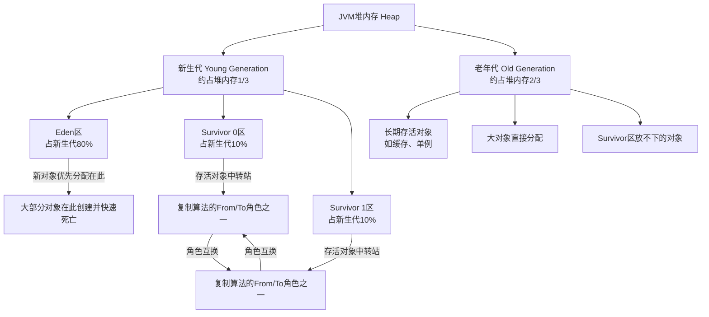
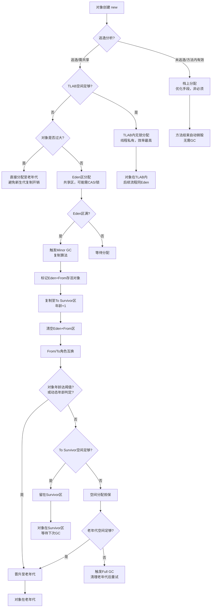
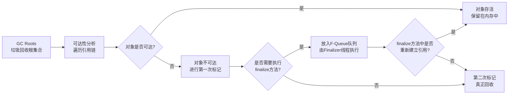
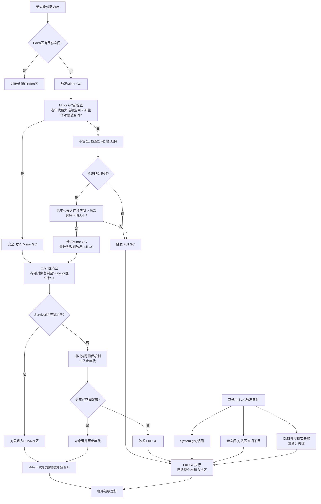
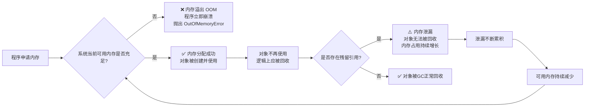
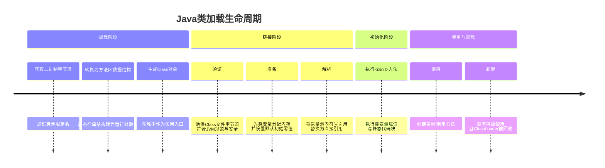
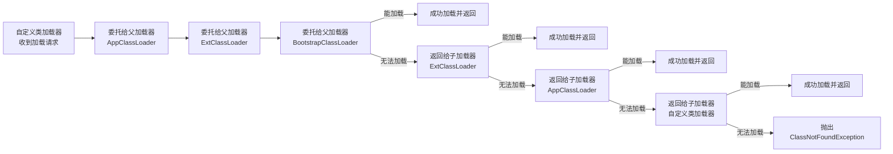

# 面向对象
## 1. 封装、继承、多态、抽象各自的含义？各举一个Android中开发的实际例子
- 封装：封装是指将对象的属性（数据）和行为（方法）结合在一起，并隐藏对象的内部实现细节，仅对外暴露必要的访问接口。它的核心目的是“高内聚、低耦合”，保护数据不被外部随意修改，提高代码的安全性。
- 继承：继承是指一个子类可以继承父类的属性和方法，并可以在此基础上进行扩展或重写。它的主要目的是**代码复用**，建立类之间的层次关系。
- 多态：多态是指父类引用指向子类对象时，调用同一个方法，会根据实际实例化的子类对象不同而表现出不同的行为。它的核心是**接口与实现的分离**，提高了代码的灵活性和可扩展性。
- 抽象：抽象是指从具体事物中抽取本质特征，忽略非本质细节，形成概念或类的过程。在编程中，通过**抽象类**或**接口**来定义一套规范（有什么功能），但不关心具体怎么实现。它的目的是**制定标准，降低耦合**。

	总结对比

| 特性     | 核心目的         | 一句话理解             | Android开发举例                           |
| :----- | :----------- | :---------------- | :------------------------------------ |
| **封装** | 隐藏内部细节，保护数据  | 把复杂逻辑装进黑盒，只留开关    | `ViewModel` 隐藏网络逻辑，暴露 `LiveData`      |
| **继承** | 代码复用，扩展功能    | 子类拿父类的东西用，并加自己的东西 | `ProgressButton` 继承 `AppCompatButton` |
| **多态** | 接口与实现分离，灵活替换 | 同一指令，不同对象有不同反应    | `RecyclerView.Adapter` 绑定不同类型数据       |
| **抽象** | 制定标准，定义规范    | 只定义“做什么”，不定义“怎么做” | 定义 `ApiCallback` 接口规范网络回调             |


## 2. 重载(Overload)和重写(Override)的区别？@Override注解的作用

### 一、 重载与重写的区别
可以通过一个对比表格来直观理解：

| 对比维度 | 重载 | 重写 |
| :--- | :--- | :--- |
| **英文** | Overload | Override |
| **发生位置** | 发生在**同一个类**中（也可发生在父类与子类之间，但通常指同类） | 发生在**父子类**之间 |
| **方法名** | 必须**相同** | 必须**相同** |
| **参数列表** | 必须**不同**（个数、类型、顺序不同） | 必须**完全相同** |
| **返回值类型** | 可以不同（但不能仅靠返回值不同来区分重载） | 必须相同，或是其子类型（协变返回类型） |
| **访问修饰符** | 没有限制 | 子类方法的访问级别**不能比父类更严格**（如父类是`public`，子类不能改成`protected`） |
| **抛出异常** | 没有限制 | 子类抛出的异常不能比父类更宽泛 |
| **核心目的** | 在同类中提供**同名但不同参数**的方法，减轻起名的负担 | 子类改变父类的行为实现，体现**动态多态** |
| **绑定时机** | **静态分派**（编译期根据参数类型决定调用哪个方法） | **动态分派**（运行期根据实际对象类型决定调用哪个方法） |
 简单代码示例对比：
**1. 重载例子：**
```kotlin
class MathUtils {
    // 两个 int 相加
    fun add(a: Int, b: Int): Int { return a + b }
    
    // 三个 int 相加（参数个数不同，构成重载）
    fun add(a: Int, b: Int, c: Int): Int { return a + b + c }
    
    // 两个 Double 相加（参数类型不同，构成重载）
    fun add(a: Double, b: Double): Double { return a + b }
}
```
**2. 重写例子：**
```kotlin
open class Animal {
    open fun makeSound() {
        println("发出某种声音")
    }
}
class Dog : Animal() {
    // 方法名、参数相同，重写了父类方法
    override fun makeSound() {
        println("汪汪汪")
    }
}
```
 二、 `@Override` 注解的作用
在 Java 和 Kotlin 中，`@Override` 是一个标准的编译期注解。它的核心作用是**让编译器帮我们做语法检查，防止人为出错**。
具体作用体现在以下两个方面：
1. 检查方法是否真的被重写（防手误）
如果我们在子类中写了一个方法，本意是重写父类的方法，但不小心把方法名拼错了，或者参数列表写错了。如果没有 `@Override` 注解，编译器会认为这是一个全新的方法，而不是重写，这会导致运行时多态失效，且极难排查。
**反面例子（不加注解的危险）：**
```java
class Animal {
    public void makeSound() { }
}
class Dog extends Animal {
    // 本意是重写，但手误拼成了 makeSou nd
    public void makeSou nd() { 
        // 编译器不报错，以为是你新写的方法。结果运行时狗叫不出来。
    }
}
```
**正面例子（加注解的安全）：**
```java
class Dog extends Animal {
    @Override
    public void makeSou nd() { 
        // 编译器直接报错：Method does not override method from its superclass
        // 提前杜绝了Bug
    }
}
```
 2. 提高代码可读性，作为强声明
当其他开发者（或未来的自己）阅读这段代码时，看到 `@Override` 注解，就能立刻明白：**这个方法不是当前类首创的，而是继承自父类或实现的接口，并且它的行为被改变了**。这大大降低了阅读代码的理解成本。
---
三、 Android开发中的实际场景
*   **重载的常见场景**：Android中 `Context` 类的 `startActivity` 方法就有多个重载版本；或者自定义 View 的构造函数，通常会有 1 个参数、2 个参数、3 个参数的重载（用于在代码中直接 new、解析 XML 属性等）。
*   **重写与@Override的常见场景**：在 Android 开发中，我们几乎每天都在重写 `Activity` 或 `Fragment` 的生命周期方法。每次写 `onCreate`、`onResume` 时加上 `@Override`，可以确保如果将来 Android 框架修改了这些方法的方法名或参数，我们的代码能在编译期立即报错并暴露问题。

## 3. 接口和抽象的区别？Java8之后接口的default方法改变了什么

### 一、 接口与抽象类的核心区别
可以通过一个经典的比喻来理解：
*   **抽象类**像是**亲爹**，有血缘关系，子类继承父类的基因（属性和方法），只能认一个爹（单继承）。
*   **接口**像是**技能证书**（如驾照、英语六级），规定了必须会做什么（方法），一个人可以考取多个证书（多实现）。
具体区别如下表：

| 对比维度 | 抽象类 | 接口 |
| :--- | :--- | :--- |
| **核心目的** | **代码复用**（提取共性，包含状态和具体实现） | **制定规范/契约**（定义行为标准，解耦） |
| **继承关系** | 单继承：一个子类只能继承一个抽象类 | 多实现：一个类可以实现多个接口 |
| **成员变量（状态）**| 可以有普通成员变量，可以修改（具有状态） | 只能有静态常量（隐式为 `public static final`），无状态 |
| **方法实现** | 可以有普通方法的具体实现，也可以有抽象方法 | Java 8 之前全为抽象方法；Java 8 后可有 `default` 和 `static` 方法 |
| **构造函数** | 有构造函数（供子类通过 `super` 调用初始化父类状态） | 没有构造函数 |
| **访问修饰符** | 成员可以有各种访问级别 | 全部隐式为 `public`（Java 9 后支持 `private`） |
#### Android开发中的例子对比：
*   **抽象类例子**：`BaseActivity`、`BaseFragment`。我们在里面写好了通用的逻辑（如初始化 Loading 框架、埋点统计、权限封装），并定义了抽象方法 `getLayoutId()` 强制子类实现。这体现了**代码复用**。
*   **接口例子**：`OnClickListener`、`Runnable`。它们只定义了“点击时触发”或“执行任务”的动作契约，不关心是谁点击、怎么执行。这体现了**行为规范**。
---
### 二、 Java 8 的 `default` 方法改变了什么？
在 Java 8 之前，接口只能包含抽象方法（无具体实现）。如果要在接口中增加一个新方法，所有实现该接口的类都必须强制修改并实现这个新方法，这会导致巨大的破坏性（例如 Java 集合框架的痛苦）。
Java 8 引入了 `default` 关键字，允许在接口中提供方法的默认实现。
#### 1. 它带来的具体改变：
*   **接口可以向后兼容，平滑演进：**
    这是设计 `default` 方法的根本原因。Java 8 想引入 Lambda 和 Stream API，需要给 `List`、`Collection` 等老接口增加 `stream()`、`forEach()` 等方法。如果没有 `default`，全世界的 Java 代码都会编译报错。有了它，接口增加默认方法，老的实现类无需修改代码依然能正常运行。
*   **接口具备了提供基础实现的能力：**
    接口不再纯粹是“只定义不实现”的契约，它可以自带一套默认逻辑，减少了实现类的重复代码。
*   **带来了“多继承冲突”问题（菱形继承）：**
    因为一个类可以实现多个接口，如果两个接口里有同名同参数的 `default` 方法，子类该听谁的？Java 规定此时子类**必须强制重写**该方法，或者在方法内部显式调用 `接口名.super.方法名()` 来消除歧义。
#### 2. 改变后的对比（接口更像抽象类了吗？）：
引入 `default` 后，接口和抽象类的界限变得模糊了一些，因为接口也能写方法体了。但**核心界限依然存在**：
*   接口依然**不能有状态**（不能有普通成员变量，除非是静态常量）。
*   接口依然**没有构造函数**。
*   抽象类更适合表示**“是什么”**（is-a 关系，如狗是动物），接口更适合表示**“能做什么”**（can-do 关系，如能跑、能飞）。
---
### 三、 Android开发中的实际例子
在 Android 开发中，你经常会遇到带有 `default` 方法的接口。
#### 例子：数据回调接口
假设我们有一个网络请求的回调接口，以前如果有 5 个方法，实现类就必须被迫写 5 个空实现，非常臃肿。
**Java 8 之前：**
```java
interface ApiCallback {
    void onSuccess(Data data);
    void onError(Throwable e);
    void onLoading(); // 可能有些类不需要处理 Loading，但也必须实现
}
```
**Java 8 之后（使用 default）：**
```java
public interface ApiCallback<T> {
    void onSuccess(T data);
    
    void onError(Throwable e);
    
    // 使用 default 提供默认空实现
    default void onLoading() {
        // 默认什么都不做
    }
    
    // 甚至可以基于其他抽象方法写默认逻辑
    default void logDebug() {
        System.out.println("当前回调状态");
    }
}
// 实现类：只想处理成功和失败，不需要重写 onLoading，代码非常干净
class MyCallback implements ApiCallback<String> {
    @Override
    public void onSuccess(String data) { 
        // 更新UI 
    }
    
    @Override
    public void onError(Throwable e) { 
        // 弹Toast 
    }
}
```
**总结：** `default` 方法赋予了接口“在不破坏现有架构的前提下，向后兼容并扩展新功能”的能力，同时也常用于实现**接口回调的空实现模式**，避免让实现类编写大量无用的样板代码。

## 4. 为什么说组合优于继承，Android中哪些地方体现了这个原则
“组合优于继承”是面向对象设计原则中非常重要的一条（出自《Effective Java》和设计模式核心思想）。
### 一、 为什么说“组合优于继承”？
继承和组合都是代码复用的手段，但继承往往会被滥用，导致系统变得脆弱。核心原因有以下几点：
#### 1. 继承破坏了封装性（白盒复用）
*   **继承**是一种“白盒”复用，子类高度依赖父类的实现细节。如果父类在未来的版本中修改了内部逻辑（比如改变了某个方法的执行顺序），子类的功能可能会莫名其妙地崩溃。
*   **组合**是一种“黑盒”复用，你只是把对象当作一个组件拿来用，只关心它暴露的接口，不关心它内部怎么实现。父组件内部的变化不会影响到使用它的类。
#### 2. 继承是静态的、强耦合的（编译期决定）
*   **继承**在编译期就确定了关系（`extends`），你不能在运行时动态地改变父类的行为。
*   **组合**是动态的，你可以在运行时通过依赖注入或 Setter 方法，替换掉组件的具体实现类，从而灵活地改变对象的行为。
#### 3. 继承受限于单继承
*   Java/Kotlin 只允许单继承。如果一个类为了复用代码而强行继承一个父类，它就无法再继承其他类了。而且如果为了复用某一个小功能而去继承一个庞大的基类，往往会带来“米袋子买米”的冗余（不需要的方法也被迫继承了）。
*   **组合**没有数量限制，你可以把多个不同类别的对象组合到一个类中。
#### 4. 继承容易造成层级过深、逻辑混乱
*   为了复用代码，开发者喜欢层层继承（`BaseActivity` -> `BaseMvpActivity` -> `BaseNetActivity` -> `MainActivity`）。随着业务发展，父类里塞满了各种不相关的通用逻辑，导致子类背上了沉重的包袱，排查 Bug 时要在多个层级间跳跃。
---
### 二、 Android 中体现“组合优于继承”的实际例子
Android 源码和日常开发中，到处都有“组合”的影子，最典型的莫过于设计模式中的**装饰器模式**、**代理模式**和**策略模式**。
#### 例子 1：ContextWrapper（装饰器模式）—— 最经典的体现
这是 Android 中最经典的“组合优于继承”案例。
*   **反面假设：** 如果想给 `Context` 增加功能（比如带有 Theme 的 `ContextThemeWrapper`，或者带 UI 展示的 `Activity`），如果用继承，代码会变成 `Activity extends ContextThemeWrapper extends ContextWrapper extends Context`。层级极深，且不同分支（Service、Application）无法复用。
*   **实际设计：** Android 使用了 `ContextWrapper`。
    ```java
    public class ContextWrapper extends Context {
        // 组合：持有一个真正的 Context 引用（通常是 ContextImpl）
        Context mBase; 
        public ContextWrapper(Context base) {
            mBase = base;
        }
        @Override
        public Resources getResources() {
            // 代理/转发：把操作交给内部的 mBase 执行
            return mBase.getResources();
        }
    }
    ```
    通过**组合**，`ContextWrapper` 不需要知道 `Context` 怎么获取资源，它只是持有一个真正的实现类（`ContextImpl`），并将请求转发过去。`Activity`、`Service` 都继承自 `ContextWrapper`，但它们的功能扩展都是基于组合不同的基础组件来完成的。
#### 例子 2：RecyclerView 的 Adapter（策略模式）
在早期的 `ListView` 时代，如果要给列表设置点击事件，往往是直接在 `Adapter` 的 `getView()` 方法里写 `setOnClickListener`，导致列表逻辑和点击逻辑耦合在一起。
现代的 `RecyclerView.Adapter` 则倾向于组合：
*   `Adapter` 只负责“提供数据和创建视图”（组装组件）。
*   点击事件、滑动删除、拖拽排序等附加功能，**不通过继承 Adapter 来实现**，而是通过组合 `ItemTouchHelper` 或在外部组合 `RecyclerView.OnItemTouchListener` 来完成。
#### 例子 3：View 的 `setOnClickListener`（策略模式）
*   **反面假设：** 如果要实现不同点击效果，创建 `ClickView`、`LongClickView`、`DoubleClickView` 继承 View？
*   **实际设计：** View 内部组合了一个 `OnClickListener` 接口。
    ```java
    public class View {
        private OnClickListener mListener;
        
        public void setOnClickListener(OnClickListener l) {
            mListener = l;
        }
    }
    ```
    通过组合，任何外部类只要实现了 `OnClickListener` 接口，就能赋予 View 不同的点击行为，运行时随时可以替换，极其灵活。
#### 例子 4：MVP / MVVM 架构中的分层组合
在架构设计中，如果用继承，会写出 `BaseMvpActivity` -> `BaseNetActivity` -> `BaseActivity` 这种面条式代码。
现代 Android 推崇**组合**：
*   **Activity/Fragment (View层)** 不继承庞大的基类，而是通过**组合**持有一个 `Presenter` 或 `ViewModel` 对象。
*   网络请求逻辑不写在 Activity 里，而是**组合**一个 `Repository` 对象。
*   Activity 就像一个组装车间：把 View、ViewModel、Repository 这些独立的零件**组合**在一起，各司其职，谁也不依赖谁的内部实现。
#### 例子 5：Glide / Picasso 等图片加载库
*   **继承方案：** 创建 `CircleImageView extends ImageView`，然后再写 `RoundRectImageView extends ImageView`。这种方式与具体的 View 绑定死，复用性极差。
*   **组合方案：** Glide 采用组合策略。`ImageView` 还是原生的 `ImageView`，Glide 将 `BitmapTransformation`（如圆形变换、高斯模糊变换）作为一个个小策略对象，**组合**到图片加载请求中。通过 `.transform(new CircleTransform())` 传入不同的组件，实现了灵活的图片变换，完全不需要修改或继承 `ImageView`。
---
### 总结
**什么时候用继承？** 
当你表达的是 **"Is-a"（是一个）** 的关系，且两者有极强的生命周期和语义关联时（比如 `Dog extends Animal`，`Square extends Shape`）。
**什么时候用组合？** 
当你表达的是 **"Has-a"（有一个）** 或 **"Can-do"（能做某事）** 的关系时。在 Android 开发中，绝大多数业务架构、功能扩展（如网络、图片、点击、UI 结构）都应该优先使用组合，以保持代码的松耦合和可测试性。

## 5. 内部类的4种类型(成员内部类、静态内部类、局部内部类、匿名内部类)各自的特点和使用场景
在 Java 和 Kotlin 中，内部类是一种非常重要的代码组织方式。根据定义的位置和修饰符，内部类主要分为 4 种类型。它们各自有不同的访问权限、生命周期和使用场景。
### 1. 成员内部类
**定义位置：** 直接定义在外部类的内部，与外部类的成员变量、方法同级，且**没有 `static` 修饰**。
**特点：**
*   **持有外部类引用：** 内部隐式持有一个外部类的实例引用（`Outer.this`），因此它可以无条件访问外部类的所有成员（包括 `private` 变量和方法）。
*   **依赖外部类实例：** 必须先创建外部类实例，才能创建成员内部类实例。不能独立存在。
*   **不能包含静态成员：** 内部不能定义 `static` 变量或方法（因为其自身就是非静态的，依赖于对象）。
**使用场景：**
当内部类逻辑上属于外部类的一部分，且需要频繁访问外部类的状态时使用。但在 Android 开发中，**这是导致内存泄漏的常见元凶之一**（如果内部类生命周期比外部类长，比如异步耗时操作）。
**Android实际例子：**
早期的 MVP 架构中，Presenter 直接写在 Activity 内部作为成员内部类。
```java
public class MainActivity extends Activity {
    private String userData = "Data";
    // 成员内部类
    class MyPresenter {
        void loadData() {
            // 可以直接访问外部类的 private 变量
            System.out.println(userData); 
        }
    }
}
```
---
### 2. 静态内部类
**定义位置：** 定义在外部类内部，使用 `static` 修饰。
**特点：**
*   **不持有外部类引用：** 这是最本质的区别。它是一个独立的类，只是借着外部类的命名空间。
*   **不依赖外部类实例：** 可以直接 `new Outer.StaticInner()` 创建实例，无需先创建外部类。
*   **访问限制：** 只能直接访问外部类的 `static` 静态成员，访问非静态成员需要通过外部类的实例。
*   **可包含静态成员：** 内部可以有普通的 `static` 变量和方法。
**使用场景：**
当内部类不需要访问外部类的非静态状态时，**强烈建议将内部类声明为 `static`**。它可以有效避免内存泄漏，常用于封装与外部类相关的工具方法或数据模型。
**Android实际例子：**
最经典的例子是 `RecyclerView.Adapter` 和 `ViewHolder`。`ViewHolder` 不需要持有 `Activity` 的引用，所以声明为静态内部类。
```java
public class MyAdapter extends RecyclerView.Adapter<MyAdapter.MyViewHolder> {
    
    // 静态内部类：不持有 Activity 引用，避免内存泄漏
    static class MyViewHolder extends RecyclerView.ViewHolder {
        TextView textView;
        MyViewHolder(View itemView) {
            super(itemView);
            textView = itemView.findViewById(R.id.text);
        }
    }
}
```
---
### 3. 局部内部类
**定义位置：** 定义在外部类的**方法、构造器或代码块内部**。
**特点：**
*   **作用域极小：** 只能在定义它的方法内部实例化和使用，对外部完全隐藏。
*   **持有外部类引用：** 同样隐式持有外部类实例引用。
*   **访问局部变量限制：** 如果方法内有局部变量，局部内部类只能访问被 `final` 修饰的局部变量（Java 8 后只要事实上是 `final` 即可，即 effectively final）。
**使用场景：**
用于封装那些只在某个特定方法内部使用、且逻辑较复杂的计算或回调处理。不想让外部类的其他方法看到它。
**Android实际例子：**
在某个复杂的数据解析方法中，临时定义一个类来封装解析结果。
```java
public void parseData(String json) {
    int errorCode = 0; // effectively final
    // 局部内部类
    class ParseResult {
        String data;
        boolean isSuccess() {
            return errorCode == 0; // 可以访问方法的 final 变量
        }
    }
    
    ParseResult result = new ParseResult();
    // 处理 result...
}
```

### 4. 匿名内部类
**定义位置：** 没有名字的内部类，直接在需要传递对象的地方通过 `new` 关键字实例化并定义类体。
**特点：**
*   **没有名字：** 只能实例化一次。
*   **必须继承或实现：** 必须继承一个父类或实现一个接口，并在 `new` 的同时实现其方法。
*   **持有外部类引用：** 同样隐式持有外部类引用。
*   **编译后命名：** 编译后会生成 `OuterClass$1.class` 这样的文件。
**使用场景：**
Android 开发中**最最最常用**的内部类。用于创建只需使用一次的回调、监听器或线程任务，避免为了一个简单接口专门去写一个独立的实现类。
**Android实际例子：**
各种点击事件监听、网络请求回调、Runnable 任务。
```java
button.setOnClickListener(new View.OnClickListener() { // 匿名内部类，实现 OnClickListener 接口
    @Override
    public void onClick(View v) {
        // 持有外部 Activity 的引用，如果在 Activity 销毁时未释放，可能导致内存泄漏
        Toast.makeText(MainActivity.this, "Clicked", Toast.LENGTH_SHORT).show();
    }
});
new Thread(new Runnable() { // 匿名内部类，实现 Runnable 接口
    @Override
    public void run() {
        // 执行耗时操作
    }
}).start();
```
---
### 总结与对比表
| 类型 | 持有外部类引用? | 能否访问外部类所有成员? | 核心使用场景 | 内存泄漏风险 |
| :--- | :--- | :--- | :--- | :--- |
| **成员内部类** | 是 | 是 | 与外部类关系紧密，需频繁访问外部状态 | 高 (若生命周期长于外部类) |
| **静态内部类** | **否** | 只能访问静态成员 | 封装与外部类相关的数据模型/工具类，**Android最推荐** | 低 (独立存在) |
| **局部内部类** | 是 | 是 (含方法内 final 变量) | 仅在单个方法内部使用的复杂辅助逻辑 | 中 |
| **匿名内部类** | 是 | 是 | 一次性使用的回调、监听器、线程任务 | 高 (异步耗时操作时) |
**开发建议：** 在 Android 开发中，如果内部类不需要访问外部类的实例变量，**永远优先考虑使用静态内部类**（或者在 Kotlin 中将其放到顶层作为独立类）。匿名内部类在做耗时操作（如网络请求、线程）时，务必注意在 `onDestroy` 时取消任务，防止内存泄漏。

## 6. 静态内部类和非静态内部类持有外部类引用的区别，为什么Handler容易导致内存泄漏

### 一、 静态 vs 非静态内部类持有外部类引用的区别
#### 1. 非静态内部类（成员内部类、匿名内部类等）
*   **持有状态：** **隐式持有**外部类的强引用。
*   **底层实现原理：** 
    当你在 Java 中定义一个非静态内部类时，编译器会在编译期悄悄给这个内部类的**构造函数**注入一个参数，这个参数就是外部类的实例。并在内部类内部生成一个名为 `this$0` 的隐藏变量来保存这个外部类实例。
    ```java
    // 你写的代码
    class Outer {
        class Inner { 
            void doSomething() { /* 访问 Outer 的属性 */ }
        }
    }
    
    // 编译器实际生成的代码（伪代码）
    class Outer$Inner {
        Outer this$0; // 隐藏的外部类引用！
        
        Outer$Inner(Outer outer) { // 构造函数需要传入外部类
            this.this$0 = outer;
        }
        void doSomething() { 
            this$0.访问Outer的属性; // 通过隐藏引用访问外部类
        }
    }
    ```
*   **结果：** 只要内部类对象还活着，外部类对象就绝对无法被垃圾回收（GC）。
#### 2. 静态内部类
*   **持有状态：** **不持有**外部类的引用。
*   **底层实现原理：**
    加了 `static` 修饰后，静态内部类属于外部类本身，而不属于外部类的某个实例。编译器**不会**为它生成 `this$0` 变量，它的构造函数也不需要传入外部类实例。
*   **结果：** 静态内部类的生命周期与外部类实例完全独立。静态内部类对象活着，不影响外部类对象被 GC 回收。
---
### 二、 为什么 Handler 容易导致内存泄漏？
这是非静态内部类持有外部类引用在 Android 中最典型的“灾难现场”。
#### 1. 泄漏的链条分析
我们来看一段经典的错误代码：
```java
public class MainActivity extends AppCompatActivity {
    
    // 1. 匿名内部类（非静态内部类），持有 MainActivity 的引用
    private final Handler handler = new Handler() {
        @Override
        public void handleMessage(@NonNull Message msg) {
            // 更新 MainActivity 的 UI
        }
    };
    @Override
    protected void onCreate(Bundle savedInstanceState) {
        super.onCreate(savedInstanceState);
        setContentView(R.layout.activity_main);
        
        // 2. 发送一个延迟 10 分钟执行的消息
        handler.postDelayed(new Runnable() {
            @Override
            public void run() {
                // 耗时或延迟操作
            }
        }, 10 * 60 * 1000); 
        
        // 3. 假设用户立刻按下了返回键，退出了 MainActivity
    }
}
```
**内存泄漏的形成过程（引向连锁反应）：**
1.  **内部类持引用：** `handler` 是一个匿名内部类实例，它内部持有 `MainActivity` 的强引用（`this$0 = MainActivity实例`）。
2.  **Message 持引用：** 当调用 `postDelayed` 时，`Handler` 会将 `Runnable` 包装成一个 `Message` 对象。这个 `Message` 对象内部有一个 `target` 变量，指向了发送它的 `Handler`（即 `Message.target = handler`）。
3.  **队列持引用：** 这个 `Message` 被发送到了全局的 `MessageQueue`（消息队列）中，等待 10 分钟后被执行。`MessageQueue` 被 `Looper` 持有，而主线程的 `Looper` 是贯穿整个应用生命周期的。
4.  **Activity 销毁：** 用户立刻退出了 `MainActivity`，正常情况下它应该被 GC 回收。
5.  **泄漏发生：** 此时，强大的引用链形成了：
    `主线程 Looper` -> `MessageQueue` -> `Message` (存活 10 分钟) -> `Handler` (target) -> `MainActivity` (`this$0`)。
**结论：** 因为 `Message` 还要在队列里等 10 分钟，它死死拽着 `Handler`，而 `Handler` 又死死拽着 `MainActivity`。导致这个已经销毁的 `Activity` 无法被 GC 回收，造成了严重的内存泄漏。
#### 2. 正确的写法（如何解决）
解决的核心思路是：**切断内部类对外部类的强引用**。
**步骤一：将 Handler 声明为静态内部类。**
**步骤二：通过弱引用传递外部类实例，这样既能在需要时调用外部类的方法，又不会阻止外部类被 GC 回收。**
**步骤三：在 Activity 销毁时，移除所有回调。**
```java
public class MainActivity extends AppCompatActivity {
    
    // 1. 静态内部类，不持有外部类引用
    private static class SafeHandler extends Handler {
        // 2. 持有外部类的弱引用（WeakReference）
        private final WeakReference<MainActivity> activityRef;
        SafeHandler(MainActivity activity) {
            activityRef = new WeakReference<>(activity);
        }
        @Override
        public void handleMessage(@NonNull Message msg) {
            MainActivity activity = activityRef.get();
            // 3. 使用前判空：如果 Activity 已被 GC 回收，就不做任何操作
            if (activity != null && !activity.isFinishing()) {
                // 安全地更新 UI
            }
        }
    }
    private final SafeHandler handler = new SafeHandler(this);
    @Override
    protected void onCreate(Bundle savedInstanceState) {
        super.onCreate(savedInstanceState);
        handler.postDelayed(() -> { /*...*/}, 10 * 60 * 1000);
    }
    @Override
    protected void onDestroy() {
        super.onDestroy();
        // 4. 极其重要：在 Activity 销毁时，移除队列中所有未处理的消息
        handler.removeCallbacksAndMessages(null); 
    }
}
```
### 三、 总结
*   **区别本质：** 非静态内部类编译器会偷偷注入外部类引用（`this$0`），静态内部类则不会。
*   **Handler 泄漏本质：** 非静态的 Handler 持有 Activity -> Message 持有 Handler -> 长期存活的 MessageQueue 持有 Message。导致短生命周期的 Activity 被长期存活的 Looper 队列间接持有，无法回收。
*   **防御策略：** 静态内部类 + 弱引用 + `onDestroy` 移除消息（防患于未然，最保险的做法）。


# 集合框架
## 1. ArrayList和LinkedList的底层数据结构？增删改查的时间复杂度？什么场景用哪个

### 一、 底层数据结构
#### 1. ArrayList
*   **底层结构：动态数组**。
*   **特点：** 在内存中分配一块**连续的内存空间**。它实现了 `RandomAccess` 接口（标记接口），支持随机访问。
*   **扩容机制：** 当元素填满当前数组时，它会创建一个更大的新数组（通常扩容为原来的 1.5 倍），并将老数组的数据复制过去。
#### 2. LinkedList
*   **底层结构：双向链表**。
*   **特点：** 在内存中是**非连续**的，每个节点包含数据本身、指向前一个节点的指针（`prev`）和指向后一个节点的指针（`next`）。它同时实现了 `List` 接口和 `Deque` 接口，因此也可以当作队列/双端队列使用。
---
### 二、 增删改查的时间复杂度
这是两者最大的区别，`LinkedList` 经常被误解为“增删一定快”，其实并不完全准确。

| 操作 | ArrayList (动态数组) | LinkedList (双向链表) | 胜出者 |
| :--- | :--- | :--- | :--- |
| **查** | **O(1)** | **O(n)** | **ArrayList** |
| **改** | **O(1)** | **O(n)** | **ArrayList** |
| **增(尾部)** | **O(1)** (均摊) | **O(1)** | 平局 |
| **增(指定位置)** | **O(n)** | **O(n)** | 理论平局，实际 ArrayList 常胜 |
| **删(尾部)** | **O(1)** | **O(1)** | 平局 |
| **删(指定位置)**| **O(n)** | **O(n)** | 理论平局，实际 ArrayList 常胜 |
#### 重点解析（容易踩坑的地方）：
1.  **为什么 LinkedList 在指定位置增删也是 O(n)？**
    *   虽然 LinkedList 修改节点指针的操作确实是 O(1)，但**找到那个位置的节点需要从头遍历**，这个寻找的过程是 O(n)。所以总体时间复杂度依然是 O(n)。
2.  **为什么实际开发中，指定位置增删 ArrayList 往往比 LinkedList 还快？**
    *   对于 `ArrayList`，在中间插入/删除需要移动后续元素，这底层调用的是 `System.arraycopy()`，属于**内存连续空间的批量移动**，对 CPU 缓存非常友好，速度极快。
    *   对于 `LinkedList`，寻找节点需要沿着指针跳跃寻址（**内存不连续，无法利用 CPU 缓存**），且每次增删都要创建新的 `Node` 对象，开销反而更大。
3.  **ArrayList 尾部增删的 O(1) 均摊：**
    *   大多数情况下直接放入数组尾部，是 O(1)。偶尔触发扩容需要复制数组，是 O(n)，但均摊到每次操作，平均时间仍是 O(1)。
---
### 三、 使用场景
在实际的 Android/Java 开发中，**95% 以上的场景都在使用 ArrayList**。
#### 1. 什么时候用 ArrayList？（绝大多数场景）
*   **需要频繁读取/随机访问**（通过索引 `get(i)`）。
*   **频繁在尾部追加或删除元素**。
*   **你不确定用哪个时**，优先选 ArrayList。它的综合性能最好，内存开销也更小（链表每个节点还要额外存两个指针）。
*   *Android 例子：* RecyclerView 的数据源列表、从服务器拉取的 JSON 数组解析结果、Adapter 里的数据集合，几乎全都是 `ArrayList`。
#### 2. 什么时候用 LinkedList？（极少数特殊场景）
*   **需要频繁在头部插入或删除元素**。因为链表头部的增删只需修改头指针，时间复杂度是真正的 **O(1)**，而 ArrayList 在头部增删需要移动整个数组，是 O(n)。
*   **需要频繁当作队列或双端队列使用时**（利用其 `addFirst`, `removeFirst` 等特性）。
*   *Android 例子：* 实现一个 LRU 缓存的底层数据结构（虽然 Android 源码用了 LinkedHashMap，但概念相似）、需要维护一个频繁在队首和队尾操作的任务队列。
### 总结
*   **内存连续** 赋予了 `ArrayList` 极速的随机访问能力和极快的批量内存复制能力，是日常开发的**首选**。
*   **指针链接** 赋予了 `LinkedList` 在头尾操作的绝对优势，但在中间操作和读取上毫无优势，甚至因为内存碎片化导致实际性能更差。

## 2. hashMap的put过程(哈希计算->数组定位->链表/红黑树)
`HashMap` 的 `put()` 方法是面试中最常考的考点之一，因为它涵盖了哈希计算、数组初始化、链表处理、红黑树转换以及扩容等核心机制。

### 第一步：计算 Hash 值（扰动处理）
*   **操作：** 调用 `key.hashCode()` 得到原本的哈希值，然后再进行一次“扰动处理”。
*   **代码逻辑：** `hash = (key == null) ? 0 : (h = key.hashCode()) ^ (h >>> 16);`
*   **为什么这么做？** 将高 16 位与低 16 位进行异或运算。因为数组长度通常较小，计算索引时只用到了低位，这样做可以让高位的数据也参与到索引计算中，减少哈希冲突。
### 第二步：判断数组是否为空（懒加载初始化）
*   **操作：** 检查底层的 Node 数组 `table` 是否为 `null`，或者长度是否为 0。
*   **结果：** 如果是，说明第一次插入数据，调用 `resize()` 方法进行初始化，分配默认长度（16）。
### 第三步：计算索引位置并判断是否哈希冲突
*   **计算索引：** `index = (n - 1) & hash;`（`n` 是数组长度。这里用位运算代替取模 `hash % n`，前提是 `n` 必须是 2 的幂次方，这就是为什么 HashMap 容量必须是 2 的幂次方的原因）。
*   **判断冲突：** 查看该索引位置 `table[index]` 是否为空。
*   **无冲突：** 直接创建一个新的 `Node` 节点放入该位置，跳到第六步。
*   **有冲突：** 进入第四步处理冲突。
### 第四步：处理哈希冲突（分三种情况）
如果该位置已经有数据了，需要判断当前要插入的 `key` 是否与已存在的 `key` 相同：
1.  **情况 A：Key 完全相同（替换旧值）**
    *   判断 `hash` 值相等，且 `key` 地址相等或者 `equals()` 相等。
    *   说明是同一个 Key，记录下这个旧节点，跳到第六步准备覆盖旧 Value。
2.  **情况 B：该节点是红黑树节点**
    *   判断该节点是否是 `TreeNode` 实例。
    *   如果是，说明该桶位已经树化。调用红黑树的 `putTreeVal()` 方法遍历树并插入节点（或找到相同 Key 的节点准备替换）。
3.  **情况 C：该节点是链表节点**
    *   如果不是红黑树，说明是单链表。从头到尾遍历链表：
    *   如果在遍历过程中找到了相同的 Key（`hash` 和 `equals` 相等），记录下这个旧节点，跳到第六步准备替换。
    *   如果遍历到了链表尾部都没找到相同的 Key，则在尾部追加一个新节点（**尾插法**，JDK 1.7 是头插法）。
    *   **关键检查：** 插入新节点后，检查链表长度是否达到了 **8**（`TREEIFY_THRESHOLD`）。如果达到了，调用 `treeifyBin()` 方法。*注意：此时不一定会树化，还会判断当前数组长度是否达到了 64（`MIN_TREEIFY_CAPACITY`），没达到则优先扩容；达到了才真正转为红黑树。*
### 第五步：检查是否需要扩容
*   **操作：** 插入新节点后，将修改次数 `modCount` 加 1，并将大小 `size` 加 1。
*   **判断：** 检查新的大小 `size` 是否大于扩容阈值 `threshold`（`容量 * 负载因子(默认0.75)`）。
*   **结果：** 如果超过了阈值，调用 `resize()` 方法进行扩容（通常是扩容为原来的 2 倍）。
### 第六步：覆盖旧值（如果存在）
*   如果在第四步中找到了一个已存在的旧节点（即 Key 相同的情况）。
*   会检查是否记录了旧值 `oldValue`，将其返回。
*   并且允许通过 `afterNodeAccess` 钩子做一些额外处理（这是给 `LinkedHashMap` 留的方法，`HashMap` 是空实现）。
### 第七步：返回
*   如果是插入新节点，返回 `null`。
*   如果是替换旧节点，返回被替换掉的 `oldValue`。
---
### 流程图总结
```text
put(key, value)
   |
   v
1. 计算 key 的 hash 值 (扰动处理)
   |
   v
2. 数组 table 为空或长度为 0?
   |-- 是 --> 初始化数组 (resize)
   |
   v
3. 计算索引 i = (n-1) & hash, 检查 table[i]
   |-- table[i] == null (无冲突) --> 直接放入新节点 --> 跳到步骤 5
   |-- table[i] != null (有冲突) --> 进入步骤 4
   |
   v
4. 遍历该位置的节点:
   |-- a. key 相同 (hash相等且equals相等) --> 记录旧节点 e
   |-- b. 是红黑树节点 --> 调用红黑树插入逻辑
   |-- c. 是链表节点 --> 遍历链表:
         |-- 找到相同 key --> 记录旧节点 e
         |-- 没找到 --> 尾插法插入新节点
                  |-- 链表长度 >= 8? --> 数组长度 >= 64? --> 是:树化 / 否:扩容
   |
   v
5. 插入成功, size++, 判断 size > threshold?
   |-- 是 --> 扩容 (resize)
   |
   v
6. 如果存在记录的旧节点 e (即 key 相同):
   |-- 取出 oldValue, 用新 value 覆盖旧 value
   |
   v
7. 返回 (新节点返回 null, 替换则返回 oldValue)
```
### 面试加分项（容易踩坑的点）：
1.  **JDK 1.7 与 1.8 区别：** 1.8 引入了红黑树，把最坏查询时间从 O(n) 降到了 O(logn)；1.8 链表插入改为了**尾插法**，解决了 1.7 头插法在多线程扩容时导致的**死循环**问题（虽然依然不建议多线程使用 HashMap）。
2.  **树化的双重条件：** 链表长度达到 8 **且** 数组长度达到 64 才树化。如果链表到了 8 但数组没到 64，会选择扩容而不是树化。因为数组小时，哈希冲突概率本来就大，扩容打散更有效。
3.  **负载因子 0.75：** 是空间和时间的折中。太小（如 0.5）浪费空间；太大（如 1）冲突多查找慢。

## 3. HashMap的扩容机制(为什么容量是2，扩容因子0.75为什么合理，树化阈值为什么是8)
这三个问题可以说是 HashMap 面试中的“灵魂三问”，理解它们不仅需要懂源码，还需要懂位运算、概率论和工程实践。

### 一、 为什么容量必须是 2 的幂次方？
HashMap 的底层数组长度永远是 2 的幂次方（如 16, 32, 64）。这样做的核心目的有两个：
#### 1. 高效的位运算代替取模（提升性能）
在确定元素存放在数组的哪个索引位置时，源码使用的不是 `hash % length`，而是 **`hash & (length - 1)`**。
*   **原因：** 取模运算 `%` 在底层 CPU 指令中开销远大于位与运算 `&`。
*   **前提：** 只有当 `length` 是 2 的幂次方时，`length - 1` 的二进制全都是 `1`（例如 16-1=15，二进制 `1111`；32-1=31，二进制 `11111`）。此时 `hash & (length - 1)` 的计算结果等同于 `hash % length`，但速度极快。
#### 2. 扩容时均匀分布元素（减少哈希碰撞）
当 HashMap 扩容时（容量翻倍），原本在旧数组同一个索引位置的元素，在重新计算索引时，要么留在原位置，要么移动到“原位置 + 旧容量”的位置。
*   **原理：** 因为容量翻倍，`length - 1` 的高位多了一个 `1`。所以重新计算索引时，只需要看原哈希值在新增的那个高位是 `0` 还是 `1`：
    *   是 `0`，索引不变。
    *   是 `1`，索引 = 原索引 + 旧容量。
*   **结果：** 这种设计使得元素在扩容后能够极其均匀地打散到新数组的两个位置，不需要重新计算全部哈希，性能极高。
---
### 二、 为什么扩容因子是 0.75？
扩容因子定义为 `0.75`（即 `3/4`）。源码注释中给出的解释是时间和空间的折中。
#### 1. 空间与时间的权衡
*   **如果负载因子过大（如 1.0）：** 意味着数组填满 100% 才扩容。这样虽然**节省了空间**，但会导致大量的哈希冲突，链表/红黑树变长，**查询效率大幅下降**（从 O(1) 退化到 O(n) 或 O(logn)）。
*   **如果负载因子过小（如 0.5）：** 意味着数组填满 50% 就扩容。这样虽然冲突少，**查询效率高**，但会频繁触发扩容，**极度浪费内存空间**，且频繁扩容（数组拷贝）极其消耗性能。
*   **0.75 的折中：** 根据统计学和工程实践，0.75 是冲突率和空间利用率达到最佳平衡的黄金比例。
#### 2. 配合 2 的幂次方（整除特性）
*   0.75 是 `3/4`。当 HashMap 容量为 16 时，阈值 = `16 * 0.75 = 12`。
*   因为容量是偶数且为 2 的幂，乘以 0.75 等于乘以 3 再除以 4，结果一定是整数。这避免了浮点数计算，保证了阈值始终是整数。
#### 3. 泊松分布的概率学验证（配合树化机制）

### 三、 为什么树化阈值是 8？
当链表长度达到 8 时，才有机会转为红黑树（还要结合数组长度达到 64）。为什么偏偏选 8 这个数字？
#### 1. 概率学与泊松分布（最主要原因）
源码注释中明确给出了一个概率表格。在理想哈希分布和负载因子 0.75 下，同一个桶中节点数量的概率如下：
*   长度为 0: 0.6065306597
*   长度为 1: 0.3032653298
*   长度为 2: 0.0758163324
*   长度为 3: 0.0126360562
*   ...
*   **长度为 7: 0.0000001736**
*   **长度为 8: 0.0000000123**
**结论：** 正常情况下，链表长度达到 8 的概率不到千万分之一。如果真的达到了 8，说明哈希函数极差或者遭到了恶意攻击（哈希碰撞攻击）。此时用红黑树作为一种“兜底保护”机制，防止查询退化到 O(n)。
#### 2. 红黑树的空间与维护成本过大
*   链表节点在 Java 中是 `Node`，占用内存小。红黑树节点是 `TreeNode`，不仅包含数据，还要维护前驱、后继、父节点指针以及颜色属性，**内存占用是普通 Node 的 2 倍以上**。
*   红黑树的插入、删除需要旋转调整，维护成本比链表高得多。
*   因此，不能轻易树化。选择 8 这个极小概率值，可以保证正常业务流程中永远不会触发树化，只在极端情况保护性能。
#### 3. 阈值 8 与退化为链表的阈值 6 的设计（防止抖动）
*   如果树化阈值和退化阈值一样（比如都是 8），那么当链表长度在 8 徘徊时，频繁插入删除会导致红黑树和链表不断互相转换，造成性能抖动。
*   HashMap 设定**树化阈值为 8，退化阈值为 6**，中间留出 7 这个缓冲区间，有效避免了频繁的结构转换开销。
#### 4. 8 是斐波那契数列的一部分（附带的优良特性）
红黑树的平均查找时间复杂度是 O(log n)。在 Java 中，`TreeMap`（红黑树实现）查找一个元素的时间，大约是普通链表遍历的几十倍代价。
*   当长度为 8 时，链表最坏遍历 8 次；红黑树查找需要 `log2(8) = 3` 次。
*   时间成本上刚好形成明显的“拐点”，此时红黑树的优势开始远大于链表。
### 总结
*   **容量为 2：** 为了用 `&` 代替 `%`，且扩容时均匀打散。
*   **0.75：** 空间与时间的黄金折中点，且结合泊松分布证明极少发生严重冲突。
*   **阈值 8：** 千万分之一的极端兜底，避免红黑树的高昂内存和维护成本，留有 6-8 的防抖动缓冲。

## 4. ConcurrentHashMap在Java 7 和 Java 8的实现有何不同？(分段锁->CAS+synchronized)
`ConcurrentHashMap` 是 Java 中并发编程的基石，用于在多线程环境下提供线程安全的哈希表操作。从 Java 7 到 Java 8，它的底层实现发生了翻天覆地的变化。
### 一、 Java 7 的实现：分段锁
Java 7 的核心思想是**“将大锁拆成小锁”**，通过分段锁来实现并发。
#### 1. 底层数据结构
*   **两层结构：** 外层是一个 `Segment` 数组，内层是每个 `Segment` 包含的一个 `HashEntry` 数组。
*   可以把它理解为一个“包含多个 HashMap 的 HashMap”。
#### 2. 并发控制策略
*   **Segment 继承自 ReentrantLock（独占锁）。**
*   每次进行 `put` 操作时，先通过哈希定位到具体的 `Segment`，然后对整个 `Segment` 加锁。
*   **并发度：** 默认并发级别为 16（即 16 个 Segment）。这意味着最多支持 16 个线程同时写操作。如果超过 16 个线程同时写，依然会发生阻塞。
#### 3. 核心机制的痛点
*   **并发度固定且受限：** 16 的并发度在如今的多核 CPU 时代显得不够用。
*   **内存占用大：** 需要维护 Segment 数组和 HashEntry 数组两层结构，初始化时就分配较多内存。
*   **扩容机制笨重：** 扩容是针对单个 `Segment` 内部的 `HashEntry` 数组进行的，无法进行全局的扩容协调。
*   **get 操作不需要加锁：** 通过 `volatile` 修饰 `HashEntry` 的 value 和 next 指针来实现可见性。
---
### 二、 Java 8 的实现：CAS + synchronized + 红黑树
Java 8 彻底抛弃了 Segment 分段锁，回归到了类似 HashMap 的结构，但在并发控制上做到了极致的细粒度。
#### 1. 底层数据结构
*   **单层结构：** 去掉了 Segment，底层数组变成了 `Node` 数组。
*   **引入红黑树：** 当链表长度超过 8 且数组长度达到 64 时，链表会转化为红黑树（`TreeBin`），将最坏查询时间从 O(n) 降为 O(logn)，有效防止哈希碰撞攻击。
#### 2. 并发控制策略（极其精妙）
Java 8 把锁的粒度从 **Segment（一段）** 细化到了 **Node（单个桶头节点）**。
*   **put 操作的锁机制：**
    1.  计算索引，如果该索引位置为空，直接使用 **CAS（无锁操作）** 插入节点。
    2.  如果该位置不为空，则对该位置的**头节点加上 `synchronized` 同步块**，然后在锁内进行链表/红黑树的插入或更新操作。
*   **为什么用 synchronized 而不是 ReentrantLock？**
    *   在 Java 8 中，JVM 对 `synchronized` 进行了大量锁优化（偏向锁、轻量级锁、重量级锁）。在锁粒度极小（只锁单个节点）且绝大多数情况下没有竞争的场景下，`synchronized` 的性能并不逊色，甚至因为不需要维护 Lock 对象的状态而开销更小。
#### 3. 核心机制的升级
*   **多线程并发扩容：** 这是 Java 8 极其惊艳的设计。
    *   当一个线程触发扩容时，它会将旧数组分成多个“任务区间”。
    *   其他正在并发执行的线程在发现自己的桶正在被迁移时，会主动“帮忙”扩容，一起搬运数据。这极大地加快了扩容速度。
*   **并发计数：**
    *   Java 7 使用每个 Segment 内部维护一个 count，最后求和。
    *   Java 8 借鉴了 `LongAdder` 的思想，引入了 `CounterCell` 数组。不同线程在修改 size 时，会落在不同的 `CounterCell` 上做 CAS 累加，最后 `size = baseCount + sum(CounterCell)`，极大地减少了计数时的 CAS 冲突。
---
### 三、 核心区别总结对比表
| 对比维度 | Java 7 (ConcurrentHashMap) | Java 8 (ConcurrentHashMap) |
| :--- | :--- | :--- |
| **底层结构** | `Segment` 数组 + `HashEntry` 数组 + 链表 | `Node` 数组 + 链表 + **红黑树** |
| **锁机制** | **分段锁** (`Segment` 继承 `ReentrantLock`) | **CAS + synchronized** (锁单个桶头节点) |
| **锁粒度** | Segment 段（默认包含多个桶） | Node 桶头节点（极细） |
| **最大并发度** | 默认 16（可配置，但会浪费内存） | **等于数组长度**（随着扩容而增加） |
| **查询复杂度** | O(n) (最坏，链表遍历) | O(logn) (最坏，红黑树遍历) |
| **size() 计数** | 遍历所有 Segment 的 count 相加 | 使用 `baseCount` + `CounterCell` 数组累加 |
| **扩容机制** | 单个 Segment 内部独立扩容 | **多线程协助并发扩容**，高效搬运数据 |
| **内存占用** | 较大（两层结构，Segment 初始化分配） | 较小（一层结构，懒加载） |
### 总结
从 Java 7 到 Java 8，`ConcurrentHashMap` 的演进不仅提升了性能，更体现了并发编程思想的进步：
1.  **去掉分段锁，把锁粒度降到最低**，利用 CAS 处理空节点插入，用 `synchronized` 处理冲突节点插入，最大化并发吞吐量。
2.  **引入红黑树**，解决了极端哈希冲突下的性能退化问题。
3.  **并发扩容机制**，化敌为友，让正在阻塞的线程去帮忙扩容，体现了极高的工程智慧。

## 5. HashSet的底层实现，为什么说HashSet是基于HashMap的
**HashSet 底层就是基于 HashMap 实现的。**
**核心原理：**
*   **存储结构：** HashSet 内部维护了一个 `HashMap<E, Object>` 实例。HashSet 的元素直接作为这个 HashMap 的 **Key** 存储。
*   **Value 值的处理：** 因为 HashMap 要求 Key-Value 成对，所以 HashSet 内部定义了一个名为 `PRESENT` 的静态常量对象（`private static final Object PRESENT = new Object();`）。所有存入 HashSet 的元素，在底层 HashMap 中对应的 Value 都是同一个 `PRESENT`。
*   **方法委托：** HashSet 的 `add(e)` 实际上调用的是 `map.put(e, PRESENT)`；`remove(e)` 调用的是 `map.remove(e)`；`contains(e)` 调用的是 `map.containsKey(e)`。
**结论：** HashSet 完全就是个“披着 Set 外衣”的 HashMap。它利用 HashMap 的 Key 不可重复的特性，天然实现了 Set 集合去重的目的。

## 6. LinkedHashMap的accessOrder参数有什么作用，LRU缓存怎么用他实现
**`accessOrder` 参数的作用：**
控制迭代顺序。`false`（默认）按**插入顺序**排序；`true` 按**访问顺序**排序（每次 `get`/`put` 已存在的元素，该元素会被移到链表尾部）。
**LRU（最近最少使用）缓存实现原理：**
1.  继承 `LinkedHashMap`，构造时传入 `accessOrder = true`。
2.  重写 `removeEldestEntry(Map.Entry)` 方法，当 `size() > 设定的最大容量` 时返回 `true`，此时 `LinkedHashMap` 在每次插入后会自动删除链表头部的元素（即最久未被访问的元素）。
**极简代码示例：**
```java
class LRUCache<K, V> extends LinkedHashMap<K, V> {
    private final int maxCapacity;
    
    public LRUCache(int maxCapacity) {
        // 初始容量、负载因子、开启访问顺序
        super(maxCapacity, 0.75f, true); 
        this.maxCapacity = maxCapacity;
    }
    
    @Override
    protected boolean removeEldestEntry(Map.Entry<K, V> eldest) {
        return size() > maxCapacity; // 超出容量则淘汰最老元素
    }
}
```
*(注：非线程安全，多线程下需用 `Collections.synchronizedMap` 包装或加锁。)*

## 7. ArrayMap/SparseArray是什么？HashMap[Int]比有什么优势，Android为什么设计这两个类
**是什么：**
*   **`ArrayMap`**：替代 `HashMap<K, V>`。底层用**两个数组**实现（一个存 hash，一个存 key-value 交替），通过二分查找定位。
*   **`SparseArray`**：替代 `HashMap<Integer, V>`。底层也是两个数组，但 Key 固定为 `int`，不需要装箱。系列还有 `SparseBooleanArray`、`SparseIntArray` 等。
**对比 HashMap 的优势：**
1.  **无自动装箱：** `SparseArray` 的 Key 是基本类型 `int`，避免了 `HashMap` 中 `int -> Integer` 的装箱开销。
2.  **内存极省：** 不需要创建 `Node`/`Entry` 对象，只需两个一维数组；不需要像 HashMap 那样预留较多空桶，空间利用率高。
3.  **查询方式：** 二分查找，在小数据量下效率依然很高。
**Android 为什么设计这两个类（核心原因）：**
**为了极致的内存优化。** Android 设备（特别是早期）内存极其有限，且频繁 GC 会导致 UI 卡顿。在 Android 开发中，像 Activity Intent 传参、View 属性存储等场景，数据量通常很小（几十条以内），使用 `HashMap` 会产生大量零散的 Entry 对象和装箱对象，浪费内存并增加 GC 压力。`ArrayMap/SparseArray` 正是为了这种**“高频使用但数据量小”**的场景量身定制的。
*(注：数据量大时（通常 > 1000），由于每次插入/删除需移动数组元素，二分查找也不如哈希表 O(1)，此时它们性能不如 HashMap。)*

## 8. Collections.synchronizedList和CopyOnWriteArrayList的线程安全原理有什么区别，各自适用场景
**线程安全原理区别：**
*   **`SynchronizedList`**：**悲观锁/全局锁**。内部简单包装了一个普通 List（如 ArrayList），每个操作方法（`add`、`get` 等）都加了 `synchronized` 互斥锁。读写完全互斥。
*   **`CopyOnWriteArrayList`**：**乐观锁/写时复制**。底层用 `volatile` 数组保证可见性。**读操作完全无锁**；**写操作**时，先获取 ReentrantLock，复制一份新数组，写入新数组，最后将旧引用指向新数组。
**各自适用场景：**
*   **`SynchronizedList`**：适用**读写均衡或写多读少**的场景。它的缺点是读操作也会阻塞，不适合高并发读取。
*   **`CopyOnWriteArrayList`**：适用**读多写极少**的场景（如白名单、监听器列表、配置缓存）。缺点是写操作开销极大（每次都复制数组），且存在弱一致性问题（读到的可能是旧数据）。

## 9 List、Set、Map的常见遍历方式(for-each、Iterator、Stream)，fail-fast机制是什么

**一、 常见遍历方式**
*   **for-each（增强 for 循环）**：
    *   底层依赖 `Iterator` 实现（集合类）或数组下标（数组）。
    *   **缺点**：只能顺序遍历，无法获取索引，遍历时无法执行 `remove` 操作（会触发异常，需用 Iterator 的 `remove()`）。
*   **Iterator（迭代器）**：
    *   最基础的遍历方式，支持在遍历过程中安全地执行 `remove()` 操作。
    *   `List` 还有专属的 `ListIterator`，支持双向遍历（`hasPrevious`）和 `set`、`add` 操作。
*   **Stream（Java 8+）**：
    *   函数式编程风格，支持串行（`stream()`）和并行（`parallelStream()`）。
    *   适合做过滤、映射、分组等链式数据处理，代码简洁。
    *   **特点**：属于内部迭代，同样不能在遍历时直接修改集合结构。
**二、 Fail-Fast 机制（快速失败）**
*   **是什么**：在使用 Iterator 或 for-each 遍历集合时，如果检测到集合的**结构被修改**（如增删元素），会立即抛出 `ConcurrentModificationException` (CME) 异常，而不是等到遍历结束产生不可预期的结果。
*   **原理**：集合内部维护一个 `modCount` 变量记录修改次数。迭代器创建时会记录 `expectedModCount`。每次遍历下一元素前，会比较两者，不一致则抛异常。
*   **为什么触发**：
    1.  单线程下：直接调用集合的 `add/remove` 方法，而不是迭代器的 `remove()` 方法。
    2.  多线程下：一个线程遍历，另一个线程修改了集合结构。
*   **补充**：`java.util.concurrent` 包下的并发集合（如 `CopyOnWriteArrayList`、`ConcurrentHashMap`）采用的是 **Fail-Safe（安全失败）** 机制，遍历时操作的是集合的拷贝或弱一致性快照，不会抛 CME 异常，但遍历时可能看不到最新的修改。


# 多线程并发
## 1. 创建线程的几种方式(Thread/Runnable/Callable/线程池)，Callable和Runnable的区别

**一、 创建线程的四种方式**
1.  **继承 `Thread` 类**：重写 `run()` 方法。缺点是 Java 单继承，扩展性差。
2.  **实现 `Runnable` 接口**：重写 `run()` 方法，丢给 `Thread` 执行。实现了任务与线程分离，最常用基础方式。
3.  **实现 `Callable` 接口**：重写 `call()` 方法，配合 `FutureTask` 包装后丢给 `Thread` 执行。支持有返回值和异常抛出。
4.  **线程池（`ExecutorService`）**：通过 `Executors` 或 `ThreadPoolExecutor` 创建。统一管理线程，避免频繁创建销毁的开销，是实际开发中的首选方式。
**二、 Callable 与 Runnable 的区别**
5.  **返回值**：`Runnable` 的 `run()` 无返回值（`void`）；`Callable` 的 `call()` 有返回值，可通过 `Future.get()` 获取。
6.  **异常处理**：`Runnable` 不能抛出受检异常（只能内部 try-catch）；`Callable` 可以抛出 `Exception` 异常。
7.  **执行机制**：`Runnable` 配合 `Thread` 或线程池的 `execute()` 使用；`Callable` 配合 `FutureTask` 或线程池的 `submit()` 使用。


## 2. 线程的生命周期(New-Runnable-Blocked-Waiting-Timed_waiting-Terminated)，各个状态如何进入和退出
Java 线程的生命周期共 6 种状态（定义在 `Thread.State` 枚举中）：
1.  **New（新建）**
    *   **进入**：执行 `new Thread()` 创建线程对象，但未调用 `start()`。
    *   **退出**：调用 `start()` 进入 Runnable。
2.  **Runnable（可运行）**
    *   **进入**：调用 `start()`，等待 CPU 时间片。包含操作系统的“就绪”和“运行中”两种状态。
    *   **退出**：CPU 时间片耗尽（回到 Runnable 等待调度），或遇到锁/等待/休眠进入阻塞类状态，或运行结束进入 Terminated。
3.  **Blocked（阻塞）**
    *   **进入**：等待获取排他锁（如准备进入 `synchronized` 块/方法但锁被占用）。
    *   **退出**：成功获取到锁，进入 Runnable。
4.  **Waiting（无限期等待）**
    *   **进入**：调用了无参数的 `wait()`、`join()` 或 `LockSupport.park()`。
    *   **退出**：需被其他线程显式唤醒（如 `notify()`/`notifyAll()`、`interrupt()`、`unpark()`），唤醒后进入 Blocked 竞争锁，获锁后进 Runnable。
5.  **Timed_Waiting（限期等待）**
    *   **进入**：调用了带超时参数的方法，如 `sleep(long)`、`wait(long)`、`join(long)`、`parkNanos()`。
    *   **退出**：超时时间到，或被其他线程提前唤醒，后续流程同 Waiting。
6.  **Terminated（终止）**
    *   **进入**：`run()` 方法正常执行完毕，或抛出未捕获异常退出。
    *   **退出**：生命周期结束，不可重启。
*(注：`Lock` 接口如 `ReentrantLock` 导致的线程等待，底层是 `Unsafe.park`，状态体现为 Waiting，而非 Blocked；Blocked 专指 `synchronized` 关键字。)*

## 3. synchronized关键字的三种用法(修饰示例方法、静态方法、代码块)？各自的锁对象是什么
**1. 修饰实例方法**
*   **锁对象**：**当前实例对象**（`this`）。
*   **作用范围**：该实例的当前方法。多个线程访问同一个实例的此方法会互斥，访问不同实例则不互斥。
**2. 修饰静态方法**
*   **锁对象**：**当前类的 Class 对象**（如 `MyClass.class`）。
*   **作用范围**：该类的所有实例对象。多个线程即使通过不同实例调用此静态方法也会互斥。
**3. 修饰代码块**
*   **锁对象**：**括号中指定的对象**（可以是 `this`、具体实例、或 `XXX.class`）。
*   **作用范围**：大括号 `{}` 内的代码。
*   **优势**：实现细粒度控制，只锁需要同步的临界区，减少锁持有时长，提高并发性能。

## 4. synchronized的锁升级过程(偏向锁->轻量级锁->重量级锁)
**核心目的：** 降低重量级锁带来的性能开销（用户态与内核态切换）。
**升级过程（不可逆）：**
1.  **无锁状态**
    *   对象刚创建，尚未有线程访问。
2.  **偏向锁**
    *   **触发**：第一个线程访问同步块。
    *   **机制**：在对象头 Mark Word 中记录该线程 ID。此后该线程进出同步块无需任何 CAS 操作，只需简单比对 ID。
    *   **升级**：出现其他线程竞争，且原线程未释放（还在同步块内），撤销偏向锁，升级为轻量级锁。
3.  **轻量级锁**
    *   **触发**：多线程交替执行，竞争不激烈（未发生真正阻塞）。
    *   **机制**：线程在栈帧中创建 Lock Record，用 **CAS 操作**把对象头替换为指向 Lock Record 的指针。加锁解锁均依赖 CAS 自旋，不阻塞线程。
    *   **升级**：CAS 自旋达到一定次数仍未获取锁（或有多个线程同时竞争），升级为重量级锁。
4.  **重量级锁**
    *   **触发**：激烈竞争，自旋失败。
    *   **机制**：依赖操作系统的 Mutex（互斥量）实现。未抢到锁的线程会被挂起阻塞（进入等待队列），交由 OS 调度。
    *   **特点**：性能开销最大，涉及用户态与内核态上下文切换。
*(注：Java 15 后已逐步废弃偏向锁，但经典面试仍以考察此升级链路为主。)*

## 5. volatile关键词解决了什么，可见性和有序性的原理，能保证原子性吗？
**一、 解决了什么问题**
主要解决了多线程环境下的**可见性**和**有序性**问题，防止线程读到共享变量的旧值，并防止编译器指令重排导致的逻辑错乱。
**二、 原理**
1.  **可见性原理**：
    *   写操作：JVM 会向 CPU 发送一条 `lock` 前缀的指令，将当前 CPU 缓存行的数据写回主内存，并通过**缓存一致性协议（MESI）**使其他 CPU 中该变量的缓存行失效。其他线程读取时只能从主内存重新加载。
2.  **有序性原理**：
    *   插入**内存屏障**。
    *   写操作前插入 Store-Store 屏障，写操作后插入 Store-Load 屏障；读操作前插入 Load-Load 屏障，读操作后插入 Load-Store 屏障。强制禁止屏障前后的指令重排。
**三、 能保证原子性吗？**
**不能保证。**
*   **原因**：例如 `i++` 操作包含“读取、加1、写回”三步。线程A读取后尚未写回时，线程B依然可以读取，导致丢失更新。
*   **补充**：仅对 `volatile` 修饰的**单次读/写**操作（如 `flag = true`）具备原子性，复合操作不行。要保证原子性需使用 `synchronized`、`Lock` 或 `AtomicInteger` 原子类。

## 6 wait()/notify()/notifyAll()的使用条件，为什么必须在synchronized块中调用
**一、 使用条件**
*   **所属关系**：它们是 `Object` 类的方法，必须在**对象实例**上调用。
*   **前置要求**：必须在 `synchronized` 同步块/方法中调用，且锁对象必须与调用 `wait()/notify()` 的对象**完全一致**。
**二、 为什么必须在 synchronized 块中调用（核心原因）**
1.  **防止 IllegalMonitorStateException**：JVM 层面强制要求，调用这些方法前当前线程必须持有该对象的 Monitor 锁，否则直接抛出异常。
2.  **避免竞态条件（Lost Wakeup）**：
    *   生产者判断条件不满足 -> 准备调用 `wait`。
    *   如果没有锁保护，此时生产者线程可能被挂起。
    *   消费者恰好修改了条件并调用了 `notify`，但生产者还没进入等待状态，这个唤醒信号就丢失了。
    *   生产者随后进入等待，导致永远沉睡（死锁）。加锁能保证“检查条件”和“进入等待”是原子操作。
3.  **机制配合**：`wait()` 的底层实现是释放当前对象的 Monitor 锁并挂起线程；`notify()` 是唤醒等待队列上的线程并要求其重新竞争锁。没有锁就无从释放和竞争。
**三、 wait() 和 sleep() 的核心区别（常考连带问题）**
*   `wait()` 释放锁，必须在同步块中调用，属于 `Object`；
*   `sleep()` 不释放锁，可在任意位置调用，属于 `Thread`。

## 7. sleep()和wait()的区别？(锁释放、唤醒方式、所属类)
**`sleep()` 和 `wait()` 的核心区别主要体现在以下三个方面：**
**1. 锁释放（最核心区别）**
*   **`sleep()`**：**不释放锁**。线程休眠期间，依然持有之前获得的锁，其他线程无法进入同步块。
*   **`wait()`**：**释放锁**。调用后，线程会立刻释放持有的对象锁，进入等待队列，允许其他线程获取锁执行。
**2. 唤醒方式**
*   **`sleep()`**：**超时自动唤醒**。必须传入休眠时间，时间结束后线程自动进入就绪状态（不要求立刻拿到CPU）。
*   **`wait()`**：**被动/超时唤醒**。可以传时间（超时自动唤醒），也可以不传时间。如果不传时间，必须等待其他线程调用同一个对象的 `notify()` 或 `notifyAll()` 来唤醒。
**3. 所属类与使用限制**
*   **`sleep()`**：属于 `Thread` 类。可以在**任何地方**调用，不需要同步块。
*   **`wait()`**：属于 `Object` 类。必须在 `synchronized` 同步块/方法中调用，且调用对象必须是当前持有的锁对象，否则会抛出 `IllegalMonitorStateException`。

## 8. Lock和synchronized的区别？ReentrantLock的可重入性、公平锁/非公平锁、Condition的使用？
**一、 Lock 接口与 synchronized 的区别**
1.  **获取/释放方式**：
    *   `synchronized`：自动加锁和释放锁（代码执行完或异常退出时自动释放）。
    *   `Lock`：手动加锁（`lock()`）和释放锁（`unlock()`）。**必须在 `finally` 块中释放锁**，防止死锁。
2.  **响应中断**：
    *   `synchronized`：不支持中断，线程在等待锁时会一直阻塞。
    *   `Lock`：支持。可调用 `lockInterruptibly()`，等待锁的线程可被 `interrupt()` 唤醒并抛出异常。
3.  **非阻塞获取**：
    *   `synchronized`：不支持，获取不到锁就阻塞。
    *   `Lock`：支持。可通过 `tryLock()` 尝试获取锁，立即返回 true/false，甚至支持超时等待 `tryLock(long, TimeUnit)`。
4.  **条件变量**：
    *   `synchronized`：只能有一个等待队列（配合 `wait/notify`）。
    *   `Lock`：支持多个条件队列（配合 `Condition`），可精准唤醒。
5.  **底层实现**：
    *   `synchronized`：JVM 层面关键字，基于 Monitor 对象实现。
    *   `Lock`：JDK API 层面接口，基于 AQS（AbstractQueuedSynchronizer）和 CAS 实现。
---
**二、 ReentrantLock 核心特性**
**1. 可重入性**
*   **概念**：同一个线程对已获取的锁，可以再次获取而不会被阻塞。
*   **原理**：AQS 内部维护一个 `state` 变量记录重入次数。线程首次获锁 `state=1`；再次获锁 `state+1`；每次释放锁 `state-1`，减到 0 才真正释放锁。
*   **作用**：避免死锁，常用于递归调用或嵌套调用同一把锁的同步方法。
**2. 公平锁与非公平锁**
*   **非公平锁（默认）**：新线程尝试获锁时直接插队“插队”抢占。如果获取失败，再进入等待队列排队。
    *   *优点*：吞吐量高，因为减少了线程切换的开销。
    *   *缺点*：可能导致队列中的线程长时间获取不到锁（饥饿）。
*   **公平锁**：严格按照线程在等待队列中的先后顺序获取锁。
    *   *优点*：不会产生饥饿现象，所有线程都能公平获取锁。
    *   *缺点*：吞吐量低，因为每次获锁都要检查是否有前驱节点，且涉及频繁的线程上下文切换。
*   *(注：`synchronized` 只有非公平锁)*
**3. Condition 的使用**
*   **作用**：替代 `Object.wait/notify`，实现多路等待/通知机制，支持**精准唤醒**。
*   **原理**：每个 `Condition` 对象在 AQS 内部维护一个独立的条件等待队列。调用 `await()` 释放当前锁并进入该条件队列；调用 `signal()` 将该队列的首节点转移到同步队列去竞争锁。
*   **应用场景**：生产者-消费者模型、阻塞队列实现、多线程交替打印任务。
*   **代码示例**：
    ```java
    Lock lock = new ReentrantLock();
    Condition producerCondition = lock.newCondition(); // 生产者条件
    Condition consumerCondition = lock.newCondition(); // 消费者条件
    // 生产者
    lock.lock();
    try {
        while (队列满) {
            producerCondition.await(); // 释放锁，等待消费
        }
        // 添加数据
        consumerCondition.signal(); // 精准唤醒一个消费者
    } finally {
        lock.unlock();
    }
    ```

## 9. 线程池的4种拒绝策略(AbortPolicy/CallerRunPolicy/DiscardPolicy/DiscardOldestPolicy)?
线程池的 4 种拒绝策略定义在 `RejectedExecutionHandler` 接口中，当线程池的线程达到最大数量且等待队列已满时触发：
**1. AbortPolicy（默认策略）**
*   **行为**：直接抛出 `RejectedExecutionException` 异常，阻止系统继续工作。
*   **适用场景**：关键业务系统，需要立即感知过载并人工介入处理。
**2. CallerRunsPolicy（调用者运行）**
*   **行为**：由提交任务的线程（调用 `execute` 的线程）自己来执行该任务。
*   **适用场景**：要求不允许丢失任务，且能承受一定延迟的场景。因为提交线程被占用执行任务，相当于天然起到了**限流**作用，降低了新任务的提交速度。
**3. DiscardPolicy（直接丢弃）**
*   **行为**：默默丢弃最新提交的任务，不抛出任何异常，也不执行。
*   **适用场景**：无关紧要的次要业务（如日志记录），允许丢失数据且不希望因异常打断主流程。
**4. DiscardOldestPolicy（丢弃最老）**
*   **行为**：丢弃任务队列中**最老**（最早排队）的那个任务，腾出队列空间，然后重新尝试提交当前新任务。
*   **适用场景**：适用于容忍旧数据失效、必须保障最新任务被执行的场景（如实时消息推送，最新消息比历史消息更有价值）。注意：不能与优先级队列 `PriorityBlockingQueue` 配合使用，因为优先级最高的任务会被丢弃。

## 10. 线程池的核心参数(corePoolSize/maxPoolSize/keepAliveTime/workQueue/rejectedExecutionHandler)
`ThreadPoolExecutor` 的 7 个核心参数（按构造方法顺序）：
1.  **`corePoolSize`（核心线程数）**
    *   线程池常驻线程数。默认情况下即使空闲也不会回收（除非设置了 `allowCoreThreadTimeOut(true)`）。
2.  **`maximumPoolSize`（最大线程数）**
    *   线程池能创建的最大线程上限。包含了核心线程和非核心线程。
3.  **`keepAliveTime`（空闲存活时间）**
    *   非核心线程空闲后的最大存活时间。超时后将被回收。
4.  **`unit`（时间单位）**
    *   `keepAliveTime` 的单位（如 `TimeUnit.SECONDS`）。
5.  **`workQueue`（任务队列）**
    *   核心线程满后，新任务被存入此队列等待。常配合阻塞队列（如 `LinkedBlockingQueue`、`ArrayBlockingQueue`、`SynchronousQueue`）。
6.  **`threadFactory`（线程工厂）**
    *   创建新线程的工厂，可自定义线程名、是否为守护线程等。
7.  **`handler`（拒绝策略）**
    *   队列已满且线程数达到 `maximumPoolSize` 时的兜底处理方案。
**📌 任务执行流程（参数联动机制）：**
任务提交后 ->
① 若当前线程数 < `corePoolSize`，新建核心线程执行；
② 若当前线程数 >= `corePoolSize`，任务入 `workQueue` 排队；
③ 若 `workQueue` 已满，且当前线程数 < `maximumPoolSize`，新建非核心线程执行；
④ 若队列已满且线程数达到 `maximumPoolSize`，触发 `handler` 拒绝策略。


## 11. Executors提供的4种线程池(Fixed/Cached/Single/Scheduled)各自的特点和风险
`Executors` 工具类提供了 4 种常见的快速创建线程池的方法。**但在阿里巴巴开发规范中，强制要求禁止使用 `Executors` 去创建，而必须通过 `ThreadPoolExecutor` 手动创建**。以下是它们各自的特点和风险：
**1. newFixedThreadPool（固定大小线程池）**
*   **特点**：核心线程数和最大线程数相等（均为指定值 `nThreads`），无弹性的线程数。使用无界队列 `LinkedBlockingQueue`。
*   **风险**：**OOM（内存溢出）**。因为使用了无界队列，当任务提交速度远大于处理速度时，任务会在队列中无限堆积，最终耗尽内存导致程序崩溃。
**2. newSingleThreadExecutor（单线程线程池）**
*   **特点**：核心线程数和最大线程数均为 1。保证所有任务按先进先出（FIFO）顺序在一个线程中串行执行。同样使用无界队列 `LinkedBlockingQueue`。
*   **风险**：**OOM**。与 Fixed 类似，无界队列会导致任务无限堆积。此外，如果这个唯一的线程因异常死亡，会有新线程接替，但任务积压风险依然存在。
**3. newCachedThreadPool（可缓存线程池）**
*   **特点**：核心线程数为 0，最大线程数为 `Integer.MAX_VALUE`。使用没有容量的 `SynchronousQueue`。若有新任务且无空闲线程，则直接创建新线程；线程空闲 60 秒后自动回收销毁。
*   **风险**：**OOM（创建过多线程）**。极端情况下，如果瞬间涌入大量任务，会无限创建新线程。虽然每个线程对象本身不大，但操作系统对进程能创建的线程数有上限，达到上限后会抛出 `Unable to create new native thread` 错误导致系统崩溃。
**4. newScheduledThreadPool（定时/周期任务线程池）**
*   **特点**：支持定时或周期性执行任务。底层使用 `DelayedWorkQueue`（延迟队列）。
*   **风险**：`Executors.newScheduledThreadPool` 同样允许设置无界的最大线程数（`Integer.MAX_VALUE`），在任务积压且延迟队列不断膨胀的情况下，也存在 OOM 和资源耗尽风险。
**总结规避原则**：
之所以禁用 `Executors`，核心原因在于 **`Executors` 内部默认使用了无界队列或无界线程数，掩盖了资源耗尽的风险**。手动使用 `ThreadPoolExecutor` 可以让我们显式地设置有界队列和合理的最大线程数，并明确指定拒绝策略，从而保护系统稳定。

## 12. ThreadLocal的原理，内存泄漏风险？InheritableThreadLocal解决了什么
**一、 ThreadLocal 的原理**
`ThreadLocal` 用于提供线程局部变量，实现线程间的数据隔离。
1.  **数据结构**：
    *   每个 `Thread` 对象内部维护一个 `ThreadLocalMap`（类似 HashMap）。
    *   `ThreadLocalMap` 的 **Key 是 `ThreadLocal` 对象的弱引用**，**Value 是实际存储数据的强引用**。
2.  **存取机制**：
    *   `set()`/`get()` 操作时，实际是获取当前线程的 `ThreadLocalMap`，以当前 `ThreadLocal` 实例为 Key 去存取 Value。
    *   **核心结论**：`ThreadLocal` 本身不存储值，它只是当前线程访问其内部 `ThreadLocalMap` 的“钥匙”。
**二、 内存泄漏风险**
3.  **泄漏原因**：
    *   假设 `ThreadLocal` 外部强引用被置为 `null`，此时 Key（弱引用）会在下次 GC 时被回收，变成 `null`。
    *   但是，Value（强引用）依然存在于 `ThreadLocalMap` 中，且链向 `Thread` 对象。
    *   在线程池环境下，`Thread` 对象是复用的（生命周期极长），导致这条 `null -> Value` 的引用链一直存在，Value 无法被回收，从而引发**内存泄漏**。
4.  **为什么 Key 设计为弱引用**：
    *   如果是强引用，即使外部置 `null`，Key 依然存在于 Map 中，连 Key 带 Value 永远无法回收，泄漏更严重。弱引用至少保证 Key 能被回收。
5.  **防御与解决**：
    *   **底层防御**：在调用 `ThreadLocal` 的 `get()/set()/remove()` 方法时，会顺带清理 Key 为 `null` 的 Entry。
    *   **最佳实践（人为解决）**：在用完 `ThreadLocal` 后，**务必在 `finally` 代码块中显式调用 `remove()` 方法**清空数据。
---
**三、 InheritableThreadLocal 解决了什么**
1.  **解决的问题**：
    *   普通 `ThreadLocal` 是完全隔离的，**父线程创建的 `ThreadLocal` 数据，子线程获取不到**。
    *   `InheritableThreadLocal` 解决了**主线程向子线程传递数据**的问题。
2.  **实现原理**：
    *   `Thread` 类内部除了 `threadLocals`，还有一个 `inheritableThreadLocals` 变量。
    *   在创建子线程时（`new Thread()`），如果父线程的 `inheritableThreadLocals` 不为空，子线程会**拷贝**父线程的 `inheritableThreadLocals` 数据。
3.  **局限性（无法解决线程池场景）**：
    *   在线程池中，子线程是复用的，创建线程的动作只发生一次。后续提交任务时，线程池拿的是已有的老线程，不会再触发拷贝机制。
    *   因此在线程池场景下传递上下文，`InheritableThreadLocal` 会失效，需要引入第三方框架（如阿里开源的 **`TransmittableThreadLocal` / TTL**）来解决跨线程池的传递问题。

## 13. AtomicInteger的CAS原理？ABA问题是什么
**一、 AtomicInteger 的 CAS 原理**
**1. CAS 核心思想**
CAS（Compare-And-Swap / 比较并交换）是一种无锁乐观锁机制。它包含了三个核心参数：
*   **V (Value)**：内存中该变量当前的实际值。
*   **A (Expected Old Value)**：预期值（旧值），即线程认为该变量当前应该是什么值。
*   **B (New Value)**：想要写入的新值。
**2. 执行逻辑**
仅当 `V == A` 时，即内存中的值确实等于预期值（说明期间没有被别人修改过），才会将 V 更新为 B。否则，拒绝写入，并通常返回当前内存值（或自旋重试）。
**3. AtomicInteger 的底层实现**
*   底层依赖 `Unsafe` 类提供的 native 方法（如 `compareAndSwapInt`）。
*   该方法直接调用操作系统的 **CPU 原子指令**（如 x86 架构下的 `cmpxchg` 指令）。
*   从硬件层面保证了“比较-更新”这两个动作的**原子性**，不需要加锁。
*   采用**自旋**机制：如果 CAS 失败，不会阻塞线程，而是在循环中不断尝试，直到成功为止。
---
**二、 ABA 问题是什么**
**1. 问题描述**
如果变量 V 的值先是 A，变成了 B，然后又变回了 A。此时某个线程进行 CAS 操作，发现内存值是 A，与预期值 A 相同，便认为“没有其他线程修改过”，从而执行更新操作。但实际上，这个值已经被“狸猫换太子”修改过两次了。
**2. 带来的危害**
对于单纯的数值加减（如 `AtomicInteger` 计数），ABA 问题通常不会引发逻辑错误。但在涉及**对象状态/引用**的复杂数据结构中，会导致严重 Bug：
*   *经典场景（链表操作）*：线程1准备将链表头节点 A 替换为 C（A.next = C）。在执行前，线程2将 A 摘除，放入节点 B，又将 A 重新放回（此时 A.next 已经改变）。线程1恢复执行 CAS，发现头节点还是 A，替换成功。但这导致 B 节点被意外丢失，链表结构被破坏。
**3. 解决方案（版本号 / 时间戳）**
JDK 提供了 `AtomicStampedReference`（原子标记引用）来解决 ABA 问题。
*   它在 CAS 时不仅比较“引用值”，还比较一个**“版本号（Stamp）”**。
*   每次修改数据时，不仅更新引用，还必须把版本号加 1。
*   这样，即使 A 变 B 又变 A，版本号也变成了 1 -> 2 -> 3，线程1的预期版本号对不上，CAS 失败，从而避免了 ABA 问题。


# JVM内存模型
## 1. JVM运行时数据区(堆、方法区/元空间、虚拟机栈、本地方法栈、程序计数器)各自存什么
JVM 运行时数据区在 JDK 8 及以后版本主要分为 5 个区域（按**线程共享/私有**分类更易记忆）：
### 一、 线程私有（每个线程独有）
**1. 程序计数器**
*   **存什么**：当前线程正在执行的字节码指令的**地址/行号**。
*   **作用**：线程切换后能恢复到正确的执行位置。
*   **特点**：唯一一个在 JVM 规范中**没有任何 OOM（内存溢出）**风险的区域。
**2. 虚拟机栈**
*   **存什么**：描述 Java 方法执行的内存模型。每个方法执行都会创建一个**栈帧**，栈帧中存储了：
    *   **局部变量表**：基本数据类型、对象引用、`returnAddress`。
    *   **操作数栈**：执行计算时的中间结果存放区。
    *   **动态链接**：指向运行时常量池中该方法的引用。
    *   **方法出口**：方法返回后应该跳转到主调方法的哪个位置。
*   **异常风险**：线程请求栈深度超限抛出 `StackOverflowError`；栈动态扩展无法申请到内存抛出 `OutOfMemoryError`。
**3. 本地方法栈**
*   **存什么**：与虚拟机栈作用完全相同，区别在于它是为 **Native 方法**（C/C++ 实现，带 `native` 关键字）服务的。
*   **特点**：HotSpot JVM 将虚拟机栈和本地方法栈合二为一。
---
### 二、 线程共享（所有线程共用）
**4. 堆**
*   **存什么**：**几乎所有**的对象实例和数组。
*   **作用**：垃圾收集器（GC）管理的主要区域（又称 GC 堆）。
*   **内部划分**：通常分为新生代（Eden、Survivor From、Survivor To）和老年代。
*   **异常风险**：堆内存不足无法分配对象时抛出 `OutOfMemoryError: Java heap space`。
**5. 方法区 / 元空间**
*   **存什么**：类的结构信息、常量池（编译期常量）、静态变量、类信息、JIT 编译后的本地代码等。
*   **演进（重要）**：
    *   **JDK 7 及以前**：叫“方法区”，由 JVM 进程的堆内存实现，又称“永久代”。容易 OOM。
    *   **JDK 8 及以后**：移除永久代，改为**元空间**。元空间**不在 JVM 虚拟机内存中**，而是直接使用**本地物理内存**。
*   **异常风险**：元空间大小受限于物理机内存，不足时抛出 `OutOfMemoryError: Metaspace`。
---
**💡 连带考点：运行时常量池**
属于方法区的一部分。Class 文件中有一个常量池（存放编译期字面量和符号引用），类加载后存入方法区的运行时常量池。此外，运行期间也可能将新的常量放入池中（如 `String.intern()` 方法）。

## 2. 堆内存的分代模型(新生代Eden/S0/S1、老年代)？对象的分配和晋升流程
你提的这个问题是JVM内存管理的核心，理解它对写出高效Java代码和排查内存问题至关重要。我会用一份“地图”和“流程图”带你理清JVM堆内存的分代模型、对象分配与晋升的完整流程，并补充一些关键参数和调优思路。
### 📊 一、JVM堆内存分代模型总览
JVM堆内存基于**弱分代假说**（绝大多数对象都是朝生夕灭的，熬过越多次GC的对象越难以回收）划分为新生代和老年代，目的是针对不同生命周期的对象采用不同的回收算法，提升GC效率。

**关键比例与参数**：
*   **新生代 : 老年代 = 1 : 2** (默认值，可通过 `-XX:NewRatio` 调整，例如 `-XX:NewRatio=2` 表示新生代:老年代=1:2)。
*   **Eden : S0 : S1 = 8 : 1 : 1** (默认值，可通过 `-XX:SurvivorRatio` 调整，例如 `-XX:SurvivorRatio=8` 表示Eden:一个Survivor=8:1)。
*   **关键参数一览**：
    *   `-Xms` / `-Xmx`：堆初始/最大大小。
    *   `-Xmn`：新生代大小（设置后 `-XX:NewRatio` 失效）。
    *   `-XX:SurvivorRatio`：Eden与Survivor比例。
    *   `-XX:NewRatio`：老年代与新生代比例。
    *   `-XX:MaxTenuringThreshold`：晋升老年代年龄阈值（默认15）。
    *   `-XX:PretenureSizeThreshold`：大对象直接进入老年代的阈值。
### 🧭 二、对象分配与晋升核心流程
理解对象如何在堆中流转，是掌握JVM内存管理的关键。下图梳理了从对象创建到最终进入老年代的完整决策路径，包含了TLAB、逃逸分析、大对象、空间担保等所有关键环节。

#### 🔍 流程关键点详解
1.  **优先级与优化**：对象分配并非直接到Eden。JVM会进行**逃逸分析**，若对象未逃逸出方法/线程，可能直接在**栈上分配**（无需GC，方法结束即销毁）。逃逸分析是JIT编译器的优化手段，可通过 `-XX:+DoEscapeAnalysis` 开启。
2.  **TLAB：无锁分配的利器**：即使进入堆分配，JVM也为每个线程在Eden区预分配了一块**私有内存**（TLAB），默认占Eden区的1%。线程优先在自己的TLAB中分配，通过移动指针即可，**无锁竞争**，速度极快。只有TLAB空间不足且无法填充时，才会在Eden区进行**CAS+失败重试**的慢速分配。可通过 `-XX:+UseTLAB`（默认开启）、`-XX:TLABSize` 控制。
3.  **大对象直接进入老年代**：大对象（如长数组、大字符串）需要大量连续内存。若在新生代分配，极易触发GC并导致Survivor区放不下，从而提前晋升或触发Full GC，效率低下。JVM通过 `-XX:PretenureSizeThreshold` 参数设定阈值，超过此值的对象直接在老年代分配。**注意**：此参数主要对Serial和ParNew收集器有效，G1等收集器有自己的大对象判断逻辑。
4.  **Minor GC与复制算法**：当Eden区满时，触发Minor GC（或Young GC）。过程如下：
    *   **标记**：从GC Roots开始，标记Eden和当前非空Survivor区（假设为From）中所有存活对象。
    *   **复制**：将存活对象**复制**到另一个空的Survivor区（To），并**年龄+1**。
    *   **清空**：清空Eden和From区。
    *   **互换**：From和To角色互换，保证下一次GC时To区是空的。
    这就是复制算法，它高效且无内存碎片，但代价是浪费了10%的Survivor空间（因为始终有一个Survivor区是空的）。
5.  **晋升老年代的四大条件**：对象并非一定要在Survivor区熬到默认年龄（15）才晋升，JVM会动态判断。
    *   **年龄阈值达标**：对象年龄达到 `-XX:MaxTenuringThreshold`（默认15）。
    *   **动态年龄判定**：**这是日常晋升的关键**。在Minor GC后，JVM会扫描To Survivor区，按年龄从小到大累加对象大小。当**某年龄及以上所有对象的总大小超过Survivor区空间的一半**（`-XX:TargetSurvivorRatio` 默认50%）时，所有年龄**大于或等于该年龄**的对象会直接晋升老年代。这避免了Survivor区被少数“长寿”大对象占满，是优化晋升行为的核心机制。
    *   **大对象直接分配**：如前所述，超过阈值的大对象在创建时直接进入老年代。
    *   **空间分配担保**：在Minor GC前，JVM会检查**老年代最大可用连续空间**是否大于**新生代所有对象总空间**或**历次晋升平均大小**，以确保GC安全。若**不允许担保失败**（`-XX:-HandlePromotionFailure`）或老年代空间不足，则会触发**Full GC**以腾出空间。这是避免Full GC的重要机制。
### ⚙️ 三、关键参数与调优思路
| 参数 | 作用 | 默认值 | 调优思路 |
| :--- | :--- | :--- | :--- |
| `-Xms` / `-Xmx` | 堆初始/最大大小 | 物理内存1/64 / 1/4 | 生产环境建议设为相同值，避免动态扩展开销。 |
| `-Xmn` | 新生代大小 | - | 设置后`-XX:NewRatio`失效。增大新生代可减少Minor GC频率，但可能增加单次GC时间。 |
| `-XX:NewRatio` | 老年代:新生代 | 2 (即1:2) | 如 `-XX:NewRatio=3` 表示新生代占堆1/4。老年代大，Full GC频率低但单次耗时长。 |
| `-XX:SurvivorRatio` | Eden:Survivor | 8 (即8:1:1) | 如 `-XX:SurvivorRatio=4` 表示Eden:Survivor=4:1:1。**调小**此值会增大Survivor空间，可能减少晋升，但Eden变小，Minor GC更频繁。 |
| `-XX:MaxTenuringThreshold` | 晋升年龄阈值 | 15 | **调大**可让对象在Survivor区多存活，减少过早晋升，但Survivor区压力增大。 |
| `-XX:PretenureSizeThreshold` | 大对象阈值 | 0 (未设置) | 如 `-XX:PretenureSizeThreshold=1048576` (1MB)。**需配合`-XX:+UseSerialGC`或`-XX:+UseParNewGC`**。 |
| `-XX:+HandlePromotionFailure` | 允许空间分配担保 | true (JDK6u24+) | 设为false则不允许担保失败，Minor GC前若老年代空间不足必触发Full GC，更保守。 |
> 💡 **调优核心思路**：
> 1.  **监控先行**：使用 `jstat -gcutil`, `jmap`, `VisualVM`, `JConsole` 等工具监控GC日志和堆使用情况。
> 2.  **减少Full GC**：Full GC耗时极长，是系统卡顿主因。目标是让对象在新生代被回收，减少晋升。
> 3.  **避免过早晋升**：若Survivor区太小或晋升年龄过小，大量短命对象会提前进入老年代，导致Full GC频繁。可适当**增大SurvivorRatio**（增大Survivor空间）或**调大MaxTenuringThreshold**。
> 4.  **警惕大对象**：监控大对象分配，避免在热点路径创建超大对象，直接冲击老年代。
> 5.  **选择合适的GC器**：CMS、G1、ZGC等收集器对分代模型和参数的处理方式不同，需结合具体收集器调优。
### 🧪 四、实战验证：如何观察晋升行为？
你可以通过添加JVM参数来打印GC日志，直观看到晋升过程：
```bash
# 打印GC详情、时间戳，并在OOM时dump堆
-XX:+PrintGCDetails 
-XX:+PrintGCTimeStamps 
-XX:+PrintGCDateStamps 
-Xloggc:gc.log 
-XX:+HeapDumpOnOutOfMemoryError 
-XX:HeapDumpPath=/path/to/dump
```
在`gc.log`中，关注类似这样的日志行：
```
[GC (Allocation Failure) [ParNew: 81920K->10240K(92160K), 0.0234567 secs] 81920K->20512K(194560K), 0.0235678 secs] [Times: user=0.05 sys=0.01, real=0.02 secs] 
```
*   `ParNew`: 新生代GC器。
*   `81920K->10240K(92160K)`: 新生代从81920K回收后到10240K，总容量92160K。
*   `81920K->20512K(194560K)`: 整个堆从81920K回收后到20512K，总容量194560K。
*   **关键**：通过对比多次GC日志，可以分析出**晋升到老年代的对象大小**（= 堆总减少量 - 新生代减少量）以及**Minor GC的频率和耗时**。
### 📌 总结
JVM堆内存分代模型是**用空间换时间**的典范，通过将堆划分为新生代和老年代，并采用不同的回收算法，极大地提升了GC效率。
*   **新生代**采用**复制算法**，Eden区满触发Minor GC，存活对象在Survivor区（动态年龄判定）或老年代（空间担保）中流转。
*   **老年代**存放长期存活对象，采用**标记-清除/标记-整理**算法，空间不足时触发Full GC。
*   **对象分配**优先级是：**栈上分配 > TLAB分配 > Eden区分配**，大对象可能直接进入老年代。
*   **对象晋升**的核心是**年龄**和**动态年龄判定**，而非单一的年龄阈值。
*   **调优**的关键是**减少Full GC**，通过合理设置新生代/老年代大小、Survivor比例和晋升年龄，让短命对象在Minor GC中被回收，避免过早晋升老年代。
希望这份详细的梳理能帮助你真正理解JVM堆内存的管理机制。在实践中，结合监控数据和GC日志进行调优，才能达到最佳效果。

## 3. GC如何判断对象已死？引用计数法和可达性分析法的区别
**一、 引用计数法**
1.  **原理**：在对象中添加一个引用计数器。每当有一个地方引用它时，计数器加 1；引用失效时，计数器减 1。计数器为 0 的对象就是可回收的。
2.  **优缺点**：
    *   *优点*：实现简单，判定效率高，回收没有延迟。
    *   *致命缺点*：**无法解决循环引用问题**（对象 A 引用 B，B 引用 A，两者计数都不为 0，但实际已无外部引用，永远无法被回收）。
3.  **应用**：主流 Java 虚拟机**没有**采用此算法管理堆内存。
---
**二、 可达性分析算法**
1.  **原理**：从一系列被称为 **GC Roots** 的起点对象出发，向下搜索。搜索走过的路径称为“引用链”。如果一个对象到 GC Roots 没有任何引用链相连（即不可达），则证明该对象已死，可回收。
2.  **GC Roots 包括哪些对象**：
    *   虚拟机栈中引用的对象（局部变量表中的参数、局部变量等）。
    *   方法区中类静态属性引用的对象。
    *   方法区中常量引用的对象。
    *   本地方法栈中引用的对象。
    *   JVM 内部引用（如基本数据类型对应的 Class 对象、常驻的异常对象等）。
    *   同步锁持有的对象。
---
**三、 两者的核心区别**

| 对比维度 | 引用计数法 | 可达性分析算法 |
| :--- | :--- | :--- |
| **判定依据** | 对象自身的引用计数是否为 0 | 对象是否能从 GC Roots 追溯到 |
| **循环引用** | 无法解决，导致内存泄漏 | 完美解决，循环引用对象依然不可达 |
| **执行效率** | 高，赋值时同步增减计数即可 | 较低，需要全局遍历对象图 |
| **执行位置** | 随机发生（引用失效时立刻判断） | 必须在保证一致性的快照中进行（引发 STW） |
| **主流应用** | Python、Objective-C 等 | Java、C#、Go 等主流现代语言 |

## 4. GC Roots有哪些(栈帧局部变量、静态变量、JNI引用、活跃线程等)
理解JVM如何判断对象存活是掌握Java内存管理的核心。**GC Roots** 是垃圾回收器进行**可达性分析**的起点对象，从这些对象出发，所有直接或间接引用的对象都被认为是存活的，而不可达的对象则可被回收。
下面这个流程图清晰地展示了从GC Roots开始进行可达性分析并判断对象存活的全过程：

### 📊 GC Roots的详细分类
GC Roots主要包括以下几类对象，它们是JVM认为“此刻必须存活”的引用起点：

| 类别 | 描述 | 示例 |
| :--- | :--- | :--- |
| **🧩 虚拟机栈中的引用** | 当前线程正在执行的方法的**局部变量表**中的引用类型参数、局部变量等。 | 方法中 `Object obj = new Object()` 的 `obj` 变量。 |
| **🌐 方法区中的静态属性** | 类的**静态变量**引用的对象。 | `public static User user = new User();` 中的 `user` 实例。 |
| **🔖 方法区中的常量** | 运行时常量池中的**常量**（如字符串常量）引用的对象。 | `String s = "hello";` 中的 `"hello"`（JDK 7+后常量池在堆中，但本身仍是GC Root）。 |
| **🧵 本地方法栈中的JNI引用** | 通过**JNI**（Java Native Interface）调用的本地方法中引用的Java对象。 | 在C/C++代码中通过 `JNIEnv` 创建或引用的Java对象。 |
| **⚡ 活跃线程** | 所有**正在运行的线程**本身。 | `Thread.currentThread()` 返回的线程实例。 |
| **🔒 同步锁持有的对象** | 被 `synchronized` 关键字持有的**监控对象**（monitor）。 | `synchronized(obj)` 中的 `obj` 对象。 |

### 🔍 深入理解各类GC Roots
#### 1. 虚拟机栈中的局部变量
这是最常见和最直接的GC Root。每当一个方法被调用，就会创建一个**栈帧**，其中的局部变量表可能持有对堆中对象的引用。只要方法还在执行（栈帧未出栈），这些引用的对象就不能被回收。
```java
public void process() {
    List<String> items = new ArrayList<>(); // items 是GC Root
    items.add("data");
    // ... 方法执行中，items引用的对象不会被回收
}
// 方法返回后，栈帧销毁，items引用消失，其对象变为不可达
```
#### 2. 方法区中的静态变量与常量
静态变量属于类级别，其生命周期与类相同。只要类未被卸载，静态变量引用的对象就会作为GC Root存在。常量（如字符串常量）也类似。
> ⚠️ **注意**：静态集合是**内存泄漏**的高发地。如果往静态Map中添加对象后忘记清理，会导致这些对象永远无法被回收。
#### 3. 活跃线程
每个活跃的线程本身就是一个GC Root。这意味着线程对象本身不会被回收，同时线程栈中的局部变量引用的对象也是从该线程Root可达的。
#### 4. 同步锁持有的对象

### ⚠️ 常见误区与澄清
1.  **“所有静态变量引用的对象永远是GC Root”**
    并非绝对。如果加载该类的**自定义类加载器**被卸载，那么该类及其静态变量也会被卸载，此时静态变量不再是GC Root。在OSGi、热部署等场景下需注意。
2.  **“字符串常量池中的对象永远不会被回收”**
    不准确。JDK 7+后，字符串常量池位于堆中。在**Full GC**时，如果常量无引用，它也可以被回收。
3.  **“ThreadLocal中的变量是GC Root”**
    不是直接GC Root。`ThreadLocalMap` 的Key是弱引用，但**当前线程对象是GC Root**，从线程可以访问到 `ThreadLocalMap`，进而访问到Value（强引用）。因此只要线程活着，ThreadLocal的引用链就不断，可能导致内存泄漏。
4.  **“GC Roots是固定不变的”**
    不完全准确。根据垃圾收集器和回收区域不同，可能有**临时性**的GC Roots加入。例如，在**Minor GC**（新生代GC）时，老年代指向新生代的引用也必须作为GC Roots的一部分，以确保新生代中存活的对象不被误回收。
---
### 🛠️ 实践：如何分析GC Roots？
理解GC Roots对于排查内存泄漏至关重要。当程序出现内存泄漏时，对象被意外地通过某个GC Root（如静态集合、缓存、未关闭的资源等）持有，导致无法回收。
你可以使用以下工具进行分析：
*   **Eclipse MAT (Memory Analyzer Tool)**：强大的堆转储分析工具，能清晰展示对象保留树和GC Root路径。
*   **VisualVM**：监控JVM状态，可生成堆转储。
*   **jmap**：命令行工具，可生成堆转储文件（如 `jmap -dump:format=b,file=heap.hprof <pid>`）。
分析内存泄漏的关键是找到**意外的GC Root引用链**，例如一个本应被回收的对象却被某个静态变量持有。
---
### 💎 总结
GC Roots是JVM进行垃圾回收的**起始锚点**，它们代表了“当前程序运行所必需存活的对象”。理解其构成有助于：
*   编写更健壮、不易内存泄漏的代码。
*   更准确地分析内存dump文件和排查问题。
*   深入理解JVM的垃圾回收机制。
记住核心的几类GC Roots：**虚拟机栈局部变量、静态属性、常量、JNI引用、活跃线程、同步锁对象**，并理解它们背后的“为何必须存活”的逻辑，是掌握JVM内存管理的关键一步。

## 5. 常见的GC算法(标记-清除、标记-整理、复制算法)各自的优缺点和适用区域
这三种是垃圾收集中最基础的算法，现代的垃圾收集器（如 CMS、G1、ZGC）基本都是这三种算法的组合与优化。
### 一、 标记-清除算法
*   **原理**：分为两阶段。第一阶段从 GC Roots 开始，标记出所有存活的对象；第二阶段统一清除掉未被标记的对象。
*   **优点**：实现简单，不需要移动对象，在存活对象较多时效率较高。
*   **缺点**：
    1.  **产生内存碎片**：清除后会产生大量不连续的内存空间。后续分配大对象时，即使总剩余空间足够，也可能因找不到连续空间而提前触发 Full GC。
    2.  **效率不稳定**：如果堆中有大量垃圾对象，标记和清除的耗时都会随着对象数量增加而变长。
*   **适用区域**：**老年代**（因为老年代对象存活率高，且一般不常用移动对象的算法）。早期的 CMS 收集器主要基于此算法。
### 二、 复制算法
*   **原理**：将内存按容量划分为大小相等的两块。每次只使用其中一块。当这一块用完了，就将还存活的对象集中复制到另外一块上，然后把已使用过的内存空间一次清理掉。
*   **优点**：
    1.  **无内存碎片**：复制后的内存空间是连续的，分配新对象只需移动指针（Bump-the-pointer），速度极快。
    2.  **高效**：在存活对象很少的情况下，只需复制少量对象，性能极佳。
*   **缺点**：
    1.  **浪费内存**：可用内存直接缩减为原来的一半，空间利用率低。
    2.  **存活率高时效率低**：如果存活对象很多，复制的开销会非常大。
*   **适用区域**：**新生代**（因为新生代对象“朝生夕灭”，98% 的对象都是垃圾，只需复制少量存活对象）。HotSpot JVM 采用此思路，但划分为 1 个 Eden 和 2 个 Survivor（比例 8:1:1），每次只浪费 10% 的空间。
### 三、 标记-整理算法
*   **原理**：标记过程与“标记-清除”一样，但后续步骤不是直接清理，而是让所有存活的对象都向内存空间一端移动，然后直接清理掉边界以外的内存。
*   **优点**：
    1.  **无内存碎片**：整理后内存空间连续。
    2.  **不浪费内存**：不需要像复制算法那样牺牲一半空间。
*   **缺点**：
    1.  **移动对象开销大**：移动对象后，必须更新所有指向这些对象的引用（需要更新 GC Roots 和对象间的引用），这会导致较长的“Stop The World”（STW）暂停时间。
*   **适用区域**：**老年代**（老年代对象存活率高，不适合复制算法，且需要避免内存碎片）。经典的 Serial Old 和 Parallel Old 收集器使用此算法。
---
### 总结对比
| 算法 | 核心动作 | 空间碎片 | 内存利用率 | 移动对象 (STW开销) | 适用区域 |
| :--- | :--- | :--- | :--- | :--- | :--- |
| **标记-清除** | 标记、清除 | 有 (多) | 100% | 否 (小) | 老年代 |
| **复制** | 复制存活对象 | 无 | 50% (或 90%) | 是 (中) | 新生代 |
| **标记-整理** | 标记、移动存活对象、清理边界 | 无 | 100% | 是 (大) | 老年代 |
*(注：现代收集器如 G1 在新生代用复制算法，在老年代用“标记-整理”与“标记-清除”的混合模式；ZGC 则通过染色指针和读屏障技术，在整理对象时实现了并发移动，极大地减少了 STW 时间。)*

## 6. Minor GC、Major GC、Full GC的区别和触发条件
你提的这个问题是JVM内存管理的核心，理解它们对排查内存问题和性能调优至关重要。我会用一份“地图”和“流程图”带你理清这三种GC的区别、触发条件和应对策略。
### 📊 一、核心区别总览
首先，我们通过一个对比表格来快速把握三种GC的全貌。

| 特性维度 | **Minor GC (Young GC)** | **Major GC (Old GC)** | **Full GC** |
| :--- | :--- | :--- | :--- |
| **回收区域** | 新生代 (Eden + S0 + S1) | 老年代 | **整个堆** (新生代 + 老年代) + **方法区/元空间** |
| **触发条件** | Eden区空间不足 | 老年代空间不足 | 老年代空间不足、元空间不足、`System.gc()`调用、分配担保失败、CMS并发模式失败等 |
| **执行算法** | 复制算法 | 标记-清除 或 标记-整理 | 通常为标记-整理 |
| **STW暂停时间** | **短** (通常几毫秒到几十毫秒) | **较长** (比Minor GC慢10倍以上) | **最长** (对性能影响最大) |
| **发生频率** | **频繁** (与对象分配速率相关) | **较低** (取决于老年代增长速度) | **最低** (通常由内存压力异常引发) |
| **性能影响** | 较小，通常可接受 | 较大，需关注 | **巨大**，应极力避免 |
| **独立性** | 独立事件 | 独立事件 (但常伴随Minor GC) | 必然伴随至少一次Minor GC |
> 💡 **关键认知**：
> -   **Minor GC** 是“日常清洁”，频繁但快速，主要清理朝生夕灭的对象。
> -   **Major GC** 是“局部大扫除”，专门清理老年代，但容易和Full GC混淆。
> -   **Full GC** 是“全屋紧急大扫除”，范围最广，代价最高，通常是内存压力的信号。
### 🧭 二、触发条件详解与决策流程
理解何时触发GC是关键。下图梳理了从内存分配到触发各种GC的完整决策路径，包含了空间分配担保等核心机制。

#### 🔍 触发条件深入解读
1.  **Minor GC 触发条件**
    核心条件就是 **Eden区空间不足以分配新对象**。这是最频繁的GC。需要注意的是，Survivor区满**不会**直接触发Minor GC，但会通过晋升机制间接影响。
2.  **Major GC 触发条件**
    主要发生在**老年代空间不足**时。但请注意，**只有CMS收集器才有真正意义上的、专门针对老年代的Major GC**。对于其他收集器（如Parallel Scavenge + Parallel Old），清理老年代的操作通常就是Full GC的一部分，不再单独区分Major GC。
3.  **Full GC 触发条件**
    Full GC的触发条件最多，也最需要警惕：
    -   **老年代空间不足**：最常见原因。可能是大对象直接进入老年代、晋升失败或长期累积。
    -   **方法区/元空间空间不足**：JDK8后，元空间取代永久代。当加载的类、方法、常量等信息过多，元空间不足时触发Full GC，会顺便清理整个堆。
    -   **`System.gc()`调用**：这是JVM的“建议”，多数情况下会触发Full GC，但可通过`-XX:+DisableExplicitGC`参数禁止。
    -   **空间分配担保失败**：在Minor GC前，JVM会检查老年代最大可用连续空间是否大于新生代所有对象总空间或历次晋升平均大小。如果不满足，且不允许担保失败，就会触发Full GC。
    -   **CMS收集器并发模式失败**：CMS在并发清理垃圾时，如果用户线程产生垃圾太快，导致老年代在并发清理阶段就满了，就会报“Concurrent Mode Failure”，并退化为Serial Old收集器进行Full GC。
    -   **晋升失败**：Minor GC后，存活对象要复制到Survivor区，但Survivor区放不下，需要担保进入老年代，但老年代也放不下。
### ⚙️ 三、监控与应对策略
了解触发条件后，更重要的是如何应对。
#### 📈 监控GC行为
监控是调优的前提。关键命令和工具：

| 命令/工具 | 作用 | 示例 |
| :--- | :--- | :--- |
| `jstat -gcutil <pid> <interval>` | 查看各代使用率、GC次数和耗时 | `jstat -gcutil 12345 1000` (每1秒刷新) |
| `jmap -histo <pid>` | 查看堆中对象实例数和大小统计 | `jmap -histo 12345 | head -20` |
| `jmap -dump:format=b,file=heap.hprof <pid>` | 生成堆转储文件，供MAT等工具分析 | `jmap -dump:format=b,file=heap.hprof 12345` |
| `-XX:+PrintGCDetails -Xloggc:gc.log` | **JVM参数**，打印详细GC日志到文件 | 在启动参数中添加 |
#### 🛠️ 调优核心思路
调优的目标是**减少Full GC**，因为其STW时间最长。
1.  **让对象在Minor GC时被回收**
    -   **合理设置新生代大小**：增大新生代（`-Xmn`）或调整Eden/Survivor比例（`-XX:SurvivorRatio`），让对象在Eden区被回收，避免过早晋升。
    -   **关注Survivor区**：确保Survivor区足够大，能容纳一次Minor GC后的存活对象，避免因Survivor区太小导致对象提前晋升。
2.  **避免大对象直接进入老年代**
    -   **设置合理的大对象阈值**：通过`-XX:PretenureSizeThreshold`（对Serial/ParNew有效）避免大对象直接在老年代分配，减少老年代压力。
3.  **处理元空间/方法区**
    -   **监控元空间使用**：对于JDK8+，监控元空间大小，必要时通过`-XX:MaxMetaspaceSize`调整，避免因类加载过多导致Full GC。
4.  **选择合适的垃圾收集器**
    -   **CMS/G1**：对延迟敏感的应用，CMS（老年代）或G1（整堆）能更好地控制停顿时间。
    -   **ZGC/Shenandoah**：对于超大堆和极低延迟要求的场景，可考虑新一代的收集器。
5.  **代码层面优化**
    -   **避免内存泄漏**：及时释放资源，特别是静态集合、ThreadLocal等容易导致内存泄漏的地方。
    -   **合理使用缓存**：对缓存设置合理的过期策略和大小限制。
    -   **减少对象创建**：避免在循环中创建大量临时对象。
### 📌 四、常见问题与误区
<details>
<summary><b>❓ 1. Major GC和Full GC是一回事吗？</b></summary>
**不完全是一回事**，但很容易混淆。
-   **Major GC**：通常指**只清理老年代**的GC。**只有CMS收集器**有这种专门的、独立于Full GC的老年代回收行为。
-   **Full GC**：指**清理整个堆（新生代+老年代）以及方法区/元空间**的GC。对于大多数收集器（如Parallel Scavenge + Parallel Old），清理老年代时也会顺便清理整个堆，所以它们的“Major GC”实际上就是Full GC。
> 💡 **简单记法**：**Full GC的范围最大，必然包含老年代回收。** 如果你用的是CMS收集器，听到Major GC可能特指老年代；如果用的是其他收集器，Major GC和Full GC通常指同一回事。
</details>
<details>
<summary><b>❓ 2. 为什么Full GC比Minor GC慢这么多？</b></summary>
主要有以下原因：
-   **回收范围大**：Full GC要扫描和清理整个堆和方法区，对象数量远多于新生代。
-   **算法更复杂**：Full GC通常使用“标记-整理”算法，需要移动对象以消除碎片，这比Minor GC的“复制”算法更耗时。
-   **STW时间更长**：所有应用线程必须暂停，等待这个全局的大扫除完成。
</details>
<details>
<summary><b>❓ 3. 调用System.gc()一定会触发Full GC吗？</b></summary>
**不一定**。`System.gc()`只是一个**建议**，JVM可以选择忽略它。
-   在许多JVM实现中，调用它确实会触发Full GC。
-   但可以通过JVM参数 `-XX:+DisableExplicitGC` 来**禁止**应用程序显式触发Full GC，这常用于避免RMI等框架频繁调用带来的性能问题。
</details>
### 💎 总结与最佳实践
理解Minor GC、Major GC和Full GC的区别，最终是为了写出更健壮、性能更好的Java应用。
-   **记住核心区别**：**Minor GC**（新生代，频繁，快）→ **Major GC**（老年代，较少，慢，CMS特有）→ **Full GC**（全堆，最少，最慢，最需避免）。
-   **监控是前提**：用`jstat`和GC日志了解你的应用GC行为。
-   **调优目标是减少Full GC**：通过合理设置堆大小、分代比例、选择合适收集器、优化代码来实现。
-   **关注元空间**：在JDK8+中，元空间不足也是Full GC的常见原因。
> 🚀 **最终建议**：在没有明确性能问题前，**不要盲目调优**。先理解默认配置，通过监控发现问题，再针对性地调整。JVM调优是一个“观察-假设-验证”的循环过程。

## 7. Android中的ART和Dalvik的区别？AOT编译和JIT编译的配合策略
**一、Dalvik 与 ART 的核心区别**
Dalvik 和 ART 是 Android 系统上两代虚拟机技术，它们的演进主要围绕“如何平衡应用的安装速度、运行速度和内存占用”。

| 维度 | Dalvik (Android 4.4 及以前) | ART (Android 5.0 及以后) |
| :--- | :--- | :--- |
| **编译机制** | **纯 JIT (Just-In-Time)** | **AOT + JIT 混合** (Android 7.0+) |
| **运行效率** | 较慢。每次运行应用时，热点代码才动态翻译成机器码 | 极快。提前编译好机器码，执行时直接运行 |
| **安装速度** | 快。只需解压 APK 并做简单优化（dexopt -> odex） | 较慢。安装时需要预编译，耗时增加 |
| **存储空间** | 占用小。只存 dex 字节码 | 占用大。需要存储编译后的 OAT/ART 文件 |
| **电池功耗** | 较高。每次运行都在编译，CPU 负担重 | 较低。运行时大部分代码已是原生机器码，CPU 负担小 |

**二、AOT 编译和 JIT 编译的配合策略 (Android 7.0+ 的混合编译)**
早期的 ART（Android 5.0-6.0）采用**纯 AOT**，虽然运行快，但导致应用安装极慢、占用存储过大。从 Android 7.0 开始，Google 引入了 **AOT + JIT + Profile-Guided Compilation** 的智能混合策略，兼顾了安装速度、运行速度和存储空间。
**1. 概念解析**
*   **JIT (即时编译)**：在应用**运行时**，将频繁执行的“热点代码”动态编译为机器码。不占额外存储，但运行时有编译开销。
*   **AOT (提前编译)**：在应用**安装时**或**设备闲置充电时**，将代码提前编译为机器码。运行极快，但占存储且安装慢。
**2. 混合策略的执行流程**
这个混合策略像一个智能的“代码管理机器人”，分为三个阶段：
*   **阶段一：快速安装 (JIT 接管)**
    *   应用安装时，**不再进行全量 AOT 编译**，只是简单解压。保证了极快的安装速度。
*   **阶段二：运行时记录 (JIT + Profile)**
    *   用户打开应用运行时，初始阶段解释执行字节码。
    *   **JIT 编译器**介入，将运行过程中的热点函数动态编译成机器码并缓存在内存中。
    *   同时，系统会维护一个**配置文件**，记录下这些被 JIT 编译过的“热点代码”路径。
*   **阶段三：闲置预编译 (AOT 接管)**
    *   当设备处于**闲置状态且正在充电**时，系统会触发后台编译服务（`dex2oat`）。
    *   系统读取阶段二记录的 **Profile 文件**，**仅针对这些热点代码进行 AOT 编译**，生成持久的机器码文件（.odex/.oat）。
    *   下次打开应用时，绝大部分热点代码直接执行 AOT 机器码，非热点代码走 JIT。
**3. 混合策略的优势**
*   **安装快**：不预编译全量代码。
*   **运行快**：常用的热点代码已被 AOT 提前编译。
*   **省空间**：只编译热点代码，而不是整个 APK，大大节省了存储空间。

## 8. 内存泄漏vs内存溢出的区别？Android中场景的OOM原因
理解内存泄漏和内存溢出的区别，以及Android中常见的OOM原因，是开发稳定、高效应用的基石。我会用一份“对比表格”和“决策流程图”帮你理清核心概念，并详解Android中的OOM原因与应对策略。
### 🆚 一、内存泄漏 vs 内存溢出：核心区别
内存泄漏和内存溢出是内存管理问题的两个不同方面，它们之间既有联系，又有本质区别。下图清晰地展示了从内存分配到可能引发各种问题的完整决策流程。

为了更直观地对比，它们的本质区别如下：

| 特性维度 | **内存泄漏** | **内存溢出** |
| :--- | :--- | :--- |
| **本质** | **“还不掉”**：对象不再被使用，但因残留引用无法被垃圾回收器回收，导致内存空间被占用。 | **“要不到”**：程序申请内存时，系统**当前**无法提供足够的连续内存空间，导致分配失败。 |
| **发生时机** | **长期累积**，通常发生在程序运行一段时间后。 | **即时发生**，通常发生在程序运行中尝试分配新对象时。 |
| **直接原因** | 代码逻辑错误，如**未关闭资源**、**静态集合未清理**、**内部类隐式持有外部类引用**等。 | **内存需求过大**（如一次性加载大图）、**配置不足**（如堆内存设置过小）、或**内存泄漏的长期累积**。 |
| **表现与影响** | 内存占用**缓慢但持续增长**，程序可能变卡，但通常不会立即崩溃。 | 程序**立即崩溃**，抛出 `OutOfMemoryError`（OOM）异常，并可能被系统强制终止。 |
| **关系** | **内存泄漏是导致内存溢出的常见原因之一**，长期泄漏最终会耗尽可用内存，触发OOM。 | **内存溢出是内存泄漏可能导致的最终结果**，但也可能独立发生（如一次性申请超大内存）。 |
> 💡 **简单理解**：**内存泄漏是“慢性病”**，悄悄偷走你的内存；**内存溢出是“急性发作”**，直接导致程序“休克”。
---
### 📱 二、Android中常见的OOM原因与应对
Android应用运行在独立的虚拟机中，每个进程都有**最大内存限制**。一旦应用尝试分配的内存超过此限制，就会发生OOM。这个限制与设备的剩余物理内存无关。
#### 1. Bitmap等大对象未优化或未及时回收
这是Android中最常见的OOM原因。
*   **问题**：直接加载高分辨率原图，Bitmap占用内存巨大；使用后未调用 `recycle()`（虽然现代Android版本已改进，但仍需注意）。
*   **应对**：
    *   **采样压缩**：使用 `BitmapFactory.Options` 的 `inSampleSize` 根据目标View大小加载合适尺寸的图片。
    *   **选择合适的解码格式**：优先使用 `RGB_565` 替代 `ARGB_8888`，内存占用减半。
    *   **使用成熟的图片加载库**：如 **Glide**、**Coil**，它们自动处理缓存、采样和生命周期。
    *   **及时释放**：在Activity/Fragment的 `onDestroy` 中，若Bitmap不再使用，可调用 `bitmap.recycle()` 并置空。
#### 2. 内存泄漏导致可用内存持续减少
各种泄漏最终都会导致可用内存减少，增加OOM风险。

| 泄漏类型 | 原因 | 解决方案 |
| :--- | :--- | :--- |
| **静态变量持有Context** | 静态变量生命周期与进程相同，持有Activity Context导致Activity无法销毁。 | 使用 `ApplicationContext`（生命周期长）；或使用 `WeakReference<Context>`。 |
| **非静态内部类/匿名类** | 隐式持有外部类（如Activity）的引用，如Handler、AsyncTask、Runnable。 | 改为**静态内部类**，并对外部类使用**弱引用** (`WeakReference`)。 |
| **注册对象未注销** | 如BroadcastReceiver、EventBus等注册后未在生命周期结束时注销。 | 在 `onDestroy` 中调用 `unregisterReceiver` 等对应注销方法。 |
| **资源未关闭** | Cursor、InputStream/OutputStream、File等未调用 `close()`。 | 使用 **try-with-resources** 语句确保资源被关闭；或在finally块中关闭。 |
| **集合对象未清理** | 长生命周期的集合（如静态List）持续添加对象但从未清理。 | 在合适的生命周期（如Activity销毁时）调用 `clear()` 并置空。 |
| **WebView** | WebView本身存在内存泄漏问题，且占用内存较大。 | 为WebView**开启独立进程**，通过AIDL与主进程通信，在合适时机杀掉该进程。 |
#### 3. 一次性分配大内存或瞬时内存压力过大
即使没有泄漏，也可能因单次操作申请过多内存而OOM。
*   **问题**：一次性读取大文件到内存、列表一次性加载大量数据、递归过深导致栈溢出（虽不是堆内存，但也是OOM的一种）。
*   **应对**：
    *   **分页加载/流式处理**：对于大文件或列表，使用分页加载（如Paging库）或流式读取，避免一次性全部加载到内存。
    *   **优化数据结构**：避免使用过大的数组或Map，合理设置初始容量。
    *   **管理线程**：避免无限制地创建新线程，使用线程池管理，每个线程都有独立的栈空间（约1MB），过多线程也会消耗大量内存甚至导致OOM。
#### 4. Native内存泄漏
通过JNI（C/C++层）分配的内存（如Bitmap解码后的像素数据）未被正确释放。
*   **问题**：Native层内存泄漏不易通过Java层工具直接发现。
*   **应对**：
    *   使用 **Android Studio Profiler** 的 **Native内存跟踪** 功能进行分析。
    *   确保Native层代码有对应的释放逻辑，如 `ReleaseByteArrayElements`。
    *   对于Bitmap，确保Java层的Bitmap对象被回收（其关联的Native内存最终会被释放）。
#### 5. 其他常见原因
*   **Cursor未关闭**：数据库查询返回的Cursor使用后未调用 `close()`。
*   **Adapter未复用convertView**：ListView/GridView的Adapter未复用convertView，导致大量View对象被创建。
*   **过度使用枚举**：枚举通常比静态常量占用更多内存，Android官方建议避免在Android中使用枚举。
---
### 🛠️ 三、排查与解决OOM问题的工具与方法
1.  **使用LeakCanary检测内存泄漏**
    这是Android开发中**必备的内存泄漏检测库**。它会在Debug版本中自动检测Activity、Fragment等组件的泄漏，并在通知栏提示，生成详细的引用链报告。**强烈建议在项目中集成。**
2.  **使用Android Studio Profiler分析内存**
    *   **Memory Profiler**：实时监控内存使用情况，捕获堆转储，查看对象分配、GC事件，是定位内存问题的主力工具。
    *   **Heap Dump分析**：捕获堆转储文件后，可使用Profiler内置的分析功能或MAT (Memory Analyzer Tool) 查找泄漏对象和GC Roots引用链。
3.  **分析OOM崩溃日志**
    *   仔细查看 `java.lang.OutOfMemoryError` 堆栈信息，它通常指向**最后尝试分配内存的代码位置**，但这不一定是**根本原因**。需要结合上下文分析。
    *   使用如 **腾讯Bugly**、**阿里云EMAS** 等崩溃监控平台，收集线上OOM信息，辅助分析。
4.  **优化策略总结**
    *   **优化Bitmap**：采样、格式、复用、及时回收。
    *   **使用高效数据结构**：如 `SparseArray`、`ArrayMap` 替代 `HashMap`。
    *   **合理使用缓存**：如 `LruCache`，并设置合适的缓存大小。
    *   **注意生命周期**：在 `onDestroy` 中及时释放资源、注销监听器、移除Handler消息。
    *   **谨慎使用static**：避免static变量持有大对象或Context。
    *   **分批处理大数据**：避免一次性加载和处理大量数据。
    *   **使用弱引用**：对于需要访问但又不希望阻止其被回收的对象，使用 `WeakReference`。
### 💎 总结
记住这个核心关系：**内存泄漏是“因”，内存溢出是“果”**。在Android开发中，要重点关注**Bitmap优化**和**各类内存泄漏**，并善用**LeakCanary**和**Android Studio Profiler**这两个利器。养成良好的编码习惯，在生命周期结束时及时释放资源，是避免OOM的根本之道。
> ⚠️ **最后提醒**：当应用发生OOM时，**不要立即在 `AndroidManifest` 中设置 `largeHeap=true`**。这只是扩大了堆内存上限，掩盖了真正的问题，且会占用更多系统资源。应优先分析并修复内存泄漏或优化内存使用。


# 异常处理
## 1. Error和Exception的区别？OutOfMemoryError和StackOverflowError属于哪一类
**一、 Error 和 Exception 的区别**
在 Java 中，`Error` 和 `Exception` 都继承自 `java.lang.Throwable` 类，它们代表了程序运行过程中出现的异常情况，但两者在性质和处理方式上有本质区别：

| 对比维度 | Error（错误） | Exception（异常） |
| :--- | :--- | :--- |
| **性质** | **系统级错误**或资源耗尽。表示 JVM 本身出现了严重问题，应用程序通常无法恢复。 | **程序级异常**。表示程序逻辑错误或外部环境问题，应用程序可以尝试处理并恢复。 |
| **发生场景** | JVM 内存溢出、虚拟机运行错误、类定义找不到等。 | 空指针、数组越界、文件找不到、网络连接中断等。 |
| **处理策略** | **不建议捕获**（`catch`）。程序应该直接终止，由开发人员排查修复底层问题。 | **必须处理**。要么用 `try-catch` 捕获处理，要么用 `throws` 向上抛出。 |
| **常见子类** | `OutOfMemoryError`, `StackOverflowError`, `NoClassDefFoundError` | `NullPointerException`, `IOException`, `ClassNotFoundException` |

**二、 OutOfMemoryError 和 StackOverflowError 属于哪一类？**
这两个都属于 **`Error`** 类。
1.  **OutOfMemoryError (OOM)**
    *   **归属**：`java.lang.OutOfMemoryError` 继承自 `java.lang.VirtualMachineError`，而 `VirtualMachineError` 继承自 `Error`。
    *   **含义**：JVM 无法为对象分配内存，且垃圾回收器也无法回收出足够的空间。通常是因为**堆内存溢出**（Heap OOM）。
    *   **处理**：属于严重系统错误，捕获它通常没有意义。应该通过分析内存泄漏或调整 JVM 堆参数（`-Xmx`）来解决。
2.  **StackOverflowError**
    *   **归属**：`java.lang.StackOverflowError` 同样继承自 `java.lang.VirtualMachineError`，属于 `Error`。
    *   **含义**：线程的**虚拟机栈深度超限**。最常见的原因是**递归调用没有正确的终止条件**，导致栈帧不断压栈，最终超出栈最大深度。
    *   **处理**：同样不建议捕获。必须检查代码逻辑，修复错误的递归调用。
**总结**：这两个都是 JVM 运行层面的严重故障，属于 **Error** 体系，程序自身不应试图在代码层面去 `try-catch` 它们，而应通过优化代码和配置来预防。

## 2. 受检异常和非受检异常的区别，Android中为什么少用受检异常
**一、受检异常与非受检异常的区别**
在 Java 中，`Exception` 类分为两大阵营：受检异常和非受检异常。它们的本质区别在于**编译器的强制检查机制**和**设计理念**。

| 对比维度 | 受检异常 | 非受检异常 |
| :--- | :--- | :--- |
| **继承体系** | 继承自 `java.lang.Exception`（但**不包括** `RuntimeException`）。 | 继承自 `java.lang.RuntimeException`（或 `Error`）。 |
| **编译器态度** | **强制处理**。如果不 `try-catch` 或 `throws`，编译直接报错。 | **不强制处理**。编译器不管，由程序员自行判断。 |
| **代表含义** | **外部环境/客观条件导致的异常**（程序本身没问题，但外部环境出错了）。如：网络断开、文件找不到、数据库连接失败。 | **程序逻辑错误/代码写错了**。如：空指针、数组越界、除以零、类型转换错误。 |
| **常见例子** | `IOException`, `SQLException`, `ClassNotFoundException` | `NullPointerException`, `IndexOutOfBoundsException`, `IllegalArgumentException` |

**二、Android 开发中为什么少用（甚至避免）受检异常？**
虽然受检异常在早期 Java 企业级开发（后端/服务端）中被认为是个好设计，但在 Android 客户端开发中，它往往被视为一种“反模式”。主要原因有以下几点：
**1. 严重破坏代码可读性与整洁度**
Android UI 和业务逻辑代码通常层级较深。如果底层方法抛出一个受检异常（如自定义的 `GetDataException`），中间所有的调用层都必须加上 `try-catch` 或 `throws`。这会导致代码中充斥着大量无意义的异常包装和传递，严重偏离业务主线。
```java
// 反面例子：Android中受检异常带来的层层嵌套污染
public void onClick(View v) {
    try {
        viewModel.loadUserData();
    } catch (GetDataException e) { // UI层被迫处理
        // ...
    }
}
```
**2. 导致“吞咽异常”的坏味道**
因为编译器强制要求处理，很多开发者在图省事或不知道怎么处理时，往往会写出 `catch(Exception e) { e.printStackTrace(); }` 甚至空的 catch 块。这不仅掩盖了真正的错误，还在出现 Bug 时让排查变得极其困难。
**3. 移动端环境的容错逻辑不同**
*   **服务端**：如果一个外部依赖（如数据库）挂了抛出 `SQLException`，服务端可以捕获它并给客户端返回一个优雅的 500 错误码，服务本身不崩。
*   **Android 端**：如果读本地文件发生 `IOException`，UI 线程通常很难进行什么“优雅的恢复”。大部分情况下，除了弹个 Toast 提示用户“数据加载失败”，你什么都做不了。对于这种不可恢复的错误，抛出非受检异常让它快速失败，反而更清晰。
**4. 与现代 Android 架构不兼容**
现代 Android 开发大量使用**协程**和 **RxJava / Flow** 等异步框架。
*   在 Kotlin 协程中，`suspend` 函数是不支持抛出受检异常的（协程设计哲学就是倾向于非受检异常）。
*   在 RxJava 中，错误是通过 `onError` 回调传递的，受检异常的强制机制在这里完全是个累赘，会破坏链式调用。
**5. API 设计的演进趋势**
连 Java 官方也在反思受检异常的弊端。从 Java 8 开始引入的 Stream API、以及后来的各种新特性，都明显在弱化受检异常的存在感。Google 在设计 Android API 时也非常克制，你会发现 Android SDK 中极少有自定义的受检异常，大部分网络或 IO 错误都被包装成了 `RuntimeException` 的子类（或直接使用非受检异常）。

## 3. try-catch-finally的执行顺序，finally中return会覆盖try中的return吗
### 一、 try-catch-finally 的执行顺序
执行顺序的核心原则是：**按顺序执行，遇到 return 先暂停，必须等 finally 块执行完毕后，再决定最终返回什么。**
具体规则如下：
1.  **无异常情况**：执行 `try` 块 -> 执行 `finally` 块 -> 返回 `try` 块中的 `return`。
2.  **有异常且被 catch 捕获**：执行 `try` 块（抛出异常）-> 中断 `try` 块 -> 执行 `catch` 块 -> 执行 `finally` 块 -> 返回 `catch` 块中的 `return`。
3.  **有异常但未被捕获（或 catch 块又抛出新异常）**：执行 `try` 块（抛出异常）-> 中断 `try` 块 -> 执行 `finally` 块 -> 抛出异常，方法终止。
---
### 二、 finally 中 return 会覆盖 try 中的 return 吗？
**会，而且一定会覆盖。**
如果在 `finally` 块中使用了 `return` 语句，它不仅会覆盖 `try` 或 `catch` 块中的 `return` 值，还会**吞掉** `catch` 块中未处理完的异常。这是 Java 编程中极其不推荐的做法（IDE 通常会给出警告）。
理解这个现象的关键在于 JVM 的底层执行机制：
**当 `try` 或 `catch` 块中遇到 `return` 时，JVM 不会立刻返回，而是将需要返回的值压入“操作数栈”中暂存，然后转去执行 `finally` 块。如果 `finally` 块中也包含 `return`，JVM 会直接将 `finally` 的返回值压入栈并弹出，之前的暂存值就被丢弃了。**
#### 场景 1：基本数据类型（值拷贝）
```java
public int test() {
    try {
        return 1; // 1. 将 1 压入操作数栈暂存
    } finally {
        return 2; // 2. 直接将 2 压入栈并返回，覆盖了之前的 1
    }
}
// 最终返回结果：2
```
#### 场景 2：引用数据类型（地址拷贝，需注意修改值的影响）
对于引用类型，`try` 块中 `return` 暂存的是**对象的内存地址**，而不是对象本身。
```java
public List<String> test() {
    List<String> list = new ArrayList<>();
    try {
        list.add("try");
        return list; // 1. 暂存的是 list 指向的内存地址 (比如 0x123)
    } finally {
        list.add("finally"); // 2. 修改了 0x123 地址指向的对象内容
        // 注意：这里没有 return list，所以返回的依然是之前暂存的地址 0x123
    }
}
// 最终返回结果：["try", "finally"]
```
*如果在这个 `finally` 块中加了 `return list;`，返回的依然是 `["try", "finally"]`，因为返回的还是同一个地址。*
#### 场景 3：finally 中的 return 吞掉异常
```java
public int test() {
    try {
        throw new RuntimeException("try 中的异常"); // 1. 抛出异常
    } catch (Exception e) {
        throw new RuntimeException("catch 中的异常"); // 2. catch 捕获后，再次抛出新异常
    } finally {
        return 0; // 3. 执行 finally，因为有 return，直接返回 0，导致 catch 中的异常被丢弃！
    }
}
// 最终返回结果：0，且没有任何异常抛出！
```
### 总结与最佳实践
1.  **finally 块永远会执行**（除非 JVM 暴毙，如 `System.exit(0)` 或断电）。
2.  **强烈禁止在 finally 块中使用 `return`**，它会覆盖正常返回值并吞没异常，导致问题排查极其困难。
3.  **finally 块主要用于资源清理**（如关闭流、释放锁），而不是用来控制方法的返回逻辑。

## 4. try-with-resources的原理，要求实现什么接口
**一、要求实现的接口**
`try-with-resources` 语法要求在 `try` 括号内声明的资源对象，必须实现 `java.lang.AutoCloseable` 接口（或者 `java.io.Closeable` 接口，因为 `Closeable` 继承自 `AutoCloseable` 且抛出 `IOException`）。
该接口只有一个方法：
```java
public interface AutoCloseable {
    void close() throws Exception;
}
```
---
**二、try-with-resources 的底层原理**
它的原理是**语法糖**。在编译阶段，Java 编译器会将 `try-with-resources` 代码块自动展开、重构为带有 `try-catch-finally` 的标准形式，并自动调用 `close()` 方法。
#### 1. 源码示例
```java
// 使用 try-with-resources
public void test() {
    try (MyResource res = new MyResource()) {
        res.doWork();
    } catch (Exception e) {
        e.printStackTrace();
    }
}
```
#### 2. 编译后的等价代码（反编译结果）
编译器会自动生成如下结构（为了清晰易懂，省略了部分-null 判断细节）：
```java
// 等价的传统写法
public void test() {
    // 1. 将资源声明提取到 try 外部
    MyResource res = new MyResource();
    try {
        res.doWork();
    } catch (Exception e) {
        e.printStackTrace();
    } finally {
        // 2. 在 finally 中自动调用 close()
        if (res != null) {
            res.close();
        }
    }
}
```
#### 3. 关键细节：异常抑制
如果在 `doWork()` 中抛出了异常（主异常），而在 `finally` 中调用 `close()` 时又抛出了异常（关闭异常），传统写法中 `close()` 的异常会覆盖掉 `doWork()` 的主异常，导致问题排查困难。
`try-with-resources` 的编译器优化完美解决了这个问题：
*   如果主异常（`doWork()` 抛出）存在，`close()` 抛出的异常会被**自动附加**到主异常的 `suppressed`（被抑制异常）列表中，通过 `Throwable.getSuppressed()` 可以获取。
*   主异常依然会被正常抛出，不会被覆盖。
#### 4. 多个资源的关闭顺序
如果声明了多个资源，它们的关闭顺序是**逆序的**（后声明的先关闭），类似于栈的后进先出。
```java
try (A a = new A(); B b = new B()) {
    // 业务逻辑
}
// 编译后等价于：在 finally 中先调用 b.close()，再调用 a.close()
```
这种设计非常合理，比如处理流时，外层的包装流（如 `BufferedReader`）必须先关闭，再关闭底层的节点流（如 `FileReader`）。虽然多数流类内部会级联关闭，但逆序关闭是符合资源依赖逻辑的最佳实践。


# 基础语法
## 1. \==和equals的区别，equals和hashCode的契约(为什么重写equals必须重写hashCode)
### 一、 `==` 和 `equals` 的区别
这两个概念在 Java 面试中极其高频，核心区别在于**比较的维度**不同。

| 比较方式 | 作用域 | 比较内容 | 示例说明 |
| :--- | :--- | :--- | :--- |
| **`==`** | 所有对象和基本类型 | **比较内存地址**（引用是否指向同一个对象）。对于基本类型，比较的是字面值。 | `new String("a") == new String("a")` 结果为 `false`（地址不同）。<br>`int a = 1; int b = 1; a == b` 结果为 `true`。 |
| **`equals`** | 仅限对象 | **默认比较内存地址**（继承自 `Object` 类，等同于 `==`）。<br>**但如果类重写了 `equals` 方法，则按重写的逻辑比较内容**。 | `String` 重写了 `equals`，所以 `new String("a").equals(new String("a"))` 结果为 `true`（内容相同）。 |
**核心总结**：
*   `==` 永远比的是地址（基本类型除外）。
*   `equals` 默认比地址，但通常会被重写为比内容。像 `String`、`Integer` 等包装类都重写了 `equals`。如果自定义类不重写 `equals`，那它比的就是地址。
---
### 二、 `equals` 和 `hashCode` 的契约
`hashCode()` 也是 `Object` 类的方法，返回一个 int 值（哈希码）。Java 设计这两个方法时，制定了一套严格的契约（规定），主要包含两条核心原则：
1.  **一致性**：如果两个对象 `equals` 相等，那么调用它们的 `hashCode` 必须返回相同的值。（**对象相等，哈希码必须相等**）
2.  **效率性**：如果两个对象 `equals` 不相等，它们的 `hashCode` **可以**相等，也可以不相等。但从哈希表的性能考虑，尽量做到不相等。（**对象不相等，哈希码最好不相等**，以减少哈希冲突）
> **注意**：这两条契约是单向的。即 `equals` 相等推不出 `hashCode` 不等，但 `hashCode` 相等推不出 `equals` 相等（这就是哈希冲突）。
---
### 三、 为什么重写 `equals` 必须重写 `hashCode`？
**一句话回答：为了维护上述契约的第一条（对象相等，哈希码必须相等），防止对象在基于哈希表的集合（如 `HashMap`、`HashSet`、`Hashtable`）中发生“失踪”或逻辑错误。**
#### 1. 原理解析：HashMap 的存取机制
以 `HashMap` 为例，它的工作原理是：
*   **存入时**：先调用对象的 `hashCode()` 计算出哈希值，通过哈希值定位到数组的某个槽位，然后将对象存入。
*   **查找时**：同样先计算 `hashCode` 定位到槽位。如果槽位上有多个对象（链表或红黑树），再依次调用 `equals()` 方法进行精确比对，找到目标对象。
#### 2. 灾难场景推演（只重写 equals，不重写 hashCode）
假设有一个 `Person` 类，我们重写了 `equals` 方法，只要 `idCard`（身份证号）相同，就认为是同一个人。**但没有重写 `hashCode`**，所以它使用的是 `Object` 默认的 `hashCode`（基于内存地址计算）。
```java
Person p1 = new Person("123456"); // 内存地址 0x01, 默认 hashCode = 1001
Person p2 = new Person("123456"); // 内存地址 0x02, 默认 hashCode = 2002
// 因为重写了 equals，按业务逻辑他们是同一个人
System.out.println(p1.equals(p2)); // true
Set<Person> set = new HashSet<>();
set.add(p1); // HashSet 会算 p1 的 hashCode (1001)，存入数组索引 1001 的位置
set.add(p2); // HashSet 会算 p2 的 hashCode (2002)，存入数组索引 2002 的位置
// 悲剧发生了：Set 中居然存了两个“同一个人”！
System.out.println(set.contains(p2)); // true (因为 hashCode 匹配，且 equals 匹配)
System.out.println(set.size()); // 2 (逻辑错误，应该是 1)
```
**更致命的是查找场景**：
```java
Person p3 = new Person("123456"); // 内存地址 0x03, 默认 hashCode = 3003
// 我们去集合里找 p3
boolean isExist = set.contains(p3);
// 1. HashSet 先算 p3 的 hashCode (3003)，去数组索引 3003 的位置找，发现是空的！
// 2. 直接返回 false，根本不会调用 equals 方法进行比较。
System.out.println(isExist); // false (明明 p1 和 p3 是同一个人，却找不到！)
```
#### 3. 结论
如果只重写 `equals` 而不重写 `hashCode`：
1.  在 `HashSet` 中可以存入逻辑上相同的重复对象。
2.  在 `HashMap` 中用对象作为 Key 时，会找不到明明已经存进去的值。
3.  破坏了 Java 集合框架的基础契约，导致不可预知的 Bug。
**因此，Java 编程的铁律是：如果重写了 `equals`，必须重写 `hashCode`，保证 equals 相等的对象，hashCode 必定相等。**

## 2. String、StringBuilder、StringBuffer的区别、String为什么设计成不可变
### 一、 String、StringBuilder、StringBuffer 的区别
这三者主要用于处理字符串，核心区别在于**可变性**、**线程安全性**和**性能**。

| 特性 | String | StringBuilder | StringBuffer |
| :--- | :--- | :--- | :--- |
| **可变性** | **不可变** (Immutable) | **可变** (Mutable) | **可变** (Mutable) |
| **线程安全** | 安全(因不可变) | **不安全** | **安全** (方法加了 `synchronized`) |
| **性能** | 拼接时最差(生成新对象) | **最高** (无锁开销) | 较差(有锁开销) |
| **应用场景** | 少量、固定字符串操作 | **单线程**下大量字符串拼接 | **多线程**下大量字符串拼接 |
**详细原理解析**：
1.  **可变性底层原理**：
    *   `String` 底层是 `final byte[] value`（JDK9+，JDK8是 `final char[] value`）。因为数组被 `final` 修饰，一旦赋值就不能再指向新数组，且没有提供修改数组内容的方法，所以不可变。
    *   `StringBuilder` 和 `StringBuffer` 都继承自 `AbstractStringBuilder`，底层是 `byte[] value`，**没有被 `final` 修饰**。它们通过 `ensureCapacityInternal()` 方法动态扩容，并直接在原数组上修改内容。
2.  **拼接性能对比**：
    *   `String a = "a" + "b" + "c"`：底层会不断创建新的 String 对象，产生大量临时对象，效率极低（虽然编译器会优化成 `StringBuilder.append()`，但在循环中拼接时仍可能失效）。
    *   `StringBuilder.append()`：始终在同一个 `StringBuilder` 对象的内部数组上追加，不产生新对象，效率极高。
3.  **线程安全性**：
    *   `StringBuffer` 的所有公共方法（如 `append`, `insert`, `delete`）都加上了 `synchronized` 关键字，保证了多线程下的同步安全，但也带来了额外的锁竞争开销。
    *   `StringBuilder` 没有加锁，性能最好，但多线程下使用可能导致数据不一致或数组越界。
> **结论**：在日常开发中，**单线程**字符串拼接首选 `StringBuilder`（如构建 SQL 语句、JSON 字符串）。**多线程**共享拼接时才用 `StringBuffer`（实际开发中极少见）。
---
### 二、 String 为什么设计成不可变？
将 String 设计成不可变类（Immutable）是 Java 语言一项极其重要的架构决策，主要出于以下几个核心原因：
#### 1. 保证线程安全
不可变对象天生就是线程安全的。因为它的状态（内部数据）在创建后就不能被修改，所以多个线程可以同时共享同一个 String 对象，无需任何同步机制，不会出现数据不一致的问题。
#### 2. 支持字符串常量池，节省内存
JVM 为了优化内存，设计了字符串常量池。因为 String 不可变，所以多个引用可以安全地指向常量池中的同一个对象。
```java
String s1 = "hello";
String s2 = "hello";
// s1 == s2 结果为 true，它们共享常量池中的同一个对象
```
如果 String 可变，那么修改 s1 就会影响 s2，这显然是不允许的。
#### 3. 保障类加载器和反射的安全性
类加载时需要用到字符串作为类名（如 `Class.forName("com.xxx.User")`），反射也大量依赖字符串。如果 String 可变，黑客可以在类加载前修改字符串，加载恶意的类，带来致命的安全隐患。不可变性保证了这些关键操作的安全性。
#### 4. 作为 HashMap 的 Key 更安全、高效
String 是 Java 中最常作为 HashMap 的 Key 使用的类型。
*   **安全性**：如果 String 可变，当它作为 Key 被放入 HashMap 后，如果其内容被修改，`hashCode` 也会随之改变，会导致再也找不到这个 Key（内存泄漏）。不可变性保证了 `hashCode` 的稳定性。
*   **高效性**：因为不可变，String 的 `hashCode` 可以在第一次计算时被**缓存**（缓存在 String 对象的 `hash` 字段中）。下次直接取缓存，避免了重复计算，极大提升了 HashMap 的查询性能。
#### 5. 安全性防范（参数传递）
String 经常作为方法的参数传递（如网络连接地址、文件路径、SQL 语句）。如果 String 可变，方法内部对字符串的修改会影响到调用者的原始数据，引发难以排查的 Bug。不可变性避免了这种副作用。

## 3. 字符串常量池是什么？new String('abc')创建了几个对象
### 一、 字符串常量池是什么？
**字符串常量池（String Pool / String Intern Pool）** 是 JVM 为了优化字符串内存占用和提升性能而设计的一块特殊内存区域。
**1. 设计目的**
在 Java 中，字符串使用非常频繁。如果每次创建相同内容的字符串都新分配一个对象，会造成极大的内存浪费。字符串常量池的核心作用是**实现字符串的重用**。
**2. 工作原理**
*   **字面量赋值**：当你使用双引号声明字符串时（如 `String s = "abc";`），JVM 会先去常量池中查找是否存在内容为 "abc" 的字符串对象。
    *   如果存在，直接将引用指向该对象。
    *   如果不存在，在常量池中创建该对象，并将引用指向它。
*   **所在位置**：
    *   **JDK 6 及以前**：常量池放在方法区（PermGen 永久代）。
    *   **JDK 7 及以后**：常量池被移到了**堆内存**中。这避免了永久代内存溢出的问题，也方便垃圾回收器统一管理。
**3. `intern()` 方法**
String 提供了 `intern()` 方法，可以手动将字符串放入常量池。
*   调用 `str.intern()`：如果常量池中存在该字符串，返回常量池中的对象；如果不存在，将当前对象的引用（JDK7+）或对象副本（JDK6）存入常量池，并返回。
---
### 二、 `new String("abc")` 创建了几个对象？
这是一个经典的面试题，**答案是 1 个或 2 个**。需要分情况讨论：
#### 情况一：创建了 2 个对象（最常考察的通用答案）
**前提条件**："abc" 这个字面量**之前没有在常量池中出现过**。
当执行 `String str = new String("abc");` 时，JVM 实际上执行了两步操作：
1.  **在常量池中创建对象**：JVM 首先看常量池中有没有 "abc"，如果没有，就在常量池中创建一个 "abc" 字符串对象。
2.  **在堆中创建对象**：然后，在堆内存中 `new` 一个 String 对象，这个对象内部的 `value` 数组指向常量池中的 "abc" 字节数组。`str` 引用指向堆中的这个新对象。
**图解：**
```text
栈:          堆:                        字符串常量池:
str ----> [String对象(value地址)----->] ["abc" 字节数组]
```
所以，在这种情况下，一共创建了 **2 个**对象（1个在常量池，1个在堆）。
#### 情况二：创建了 1 个对象
**前提条件**："abc" 这个字面量**之前已经在常量池中存在了**。
比如在这行代码之前，已经执行过 `String s1 = "abc";`。
当执行 `String str = new String("abc");` 时：
1.  JVM 查找常量池，发现 "abc" 已经存在了，**不会**再在常量池中创建新对象。
2.  只在堆内存中 `new` 一个 String 对象，`str` 指向它。
所以，在这种情况下，只创建了 **1 个**对象（在堆中）。
---
### 三、 经典面试连环炮
为了更彻底地理解，我们来看两个经典问题：
#### 问题 1：下面代码运行结果是什么？
```java
String s1 = "abc";
String s2 = "abc";
System.out.println(s1 == s2); // true
```
**解析**：`s1` 检查常量池没有 "abc"，创建并指向它。`s2` 检查常量池有 "abc"，直接指向同一个对象。`==` 比较地址，所以是 `true`。
#### 问题 2：下面代码运行结果是什么？
```java
String s1 = new String("abc");
String s2 = "abc";
System.out.println(s1 == s2); // false
System.out.println(s1.intern() == s2); // true (JDK7+)
```
**解析**：
1. `s1` 指向堆中的 new 出来的对象，`s2` 指向常量池中的对象。地址不同，所以 `s1 == s2` 是 `false`。
2. `s1.intern()` 执行时，发现常量池已经有 "abc"（由 `s2` 或 `new String("abc")` 的字面量阶段放入的），所以直接返回常量池中对象的地址，这与 `s2` 的地址一致，所以是 `true`。

## 4. 泛型擦除(Type Erasure)是什么，为什么java运行时ListView\<String>和List\<Integer>是同一个类型
**一、 泛型擦除是什么？**
泛型擦除是 Java 实现泛型的一种底层机制。简单来说，**Java 的泛型只在编译期生效，在运行期被移除（擦除）**。
当 Java 源码被编译成 `.class` 字节码文件时，编译器会做以下几件事：
1.  **移除类型参数**：将所有的泛型类型标记 `<String>`、`<T>` 等全部擦除。
2.  **替换为原始类型或边界**：如果泛型有上界（如 `<T extends Number>`），就替换为上界 `Number`；如果没有上界（如 `<T>`），就替换为 `Object`。
3.  **自动插入强制类型转换**：在调用泛型方法或访问泛型字段的地方，编译器会自动插入隐式的强制类型转换代码，保证类型的正确性。
**举个例子：**
```java
// 你写的源码
List<String> list = new ArrayList<>();
list.add("hello");
String s = list.get(0);
// 编译后擦除的等价代码（伪代码）
List list = new ArrayList();
list.add("hello");
String s = (String) list.get(0); // 编译器自动加了强转
```
---
**二、 为什么运行时 `List<String>` 和 `List<Integer>` 是同一个类型？**
正是由于“泛型擦除”机制，在生成的字节码中，`List<String>` 和 `List<Integer>` 都被擦除成了原生的 `List`（内部元素被视为 `Object`）。
在 JVM 运行程序时，它根本不知道也不关心你当初定义的是 `List<String>` 还是 `List<Integer>`，它眼里只有 `List`。因此，下面这段代码的输出是 `true`：
```java
List<String> stringList = new ArrayList<>();
List<Integer> intList = new ArrayList<>();
// 运行时，它们的 Class 对象是完全相同的
System.out.println(stringList.getClass() == intList.getClass()); // 输出 true
System.out.println(stringList.getClass().getName()); // 输出 java.util.ArrayList
```
---
**三、 为什么 Java 要采用泛型擦除？（历史遗留的妥协）**
Java 在 JDK 1.5 才引入泛型。在引入泛型之前，Java 集合都是用 `Object` 存储元素的，取出来需要手动强转，容易抛出 `ClassCastException`。
当 Java 决定引入泛型时，面临两条路：
1.  **真泛型（如 C# 的实现）**：泛型类型在运行时依然存在，`List<String>` 和 `List<Integer>` 本质上是不同的类。这需要彻底修改底层的 JVM 指令集。
2.  **类型擦除（伪泛型）**：只在编译期做检查，运行时还是老样子。
Java 最终选择了“类型擦除”，核心原因是为了“向后兼容”。Java 1.5 之前有海量的类库和代码，使用擦除机制可以保证 JDK 1.5 编译出的字节码能够在旧版本的 JVM 上运行，同时也保证了旧的非泛型代码（Raw Types，如直接写 `List list`）能和新的泛型代码兼容。这是一种为了兼容性而牺牲了部分类型表达力的妥协。
---
**四、 泛型擦除带来的限制与“副作用”**
因为运行时没有泛型信息，这给 Java 开发带来了一些著名的限制：
1.  **不能直接 `new T()`**：因为 `T` 在运行时会被擦除为 `Object`，你总不能 `new Object()` 吧。
2.  **不能创建泛型数组**：如不能写 `new T[10]`。主要是为了防止类型污染（数组是协变的，配合擦除会破坏类型安全）。
3.  **基本数据类型不能做泛型参数**：因为擦除后是 `Object`，而 `int` 等基本类型不能赋值给 `Object`。所以必须用包装类 `List<Integer>`。
4.  **不能使用 `instanceof` 判断泛型类型**：如 `if (obj instanceof List<String>)` 是非法的，只能写 `if (obj instanceof List)`。
5.  **静态方法和静态变量不能使用类的泛型参数**：因为泛型属于实例级别，而静态属于类级别。类的泛型在对象实例化时才确定，静态变量在类加载时就分配了，此时泛型类型 `T` 还未确定。

## 5. 泛型的《？extends T》(上界通配符)和\<? super T>(下界通配符)的区别，PECS原则
在 Java 泛型中，`<? extends T>` 和 `<? super T>` 被称为**有界通配符**。它们的核心作用是放宽泛型类型的限制，让代码更加灵活。理解它们的关键在于弄清楚“谁能放进集合”和“能从集合拿出什么”。
为了方便说明，我们先定义一个简单的类继承体系：

### 一、 `<? extends T>`：上界通配符
`<? extends T>` 表示“这是一个未知类型，但它是 `T` 或 `T` 的子类”。**`T` 是这个泛型的最高上限（上界）。**
例如：`List<? extends Fruit> list`
**1. 读（获取数据）—— 安全且允许**
因为无论这个 List 实际存的是 `Apple` 还是 `Banana`，它们向上转型一定是一个 `Fruit`。所以你可以安全地从里面读取数据，并赋值给 `Fruit` 引用。
```java
List<? extends Fruit> list = new ArrayList<Apple>();
Fruit fruit = list.get(0); // 安全，可以读取
```
**2. 写（添加数据）—— 编译错误，严禁添加**
**除了 `null` 之外，你不能往里面添加任何东西。**
为什么？因为编译器只知道这是一个“某种 Fruit 的子类”的 List，但不知道具体是哪个子类。
如果实际是 `List<Apple>`，你加个 `Banana` 就炸了；如果实际是 `List<Banana>`，你加个 `Apple` 也炸了。为了类型安全，编译器直接禁止你写入。
```java
List<? extends Fruit> list = new ArrayList<Apple>();
list.add(new Apple());  // 编译报错！
list.add(new Fruit());  // 编译报错！
list.add(null);         // 仅允许加 null
```
---
### 二、 `<? super T>`：下界通配符
`<? super T>` 表示“这是一个未知类型，但它是 `T` 或 `T` 的父类”。**`T` 是这个泛型的最低下限（下界）。**
例如：`List<? super Apple> list`
**1. 写（添加数据）—— 安全且允许**
因为这是一个“存放 `Apple` 或 `Apple` 父类”的 List。那么我往里面放 `Apple` 及其子类（如 `RedApple`）绝对是安全的，因为子类一定可以向上转型为父类。
```java
List<? super Apple> list = new ArrayList<Fruit>();
list.add(new Apple());    // 安全，可以写入 Apple
list.add(new RedApple()); // 安全，可以写入 Apple 的子类
```
**2. 读（获取数据）—— 只能读为 `Object`**
因为你只知道它是 `Apple` 的某个父类，但它可能是 `Fruit`，也可能是 `Food`，甚至可能是 `Object`。编译器无法确定具体是哪个父类，所以取出来时只能用最顶级的 `Object` 接收（失去了具体的业务类型意义）。
```java
List<? super Apple> list = new ArrayList<Fruit>();
Apple a = list.get(0);  // 编译报错！
Object o = list.get(0); // 只能用 Object 接收
```
---
### 三、 PECS 原则
为了记住上述“何时用 extends，何时用 super”，Joshua Bloch 在《Effective Java》中提出了著名的 **PECS 原则**。
**PECS = Producer Extends, Consumer Super（生产者用 extends，消费者用 super）**
如果你需要一个流（集合）为你**提供（生产）数据**供你读取，使用 `<? extends T>`。
如果你需要一个流（集合）来**接收（消费）数据**供你写入，使用 `<? super T>`。
**通俗的理解场景：去菜市场**
*   **生产者**：水果摊。你从摊位上拿水果（**读**）。摊位上可能是苹果摊 `List<Apple>`，也可能是香蕉摊 `List<Banana>`，但它们都能给你提供水果。用 `List<? extends Fruit>`。
*   **消费者**：垃圾桶。你把坏苹果扔进垃圾桶（**写**）。垃圾桶可能只装果皮的 `List<Fruit>`，也可能是装所有厨余的 `List<Food>`。不管它是什么，你只要能往里扔苹果就行。用 `List<? super Apple>`。
**JDK 中的经典案例：`java.util.Collections.copy` 方法**
```java
public static <T> void copy(List<? super T> dest, List<? extends T> src) {
    // ...
}
```
*   `src`（源数据）：提供数据供读取，所以是 Producer，用 `extends`。
*   `dest`（目标数据）：接收数据供写入，所以是 Consumer，用 `super`。
### 总结对比表
| 特性 | `<? extends T>` (上界) | `<? super T>` (下界) |
| :--- | :--- | :--- |
| **类型关系** | `T` 或 `T` 的子类 | `T` 或 `T` 的父类 |
| **能否读取** | **能**，读出来的类型是 `T`。 | **能**，但只能读为 `Object`（无实际意义）。 |
| **能否写入** | **不能**（除 `null` 外）。 | **能**，只能写入 `T` 及 `T` 的子类。 |
| **PECS 角色** | **Producer** (生产者，往外拿) | **Consumer** (消费者，往里塞) |
| **应用场景** | 需要安全地遍历、读取集合元素时。 | 需要安全地向集合中添加元素时。 |

## 6. 反射的常用API (Class.forName/getDeclaredFields/invoke)?在Android框架中有哪些应用
### 一、 反射的常用 API 及其作用
Java 反射机制允许程序在**运行期间**动态地获取类的内部信息（属性、方法、构造器），并能动态地调用对象的方法或修改属性。以下是你提到的三个核心 API 及其他常用 API 的解析：
#### 1. `Class.forName(String className)` —— 获取类对象
*   **作用**：根据类的全限定名（包名+类名）动态加载类，并返回该类的 `Class` 对象。这是反射的入口。
*   **底层**：不仅会加载类到 JVM 中，还会执行类中的 `static` 静态代码块。
```java
// 加载 Android 中的 Activity 类
Class<?> clazz = Class.forName("android.app.Activity");
```
#### 2. `getDeclaredFields()` —— 获取成员变量
*   **作用**：获取类中**声明的所有字段**（包括 `private`, `protected`, `default`, `public`），但不包括继承来的字段。
*   **对比**：`getFields()` 只能获取 `public` 修饰的字段（包括继承的）。
```java
Class<?> clazz = Class.forName("com.example.User");
Field[] fields = clazz.getDeclaredFields();
for (Field field : fields) {
    field.setAccessible(true); // 如果是 private 修饰，必须打破封装才能修改
    // field.set(obj, value); // 动态给 obj 对象的该字段赋值
}
```
#### 3. `invoke(Object obj, Object... args)` —— 执行方法
*   **作用**：在运行时动态调用指定对象的方法。
*   **参数**：`obj` 是该方法所属的对象实例（如果是静态方法，可以传 `null`）；`args` 是方法的参数。
```java
Class<?> clazz = Class.forName("com.example.User");
Object user = clazz.newInstance(); // 创建实例
Method method = clazz.getDeclaredMethod("setName", String.class);
method.setAccessible(true); // private 方法需打破封装
// 动态执行 user 对象的 setName 方法，传入 "张三"
method.invoke(user, "张三"); 
```
**其他高频 API**：
*   `getDeclaredMethods()` / `getMethods()`：获取声明的/公开的方法。
*   `getDeclaredConstructors()`：获取构造函数，可通过 `constructor.newInstance(params)` 实例化对象。
---
### 二、 反射在 Android 框架中的应用
Android 框架本身大量使用了反射机制来实现解耦和灵活性。以下是几个最经典的应用场景：
#### 1. View 的事件点击源码 (`OnClickListener`)
当你写 `button.setOnClickListener(listener)` 时，最终会走到 `View` 类的 `setOnClickListener` 方法。但如果你在 XML 中配置了 `android:onClick="myClick"`，系统是怎么调用的呢？
在 `View` 类的构造函数中，框架会解析 XML 中的 `onClick` 属性，并利用反射去寻找 Context（通常是 Activity）中名为 `myClick` 且参数为 `View` 的方法，并将其包装成一个 `DeclaredOnClickListener`。
当点击发生时，底层会调用 `method.invoke(context, view)` 执行你写的方法。**这就解释了为什么你在 XML 里写的方法名拼错了，编译时不会报错，只有点击时才会崩溃（反射找不到方法抛出异常）。**
#### 2. Android 跨进程通信 (Binder / AIDL)
在 AIDL 生成的 Stub 代理类中，当客户端调用服务端的方法时，数据被打包成 `Parcel` 对象跨进程传输。服务端收到请求后，需要知道调用的是哪个方法。
系统其实并没有硬编码方法名，而是通过反射或者动态分发机制，结合 `transact()` 的 `code` 来定位具体执行的方法，从而实现高度抽象的 IPC 通信框架。
#### 3. Android 插件化与热修复框架
这是 Android 开发中反射用得最重的地方。
*   **插件化（如 VirtualApk, RePlugin）**：需要加载未安装 APK 中的类。系统默认的 `ClassLoader` 只能加载已安装的 APK。插件化框架通过反射构造 `DexClassLoader`，并利用反射 Hook 掉 AMS（ActivityManagerService）的校验逻辑，欺骗系统让未注册在 `AndroidManifest.xml` 中的 Activity 得以启动。
*   **热修复（如 Tinker）**：通过反射去修改 `PathClassLoader` 中的 `dexElements` 数组，把修复好的补丁 dex 插到数组最前面，从而让虚拟机优先加载修复后的类。
#### 4. 依赖注入与 ORM 框架
*   **ButterKnife / Dagger / Hilt**：这些框架通过注解（如 `@BindView`）标记字段。在编译期（APT）或运行期，框架利用反射扫描带有注解的字段，并动态调用 `findViewById` 给字段赋值，省去了开发者重复写 `findViewById` 的麻烦。
*   **GreenDAO / Room**：ORM（对象关系映射）框架需要将 Java 对象与数据库表互转。框架通过反射读取实体类的字段名和类型，自动拼接 SQL 语句。
#### 5. ButterKnife / ViewBinding 出现前的 JSON 解析 (Gson)
Gson 在将 JSON 字符串解析为 Java Bean 时，并不要求 Java Bean 提供特定的接口。Gson 在底层通过反射获取 Bean 的所有字段名，将 JSON 的 Key 与字段名匹配，并利用反射 `field.set()` 将解析出的值塞进对象中。
### 总结
反射是 Java 提供的一项强大“后门”能力。在 Android 框架中，它主要用于实现**配置驱动**（如 XML 解析）、**高度解耦**（如系统服务代理）和**动态扩展**（如插件化）。但反射也有性能开销大、破坏封装性等缺点，因此在现代 Android 开发中，越来越多运行时反射正逐渐被**编译时注解处理（APT/KSP）**（如 Room, Dagger, ButterKnife 的演进版）所替代。

## 7. 注解的分类(源码注解/编译时注解/运行时注解)？APT(注解处理器)的工作原理
### 一、 注解的分类
Java 中的注解根据其**生命周期（保留策略）**，由 `@Retention` 元注解决定，主要分为三类：
#### 1. 源码注解
*   **保留策略**：`RetentionPolicy.SOURCE`
*   **生命周期**：仅存在于源码（`.java`）中，在编译器将源码编译成字节码（`.class`）时就会被丢弃。
*   **作用**：主要用于辅助编译器进行检查或生成额外的代码。一旦编译完成，它们就毫无踪迹了。
*   **经典代表**：
    *   `@Override`：告诉编译器这是一个重写方法，编译器会检查父类是否有此方法，如果没有则报错。
    *   `@SuppressWarnings`：抑制编译器警告。
    *   Lombok 的 `@Data`、`@Getter`（在编译期生成代码后，注解本身不需要保留到字节码中）。
#### 2. 编译时注解
*   **保留策略**：`RetentionPolicy.CLASS`（这是 Java 默认的保留策略）
*   **生命周期**：存在于源码和字节码（`.class`）中，但在**程序运行期间（JVM 加载类时）会被丢弃**。
*   **作用**：编译器在编译时可以通过 APT（注解处理器）读取这些注解，并执行一些逻辑（如生成新的 Java 文件、修改字节码）。在运行时无法通过反射获取。
*   **经典代表**：
    *   很多 ORM 框架的元数据（在编译时生成查询逻辑）。
    *   Android 中的 `@BindingAdapter`（部分实现）。
#### 3. 运行时注解
*   **保留策略**：`RetentionPolicy.RUNTIME`
*   **生命周期**：存在于源码、字节码中，并且在**程序运行期间依然存在**，可以被 JVM 加载。
*   **作用**：可以在程序运行期间通过**反射机制**读取注解信息，从而动态控制程序的执行逻辑。
*   **经典代表**：
    *   Spring 框架的 `@Controller`、`@Autowired`。
    *   JUnit 的 `@Test`。
    *   Android 的 `@UiThread`、Retrofit 的 `@GET`、`@POST`。
---
### 二、 APT（Annotation Processing Tool）的工作原理
**APT（注解处理器）** 是 Java 编译器（`javac`）提供的一个强大工具，用于在**编译阶段**扫描和处理注解。
#### 1. 核心工作时机
**APT 发生在编译期，而不是运行期。** 它在 Java 源码生成字节码之前介入。这就意味着，通过 APT 生成的代码，会一起参与后续的编译过程，最终被打包进 `.class` 文件中。
#### 2. APT 的工作流程图解
```text
1. 开始编译
   ↓
2. javac 启动，解析源码生成抽象语法树 (AST)
   ↓
3. javac 寻找并实例化注册的注解处理器
   ↓
4. 【APT 轮询开始】调用处理器的 process() 方法
   ↓
5. 处理器通过 Element API 扫描带有特定注解的元素
   ↓
6. 处理器利用 Filer API 动态生成新的 Java 源文件/类
   ↓
7. 【关键】新生成的文件会被再次送入第 2 步进行编译！
   ↓
8. 如果新生成的代码中也有被支持的注解，循环步骤 3-7，直到不再有新文件生成
   ↓
9. 编译完成，生成 .class 文件
```
#### 3. 编写一个 APT 的核心步骤
要实现一个 APT，主要依赖以下三个核心 API：
1.  **注册处理器**：实现 `javax.annotation.processing.Processor` 接口（通常继承 `AbstractProcessor`），并在 `META-INF/services/javax.annotation.processing.Processor` 文件中注册全类名（或者使用 Google 的 `@AutoService` 注解自动生成）。
2.  **`Element` API（读取元素）**：代表源码中的程序元素（如类、方法、字段）。APT 通过 `RoundEnvironment` 获取被注解标记的 `Element`，从而拿到类名、方法参数等信息。
3.  **`Filer` API（生成代码）**：用于创建新的源文件、类文件或辅助资源文件。通常结合 **JavaPoet**（Square 开源的一个生成 Java 源码的库）来以面向对象的方式拼接代码字符串。
```java
@AutoService(Processor.class) // 自动生成注册文件
@SupportedAnnotationTypes("com.example.MyAnnotation") // 声明处理的注解
public class MyProcessor extends AbstractProcessor {
    
    @Override
    public boolean process(Set<? extends TypeElement> annotations, RoundEnvironment roundEnv) {
        // 1. 获取所有被 @MyAnnotation 标记的元素
        for (Element element : roundEnv.getElementsAnnotatedWith(MyAnnotation.class)) {
            
            // 2. 解析元素信息（类名、包名等）
            TypeElement typeElement = (TypeElement) element;
            String packageName = ElementUtil.getPackageName(typeElement);
            
            // 3. 利用 JavaPoet 或 Filer 生成新的 Java 代码
            // ClassName className = ClassName.get(packageName, typeElement.getSimpleName() + "_Helper");
            // ... 构建类、方法 ...
            // JavaFile.builder(packageName, classBuilder.build()).build().writeTo(filer);
        }
        return true; // 表示注解已被处理，不再交给其他处理器
    }
}
```
#### 4. APT 在 Android 中的经典应用
*   **ButterKnife**：扫描 `@BindView`，APT 在编译时自动生成 `XxxActivity_ViewBinding.java`，里面包含了 `findViewById` 的逻辑。运行时不再需要反射，性能极佳。
*   **Dagger2 / Hilt**：扫描 `@Inject`、`@Module`，APT 在编译时生成依赖注入的工厂类代码，将对象的创建过程硬编码在生成的类中，避免了运行时反射。
*   **Room (Jetpack)**：扫描 `@Database`、`@Dao`，APT 在编译时生成数据库实现类和具体的 SQL 查询方法，同时在编译期校验 SQL 语句的正确性。
*   **ARouter**：扫描 `@Route`，在编译时收集所有路由信息，并生成路由表类，实现高效的页面跳转。
#### 5. 为什么 APT 优于运行时反射？
1.  **性能**：APT 发生在编译期，几乎不影响 App 运行时的性能。生成的代码就是普通的 Java 代码，执行速度远快于反射。
2.  **安全性**：如果注解使用错误，或者相关代码有问题，**会在编译期直接报错**，而不是等到运行时崩溃。例如 Room 的 SQL 语法检查。
3.  **减少 APK 体积**：不需要引入庞大的反射库。
4.  **代码追踪**：生成的代码可以直接查看和 debug，逻辑清晰。
**总结**：APT 是现代 Android 架构演进（从运行时反射走向编译时生成）的基石，极大地提升了 App 的运行性能和开发效率。

## 8. static关键字修饰类、方法、变量、代码块各自的作用
在 Java 中，`static` 关键字的核心作用是**将成员（变量、方法、代码块、类）从“对象级别”提升为“类级别”**。
通俗地说：被 `static` 修饰的东西，**属于类本身，而不属于类的某个具体实例对象**。因此，它们在类加载时就会被分配内存或执行，无需通过 `new` 创建对象就能直接通过“类名”来访问。
### 1. 修饰变量（静态变量 / 类变量）
*   **作用**：让所有该类的实例对象**共享**同一个变量。它只在内存中存一份。
*   **内存位置**：在 JDK 7 及以后，静态变量存储在**堆内存**中的 Class 对象中（逻辑上属于方法区）。随着类的加载而加载，随着类的卸载而销毁。
*   **访问方式**：推荐使用 `类名.静态变量名` 访问（也可通过对象访问，但不推荐）。
*   **应用场景**：常用于定义全局常量（配合 `final`），或记录实例化对象的个数等共享数据。
```java
public class User {
    public static int count = 0; // 静态变量，所有 User 对象共享
    public String name;          // 实例变量，每个对象独有一份
    
    public User() {
        count++; // 每创建一个对象，共享的 count 加 1
    }
}
```
### 2. 修饰方法（静态方法）
*   **作用**：可以直接通过类名调用，无需创建类的实例。它属于类，而不依赖任何对象。
*   **核心限制**：
    *   静态方法中**不能使用 `this` 和 `super`** 关键字（因为没有当前对象的上下文）。
    *   静态方法中**只能直接访问静态成员**（静态变量和静态方法），不能直接访问实例变量和实例方法（因为实例成员依赖于对象，而调用静态方法时可能根本没创建对象）。
*   **应用场景**：工具类方法（如 `Math.abs()`、`Collections.sort()`），或者工厂方法。
```java
public class MathUtils {
    // 静态方法，直接通过 MathUtils.add(1, 2) 调用
    public static int add(int a, int b) {
        return a + b;
    }
}
```
### 3. 修饰代码块（静态代码块）
*   **作用**：用于在**类加载时**执行一次性的初始化逻辑。无论这个类被 `new` 出多少个对象，静态代码块**只会执行一次**。
*   **执行时机**：在 JVM 将 `.class` 字节码加载进内存时执行，优先于所有的实例初始化（构造代码块和构造方法）。
*   **应用场景**：加载配置文件、初始化静态常量（尤其是需要复杂计算才能得到的常量）、注册 JDBC 驱动等。
```java
public class AppConfig {
    static {
        System.out.println("类被加载了，执行静态代码块");
        // 通常用于加载配置文件等重量级初始化操作
    }
}
```
### 4. 修饰类（静态内部类）
*   **注意**：`static` **只能修饰内部类**（成员内部类），不能修饰顶级类（Top-level class）。
*   **作用**：使内部类脱离外部类实例的控制，可以**独立存在**。
*   **核心区别**：
    *   **非静态内部类**：隐式持有外部类的引用，必须先创建外部类对象才能创建内部类对象。这会导致内存泄漏风险（如 Android 中的 Handler 导致的泄漏）。
    *   **静态内部类**：**不持有外部类的引用**，可以直接 `new 外部类.静态内部类()` 创建。
*   **应用场景**：Android 中的 Builder 模式、单例模式、Handler 静态内部类写法、View 的静态 ViewHolder。
```java
public class OuterClass {
    // 静态内部类
    static class StaticInnerClass {
        public void doSomething() {
            // 不持有 OuterClass 的引用，独立运作
        }
    }
}
// 使用方式：直接 new，不需要先 new OuterClass
OuterClass.StaticInnerClass inner = new OuterClass.StaticInnerClass();
```
---
### 补充：执行顺序（经典面试题）
当一个类被加载并创建对象时，代码的执行顺序如下：
1.  **父类静态代码块 / 静态变量**（按代码书写顺序执行）
2.  **子类静态代码块 / 静态变量**
3.  *(此时类加载完成，开始实例化)*
4.  **父类普通代码块 / 普通变量**
5.  **父类构造方法**
6.  **子类普通代码块 / 普通变量**
7.  **子类构造方法**
**总结**：`static` 的本质是“类级别优先于对象级别”。它带来了共享、提前初始化和脱离对象依赖的特性，但也带来了生命周期长（容易内存泄漏）和难以测试的副作用。

## 9. final修饰类、方法、变量的效果？final修饰的引用变量内容可以改吗
`final` 关键字在 Java 中的核心含义是**“最终的、不可变的”**。它可以修饰类、方法和变量，具体效果如下：
### 一、 `final` 修饰不同元素的效果
#### 1. 修饰类
*   **效果**：该类**不能被继承**（即不能有子类）。
*   **目的**：防止类被修改或扩展，保证类的行为和实现绝对安全。
*   **经典代表**：`String`、`Integer` 等包装类，以及 `Math` 类都是 `final` 修饰的。
```java
public final class String { ... } // String 不能被任何类继承
```
#### 2. 修饰方法
*   **效果**：该方法**不能被子类重写**，但可以被子类继承和正常调用。
*   **目的**：防止子类修改该方法的核心逻辑，保证算法或关键步骤不被破坏。
*   **注意**：类的 `private` 方法隐式地被 `final` 修饰，因为子类根本访问不到，更谈不上重写。
```java
public class Parent {
    public final void show() { ... } // 子类不能 override show() 方法
}
```
#### 3. 修饰变量
*   **效果**：该变量变成了**常量**，只能被赋值**一次**，一旦赋值，其值（或引用）就不能再被改变。
*   **分类**：
    *   **基本数据类型**：值不可变。例如 `final int a = 10;`，之后 `a = 20` 会编译报错。
    *   **引用数据类型**：地址不可变（详见下文）。
    *   **局部变量**：必须在使用前赋值一次。
    *   **成员变量**：必须在声明时、构造方法中或实例代码块中初始化，否则编译报错。
```java
public class Test {
    final int MAX_VALUE = 100; // 声明时初始化
    final int min;
    
    public Test() {
        min = 0; // 构造方法中初始化
    }
}
```
---
### 二、 `final` 修饰的引用变量，内容可以改吗？
**答案是：可以改。**
这是面试中极其高频的考点。理解这个问题需要区分**“引用（地址）”**和**“实际内容（堆内存中的对象）”**。
*   当 `final` 修饰一个引用数据类型（如对象、数组、集合）时，`final` 锁定的是**引用变量本身指向的内存地址**，而不是内存地址里存的具体数据。
*   **这意味着**：你不能让这个变量重新指向另一个新对象（地址不能变），但你可以修改当前对象内部的状态/属性（内容可以变）。
#### 代码验证：
```java
import java.util.ArrayList;
import java.util.List;
public class FinalReference {
    public static void main(String[] args) {
        // final 修饰一个 List 引用
        final List<String> list = new ArrayList<>();
        
        // 1. 报错！不能重新指向新的 ArrayList 对象（地址不能变）
        // list = new ArrayList<>(); 
        // 2. 正常！可以修改原对象内部的内容（内容可以变）
        list.add("Hello");
        list.add("World");
        list.set(0, "Hi"); // 把 "Hello" 改成 "Hi"
        
        System.out.println(list); // 输出: [Hi, World]
    }
}
```
#### 类似情况：
这也解释了前面提到的一个知识点：为什么 `String` 会被设计成不可变类？
因为即使是 `final String s = "abc";`，`final` 只能保证 `s` 的引用不变。如果 `String` 本身可变（比如内部数组没加 `final`），你依然可以通过 `s.setCharAt(0, 'b')` 改变其内容。**为了让 `final` 修饰的字符串真正不可变，`String` 类底层必须把数组也设为 `final`，且不提供任何修改数组的方法。**

## 10. Java的值传递和引用传递？Java中只有值传递--怎么理解
### 一、 结论先行
**Java 中只有值传递，没有引用传递。**
这是一个极其经典的面试题，也是很多开发者容易混淆的地方。理解这个问题的核心在于弄清楚**“值”**到底指的是什么。
### 二、 核心概念解析
要理解这句话，我们需要区分两种情况：基本数据类型和引用数据类型。
#### 1. 基本数据类型（传递的是数据的副本）
对于 `int`, `float`, `double`, `boolean` 等基本类型，传递的是**变量的值本身的一份拷贝**。
```java
public static void main(String[] args) {
    int a = 10;
    changeValue(a);
    System.out.println(a); // 输出: 10，a 没有变
}
public static void changeValue(int b) {
    b = 20; // 修改的是 b 的副本，不影响外面的 a
}
```
这个很好理解，`a` 把自己的值 `10` 复制了一份给 `b`，`b` 在方法里怎么折腾，都跟 `a` 无关。
#### 2. 引用数据类型（传递的是地址值的副本）—— 误区所在
对于对象、数组等引用类型，很多人以为这是“引用传递”，**其实不是！** 它传递的是**对象在堆内存中的“内存地址”的一份拷贝**。
*   **误区**：看到方法内部修改了对象的属性，外部对象也变了，就误以为是引用传递。
*   **真相**：外部变量和内部参数，它们是两个不同的变量，但它们**指向了同一个堆内存地址**。
#### 3. 为什么这不是“引用传递”？
真正的引用传递意味着：如果在方法内部把参数指向了一个新对象，外部的变量也会跟着指向新对象。
但在 Java 中，这是做不到的。
### 三、 终极代码验证
我们可以用一段代码来证明 Java 确实只有值传递：
```java
public class PassByValueTest {
    public static void main(String[] args) {
        // 1. 基本类型测试
        int num = 10;
        changeNum(num);
        System.out.println("基本类型 num = " + num); // 输出 10
        // 2. 引用类型（对象）测试
        Person p = new Person("张三");
        changeName(p);
        System.out.println("修改属性后 person.name = " + p.name); // 输出 李四
        // 3. 【关键】验证是否为引用传递的测试
        Person p2 = new Person("王五");
        changeObject(p2);
        System.out.println("重新赋值后 person.name = " + p2.name); // 输出 王五！没有变成赵六！
    }
    // 基本类型：修改副本，不影响原变量
    public static void changeNum(int b) {
        b = 20;
    }
    // 引用类型：通过副本地址找到堆内存对象，修改其属性，原对象受影响
    public static void changeName(Person person) {
        person.name = "李四";
    }
    // 【关键测试】：尝试在方法内部把参数重新指向一个新对象
    public static void changeObject(Person person) {
        // person 此时是 p2 地址的副本
        person = new Person("赵六"); // 把副本指向了新对象，但这不会影响外面的 p2！
    }
}
class Person {
    String name;
    public Person(String name) {
        this.name = name;
    }
}
```
### 四、 图解理解
想象一下，对象在堆内存中是一栋房子，变量是钥匙。
1. `Person p2 = new Person("王五");`
   -> 建了一栋房子（王五），配了一把钥匙 `p2`。
2. `changeObject(p2);`
   -> 调用方法时，Java 复制了一把一模一样的钥匙（这是值传递），交给了方法内部的 `person` 参数。
3. `person.name = "李四";` (在 changeName 方法中)
   -> 拿着复制的钥匙，打开那栋房子，把里面的人换成李四。外面的人拿着原来的钥匙开门，看到的也是李四。
4. `person = new Person("赵六");` (在 changeObject 方法中)
   -> 建了一栋新房子（赵六），并把**复制的那把钥匙**扔掉，换成了新房子的钥匙。但是，**外面 `p2` 手里的那把原版钥匙并没有变**，它依然指向“王五”的房子。
如果是真正的“引用传递”，那相当于外面根本没有配钥匙，直接把 `p2` 这把原版钥匙交给了方法。方法内部把 `p2` 换成新房子的钥匙，外面的 `p2` 也就变了。但在 Java 中，这不会发生。
### 总结
*   **基本类型**：传递值的拷贝。
*   **引用类型**：传递地址值的拷贝。
*   **无论哪种**，传递的都是变量内容的一个副本。所以，**Java 中只有值传递**。

## 11. 自动装箱和拆箱的性能陷阱，Integer的缓存范围
### 一、 自动装箱和拆箱的性能陷阱
自动装箱和拆箱是 Java 5 引入的语法糖，允许基本数据类型（如 `int`）和对应的包装类（如 `Integer`）之间自动转换。
*   **自动装箱**：将基本类型赋值给包装类（如 `Integer i = 5;`）。
*   **自动拆箱**：将包装类赋值给基本类型（如 `int j = i;`）。
#### 1. 性能陷阱的根源
语法糖在底层是通过调用 `Integer.valueOf(int)`（装箱）和 `Integer.intValue()`（拆箱）实现的。**陷阱在于：每次自动装箱都会隐式地在堆内存中创建一个新的对象**（除非命中缓存），这带来了不必要的内存开销和垃圾回收压力。
#### 2. 经典踩坑场景：循环中的累加
```java
Integer sum = 0;
for (int i = 0; i < 1000000; i++) {
    sum += i; // 隐式操作：先自动拆箱求和，再自动装箱赋值
}
```
**底层发生了什么？**
`sum += i` 实际上等价于 `sum = Integer.valueOf(sum.intValue() + i);`
在这 100 万次循环中，程序进行了 100 万次拆箱和 **100 万次装箱**，也就是在堆内存中创建了大约 100 万个临时 `Integer` 对象！这会导致程序运行速度极慢，并频繁触发 GC。
**正确做法**：在进行大量数学运算时，**必须使用基本数据类型**。
```java
int sum = 0;
for (int i = 0; i < 1000000; i++) {
    sum += i; // 纯基本类型运算，无对象创建
}
```
#### 3. 另一个陷阱：空指针异常（NullPointerException）
自动拆箱时，如果包装类对象为 `null`，调用其方法（如 `intValue()`）会抛出 NullPointerException。
```java
Integer count = null;
int num = count; // 运行时报错：NullPointerException
```
---
### 二、 Integer 的缓存范围
为了缓解自动装箱带来的性能开销，Java 引入了**缓存机制**。
#### 1. 什么是 Integer 缓存？
在 Java 5 之后，`Integer.valueOf(int i)` 方法在返回 `Integer` 对象前，会先检查该 `int` 值是否在某个范围内。如果在，就直接从提前建好的缓存数组中返回现成的对象；如果不在，才 `new` 一个新对象。
#### 2. 缓存范围是多少？
**默认范围是 `-128` 到 `127`**。
#### 3. 代码验证（经典面试题）
```java
Integer a = 100;
Integer b = 100;
System.out.println(a == b); // 输出 true (命中缓存，a 和 b 是同一个对象)
Integer c = 200;
Integer d = 200;
System.out.println(c == d); // 输出 false (超出缓存范围，new 了两个不同对象)
```
**底层源码解析（`Integer.valueOf`）：**
```java
public static Integer valueOf(int i) {
    // 如果 i 在 [-128, 127] 之间，返回缓存数组中的对象
    if (i >= IntegerCache.low && i <= IntegerCache.high)
        return IntegerCache.cache[i + (-IntegerCache.low)];
    // 否则创建新对象
    return new Integer(i);
}
```
#### 4. 缓存范围可以修改吗？
**可以修改上限（不能修改下限）。**
这个缓存机制是通过 `IntegerCache` 这个内部静态类实现的。JVM 启动时，会读取系统属性 `-Djava.lang.Integer.IntegerCache.high`。
你可以通过 JVM 启动参数来调整这个上限：
`-XX:AutoBoxCacheMax=1000`
调整后，`-128` 到 `1000` 之间的数都会被缓存。
#### 5. 其他包装类的缓存情况
*   **Byte, Short, Long**：缓存范围固定为 `-128` 到 `127`（`Long` 同样支持 JVM 参数调整，但很少用）。
*   **Character**：缓存范围固定为 `0` 到 `127`（表示 ASCII 字符）。
*   **Boolean**：缓存了 `TRUE` 和 `FALSE` 两个静态常量。
*   **Float, Double**：**没有缓存机制**。因为浮点数在某个范围内的数量是无限的，无法穷举缓存。
### 三、 总结与最佳实践
1.  **运算避坑**：循环、大量计算场景下，坚决使用 `int/long/float` 等基本类型，不要用包装类。
2.  **比较避坑**：**两个 `Integer` 对象比较值，永远使用 `.equals()` 方法**，不要使用 `==`。虽然 `==` 在 `-128~127` 范围内碰巧成立，但超出范围就会变成比较地址，引发难以排查的 Bug。
3.  **判空避坑**：在使用 ORM 框架（如 MyBatis）映射数据库时，实体类往往用包装类（因为基本类型默认值是 0，无法区分数据库的 `NULL`）。在对其进行拆箱运算前，**务必先判空**。


# I/O
## 1. InputStream/OutputStream和Reader/Writer的区别(字节流 vs 字符流)

### 一、 核心区别对比
| 特性 | 字节流 (InputStream/OutputStream) | 字符流 (Reader/Writer) |
| :--- | :--- | :--- |
| **处理单位** | 1 个字节 (1 byte) | 1 个字符 (1 char，在 Java 中占 2 byte) |
| **底层本质** | 直接操作二进制数据 | 底层仍然是字节流，但加入了**编码/解码**过程 |
| **基类** | 抽象类 `InputStream` / `OutputStream` | 抽象类 `Reader` / `Writer` |
| **适用场景** | 视频、音频、图片、压缩包等**非文本**文件 | 纯文本文件（TXT、CSV、JSON 等），尤其是**包含中文等非 ASCII 字符**的文件 |

### 二、 详细原理解析
#### 1. 字节流
*   **工作方式**：以 `byte` (8位) 为单位读写数据。它看到的是一串纯粹的 0 和 1，不关心这些字节代表什么含义。
*   **适用场景**：一切文件的本质都是字节。因此，字节流是**通用**的，可以处理任何类型的文件。如果你在拷贝一个 `.mp4` 视频文件，必须用字节流。
*   **痛点**：如果用字节流读取包含中文的文本文件（比如 UTF-8 编码下，一个汉字占 3 个字节），由于字节流一次读一个字节，它会把一个汉字“切”成三部分，直接打印出来会变成乱码。
#### 2. 字符流
*   **工作方式**：以 `char` (16位) 为单位读写数据。它的工作原理是：**字节流 + 编码表**。
    *   **读取时**：它读取若干个字节，根据指定的编码表（如 UTF-8），将这些字节“组装”成一个 Java 字符（`char`）。
    *   **写出时**：它将 Java 字符根据编码表“拆解”成若干个字节，再写入文件。
*   **适用场景**：专门用于处理纯文本数据。它完美解决了多字节字符（如中文）被截断导致的乱码问题。
*   **痛点**：不能用来处理非文本文件（如图片），因为强行把图片的字节按编码表翻译成字符，存回去后图片必定损坏。
---
### 三、 字符流的本质（装饰器模式）
字符流实际上是对字节流的包装。在字符流的底层，依然使用的是字节流。
*   `InputStreamReader`：把 `InputStream`（字节输入流）包装成 `Reader`（字符输入流）。构造时必须传入编码方式。
*   `OutputStreamWriter`：把 `OutputStream`（字节输出流）包装成 `Writer`（字符输出流）。
**源码底层逻辑：**
```java
// 当你创建一个 FileReader 时，底层其实是：
FileInputStream fis = new FileInputStream("test.txt");
InputStreamReader isr = new InputStreamReader(fis, "UTF-8"); // 字节流 + 编码表
```
---
### 四、 经典代码示例
#### 1. 使用字节流拷贝文件（通用做法，适合任何文件）
利用 `byte[]` 缓冲区提高效率。
```java
try (FileInputStream fis = new FileInputStream("source.mp4");
     FileOutputStream fos = new FileOutputStream("target.mp4")) {
    
    byte[] buffer = new byte[1024]; // 1KB 的缓冲区
    int len;
    // read 返回读取的字节数，到末尾返回 -1
    while ((len = fis.read(buffer)) != -1) {
        fos.write(buffer, 0, len);
    }
} catch (IOException e) {
    e.printStackTrace();
}
```
#### 2. 使用字符流读取文本文件（适合处理纯文本，防乱码）
利用 `char[]` 缓冲区，或者更常用的 `BufferedReader` 按行读取。
```java
try (FileReader fr = new FileReader("test.txt");
     BufferedReader br = new BufferedReader(fr)) {
    
    String line;
    // 按行读取，非常适合处理文本
    while ((line = br.readLine()) != null) {
        System.out.println(line);
    }
} catch (IOException e) {
    e.printStackTrace();
}
```
---
### 五、 总结与最佳实践
1.  **记牢一句话**：“字节流是万能的，字符流是为了解决文本乱码而生的。”
2.  **文件拷贝**：永远使用**字节流**（通常配合 `BufferedInputStream` / `BufferedOutputStream`）。不要用字符流去拷贝非文本文件，否则会导致文件损坏。
3.  **文本读取/写入**：如果确定是文本文件，尤其是包含中文，优先使用**字符流**（通常配合 `BufferedReader` / `BufferedWriter`），不仅效率高，还能避免乱码。
4.  **现代 Java 开发**：在实际开发中，很少直接手写底层流读取。通常使用更高级的 API：
    *   JDK 7+ 的 `java.nio.file.Files` 类：如 `Files.readAllLines(Paths.get("test.txt"), StandardCharsets.UTF_8)`，底层帮你处理好了流关闭和编码问题。
    *   Apache Commons IO 或 Guava 库。

## 2. BIO、NIO、AIO的区别？

### 一、 核心概念对比
| 特性 | BIO (Blocking I/O) | NIO (Non-blocking I/O) | AIO (Asynchronous I/O) |
| :--- | :--- | :--- | :--- |
| **中文名** | 同步阻塞 I/O | 同步非阻塞 I/O | 异步非阻塞 I/O |
| **核心组件** | 流，单向 | 通道+ 缓冲区，双向 | 通道 + 回调函数 / Future |
| **通信机制** | 客户端连接数与服务端线程数 1:1 | 多路复用器，1个线程管理多个连接 | 操作系统底层异步回调 |
| **数据读取** | 阻塞直到数据就绪 | 不断轮询，就绪后手动读取 | OS 读完并拷贝到用户空间后通知应用 |

### 二、 详细原理解析
#### 1. BIO (同步阻塞 I/O)
*   **工作原理**：服务端启动时，`ServerSocket.accept()` 会阻塞主线程等待客户端连接。每来一个连接，通常需要新建一个线程专门处理。如果该线程没有数据可读，调用 `read()` 时也会被阻塞。
*   **痛点**：并发量大时，会创建大量线程，导致内存溢出或频繁上下文切换，性能急剧下降。
*   **通俗比喻**：去餐厅吃饭，排长队。你只能站在柜台前干等（阻塞），等前面的人点完餐你才能点。点完餐后你还得站在出餐口干等（阻塞），拿到餐才离开。
#### 2. NIO (同步非阻塞 I/O)
*   **工作原理**：引入了 **Channel（双向管道）** 和 **Buffer（缓冲区）**。最重要的是引入了 **Selector（多路复用器）**。
    *   所有的连接都注册到 Selector 上。
    *   单个线程不断轮询 Selector，检查哪些连接有数据可读/可写。
    *   `read()` 操作是非阻塞的，如果没有数据，直接返回，不会卡住线程。
*   **核心本质**：NIO 的“非阻塞”体现在等待连接和数据就绪的过程不阻塞，但**真正读取数据（将数据从内核态拷贝到用户态）时依然是同步阻塞的**。
*   **通俗比喻**：餐厅装了一个大屏幕（Selector）。你点完餐可以坐下了（非阻塞），眼睛盯着大屏幕（轮询）。看到大屏幕显示你的号了，说明餐做好了（数据就绪），你自己去柜台端餐（手动同步读取）。
#### 3. AIO (异步非阻塞 I/O)
*   **工作原理**：真正的异步 I/O。应用程序发起读操作后立刻返回。操作系统负责等待数据、读取数据，**并将数据直接拷贝到用户空间**的 Buffer 中。全部完成后，操作系统会通知应用程序（通过回调函数或 Future）。
*   **核心本质**：应用线程在整个 I/O 过程中完全不阻塞，连数据拷贝都不用管。
*   **通俗比喻**：你点外卖。下单后你该干嘛干嘛（非阻塞）。骑手做好了送到你门口，给你打电话（回调通知），你直接拿进屋吃。全程无需自己等待和提取。
---
### 三、 Java NIO 的三大核心组件
由于 NIO 是目前主流框架的基础，需要了解它的三大件：
1.  **Buffer (缓冲区)**：NIO 读写数据都在 Buffer 中进行（如 `ByteBuffer`），本质上是一个数组，避免了面向流的一次一字节读写。
2.  **Channel (通道)**：类似于 BIO 的 Stream，但 Stream 是单向的，Channel 是双向的，可以进行读、写、读写同时进行。
3.  **Selector (选择器/多路复用器)**：NIO 的高性能核心。一个 Selector 线程可以监听成千上万个 Channel 的事件（连接到达、数据可读等），从而实现 I/O 多路复用。
---
### 四、 面试常考： epoll 与 Java NIO 的关系
在 Linux 系统下，Java NIO 的 Selector 底层**依赖于 epoll 实现**。
*   **select/poll** 轮询所有连接，O(n) 复杂度，有最大连接数限制。
*   **epoll** 基于事件驱动，当某个连接有数据时，内核会主动回调通知，复杂度降为 O(1)。这就是 Netty 等框架能支撑极高并发的底层原因。
---
### 五、 在实际开发中的应用
1.  **BIO**：早期 Tomcat 7 以下版本默认模式。现在多用于连接数极少、内部系统间的简单调用。
2.  **NIO**：**绝对的统治地位**。
    *   所有主流 RPC 和高性能网络框架底层都是 NIO：**Netty、Mina**。
    *   **Dubbo、gRPC、RocketMQ、Zookeeper** 等中间件的网络通信模块，底层均基于 NIO（通常直接使用 Netty）。
    *   Tomcat 8+ 默认使用 NIO 模式。
3.  **AIO**：
    *   在 Windows 系统下，AIO 实现良好（IOCP 模型）。
    *   在 Linux 系统下，AIO 的实现并不完美，且 Java 对其的封装在 JDK 长期支持版中存在 bug。因此 Netty 曾尝试支持 AIO 但最终放弃，**统一使用 NIO**。
    *   目前 AIO 在实际后端开发中使用较少。

## 3. NIO的核心组件(Channel、Buffer、Selector)
1.  **Buffer (缓冲区)**：NIO 读写数据都在 Buffer 中进行（如 `ByteBuffer`），本质上是一个数组，避免了面向流的一次一字节读写。
2.  **Channel (通道)**：类似于 BIO 的 Stream，但 Stream 是单向的，Channel 是双向的，可以进行读、写、读写同时进行。
3.  **Selector (选择器/多路复用器)**：NIO 的高性能核心。一个 Selector 线程可以监听成千上万个 Channel 的事件（连接到达、数据可读等），从而实现 I/O 多路复用。
## 4. OkHttp的IO模型？为什么Android网络请求不用传统的HttpUrlConnection
### 一、 OkHttp 的 I/O 模型
OkHttp 的底层网络通信采用了 **NIO（Non-blocking I/O，同步非阻塞 I/O）** 模型，具体来说，它底层基于 **Okio** 库实现了 I/O 多路复用。
#### 1. 核心组件：Okio 与 Selector
OkHttp 并没有直接使用原生的 `java.nio` 包去手写复杂的多路复用器，而是使用了自己开源的 **Okio** 库。
*   **Okio 的本质**：Okio 是一个对 `java.io` 和 `java.nio` 的轻量级封装库。它引入了 `BufferedSource`（读）和 `BufferedSink`（写）接口，底层使用了可动态扩容的 **Segment（数据块）** 链表，极大地减少了内存拷贝和字节级读取的开销。
*   **I/O 模型体现**：OkHttp 在处理并发请求时，复用连接池中的 Socket 连接。虽然 OkHttp 的请求分发是基于线程池（`Dispatcher`）的，每个请求在一个独立线程执行，但在底层 Socket 读写时，Okio 优化了缓冲区管理，使得 I/O 等待时间极短，配合 HTTP/2 的多路复用特性，实现了极高的并发吞吐量。
#### 2. HTTP/2 多路复用的加持
### OkHttp 默认支持 HTTP/2。在 HTTP/2 下，一个域名只需要建立一个 TCP 连接，所有的请求响应都在这一个连接上以“流”的形式并行传输。这就避免了传统 HTTP/1.1 频繁建立 TCP 连接的三次握手开销，完美契合了 NIO 高效利用连接资源的理念。
---
### 二、 为什么 Android 网络请求不用传统的 HttpUrlConnection？
在早期 Android 开发中，`HttpURLConnection` 是官方推荐的联网方式，Apache HttpClient 也曾被广泛使用。但随着 Android 的发展，OkHttp 几乎成为了事实标准，Google 也在 Android 4.4 之后让 `HttpURLConnection` 的底层实现直接替换成了 OkHttp。原因如下：
#### 1. API 极其繁琐且易错
使用原生 `HttpURLConnection` 发起一个简单的 POST 请求并解析 JSON，需要写大量的样板代码：管理 `InputStream`、`OutputStream`、`BufferedReader`，还要手动处理 `try-catch-finally` 关闭流。一旦忘记关闭流，极易导致内存泄漏或 Socket 耗尽。
而 OkHttp 提供了极简的 Builder 模式 API：
```java
// OkHttp 极简请求
Request request = new Request.Builder()
    .url("https://api.example.com")
    .post(RequestBody.create(json, MediaType.parse("application/json")))
    .build();
client.newCall(request).enqueue(callback);
```
#### 2. 连接池与性能优势
*   `HttpURLConnection` 缺乏完善的连接池管理，每次请求后连接通常被直接关闭，频繁的 TCP 握手挥手机制导致延迟严重。
*   **OkHttp 内置了强大的连接池**。它默认维护最多 5 个空闲连接，存活 5 分钟。对于同一服务器的频繁请求，OkHttp 直接复用连接，大幅降低了网络延迟和电量消耗。
#### 3. 强大的拦截器机制
这是 OkHttp 架构上最成功的设计。OkHttp 将整个网络请求过程拆分成了多个拦截器层（如重试重定向、请求头拼接、Gzip 压缩、缓存处理等）。
*   开发者可以通过 `addInterceptor()` 轻松插入自定义逻辑，例如：**全局添加 Token、统一日志打印、统一错误处理**。
*   `HttpURLConnection` 要实现这些功能只能在外部包一层，代码复用性极差。
#### 4. 现代网络特性的原生支持
*   **HTTP/2 支持**：OkHttp 对 HTTP/2 有完善的支持，而老版本的 Android 系统 `HttpURLConnection` 受制于系统底层代码，无法升级支持新协议。
*   **Gzip 透明压缩**：OkHttp 默认支持 Gzip 压缩，自动在请求头添加 `Accept-Encoding: gzip`，并自动解压响应体，减少网络传输量。
*   **缓存机制**：OkHttp 实现了标准的 HTTP 缓存语义（Cache-Control 等），配置缓存目录即可实现离线缓存。
#### 5. 解决 Android 碎片化问题
`HttpURLConnection` 的实现是绑定在 Android 系统层（`libcore`）的。这意味着不同 Android 版本的 `HttpURLConnection` 可能有不同的 Bug（例如 2.2 版本存在严重 Bug，官方建议用 HttpClient；4.0 后又推荐用 HttpURLConnection）。
OkHttp 作为一个**第三方库打包进 APK**，完全脱离了系统底层代码控制，开发者可以自由升级版本，保证了在所有 Android 版本上行为的一致性。
### 总结
OkHttp 凭借 Okio 的高效 I/O 缓冲机制、内置连接池、拦截器架构以及现代化的协议支持，彻底碾压了繁琐且受制于系统版本的 `HttpURLConnection`。如今，不仅是直接使用 OkHttp，Android 官方推出的网络架构组件 **Retrofit** 底层也是默认基于 OkHttp 实现的。

## 5. Http1.0跟2.0的区别
### 🆚 核心区别一览
| 特性维度 | HTTP/1.0 | HTTP/2.0 |
| :--- | :--- | :--- |
| **连接方式** | **短连接**（每次请求建立新TCP连接） | **长连接**（默认），且**多路复用**（单连接并发多请求） |
| **传输格式** | **文本协议**（明文，可读性高，解析效率低） | **二进制分帧**（二进制格式，解析高效，错误率低） |
| **队头阻塞** | **存在**（应用层：请求需串行处理；TCP层：丢包阻塞后续） | **基本消除**（应用层多路复用解决；但TCP层丢包仍可能影响整个连接） |
| **头部处理** | **无压缩**，每次请求重复发送完整头部（如Cookie、User-Agent），浪费带宽 | **HPACK算法压缩**，维护静态/动态表，大幅减少冗余头部传输 |
| **服务器推送** | **不支持**，客户端必须明确请求每个资源 | **支持**，服务器可主动推送资源（如HTML关联的CSS/JS），减少往返延迟 |
| **安全性** | 默认明文传输，**HTTPS为可选** | **主流实现强制要求TLS加密**（即基于HTTPS），安全性更高 |
| **请求优先级** | **无内置机制**，依赖浏览器策略（如域名分片） | **支持流优先级和依赖关系**，可优化资源加载顺序 |
| **典型延迟** | **高**（频繁建立TCP连接，串行请求） | **低**（连接复用，并行请求，头部压缩） |
## 6. Http与Https的区别
HTTP和HTTPS是互联网上最核心的两种通信协议，它们在安全性、工作原理和应用场景上有根本性区别。下面我将为你详细解析它们的差异、HTTPS的工作原理以及如何选择。
### 🆚 核心区别一览
HTTP和HTTPS的核心区别主要体现在安全性、端口、证书需求、性能和浏览器标识等方面。

| 对比维度 | HTTP | HTTPS |
| :--- | :--- | :--- |
| **安全性** | **明文传输**，数据未加密，易被窃听、篡改、伪造 | **加密传输**，通过SSL/TLS提供加密、完整性校验和身份验证，安全可靠 |
| **默认端口** | **80** | **443** |
| **证书需求** | **不需要**任何证书 | **需要**由受信任的CA（证书颁发机构）颁发的数字证书 |
| **性能开销** | 无加解密开销，传输速度快 | 存在加解密计算开销，速度稍慢（现代优化后差距已很小） |
| **浏览器标识** | 地址栏通常显示“**不安全**”警告 | 地址栏显示**锁形图标**，代表安全连接 |
| **URL标识** | 以 `http://` 开头 | 以 `https://` 开头 |
| **状态管理** | 无状态 | 由SSL+HTTP构建，可进行加密传输、身份认证 |
## 7. Get与Post的区别
GET和POST是HTTP协议中最常用的两种请求方法，它们在**设计语义、数据传输方式、安全性、缓存机制**等方面有本质区别。下面我将为你详细解析，并提供一个清晰的对比表格和决策流程。
### 🆚 核心区别一览表
| 对比维度 | GET请求 | POST请求 |
| :--- | :--- | :--- |
| **语义与用途** | **获取资源**。只读操作，不应改变服务器状态。 | **提交/处理数据**。通常用于创建、更新或修改服务器状态。 |
| **数据位置** | 参数附在URL之后，以查询字符串形式（`?key=value&key2=value2`）。 | 参数放在HTTP请求体中。 |
| **可见性** | 参数**完全暴露**在URL地址栏，可见、可收藏、可保存至历史记录。 | 参数**隐藏**在请求体中，不在URL中显示，不可收藏。 |
| **数据长度限制** | **有严格限制**。受浏览器和服务器对URL长度的约束，通常在2KB至8KB左右。 | **理论上无限制**。实际取决于服务器配置（如Nginx的`client_max_body_size`），可传输大文件。 |
| **安全性** | **相对不安全**。参数在URL中明文传输，易被浏览器历史、服务器日志、Referer头等泄露。 | **相对更安全**。参数在请求体中，不直接暴露于URL。**但两者均非加密**，敏感数据必须依赖HTTPS。 |
| **幂等性** | **幂等**。多次执行相同请求，服务器状态与结果应一致。 | **非幂等**。多次执行相同请求，可能产生多个资源或副作用（如多次提交订单）。 |
| **缓存** | **默认可缓存**。浏览器、CDN等会主动缓存响应。 | **默认不缓存**。除非通过特定头部（如`Cache-Control: public`）显式设置。 |
| **编码类型** | 仅支持URL编码（`application/x-www-form-urlencoded`）。 | 支持多种编码类型，如`multipart/form-data`（文件上传）、`application/json`、`text/xml`等。 |
| **浏览器后退/刷新** | 无害，浏览器会从缓存中读取或重新发起请求，不会重新提交表单。 | **会弹出警告**，提示用户是否重新提交表单数据。 |
| **TCP数据包** | 通常**产生1个TCP数据包**（Header和Data一起发送）。 | 部分浏览器/实现中**可能产生2个TCP数据包**（先发Header，收到100 Continue响应后再发Body）。**注：Firefox等浏览器只发送1个包**。 |

## 8. 类加载过程

Java的类加载机制是JVM将`.class`字节码文件加载到内存并转换为`java.lang.Class`对象的过程，是Java运行时系统的核心组成部分。它不仅涉及简单的文件读取，更包含一系列精密的阶段和协作机制，确保类被安全、正确、高效地加载。下面我将为你全面梳理这个过程。
### 🕐 一、类加载的生命周期
一个类从被加载到虚拟机内存中开始，到卸载出内存为止，它的整个生命周期包括：**加载、验证、准备、解析、初始化、使用、卸载**共7个阶段。其中，**验证、准备、解析**这三个阶段统称为**链接**。

需要注意的是，加载、验证、准备、初始化和卸载这5个阶段的**开始顺序是确定的**，但**解析阶段在某些情况下可以在初始化阶段之后再开始**，这是为了支持Java的运行时绑定（动态绑定）特性。此外，这些阶段通常是**交叉混合进行**的，在一个阶段执行的过程中往往会激活或调用另一个阶段。
### 🔍 二、类加载的五个核心阶段
#### 1. 加载
“加载”是“类加载”过程的一个阶段，JVM需要完成3件事：
*   **通过类的全限定名获取定义此类的二进制字节流**：这并不仅限于从本地文件系统读取`.class`文件，还可以从ZIP包（如JAR、WAR）中读取、从网络获取、运行时动态生成（如动态代理）、由其他文件生成（如JSP）等。
*   **将这个字节流所代表的静态存储结构转化为方法区的运行时数据结构**：在JDK 8及以后，这主要存储在**元空间** 中。
*   **在内存中生成一个代表这个类的`java.lang.Class`对象**：作为方法区这个类的各种数据的访问入口。无论该类被加载多少次（在同一个ClassLoader下），在堆中都只会有一个Class对象。
#### 2. 链接
链接阶段负责将类的二进制数据合并到JRE中。
*   **验证**：目的是确保Class文件的字节流中包含的信息符合当前虚拟机的要求，并且不会危害虚拟机自身的安全。验证大致包括4个方面的检验：
    *   **文件格式验证**：如是否以魔数`0xCAFEBABE`开头、主次版本号是否在JVM处理范围内等。
    *   **元数据验证**：进行语义分析，确保其描述的信息符合Java语言规范要求，例如该类是否有父类、是否继承了不允许被继承的类（被`final`修饰）等。
    *   **字节码验证**：通过数据流和控制流分析，确定程序语义是合法的、符合逻辑的，保证方法体在运行时不会做出危害虚拟机安全的行为。
    *   **符号引用验证**：发生在解析阶段，确保解析动作能正常执行，例如符号引用中通过全限定名能否找到对应的类、类中是否存在符合方法描述符的方法等。
*   **准备**：是正式为**类变量**（被`static`修饰的变量，不包括实例变量）分配内存并设置**默认初始零值**的阶段。这些变量使用的内存都将在方法区中进行分配。**注意**：这里设置的零值通常是指数据类型的零值，如`int`为`0`，`boolean`为`false`，引用类型为`null`。例如，`public static int value = 123;`在准备阶段过后，`value`的值是`0`而非`123`，将`123`赋值给`value`的`putstatic`指令是程序编译后存放于类构造器`<clinit>()`方法中的。**例外**：如果类变量被`final`修饰（即常量），且在编译期就可确定其值，那么在准备阶段虚拟机就会将其赋值为指定的值，如`public static final int value = 123;`准备阶段后`value`的值就是`123`。
*   **解析**：是虚拟机将常量池内的**符号引用**替换为**直接引用**的过程。
    *   **符号引用**：用一组符号来描述所引用的目标，与虚拟机内存布局无关，引用的目标不一定已经加载到内存中。
    *   **直接引用**：可以是直接指向目标的指针、相对偏移量或一个能间接定位到目标的句柄。直接引用是和虚拟机内存布局相关的，同一个符号引用在不同虚拟机实例上翻译出来的直接引用一般不同。如果有了直接引用，那引用的目标必定已经在内存中存在。
    解析动作主要针对类或接口、字段、类方法、接口方法、方法类型、方法句柄和调用点限定符7类符号引用进行。
#### 3. 初始化
这是类加载过程的最后一步，此时才真正开始执行类中定义的Java程序代码（字节码）。初始化阶段是执行类构造器`<clinit>()`方法的过程。
*   **`<clinit>()`方法是由编译器自动收集类中的所有类变量的赋值动作和静态语句块中的语句合并产生的**。编译器收集的顺序是由语句在源文件中出现的顺序决定的。
*   **虚拟机会保证子类的`<clinit>()`方法执行前，父类的`<clinit>()`方法已经执行完毕**。因此在Java中第一个被执行的`<clinit>()`方法的类肯定是`java.lang.Object`。
*   **如果类中没有静态语句块，也没有对类变量的赋值操作，那么编译器可以不为这个类生成`<clinit>()`方法**。
*   **`<clinit>()`方法对于类或接口不是必需的**。接口中不能有静态语句块，但仍然有变量初始化的赋值操作，因此接口与类一样都会生成`<clinit>()`方法。但接口的`<clinit>()`方法执行时，不需要先执行父接口的`<clinit>()`方法。
*   **虚拟机会保证一个类的`<clinit>()`方法在多线程环境中被正确地加锁和同步**。如果多个线程同时去初始化一个类，那么只会有一个线程去执行这个类的`<clinit>()`方法，其他线程都需要阻塞等待，直到活动线程执行完毕`<clinit>()`方法。
**初始化阶段何时触发？** 虚拟机规范严格规定了有且只有以下6种情况必须立即对类进行初始化（而加载、验证、准备自然需要在此之前开始）：
1.  遇到`new`、`getstatic`、`putstatic`或`invokestatic`这4条字节码指令时。常见的场景是：使用`new`关键字实例化对象、读取或设置一个类的静态字段（被`final`修饰、已在编译期把结果放入常量池的静态字段除外）、以及调用一个类的静态方法。
2.  使用`java.lang.reflect`包的方法对类进行反射调用时，如果类没有进行过初始化，则需要先触发其初始化。
3.  当初始化一个类的时候，如果发现其父类还没有进行过初始化，则需要先触发其父类的初始化。
4.  当虚拟机启动时，用户需要指定一个要执行的主类（包含`main()`方法的那个类），虚拟机会先初始化这个主类。
5.  当使用JDK 1.7的动态语言支持时，如果一个`java.lang.invoke.MethodHandle`实例最后的解析结果`REF_getStatic`、`REF_putStatic`、`REF_invokeStatic`的方法句柄，并且这个方法句柄所对应的类没有进行过初始化，则需要先触发其初始化。
6.  当一个接口中定义了JDK 8新加入的默认方法（被`default`修饰的实例方法）时，如果有这个接口的实现类发生了初始化，那该接口要在其之前被初始化。
### 🧩 三、类加载器与双亲委派模型
类加载阶段中的“通过类的全限定名获取定义此类的二进制字节流”这个动作，是放在Java虚拟机外部去实现的，以便让应用程序自己决定如何获取所需的类。实现这个动作的代码模块称为**类加载器**。
#### 1. 类加载器的层次结构
JVM提供了三种类加载器，它们之间通过**组合关系**（而非继承）形成一种层次结构：

| 类加载器 | 实现语言 | 加载范围 | 特点 |
| :--- | :--- | :--- | :--- |
| **启动类加载器** | C++ | 加载`<JAVA_HOME>\lib`目录下的，或者被`-Xbootclasspath`参数所指定的路径中的，并且是JVM识别的类库（如`rt.jar`）。 | **无法被Java程序直接引用**。当需要获取其加载的类的`ClassLoader`时，会返回`null`。 |
| **扩展类加载器** | Java | 加载`<JAVA_HOME>\lib\ext`目录中的，或者被`java.ext.dirs`系统变量所指定的路径中的所有类库。 | 由`sun.misc.Launcher$ExtClassLoader`实现。开发者可以直接使用。 |
| **应用程序类加载器** | Java | 加载用户类路径上所指定的类库。 | 也称为**系统类加载器**。由`sun.misc.Launcher$AppClassLoader`实现。它是**用户自定义类的默认加载器**，可通过`ClassLoader.getSystemClassLoader()`获取。 |
此外，用户还可以**自定义类加载器**，通过继承`java.lang.ClassLoader`类的方式实现，以满足一些特殊的需求（如从网络加载、实现类的热部署、类隔离等）。
#### 2. 双亲委派模型
双亲委派模型是Java类加载器之间协作的一种核心机制。其工作流程可以概括为：**当一个类加载器收到了类加载的请求时，它首先不会自己去尝试加载这个类，而是把这个请求委派给父类加载器去完成，每一个层次的类加载器都是如此。因此所有的加载请求最终都应该传送到顶层的启动类加载器中，只有当父加载器反馈自己无法完成这个加载请求（它的搜索范围中没有找到所需的类）时，子加载器才会尝试自己去加载。**

**双亲委派模型的优势**：
*   **保证Java核心类库的安全性和稳定性**：例如，用户自己定义了一个`java.lang.String`类，由于双亲委派模型，启动类加载器会优先加载核心库中的`String`类，用户自定义的类无法被加载，从而防止了恶意代码替换核心类库。
*   **避免类的重复加载**：当父加载器已经加载了某个类时，子加载器就不需要再加载一次，保证了同一个类在JVM中只会被加载一次。
#### 3. 打破双亲委派模型
虽然双亲委派模型保证了安全性和唯一性，但在某些场景下需要打破它：
*   **SPI机制**：如JDBC，核心接口由启动类加载器加载，但具体实现（Driver）由第三方厂商提供，位于ClassPath下。启动类加载器需要委托子加载器（如AppClassLoader）来加载实现类。
*   **OSGi**：实现模块化热部署，每个模块有自己的类加载器，类加载器之间呈网状结构而非树状。
*   **Tomcat**：每个Web应用有自己的类加载器，优先加载应用目录下的类，实现了Web应用之间的类隔离。
打破双亲委派模型通常需要**自定义类加载器并重写`loadClass()`方法**，改变其委派逻辑。
### ⚙️ 四、类加载的时机与方式
#### 1. 主动使用与被动使用
类的初始化是由“**主动使用**”触发的，而“**被动使用**”则不会触发初始化。
*   **主动使用**：前面提到的6种触发初始化的场景都属于主动使用。
*   **被动使用**：常见的被动使用场景包括：
    *   通过子类引用父类的静态字段，不会导致子类初始化。
    *   通过数组定义来引用类，不会触发此类的初始化。例如`MyClass[] array = new MyClass[10];`。
    *   常量在编译阶段会存入调用类的常量池中，本质上并没有直接引用到定义常量的类，因此不会触发定义常量的类的初始化。
#### 2. 主动加载类的方式
在代码中，可以主动加载一个类，主要有两种方式：
1.  **`Class.forName("全限定名")`**：除了加载类，**还会执行类的初始化**。这是反射中最常用的方式，适用于JDBC加载驱动等场景。
2.  **`ClassLoader.loadClass("全限定名")`**：**只负责加载类，不负责初始化**。适用于只需要获取类的元数据信息，而不需要执行静态代码块的场景。
### 💎 五、总结与最佳实践
理解Java的类加载机制，对于排查`ClassNotFoundException`、`NoClassDefFoundError`等类加载异常，以及理解Tomcat、Spring等框架的底层原理至关重要。
> **核心要点回顾**：
> *   类加载过程分为**加载、验证、准备、解析、初始化**五个核心阶段。
> *   **准备阶段**为静态变量分配内存并设置**零值**，**初始化阶段**才执行赋值操作和静态代码块。
> *   **双亲委派模型**保证了核心类库的安全和唯一性，但可通过自定义类加载器打破。
> *   类的初始化由**主动使用**触发，`Class.forName()`会触发初始化，而`ClassLoader.loadClass()`不会。
**实践建议**：
*   遇到类加载相关问题时，首先**确认类加载器层级**和**类的加载位置**。
*   使用`-verbose:class`参数可以观察类的实际加载情况。
*   避免在静态代码块中执行复杂逻辑或依赖外部资源，以防初始化失败导致`NoClassDefFoundError`。
*   在需要隔离类的场景（如插件化、热部署）时，考虑使用自定义类加载器。
希望这份详细的梳理能帮助你深入理解Java的类加载机制。如果你对某个细节有更深入的疑问，我们可以继续探讨。


## 9. Integer i=0;g=0; i==g答案 Integer i=10000;g=10000; i==g答案 Integer i=10000;int g=10000; i==g答案

这三道题考察的是Java中**Integer缓存机制**和**自动装箱/拆箱**的核心原理。
以下是直接答案和详细解析：
### 🎯 直接答案
1. `Integer i=0; Integer g=0; i==g` 的答案是：**true**
2. `Integer i=10000; Integer g=10000; i==g` 的答案是：**false**
3. `Integer i=10000; int g=10000; i==g` 的答案是：**true**
---
### 🔍 详细解析
#### 1. `Integer i=0; Integer g=0; i==g` (答案: **true**)
*   **原理**：这是Java的**Integer Cache（整数缓存）机制**。
*   **过程**：当使用 `Integer i = 0` 这种自动装箱语法时，Java默认不会每次都`new`一个新对象。对于在 **-128 到 127** 之间的数字，Java会在类加载时提前创建好一个`Integer`数组缓存这些对象。
*   **结果**：当你赋值为0（在缓存范围内）时，`i`和`g`指向的是**同一个缓存对象**。`==`比较的是引用地址，因为地址相同，所以返回`true`。
#### 2. `Integer i=10000; Integer g=10000; i==g` (答案: **false**)
*   **原理**：超出缓存范围后的自动装箱。
*   **过程**：10000 超出了默认的缓存范围（-128~127）。此时执行自动装箱 `Integer i = 10000`，底层相当于执行了 `Integer i = new Integer(10000)`。
*   **结果**：`i`和`g`在堆内存中是两个**完全不同**的新对象。`==`比较的是对象的内存地址，两个`new`出来的对象地址肯定不同，所以返回`false`。
#### 3. `Integer i=10000; int g=10000; i==g` (答案: **true**)
*   **原理**：自动拆箱与基本数据类型比较。
*   **过程**：当 `Integer` 类型的变量与 `int` 类型的变量使用 `==` 比较时，Java会触发**自动拆箱**机制。`i` 会被拆箱为基本数据类型 `int`。
*   **结果**：此时的比较变成了 `int` 类型的 `10000` 与 `int` 类型的 `10000` 进行比较。基本数据类型比较的是**值**，值相等，所以返回`true`。
---
### 💡 总结避坑指南
在Java中比较两个包装类（如`Integer`、`Double`等）的值时，**永远不要使用 `==`**，而应该使用 `.equals()` 方法，以避免缓存机制带来的隐蔽Bug。只有当一边是基本数据类型（如`int`）时，使用 `==` 才是安全的（因为会自动触发拆箱比较值）。

## 10. Synchronized、volatile区别

`synchronized` 和 `volatile` 是 Java 并发编程中用来解决多线程安全问题的两个核心关键字。它们的作用机制和适用场景有本质的区别。
简单来说：**`volatile` 是轻量级的同步机制，主要解决内存可见性问题；`synchronized` 是重量级的锁，解决的是原子性和线程同步问题。**
下面是它们的详细对比和原理解析：
### 🆚 核心区别一览表
| 特性维度 | `volatile` | `synchronized` |
| :--- | :--- | :--- |
| **原子性** | **不保证**（仅保证单次读/写的原子性，不保证复合操作如`i++`的原子性） | **保证**（被其修饰的代码块或方法在同一时刻只能被一个线程执行） |
| **可见性** | **保证**（强制从主内存读写，使其他线程立即可见） | **保证**（加锁和释放锁时会刷新工作内存到主内存） |
| **有序性** | **保证**（通过插入内存屏障，禁止指令重排序） | **保证**（通过加锁保证代码块串行执行） |
| **作用范围** | 仅用于**修饰变量** | 可用于修饰**代码块、方法、静态方法** |
| **是否阻塞** | **不阻塞**（线程不会进入阻塞状态，是一种非锁机制） | **会阻塞**（获取不到锁的线程会进入阻塞状态，引发上下文切换） |
| **性能开销** | **极小**（仅涉及内存屏障和主内存读写） | **较大**（涉及操作系统层面的加锁、阻塞、唤醒等操作，虽然JDK 1.6后引入了偏向锁、轻量级锁优化，但仍重于volatile） |
| **编译优化** | 禁止 JIT 编译器对相关指令进行重排序 | 不禁止编译器对代码优化重排，但保证最终执行结果与顺序执行一致 |
| **发生异常** | 不会抛出异常 | 若同步代码块内发生未处理异常，会自动释放锁 |

### 🔍 深入原理解析
#### 1. 原子性的本质区别
*   **`volatile` 不保证原子性**：
    以 `i++` 操作为例，它实际上包含三个步骤：读取 `i` 的值、加 1、写回 `i`。`volatile` 只能保证每次读取的都是最新值，但在步骤 2（加 1）执行时，其他线程可能已经修改了 `i`，导致写回时覆盖了其他线程的修改，产生数据丢失。
    *代码验证：*
    ```java
    public class VolatileTest {
        public volatile int inc = 0;
        public void increase() { inc++; } // 即使加了 volatile，最终结果也不一定是 10000
    }
    ```
*   **`synchronized` 保证原子性**：
    `synchronized` 通过互斥锁（Monitor）实现。同一时刻只有一个线程能进入同步代码块执行 `i++`，必须等该线程执行完释放锁，其他线程才能进入，因此不会发生交替执行导致的数据错误。
#### 2. 可见性的实现机制
*   **`volatile`**：
    基于 CPU 的**缓存一致性协议（如 MESI）**和**内存屏障**。
    *   **写操作**：会将工作内存中的修改强制刷新到主内存，并发出信号使其他 CPU 中缓存了该变量的行无效。
    *   **读操作**：发现变量无效后，会强制从主内存重新读取最新值。
*   **`synchronized`**：
    基于 JMM（Java 内存模型）的规定。
    *   线程**加锁时**，必须清空工作内存，从主内存重新读取共享变量。
    *   线程**解锁前**，必须把工作内存中的修改刷新回主内存。
#### 3. 有序性与指令重排序
*   **`volatile` 禁止指令重排序**：
    编译器和 CPU 为了提高执行效率，常常会对指令进行重排序（在单线程下不影响结果，但多线程下会出问题）。`volatile` 通过在生成字节码时插入**内存屏障**指令来实现：
    *   在 volatile 写操作的前面插入一个 StoreStore 屏障（禁止前面的普通写与 volatile 写重排）。
    *   在 volatile 写操作的后面插入一个 StoreLoad 屏障（禁止后面的 volatile 读/写与前面重排）。
    *   在 volatile 读操作的后面插入 LoadLoad 和 LoadStore 屏障。
    *经典应用场景：双重检查锁定单例模式。*
    ```java
    public class Singleton {
        // 必须加 volatile！
        // 防止 new Singleton() 这句代码的指令重排（分配内存->初始化对象->赋值引用，可能被重排为分配内存->赋值引用->初始化对象），导致其他线程拿到未初始化完全的对象。
        private static volatile Singleton instance; 
    }
    ```
*   **`synchronized` 保证有序性**：
    `synchronized` 本身不禁止指令重排序，但它保证同一时刻只有一个线程执行同步块内的代码。因此，即使指令被重排了，对其他被阻塞在锁外的线程也是不可见的，最终呈现出来的执行结果等效于顺序执行。
---
### ⚖️ 如何选择：应用场景
| 场景 | 推荐使用 | 理由 |
| :--- | :--- | :--- |
| **状态标志位**<br>（如 `boolean stop = false;`） | **`volatile`** | 只需保证多线程可见性，不需要原子性。使用 `synchronized` 太重。 |
| **双重检查单例模式** | **`volatile`** | 防止对象初始化过程中的指令重排序导致空指针或拿到半初始化对象。 |
| **复合操作保障**<br>（如 `i++`、先检查再执行） | **`synchronized`** | 需要保证一系列操作作为一个不可分割的整体执行（原子性）。 |
| **临界区保护**<br>（修改多个关联变量） | **`synchronized`** | 需要保证多个变量修改的原子性和一致性，`volatile` 无能为力。 |
### 💎 总结一句话
如果你只需要保证一个变量的修改对其他线程**立即可见**，且不涉及复合操作，用 **`volatile`**；如果你需要保证一段代码/变量的修改**互斥、完整、不可分割**地执行，用 **`synchronized`**。

## 11. 三次握手四次挥手

*   **第一次握手：客户端发送连接请求**
*   **第二次握手：服务器确认并请求连接**
*   **第三次握手：客户端确认服务器的请求**
*   **第一次挥手：主动方发送断开请求**
*   **第二次挥手：被动方确认收到**
*   **第三次挥手：被动方发送断开请求**
*   **第四次挥手：主动方确认并等待**

## 12. HashMap底层实现

HashMap 底层是基于 **数组 + 链表 + 红黑树** 实现的。
简要工作流程如下：
1. **数据结构**：主体是一个 Node 类型的数组，数组的每个槽位称为“桶”。每个 Node 包含 hash、key、value 和指向下一个节点的指针。
2. **存入元素**：
   * 调用 `put(key, value)` 时，先计算 key 的哈希值，结合数组长度通过**取模/位运算**确定桶的下标。
   * 如果该桶为空，直接将新节点放入数组。
   * 如果该桶不为空（即发生哈希冲突），则将新节点插入到该桶的链表**尾部**（JDK 1.8 采用尾插法，1.7 是头插法）。
3. **树化机制**：当链表长度超过 **8** 且数组容量达到 **64** 时，链表会转换为**红黑树**，以防止哈希冲突严重时查询效率退化为 O(n)，提升至 O(log n)。
4. **扩容机制**：当元素总数超过阈值（容量 × 负载因子 `0.75`）时触发扩容，数组容量翻倍，并重新分配所有元素的位置。
> **注**：JDK 1.7 是“数组+链表”，且扩容时并发可能产生死循环；JDK 1.8 引入了红黑树和尾插法，优化了查询和并发安全。


## 13. ArrayList底层实现

ArrayList 底层是基于**动态数组**实现的。
简要工作流程如下：
1. **数据结构**：内部维护一个 `Object[]` 数组来存储元素。
2. **初始化**：无参构造时，默认初始化为一个**空数组** `{}`。当第一次添加元素时，才真正分配初始容量为 **10** 的数组（懒加载）。
3. **添加元素**：
   * 调用 `add()` 方法时，先将元素追加到数组末尾。
   * 如果数组已满，会触发扩容机制。
4. **动态扩容**：
   * 使用 `Arrays.copyOf()` 创建一个新数组，新容量为旧容量的 **1.5 倍**（`oldCapacity + (oldCapacity >> 1)`），然后将旧数据拷贝过去。
5. **插入与删除**：
   * 在指定位置插入或删除元素时，需要通过 `System.arraycopy()` **移动后续所有元素**，因此这类操作效率较低（时间复杂度为 O(n)）。
6. **随机访问**：由于底层是数组，支持通过下标直接访问，查询效率极高（时间复杂度为 O(1)）。
> **注**：ArrayList 是非线程安全的，多线程并发操作下建议使用 `Collections.synchronizedList()` 或 `CopyOnWriteArrayList`。
