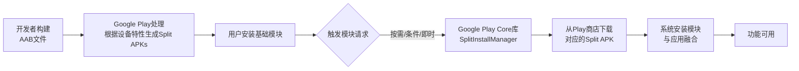
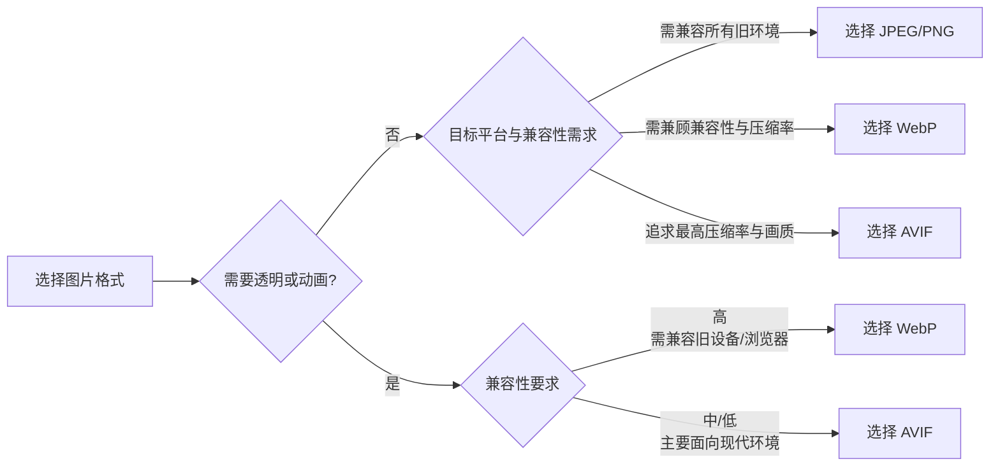

# 启动优化
## 1. 冷启动、温启动、热启动的定义和区别？Application和Activity在各阶段的参与情况
**冷启动**
*   **定义**：应用进程不存在，需从头创建。
*   **组件参与**：`Application`初始化（`onCreate`）；`Activity`创建并走完整生命周期。
**温启动**
*   **定义**：应用进程存在，但Activity被系统回收需重建。
*   **组件参与**：`Application`不参与；`Activity`重新创建并走完整生命周期。
**热启动**
*   **定义**：应用进程和Activity均存在，从后台切回前台。
*   **组件参与**：`Application`不参与；`Activity`仅走恢复流程（`onRestart` -> `onStart` -> `onResume`）。
**核心区别**：冷启动需创建进程和初始化全局，耗时最长；温启动跳过进程创建，仅重建界面；热启动直接恢复，耗时最短。

## 2. 启动耗时怎么测量？Displayed Time 和 Fully Drawn Time的区别

### 📊 一、启动耗时测量方法

测量Android应用启动耗时，主要有以下几种方法，每种方法适用于不同场景和精度要求：

| 测量方法 | 核心指标/工具 | 适用场景 | 特点与说明 |
| :--- | :--- | :--- | :--- |
| **ADB命令** | `TotalTime` | **快速线下测试** | 命令：`adb shell am start -W <包名>/<Activity>`<br>输出`TotalTime`（应用启动总耗时，含进程创建+初始化+首帧）。 |
| **Logcat日志** | `Displayed`时间 | **线下分析，查看TTID** | 在Logcat中过滤`Displayed`关键字，获取从进程启动到首帧绘制的耗时。 |
| **手动代码埋点** | 自定义时间戳 | **线上精准监控，分阶段耗时** | 在关键方法（如`Application.onCreate()`、`Activity.onCreate()`）前后记录时间差。 |
| **Jetpack Macrobenchmark** | `StartupTimingMetric` | **自动化基准测试，获取TTID/TTFD** | 官方库，可模拟冷/温/热启动，输出最小、中位数、最大启动时间，适合持续集成。 |
| **调用`reportFullyDrawn()`** | `Fully drawn`时间 | **测量TTFD，需代码集成** | 在应用内容完全加载后手动调用，Logcat会输出`Fully drawn`时间。 |
| **性能分析工具** | TraceView/Perfetto | **深度瓶颈分析，定位具体耗时方法** | 分析CPU使用情况，方法调用耗时，适合优化阶段。 |

### ⏱️ 二、Displayed Time 与 Fully Drawn Time 的区别
这两个时间是衡量应用启动体验的两个核心指标，但含义和测量点不同。
#### 1. Displayed Time (TTID - Time To Initial Display)
*   **定义**：从应用启动（进程创建）到**第一帧画面绘制完成**并显示在屏幕上的时间。
*   **包含阶段**：进程创建 → 对象初始化 → Activity创建 → 布局加载 → 首次绘制。
*   **特点**：
    *   是**系统自动测量**的，无需开发者干预。
    *   它标志着用户**看到了应用界面**，但界面可能还是空壳或加载中状态。
    *   **不包含**异步加载的资源（如网络图片、数据）的时间。
*   **查看方式**：
    ```bash
    # 在Logcat中过滤
    adb logcat -s ActivityTaskManager | grep "Displayed"
    # 输出示例：I/ActivityTaskManager: Displayed com.example.app/.MainActivity: +414ms
    ```
#### 2. Fully Drawn Time (TTFD - Time To Full Display)
*   **定义**：从应用启动到**所有内容和视图完全加载并绘制完成**，应用达到可完全交互状态的时间。
*   **包含阶段**：TTID + **异步内容加载**（如网络数据、图片）+ 视图完全更新。
*   **特点**：
    *   **需要开发者手动调用** `reportFullyDrawn()` 方法来告知系统应用已完全就绪。
    *   它标志着用户**可以真正使用应用**了。
    *   对于有懒加载或异步数据的应用，TTFD比TTID更能真实反映用户体验。
*   **查看方式**：
    ```kotlin
    // 在Activity中，内容加载完成后调用
    override fun onResume() {
        super.onResume()
        // ... 数据加载完成 ...
        reportFullyDrawn() // 通知系统
    }
    ```
    ```bash
    # 在Logcat中过滤
    adb logcat -s ActivityTaskManager | grep "Fully drawn"
    # 输出示例：I/ActivityTaskManager: Fully drawn com.example.app/.MainActivity: +856ms
    ```
#### 3. 核心区别对比
| 特性 | Displayed Time (TTID) | Fully Drawn Time (TTFD) |
| :--- | :--- | :--- |
| **测量点** | 首帧绘制完成 | 内容完全加载并绘制完成 |
| **系统自动测量** | ✅ 是 | ❌ 否，需手动调用`reportFullyDrawn()` |
| **包含异步加载** | ❌ 不包含 | ✅ 包含 |
| **用户体验** | 用户看到界面（可能空壳） | 用户可完全交互使用 |
| **优化重点** | 启动初始化、布局渲染 | 数据加载、视图更新 |
| **适用场景** | 评估“看到界面”的速度 | 评估“可用应用”的速度 |
> 💡 **关键理解**：**TTID是“看到了”，TTFD是“能用了”**。对于很多应用，TTID很快但TTFD较慢，用户依然会感觉卡顿。因此，**线上监控应同时采集这两个指标**，以全面评估启动性能。
---
### 📝 三、总结与建议
1.  **线下快速验证**：优先使用 `adb shell am start -W` 命令查看 `TotalTime`，快速了解整体启动耗时。
2.  **线上精准监控**：实现自定义代码埋点，**同时上报TTID和TTFD**。在应用首屏内容加载完成后调用`reportFullyDrawn()`。
3.  **深度优化分析**：使用 **Android Studio CPU Profiler** 或 **Perfetto** 定位具体耗时方法。
4.  **自动化测试**：集成 **Jetpack Macrobenchmark** 到CI流程，防止启动性能劣化。
5.  **优化目标**：不仅要缩短TTID，更要缩短TTFD，确保用户能快速看到并使用应用完整内容。
通过理解Displayed Time和Fully Drawn Time的区别，并结合合适的测量工具，你可以更精准地评估和优化应用的启动性能，提升用户体验。

## 3. Trace.beginSection/Systrace如何定位启动瓶颈
**一、定位启动瓶颈步骤**
1. **打点标记**：在怀疑耗时的代码块前后，添加 `Trace.beginSection("自定义名称")` 和 `Trace.endSection()`。
2. **抓取Trace**：通过 Android Studio Profiler 的 CPU 捕获功能，或命令行工具抓取启动阶段的 trace 文件。
3. **分析Trace**：在图形化界面中查看主线程时间轴，寻找宽大色块（耗时代码段）和主线程卡顿点。
**二、具体应用场景**
* **Application阶段**：在 `onCreate()` 及各 SDK 初始化前后打点，定位哪个第三方库拖慢了启动。
* **Activity阶段**：在 `onCreate()`、`setContentView()`、布局加载、数据请求等前后打点，定位UI渲染或数据耗时。
**三、Systrace 的作用**
将自定义的 `Trace` 标记与系统底层事件（如 CPU 调度、Binder 通信、View 绘制）结合在一条时间轴上展示，不仅能看到“哪段代码慢”，还能分析出“为什么慢”（如主线程在等待锁、CPU 被其他进程占用）。

## 4. Application.onCreate中哪些初始化可以延迟？IdleHandler和viewTreeObserver的时机差异
**一、可延迟的初始化 (在 `onCreate` 中)**
1. **第三方 SDK 分级延迟**：将非启动必需的 SDK（如推送、统计、地图、广告）移至子线程，或使用 Jetpack App Startup 按依赖关系异步初始化。
2. **网络/数据库预加载**：首屏不需要立即展示的数据请求。
3. **UI 相关**：复杂动画初始化、非首屏自定义 View 的预创建。
*原则：仅保留首帧渲染所必需的初始化在主线程同步执行。*
**二、IdleHandler 与 ViewTreeObserver 时机差异**
* **IdleHandler (`Looper.myQueue().addIdleHandler`)**：
  * **时机**：主线程消息队列**空闲**时（即当前所有任务执行完毕，暂无新任务）。
  * **特点**：不阻塞主线程，优先级最低。适合执行不紧急的后台清理或延迟初始化，避免引起卡顿。
* **ViewTreeObserver (`addOnGlobalLayoutListener` 等)**：
  * **时机**：View 树经历 **measure/layout** 阶段时触发。
  * **特点**：与 UI 渲染流程强绑定。适合在确切知道 View 尺寸或视图树完成测量后执行依赖这些信息的操作（如获取宽高）。

## 5. 启动白屏和黑屏的原因是什么？Theme优化方案(Windowbackground vs SplashScreen API)
**一、白屏/黑屏原因**
系统在创建应用进程和初始化首帧期间，会显示一个预览窗口。其背景默认取自应用主题的 `android:windowBackground`。若未配置，系统默认使用白底（或黑底），导致视觉上出现长时间的纯色停顿。
**二、Theme 优化方案**
1. **`android:windowBackground` (传统方案)**
   * **做法**：为启动 Activity 单独配置一个主题，将 `windowBackground` 设为一张与首屏 UI 一致的 LayerDrawable（底层背景色+上层 Logo）。
   * **效果**：消除纯色停顿，营造“秒开”错觉。
   * **缺点**：需手动维护切换回正常主题，无法应对深色模式适配，体验略显生硬。
2. **SplashScreen API (Android 12+ 官方方案)**
   * **做法**：使用系统提供的 `Theme.SplashScreen` 主题，配置 `windowSplashScreenBackground` 和 `windowSplashScreenAnimatedIcon`。
   * **效果**：系统接管启动窗口，图标居中显示，支持矢量动画，无缝过渡到应用内容。
   * **优点**：官方标准，完美适配深色模式和各厂商定制系统，体验流畅。推荐使用 `androidx.core:core-splashscreen` 兼容旧版本。

## 6. MultiDex为什么会影响启动速度？如何优化
**一、为什么影响启动速度**
在 Android 5.0 (API 21) 之前，系统使用 Dalvik 虚拟机，且仅能识别 APK 内的 `classes.dex`。如果应用包含多个 DEX 文件（MultiDex），必须在主线程同步将次级 DEX 文件解压、优化（odex化）并注入 ClassLoader，此过程极其耗时，直接阻塞 `Application.onCreate()`，导致严重启动卡顿甚至 ANR。
*(注：Android 5.0+ 默认使用 ART 虚拟机，在安装时自动预编译所有 DEX，无此问题。)*
**二、如何优化**
1. **传统异步加载（子线程优化）**
   在 `Application.attachBaseContext()` 中开启子线程执行次级 DEX 的解压与加载。主线程继续初始化首屏所需的基础库，但需处理类加载同步锁（防止主线程提前访问次级 DEX 中的类引发 `ClassNotFoundException`）。
2. **独立进程加载（极致优化，如 Tinker/BoostMultiDex 方案）**
   为 MultiDex 初始化单独开一个进程，在该进程中完成 DEX 解压和优化。主进程通过 Binder 或文件锁阻塞等待。由于在独立进程，即便耗时较长也不会引起主进程 ANR，且对主进程内存压力小。
3. **文件缓存优化**
   首次解压优化 DEX 后，将生成的 `.odex` 文件存入应用私有目录。二次启动时若校验通过，直接加载本地 `.odex` 文件，跳过耗时的解压和优化阶段。

## 7. 启动阶段线程的优先级如何设置？Process.setThreadPriority的用法
**一、优先级设置原则**
* **主线程 (UI线程)**：保持系统默认高优先级（`THREAD_PRIORITY_DEFAULT` 即 0），确保首帧渲染和交互响应。
* **启动异步子线程**：应适当降低优先级（如设为 `THREAD_PRIORITY_BACKGROUND` 即 10），避免在子线程进行大量计算/IO时抢占主线程CPU时间片，导致首帧绘制卡顿。
**二、`Process.setThreadPriority` 用法**
1. **底层 Linux 优先级机制**：参数范围是 -20（最高优先级）到 19（最低优先级）。值越小，优先级越高。
2. **代码示例**：
```java
new Thread(() -> {
    // 设置当前线程优先级为后台级别
    Process.setThreadPriority(Process.THREAD_PRIORITY_BACKGROUND);
    
    // 执行 SDK初始化或耗时任务...
}).start();
```
3. **常见常量**：
   * `THREAD_PRIORITY_DEFAULT` (0)：默认优先级。
   * `THREAD_PRIORITY_BACKGROUND` (10)：后台线程推荐值，能有效抑制其对主线程的干扰。
   * `THREAD_PRIORITY_LESS_FAVORABLE` (1)：在当前基础上降低 1 级。


# 内存优化
## 1. LeakCanary的检测原理(ReferenceQueue+WeakReference+GC触发)？
**一、核心原理机制**
LeakCanary 利用 `WeakReference` 和 `ReferenceQueue` 的关联特性来自动检测内存泄漏。
1. **包装与监听**：将需要监听的对象（如 Activity）用 `WeakReference` 包装，并绑定一个 `ReferenceQueue`。
2. **正常回收流程**：当被监听的对象被 GC 回收时，JVM 会自动将该 `WeakReference` 对象推入绑定的 `ReferenceQueue` 中。
3. **泄漏判定**：触发 GC 后，检查 `ReferenceQueue`。若队列为空，说明被监听的对象未被回收，判定为潜在泄漏。
**二、五步检测流程**
4. **销毁监听**：通过 `ActivityLifecycleCallbacks` 监听 Activity 的 `onDestroy` 事件。
5. **构建引用**：在 `onDestroy` 时，为该 Activity 创建带 `ReferenceQueue` 的 `KeyedWeakReference`，并存入内部观察列表。
6. **触发 GC**：通过 `Runtime.gc()` 尝试触发垃圾回收。
7. **检查队列**：等待片刻后检查 `ReferenceQueue`。若发现观察列表中某对象对应的 `WeakReference` 未出现在队列中，确认泄漏。
8. **抓取堆栈**：触发 `Debug.dumpHprofData()` 生成 `.hprof` 文件，解析引用链找到泄漏源（如哪个静态变量持有了该 Activity），并通知开发者。

## 2. 常见内存泄漏场景：
非静态内部类、匿名内部类持有外部引用、单例持有ActivityContext、Handler延迟消息、资源未关闭
## 3. Activity泄漏的检测标准是什么？为什么onDestroy后还要等5秒
**一、Activity泄漏的检测标准**
LeakCanary 的核心检测标准是：**Activity 执行完 `onDestroy()` 后，若该对象仍无法被垃圾回收（即判定为强可达状态），则判定为内存泄漏。**
**二、为什么 onDestroy 后还要等 5 秒**
1. **等待 GC 执行**：调用 `System.gc()` 或 `Runtime.gc()` 仅为“建议”系统回收，JVM 不保证立即执行。5秒是预留的缓冲时间，等待 GC 线程实际完成标记和回收工作。
2. **确保判定准确**：若不等待直接检查 `ReferenceQueue`，对象可能尚未被回收入队，极易产生误报。等待5秒后再检查队列是否为空，能准确判断对象是否真正存活（泄漏）。
3. **平衡性能与准确性**：5秒是经验值，既能大概率确保 GC 完成，又避免因等待过久而显著拖慢应用运行或延迟泄漏报告。

## 4. Bitmap内存如何计算？ARGB_8888在Android不同版本的内存分配位置变化(2.3前native、3.0-7.1java堆、8.0+native)
**一、Bitmap 内存计算**
* **计算公式**：`内存大小 = 宽 × 高 × 单像素字节数`
* **单像素字节数**：
  * `ARGB_8888` (默认)：4 字节
  * `RGB_565`：2 字节
  * `ALPHA_8`：1 字节
**二、ARGB_8888 内存分配位置变化**
* **Android 2.3 (API 9) 及以前**：分配在 **Native 堆**。
* **Android 3.0 (API 11) ~ Android 7.1 (API 25)**：分配在 **Java 堆**（Dalvik/ART 堆）。Bitmap 对象本身和像素数据均在 Java 层，易导致 `OutOfMemoryError`。
* **Android 8.0 (API 26) 及以后**：像素数据重新分配回 **Native 堆**。Bitmap 对象在 Java 层仅占极小内存（约百字节），像素数据由 Native 层管理，且注册了 NativeAllocationRegistry，在 Bitmap 被回收时自动释放底层内存。

## 5. Bitmap复用池(inBitmap/inMutable)是什么？Glide是如何用它的
**一、Bitmap复用池 (inBitmap/inMutable)**
* **核心机制**：利用 `BitmapFactory.Options.inBitmap` 属性，将一个**已存在的、可变的** Bitmap 的内存区域直接分配给新解码的 Bitmap 使用。
* **前提条件**：被复用的 Bitmap 必须设置为 `inMutable = true`（可变），且其分配的内存大小必须大于或等于新解码 Bitmap 所需的内存（Android 4.4+ 放宽了此限制，只要总字节数足够即可）。
* **作用**：避免频繁申请和释放大块图片内存，减少内存抖动和 GC 频率，防止 OOM。
**二、Glide 如何使用复用池**
1. **管理组件**：Glide 内部维护了一个 `LruBitmapPool`，按 Bitmap 的尺寸和 Config 进行分组缓存。
2. **解码时复用**：当需要从磁盘/网络加载图片解码时，Glide 会通过自定义的 `BitmapFactory` 解码逻辑，向 `BitmapPool` 申请一个尺寸匹配的闲置 Bitmap。
3. **设置 inBitmap**：若池中存在可用 Bitmap，则将其赋给 `Options.inBitmap`，系统直接复用该内存块，跳过新内存申请。
4. **释放时回收**：当图片离开界面或加载取消时，Glide 不会调用 `bitmap.recycle()`，而是将 Bitmap 放回 `BitmapPool`，供后续请求复用。

## 6. Glide的三级缓存(活动资源/内存/LRU磁盘)各自的作用和命中策略
**一、活动资源缓存**
* **作用**：缓存**正在使用中**的图片（如正在显示在界面上）。使用弱引用持有 Bitmap。
* **命中策略**：图片加载请求首先查这里。命中则直接返回；若被回收则降级查内存缓存。图片不再被任何 View 引用时，从活动资源移除，并放回内存缓存。
**二、内存缓存**
* **作用**：缓存**最近用过但当前未显示**的图片。基于 LRU（最近最少使用）算法管理基础 Bitmap 对象。
* **命中策略**：若活动资源未命中，则查这里。命中则将 Bitmap 移至活动资源缓存并返回；未命中则查磁盘。
**三、LRU 磁盘缓存**
* **作用**：缓存**解码后的原始图片文件**，防止重复网络请求或本地文件读取。
* **命中策略**：若内存未命中，则查磁盘。命中则读取文件解码为 Bitmap，并存入内存缓存；未命中则发起网络/原始文件请求。
**四、整体流程总结**
请求 -> 活动资源 -> 内存缓存 -> 磁盘缓存 -> 网络/源文件。写入时则按相反方向逐级存入。

## 7. LRU缓存的实现原理？LinkedHashMap+accessOrder是怎么做到的
**一、LRU 缓存的实现原理**
LRU（Least Recently Used，最近最少使用）的核心思想是“满则淘汰最久未使用的”。底层通常依赖 `LinkedHashMap` 实现，当缓存达到容量上限时，移除链表头部（最旧）的元素。
**二、LinkedHashMap + accessOrder 实现机制**
1. **双向链表结构**：`LinkedHashMap` 内部维护了一条双向链表，记录元素的插入或访问顺序。
2. **accessOrder 标志位**：构造时传入 `accessOrder = true`，开启**访问顺序**模式（默认为 `false` 即插入顺序）。
3. **访问触发重排**：当调用 `get()` 或 `put()` 操作命中某个元素时，底层会将该元素从链表当前位置删除，并移动到链表**尾部**。
4. **淘汰策略**：链表头部即为最久未使用的元素。当缓存超限时，只需删除链表头部节点即可实现 LRU 淘汰。
*(注：Android 的 `LruCache` 正是通过组合 `LinkedHashMap`(accessOrder=true) 实现，并在 `put()` 时通过重写 `sizeOf()` 和 `trimToSize()` 来控制总容量并移除多余头部元素。)*

## 8. onTrimMemory各个级别的含义？TRIM_MEMORY_RUNNING_CRITICAL时应该做什么
**一、onTrimMemory 各个级别的含义**
`onTrimMemory(int level)` 是系统在内存不足时发出的回调，level 值越高，内存情况越严峻。主要分为三大类：
1. **应用正在前台运行 (RUNNING)**
   * `TRIM_MEMORY_RUNNING_LOW` (15)：内存开始紧张，应用应释放一些非关键资源以保持运行流畅。
   * `TRIM_MEMORY_RUNNING_CRITICAL` (20)：内存极度紧张，应用应释放一切非必要资源，否则系统可能开始杀后台进程。
2. **应用在后台不可见 (HIDDEN)**
   * `TRIM_MEMORY_UI_HIDDEN` (20)：UI 已完全不可见（进入后台）。此时应释放与 UI 相关的资源（如大量 Bitmap 缓存），减轻内存压力。
   * `TRIM_MEMORY_BACKGROUND` (40)：应用在后台且系统内存稍紧，应释放容易重建的资源。
   * `TRIM_MEMORY_MODERATE` (60)：应用在后台且系统内存相当紧张，若不释放资源，可能被系统杀掉。
3. **应用即将被杀 (RELEASE)**
   * `TRIM_MEMORY_COMPLETE` (80)：系统内存极度匮乏，应用即将被杀。应尽力保存核心状态数据。
**二、TRIM_MEMORY_RUNNING_CRITICAL 时应该做什么？**
当收到此回调时，说明应用仍在前台运行，但系统内存已亮红灯。应执行以下操作（**在主线程同步执行**，因为情况紧急）：
1. **清空图片/Bitmap 缓存**：立即清空 Glide/Picasso 等图片库的内存缓存（如调用 `Glide.get(context).clearMemory()`），这是最有效的释放内存手段。
2. **释放非核心对象**：清除首页不需要展示的临时数据结构、无用的历史记录列表、单例中持有的非必要大对象。
3. **停止后台非关键任务**：暂停正在进行的非关键计算、序列化、预加载等耗时任务，减少内存分配。
4. *注意*：**不要**在此处执行磁盘 I/O 或数据库操作，以免阻塞主线程导致 ANR；**不要**释放首屏当前正在显示的必需资源，以免引发崩溃或黑屏。

## 9. Android Profiler的Memory Profiler中，Shallow Size和Retained Size的区别？hprof文件怎么分析
**一、Shallow Size 和 Retained Size 的区别**
在 Memory Profiler（底层基于 MAT 原理）中分析堆内存时，这两个指标是定位泄漏的关键：
* **Shallow Size (浅堆)**：
  * **定义**：对象**自身**占用的内存大小。
  * **内容**：仅包含对象本身的元数据、实例字段直接占用的空间，**不包含**其引用的其他对象的大小。
  * **例子**：一个 `ArrayList` 对象本身的 Shallow Size 通常只有几十字节（对象头+内部数组指针+size等），非常小。
* **Retained Size (深堆/保留堆)**：
  * **定义**：对象被垃圾回收后，**能够被释放的总内存大小**。
  * **内容**：等于该对象的 Shallow Size，加上该对象**直接或间接引用的所有其他对象**的 Shallow Size（前提是这些被引用的对象只能通过该对象到达，即独占引用）。
  * **例子**：上面那个 `ArrayList` 如果内部持有了一万个 Bitmap，那么它的 Retained Size 将非常巨大（包含这一万个 Bitmap 的总内存）。
**总结**：排查内存泄漏或寻找占用内存最大的“元凶”时，主要关注 **Retained Size**。
---
**二、hprof 文件怎么分析**
hprof 是 Android 系统导出的堆快照文件。分析流程通常如下：
**1. 获取 hprof 文件**
* 通过 Android Studio 的 Memory Profiler 点击 “Dump Java heap” 按钮抓取。
* **注意格式转换**：Android Studio 导出的 hprof 是 Dalvik/ART 格式，如果要用标准工具（如 MAT）分析，需使用 Android SDK 自带工具转换：`hprof-conv original.hprof converted.hprof`。
**2. 分析工具**
* **Memory Profiler (推荐)**：直接在 AS 内部查看，支持按类名包名过滤、查看实例引用链。
* **MAT (Memory Analyzer Tool)**：独立的强大分析工具，适合处理超大 hprof 文件。
* **LeakCanary**：自动抓取并分析 hprof，直接在通知栏弹出泄漏链（开发阶段首选）。
**3. 核心分析步骤（以 MAT / Profiler 为例）**
* **第一步：查看 Dominator Tree（支配树）或按类排序**
  * 按 **Retained Size** 降序排列，快速找出占用内存最大的对象或类。重点关注 `Activity`、`Fragment`、`Bitmap`、`byte[]` 等。
* **第二步：排查泄漏的 Activity/Fragment**
  * 在 Profiler 中搜索对应 `Activity` 类名，查看其实例数量。如果已经 `onDestroy` 但实例仍存在于堆中，说明发生泄漏。
* **第三步：查找 GC Roots 引用链**
  * 选中可疑对象，选择 **"Show nearest GC Root"**（查找最近的 GC 根节点）。
  * 顺着引用链往上找，就能看到是“谁”持有了这个本该被回收的对象。常见的 GC Root 包括：静态变量、活动线程、System Class 等。
* **第四步：使用 MAT 的特定报告（进阶）**
  * **Histogram**：按类统计对象数量和内存占用，适合排查某类对象实例是否异常过多。
  * **Leak Suspects Report**：MAT 自动生成的嫌疑报告，会直接提示可能的泄漏点和占用比例。


# 卡顿优化
## 1. 什么是丢帧，16ms渲染和60fps的关系？V-sync信号的作用
**一、什么是丢帧**
* **定义**：在屏幕刷新周期内，系统未能按时准备好下一帧的画面数据，导致屏幕不得不重复显示上一帧的内容。
* **表现**：用户感知到的画面卡顿、不流畅、拖影。
* **本质**：渲染流水线（测量、布局、绘制、合成）耗时过长，超过了系统规定的单帧时间上限，导致该帧未能及时提交给屏幕显示。
**二、16ms 渲染和 60fps 的关系**
* **60 FPS (Frames Per Second)**：指屏幕每秒刷新 60 帧（即屏幕刷新率为 60Hz）。为了让人眼感觉画面流畅，系统需要每秒生成并提交 60 帧画面。
* **16ms 的由来**：1 秒 ÷ 60 帧 ≈ **16.6 毫秒/帧**。
* **关系**：为了保证 60fps 的流畅度，应用主线程的 UI 渲染流水线（包括输入事件处理、动画计算、布局、绘制等）必须在 **16ms 内**全部完成并提交给底层合成显示。如果某一帧耗时超过 16ms（例如花了 32ms），那么这一帧就会错过屏幕的下一次刷新，导致掉帧（实际呈现降为 30fps 甚至更低）。
*(注：现在很多高端手机支持 90Hz 或 120Hz 刷新率，对应的单帧时间压缩到了 11ms 或 8ms 左右，对性能要求更高，但 60fps/16ms 依然是 Android 渲染优化的基础基准线。)*
**三、V-sync 信号的作用**
V-sync（Vertical Synchronization，垂直同步信号）是由屏幕硬件产生的周期性脉冲信号，用于协调系统的渲染节奏与屏幕的刷新节奏。
1. **唤醒渲染流水线**：当 V-sync 信号到来时，系统才会开始接收输入事件、处理动画、进行 UI 的布局和绘制。它就像一个“发令枪”，确保每 16ms 开启一次渲染工作。
2. **双缓冲机制 防撕裂**：
   * 如果没有 V-sync，CPU/GPU 随时可能向屏幕提交数据，如果屏幕正在刷新一半时数据被替换，就会出现画面上半部和下半部不一致的“撕裂感”。
   * V-sync 配合双缓冲：系统在**后缓冲区**默默渲染下一帧，当 V-sync 信号到来时，前后缓冲区交换，屏幕才开始读取新缓冲区的数据，保证了画面的完整性。
3. **三缓冲机制 防卡顿**：在 Android 4.1 (Project Butter) 中引入。当某帧渲染超时（发生丢帧）时，CPU/GPU 在下一个 V-sync 周期才有空闲。引入三缓冲后，可以在等待 V-sync 期间提前开始下下帧的渲染，虽然增加了一帧的延迟，但能有效维持后续帧率的平稳，避免持续卡顿。

## 2. Choregrapher+FrameCallback如何监控丢帧？FrameMetrics API能拿到什么信息
**1. Choreographer + FrameCallback 监控丢帧**
* **原理**：通过 `Choreographer.postFrameCallback()` 接收 Vsync 信号。记录两次回调的时间差。
* **计算**：时间差 > 单帧理论耗时（如 16.6ms），即为丢帧。掉帧数 = (时间差 / 16.6ms) - 1。
**2. FrameMetrics API 能拿到的信息**
* **作用**：细粒度量化单帧各阶段的耗时。
* **信息**：包括布局耗时、Draw 耗时、GPU 合成耗时、动画延迟、总耗时等。（通过 `Window.OnFrameMetricsAvailableListener` 监听）。

## 3. BlockCanary的原理(Looper.setMessageLogging/Printer探测消息处理耗时)？
**BlockCanary 原理**
* **核心机制**：利用 Android 主线程任务调度机制（`Looper.loop()`）。
* **原理**：在 `Looper` 的 `loop()` 方法中，处理 `Message` 前后会打印 `>>>>> Dispatching` 和 `<<<<< Finished` 日志。BlockCanary 通过 `Printer` 替换原生日志，在分发前记录起始时间并**启动后台采样线程**；在分发后结束计时并停止采样。
* **判定**：如果两者时间差超过阈值（默认 1000ms），则判定发生卡顿。
* **输出**：利用开始时采样的数据，输出主线程 CPU 占用率、耗时方法堆栈、耗时 Message 对象等，帮助定位卡顿元凶。

## 4. Systrace如何使用？sched、gfx、view、wm、am类别分别看什么
**一、Systrace 如何使用**
* **工具演进**：Android 10+ 推荐使用命令行工具 **Perfetto**，旧版使用 `python systrace.py`。
* **命令示例**：
  ```bash
  // 采集 10 秒数据，包含 view、gfx 等标签，输出 report.html
  python $ANDROID_HOME/platform-tools/systrace/systrace.py -t 10 -a <包名> gfx view input sched freq
  ```
* **分析方法**：在生成的 HTML 报告中，重点寻找**黄色/红色的圆点**（代表长耗时或丢帧），选中帧块查看 `Alerts` 提示，分析调用栈耗时。
**二、类别关键字段含义**
* **sched (CPU Scheduling)**：
  * **看什么**：CPU 核心调度情况。查看线程是否在运行、是否处于休眠、是否因锁被阻塞。确认是否因 CPU 资源抢占导致主线程卡顿。
* **gfx (Graphics)**：
  * **看什么**：渲染管线。关注 `SurfaceFlinger`、`BufferQueue` 状态。分析是否有 Vsync 丢失、Buffer 交换耗时、GPU 渲染过重。
* **view (View System)**：
  * **看什么**：UI 绘制流程。关注 `performTraversals`、`measure`、`layout`、`draw` 的耗时。定位是否因布局层级过深或绘制逻辑复杂导致卡顿。
* **wm (Window Manager)**：
  * **看什么**：窗口生命周期与动画。关注 Window 切换耗时、启动动画帧率。定位 Activity 启动或转场动画卡顿。
* **am (Activity Manager)**：
  * **看什么**：组件生命周期。关注 `StartActivity`、`ResumeActivity` 等耗时。定位应用冷/热启动慢的问题。

## 5. 主线程做了过多IO/数据库操作导致卡顿-如何系统化排查和解决
**一、系统化排查**
1.  **工具定位**：
    *   **Systrace/Perfetto**：观察主线程状态。若发现大量 **Sleeping (D状态)** 或 **Uninterruptible Sleep**，配合 `sched` 标签查看是否因磁盘 I/O 阻塞。
    *   **StrictMode (严格模式)**：开发阶段开启 `detectDiskReads()` 和 `detectDiskWrites()`，系统会自动捕获主线程 I/O 操作并打印日志或弹窗提示，精准定位违规代码行。
    *   **BlockCanary**：查看卡顿堆栈，若堆栈停留在 `FileInputStream.read()`、`SQLiteDatabase.query()` 或 `SharedPreferencesImpl.read()` 等方法，即可确认。
2.  **常见嫌疑点**：
    *   `SharedPreferences` 的 `get()` 操作（首次读取会同步加载磁盘文件）。
    *   持久化数据的读取/写入。
    *   日志文件的写入操作。
    *   Webview 初始化时的磁盘缓存读取。
**二、解决方案**
3.  **异步化**：
    *   将所有非必要的读写操作移至子线程执行（如使用 `Executors`、`RxJava` 或 `Coroutine`）。
    *   数据库查询使用 `Room` + `LiveData`/`Flow` 或 `ContentProvider` 异步接口。
4.  **预加载与缓存**：
    *   **内存缓存**：在 Application 初始化或空闲时预加载数据到内存，主线程直接读取内存。
    *   **SharedPreferences 优化**：对于复杂配置，避免在主线程调用 `getString()`，建议初始化时一次性加载到静态变量或使用 `MMKV`（ mmap 技术，内存读写同步映射磁盘）。
5.  **批量处理与优化**：
    *   数据库操作使用事务批量提交，减少磁盘 I/O 次数。
    *   避免在循环或高频调用的方法（如 `onDraw`）中执行 I/O。
6.  **架构设计**：
    *   采用 **Repository 模式**，封装数据源逻辑，确保上层（UI层）只拿到数据结果，不感知 I/O 过程。

## 6. StrictMode的ThreadPolicy和VMPolicy能检测哪些问题，线上能用吗
**一、检测范围**
**1. ThreadPolicy (线程策略)**
检测主线程中的**耗时操作**，旨在保证 UI 流畅度。
* **检测内容**：
  * `detectDiskReads()` / `detectDiskWrites()`：主线程读写磁盘（文件、数据库、SP）。
  * `detectNetwork()`：主线程执行网络请求。
  * `detectCustomSlowCalls()`：主线程调用标记为“慢”的自定义代码块。
  * `detectResourceMismatches()`：资源类型不匹配（如将图片资源当作文本读取）。
**2. VmPolicy (虚拟机策略)**
检测内存相关的**错误使用**，旨在保证内存安全和正确性。
* **检测内容**：
  * `detectActivityLeaks()`：Activity 内存泄漏。
  * `detectLeakedClosableObjects()`：未关闭的 `Closeable` 对象（如 InputStream、Cursor 未 close）。
  * `detectLeakedSqlLiteObjects()`：SQLite Cursor 未关闭。
  * `detectCleartextNetwork()`：允许 HTTP 明文传输（Android 9+ 默认禁止）。
  * `detectFileUriExposure()`：`file://` 类型的 Uri 暴露（Android 7+ 需使用 FileProvider）。
**二、线上能用吗？**
**不能直接使用。**
1.  **性能损耗严重**：StrictMode 内部通过大量拦截和检查实现监控，会显著拖慢应用运行速度，严重影响用户体验。
2.  **副作用**：甚至可能因为监控本身的开销导致额外的卡顿或 ANR。
**最佳实践**：
仅在 **Debug / Test** 环境下开启。
```java
if (BuildConfig.DEBUG) {
    StrictMode.setThreadPolicy(new StrictMode.ThreadPolicy.Builder()
        .detectDiskReads()
        .detectDiskWrites()
        .detectNetwork()
        .penaltyLog() // 打印日志
        .penaltyDeath() // 检测到直接崩溃，强制开发者修复
        .build());
    // VmPolicy 同理
}
```


# 包体积优化

## 1. APK包的结构(dex/resources/assets/lib/META_INF)各自占比一般是多少
根据搜索结果，一个典型APK的体积主要由代码（DEX）、资源（res/）、原生库（lib/）和资产文件（assets/）构成，其中**资源文件和代码是体积占比最大的两部分**，也是优化的重点。
为了让你更直观地了解APK各组成部分的典型占比，我整理了以下表格：
### 📊 APK 组成部分与典型占比
| 组成部分 | 内容描述 | 典型占比 | 优化优先级 | 关键优化手段 |
| :--- | :--- | :--- | :--- | :--- |
| **`res/` 目录** | 图片、布局、字符串、动画等UI资源。 | **30% - 60%**  | ⭐⭐⭐⭐⭐ | 使用WebP图片、矢量图、移除无用资源、资源混淆。 |
| **`classes.dex`** | Java/Kotlin代码编译后的字节码。 | **20% - 40%**  | ⭐⭐⭐⭐ | 代码混淆（ProGuard/R8）、移除无用代码、删除未使用的依赖。 |
| **`lib/` 目录** | NDK开发的`.so`原生库，按CPU架构分目录存储。 | **10% - 30%**  | ⭐⭐⭐ | 过滤不必要的CPU架构（如仅保留`armeabi-v7a`）、压缩so库。 |
| **`assets/` 目录** | 通过`AssetManager`访问的原生文件（字体、配置、游戏资源等）。 | **5% - 20%**  | ⭐⭐ | 压缩音频/视频文件、字体子集化、将大文件移至服务端。 |
| **`resources.arsc`** | 编译后的资源索引表，存储资源ID和值的映射。 | 约 **5% - 10%**  | ⭐⭐ | 资源混淆、合并重复字符串。 |
| **`META-INF/`** | APK签名信息（`.SF`, `.RSA`, `MANIFEST.MF`文件）。 | **< 5%**  | ⭐ | 几乎无优化空间，是APK的必备组成部分。 |
| **`AndroidManifest.xml`** | 应用的核心配置文件。 | **< 1%**  | ⭐ | 移除不必要的权限和配置，但体积优化空间极小。 |
> 💡 **注意**：以上占比是一个大致范围，**实际比例因应用类型而异**。例如，游戏或多媒体应用可能`assets/`占比更高；使用大量图片的UI应用`res/`占比可能更大；依赖很多第三方库的应用`lib/`和`classes.dex`会显著增大。
### 🔍 深入理解关键组成部分
1.  **资源文件 (`res/`) - 优化重灾区**
    这是APK体积的最大来源，也是优化性价比最高的部分。常见问题包括：
    *   **未使用的资源**：开发中遗留的图片、布局、字符串等。
    *   **图片体积过大**：大量未压缩或高分辨率的PNG/JPG。
    *   **冗余的多套资源**：为不同分辨率或语言准备了多套完全相同的资源。
2.  **代码文件 (`classes.dex`) - 逻辑核心**
    包含了你的业务逻辑和所有引入的第三方库代码。体积过大的常见原因：
    *   **未使用的代码**：废弃的功能模块、未被引用的类和方法。
    *   **第三方库膨胀**：引入了功能全面但体积庞大的SDK。
    *   **代码未混淆**：保留了调试信息、行号表等元数据。
3.  **原生库 (`lib/`) - 架构冗余**
    一个`.so`库需要为不同的CPU架构（如`armeabi-v7a`, `arm64-v8a`, `x86`）准备独立的副本，这是导致`lib/`目录巨大的主要原因。优化时，通常只需保留主流架构的库（如`armeabi-v7a`和`arm64-v8a`），即可覆盖绝大多数设备。
### 🛠️ 如何分析与优化APK体积？
1.  **使用官方分析工具**
    在Android Studio中，点击 **`Build > Analyze APK...`**，选择你的APK文件。工具会直观地展示各文件大小和占用比例，并支持查看DEX内容、比较不同APK的差异。
2.  **系统化优化策略**
    ```mermaid
    flowchart LR
        A[启用基础优化<br>minifyEnabled true] --> B[启用资源收缩<br>shrinkResources true]
        B --> C[资源深度优化<br>WebP图片/矢量图/移除无用资源]
        C --> D[原生库优化<br>过滤CPU架构]
        D --> E[进阶优化<br>资源混淆/模块化]
    ```
<details>
<summary><b>📖 查看详细优化配置示例</b></summary>
```groovy
// app/build.gradle
android {
    defaultConfig {
        // 1. 资源优化：只保留需要的配置
        resConfigs "zh", "xxhdpi" // 保留中文和xxhdpi密度资源
    }
    buildTypes {
        release {
            // 2. 代码与资源优化核心开关
            minifyEnabled true      // 启用代码压缩与混淆
            shrinkResources true    // 移除未引用的资源
            proguardFiles getDefaultProguardFile('proguard-android-optimize.txt'), 'proguard-rules.pro'
            
            // 3. 原生库优化：过滤CPU架构
            ndk {
                abiFilters "armeabi-v7a", "arm64-v8a" // 只保留这两种主流架构
            }
        }
    }
}
```
</details>
### 💎 总结
理解APK结构是进行体积优化的第一步。**资源文件 (`res/`) 和代码文件 (`classes.dex`) 通常占据了APK体积的70%以上**，是优化的核心战场。通过启用`minifyEnabled`和`shrinkResources`，配合图片格式转换、CPU架构过滤、依赖精简等手段，通常能显著减少包体积，提升用户下载和留存体验。

## 2. AndResGuard的资源混淆原理？为什么7z压缩后的APK体积更小
**一、AndResGuard 的资源混淆原理**
AndResGuard 的核心原理是**缩短资源文件的路径名称**，从而减少 APK 的体积。具体实现基于 Android SDK 的 `aapt` 工具流程，主要包含以下三点：
1.  **路径缩短**：
    *   将冗长的资源路径映射为短路径。
    *   例如：将 `res/layout/activity_main.xml` 映射为 `r/a/a.xml`。
    *   将资源文件名映射为短名称，如 `icon_logo.png` -> `a.png`。
2.  **内容替换**：
    *   混淆过程会生成一个映射文件。
    *   修改 `resources.arsc` 文件，将原来的资源路径字符串替换为混淆后的短路径。
    *   同时修改 R 文件中的 ID 对应关系，确保代码中通过 `R.id.xxx` 查找资源时能正确定位到混淆后的文件。
3.  **重新打包**：
    *   使用修改后的路径和 `resources.arsc` 重新打包资源，最终生成体积更小的 APK。
**注意**：AndResGuard 一般**不处理 assets 目录**下的资源，因为 assets 是动态加载的，不像 res 目录有明确的 ID 索引表，混淆后容易导致加载失败。
---
**二、为什么 7z 压缩后的 APK 体积更小**
APK 文件本质上就是一个 ZIP 压缩包。使用 7z 压缩体积更小的原因主要是：
1.  **压缩算法更优**：
    *   Android 构建工具（Gradle）默认使用标准的 `Deflate` 算法。
    *   7z 支持 **LZMA** 和 **LZMA2** 算法，这些算法相比 Deflate 拥有更高的压缩率，尤其对于文本文件、未压缩的资源文件效果显著。
2.  **字典大小更大**：
    *   7z 支持更大的字典大小，能够更好地利用文件之间的冗余信息进行压缩，进一步提升压缩比。
**注意**：
虽然 7z 压缩率更高，但它也会带来 **安装速度变慢** 的问题。因为解压 LZMA 算法比 Deflate 需要更多的 CPU 计算资源。
Google Play 官方实际上会自动对上传的 APK 进行重新优化压缩，因此对于上架 Play 的应用，手动使用 7z 压缩的意义不大，但在国内分发渠道或为了极致的包体控制，这仍是一个常用手段。

## 3. shrinkResource和minifyEnabled的区别？shrinkResources的严格模式是什么
一、shrinkResources 和 minifyEnabled 的区别
这两个配置虽然都用于“瘦身”，但作用的维度完全不同，且存在依赖关系。
总结：
minifyEnabled 负责“清理代码尸体”和“加密”。
shrinkResources 负责“清理资源尸体”。
通常两者配合使用：minifyEnabled true + shrinkResources true。
二、shrinkResources 的严格模式
1. 背景：默认模式（安全模式）
在默认情况下，Gradle 会保留那些虽然代码中没有显式引用，但可能被动态加载的资源。
场景：通过 Resources.getIdentifier() 动态拼接名字获取资源（如 "img_" + id）。
后果：Gradle 为了安全，会猜测并保留这类可能被用到的资源，导致瘦身不彻底。
2. 严格模式
开启后，Gradle 将严格按照代码中的显式引用来决定资源的去留。任何未被显式引用的资源都会被直接删除，不再进行安全猜测。
开启方式：
在项目的 res/raw/keep.xml 文件中添加配置：
<?xml version="1.0" encoding="utf-8"?>
<resources xmlns:tools="http://schemas.android.com/tools"
    tools:shrinkMode="strict" />
关键处理：
在严格模式下，如果有动态加载的资源，必须在 keep.xml 中使用 tools:keep 属性手动声明保留，否则会被删除。
<!-- 手动保留所有以 img_ 开头的资源 -->
<resources xmlns:tools="http://schemas.android.com/tools"
    tools:keep="@drawable/img_*"
    tools:shrinkMode="strict" />
适用场景：追求极致瘦身，且能准确掌控资源引用情况（特别是处理动态加载资源）的场景。
## 4. 动态加载so的方案？SplitCompat和Relinker的区别
**一、动态加载 SO 的方案**
核心思路是将 SO 文件打包在 APK 的 `assets` 或网络下载，运行时释放到应用私有目录，再手动加载。
1.  **加载流程**：
    *   **拷贝**：将 SO 文件从 `assets` 复制到 `/data/data/<包名>/files/lib/` 或 `code_cache` 目录。
    *   **权限**：确保目标目录具有可读可执行权限。
    *   **加载**：使用 `System.load(String absolutePath)` 加载绝对路径。
2.  **关键限制与版本适配**：
    *   **API 28+ 限制**：Android 9.0 禁止调用 `System.load` 加载非 APK 内置的、位于私有目录的 SO 文件（会抛出 `SecurityException`）。
    *   **解决方案**：使用 `ClassLoader` 的 `addNativePath` 方法（反射）将 SO 所在目录加入 `nativeLibraryDirectories` 列表，然后使用 `System.loadLibrary` 加载。
---
**二、SplitCompat 与 ReLinker 的区别**
两者虽都涉及 SO 加载，但定位完全不同。

| 对比维度 | SplitCompat | ReLinker |
| :--- | :--- | :--- |
| **核心定位** | **Google 官方方案**，用于支持 **Dynamic Feature (动态功能模块)** 和 **APK 分包**。 | **第三方开源库**，用于解决 SO 加载的 **兼容性问题**。 |
| **加载机制** | 修改 `ClassLoader` 的 `nativeLibraryDirectories` 路径列表，使系统能找到并自动加载分包内的 SO。 | 自实现 SO 解析逻辑，递归遍历 `nativeLibraryDirectories`，并处理依赖库的加载顺序。 |
| **主要解决的问题** | 解决 Android 5.0+ 动态下发模块的 SO 加载问题（无需 ROOT 或特殊权限）。 | 解决部分机型 `UnsatisfiedLinkError`、SO 依赖缺失、SO 文件名冲突等“系统级 Bug”。 |
| **适用场景** | 使用 `Play Core Library` 进行模块化开发或插件化开发。 | 需要极致兼容性、动态下发 SO 或热修复 SO 的场景。 |
**总结**：
*   **SplitCompat** 是为了配合 Google Play 的动态下发机制，让系统“认识”新增的 SO 路径。
*   **ReLinker** 是为了填 Android 系统底层 SO 加载机制的“坑”，确保动态加载更稳定。

## 5. ReDex、R8的字节码优化做了哪些事？-dontofuscate用和不用的区别
**一、ReDex 与 R8 的字节码优化**
两者虽然都涉及代码优化，但侧重点和技术实现有所不同。R8 是现代 Android 构建的标准编译器，而 ReDex 是 Facebook 提出的更激进的优化工具（通常在 R8 之后或独立使用）。
**1. R8 的核心优化**
R8 将脱糖、混淆、优化三合一。除了常规的混淆，其字节码优化主要包括：
*   **Shrinking (裁剪)**：
    *   **Tree Shaking**：移除未使用的类、方法、字段。
    *   **Class Merging**：如果类只有一个子类或未被实例化，将其合并到父类或移除。
*   **Optimization (优化)**：
    *   **内联**：将简单方法的代码直接移入调用处，减少方法调用开销。
    *   **类垂直/水平合并**：合并仅包含静态方法或无状态的类。
    *   **无用代码移除**：删除无效赋值、死代码分支。
    *   **常量折叠**：计算编译时常量，移除计算逻辑。
**2. ReDex 的特色优化**
ReDex 专注于 DEX 结构的深层优化，旨在减少 DEX 文件体积并提升启动速度：
*   **字节码拦截**：
    *   **String Interdex (字符串优化)**：重排 DEX 中的字符串，将启动相关的高频字符串集中在同一页，提升内存加载效率。
    *   **Interdex (方法重排)**：重排类和方法的顺序，将启动时需要调用的类放在一起。这能减少启动时的缺页中断，显著提升**冷启动速度**。
*   **删除隐式装箱**：
    *   移除不必要的类型转换代码（如 `Integer.valueOf`），减少 GC 压力。
*   **方法内联与类合并**：
    *   比 R8 更激进的策略，特别是针对只有少量方法的单例类或工具类。
---
**二、`-dontobfuscate` 和不用的区别**
这个问题通常指在 ProGuard/R8 配置文件（`proguard-rules.pro`）中，**不写混淆规则** 与 **显式配置 `-dontobfuscate`** 的区别。
**结论：效果完全一样，但语义不同。**

| 场景 | 行为 | 结果 |
| :--- | :--- | :--- |
| **不用 (不写任何混淆相关配置)** | 默认开启混淆。但你没有编写 `keep` 规则。 | **混淆生效**。R8/ProGuard 会将所有未被 `keep` 的类名、方法名混淆成 `a.a.b` 等短名称。**体积减小，代码不可读。** |
| **使用 `-dontobfuscate`** | **显式关闭混淆功能**。 | **混淆关闭**。R8/ProGear 保留所有类名、方法名原名。**体积不会因改名而减小，代码可读。** |
**详细对比：**
1.  **体积**：
    *   **不用规则**：混淆后名称变短（如 `com.example.MyVeryLongClassName` -> `a.b.c`），字符串常量池变小，**DEX 体积显著减小**。
    *   **`-dontobfuscate`**：保留原名，**体积较大**。
2.  **运行时行为**：
    *   **不用规则**：如果你的代码使用了反射（`Class.forName("com.example.MyClass")`）或 JNI 调用，且没有添加 `keep` 规则，程序会因为找不到原类名而**崩溃**。
    *   **`-dontobfuscate`**：反射和 JNI 调用通常能正常工作，因为名字没变。
3.  **应用场景**：
    *   **`-dontobfuscate`**：用于**Debug 模式**或**不需要混淆的库**（如部分开源库），方便调试和定位问题。
    *   **不用规则**：这是一种**配置错误**。通常混淆开启时，必须配合 `keep` 规则保留入口点（如 Activity、四大组件），否则会导致混淆过度，程序崩溃。如果你只是想测试“不混淆”，必须显式写 `-dontobfuscate`。
**总结**：`-dontobfuscate` 是“开关”，关掉它就完全不混淆；不写规则只是没定义“保留谁”，混淆器依然会疯狂混淆所有它能触及的代码，导致包体变小但极易崩溃。

## 6. Android APP Bundle和APK的区别？Dynamic Feature分发的原理
### 📦 Android App Bundle 与 APK 的核心区别
Android App Bundle (AAB) 和传统的 APK 是 Android 应用开发与分发中两种关键格式，它们在**设计理念、分发机制和最终用户体验上存在根本差异**。简单来说，**AAB 是发布格式，而 APK 是安装格式**。
为了让你快速把握核心，以下表格对比了它们的主要区别：

| 特性维度 | Android App Bundle (.aab) | 传统 APK (.apk) |
| :--- | :--- | :--- |
| **格式定位** | **发布格式**，用于上传到应用商店。 | **安装格式**，用户最终安装到设备上的文件。 |
| **生成方式** | 开发者构建并上传，**Google Play 根据设备动态生成优化后的 APK**。 | 开发者直接构建并分发，或通过第三方渠道分发。 |
| **包含内容** | 包含**所有代码、资源（多语言、多分辨率、多ABI架构）的“原材料”**。 | 包含**特定设备配置**所需的代码和资源。 |
| **文件体积** | 较大，因为包含所有可能资源。 | **针对特定设备优化，体积更小**。 |
| **分发渠道** | **主要通过 Google Play 分发**。 | 可通过**任何渠道**（其他应用商店、网站、内部分发）分发。 |
| **动态功能** | **支持**，通过 Dynamic Feature Modules 实现按需下载。 | **不支持**，需包含所有功能。 |
| **更新效率** | 支持**增量更新**，仅下载变更部分。 | 需要下载完整 APK 进行更新。 |
> 💡 **核心原理**：AAB 的核心是 **Dynamic Delivery（动态交付）**。Google Play 会根据每个用户设备的 ABI（CPU架构）、屏幕密度、语言环境等特性，从你上传的 AAB 中提取必要部分，生成一组 **Split APKs（分拆APK）**，然后安装到用户设备上。这确保了用户只下载真正需要的资源，从而显著减少下载体积和安装大小。
### 🔧 Dynamic Feature Module 分发原理
Dynamic Feature Module（动态功能模块）是 Android App Bundle 带来的一项现代化应用架构技术，它允许你将应用拆分为多个模块，并**按需、条件性地或即时安装**。
其分发原理是一个从构建到分发的完整链路，如下图所示：

#### **1. 模块化构建与声明**
动态功能模块是一个独立的 Gradle 子项目，其 `build.gradle` 使用 `com.android.dynamic-feature` 插件。在主应用模块中声明动态模块：
```groovy
// app/build.gradle
android {
    dynamicFeatures = [":feature_module_name"]
}
```
模块有自己的 `AndroidManifest.xml`，其中可以定义**交付策略**。
#### **2. 三种交付模式**
模块通过 `dist:property` 在 Manifest 中定义不同的交付模式，满足不同场景需求：

| 交付模式 | 关键属性 | 行为描述 | 典型用例 |
| :--- | :--- | :--- | :--- |
| **安装时交付** | `dist:instant="false"` `dist:on-demand="false"` | 模块随主应用一起安装。**这是默认行为**。 | 应用启动必需的核心功能。 |
| **按需交付** | `dist:on-demand="true"` | 用户请求时，通过 Play Core 库下载安装。 | 非核心功能，如高级编辑工具、游戏关卡、特定支付方式。 |
| **按条件交付** | `dist:condition` | 根据设备条件（如语言、地区、ABI）决定是否安装。 | 针对特定地区的功能、仅支持 AR 的模块。 |
#### **3. 运行时请求与安装**
应用使用 **Google Play Core Library** 的 `SplitInstallManager` 来请求和监听模块下载。
```kotlin
val manager = SplitInstallManagerFactory.create(context)
val request = SplitInstallRequest.newBuilder()
    .addModule("feature_module_name") // 模块名
    .build()
manager.startInstall(request)
    .addOnSuccessListener { /* 处理成功 */ }
    .addOnFailureListener { /* 处理失败 */ }
```
请求后，Google Play 会下载对应的 Split APK，并通过 `SplitCompat` 机制将其安装并与主应用进程融合，使得模块中的类和资源对应用可用。
#### **4. 核心优势**
*   **极致的安装体积优化**：用户首次安装仅需基础模块，可减少 40%-70% 的初始下载大小，提升安装转化率，尤其对新兴市场用户友好。
*   **灵活的架构演进**：支持功能的动态扩展和按需加载，使应用更轻量、更现代化。
*   **符合 Google Play 政策**：对于需要动态更新代码的场景，使用 AAB 和动态模块是**唯一符合 Google Play 政策**的官方解决方案。
### 🎯 总结与选择建议
| 场景 | 推荐格式 | 理由 |
| :--- | :--- | :--- |
| **发布到 Google Play** | **Android App Bundle (AAB)** | **自2021年8月起，Google Play 已强制要求新应用使用 AAB 格式**。它能实现最佳体积优化和动态功能分发。 |
| **分发到其他商店或渠道** | **传统 APK** | 其他应用商店（如华为、小米、三星）或企业内部分发通常仍要求 APK。 |
| **开发与测试** | **两者均可** | 在 Android Studio 中，你可以生成 APK 进行快速测试，或生成 AAB 用于完整分发流程测试。 |
**核心结论**：对于面向 Google Play 发布的现代 Android 应用，**Android App Bundle 是标准且必选的格式**。它不仅是一种打包格式，更是一种**模块化、按需加载的现代化应用架构思维**，通过 Dynamic Feature Modules 实现了前所未有的分发效率和用户体验优化。

## 7. 图片格式选择：PNG/WebP/AVIF的压缩率和质量对比？什么时候用9-patch

根据您的问题，我为您详细对比了PNG、WebP、AVIF三种图片格式，并解析了9-patch（点九图）的适用场景。
### 📊 三种图片格式核心对比
为了方便您快速把握，以下表格从压缩率、质量、兼容性等核心维度进行了对比：

| 特性 | PNG | WebP | AVIF |
| :--- | :--- | :--- | :--- |
| **压缩类型** | 无损压缩 | 有损压缩 & 无损压缩 | 有损压缩 & 无损压缩 |
| **压缩率** | 较低 | **优秀** (比PNG小26%，比JPEG小25-34%) | **卓越** (比WebP再小10-50%) |
| **画质** | 高，无损 | 良好，高压缩下有轻微模糊 | **极佳**，高压缩下细节保留更好，压缩痕迹更少 |
| **透明度** | 支持 | 支持 | 支持 |
| **动画** | 不支持 | 支持 | 支持 |
| **Android兼容性** | 全面支持 | Android 4.0+支持基本格式，**4.2.1+完全支持**（有损、透明） | Android 12+原生支持 |
| **浏览器兼容性** | 全面支持 | 主流现代浏览器广泛支持 | 较新浏览器支持良好，但覆盖率低于WebP |
| **主要优点** | 无损，透明度高，适合图标、文字 | 兼容性与压缩率的最佳平衡，适合通用Web图片 | **压缩率最高**，画质最好，支持HDR，适合现代Web和追求极致体积的场景 |
| **主要缺点** | 文件体积大 | 编解码稍慢于JPEG，极旧浏览器不支持 | 兼容性稍差，编解码计算量更大 |
> 💡 **核心结论**：在**相同视觉质量下**，体积排序通常为 **AVIF < WebP < PNG ≈ JPEG**。对于移动应用和现代网站，**WebP是当前兼顾性能与兼容性的最佳选择**，而**AVIF是画质与压缩率的王者，适合对体积要求极致的场景**。
### 🎯 如何选择图片格式
选择哪种格式，取决于您的具体需求、目标平台和用户群体。

#### 1. **PNG格式**
*   **何时使用**：
    *   需要**高质量、无损**的图像，如应用图标、带文字的Logo、需要精确像素的UI元素。
    *   必须使用**透明背景**的图像。
    *   目标用户可能使用非常古老的Android版本（如4.0以下）或旧浏览器。
*   **注意**：其体积较大，应避免用于大尺寸照片或背景图。
#### 2. **WebP格式**
*   **何时使用**：
    *   **首选方案**：适合大多数Web图片和应用内非透明或简单透明的图片。它是目前兼容性与压缩率的最佳平衡点。
    *   需要支持**动画**（动图）的场景。
    *   应用需要支持**Android 4.0+** 的广泛用户群，但对压缩率有要求。
*   **实践**：对于Android应用，可优先将PNG/JPG资源转换为WebP。对于Web，可采用 `<picture>` 标签实现优雅降级。
#### 3. **AVIF格式**
*   **何时使用**：
    *   **追求极致性能**：当应用或网站对加载速度、带宽消耗非常敏感时（如首屏大图、信息流图片）。
    *   目标用户主要使用**较新的设备**（Android 12+、现代浏览器）。
    *   需要**HDR**或**高色深**图像。
*   **实践**：在Web中，可与WebP、JPEG配合使用，通过 `<picture>` 标签实现最优加载。在Android中，可使用Glide 4.15+等库加载。
### 🔲 什么时候用9-patch (.9.png)
9-patch（点九图）是Android平台一种**可拉伸的PNG图片格式**，它通过图片边缘1像素宽的黑线定义拉伸规则和内容区域。
#### **核心原理与作用**
它将图片视为“九宫格”，四角不拉伸，四边单向拉伸，中心区域双向拉伸。这解决了传统图片拉伸导致圆角模糊、边框变粗等失真问题。
#### **典型使用场景**
1.  **按钮背景**：保持圆角和边框不变形，仅拉伸中间区域。
2.  **对话框、气泡背景**：根据文本内容动态调整大小，同时保持边角清晰。
3.  **列表项分割线、卡片容器**：需要横向或纵向自适应的UI元素。
4.  **带阴影的容器**：可指定阴影部分不拉伸，避免阴影变形。
> 💡 **关键点**：9-patch不是一种压缩格式，而是一种**自适应显示方案**。它能用极小的资源文件适配各种屏幕尺寸和分辨率，减少为不同密度屏幕准备多套图片的工作量，是Android UI开发中重要的适配和性能优化工具。
<details>
<summary><b>📖 深入了解：9-patch的制作与原理</b></summary>
制作9-patch图需要使用Android SDK提供的 `draw9patch` 工具，或在Android Studio中编辑。其核心规则如下：
*   **左侧和上边黑线**：定义**可拉伸区域**。黑线覆盖的像素区域在需要拉伸时会被延展。
*   **右侧和下边黑线**：定义**内容显示区域**（可选）。指定内部文本或子View可以放置的位置，防止内容与边框重叠。
通过这种精确控制，9-patch能确保UI元素在任何尺寸下都保持设计初衷的视觉效果，是解决Android屏幕碎片化问题的经典方案之一。
</details>
### 💎 总结建议
| 场景 | 推荐格式 | 理由 |
| :--- | :--- | :--- |
| **应用图标、带文字Logo、透明图标** | **PNG** | 无损，确保细节清晰。 |
| **应用内照片、大图、背景图（兼容性优先）** | **WebP** | 兼容性好，压缩率显著。 |
| **应用内照片、大图（体积极致优先）** | **AVIF** | 压缩率最高，需注意Android版本兼容性。 |
| **需要动态拉伸的UI控件（按钮、对话框）** | **9-patch** | 保证拉伸不变形，适配性强。 |
对于新项目，建议以 **WebP为主**，辅以 **PNG用于特殊需求**，并积极评估 **AVIF** 用于关键性能场景。9-patch则作为处理可拉伸UI元素的必备工具。
