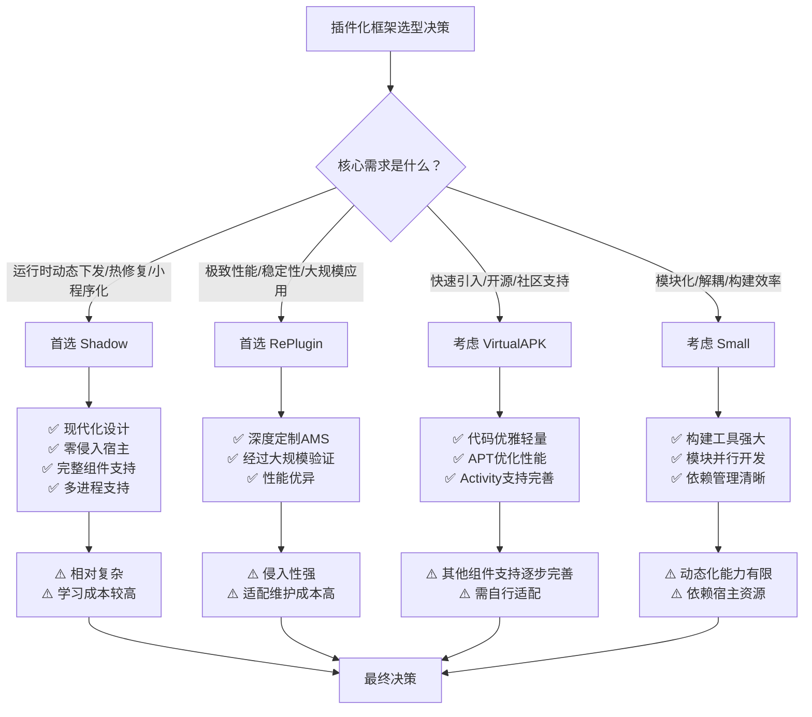
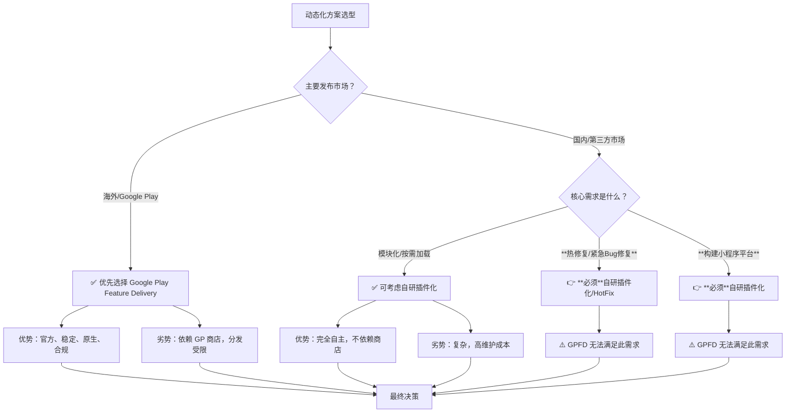
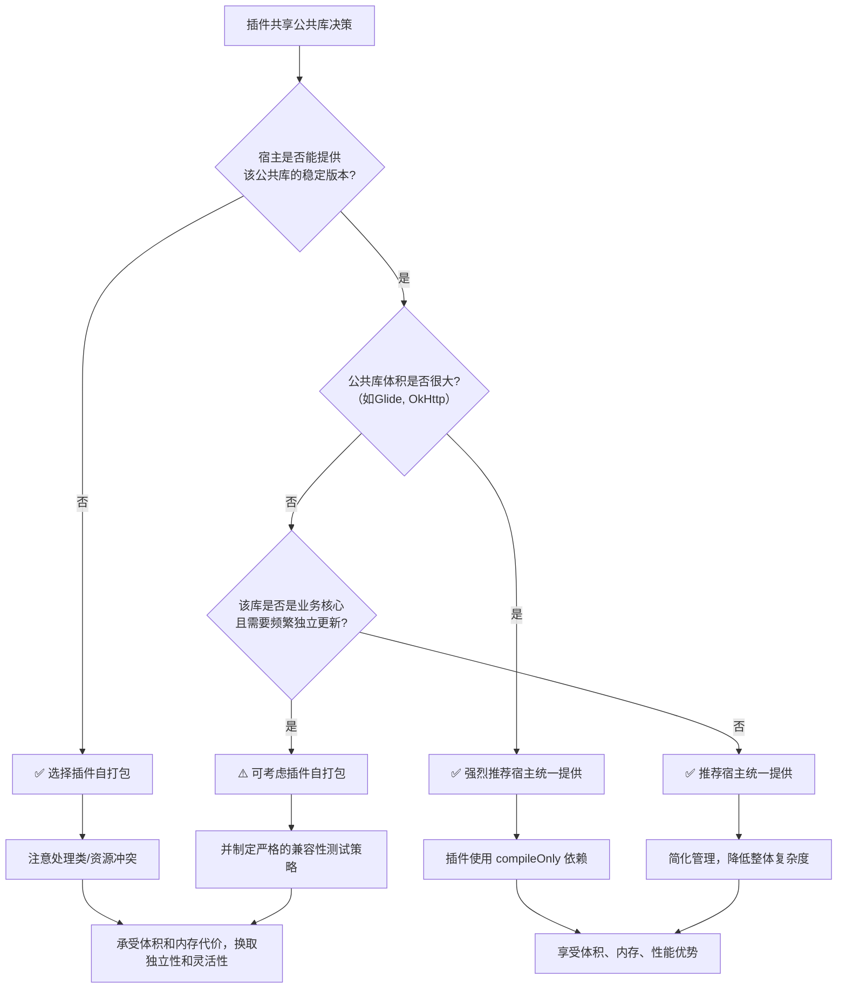
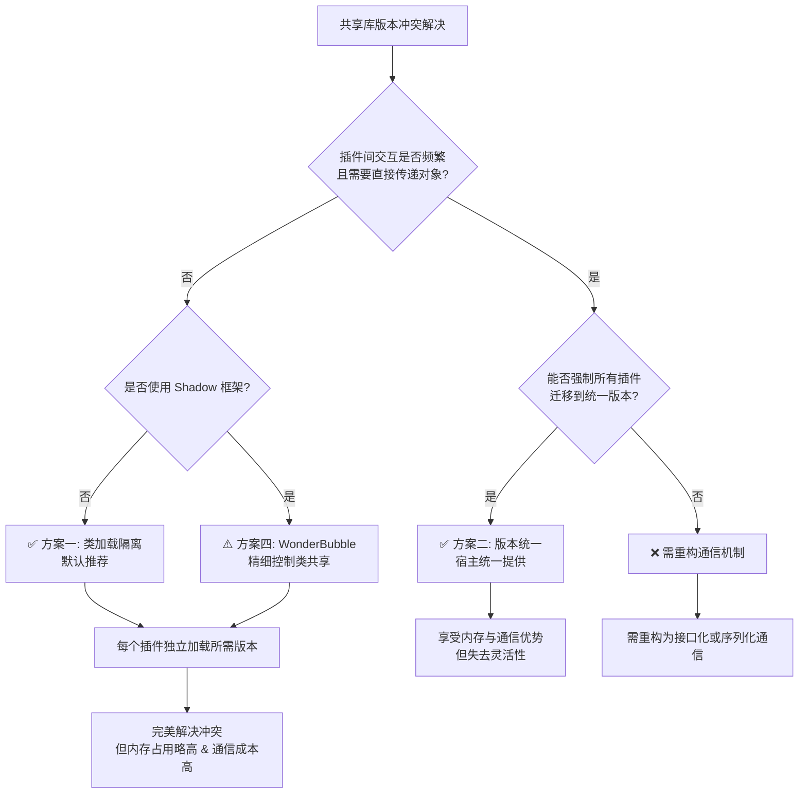
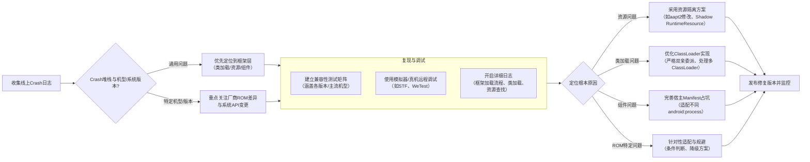
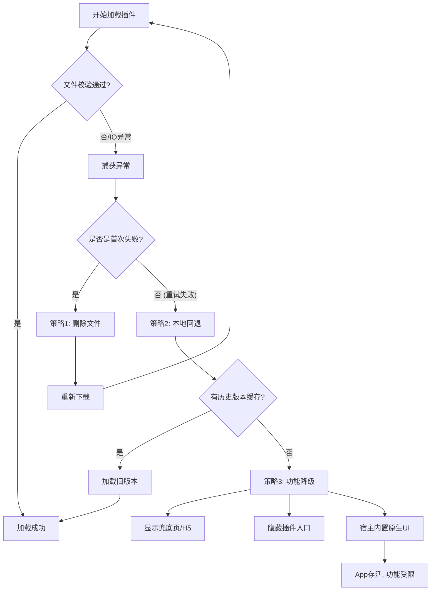
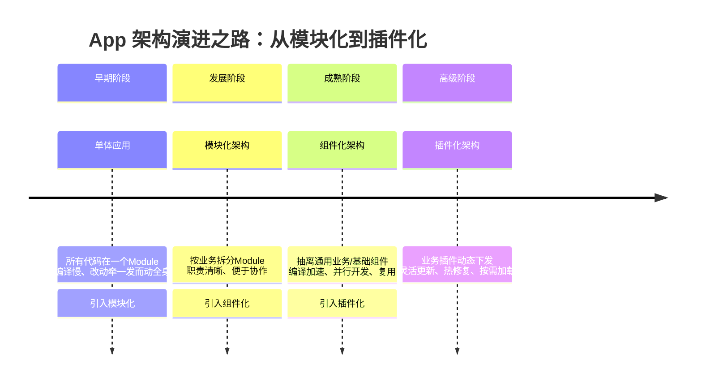
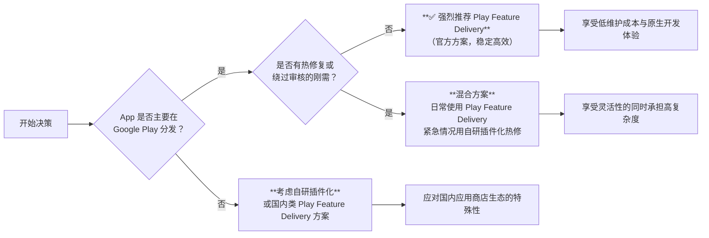
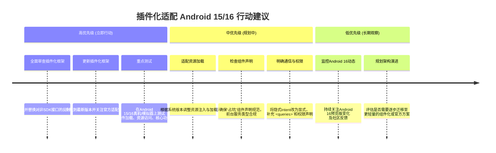

# 基础原理

## ClassLoader 机制
## - Android 的 ClassLoader 父子关系是怎样的？（BootClassLoader → PathClassLoader → DexClassLoader）
Android 的 ClassLoader 父子关系主要分为三个层级，遵循**双亲委派机制**：
1.  **BootClassLoader (根加载器)**
    *   **地位**：最顶层，用于加载 Android Framework 层的核心类（如 `Activity`、`Application` 等）。
    *   **特点**：它是 Java 层的实现，没有父加载器。
2.  **PathClassLoader (系统类加载器)**
    *   **地位**：应用启动时创建，用于加载已安装 APK 的 dex 文件（包括应用代码和依赖库）。
    *   **父子关系**：父加载器为 `BootClassLoader`。它是 Android 应用默认的类加载器。
3.  **DexClassLoader (动态加载器)**
    *   **地位**：用于动态加载外部的 dex/apk 文件（插件化或热修复场景）。
    *   **父子关系**：通常构造时将 `PathClassLoader` 设为其父加载器，从而形成：**BootClassLoader -> PathClassLoader -> DexClassLoader** 的链式结构。
**简要总结链路：**
`BootClassLoader` (系统核心) → `PathClassLoader` (应用代码) → `DexClassLoader` (动态代码)。

## - `PathClassLoader` 和 `DexClassLoader` 的区别？为什么 Android 8.0 后两者几乎一样了？
### 1. `PathClassLoader` 和 `DexClassLoader` 的区别
在 Android 8.0 (API 26) 之前，两者的主要区别在于**使用场景**和**构造参数**：
*   **PathClassLoader**：
    *   **定位**：用于加载**已安装**应用的 dex 文件（位于 `/data/app/` 目录）。
    *   **限制**：早期版本中，它**无法**加载 SD 卡或外部存储中的未安装 dex/apk 文件（因为内部实现未调用 `optimizedDirectory` 参数）。
    *   **创建时机**：由系统在 App 启动时自动创建。
*   **DexClassLoader**：
    *   **定位**：用于**动态加载**外部的 dex/apk 文件（如插件化、热修复）。
    *   **特点**：构造函数多了一个 `optimizedDirectory` 参数，用于指定 dex 优化后的 odex 文件存放路径。这使得它可以加载外部文件。
---
### 2. 为什么 Android 8.0 后两者几乎一样了？
从 Android 8.0 (API 26) 开始，Google 修改了 `BaseDexClassLoader` 的源码，导致两者趋同。
**核心原因：`optimizedDirectory` 参数失效**
1.  **实现统一**：
    在 8.0 之前，`DexClassLoader` 会将外部 dex 优化到指定的 `optimizedDirectory`，而 `PathClassLoader` 硬编码了优化路径。
    在 8.0 及之后，`BaseDexClassLoader` 的构造函数进行了重构，**废弃并忽略了** `optimizedDirectory` 参数。系统现在强制将所有的 odex 文件统一生成到系统的 OAT 目录（`/data/dalvik-cache/`）中，不再允许 App 随意指定。
2.  **源码差异消失**：
    由于 `PathClassLoader` 和 `DexClassLoader` 都继承自 `BaseDexClassLoader`，且 8.0 后 `DexClassLoader` 的构造函数仅仅是调用了父类构造函数并传了几个默认参数，两者的代码逻辑实质上已经没有区别。
**结论**：
在 Android 8.0+ 设备上，`PathClassLoader` 也能加载外部的 dex 文件，两者功能一致。为了兼容旧版本，开发者通常仍使用 `DexClassLoader` 进行动态加载。

### - 双亲委派模型是什么？插件化中为什么要打破它？怎么打破？
### - `BaseDexClassLoader` 的 `DexPathList` 是怎么加载 dex 的？`dexElements` 数组的合并机制？
### - 热修复 Tinker 的底层原理——和插件化加载 dex 的方式有什么异同？

## 资源加载
## - 插件 APK 的资源（`resources.arsc` + `res/`）是怎么被宿主加载的？
插件 APK 的资源加载主要通过构建一个独立的 **`Resources`** 对象来实现，核心流程如下：
### 1. 核心原理
Android 应用通过 `Resources` 对象来查找资源，而 `Resources` 内部依赖 `AssetManager` 来读取 APK 文件中的 `resources.arsc` 和 `res/` 文件。**只要将插件 APK 的路径加入 `AssetManager` 中，即可实现资源加载。**
### 2. 具体实现步骤
通常分为两步：**创建 AssetManager** 和 **构建 Resources**。
1.  **创建 `AssetManager` 并添加路径**：
    *   使用反射创建 `AssetManager` 的实例（因为构造方法是隐藏的）。
    *   调用 `AssetManager` 的隐藏方法 `addAssetPath(String path)`，将插件 APK 的路径传入。这一步是关键，它会让 `AssetManager` 解析插件 APK 的资源索引表。
    ```java
    AssetManager assetManager = AssetManager.class.newInstance();
    Method addAssetPath = AssetManager.class.getMethod("addAssetPath", String.class);
    addAssetPath.invoke(assetManager, pluginApkPath);
    ```
2.  **构建 `Resources` 对象**：
    *   使用创建好的 `AssetManager`，结合宿主的 `DisplayMetrics`（屏幕配置）和 `Configuration`（语言配置），创建一个新的 `Resources` 对象。
    ```java
    Resources superRes = context.getResources();
    Resources pluginRes = new Resources(assetManager, superRes.getDisplayMetrics(), superRes.getConfiguration());
    ```
### 3. 两种主要加载方案
根据 `Resources` 的注入范围，分为两种模式：
*   **方案一：代理模式（常用）**
    *   创建一个 `PluginResources` 继承 `Resources`。
    *   在 `PluginResources` 中重写 `getString`、`getDrawable` 等方法。
    *   **逻辑**：先尝试用插件的 `Resources` 加载，如果找不到（返回异常或 ID 为 0），再 fallback 到宿主的 `Resources` 加载。
    *   **优点**：隔离性好，解决了资源 ID 冲突问题。
*   **方案二：替换模式（侵入性强）**
    *   通过反射，直接将宿主 `Context` 中的 `mResources` 字段替换为新建的插件 `Resources`。
    *   **缺点**：若插件和宿主资源 ID 相同，会发生覆盖（资源冲突），通常需要配合 `public.xml` 固定 ID 前缀使用。
**总结**：通过反射调用 `AssetManager#addAssetPath` 将插件 APK 路径注入，生成新的 `Resources` 对象供插件使用。

## - `AssetManager.addAssetPath` 是怎么工作的？Android 不同版本有什么变化？
`AssetManager.addAssetPath` 是插件化框架实现资源加载的核心 API，它的工作本质是将 APK 文件路径添加到 Native 层的资源搜索列表中。
### 1. 它是怎么工作的？
其工作流程主要涉及 Java 层到 Native 层的调用：
1.  **Java 层入口**：
    `AssetManager.addAssetPath(String path)` 方法被调用，传入插件 APK 路径。
2.  **JNI 调用**：
    Java 方法通过 JNI 调用进入 Native 层（C++）。
3.  **Native 核心逻辑**：
    *   **解析 APK**：底层使用 `ZipFile` 或类似机制打开 APK 文件。
    *   **加载 resources.arsc**：这是最关键的一步。系统解析 APK 根目录下的 `resources.arsc` 文件，将其映射到内存中。这个文件包含了所有资源的 ID 到文件路径的映射表。
    *   **构建 ResTable**：Native 层维护着一个 `ResTable`（资源表）。`addAssetPath` 会将新解析的资源条目追加到这个表中。
    *   **资源查找链**：此后，当调用 `getResourceById` 时，系统会遍历 `ResTable`，根据 ID 找到对应的资源文件并在 APK 中读取二进制数据。
---
### 2. Android 不同版本的变化
Google 为了限制插件化技术，在不同版本中对 `AssetManager` 进行了多次重构，导致适配难度增加：
#### **Android 4.x - 7.x (相对稳定期)**
*   **状态**：`AssetManager` 是一个独立的类，`addAssetPath` 是一个隐藏的 public 方法。
*   **操作**：直接通过反射调用即可，非常简单。
#### **Android 8.0 - 8.1 (API 26-27)**
*   **变化**：引入了 `AndroidNDK` 相关变更，`AssetManager` 的构造方法被标记为 `@Deprecated` 且仅包可见。
*   **挑战**：不能直接 `new AssetManager()` 了。
*   **对策**：开发者通常需要反射 `AssetManager` 的无参构造，或者直接通过 JNI 在 Native 层创建。
#### **Android 9.0 (API 28)**
*   **变化**：**重大重构**。`AssetManager` 的实现被大幅修改。
    *   Java 层的 `AssetManager` 变成了一个轻量级的包装类。
    *   真正的逻辑转移到了隐藏类 `android.content.res.ApkAssets`。
    *   `addAssetPath` 方法内部实际上是在操作 `ApkAssets`。
*   **挑战**：反射调用链变长，且由于 Google 对隐藏 API 的限制（`@UnsupportedAppUsage` 等），反射调用更容易被拦截或报错。
*   **对策**：开发者开始适配 `ApkAssets` 类，通过反射构建 `ApkAssets` 对象并添加到 `AssetManager` 中。
#### **Android 10+ (API 29+)**
*   **变化**：限制进一步收紧。
*   **现状**：
    *   虽然底层架构变了，但 `AssetManager` 内部依然保留了兼容逻辑。
    *   目前主流插件化框架（如 Shadow, VirtualApp 等）仍尝试反射 `addAssetPath`，但需要配合“元反射”（反射获取反射方法本身）等手段绕过系统的隐藏 API 检测机制。
    *   部分框架转向 Native Hook，直接在 C++ 层操作 `ResTable`，以彻底避开 Java 层的限制。
**总结**：`addAssetPath` 的核心作用始终是**加载 resources.arsc 到内存索引表**。但随着 Android 版本升级，Java 层入口逐渐被隐藏和重构，适配工作从简单的 Java 反射演变成了对抗系统限制的高级技巧。

## - 插件和宿主同名资源冲突怎么解决？（修改 aapt / 资源 ID 分区 / 自定义 Resource）
插件化和宿主资源冲突的核心在于 **resources.arsc 中的 ID 映射冲突**。系统默认会给所有资源分配 ID，如果宿主和插件的 ID 相同，后加载的会覆盖先加载的（通常取决于 `AssetManager` 中添加的顺序）。
以下是三种主流的解决方案：
### 1. 修改 AAPT / AAPT2 (构建时干预)
这是最彻底的解决方案，通过修改资源打包工具，从源头隔离 ID 空间。
*   **原理**：
    Android 资源 ID 是一个 32 位整数，格式为 `0xPPTTNNNN`。
    *   `PP` (Package ID)：通常用户应用是 `0x7f`，系统是 `0x01`。
    *   `TT` (Type ID)：资源类型（如 string, drawable）。
    *   `NNNN` (Entry ID)：资源序号。
*   **做法**：
    修改 AAPT 或 AAPT2 源码，强制指定插件 APK 的 `Package ID` 为固定值（例如 `0x71`、`0x72` 等），使其与宿主的 `0x7f` 错开。
*   **优点**：彻底杜绝 ID 冲突，无需运行时反射干预。
*   **缺点**：需要修改 Android 构建工具链，维护成本高，升级 Gradle 插件可能需要适配。
### 2. 资源 ID 分区 (public.xml / aapt 配置)
不修改 AAPT 源码，而是通过标准构建配置来约束 ID 范围。
*   **原理**：
    利用 `public.xml` 强制固定资源的 ID 分配。
*   **做法**：
    *   在宿主项目中定义 `public.xml`，将宿主的 ID 范围限制在 `0x7f010000` 到 `0x7f0A0000` 之间。
    *   在插件项目中定义 `public.xml`，将插件的 ID 起始范围设定在 `0x7f0B0000` 之后，或者直接使用 `androidAppLib` 等配置尝试修改 Package ID（部分构建工具支持）。
*   **优点**：不侵入构建工具源码，相对稳定。
*   **缺点**：依然处于同一个 `0x7f` 包空间下，若管理不当仍可能冲突；且难以控制第三方依赖库的资源 ID。
### 3. 自定义 Resource / SharedClassLoader (运行时隔离)
这是目前主流插件化框架（如 Shadow, RePlugin）采用的方式，**放弃共享资源**，每个插件拥有独立的资源空间。
*   **原理**：
    既然冲突是因为大家共用一个 `AssetManager` 或 `Resources`，那就为每个插件创建独立的 `Resources` 和 `AssetManager`。
*   **做法**：
    *   加载插件时，new 一个全新的 `AssetManager`，仅调用 `addAssetPath(插件路径)`。
    *   创建该插件专用的 `Resources` 对象。
    *   在加载插件的 Activity/组件时，通过 Hook（如 `Activity.attach` 或 `ContextWrapper`）将该组件的 `mResources` 替换为插件专用的 `Resources`。
*   **优点**：
    *   完全隔离，宿主和插件互不干扰。
    *   无需修改构建工具，兼容性好。
*   **缺点**：
    *   实现复杂，需要 Hook 大量系统 API。
    *   **资源共享困难**：宿主无法直接通过 `R.id.xxx` 访问插件资源（需通过接口获取插件的 `Resources`），插件也无法轻易引用宿主资源（除非构造时将宿主 APK 也加入插件的 `AssetManager`）。
### 总结建议
| 方案 | 适用场景 | 推荐程度 |
| :--- | :--- | :--- |
| **修改 AAPT** | 大型重构、完全控制构建流程 | ⭐⭐⭐ (最稳健，但成本高) |
| **资源 ID 分区** | 简单场景、冲突较少 | ⭐⭐ (维护繁琐) |
| **自定义 Resource** | 主流插件化框架、组件隔离 | ⭐⭐⭐⭐⭐ (当前主流选择) |
**现代方案通常采用“自定义 Resource + 特定 ID 前缀”的组合**：运行时通过独立的 `Resources` 隔离，构建时通过 `public.xml` 规范 ID，确保万无一失。

## - 插件访问宿主的资源（如宿主定义的 `R.color.primary`）能直接用吗？为什么？
**不能直接用。**
在标准的插件化环境（特别是采用**独立资源隔离**方案）下，插件无法通过 `R.color.primary` 这样的方式直接访问宿主的资源。
### 原因分析
**1. 资源索引表隔离**
*   插件独立编译时，其 `aapt` 会生成自己的 `resources.arsc` 和 `R.java`。
*   插件的 `R.java` 中并没有宿主资源的 ID 定义。
*   即使你在插件代码里硬编码了宿主的 ID 值（如 `0x7f050001`），在运行时，如果使用的是**插件专属的 Resources 对象**，其内部的 `AssetManager` 只加载了插件 APK 的路径，根本找不到这个 ID 对应的资源项。
**2. ClassLoader 隔离**
*   宿主的 `R.java` 类存在于宿主的 ClassLoader 中。
*   插件使用自己的 ClassLoader 加载类。根据双亲委派机制，插件无法感知宿主加载的类。因此，编译期间插件甚至无法引用 `宿主包名.R` 这个类。
**3. ID 冲突风险**
*   即使通过反射或共享 Resources 突破了上述限制，还存在 ID 冲突问题。如果插件和宿主都有一个 ID 为 `0x7f010001` 的资源，且使用了共享 Resources，那么加载顺序靠后的会覆盖之前的，导致获取到错误的资源。
---
### 如何解决？（三种常见方案）
如果确实需要插件访问宿主资源，通常采用以下方案：
#### 方案一：宿主资源下沉 (推荐)
将宿主和插件都需要使用的公共资源（如 Theme、Common Drawable）抽取到一个单独的 `BaseRes` 模块中。
*   宿主和插件都 `implementation project(':BaseRes')`。
*   这样双方各自拥有一份资源副本，互不干扰，编译时也能通过 R 引用。
#### 方案二：共享 Resources (侵入式)
在创建插件的 `Resources` 时，不仅调用 `addAssetPath(插件路径)`，还要**先**调用 `addAssetPath(宿主路径)`。
*   这样插件的 `AssetManager` 就同时持有宿主和插件的资源索引。
*   **注意**：需要处理 ID 冲突（通常通过修改 AAPT 使宿主和插件 ID 段错开）。
*   **代码访问**：插件仍无法引用 `宿主.R`，需要通过 `context.getResources().getIdentifier("primary", "color", "宿主包名")` 动态获取 ID。
#### 方案三：依赖注入/接口调用
宿主提供接口，例如 `IHostResource.getResource(int resId)`。
*   插件调用接口 -> 宿主实现接口 -> 宿主使用自己的 `Resources` 返回 Drawable/Color 对象给插件。
*   这种方式避免了资源 ID 的直接传递，跨进程也能用。


## 四大组件代理
## - 插件 Activity 为什么必须先在宿主的 AndroidManifest 中预注册占坑 Activity？
这是一个关于 Android 系统机制限制的经典问题。简单来说，是因为 **Android 系统对组件的校验机制** 与 **插件化的动态加载特性** 存在冲突。
核心原因主要有两点：**静态校验** 和 **令牌验证**。
### 1. 避开系统启动校验
*   **系统校验机制**：
    当调用 `startActivity(intent)` 时，系统进程会立即检查目标组件是否在 `AndroidManifest.xml` 中注册。
    *   如果未注册，系统会直接抛出 `ActivityNotFoundException`，应用崩溃。
    *   这个校验发生在**应用进程 fork 之后、Activity 对象创建之前**，且逻辑在系统层，App 无法 Hook。
*   **插件化的困境**：
    插件 APK 是动态加载的，宿主在安装时并不知情，因此插件的四大组件无法写入宿主的 `AndroidManifest.xml`。
*   **占坑的作用**：
    为了骗过系统校验，我们在宿主 Manifest 中预先注册几个“傀儡” Activity（如 `StubActivity`）。启动时，我们将 Intent 的目标偷偷替换成 `StubActivity`。系统检查通过后，才允许后续流程继续。
### 2. 通过 Token 校验与生命周期分发
这不仅是“骗过”启动检查那么简单，更关乎 Activity 能否“活”下来。
*   **Token 机制**：
    Android 系统通过 `IBinder token` 来标识一个 Activity 实例。这个 Token 是由系统 AMS 分发的，且与 Activity 的生命周期（`onResume`, `onPause` 等）强绑定。
*   **分发逻辑**：
    当 AMS 准备回调生命周期时，它是根据 Token 去查找对应的 ActivityRecord。如果我们完全凭空启动一个未注册的 Activity，AMS 手里根本没有它的记录，也就无法给它分发生命周期的回调。
*   **占坑 + 欺骗**：
    通过占坑，AMS 认为它正在启动 `StubActivity`，于是给它分配了 Token 并分发生命周期。
    在客户端侧，我们利用这个合法的 Token，通过 Hook 手段（如替换 `Instrumentation` 或 `Handler`），在创建 Activity 实例时“偷梁换柱”，实例化真正的插件 Activity，并将 AMS 传来的 Token 赋给它。
    **结果**：AMS 以为自己管的是 `StubActivity`，而客户端实际运行的是插件 Activity，且插件 Activity 拥有合法的生命周期。
### 总结
| 问题 | 如果不预注册 | 预注册占坑的作用 |
| :--- | :--- | :--- |
| **启动阶段** | 系统校验 Manifest 失败，抛异常 | 骗过系统校验，获得启动许可 |
| **运行阶段** | 无法获得系统 Token，无生命周期 | 借用占坑的 Token，骗过 AMS，接收生命周期回调 |
**一句话总结**：Android 系统不允许启动未注册的组件，且必须持有系统颁发的 Token 才能拥有生命周期；**占坑是为了向系统“借”一个合法的身份，让插件 Activity 能够在系统的监控之下“非法”运行。**

## - 插件 Service / BroadcastReceiver / ContentProvider 的代理和 Activity 有什么不同？
与 Activity 相比，Service、BroadcastReceiver 和 ContentProvider（统称为其他三大组件）的代理模式各有特点，主要区别在于**生命周期来源**、**系统交互对象**以及**Hook 的时机**。
简要对比表：
| 组件 | Activity | Service | BroadcastReceiver | ContentProvider |
| :--- | :--- | :--- | :--- | :--- |
| **核心载体** | 上下文/界面 | 后台长运行任务 | 消息接收者 | 数据存储/共享 |
| **调用方** | 用户/系统界面 | AMS (ActivityManagerService) | AMS | ATF (ActivityThread) |
| **注册占坑** | **必须** (启动直接校验) | **必须** (启动直接校验) | **通常不需要** (动态注册) | **必须** (发布直接校验) |
| **Hook 难度** | 高 (需创建实例+Token) | **极高** (需 Hook Binder/ams) | 中 | 高 (需 Hook ATF) |
### 详细区别分析
#### 1. Service 的代理：极其复杂
Service 是最难处理的组件，因为它的生命周期由 AMS 跨进程严密管控，且不依赖界面。
*   **不同点：Hook 的层级不同**
    *   Activity 的代理主要在**进程内部**（`ActivityThread` 中实例创建时）做“偷梁换柱”。
    *   Service 的代理必须穿透**系统服务 (AMS)**。因为 AMS 会持有 ServiceRecord 并分发回调（`onStartCommand`、`bindService` 等）。
*   **具体做法**：
    *   **占坑**：在宿主 Manifest 中预注册 `StubService`。
    *   **启动替换**：调用 `startService` 时，Hook AMS 的 `startService` 方法，将 Intent 偷梁换柱指向 `StubService`。
    *   **分发回传**：这是最难点。系统回调宿主进程 `onCreate`、`onStartCommand` 时，仍然是回调给 `StubService`。插件框架需要拦截这些回调，将其手动转发给真正的插件 Service 实例。
*   **难点**：需要维护复杂的 Binder 链路拦截（如 `ActivityManagerService` 和 `IApplicationThread`）。
#### 2. BroadcastReceiver 的代理：最简单
动态注册的 Receiver 通常不需要代理，静态注册（Manifest 中声明）的才需要。
*   **不同点：静态与动态的区分**
    *   **动态注册**：直接在代码中 `context.registerReceiver()`，这不需要预注册，不需要占坑，因为它是纯 API 调用，不经过 Manifest 校验。
    *   **静态注册**：如果是静态注册的 Receiver，必须通过占坑 `StubReceiver`，并在安装插件时将静态注册信息动态合并到代码中（因为系统不会读取插件的 Manifest）。
*   **具体做法**：
    *   动态注册时，通常不需要代理，插件框架只需获取 Context 即可。
    *   如果是静态代理，原理与 Activity 类似，Hook 系统的 `registerReceiver` 或利用 `ApkManager` 去解析插件 Manifest 中的 `<receiver>` 标签，动态转化为 `registerReceiver` 调用。
#### 3. ContentProvider 的代理：时机提前
CP 主要用于数据共享，它的加载时机非常早（Application `attach` 之后）。
*   **不同点：安装即发布**
    *   Activity 和 Service 是被动启动的，而 CP 是在应用安装或进程启动时，系统会自动扫描 Manifest 并发布（Instrumentation 会调用 `installContentProviders`）。
*   **具体做法**：
    *   **占坑**：预注册 `StubProvider`。
    *   **Hook 安装入口**：必须 Hook `Instrumentation.installContentProviders` 或 `ActivityThread.installProvider`。在这个 Hook 点，解析插件的 Manifest，找到所有的 `<provider>`，生成假的 CP 并加入发布列表。
    *   **数据转发**：系统调用 `StubProvider.query()` 时，框架内部查询插件 CP 的数据并返回。
### 总结
*   **Activity**：核心是**借用 Token**，在实例化时替换对象。
*   **Service**：核心是**Hook AMS 端逻辑**，拦截 Service 的发布与回调分发。
*   **BroadcastReceiver**：最灵活，动态注册无需代理，静态注册需转化为动态注册。
*   **ContentProvider**：核心是**Hook 加载流程**，在应用启动时伪造 Provider 存在于系统中的假象。

## - 插件 Activity 的生命周期是怎么完整代理的？`Instrumentation.execStartActivity` 和 `ActivityThread.mH` 的 Hook 点？
插件 Activity 的生命周期代理是一个精妙的“借尸还魂”过程，主要分为 **“骗过系统”** 和 **“还原真相”** 两个阶段。
核心流程分为两个关键 Hook 点：
1.  **启动阶段**：Hook `Instrumentation.execStartActivity`，骗过 AMS 系统服务。
2.  **运行阶段**：Hook `ActivityThread.mH`（主线程 Handler），在实例创建时偷梁换柱。
---
### 阶段一：启动阶段
**Hook 点：`Instrumentation.execStartActivity`**
当调用 `startActivity()` 时，系统会调用 `Instrumentation.execStartActivity`，并将 Intent 发送给 AMS（ActivityManagerService）校验和调度。
*   **目的**：将插件 Activity 替换为宿主占坑 Activity，通过 AMS 校验。
*   **操作**：
    1.  拦截 `execStartActivity` 方法。
    2.  判断 Intent 目标是插件 Activity。
    3.  保存真实的插件 Activity 信息（通常存入 Intent 的 extras）。
    4.  将 Intent 的 Component 替换为宿主 Manifest 中预注册的 `StubActivity`（坑位）。
    5.  调用原方法，系统认为启动的是 `StubActivity`，通过校验。
---
### 阶段二：运行阶段
**Hook 点：`ActivityThread.mH` (Handler)**
AMS 校验通过后，通知应用进程启动 Activity，最终会通过主线程 `Handler` 发送 `LAUNCH_ACTIVITY` 等消息来执行实例化和生命周期回调。这是“偷梁换魂”的关键时刻。
*   **目的**：利用系统分配给 `StubActivity` 的 Token 和生命周期回调，去实例化插件 Activity。
*   **操作**：
    1.  **Hook `mH`**：替换 `ActivityThread` 中的 `mH`（Handler）的 `Callback` 对象，拦截 `handleMessage` 方法。
    2.  **拦截消息**：拦截特定的消息码（如 `LAUNCH_ACTIVITY`、`EXECUTE_TRANSACTION`、`RESUME_ACTIVITY` 等，不同 Android 版本消息名不同）。
    3.  **偷梁换柱**：
        *   取出系统构造的 `ActivityClientRecord`（包含 Token、Intent 等）。
        *   从之前保存的 Extras 中取出真实的插件 Activity 类名。
        *   **重写 Intent**：将 Record 中的 Intent 的目标重新指回插件 Activity。
        *   **替换 ClassLoader**：确保系统使用插件的 ClassLoader 加载插件类（或者直接通过反射手动实例化）。
        *   **修正 Token**（高级方案如 VirtualApp）：可能需要 Hook `H` 内部对 `performLaunchActivity` 的调用，或者拦截 `Activity` 的 `attach` 方法，将原本给 `StubActivity` 的 Token 注入给插件 Activity。
    4.  **执行原逻辑**：调用系统原本的处理流程（如 `performLaunchActivity`）。此时系统虽然拿着 Stub 的 Token，但创建的是插件 Activity 实例，并调用了其 `onCreate` 等生命周期方法。
---
### 生命周期流转图解
1.  **启动**：`startActivity(PluginActivity)`
    ↓
2.  **Hook 1 (Instrumentation)**：替换为 `startActivity(StubActivity)`，骗过 AMS。
    ↓
3.  **系统回调**：AMS 发回指令 → 客户端 `mH` 收到 `LAUNCH_ACTIVITY`。
    ↓
4.  **Hook 2 (mH)**：拦截消息 → 还原 Intent 为 `PluginActivity`。
    ↓
5.  **实例化**：系统执行 `performLaunchActivity`，创建 `new PluginActivity()`。
    ↓
6.  **关键点**：
    *   **谁拿到了 Token？** 插件 Activity 通过构造时注入，或者在 `attach()` 时利用反射，获取了系统原本发给 StubActivity 的 `Token`。
    *   **谁拿到了 Intent？** 插件 Activity 拿到了修改回自己信息的 Intent。
    ↓
7.  **后续回调**：系统继续发 `RESUME_ACTIVITY` 等 `mH` 消息，同样通过 Token 找到这个 Activity 实例，继续调用 `onResume` 等方法。
### 总结
*   **`Instrumentation.execStartActivity`**：负责**欺骗系统**（把插件变成坑位）。
*   **`ActivityThread.mH`**：负责**还原真相**（在客户端执行时把坑位变回插件）。
*   **核心纽带**：**Token**。插件 Activity 只要拿到了系统发给坑位的 Token，它就能合法地生存并接收生命周期的红绿灯。

## - Android 9.0+ 对隐藏 API 的限制（greylist / blacklist）对插件化的影响？如何绕过？
Android 9.0 (API 28) 引入了对非 SDK 接口（Hidden API / 反射限制）的严格管控，这对插件化框架造成了毁灭性打击，因为插件化极其依赖反射 Hook 系统 API。
### 1. 限制机制：Greylist / Blacklist
系统将非 SDK 接口分为三类列表，并在运行时动态检查：
*   **Whitelist (白名单)**：允许正常使用的 SDK 接口。
*   **Greylist (灰名单)**：暂时允许，但未来可能禁用的接口。在 Android 9.0+ 中，调用灰名单 API 会触发警告（Log），但仍能运行。
*   **Blacklist (黑名单)**：**严禁使用**。一旦反射调用，直接抛出 `NoSuchMethodException` 或 `NoSuchFieldException`（内部检查抛出），导致 Hook 失败，插件加载崩溃。
### 2. 对插件化的影响
插件化框架中 90% 的核心逻辑都依赖于反射黑名单 API，具体影响如下：
1.  **AssetManager.addAssetPath**：
    *   这是一个核心黑名单 API。
    *   **影响**：若无法绕过，无法加载插件 APK 的资源，插件一跑起来就崩溃（无资源显示）。
2.  **ActivityThread / Instrumentation / mH (Handler)**：
    *   Hook 这些核心类来欺骗系统机制的方法（获取 `mH`、替换 `Instrumentation` 等）往往涉及访问黑名单字段或方法。
    *   **影响**：无法拦截 Activity 生命周期，插件 Activity 无法启动。
3.  **Native 层 Hook**：
    *   部分框架（如 RePlugin）尝试通过 Native 层绕过，但某些 `dlopen` 或 `dlsym` 的调用也被标记为黑名单。
### 3. 如何绕过？
目前主流的绕过方案主要集中在两个方向：**反射“元反射”** 和 **Native 唯一标识伪造**。
#### 方案一：元反射
这是目前 Java 层最主流的通用方案。
*   **原理**：
    系统检查黑名单时，是通过对比 `Class.forName` 返回的类对象或反射获取的 `Method/Field` 对象是否在黑名单中。
    但系统**不会限制 Java 反射本身的 `Method.invoke()` 方法**，也不会限制获取 `Class` 的过程（除非是黑名单 Class）。
*   **做法**：
    1.  两个方法处于同一个 ClassLoader（通常是系统 ClassLoader）。
    2.  我们不去反射黑名单 API，而是去反射 **`反射本身的 Method`**。
    3.  简而言之：既然 `mH` 字段被禁了，我们就反射 `Class.getDeclaredField` 方法，然后传入字符串 "mH" 去获取它。因为 `getDeclaredField` 是白名单，所以检查通过；而通过白名单方法获取到的对象，系统往往不再做二次拦截（或在某些版本未完全补齐）。
*   **局限性**：Android 版本迭代很快，很多 Hook 点直接封死了字段访问（如 `mH` 无法直接替换），元反射也无能为力。
#### 方案二：Native 层 Hook / 绕过 `HiddenApiEnforcement`
这是“硬核”方案，通过 C++ 修改系统行为。
*   **原理**：
    检查黑名单的逻辑在 `libart.so` (Android Runtime) 的 C++ 层实现。可以通过 Hook Native 函数强制关闭检查。
*   **做法**：
    1.  **Hook `dlopen` / `dlsym`**：拦截动态库加载和符号查找，返回伪造的函数或修改标志位。
    2.  **修改 `sigblk` / 去除 Exemptions**：某些方案通过修改进程的 `hidden_api_exemptions` 标志，或者直接 Hook `ShouldDenyAccessToMember` 函数，让它始终返回 `false`（允许访问）。
*   **工具**：常使用 `lsplant`、`And64InlineHook` 或 `Dobby` 等 Native Hook 框架。
#### 方案三：Hook 兼容模式 / Android Virtual Machine Trick
*   **原理**：
    Android 对 Debuggable 应用或某些特定场景会放宽限制。
*   **做法**：
    虽然无法修改 APK 的 Manifest 中的 `android:debuggable="true"`（会被商店拒绝），但可以在内存中动态修改 `Debug` 状态，利用系统对 Debug 模式的兼容性来放行。
#### 方案四：SysTrace / 系统降级 (低效且危险)
*   **做法**：
    通过 Hook 系统属性欺骗系统，使其认为当前运行在低版本 Android 上（如假装是 API 26），从而跳过高版本的检查逻辑。
*   **缺点**：极易导致底层库崩溃，不推荐生产环境使用。
### 总结
Android 9.0+ 的限制实际上淘汰了早期的“纯 Java 反射 Hook”方案。现代插件化框架（如 Shadow, VirtualApp）为了保证兼容性，通常采用 **“反射策略降级 + Native 强力绕过”** 的混合策略：优先尝试元反射，失败时自动降级使用 Native Hook 修改 ART 虚拟机行为。

## - Android 10+ 的分区存储对插件化有什么影响？
Android 10 (API 29) 引入的**分区存储**对插件化产生了深远的影响，主要体现在**插件数据读写**、**插件安装/路径获取**以及**资源加载兼容性**三个方面。
### 1. 插件数据与文件读写的限制
分区存储的核心是限制 App 对公共存储的随意访问。
*   **影响**：
    *   **动态加载失败**：以往插件可能下载到外部存储（SD 卡）的某个目录下，直接通过 `new File(path)` 加载。在分区存储下，App 无法随意访问其他 App 或 Downloads 目录下的文件，导致 `File` 构造的路径解析失败或权限拒绝。
    *   **无法通过 URI 加载 DEX**：部分插件化方案尝试通过 `FileProvider` 拿到 `content://` URI 来加载插件，但系统底层加载 DEX 的 `DexClassLoader` 或 `PathClassLoader` 底层只接受 File 路径（或文件描述符），不支持直接加载 Content URI。
*   **对策**：
    *   **私有目录优先**：强制将下载的插件 APK 存储在应用的**私有目录**（`Context.getFilesDir()` 或 `Context.getCodeCacheDir()`）。系统允许 App 自由访问自己的私有目录，分区存储对此不限制。
    *   **请求 Manage External Storage**：如果必须从外部存储加载（如用户主动选择），需申请 `MANAGE_EXTERNAL_STORAGE` 权限（但在 Google Play 政策下极难通过）。
    *   **File Descriptor**：利用高版本 `DexClassLoader` 支持传入 File Descriptor（文件描述符）的特性，通过 `ContentResolver.openFileDescriptor()` 获取 FD 进行加载。
### 2. 插件解压与 "App Specific Directory"
分区存储机制下，应用不应再创建和访问基于外部存储根目录的解压路径（如 `/Android/data/package_name/...` 的访问规则变得更严格）。
*   **影响**：
    *   如果插件代码中硬编码了旧版本存储路径（如直接 `new File(Environment.getExternalStorageDirectory(), "my_plugin.apk")`），应用会报错或崩溃。
    *   数据迁移问题：用户升级到 Android 10+ 后，旧数据可能无法被读取。
*   **对策**：
    *   **统一路径管理**：插件框架应封装一个 `PluginPathProvider`，统一使用 `Context.getExternalFilesDir()`（这是受 App Specific Directory 规则保护的）作为插件的存储根目录。
### 3. 代码动态加载的兼容性变化 (`dex2oat` 路径)
这虽不是分区存储直接导致的，但发生在 Android 10 前后，与文件存储强相关。
*   **影响**：
    *   Android 10+ 中，`DexClassLoader` 和 `PathClassLoader` 的行为更加严格。系统在生成 `odex` 文件（优化文件）时，不再允许自定义目录（之前提到的 `optimizedDirectory` 失效），而是强制生成到 `/data/dalvik-cache/`。
    *   这要求插件 APK 的存放路径必须对系统进程（installd）可见。如果插件存放在一个系统无法访问的加密空间或非标准路径，`dex2oat` 过程会失败，导致插件加载失败。
*   **对策**：
    *   确保插件 APK 文件的**父目录有正确的权限**（通常是 `0755`），且路径可读。存放在 App 私有目录通常满足此要求。
### 总结
| 场景 | Android 10 之前 | Android 10+ 分区存储影响 | 解决方案 |
| :--- | :--- | :--- | :--- |
| **插件存放路径** | 随意，如 SD 卡根目录 | **受限**，无法直接访问公共目录 | 改存至 **App 私有目录** (`data/data/...`) |
| **获取插件文件** | `new File(path)` | 直接路径访问可能报错 | 确保路径在白名单内，或使用 FileProvider 获取 FD |
| **依赖库数据** | 混乱 | 路径变更导致数据丢失 | 提供数据迁移逻辑，迁移至私有目录 |
**一句话总结**：分区存储迫使插件化框架**放弃依赖外部公共存储**，必须将所有插件文件、数据迁移到应用自身的**私有沙盒目录**中，才能保证稳定运行。


## So 库加载
## - 插件中的 `.so` 文件是怎么加载的？`System.loadLibrary` 和 `System.load` 的区别？
插件中 `.so` 文件的加载主要利用了 Java 层的 `System.load` 或 `System.loadLibrary` 方法，配合自定义 ClassLoader 来实现。
### 1. 两个关键加载方法的区别
这是加载插件 `.so` 的基础，必须了解两者的差异：

| 特性 | `System.load(String pathname)` | `System.loadLibrary(String libname)` |
| :--- | :--- | :--- |
| **参数类型** | **绝对路径** | **库名** (如 "native-lib") |
| **查找方式** | 直接加载指定文件，不做任何目录搜索。 | 系统会按默认规则（如 `/data/app/.../lib/...` 等）遍历搜索。 |
| **对插件的适用性** | **极高**。可以指定插件 APK 内解压出的 `.so` 路径。 | **低**。插件 APK 路径不在系统默认搜索路径中，通常加载失败。 |
**结论**：插件化通常使用 `System.load(path)` 来加载。

### 2. 插件 `.so` 的加载流程
由于插件 APK 内部的 `.so` 文件在安装时不会被解压到应用的 `lib` 目录下（系统不处理），我们需要手动处理：
#### 步骤 1：解压
插件 APK 实际上是一个 ZIP 包，`.so` 文件存放在 `lib/{CPU_ABI}/xxx.so` 路径下。
*   使用 `ZipFile` 或 `AssetManager` 打开插件 APK。
*   将对应的 `.so` 文件从 APK 中解压到应用的**私有目录**（如 `context.getFilesDir()` 或 `getCacheDir()` 下的某个子目录）。
#### 步骤 2：赋予权限
解压出来的 `.so` 文件必须具有**可执行权限** (`x` 权限)。
*   使用 `File.setExecutable(true)` 或 `Runtime.getRuntime().exec("chmod 755 path/to/so")` 设置权限。如果缺少这一步，加载时系统会报错 "Wrong ELF type" 或权限拒绝。
#### 步骤 3：加载
*   调用 `System.load(解压后的绝对路径)`。
---
### 3. 高级方案：修改 NativeLibraryPath (Hook 系统)
上面的“手动解压加载”方案有一个缺点：依赖 `System.load` 且插件代码里必须调用它。如果插件是第三方的库（已编译好 `.class`），代码里写的是 `System.loadLibrary("xxx")`，我们就无法修改源码改成 `load(path)`。
此时需要利用 **ClassLoader 的搜索路径** 特性：
1.  **原理**：`System.loadLibrary` 会委托给 ClassLoader 的 `findLibrary` 方法去查找文件路径。
2.  **Hook 手段**：
    *   插件框架通常会继承 `DexClassLoader` 或 `PathClassLoader`。
    *   利用反射，获取 ClassLoader 中的私有字段（如 `pathList` 中的 `nativeLibraryDirectories`）。
    *   将插件 `.so` 所在的**目录**添加到这个列表中。
3.  **效果**：
    *   当插件代码执行 `System.loadLibrary("native-lib")` 时。
    *   ClassLoader 会在其搜索列表中查找，找到我们添加的插件 `.so` 目录。
    *   返回完整路径给系统加载。
### 总结
*   **简单场景**：手动解压 `.so` 到私有目录 -> 设置权限 -> 使用 `System.load(绝对路径)`。
*   **复杂场景（兼容第三方库）**：解压 `.so` 到目录 -> Hook ClassLoader 的 `nativeLibraryDirectories` -> 插件可直接使用 `System.loadLibrary`。

## - 不同 ABI（armeabi-v7a / arm64-v8a / x86）的 So 怎么选择加载？
在插件化场景中，正确选择 ABI（Application Binary Interface）至关重要。如果加载了错误架构的 So，会导致 `UnsatisfiedLinkError` 或应用崩溃。
选择逻辑主要分为两步：**确定目标 ABI** 和 **查找最佳匹配**。
### 1. 核心原则：向下不兼容，优先同架构
*   **向下不兼容**：
    *   64 位架构（如 `arm64-v8a`）**无法**运行 32 位 So。
    *   32 位架构（如 `armeabi-v7a`）也**无法**运行 64 位 So。
*   **关键点**：**必须严格遵守 CPU 指令集的兼容性，绝不能错误匹配**。
*   **优先级**：
    在合法的备选列表中，优先选择**CPU 本机原生架构**，性能最优。只有在找不到时才考虑“兼容模式”（但这在 So 加载中很少见，通常只用于 APK 资源）。
### 2. 具体的选择策略
通常遵循以下判断顺序：
#### 第一步：获取当前设备的首选 ABI
使用 `Build.SUPPORTED_ABIS`。这是一个数组，按系统偏好排列。
*   **示例**：
    *   64位真机：`["arm64-v8a", "armeabi-v7a"]`
    *   模拟器/旧机型：`["x86", "armeabi-v7a"]` 或 `["armeabi-v7a"]`
#### 第二步：扫描插件 APK 中存在的 ABI
遍历插件 APK 的 `lib/` 目录，找到有哪些文件夹（如 `lib/arm64-v8a`、`lib/armeabi-v7a`）。
#### 第三步：匹配算法 (决策树)
1.  **精确匹配**：
    遍历 `Build.SUPPORTED_ABIS` 数组。
    *   如果当前是 `arm64-v8a` 设备，且插件包含 `arm64-v8a` So -> **直接选择**。
    *   **这永远是最优解。**
2.  **备选匹配（处理缺失）**：
    如果插件里**没有**精确匹配的 So（例如：插件只有 `armeabi-v7a`，但设备是 `arm64-v8a`）：
    *   **Android 9.0+ (64位强制策略)**：如果 App 进程本身是 64 位的，系统**不允许**加载 32 位的 So。
        *   **后果**：插件加载失败。
        *   **解决**：宿主必须在 `build.gradle` 中开启 `splits.abi` 或在发行包中同时包含 `arm64-v8a` 和 `armeabi-v7a`，插件方也必须提供对应架构的 So。
    *   **Android 9.0 以前**：
        *   如果进程是 64 位的，依然无法加载 32 位 So（Native 层 `dlopen` 会拒绝）。**必须保持一致**。
        *   如果进程是 32 位的（`armeabi-v7a`），理论上可以加载 `armeabi` 的 So。
3.  **错误匹配（重点避坑）**：
    *   **ARM 设备加载 x86 So**：崩溃。
    *   **x86 模拟器加载 ARM So**：Android 提供了 **Houdini** 二进制转换层。
        *   如果是 x86 模拟器，且插件没有 `x86` So，但有 `armeabi-v7a` So -> **可以加载**（Houdini 会默默转换，但性能极差）。
        *   如果插件有 `x86` So -> **优先选择 x86**。
### 3. 实际开发中的最佳实践
为了避免上述复杂的判断和运行时崩溃，业界通常采用以下工程方案：
*   **方案一：全量包含（推荐）**
    *   插件 APK 内部同时包含 `arm64-v8a` 和 `armeabi-v7a`（甚至 `x86`）的 So。
    *   运行时，直接使用 `String abi = Build.SUPPORTED_ABIS[0]` 去加载对应目录。
    *   **优点**：兼容性最好，逻辑最简单。
    *   **缺点**：插件体积变大。
*   **方案二：宿主限制 ABI**
    *   宿主 App 只打 `armeabi-v7a` 包（强制 `ndk.abiFilters 'armeabi-v7a'`）。
    *   强制应用运行在 32 位模式（即使是 64 位 CPU）。
    *   插件也就只需要提供 `armeabi-v7a` 即可。
    *   **优点**：体积最小，兼容性稳定。
    *   **缺点**：无法利用 64 位 CPU 的性能，且未来 Android 可能完全禁止 32 位应用上架。
### 总结代码逻辑
```java
public String determinePluginAbi(ZipFile zipFile) {
    // 1. 获取系统支持的 ABI 列表（按优先级排序）
    String[] supportedAbis = Build.VERSION.SDK_INT >= Build.VERSION_CODES.LOLLIPOP 
        ? Build.SUPPORTED_ABIS 
        : new String[] { Build.CPU_ABI };
    // 2. 获取插件 APK 里有哪些 ABI 文件夹
    List<String> availableAbis = new ArrayList<>();
    Enumeration<? extends ZipEntry> entries = zipFile.entries();
    while (entries.hasMoreElements()) {
        String entryName = entries.nextElement().getName();
        if (entryName.startsWith("lib/") && !entryName.contains("/.")) {
            // 解析出 lib/arm64-v8a/... 中的 arm64-v8a
            String[] parts = entryName.split("/");
            if (parts.length > 2 && parts[1].length() > 0) {
                if (!availableAbis.contains(parts[1])) {
                    availableAbis.add(parts[1]);
                }
            }
        }
    }
    // 3. 匹配：找到系统支持且插件中存在的第一个 ABI
    for (String target : supportedAbis) {
        if (availableAbis.contains(target)) {
            return target;
        }
    }
    // 4. 未匹配成功，抛出异常
    throw new RuntimeException("No compatible ABI found! Support: " + Arrays.toString(supportedAbis) + ", Plugin has: " + availableAbis);
}
```

## - `NativeLibraryDirectories` 怎么修改让系统能找到插件的 So 路径？
修改 `NativeLibraryDirectories` 是为了让 `System.loadLibrary("native-lib")` 能够自动找到插件的 `.so` 文件，而无需手动调用 `System.load(path)`。
这个过程的核心是**向 ClassLoader 的私有成员变量中添加路径**。由于 Android 版本不同，ClassLoader 的实现有细微变化，通常需要适配 `BaseDexClassLoader` 和 `PathClassLoader`。
以下是具体的实现原理和代码步骤：
### 1. 原理分析
加载流程如下：
1.  Java 层调用 `System.loadLibrary("name")`。
2.  JVM 委托给当前线程的 `ClassLoader` 去查找库文件路径。
3.  调用链最终到达 `BaseDexClassLoader.findLibrary("name")`。
4.  该方法内部会遍历 `pathList` 中的 **`nativeLibraryDirectories`**（这是 JDK 中的 File 列表）和 **`nativeLibraryPathElements`**（Android 中的 NativeLibraryElement 列表）。
5.  如果在这些目录中找到了 `libname.so` 文件，就返回绝对路径。
**我们的目标**：将插件 `.so` 的**目录**（而不是 `.so` 文件本身）添加到这个搜索列表中。
### 2. 具体实现步骤
#### 第一步：准备 So 目录
在修改 ClassLoader 之前，必须确保插件的 `.so` 已经解压到了一个真实的目录中（例如 `context.getFilesDir().getAbsolutePath() + "/lib_plugin"`）。
#### 第二步：通过反射修改（核心代码）
我们需要根据 Android 版本，同时修改两个地方以兼容不同的 API：
```java
public static void addNativeLibraryPath(ClassLoader classLoader, String libPath) {
    try {
        // 1. 获取 BaseDexClassLoader 对象的 pathList 字段
        Field pathListField = findField(classLoader, "pathList");
        Object pathList = pathListField.get(classLoader);
        // 2. 兼容 Android 9.0 及以上版本 (修改 nativeLibraryPathElements)
        // 这里使用直接反射的方式，实际情况建议结合 "元反射" 绕过 HiddenApi
        try {
            Field nativeLibraryPathElementsField = findField(pathList, "nativeLibraryPathElements");
            Object[] oldElements = (Object[]) nativeLibraryPathElementsField.get(pathList);
            
            // 创建新的 Element 数组（在头部插入或尾部追加）
            Object[] newElements = new Object[oldElements.length + 1];
            System.arraycopy(oldElements, 0, newElements, 1, oldElements.length);
            
            // 构造新的 NativeLibraryElement 对象
            // 注意：Android 10+ 构造函数签名可能包含 'classLoader' 参数，需适配
            Constructor<?> elementConstructor = pathList.getClass().getClassLoader()
                .loadClass("dalvik.system.BaseDexClassLoader$NativeLibraryElement")
                .getDeclaredConstructor(File.class); // 高版本可能需要 File.class, ClassLoader.class
            
            elementConstructor.setAccessible(true);
            File libFile = new File(libPath);
            Object newElement = elementConstructor.newInstance(libFile);
            
            newElements[0] = newElement;
            nativeLibraryPathElementsField.set(pathList, newElements);
        } catch (Exception e) {
            e.printStackTrace();
        }
        // 3. 兼容低版本或备份机制 (修改 nativeLibraryDirectories)
        // 这个字段虽然在源码中已废弃，但在某些旧系统或反射失败时仍可使用
        try {
            Field nativeLibraryDirectoriesField = findField(pathList, "nativeLibraryDirectories");
            // 这个字段是 List<File>，或者是 File[]，取决于具体 Android 版本
            // 通常在 API 23 之前是 File[]，之后变成 List<File> 
            // 为了简化，这里假设是 List，实际代码需做类型判断和强制转换
            if (nativeLibraryDirectoriesField.get(pathList) instanceof List) {
                List<File> libDirs = (List<File>) nativeLibraryDirectoriesField.get(pathList);
                libDirs.add(new File(libPath));
            } else {
                // 针对 Android 4.x / 5.x 的旧实现处理
                File[] libDirs = (File[]) nativeLibraryDirectoriesField.get(pathList);
                File[] newDirs = Arrays.copyOf(libDirs, libDirs.length + 1);
                newDirs[libDirs.length] = new File(libPath);
                nativeLibraryDirectoriesField.set(pathList, newDirs);
            }
        } catch (Exception e) {
            e.printStackTrace();
        }
    } catch (Exception e) {
        e.printStackTrace();
    }
}
// 辅助方法：递归查找字段
private static Field findField(Object instance, String name) throws NoSuchFieldException {
    Class<?> clazz = instance.getClass();
    while (clazz != null) {
        try {
            Field field = clazz.getDeclaredField(name);
            if (!field.isAccessible()) {
                field.setAccessible(true);
            }
            return field;
        } catch (NoSuchFieldException e) {
            clazz = clazz.getSuperclass();
        }
    }
    throw new NoSuchFieldException("Field " + name + " not found in " + instance.getClass());
}
```
### 3. 关键适配点 (坑)
1.  **Android 9.0+ 的变化**：
    *   API 27 之前，主要是修改 `pathList.nativeLibraryDirectories`。
    *   API 27+，逻辑主要转向了 `pathList.nativeLibraryPathElements`。如果只修改 `nativeLibraryDirectories`，`findLibrary` 可能会忽略它。
2.  **构造 `NativeLibraryElement`**：
    *   构造函数 `NativeLibraryElement(File path)` 在不同版本签名不同。在 Android 10 (API 29+) 中，它变成了 `NativeLibraryElement(File path, ClassLoader classLoader, boolean isSupported)`。
    *   需要根据 API Level 动态获取构造函数。
3.  **ClassLoader 类型**：
    *   上述代码适用于 `BaseDexClassLoader` 及其子类（`PathClassLoader`, `DexClassLoader`）。
    *   插件通常有自己的 DexClassLoader，我们通常 Hook 插件自身的 ClassLoader。
### 总结
修改 `NativeLibraryDirectories` (或 `Elements`) 的本质是：**利用反射暴力扩容 ClassLoader 的内部搜索数组**，将我们存放插件 So 的目录插入进去，从而欺骗 `System.loadLibrary`，让它以为这些 So 是应用内置的。


---

# 方案选型

## 开源方案对比
## - Shadow（腾讯）、RePlugin（360）、VirtualAPK（滴滴）、Small——各自的核心思路和适用场景？
这几款框架代表了插件化技术发展的不同阶段和设计哲学。为了让你快速把握全局，我用一个表格来对比它们的核心思路和适用场景，然后再深入细节。
### 🆚 核心特性对比一览
| 特性维度 | **Shadow** (腾讯) | **RePlugin** (360) | **VirtualAPK** (滴滴) | **Small** |
| :--- | :--- | :--- | :--- | :--- |
| **核心思路** | **完全动态**，无宿主源码侵入，**独立进程**支持，**完整四大组件**管理。 | **常驻进程**，**深度定制**系统 AMS，追求极致的**稳定性与性能**。 | **开源轻量**，**依赖 APT** 编译时生成占坑组件，**插件间可通信**。 | **拆分重排**，侧重于**App 模块化开发**，简化构建时依赖关系。 |
| **侵入性** | **低**（主要通过 Gradle 插件） | **高**（需修改宿主 Application 和 Gradle 配置） | **中**（需引入 APT 生成 `VirtualRuntime` 等） | **低**（主要在构建阶段） |
| **四大组件** | ✅ **完整支持** (包括 Service) | ✅ **完整支持** (包括 Service) | ✅ **支持** (Activity 支持**多进程**) | ⚠️ **主要针对 Activity** (其他组件支持较弱) |
| **资源处理** | **动态构造**新 AssetManager (支持独立资源) | **合并资源** (共用宿主资源空间) | **自定义 Resources** (支持资源冲突解决) | **共享宿主资源** |
| **进程模型** | **多进程** (插件可在独立进程运行) | **常驻进程** (插件在宿主进程运行) | **多进程** (支持插件多进程) | 单进程 |
| **稳定性** | ⭐⭐⭐⭐⭐ (官方维护，适配性好) | ⭐⭐⭐⭐⭐ (经过360大规模验证) | ⭐⭐⭐⭐ (社区维护，需自行适配) | ⭐⭐⭐⭐ (侧重开发阶段) |
| **学习成本** | ⭐⭐⭐⭐ (文档和 demo 完善度尚可) | ⭐⭐⭐ (文档详尽，但配置复杂) | ⭐⭐⭐⭐ (代码相对清晰，资料较多) | ⭐⭐⭐ (概念相对简单) |
| **适用场景** | **大型App**、**小程序**、**动态化需求强**、**需要多进程** | **大型App**、**追求极致性能和稳定性**、**插件数量多** | **中小型App**、**组件化改造**、**Activity 动态化** | **App 模块化开发**、**减少构建时间**、**解耦业务模块** |
| **GitHub热度** |  |  |  |  |

### 🔍 深入了解各框架
#### 1. Shadow (腾讯) - 现代化的动态化引擎
*   **核心思路**：Shadow 的设计非常现代化，它将插件化框架分为 **“宿主”**、**“插件管理器”** 和 **“运行时容器”** 三部分，力求实现**真正的动态化**。
    *   **零侵入**：宿主只需依赖一个核心库，所有复杂的逻辑都通过动态加载的“管理器”实现，无需修改宿主源码。
    *   **完整组件支持**：通过**动态生成占坑组件**和**系统服务拦截**，实现了对 Service、BroadcastReceiver、ContentProvider 等的完整支持，这是其一大亮点。
    *   **多进程支持**：允许插件在独立进程中运行，稳定性更高，更适合承载复杂业务。
*   **适用场景**：
    *   构建类似微信小程序的动态化平台。
    *   大型App需要频繁发布新功能、修复Bug，且对稳定性和兼容性要求极高。
    *   需要插件在独立进程中运行，避免插件崩溃导致主应用受影响。
#### 2. RePlugin (360) - 追求极致性能和稳定性的工业级方案
*   **核心思路**：RePlugin 的核心是“**常驻进程+深度定制AMS**”。
    *   **Hook 系统服务**：它深度 Hook 了 AMS（ActivityManagerService）和 PMS（PackageManagerService），接管了组件的启动、安装、卸载等所有核心逻辑，从而能在系统层面“欺骗”它，让其认为插件组件是宿主的一部分。
    *   **资源合并**：它选择将插件的资源与宿主资源合并，共用同一个 `AssetManager`。这减少了内存开销，但需要解决资源ID冲突（通常通过修改AAPT实现）。
    *   **性能优先**：因为核心逻辑在系统服务层处理，其启动速度和运行性能通常非常出色，且经过了360手机卫士等大规模应用验证。
*   **适用场景**：
    *   **超大型App**，有大量插件需要管理和频繁交互。
    *   对性能、稳定性和兼容性有**极致要求**。
    *   团队有能力处理和适配深度定制带来的复杂度和潜在兼容性问题。
#### 3. VirtualAPK (滴滴) - 优雅的开源轻量级方案
*   **核心思路**：VirtualAPK 在 Hook 的基础上，引入了 **APT（注解处理器）** 来处理一些静态信息，使得框架更加轻量和优雅。
    *   **APT 生成代码**：在编译时，APT 会扫描插件代码中的注解，自动生成 `VirtualRuntime` 等类，这些类包含了必要的配置信息，避免了在运行时进行大量的反射操作，提升了性能。
    *   **自定义 Resources**：它通过创建新的 `Resources` 和 `AssetManager` 来加载插件资源，支持解决资源冲突。
    *   **组件支持**：对 Activity 的支持非常完善，支持多进程。对 Service、Broadcast 等的支持也逐步在完善。
*   **适用场景**：
    *   **中小型App**或**大型App的早期阶段**，希望快速引入插件化。
    *   更倾向于使用**开源方案**，社区活跃，文档和案例丰富。
    *   对 Activity 的动态化需求是首要的，其他组件支持可以逐步演进。
#### 4. Small - 专注于App模块化开发
*   **核心思路**：Small 的核心不是动态加载，而是**模块化**。它更像是一个**构建工具和运行时容器**，旨在解决大型App的**构建时间长、模块耦合严重**的问题。
    *   **拆分与重排**：它允许你将App拆分成多个小的“Bundle”（模块），每个Bundle可以独立开发、编译、调试。Small 负责在运行时将它们按依赖顺序加载。
    *   **宿主资源优先**：插件共享宿主的资源，这简化了资源管理，但也意味着插件对宿主资源有依赖。
    *   **简化依赖**：它通过特殊的构建流程，使得模块间的依赖关系在编译期就已确定，运行时加载非常简单。
*   **适用场景**：
    *   **大型App的模块化改造**，目标是**解耦业务模块**、**提升构建效率**。
    *   开发团队需要**并行开发**、**独立测试**和**按需加载**。
    *   **注意**：如果你追求的是运行时动态下发新功能（如热修复、动态发布），Small 的能力相对有限。
### 🧭 如何选择？
这个决策流程图可以帮你理清思路：

> 💡 **重要提示**：
> 1.  **不要“贪大求全”**：根据你的**核心痛点**和**团队能力**选择。中小型App往往 VirtualAPK 就够用了，无需一开始就上 Shadow 或 RePlugin。
> 2.  **“动态化” vs “模块化”**：想清楚你的首要目标是运行时动态加载，还是开发时模块解耦。Small 是后者，其他是前者。
> 3.  **“宿主”与“插件”的关系**：想清楚是插件完全依赖宿主（RePlugin, Small），还是插件相对独立（Shadow, VirtualAPK）。
> 4.  **技术储备与维护成本**：Shadow 和 RePlugin 的复杂度和维护成本更高，需要团队有较强的技术攻坚能力。
希望这份详细的梳理能帮助你做出明智的选择！如果你能分享更多关于你的项目背景和具体需求，我也能给出更贴合的建议。

## - Shadow 为什么不用占坑 Activity？它的底层实现原理是什么？
这是一个非常深入且高质量的问题。你提到的“Shadow 不用占坑 Activity”，其实是一个**半真半假**的命题。
准确地说：**Shadow 不需要在宿主 AndroidManifest 中手动预注册成百上千个占坑 Activity，但它依然使用“坑位”的概念，只是这些坑位是“动态生成”的。**
这种“动态坑位”机制是其核心亮点，我们分三个层面来解析：为什么不用静态坑位？它怎么实现的？底层原理是什么？

### 1. 为什么 Shadow 不需要手动预注册静态坑位？
传统的插件化框架（如早期的 VirtualAPK）需要在宿主 Manifest 中写死：
```xml
<activity android:name=".StubActivity$1" />
<activity android:name=".StubActivity$2" />
<!-- 可能需要几十甚至上百个 -->
```
**痛点**：这非常不优雅，且限制了插件数量。
**Shadow 的革新**：
Android 系统对 Manifest 的校验，本质上是校验“包名 + 类名”是否在列表中。
Shadow 利用了这一事实：**它不需要“预先知道”坑位名字，只需要确保“真正启动时”用到的名字在列表里。**
### 2. 核心原理：动态生成与实时注入
Shadow 的核心魔法在于**“变身”**。
#### 步骤一：组件预加载（构建时分身）
Shadow 在宿主 App 打包构建时，利用 Gradle Plugin 插件，通过**修改字节码**或**动态生成代码**，一次性在宿主的 AndroidManifest.xml 中注入一大堆占坑 Activity 的注册信息。
*   名字通常是：`com.tencent.shadow.sample.host.PluginDefaultProxyActivity` 之类的。
*   注入是自动的，开发者在源码里看不到这些注册，最终生成的 APK 里却有。
#### 步骤二：Runtime 动态映射（运行时骗过系统）
当插件想启动一个 Activity 时，Shadow 会执行以下流程：
1.  **拦截**：通过 Hook `Instrumentation` 或 `ATMS`（Android 10+），拦截启动请求。
2.  **窃取身份**：
    *   框架会在内存中查表，找一个**当前空闲**的“动态坑位 Activity”（比如 `Stub_01`）。
    *   它修改 Intent，把真实的插件 Activity 信息存入 extras，然后把 ComponentName 替换为 `Stub_01`。
3.  **系统通过**：AMS 看到启动的是 `Stub_01`，Manifest 里有，放行。
4.  **还原**：
    *   当 Activity 回调到宿主进程（`ActivityThread.mH`）时，Shadow 再次拦截。
    *   它根据 extras 里的信息，发现其实要启动的是 `com.plugin.MyActivity`。
    *   利用**ClassLoader** 和**反射**，直接创建 `MyActivity` 的实例，并**强行**把 `Stub_01` 的 `mToken`（系统身份证）注入给它。
### 3. 底层实现细节：它到底如何“不用”坑位？
为了更技术流地解释，Shadow 区分了“**壳 Activity**”和“**宿主 Activity**”。
#### 魔法一：Shadow 的“未注册组件启动”方案
在 Android 9.0 之前，Shadow 使用 `AMS` Hook 方案。
在 Android 9.0+，特别是 Android 10+ 之后，Google 封锁了 Hook `AMS` 的路径（使用了 `Instrumentation` 代理和 `ActivityLifecycleCallbacks` 难以完全覆盖）。
Shadow 提出了一种名为 **"Magic Activity"** 的方案：
1.  **欺骗 Intent**：
    它把插件 Activity 的类名经过编码（比如 Base64），塞入宿主的一个“通用坑位” Activity 的 Intent data 中。
    *   实际启动：`startActivity(new Intent().setComponent(HostProxyActivity).setData("encoded_plugin_name"))`
2.  **手动加载类**：
    当 `HostProxyActivity` 的 `onCreate` 执行时，Shadow 拦截到了这个特殊的 Intent data。
    它手动调用 `Class.forName` 加载插件 Activity 的类，创建一个**非 Android 系统管理的对象**。
3.  **手动分发生命周期**：
    这是最核心的区别。传统的占坑 Activity 是系统自动调用的 `onCreate`、`onResume`。而 Shadow 的手动加载对象，没有 Token，系统不会理它。
    **Shadow 怎么办？**
    它在 `HostProxyActivity` 的 `onCreate`、`onResume` 等原生方法中，**手动调用** 插件 Activity 实例的 `onCreate`、`onResume`。
    *   它完美模拟了系统的生命周期分发。
### 总结
**Shadow 不是“没用”占坑 Activity，而是“看不见”占坑 Activity。**
*   **为什么感觉不用？**
    因为构建工具自动帮你把几十个坑位 Activity 注册到了 Manifest 里，开发者不需要手动写，代码里也看不到，所以看起来“没用”。
*   **底层原理是什么？**
    1.  **构建期**：AOP/Gradle 插件自动向 Manifest 注入占坑注册信息。
    2.  **运行期**：利用一个通用的“容器 Activity”作为壳。
    3.  **生命周期的“借尸还魂”**：不依赖系统回调插件，而是利用 Hook 或 `Instrumentation` 拦截系统回调，手动转发给插件对象。
这种做法达到了**“代码零侵入、Manifest 零配置”**的效果，是目前插件化领域最优雅的方案之一。

## - Google Play Feature Delivery 和自研插件化的本质区别？什么场景用哪个？
这是一个非常经典且关键的问题。将 **Google Play Feature Delivery (GPFD)** 与 **自研插件化** 对比，本质是**“平台官方标准解决方案”** 与 **“自主可控的深度定制方案”** 之间的较量。
它们的核心区别可以总结为一句话：**GPFD 是Google为你定制的“共享单车”，而自研插件化是你自己造的“全地形越野车”。**
为了让你快速把握核心差异，我先用一个表格来对比它们的核心特性。
### 🆚 核心特性对比一览
| 特性维度 | **Google Play Feature Delivery** | **自研插件化框架 (如 Shadow)** |
| :--- | :--- | :--- |
| **技术本质** | **Google Play 服务 & OS 级支持** | **Java 反射 & Hook 系统 API** |
| **分发基础** | **Google Play 商店** | **自有 CDN / 服务器** |
| **分发能力** | **按条件、按需、按时** | **完全自主可控，任意时机** |
| **开发模式** | **标准 Android 工程** | **宿主-插件分离工程** |
| **运行时性能** | **原生性能，零损耗** | **有反射/Hook损耗**，占位内存 |
| **集成复杂度** | **低** (依赖 Play Core 库) | **高** (需深度改造构建 & 运行时) |
| **四大组件** | ✅ **完整支持** | ⚠️ **需特殊处理** (如占坑) |
| **资源与So** | ✅ **原生支持** | ⚠️ **需手动处理** (资源冲突、So加载) |
| **合规风险** | ✅ **合规** (官方推荐) | ⚠️ **有风险** (可能违反政策) |
| **主要优势** | **省心、稳定、原生体验** | **灵活、自主、无限可能** |
| **主要劣势** | **依赖 Google Play** | **复杂、维护成本高** |

### 🧩 深入理解两者本质
#### 1. Google Play Feature Delivery (GPFD) 的本质
GPFD 的本质是 **Google Play 商店和 Android 系统联合提供的、基于应用签名的** **“模块化应用分发能力”**。
*   **它怎么工作？**
    1.  **配置定义**：你在 `AndroidManifest.xml` 和 `build.gradle` 中声明哪些功能模块是“按需安装”的。
    2.  **商店托管**：应用的主 APK 和各个功能模块（APK）都上传并托管到 Google Play 商店。
    3.  **条件触发**：当你的 App 运行时，调用 Play Core 库的 API（例如 `requestInstall()`）向商店发起下载请求。你可以指定设备条件（如“仅对 ARM 设备提供”）或用户行为（如“点击购买”）。
    4.  **系统安装**：Google Play 服务在后台静默下载对应的模块，并**通过 Android 系统的原生安装机制**（基于签名校验）将其安装到用户设备上。
    5.  **无缝集成**：安装完成后，模块中的代码和资源对主应用来说就像本来就存在一样，**可以直接使用**，无需任何特殊的加载或 Hook 手段。
*   **核心价值**：**“官方背书，原生体验”**。它利用了 Google Play 的分发能力和 Android 系统的安装机制，**避开了所有插件化框架需要解决的脏活累活**（Hook 系统、处理资源冲突、欺骗 AMS 等），因此极其稳定、高效，且完全合规。
#### 2. 自研插件化的本质
自研插件化的本质是 **在单个 App 进程内，通过技术手段动态加载并运行一个未安装的 APK**。
*   **它怎么工作？**
    1.  **工程分离**：将宿主 App 和插件 App 的代码、资源完全分开构建。
    2.  **自定义分发**：插件 APK 可以通过你的自有服务器、CDN、甚至任何渠道进行分发，**完全不依赖任何应用商店**。
    3.  **动态加载**：在宿主 App 运行时，通过自定义的 `ClassLoader` 加载插件 APK 的 DEX 文件，通过自定义的 `AssetManager` 加载插件资源。
    4.  **系统欺骗**：这是最复杂的一步。为了能启动插件中的 Activity 等组件，框架需要通过 Hook `Instrumentation`、`AMS` 等系统核心类，**欺骗系统**，让它以为插件组件是在 Manifest 中注册过的。
*   **核心价值**：**“自主可控，无限自由”**。它绕过了应用商店和系统的安装机制，让你对模块的打包、分发、更新、加载拥有**绝对的、实时的控制权**。你可以做到真正的“**动态更新**”和“**热修复**”，在用户无感知的情况下修复线上严重Bug。
---
### 🎯 如何选择？决策指南
这个选择非常明确，取决于你的**核心目标**、**目标市场**和**技术能力**。
#### 场景一：你的应用主要面向海外市场，且上架 Google Play
**👉 毫不犹豫，选择 Google Play Feature Delivery。**
*   **原因**：这是 Google 官方推荐的、最标准、最合规的解决方案。它为你解决了所有复杂的技术问题，提供了最原生的用户体验，并且与 Google Play 的分发体系完美集成。**自研插件化在这里几乎没有优势，只会带来不必要的复杂性和合规风险。**
*   **适用案例**：一款全球性的社交应用，想根据用户的地区动态下载不同的语言包；或一个工具应用，想让用户可选购买高级功能模块。
#### 场景二：你的应用主要面向国内市场，或无法依赖 Google Play
**👉 自研插件化通常是必要或唯一的选择。**
*   **原因**：国内应用商店（如华为、小米、OPPO、vivo）**不支持** GPFD 的特性。如果你想实现“动态化”、“模块化”、“减少包体积”等目标，就必须自研插件化框架。
*   **适用案例**：一款国内的电商应用，需要频繁进行“双11”、“618”等营销活动页面的动态更新；或一个拥有众多独立业务线（如美团、携程）的超大型App，需要业务模块独立开发、测试、部署和运行。
#### 场景三：你需要极致的动态能力，如热修复
**👉 必须使用自研插件化（或专门的HotFix方案）。**
*   **原因**：GPFD 的更新周期和流程决定了它**不适合**用于紧急修复线上严重Bug。你需要一个能在用户无感知的情况下，立即让所有用户获得修复版本的能力，这只有通过自研的动态加载方案才能实现。
*   **适用案例**：线上App出现崩溃或重大Bug，需要立即修复，无法等待应用商店审核和用户更新。
#### 场景四：你的App是“小程序”平台，或需要承载第三方内容
**👉 必须使用自研插件化。**
*   **原因**：你需要为第三方开发者提供一个开发框架，让他们开发的“小程序”或“动态模块”能在你的App内稳定运行，同时要求严格的隔离性和安全性。GPFD 完全无法满足这种需求。
*   **适用案例**：微信、支付宝、百度、美团等 App 内的小程序平台。
---
### 📌 总结与建议
为了让你更清晰地做决策，可以参考下面的决策树：

> 💡 **核心建议**：
> *   **如果可以，拥抱官方**：如果你的产品能上架 Google Play，并且需求只是“模块化”和“按需下载”，**GPFD 是绝对的首选**。它为你省去了90%的麻烦。
> *   **如果必须自主，做好投入准备**：如果你因为市场或功能需求必须自研，**要做好长期投入技术资源、维护复杂代码、并持续适配新版本 Android 的准备**。它不是一项一劳永逸的工作。
> *   **没有银弹**：GPFD 和自研插件化并非替代关系，而是在不同约束条件下的最优解。理解它们的本质差异，才能为你的项目做出正确的选择。

## - App Bundle + Dynamic Feature 能做到完全热更新吗？限制在哪里？
这是一个非常关键的问题。简单直接的回答是：**不能**。
App Bundle + Dynamic Feature (属于 Google Play Feature Delivery 的一部分) **做不到严格意义上的“热更新”**（即无需用户干预、无感知修复 Bug 或更新功能）。
它的本质是 **“温更新”**（Warm Update）或者说是 **“有用户感知的按需下载”**。
下面详细拆解它为什么做不到，以及具体的限制在哪里。

### 1. 为什么做不到“热更新”？
热更新的核心定义是：**发布补丁后，用户无需重启应用、无需去应用商店点击更新，App 在下一次打开或运行时自动获得修复。**
App Bundle (AAB) + Dynamic Feature 的运行机制决定了它无法满足这一点：
*   **更新源不同**：
    *   **热更新**：通常走自建服务器 / CDN，App 内部逻辑直接下载并加载。
    *   **AAB**：必须走 **Google Play 商店**。
*   **更新机制不同**：
    *   **热更新**：代码逻辑在 App 进程内部完成替换（加载新的 DEX/So）。
    *   **AAB**：Dynamic Feature 的更新本质上是 **“安装”**。当 Google Play 有更新时，系统会通过 PackageInstaller 服务将新的 Feature APK 安装到 `/data/app` 目录下，并更新系统数据库。这涉及底层的文件系统操作和签名校验，必须由操作系统层面完成。
*   **触发方式不同**：
    *   AAB 的更新依赖 Google Play 的 **“即时应用更新”** API（Flexible In-App Updates），或者系统的自动更新机制。这些机制通常需要**用户确认**（哪怕是弹窗提示“立即更新”）或者**应用重启**才能生效。
**结论**：你无法做到像微信、TikTok 那样，凌晨修复了 Bug，第二天早上用户打开 App 就是修复好的，而用户根本没感觉到。
---
### 2. 具体的限制在哪里？
限制主要来自**分发渠道**、**系统机制**和**交互要求**三个层面。
#### 限制一：完全依赖 Google Play 基础设施
这是最大的硬性门槛。
*   **必须上架 Google Play**：如果你的 App 只在国内应用商店（如华为、小米）分发，AAB 格式根本无法使用，Dynamic Feature 更无从谈起。
*   **依赖 Play Core Library**：必须接入 Google 的 SDK，调用 `AppUpdateManager`。如果设备安装的 Google Play 服务版本过低，或者设备不支持（部分国产 ROM 兼容性差），功能直接失效。
#### 限制二：交互限制（必须打断用户）
Google Play 对“全量更新”和“灵活更新”有严格的 UI 要求：
*   **灵活更新**：用户正在使用 App 时，可以后台下载，但**必须弹窗提示用户**（“新功能已准备好，点击重启”）。用户可以忽略，但需要手动触发安装/重启。
*   **立即更新**：对于核心 Bug，强制用户阻塞全屏更新，用户点“更新”后 App 会重启才能继续。
*   **无法静默**：你无法在用户完全不知情的情况下，静默替换掉现有的 Feature 代码。
#### 限制三：功能与内容的限制（Dynamic Feature 的局限性）
Dynamic Feature 并不是想包什么就能包什么的：
*   **不能包含基础代码**：Dynamic Feature **不能**被 Base Module（主 App）所依赖。它只能作为“扩展”存在。如果你要修复 Base Module 里的 Bug，你只能更新整个主 APK（即全量更新），不能只发一个 Feature 补丁。
*   **Manifest 注入限制**：虽然 Android 11+ 改善了这一点，但在旧版本中，动态添加组件仍有限制。你不能像插件化那样随意给 App 塞入一个新的 Activity 并立即无感使用，通常需要重启宿主 Activity。
*   **即时交付 不可调试**：这种模式不仅不能热更新，代码还必须是混淆过的，调试极其困难。
#### 限制四：审核与时间差
*   **审核延迟**：Dynamic Feature 作为一个模块，更新通常随主版本或作为一个独立版本提交 Google Play 审核。审核通过前，谁也拿不到更新。这通常需要数小时到数天。
*   **分发延迟**：即使审核通过，Google Play 的分发也不是全球秒级同步的。
---
### 3. 真实的使用体验是什么？
使用 AAB + Dynamic Feature 的体验更像是 **“应用内下载 DLC”**：
1.  用户打开 App。
2.  App 检测到远端有一个新版的 Feature 模块。
3.  App 调用 `requestUpdate`。
4.  **弹窗提示用户**：“发现一个 10MB 的新功能包，是否下载？”
5.  用户点击“是”。
6.  后台下载（前台显示进度条，或者按 Home 键后台下载）。
7.  下载完成，再次弹窗：“更新完成，请重启应用以使用新功能。”
8.  **App 重启**。
9.  新的 Feature 代码生效。
### 总结
| 特性 | 热更新 | App Bundle + Dynamic Feature |
| :--- | :--- | :--- |
| **用户感知** | 无感知 | **有感知（弹窗/重启）** |
| **更新介质** | 补丁 | 完整的模块 APK |
| **分发渠道** | 自建服务器 | **Google Play 商店** |
| **生效时机** | 下次启动即刻生效 | **下载 + 安装 + 重启后生效** |
| **适用场景** | 紧急 Bug 修复 | 按需加载非核心功能模块 |
**最终结论**：
如果你的核心需求是 **“不动声色地修 Bug”** 或 **“动态下发新代码”**，**Dynamic Feature 做不到**。你必须选择 **自研插件化** 或 **专门的热修复方案**。
Dynamic Feature 的战场在于 **“减少初始包体积”** 和 **“按需提供大型非核心功能（如滤镜、关卡、特定语言）”**，而不是动态修复代码。


## 你的方案
## - 你做的 TV 盒子插件化是自研还是基于开源方案？如果是自研，为什么不用现成的？

用的replugin开源方案，因为是适配电视盒子，在这个方案基础上有些改动，裁剪掉了很多不用的功能，只保留了一些基础插件能力
## - 你的插件框架设计目标是什么？（支持热更新？动态下发？跨团队独立开发？）

主要是动态下发和跨团队合作，插件框架是运营商团队维护，我们这边是做一款幼小教育的电视插件给到运营商，审核通过后上架到运营商后台
## - 插件版本管理——宿主升级需要插件也升级吗？宿主和插件的向下兼容策略？
分情况，宿主只是更新业务，对插件没什么影响，可以不升级；如果宿主底层能力有更新，但这个更新刚好会影响到插件，那插件也需要更新；
## - 插件的动态加载（不重新安装 App）和普通 App 更新，在用户感知上有什么不同？

在用户感知层面上，**插件动态加载** 和 **普通 App 更新** 的体验差异是巨大的，甚至可以说是两个时代的产物。
简单来说：
*   **普通 App 更新**像是一场**“大型装修”**，需要搬家、停工，装修好再搬回来。
*   **插件动态加载**像是一次**“快速换装”**，人还在屋子里，衣服瞬间就换好了。
以下是具体的体验对比：
### 1. 启动与进入流程
*   **普通 App 更新**
    *   **阻断式体验**：用户进入 App 时，可能会弹出一个全屏的升级提示框：“发现新版本，是否升级？”。
    *   **被迫中断**：如果用户选择“稍后”（如果是强制更新则无法进入），可能会被阻挡在门外，或者功能被禁用。
    *   **跳转外部**：点击“更新”后，通常会**跳转**到应用商店（如 Google Play、App Store 或 Android 原生安装界面）。
    *   **回到原点**：更新完成后，用户需要点击“打开”，重新经历 App 的启动页、开屏广告、Splash 页加载。
*   **插件动态加载**
    *   **无感体验**：用户点击 App 图标，一切如常。没有更新提示，没有跳转。
    *   **内部加载**：进入 App 后，当用户点击某个功能（如“新年活动”）时，App 会在后台检查插件版本。
    *   **丝滑衔接**：
        *   如果有更新，通常会显示一个极小的进度条或转圈动画（耗时极短，因为体积小）。
        *   加载完成后，页面直接打开。**用户完全没有离开 App 的感觉。**
### 2. 时间成本与数据流量
*   **普通 App 更新**
    *   **包体积大**：通常几十 MB 到几百 MB。
    *   **耗时长**：需要下载完整的安装包。
    *   **耗流量**：占用大量用户流量，在弱网环境下极其痛苦。
    *   **Wifi 限制**：很多系统策略只允许在 Wifi 下自动更新，用户可能会错过新功能。
*   **插件动态加载**
    *   **按需加载**：只下载变更的部分（如一个新的 Activity、一个新的 SDK 或一套新的 UI）。
    *   **体积小**：通常只有几百 KB 到几 MB。
    *   **极速下载**：秒级完成，即使用户在移动网络下也往往愿意等待。
### 3. 状态保留与上下文连贯性
这是**最关键的用户体验差异**：
*   **普通 App 更新**
    *   **上下文丢失**：跳转去商店安装的过程，往往会杀掉 App 的进程（特别是 Android）。
    *   **状态重置**：再次打开 App 时，之前的浏览记录、输入框内容、所在的页面层级通常全部丢失。用户需要重新找回到刚才想要操作的地方。
*   **插件动态加载**
    *   **状态保持**：App 进程从未被杀掉。
    *   **无缝衔接**：用户可能正在浏览某个列表，点击列表项进入详情页。详情页刚好是新的插件版本。加载插件后，用户可以直接进入详情页，**之前的列表页状态依然保留**。用户感觉自己一直在一个连贯的操作流中。
### 4. 场景化举例
**场景：App 修复了一个“无法上传头像”的严重 Bug。**
*   **普通 App 更新路径**：
    1.  用户打开 App -> 弹窗提示“发现新版本 v2.0，修复了上传头像问题”。
    2.  用户点击“更新” -> 跳转到 Google Play。
    3.  等待 30秒 下载 -> 自动安装。
    4.  用户点击“打开” -> 看到 3秒 开屏广告 -> 进入首页。
    5.  用户点击“我的” -> 点击“设置” -> 点击“头像” -> 终于可以上传了。
    *   **感受**：好麻烦，为了改个头像要折腾这么久。
*   **插件动态加载路径**：
    1.  用户打开 App -> 无感。
    2.  用户点击“我的” -> 点击“头像”。
    3.  App 检测到“个人中心”插件有更新 -> 顶部出现微小的“资源加载中...”进度条（1秒）。
    4.  页面弹出，用户直接上传头像。
    *   **感受**：完全不知道有更新，只是感觉刚才进页面稍微卡了一瞬间，功能正常了。
### 总结
| 维度 | 普通 App 更新 | 插件动态加载 |
| :--- | :--- | :--- |
| **主流程** | **中断**（跳转商店/安装界面） | **连续**（App 内部完成） |
| **视觉变化** | **退出旧版，进入新版** | **当前页面直接刷新/加载** |
| **进程状态** | **重启**（Process 重生） | **存活**（复用已有进程） |
| **用户操作** | 点击更新 -> 等待 -> 点击打开 | 点击功能 -> 微弱等待 -> 使用 |
| **心理感受** | **"我在维护软件"** | **"我在使用软件"** |
**一句话概括**：普通更新是**“用户为了使用软件而配合软件升级”**，而插件化是**“软件主动升级自己以服务用户”**。后者在用户感知上，往往意味着软件本身就是“活”的。


---

# 插件间通信

## 通信协议设计
## - 你设计的插件间通信协议——为什么需要自定义协议？直接用 EventBus 或 Broadcast 不行吗？
这是一个非常有深度的问题，直击插件化架构设计的痛点。
简单直接的回答是：**EventBus 和 Broadcast 能用，但在插件化场景下，它们是“半残”的。**
如果直接照搬宿主里的 EventBus 方式，你会遇到**耦合严重、宿主臃肿、隔离失效**三大灾难。我们需要“自定义协议”，本质上是为了解决**异构系统之间的解耦和翻译**。
下面我详细拆解为什么标准方案不够用，以及自定义协议到底解决了什么。

### 1. EventBus 在插件化中的“死穴”
EventBus 是基于 Class 匹配的（即 `event.getClass()`）。
#### 致命伤：类加载器隔离
在插件化中，每个插件通常有自己独立的 ClassLoader。
*   **场景**：插件 A 定义了一个事件类 `MsgEvent`。插件 B 想接收这个事件。
*   **问题**：插件 A 发出 `MsgEvent` 对象。插件 B 收到后，拿自己的 ClassLoader 去加载 `MsgEvent`。
*   **结果**：系统认为这是两个**完全不同的类**（即使包名一样）。EventBus 内部通常用 `Map<Class<?>, List<Subscriber>>` 存储。
    *   插件 A 里的 `MsgEvent` 的 Class 对象 != 插件 B 里的 `MsgEvent` 的 Class 对象。
    *   **结论**：接收失败，事件如同泥牛入海。
#### 解决方案（但这会让 EventBus 变得复杂）：
要解决这个问题，必须把 `MsgEvent` 类强行下沉到宿主（Base）中。
*   **代价**：所有跨插件通信的事件定义都要写在宿主里。
*   **后果**：**宿主变成“垃圾桶”**。随着业务发展，宿主会堆积几百个毫无逻辑关联的事件类，无法独立编译，违背了插件化的初衷。
---
### 2. Broadcast 的局限性
虽然 Broadcast 是基于 `Intent` 的（字符串 Action），没有 Class 隔离问题，但它有两个致命弱点：
#### 弱点一：序列化/反序列化的性能黑洞
Broadcast（特别是跨进程）要求传递的数据必须是可序列化的（Parcelable 或 Serializable）。
*   **过程**：对象 -> 序列化 -> 字节数组 -> Intent -> 反序列化 -> 对象。
*   **代价**：这是一个非常重的操作。如果你高频通信（比如每秒 20 次的位置更新或 UI 刷新），Broadcast 会带来巨大的 CPU 开销和 GC 压力，导致卡顿。
#### 弱点二：数据类型受限
Intent 只能携带基础类型和实现了 Parcelable 的对象。
*   如果插件 A 想传一个**单例对象**、一个**回调接口**、或者一个**Bitmap**给插件 B，Broadcast 无能为力。而插件间通信往往需要传递复杂的业务对象（如用户登录信息 Token 单例）。
---
### 3. 为什么必须自定义协议？
自定义协议的本质，是建立一个**“中立区”**和**“翻译官”**。它的核心价值在于：**隔离变化，统一语言**。
#### 核心价值一：翻译层
自定义协议通常使用**字符串**（Action）或**整数**（CmdCode）作为接口标识，配合**泛型**或**Bundle** 传参。
*   **原理**：
    *   插件 A 说：“我要执行 `CMD_USER_LOGIN`，参数是 `Bundle`。”
    *   中间层接收指令，反序列化参数，找到对应的处理者（Service）。
    *   插件 B 不需要知道插件 A 的 `User` 类长什么样，它只需要从 Bundle 里取它关心的字段。
*   **优势**：绕过了 ClassLoader 隔离，插件 A 和 B 只要认识 String 和 Bundle（这些都是系统的，ClassLoader 一致）就能通信。
#### 核心价值二：生命周期管理与服务分发
EventBus 是“广播”模式，我也发，谁收谁看。
但插件化往往需要“服务”模式：**我要调用插件 B 的某个具体方法，并拿到返回值。**
自定义协议通常设计为类似 **RPC（远程过程调用）** 的结构：
```protobuf
// 自定义协议结构
Request {
    int serviceId;     // 找谁（插件B）
    int methodId;      // 干什么
    Bundle params;     // 参数
}
Response {
    int code;          // 结果码
    Bundle result;     // 返回数据
}
```
*   这种结构支持**同步调用**（我调用你，等结果）和**异步调用**（我调用你，你回调我），这是纯 EventBus 很难优雅做到的。
#### 核心价值三：策略与拦截
有了统一的协议，你可以在中间层做很多事情：
*   **权限控制**：插件 A 没有权限调用插件 B 的支付接口？协议层直接拦截，返回 `PERMISSION_DENIED`。
*   **动态降级**：插件 B 不存在？协议层返回错误，或者自动切换到宿主的兜底逻辑。
*   **埋点监控**：所有插件间的调用都会经过协议层，天然是完美的监控埋点。
---
### 4. 实际的架构设计对比
#### 方案 A：直接用 EventBus（错误示范）
```java
// 插件 A
EventBus.getDefault().post(new UserLoginEvent(user)); // UserLogin 类在插件 A 中
// 插件 B
@Subscribe
public void onEvent(UserLoginEvent event) { ... } // 永远收不到！
```
#### 方案 B：直接用 Broadcast（勉强可用，但差）
```java
// 插件 A
Intent intent = new Intent("com.plugin.action.LOGIN");
intent.putExtra("user", user); // User 必须实现 Parcelable，且不能太复杂
sendBroadcast(intent); // 慢，且回调麻烦
```
#### 方案 C：自定义协议（推荐）
```java
// 插件 A
Bundle params = new Bundle();
params.putSerializable("user", user); // 哪怕传个 map 也行
RouterManager.getInstance().request("pluginB", "login", params)
    .callback(new Callback() {
        @Override public void onSuccess(Bundle result) {
             // 拿到结果，UI 刷新
        }
    });
```
### 总结
**为什么不用 EventBus/Broadcast？**
*   **EventBus**：死于 **ClassLoader 隔离**，强行用会导致宿主耦合爆炸。
*   **Broadcast**：死于 **性能差** 和 **类型限制**。
**为什么需要自定义协议？**
1.  **打破隔离**：用 String/Bundle 作为通用语言，让不同 ClassLoader 的插件能对话。
2.  **支持复杂交互**：实现类似 RPC 的调用，支持返回值、回调。
3.  **统一管控**：通过拦截器实现权限、降级、监控等跨切面逻辑。

## - 协议的序列化方案：JSON / Protobuf / 自定义二进制？各自的权衡？
在插件化通信协议的序列化方案选择上，核心的矛盾在于 **通用性/易用性** vs **性能/体积**。
简单直接的结论：
*   **JSON**：适合**轻量级、低频**通信，开发最快。
*   **Protobuf**：适合**数据量大、高频、多端**（如 App 对接后台）的场景。
*   **自定义二进制**：**插件化通信的最优解**，特别是在处理内存共享、对象传递和性能极致要求的场景。
下面详细分析这三种方案的权衡：
---
### 1. JSON (基于文本)
这是最直观的方案，把对象转成字符串传输。
#### ✅ 优势
*   **开发效率极高**：调试友好（人眼可读），生态工具完善（Gson/Jackson），所有语言都支持。
*   **动态性强**：非常适合处理不固定结构的字典数据，不需要预先定义 `.proto` 文件或 IDL。
*   **穿透性好**：完全绕过 ClassLoader 隔离，因为通信双方只认 String，不需要加载相同的 Class。
#### ❌ 劣势
*   **性能开销大**：
    *   **序列化/反序列化慢**：涉及大量字符串操作、反射和 GC（产生大量临时对象）。
    *   **体积大**：相比二进制，JSON 冗余字符多（大括号、引号、Key 的重复）。对于同样的数据，JSON 体积通常是 Protobuf 的 2-3 倍。
*   **不支持对象引用**：JSON 只能存数据结构，无法传递**单例对象**、**Callback 接口** 或 **Bitmap** 等复杂类型。
#### 🏁 适用场景
*   插件间传递简单的配置信息。
*   数据量很小（< 1KB）。
*   不需要传递对象，只需要传递“数据属性”。
---
### 2. Protobuf (Google Protocol Buffers)
这是目前业界通用的二进制序列化标准。
#### ✅ 优势
*   **体积最小，解析极快**：利用 Varint 编码，去除冗余，解析速度比 JSON 快一个数量级。
*   **向后兼容**：非常适合协议升级，新增字段不影响旧版本解析。
*   **强类型约束**：通过 `.proto` 文件明确定义了数据结构，避免了手写 JSON 字段名拼写错误。
#### ❌ 劣势
*   **环境依赖**：
    *   通信双方必须有相同的 `.proto` 文件编译出来的 Java 类。
    *   **这带来了类加载难题**：如果插件 A 和插件 B 各自有 Protobuf 依赖，生成的类虽然包名一样，但 ClassLoader 不同，依然无法直接强转。你需要把 Protobuf 生成的类下沉到宿主，或者使用 `DynamicMessage`（但这失去了强类型优势）。
*   **不可读**：调试困难，看到的是一堆二进制 hex。
*   **代码生成繁琐**：修改协议需要重新编译 `.proto`。
#### 🏁 适用场景
*   插件与服务器之间的通信。
*   插件之间传递**海量数据**（如长列表刷新、复杂的 3D 模型数据）。
*   **不推荐**用于通用的插件间交互逻辑（因为 .proto 管理成本太高）。
---
### 3. 自定义二进制
这是**大多数插件化框架（如 RePlugin、Shadow）内部通信的选择**。
这里的“自定义二进制”通常指：**利用 Android 的 `Parcel` / `Bundle` 机制**，或者**手写二进制流**。
#### ✅ 优势
*   **解决 ClassLoader 隔离的神器**：
    *   `Parcel` / `Bundle` 携带了一个特殊的隐藏字段——`ClassLoader`。
    *   当你跨插件发送数据时，系统会利用这个 ClassLoader 去加载对应的类。这意味着插件 A 可以直接把插件 B 定义的对象塞进 Bundle（只要在同一个进程或进程代理处理得当），反序列化时能自动还原。
*   **支持复杂对象**：
    *   这是 JSON/Protobuf 做不到的。Bundle 可以放入 `IBinder`（跨进程对象）、`Serializable`、`Parcelable` 对象。
    *   你甚至可以传递一个 **Service 接口的 Binder 引用**，让插件 A 直接持有插件 B 的引用，实现真正的“对象级通信”，而不是“数据级通信”。
*   **性能极佳**：`Parcel` 是基于内存共享（Shared Memory）优化的，在跨进程通信中避免了数据拷贝，效率极高。
#### ❌ 劣势
*   **Android 强耦合**：这种方案绑定了 Android 系统的 `Parcel` 机制，难以跨平台（比如无法直接和 iOS 或 Web 端通用）。
*   **版本兼容脆弱**：如果 Parcelable 类的字段顺序变了，或者新增了字段，很容易导致 `BadParcelableException` 崩溃。
#### 🏁 适用场景
*   **插件间调用（RPC）**：比如方法参数、返回值传递。
*   **传递功能性对象**：如 Callback 接口、Binder 对象。
*   **高频交互**。
---
### 📊 综合权衡与推荐
| 维度 | **JSON** | **Protobuf** | **自定义二进制** |
| :--- | :--- | :--- | :--- |
| **传输效率** | ⭐⭐ (慢/大) | ⭐⭐⭐⭐⭐ (极快/小) | ⭐⭐⭐⭐ (快/中小) |
| **开发效率** | ⭐⭐⭐⭐⭐ (极快) | ⭐⭐⭐ (需编译 proto) | ⭐⭐⭐ (需写 Parcelable) |
| **兼容性 (ClassLoader)** | ⭐⭐⭐⭐⭐ (无依赖) | ⭐⭐ (需下沉依赖) | ⭐⭐⭐⭐ (原生支持) |
| **支持对象引用** | ❌ | ❌ | ✅ **(支持 IBinder/Map)** |
| **主要用途** | 配置、日志 | 网络传输、大数据 | **插件内部通信、RPC** |
### 🏆 最终推荐
在设计插件间通信协议时，建议采用 **"双层策略"**：
1.  **控制层使用 `Bundle` (自定义二进制)**：
    *   用于传递指令（Action）、参数。
    *   用于传递回调对象（IBinder）。
    *   用于传递轻量级业务数据。
    *   *理由：利用 Android 原生特性，避开 ClassLoader 坑，支持对象传递。*
2.  **数据层使用 `JSON`**：
    *   如果参数结构非常复杂，且不需要传递复杂对象引用，直接在 Bundle 里塞一个 JSON 字符串。
    *   *理由：开发快，易调试，解耦。*
**组合拳示例**：
```java
// 通信协议对象
public class PluginRequest implements Parcelable {
    int command; // 二进制
    Bundle params; // Bundle 里可以塞 JSON 字符串或基本类型
    ICallback callback; // IBinder 接口，自定义二进制支持！
}
```
这通常是工程实践中的最佳平衡点。

## - 插件间通信的安全模型：怎么防止恶意插件冒充合法插件发消息？有鉴权机制吗？
这是一个非常关键的安全问题。插件化本质上打破了 Android 原生的沙盒隔离，如果没有任何防护，一个被黑客篡改的“恶意插件”完全可以利用通信通道，冒充“支付插件”向宿主发消息，或者窃取“用户插件”的数据。
要做到安全通信，必须建立一套**基于身份验证的鉴权模型**。
以下是防止冒充和鉴权的完整方案：

### 1. 第一道防线：AppID + 签名校验 (静态身份认证)
这是最基础的“进门查身份证”机制。插件在加载前必须证明它是官方发布的。
**原理**：
*   **AppID 注入**：插件在打包构建时，由构建工具注入一个唯一的 AppID（或者在 Manifest 中声明）。
*   **签名绑定**：宿主在加载插件 APK 时，计算插件的 Hash 值（MD5/SHA1），并与服务器下发的白名单比对。
**防冒充逻辑**：
1.  插件 A 向路由中心注册时，必须上报其 AppID 和签名。
2.  宿主比对：`当前插件的签名 == 配置表中该 AppID 对应的合法签名`。
3.  如果不一致，直接拒绝加载该插件，或者降级处理。
**局限性**：这只能防止“未经授权的第三方插件”混进来，但防不住“已被授权但代码被篡改”的内部插件（如果攻击者能绕过签名校验，或者利用系统漏洞），也无法完全防止在内存运行时的消息伪造。
---
### 2. 第二道防线：通信层的令牌机制 (动态身份认证)
这是防止“消息冒充”的核心。即使恶意插件加载了，它没有合法的 Token，也无法发送受保护的消息。
**模型设计**：
1.  **颁发 Token**：
    *   插件加载成功后，宿主分配一个唯一的 **Session Token** (如 UUID)。
    *   这个 Token 存储在宿主的安全内存区（如 `SharedPreferences` 加密存储或内存 Map）。
    *   宿主通过特定的 API（如 `PluginManager.getToken(pluginId)`）将 Token **仅下发给合法插件的上下文**。
2.  **携带 Token**：
    *   插件发起任何请求时，必须在协议头中携带此 Token。
    *   `Request { token: "uuid-xxx", action: "pay", ... }`
3.  **网关拦截**：
    *   通信中间层维护一个 `ConcurrentHashMap<String, PluginSession>`。
    *   收到消息时，先提取 Token，查找 Map。
    *   **关键点**：验证 Token 对应的 `PluginIdentity` 是否拥有调用目标 Action 的**权限**。
**防冒充逻辑**：
恶意插件 B 不知道插件 A 的 Token，即使它知道插件 A 的 AppID，也无法构造出合法的消息头，请求会被中间层直接拦截并报错 `SecurityException`。

### 3. 第三道防线：基于权限的访问控制 (RBAC)
有了身份，还需要管权限。不能让“天气插件”去调用“支付插件”的方法。
**实现方式**：
*   **注解声明**：在注册服务接口时，声明权限要求。
    ```java
    @RouterService(action = "PAYMENT", permission = "SYSTEM.PAYMENT")
    public class PaymentService { ... }
    ```
*   **权限映射**：
    *   宿主维护一个映射表：`PluginA -> [PERMISSION_READ_USER, PERMISSION_PAY]`。
*   **运行时鉴权**：
    *   当消息到达路由分发器时：
        1.  解析 Token 确定是谁发来的（Caller）。
        2.  获取目标 Action 需要的权限（Required）。
        3.  检查 `Caller` 是否拥有 `Required`。
        4.  无权限 -> 拦截并记录安全日志。
---
### 4. 第四道防线：防止重放攻击
即使黑客截获了一个带 Token 的合法消息包，他能不能无限次重发（比如重复扣款）？
**解决方案：时间戳 + Nonce + 签名**
虽然内部通信通常不走网络，但为了防止内存被 Dump 出来的数据被利用，或者防止重放攻击，可以对敏感操作（如支付）的协议加签：
1.  插件构造请求：`params` + `timestamp` + `nonce` (随机数)。
2.  使用插件内部持有的 **SecretKey** 进行 HMAC 签名，生成 `sign`。
3.  协议包：`{ token, action, params, timestamp, nonce, sign }`。
4.  服务端校验：
    *   验证 `sign` 是否正确。
    *   验证 `timestamp` 是否在允许的时间窗口内（如 5分钟内）。
    *   验证 `nonce` 是否已被使用（本地缓存 5 分钟）。
---
### 5. 架构上的物理隔离 (沙箱)
除了逻辑上的鉴权，架构上也要做隔离。
*   **独立 ClassLoader**：
    *   每个插件加载自己的类。恶意插件无法通过反射修改宿主或其他插件的私有变量。
*   **独立进程**：
    *   将高风险插件（如支付、金融）运行在独立的进程中。
    *   利用 Android 原生的 **Binder 通信鉴权**机制。即使插件 A 想调用插件 B 的 Binder 接口，如果插件 A 没有 UID/PID 权限，系统层会直接拒绝。
    *   这是最底层的物理防火墙。
---
### 总结：一个完整的安全请求流转
为了让你看清全貌，这里模拟一个安全的支付请求流程：
1.  **加载时**：
    *   宿主校验支付插件的签名 -> 通过。
    *   宿主分配 Token `Token-Pay-888` -> 下发给支付插件。
2.  **调用时**：
    *   支付插件构造请求：`{ token: "Token-Pay-888", action: "Deduct", money: 100 }`。
    *   插件层将请求发给宿主路由。
3.  **鉴权时**：
    *   **Layer 1 (Token 验证)**：路由层检查 "Token-Pay-888" 是否存在且有效 -> 有效，确认为合法插件。
    *   **Layer 2 (权限 验证)**：路由层检查该 Token 是否有 `PERMISSION_PAYMENT` -> 有。
    *   **Layer 3 (IP/进程 验证)**：(可选) 检查调用方 PID 是否为支付插件所在的进程。
4.  **执行时**：
    *   鉴权通过，请求转发给真实的支付服务执行。
如果被攻击者劫持了消息，将 Token 改为 `Token-Hack-666`：
*   Layer 1 校验失败 -> **拦截**，日志记录 "检测到伪造 Token，来自 PID 1234"。
**核心结论**：**鉴权是必须的。** 不要相信任何插件，哪怕是自己的插件。要在通信层强制要求 Token，并结合 RBAC 权限模型，才能构建一个安全的插件化生态。

## - 跨进程插件和同进程插件的通信方式有什么不同？（Binder vs 直接调用 vs EventBus）

跨进程与同进程插件通信的本质区别在于**对象生命周期**和**数据传输成本**。如果把通信比作寄快递：
*   **同进程调用**：就像是**把信直接递给隔壁工位的同事**。你可以把“钥匙”（对象引用）直接给他，甚至让他直接操作你的桌子。
*   **跨进程调用**：就像是**通过邮局寄给另一个城市的人**。你只能把信的“复印件”（序列化数据）寄过去，绝不能把钥匙寄出去（会导致非法访问）。
以下是这三者在技术实现、性能和使用场景上的深度对比：
---
### 1. 直接调用
仅适用于**同进程**插件。
*   **原理**：既然插件和宿主在同一个 JVM 虚拟机里，通过自定义 ClassLoader 加载后，本质上就是两个 Java 类。
*   **机制**：
    *   **接口下沉**：定义一个接口 `IUserService` 放在宿主（或公共库）。
    *   **引用传递**：插件实现该接口，并将**实例对象**的引用注册到宿主的一个 Map 中。
    *   **直接调用**：宿主从 Map 拿到引用，直接调用 `user.login()`。这和调用本地普通方法没有任何区别。
*   **优势**：
    *   **性能最高**：没有序列化开销，没有系统内核切换，直接操作内存栈。
    *   **传参最自由**：可以传递**对象引用**、**单例**、甚至**回调接口**。
*   **劣势**：
    *   **一损俱损**：插件抛出未捕获的异常会导致宿主崩溃。
    *   **内存泄露风险高**：如果宿主持有插件 Activity 的强引用，会导致插件无法正常销毁。
---
### 2. EventBus (如 LiveEventBus, RxBus)
两者都能用，但实现机制截然不同。
#### 同进程 EventBus
*   **原理**：基于内存中的 `Map<Class<?>, List<Subscriber>>`。
*   **特点**：极速（纳秒级），可以直接传递任意对象（包括 Bitmap、大对象）。
*   **陷阱**：ClassLoader 隔离问题。如果插件 A 发出 `EventA`，插件 B 接收，必须确保 `EventA` 类定义在公共区域，或者使用 `LiveEventBus` 这种支持跨 ClassLoader 的变种。
#### 跨进程 EventBus
*   **原理**：底层必须封装 **Binder** 或 **AIDL**。
    *   实际上是将事件对象序列化 -> 写入 Binder 事务 -> 另一端反序列化 -> 重新分发到本进程的 EventBus。
*   **特点**：
    *   **必须序列化**：所有事件对象必须实现 `Parcelable` 或 `Serializable`。
    *   **由于 binder 线程池限制**：如果是跨进程，接收回调通常在 Binder 线程，需要切回主线程更新 UI。
*   **劣势**：**无法传递大对象**。Binder 事务有 **1MB 的传输缓冲区限制**，传一张 2MB 的图片会直接触发 `TransactionTooLargeException` 崩溃。
---
### 3. Binder (AIDL / Messenger)
仅适用于**跨进程**插件（Android 进程间通信的唯一标准方式）。
*   **原理**：Linux 驱动 + Service Manager。
*   **机制**：
    *   **代理模式**：客户端持有的是服务端的“代理对象”。
    *   **序列化传输**：所有参数必须在底层被“打平”成二进制流，通过内核拷贝到另一个进程，再重组。
*   **优势**：
    *   **物理隔离**：插件崩溃不影响宿主（沙盒机制）。
    *   **系统级管理**：利用 Android 系统的生命周期管理。
*   **劣势**：
    *   **性能损耗**：涉及**用户态 -> 内核态 -> 用户态**的切换，数据内存拷贝，比同进程慢 10-100 倍。
    *   **调用繁琐**：需要编写 `.aidl` 文件，处理 `RemoteException`，处理 `oneway` 异步调用。
---
### 🆚 终极对比表
| 维度 | **同进程 (直接调用)** | **同进程 (EventBus)** | **跨进程** |
| :--- | :--- | :--- | :--- |
| **传输介质** | 内存指针 | 内存引用 | Binder 驱动 / Intent |
| **参数要求** | 任意对象 (包括 Object) | 任意对象 (需解决 ClassLoader) | **必须 Parcelable/Serializable** |
| **性能** | ⚡⚡⚡⚡⚡ (最快) | ⚡⚡⚡⚡⚡ (极快) | ⚡⚡⭐ (较慢，有开销) |
| **对象传递** | ✅ 引用传递 | ✅ 引用传递 | ❌ **值传递 (拷贝)** |
| **异常处理** | 直接 Crash (影响宿主) | 可以捕获并吞掉 | `RemoteException` (不会崩宿主) |
| **数据大小限制** | 无 (受限于堆内存) | 无 (受限于堆内存) | **1MB (StrictMode)** |
| **使用场景** | 高频业务交互、UI 渲染 | 解耦逻辑、通知消息 | **独立进程 (保活/隐私/隔离)** |

### 💡 架构设计建议：如何做选型？
在实际的插件化架构（如 Shadow 或 RePlugin）中，通常会做一个**统一路由层**来屏蔽这些差异。
#### 1. 对于绝大多数业务功能 -> **首选同进程**
*   原因：插件化主要是为了模块解耦，而不是为了多进程隔离。
*   做法：使用 **接口 + 直接引用**。
*   案例：主 App 调用“首页插件”加载数据。
#### 2. 对于“通知类”消息 -> **使用封装后的 EventBus**
*   原因：解耦发送方和接收方。
*   做法：使用如 `LiveEventBus`，它自动判断是进程内直接分发，还是走 Binder 跨进程分发。
*   案例：用户在“登录插件”退出登录，“我的插件”收到通知刷新 UI。
#### 3. 对于高风险或后台任务 -> **强制使用 Binder (跨进程)**
*   **场景 A：保活后台服务**。把下载、播放音乐放在独立进程，即使主 App 被杀，音乐还在。
*   **场景 B：敏感业务隔离**。把支付宝、钱包插件放在独立进程。即使插件被攻击利用了漏洞，也无法获取主 App 进程的内存数据（如密码）。
*   **场景 C：稳定性兜底**。某个插件因加载了巨大的 Native 库导致 OOM，崩溃只发生在自己的进程，不会把整个 App 弹飞。
**一句话总结**：
**同进程求快，跨进程求稳。** 除非你有明确的隔离或后台需求，否则尽量用同进程直接调用，性能体验最好。


## 依赖管理
## - 插件 A 依赖插件 B 的服务——怎么声明和解析这种依赖关系？
插件 A 依赖插件 B，本质上是在解耦的架构中重建一种有序的加载关系。
要解决这个问题，我们不能只靠“约定”，必须从 **静态编译期**、**运行时注册** 和 **动态生命周期** 三个维度来设计依赖声明与解析机制。
这里有一套工业级的解决方案：

### 1. 静态声明：如何“写”依赖？
你需要一套**元数据语言**来描述这种关系。最简单且通用的方式是在插件的配置文件（如 JSON 或 Gradle 文件）中声明。
#### 方案 A：Manifest 注入（推荐）
在插件打包构建时，通过 Gradle 插件在插件 APK 的 `AndroidManifest.xml` 中注入 `<meta-data>` 标签。
**插件 A 的 Manifest：**
```xml
<application>
    <!-- 声明依赖：插件 A 依赖 插件 B -->
    <meta-data
        android:name="plugin.dependencies"
        android:value="plugin-b" />
</application>
```
#### 方案 B：独立的 `config.json`
构建插件时，生成一个 `assets/plugin_config.json` 文件。
**插件 A 的 config.json：**
```json
{
  "pluginId": "plugin-a",
  "version": "1.0.0",
  "dependencies": [
    {
      "pluginId": "plugin-b",
      "minVersion": "2.0.0"
    }
  ]
}
```
---
### 2. 注册中心：建立“索引” (Registry)
宿主 App 需要维护一个全局的**插件注册表**，用于存储当前已加载的插件信息。
```java
public class PluginManager {
    // 存储所有已加载插件的元信息
    private final Map<String, PluginInfo> loadedPlugins = new ConcurrentHashMap<>();
    public void register(PluginInfo info) {
        loadedPlugins.put(info.pluginId, info);
    }
    public PluginInfo getPlugin(String pluginId) {
        return loadedPlugins.get(pluginId);
    }
}
```
---
### 3. 运行时解析：拓扑排序（核心算法）
当用户请求启动插件 A 时，不能直接加载 A。必须先解析它的依赖，计算出**加载顺序**。
**解析步骤：**
1.  **读取依赖**：解析插件 A 的配置，得到它依赖 `[plugin-b]`。
2.  **检查存在性**：去 `PluginManager` 查 `plugin-b` 是否已加载。
3.  **递归检查**：
    *   如果 `plugin-b` 没加载，去本地磁盘找有没有这个插件的 APK。
    *   在加载 `plugin-b` 之前，先递归检查 `plugin-b` 依赖谁（比如 `plugin-b` 依赖 `common-lib`）。
4.  **构建有向无环图 (DAG)**：
    *   这实际上是一个图算法问题。A -> B -> C。
5.  **拓扑排序**：
    *   将依赖关系图线性化，得到加载顺序：`[common-lib, plugin-b, plugin-a]`。
**伪代码实现：**
```java
public List<String> resolveLoadOrder(String targetPluginId) {
    List<String> result = new ArrayList<>();
    Set<String> visiting = new HashSet<>(); // 用于检测循环依赖
    // 深度优先搜索 (DFS)
    dfs(targetPluginId, result, visiting);
    return result;
}
private void dfs(String currentId, List<String> result, Set<String> visiting) {
    if (result.contains(currentId)) return; // 已加载
    
    if (visiting.contains(currentId)) {
        throw new IllegalStateException("检测到循环依赖！插件无法加载。");
    }
    
    visiting.add(currentId);
    // 1. 获取当前插件的依赖列表
    PluginInfo info = findPluginInfoFromDisk(currentId); // 假设能读到信息
    if (info != null && info.dependencies != null) {
        for (String depId : info.dependencies) {
            // 2. 递归加载依赖
            dfs(depId, result, visiting);
        }
    }
    visiting.remove(currentId);
    // 3. 依赖都处理完了，把自己加入结果列表（深度优先保证了依赖在前面）
    result.add(currentId);
}
```
---
### 4. 实际加载流程
当计算出 `loadOrder` 后，执行器就非常简单了：
```java
public void startPlugin(String pluginId) {
    // 1. 解析顺序
    List<String> loadOrder = resolveLoadOrder(pluginId);
    
    // 2. 按序加载
    for (String pid : loadOrder) {
        if (!pluginManager.isLoaded(pid)) {
            // 真正的加载 ClassLoader 和 Resource 逻辑
            loadPluginInternal(pid); 
        }
    }
    
    // 3. 启动目标插件
    launchActivity(pluginId);
}
```
---
### 5. 进阶问题：如何让 A 真正“用”上 B 的服务？
解决了加载顺序还不够，A 怎么拿到 B 的对象引用？这就需要**服务发现**机制。
**依赖注入思路：**
1.  **B 暴露服务**：插件 B 在加载完成后，向宿主注册服务。
    *   `PluginManager.registerService("UserService", new UserServiceImpl());`
2.  **A 获取服务**：插件 A 初始化时（或者在 Application 那里），从宿主拉取服务。
    *   `IUserService service = PluginManager.getService("UserService");`
3.  **自动装配**：
    *   为了让 A 感知不到 B 的存在，你可以利用 **Dagger2** 或自定义的 **依赖注入框架**。
    *   在 A 的 `PluginApplication.onCreate()` 中，框架自动扫描 A 的依赖，从注册表拿到 B 的实例，并赋值给 A 的全局静态变量或 Service Locator。
---
### 6. 边界情况处理
#### 循环依赖
*   **场景**：A 依赖 B，B 又依赖 A（比如为了数据互传）。
*   **解决**：
    *   **架构层面**：这是设计错误，应该把共同依赖下沉到一个 `Common` 基础插件中。
    *   **代码层面**：在拓扑排序算法中加入检测逻辑（见上文 DFS 代码），一旦发现闭环，直接抛异常，拒绝加载。
#### 版本冲突
*   **场景**：插件 A 依赖 B (v1.0)，插件 C 也依赖 B (v2.0)。
*   **解决**：
    *   **严格模式**：加载时检查版本，如果已加载的版本不满足依赖要求（如需要 `minVersion: 2.0` 但当前是 1.0），报错。
    *   **宽松模式**：宿主强制加载所有插件中要求的最高版本（v2.0）。这要求 B 插件必须保持极高的向后兼容性。
### 总结
插件间依赖的解析流程是：
1.  **声明**：在 Manifest 或 JSON 中写入 `dependencies`。
2.  **发现**：宿主扫描插件配置。
3.  **计算**：利用**拓扑排序**算法计算出 DAG 加载顺序。
4.  **加载**：按顺序递归加载 ClassLoader。
5.  **连接**：通过**服务注册/发现**机制，让 A 拿到 B 的实例。

## - 循环依赖怎么检测和避免？
循环依赖是依赖管理中的“死锁”问题。在插件化场景中，如果插件 A 依赖 B，B 又依赖 A，系统会陷入无限递归，导致栈溢出（StackOverflowError）。
检测的核心算法是 **图论中的“环检测算法”**，而避免的核心策略是 **架构上的“单向依赖原则”**。
以下是具体的解决方案：

### 一、 如何检测？（技术实现）
检测通常在运行时加载插件前进行。我们将插件视为图中的**节点**，依赖关系视为**有向边**。如果图中存在环，则说明有循环依赖。
最常用且高效的算法是 **DFS（深度优先搜索）** 配合 **三色标记法**。
#### 算法原理：三色标记法
我们在遍历图的过程中，给每个节点（插件）标记颜色：
*   **白色**：未被访问。
*   **灰色**：正在访问中（已进入递归栈，尚未返回）。
*   **黑色**：访问已完成（所有子依赖都已处理）。
**判定规则**：如果在遍历过程中，**遇到了一个灰色的节点**，说明我们正在递归的路径上再次遇到了它，这就意味着**找到了环**。
#### 代码实现 (Java 伪代码)
```java
public class DependencyResolver {
    // 存储所有插件的依赖关系：Key=插件名, Value=它依赖的插件列表
    private Map<String, List<String>> dependencyGraph;
    // 检测循环依赖
    public void checkCircularDependency(String startPlugin) {
        // 0: White (未访问), 1: Gray (访问中), 2: Black (已完成)
        Map<String, Integer> colorMap = new HashMap<>();
        
        if (hasCycle(startPlugin, colorMap)) {
            throw new IllegalStateException("检测到循环依赖！插件加载失败。");
        }
    }
    private boolean hasCycle(String node, Map<String, Integer> colorMap) {
        // 1. 如果节点是灰色，说明在当前路径上已经遇到过它 -> 发现环
        if (colorMap.getOrDefault(node, 0) == 1) {
            return true;
        }
        // 2. 如果节点是黑色，说明已经安全处理过，无需再查
        if (colorMap.getOrDefault(node, 0) == 2) {
            return false;
        }
        // 3. 标记为灰色（开始访问）
        colorMap.put(node, 1);
        // 4. 获取该节点的所有依赖
        List<String> dependencies = dependencyGraph.get(node);
        if (dependencies != null) {
            for (String dep : dependencies) {
                // 5. 递归检查依赖
                if (hasCycle(dep, colorMap)) {
                    return true;
                }
            }
        }
        // 6. 所有依赖都安全，标记为黑色（访问完成）
        colorMap.put(node, 2);
        return false;
    }
}
```
#### 结果展示
如果检测到环，系统应立即抛出异常，并打印出类似下面的路径，帮助开发者定位：
> `Error: Circular dependency detected: Plugin A -> Plugin B -> Plugin C -> Plugin A`
---
### 二、 如何避免？（架构设计）
检测只是最后一道防线，真正解决问题要从架构设计入手，彻底根除循环依赖产生的土壤。
#### 1. 强制单向依赖原则
这是黄金法则。依赖关系必须始终指向**一个方向**，形成一个有向无环图（DAG）。
*   **分层架构**：
    *   **上层业务插件**：可以依赖下层。
    *   **中层服务插件**：可以依赖底层，不能依赖上层。
    *   **底层基础插件**：不依赖任何业务插件。
*   **原则**：上层可以调用下层，下层绝不能调用上层。
#### 2. 下沉公共逻辑
循环依赖最常见的场景是：A 和 B 都需要对方的某些能力。
**场景**：
*   插件 A（用户中心）需要调用插件 B（支付）扣费。
*   插件 B（支付）需要调用插件 A（用户中心）获取用户等级。
**解决方法：提取接口/下沉**
1.  创建一个新的插件 **Base**（或者在宿主中）。
2.  定义 `IPayService` 和 `IUserService` 接口在 **Base** 中。
3.  插件 A 和 B 都**只依赖 Base**。
4.  插件 A 实现 `IUserService`，插件 B 实现 `IPayService`。
5.  A 和 B 之间不再直接依赖，而是通过宿主的路由中心查找对方的接口。
**变换前：**
`A -> B` 且 `B -> A` (❌ 循环)
**变换后：**
`A -> Base < - B` (✅ 无环，通过 Base 解耦)
#### 3. 使用“事件总线”切断依赖
如果 A 仅仅是为了通知 B 做某事（不需要返回值），不要让 A 直接持有 B 的引用。
*   **做法**：A 发送一个 Event（如 `UserLoginEvent`）。
*   **订阅**：B 订阅这个 Event。
*   **结果**：A 根本不知道 B 的存在，依赖关系自然消失了。
#### 4. 依赖倒置
*   面向接口编程，而不是面向实现编程。
*   A 依赖 B 的接口，而不是 B 的实现类。虽然物理加载上 A 可能仍需 B，但在代码层面，接口定义应该放在公共层（宿主或 Base Library），从而在编译期规避直接引用带来的耦合风险。
### 总结
1.  **检测**：在运行时加载插件前，使用 **DFS + 三色标记法** 遍历依赖图，一旦遇到灰色节点即判定为循环依赖，中断加载。
2.  **避免**：
    *   **架构上**：严格遵循分层架构，禁止反向依赖。
    *   **战术上**：通过**提取公共层**或**事件总线**，将双向依赖解耦为单向依赖。

## - 插件共享公共库（如 OkHttp、Glide）—— 是每个插件自己打包还是宿主统一提供？各自的优缺点？
这是一个插件化架构中非常经典且重要的设计决策，它直接影响你App的**包体积、内存占用、性能和稳定性**。简单的回答是：**通常强烈推荐“宿主统一提供”**，但“每个插件自己打包”也有其特定适用场景。
下面我将详细分析这两种方案，并用一个对比表格帮你快速把握核心差异。
### 📊 两种方案核心对比
| 对比维度 | **宿主统一提供 (推荐)** | **插件自打包** |
| :--- | :--- | :--- |
| **包体积** | ✅ **极小** (公共库只存一份) | ❌ **极大** (每个插件都重复打包) |
| **内存占用** | ✅ **低** (公共类只加载一次) | ❌ **高** (每个插件都加载一份到内存) |
| **性能损耗** | ✅ **无额外损耗** | ❌ **有反射/Hook损耗** |
| **稳定性** | ✅ **高** (宿主可控版本) | ❌ **低** (版本冲突风险高) |
| **构建复杂度** | ⚠️ **中等** (需配置宿主) | ✅ **低** (插件独立构建) |
| **维护成本** | ✅ **低** (升级只需改宿主) | ❌ **高** (每个插件都要升级) |
| **兼容性** | ✅ **好** (宿主统一处理) | ❌ **差** (需解决类加载冲突) |
| **主要风险** | 宿主升级需联动所有插件 | **类冲突、版本不一致、资源冲突** |

### 🧩 方案一：宿主统一提供（推荐）
这是目前主流插件化框架（如 Shadow、VirtualAPK）的首选方案。
**核心做法**：
1.  **依赖声明**：在插件的 `build.gradle` 中，将公共库（如 `implementation 'com.squareup.okhttp3:okhttp:4.9.0'`）标记为 **`compileOnly`**。
    ```gradle
    // 插件的 build.gradle
    dependencies {
        compileOnly 'com.squareup.okhttp3:okhttp:4.9.0' // 只编译时使用，不打包进插件
        // ... 其他插件自己的依赖
    }
    ```
2.  **宿主集成**：在宿主 App 的 `build.gradle` 中，**正常**添加这些公共库的依赖（`implementation`）。
    ```gradle
    // 宿主的 build.gradle
    dependencies {
        implementation 'com.squareup.okhttp3:okhttp:4.9.0' // 宿主打包并提供
        // ... 其他宿主依赖
    }
    ```
3.  **类加载保障**：插件化框架的类加载器（如 `PluginClassLoader`）会采用 **“双亲委派模型”** 的变种。当插件尝试加载 `OkHttpClient` 类时，它会先委托给宿主的 `ClassLoader` 去加载。由于宿主已经有了，就直接返回宿主的类，**避免了重复加载**。
**✅ 优点（非常突出）**：
*   **极致瘦身**：公共库只打包一次，对于大型应用，这能节省**数MB甚至数十MB**的包体积，这对于提升下载转化率至关重要。
*   **内存友好**：`OkHttp` 的类在内存中只有一份实例。如果有10个插件都用了它，内存占用是1份，而不是10份。
*   **性能零损耗**：插件代码调用 `OkHttp` 时，就像调用宿主自己的代码一样，**没有任何反射或额外的Hook开销**，性能与原生开发一致。
*   **版本统一，稳定可靠**：宿主控制公共库的版本，避免了“插件A用4.9.0，插件B用4.8.1”导致的潜在**方法签名冲突**或**行为不一致**的Bug。升级公共库时，只需升级宿主，所有插件自动生效。
*   **规避资源冲突**：公共库通常带有资源文件（如Glide的加载动画）。由宿主统一提供，可以完美避免多个插件打包同名资源导致的覆盖或冲突问题。
**❌ 缺点与挑战**：
*   **宿主“绑架”插件**：宿主必须提前规划好所有可能用到的公共库，并持续维护。**宿主升级一个公共库版本，需要确保所有依赖它的插件都能在新版本下正常工作**，这需要测试覆盖。
*   **构建配置稍繁琐**：插件开发者需要记住用 `compileOnly` 而不是 `implementation`，构建脚本需要正确配置。
**🎯 适用场景**：
*   **几乎所有需要插件化的场景**，特别是大型App、多业务线App、对包体积和性能有高要求的App。这是**默认且最佳的选择**。
---
### 📦 方案二：插件自打包
**核心做法**：
在插件的 `build.gradle` 中，将公共库声明为 `implementation`，这样插件打包时就会将其DEX文件和资源文件都包含进去。
```gradle
// 插件的 build.gradle
dependencies {
    implementation 'com.squareup.okhttp3:okhttp:4.9.0' // 打进插件自己的DEX
}
```
插件化框架的 `PluginClassLoader` 会优先加载插件自己的类。如果插件自己打包了 `OkHttp`，它就会使用自己那份，而不会去用宿主的（即使宿主也有）。
**✅ 优点**：
*   **插件高度独立**：插件可以自由选择和管理自己所需的公共库版本，**不受宿主约束**。宿主不需要关心插件内部的依赖细节。
*   **构建简单**：插件就是一个标准的Android工程，打包方式和普通App完全一样，**无需特殊的构建配置**。
*   **隔离性强**：插件内部的公共库版本问题（如已知Bug的特定版本）被严格限制在插件内部，不会影响宿主或其他插件。
**❌ 缺点（非常致命）**：
*   **包体积爆炸**：这是最大的痛点。如果你的App有5个插件都依赖了 `Glide` (约3MB) 和 `OkHttp` (约1MB)，那么你的App安装包就会凭空多出 **5 * (3+1) = 20MB** 的冗余体积。
*   **内存占用高**：每个插件都会在自己的ClassLoader命名空间中加载一份公共库的类实例。如果多个插件同时使用，内存占用会成倍增加，可能导致**OOM（内存溢出）**。
*   **性能损耗**：虽然调用方式是直接的，但类加载和初始化的过程会重复执行，带来一定的启动和运行时开销。
*   **版本冲突风险极高**：
    *   **类冲突**：如果宿主也用了 `OkHttp`，系统中就会存在两份 `OkHttpClient` 类。虽然通过不同的ClassLoader可以共存，但它们在JVM层面是**两个完全不同的类**。如果宿主和插件之间需要传递 `OkHttpClient` 对象，就会抛出 `ClassCastException`。
    *   **资源冲突**：多个插件打包了同名的资源（如Glide的 `ic_loader.png`），在运行时可能会出现资源错乱或覆盖的问题，需要复杂的资源处理机制（如修改资源ID）来规避。
*   **维护成本高昂**：升级一个公共库（比如修复了一个安全漏洞），你需要**修改并重新打包每一个依赖它的插件**，然后发布更新，工作量巨大且容易出错。
**🎯 适用场景**：
*   **宿主无法提供公共库**：例如，宿主是一个极其精简的壳，主要功能由插件承担，或者插件需要使用宿主无法兼容的特定版本的库。
*   **第三方SDK集成**：某些第三方SDK（如地图、支付）可能强制要求或强烈建议自行打包，以避免兼容性问题。
*   **插件完全独立运行**：如果设计上要求插件可以脱离宿主独立安装运行（作为普通App），那么它必须自包含所有依赖。
---
### 🧭 如何选择与最佳实践
#### 决策流程图

#### 最佳实践建议
1.  **默认策略：宿主优先**。除非有非常强烈的理由，否则**始终优先将公共库下沉到宿主**。这是长期维护最省心、对用户最友好的方案。
2.  **使用 `compileOnly`**：插件中所有公共库的依赖都应用 `compileOnly`，并在宿主中 `implementation`。
3.  **建立公共库清单**：在宿主工程中维护一个清晰的 `public-libs.txt` 或在 `build.gradle` 中统一管理所有对外提供的公共库及其版本，避免混乱。
4.  **版本兼容性测试**：宿主升级公共库版本后，必须对依赖它的所有插件进行**回归测试**，确保兼容性。
5.  **审慎对待“自打包”**：如果必须让插件自打包公共库，务必：
    *   **评估成本**：清晰了解包体积和内存增长的代价。
    *   **解决冲突**：利用插件化框架提供的资源隔离机制（如 Shadow 的 `RuntimeResource`）或给资源添加固定前缀来避免资源冲突。
    *   **严格测试**：重点测试宿主与插件之间、不同插件之间是否存在因类版本不一致导致的类型转换异常或功能异常。
> 💡 **一句话总结**：**“宿主统一提供”是插件化架构的基石和最佳实践**，它能为你带来更小的包体积、更低的内存占用、更好的性能和更高的稳定性。“插件自打包”是一把双刃剑，只在宿主无法提供或需要极致独立性时才谨慎使用，并务必做好冲突管理和测试。

## - 共享库版本冲突（插件 A 用 OkHttp 3.x，插件 B 用 OkHttp 4.x）怎么解决？
共享库版本冲突（如插件A用OkHttp 3.x，插件B用OkHttp 4.x）是插件化架构中最棘手的问题之一。这会导致 **`ClassCastException`**、**方法签名不匹配**、**行为不一致** 等严重后果。
解决这个问题的核心思路是 **“隔离”** 和 **“统一”**，而具体方案取决于你的插件化框架能力和业务约束。以下是分层级的解决方案：

### 1. 方案一：类加载隔离（推荐）- **让它们“老死不相往来”**
这是大多数插件化框架（如 **Shadow**、**RePlugin**）的核心能力。通过为每个插件分配**独立的 ClassLoader**，并在加载类时进行严格的隔离，让插件A和插件B各自加载自己需要的OkHttp版本，互不干扰。
**实现原理：**
1.  **双亲委派破坏**：插件 ClassLoader 在加载类时，**优先加载插件自己目录下的DEX文件**，而不是委托给宿主的 ClassLoader。
2.  **命名空间隔离**：即使全限定名相同（都是 `okhttp3.OkHttpClient`），由于由不同的 ClassLoader 加载，在JVM中它们也是**两个完全不同的类**。
3.  **通信通过接口**：插件A和插件B之间如果需要通信，**不能直接传递 OkHttp 对象**，必须通过宿主定义的接口或序列化数据进行。
**优点：**
*   **完美解决冲突**：插件可以自由选择所需库的版本，互不影响。
*   **稳定性高**：一个插件因库版本问题崩溃不会影响其他插件或宿主。
**缺点：**
*   **内存占用增加**：两个版本的 OkHttp 类都会被加载到内存中，占用更多内存。
*   **通信成本高**：插件间交互必须通过**接口定义**（如 AIDL 或 宿主定义的 Java Interface）或**序列化**（如 JSON/Protobuf）进行，不能直接共享对象。
*   **资源冲突可能仍存在**：虽然类隔离了，但**资源ID冲突**（如两个库都使用了相同的资源ID）仍需框架层面解决。
**🎯 适用场景：** **绝大多数插件化场景**，特别是插件间交互较少或交互通过清晰接口定义的场景。
---
### 2. 方案二：版本统一（强制）- **“强制大家用同一个版本”**
如果插件间的交互非常频繁且复杂，或者对内存占用极度敏感，可以考虑**强制所有插件使用同一个版本的共享库**。
**实施步骤：**
1.  **宿主统一提供**：将冲突的库（如 OkHttp）及其所有依赖**下沉到宿主**中，并选定一个**统一的、兼容的版本**（例如 4.9.0）。
2.  **插件改为 `compileOnly`**：所有插件在 `build.gradle` 中将该库的依赖从 `implementation` 改为 `compileOnly`。
    ```gradle
    // 插件的 build.gradle
    dependencies {
        compileOnly 'com.squareup.okhttp3:okhttp:4.9.0' // 只编译时使用，不打包
    }
    ```
3.  **宿主 `implementation`**：宿主正常 `implementation` 该库。
    ```gradle
    // 宿主的 build.gradle
    dependencies {
        implementation 'com.squareup.okhttp3:okhttp:4.9.0'
    }
    ```
**优点：**
*   **内存占用最小**：全库只加载一次。
*   **通信零成本**：插件间可以直接传递该库的对象，如同调用宿主代码。
*   **无资源冲突**：资源也由宿主统一管理，不会冲突。
**缺点：**
*   **灵活性最低**：插件无法使用更新或更旧版本的库，必须适配宿主指定的版本。**这可能会导致大量的迁移和测试工作**。
*   **宿主“绑架”插件**：宿主升级库版本后，所有依赖它的插件都需要重新测试和验证。
*   **可能无法满足所有插件的需求**：如果插件A必须用3.x的某个API，而该API在4.x中已被移除，则此方案行不通。
**🎯 适用场景：** **插件间交互非常密集**、**对内存占用极度敏感**、**且有能力控制所有插件迁移到统一版本**的场景。
---
### 3. 方案三：自定义类加载策略（高级）- **“有选择地共享”**
这是方案一和方案二的折中，目标是**共享部分类，隔离部分类**。
**核心思想：**
*   **对于宿主和所有插件都兼容的、稳定的库（如 Android SDK, Support Library）**：**共享**（由宿主 ClassLoader 加载）。
*   **对于容易冲突的库（如 OkHttp, Gson）**：**隔离**（由插件自己加载）。
**实现方式：**
在宿主的 ClassLoader 中，重写 `loadClass` 方法，实现自定义的加载逻辑。例如，可以维护一个**共享类白名单**或**隔离类黑名单**。
```java
// 伪代码示意
@Override
public Class<?> loadClass(String name) throws ClassNotFoundException {
    // 1. 对于共享库中的类，委托给父加载器（宿主ClassLoader）
    if (isSharedClass(name)) {
        return super.loadClass(name);
    }
    // 2. 对于隔离库中的类，由插件自己加载
    else if (isIsolatedClass(name)) {
        return findClass(name);
    }
    // 3. 其他类按默认双亲委派
    else {
        return super.loadClass(name);
    }
}
```
**优点：**
*   **灵活性和资源占用达到最佳平衡**。
*   可以根据具体库的特性和冲突情况，灵活决策。
**缺点：**
*   **实现极其复杂**，容易出错。
*   需要深入理解 ClassLoader 机制和 JVM 类加载过程。
*   维护成本高。
**🎯 适用场景：** **对类加载机制有深刻理解**、**愿意为极致性能和灵活性投入技术成本**的团队。
---
### 4. 方案四：使用 Shadow 的 `WonderBubble` 技术（特定框架）
如果你使用的是 **Shadow** 插件化框架，它提供了一个名为 **`WonderBubble`** 的特性，专门用于解决此类问题。
**核心原理：**
`WonderBubble` 可以将宿主或其它插件中已加载的类**“注入”**到当前插件的 ClassLoader 中，使其可以使用这些类，就像是自己加载的一样。
**如何解决 OkHttp 冲突：**
1.  宿主加载 OkHttp 4.x。
2.  插件A需要用 OkHttp 3.x。插件B需要用 OkHttp 4.x。
3.  **对于插件B**：通过 `WonderBubble` 将宿主的 OkHttp 4.x 类注入到插件B的 ClassLoader 中。插件B就可以直接使用宿主的 OkHttp 4.x。
4.  **对于插件A**：仍然使用方案一，由插件A自己加载 OkHttp 3.x。
**优点：**
*   **非常灵活**，可以精细控制每个插件对每个库的可见性。
*   **避免了重复加载**（对于可以共享的库）。
**缺点：**
*   **仅限 Shadow 框架**。
*   需要配置和管理，增加了一定复杂度。
**🎯 适用场景：** **使用 Shadow 框架**，且需要**精细控制类共享**的场景。
---
### 📊 方案选择决策图
为了帮助你快速决策，可以参考下面的流程：

---
### ⚠️ 重要注意事项
无论选择哪种方案，都需要注意以下几点：
1.  **资源冲突**：即使类隔离了，**资源（如图片、布局、字符串）的ID冲突**仍然可能导致问题。确保你的插件化框架有**资源重命名或资源隔离**机制（如 Shadow 的 `RuntimeResource`）。
2.  **Native 库冲突 (`.so` 文件)**：如果共享库包含 Native 代码（如 `libflutter.so`），冲突会更加复杂。通常只能**选择版本统一**，或者在加载时通过 `System.loadLibrary` 的自定义加载路径来尝试隔离，但难度更大。
3.  **测试策略**：
    *   **方案一（隔离）**：重点测试**插件间通信**是否因类型转换而失败。
    *   **方案二（统一）**：重点测试**所有插件**在新版本库下的**功能回归**，特别是那些使用了被修改或废弃 API 的插件。
4.  **依赖传递**：OkHttp 本身也有依赖（如 `okio`）。解决版本冲突时，**务必同时解决其所有传递依赖的版本冲突**，否则仍会出问题。可以使用 `gradle dependencies` 任务查看完整的依赖树。
### 💎 总结
| 方案 | 核心思路 | 优点 | 缺点 | 推荐度 |
| :--- | :--- | :--- | :--- | :--- |
| **类加载隔离** | 每个插件自己加载所需版本 | ✅ 完美解决冲突，灵活性高 | ❌ 内存占用高，通信成本高 | ⭐⭐⭐⭐⭐ (**首选**) |
| **版本统一** | 宿主提供统一版本，插件只用 `compileOnly` | ✅ 内存占用小，通信零成本 | ❌ 灵活性低，迁移成本高 | ⭐⭐⭐ (**特定场景**) |
| **自定义加载策略** | 有选择地共享或隔离类 | ✅ 平衡灵活性和性能 | ❌ 实现和维护极复杂 | ⭐⭐ (**专家级**) |
| **Shadow WonderBubble** | 将宿主类注入到插件 ClassLoader | ✅ 灵活精细，避免重复加载 | ❌ 仅限 Shadow 框架 | ⭐⭐⭐⭐ (**如果用 Shadow**) |
**最终建议**：
*   对于**大多数项目**，**优先选择方案一（类加载隔离）**。它提供了最好的灵活性和稳定性，是插件化框架最核心的价值体现。增加的内存成本在现代手机上通常可以接受。
*   如果你的插件**交互极度复杂且对内存敏感**，并且**有能力控制所有插件的依赖**，才考虑**方案二（版本统一）**。
*   无论哪种方案，**仔细的测试**和**清晰的依赖管理**都是成功的关键。


---

# 实战深挖

## 线上问题
## - 插件化方案上线后遇到过什么兼容性问题？（特定 Android 版本/设备型号上的 Crash）
插件化方案在上线后，确实容易遇到各种兼容性问题，特别是**Android 系统版本碎片化**和**厂商ROM深度定制**带来的挑战。我为你梳理了常见的 Crash 类型、特定版本/设备的典型问题，以及排查和解决思路。
### 🔍 一、常见 Crash 类型与典型案例
下面表格汇总了插件化方案上线后最容易遇到的几类兼容性 Crash，并附带了典型案例。

| Crash 类型 | 典型案例描述 | 根本原因简述 |
| :--- | :--- | :--- |
| **资源 ID 冲突** | 插件 A 和插件 B 都定义了 `string/app_name`，但值不同。加载插件 A 后，插件 B 的 `app_name` 显示的是 A 的值，或导致资源查找失败 Crash。 | 多个插件及宿主的资源 ID 编译时生成规则一致，导致运行时 ID 冲突。 |
| **ClassLoader 隔离失效** | 插件 A 尝试加载插件 B 中的 `Util` 类，却错误地加载了宿主中同名的旧版本类，导致 `NoSuchMethodError` 或逻辑错误。 | 类加载逻辑（双亲委派）未正确实现，或未处理好插件与宿主、插件与插件之间的类加载可见性。 |
| **Native 库冲突/加载失败** | 插件 A 需要 `libflutter.so`，插件 B 也需要。加载 B 的 `.so` 时，因 A 已加载了同名但不同版本的 `.so` 而报错 `UnsatisfiedLinkError`。 | 不同插件包含相同 Native 库名，但版本不兼容；或加载路径配置错误，系统找到错误的库文件。 |
| **四大组件启动失败** | 调用 `startActivity` 启动插件 Activity，在 Android 4.4 上报 `SecurityException` 或 `ActivityNotFoundException`。 | 在低版本或特定 ROM 上，**未在宿主 Manifest 中预占坑**（注册占位 Activity），或占坑组件的 `android:process` 配置不当。 |
| **PluginNotFound/资源加载异常** | 插件升级后，用户打开旧版本宿主 App，尝试加载新插件时找不到类或资源，导致 Crash。 | **插件版本管理与宿主版本不匹配**，缺乏降级或兼容处理机制。 |
| **特定 ROM 适配问题** | 在华为/小米某机型上，插件化功能完全失效，相关操作直接 Crash。 | 厂商 ROM 对**资源加载、Intent 解析、权限校验**等机制的魔改，与插件化框架假设不一致。 |

### ⚠️ 二、特定 Android 版本与设备的典型 Crash
以下是一些在特定 Android 版本和设备上更容易出现或表现特殊的问题：
#### Android 4.x (特别是 4.4) 的“重灾区”
Android 4.x 是插件化兼容性问题的“高发期”，很多现代插件化框架的某些特性在此版本会失效或需要特殊处理。
*   **ART 与 Dalvik 的差异**：Android 4.4 引入了 ART 作为可选运行时，5.0 后成为默认。两者在**类加载、内存布局、GC行为**上存在差异。某些依赖 Dalvik 特定行为的“黑科技”插件化方案在 ART 上会崩溃。
*   **Multidex 限制**：Android 4.x 设备（尤其是低端机）的 `LinearAlloc` 限制较低（如 5MB），很容易因插件 DEX 文件过大或过多导致 `Installation failed` 或运行时 `NoClassDefFoundError`。
*   **资源加载机制陈旧**：旧版本 Android 的 `AssetManager` 和 `Resources` 实现与新版不同，一些通过反射注入资源的 hack 手段在 4.x 上可能失效。
#### 华为 (EMUI)、小米 (MIUI) 等定制 ROM
国产厂商的深度定制 ROM 是插件化兼容性挑战的主要来源。
*   **权限模型变更**：例如，华为 EMUI 在某些版本上对**运行时权限**的检查和校验比原生 Android 更严格。插件动态申请权限时，可能因 ROM 的额外拦截而失败，导致后续功能 Crash。
*   **Intent 解析与组件启动**：部分 ROM 可能**修改了 `PackageManagerService` 或 `ActivityManagerService`**，对隐式 Intent 的解析、权限校验有额外逻辑。插件通过隐式 Intent 启动组件时，可能被 ROM 拦截或路由错误。
*   **后台进程限制与内存优化**：厂商为了省电和流畅，**极其激进地杀后台进程**。运行在独立进程的插件服务极易被杀，导致回调或状态丢失。同时，其低内存杀进程策略（OOM）也与原生不同，需要针对性适配。
*   **资源编译与打包差异**：厂商的系统应用可能使用了特殊的资源编译工具或优化策略，与插件化框架假设的 ID 生成规则不符，导致资源错乱。
#### 低端与老旧设备
*   **性能瓶颈导致超时**：低端设备 CPU 和 IO 性能差，插件解压、DEX 优化（`dex2oat`）耗时过长，可能导致启动插件时**ANR**（应用无响应）或被系统杀进程。
*   **内存不足**：可用 RAM 极小，同时加载多个插件或大型插件（如地图、音视频）极易触发 OOM，导致 Crash。
---
### 🛠️ 三、如何系统化排查与解决兼容性 Crash
面对这些问题，需要一套系统化的排查和解决流程：

#### 1. 建立全面的监控与日志系统
*   **收集 Crash 日志**：集成 Bugly、友盟等平台，**务必收集设备信息（型号、ROM版本）、Android 版本、以及插件化的关键日志**（如插件加载成功/失败、类加载路径、资源查找路径）。
*   **埋点关键流程**：在插件化框架的核心流程（加载、启动、资源获取）中加入详细日志，特别是**失败分支**，以便线上定位问题。
#### 2. 构建兼容性测试矩阵
*   **覆盖主流版本与机型**：建立一套覆盖 Android 4.4 至最新版本、以及华为、小米、OPPO、vivo、三星等主流厂商的测试环境。**优先覆盖 Crash 集中的机型和版本**。
*   **自动化测试**：编写自动化测试用例，覆盖插件的核心功能路径，在测试矩阵上持续运行。
#### 3. 掌握高效的调试与定位技巧
*   **复现问题**：根据日志信息，尽可能在相同机型和系统版本上**复现问题**。可使用云测平台（如 WeTest、Testin）远程调试真机。
*   **调试ClassLoader**：使用 `getClassLoader().toString()` 打印类加载器信息，判断类是否由预期的 ClassLoader 加载。对于资源问题，可调试 `Resources.getIdentifier()` 的返回值。
*   **分析系统源码**：遇到厂商 ROM 特有问题，必要时可**查阅该厂商的系统源码（如 AOSP 的定制分支）**，理解其实现差异。
#### 4. 采用成熟的方案与规避策略
*   **选择稳定的插件化框架**：优先选择经过大规模验证的框架（如 Shadow、RePlugin），它们通常已经处理了大量兼容性问题。
*   **资源隔离是关键**：确保采用**资源隔离**方案（如通过 aapt2 修改资源 ID、使用 Shadow 的 `RuntimeResource`），从根本上避免资源 ID 冲突。
*   **完善降级与兼容处理**：
    *   对于不支持的系统版本或特定 ROM，提供**降级方案**（如使用传统方式加载）。
    *   在代码中**条件判断**，针对已知问题版本进行规避或特殊处理。
    ```java
    // 示例：针对华为某型号的特殊处理
    if (isHuawei && Build.VERSION.SDK_INT <= 19) {
        // 使用兼容的加载方式或禁用某些特性
    }
    ```
---
### 📌 四、总结与最佳实践
插件化方案上线后的兼容性挑战是一个持续的过程，需要团队高度重视。
1.  **预防大于治疗**：在选型阶段就应关注框架的兼容性口碑和社区活跃度。开发过程中**尽早覆盖各版本和机型进行测试**。
2.  **监控是眼睛**：完善的监控和日志系统是发现和定位问题的首要条件。
3.  **建立知识库**：将遇到的每一个兼容性问题及其解决方案**记录在案**，形成团队的“避坑指南”，避免重复踩坑。
4.  **保持框架更新**：关注所用插件化框架的更新，**及时升级到最新版本**，以获取社区对兼容性问题的修复。
5.  **做好兜底准备**：始终为最坏的情况做准备，确保在插件化方案完全失效时，App 能有一个**可用的兜底方案**（如提示用户升级或使用基础功能）。
插件化是一个强大的工具，但其稳定性直接关系到用户体验。投入足够的精力在兼容性测试和问题排查上，是确保其成功落地的关键。


## - 插件加载失败（dex/资源/So 损坏）的兜底策略是什么？
插件加载失败（文件损坏、IO 异常、校验失败）是插件化架构中最危险的故障场景之一。一旦处理不好，用户 App 可能直接闪退，且无法通过发版修复（因为连加载逻辑都崩了）。
因此，必须设计一套**分级、多路径的兜底策略**，遵循 **“先保活，再保功能，最后重置”** 的原则。
以下是具体的兜底策略体系：
---
### 第一道防线：即时重试与动态修复
当检测到加载失败（如校验 Dex MD5 不匹配）时，不要立即放弃，先尝试“自救”。
1.  **静默删除并重新下载**：
    *   **逻辑**：判断为文件损坏（常见于磁盘空间不足或写入中断）。立即删除本地损坏的文件（dex、so、资源包），清除内存缓存。
    *   **动作**：触发下载器，从服务器重新拉取完整、干净的插件包。
    *   **UI 反馈**：由于是静默操作，用户可能只看到转圈时间稍长（Loading 时间增加），或者无感知。
2.  **版本回退**：
    *   **逻辑**：如果是新发布的插件包存在兼容性 Bug（比如在 Android 12 上一加载就崩），下载新版本并不能解决问题。
    *   **动作**：检查本地是否有**历史版本的缓存备份**。如果有，加载历史版本；如果没有，下载服务端配置的“稳定旧版本”。
    *   **策略**：服务端应配置“回滚开关”，一旦线上发现新版本大面积加载失败，一键将所有请求指向旧版本。
---
### 第二道防线：降级运行
如果重试和回退都失败了（比如网络断了，本地没缓存，下载也超时），此时必须**阻断插件加载，但保住宿主 App 的生命周期**。
1.  **隔离异常**：
    *   **原则**：插件的异常绝不能抛到宿主的 `Application.onCreate` 或主线程 Looper 中。
    *   **做法**：在插件加载器最外层使用 `try-catch (Throwable)`，捕获所有异常。记录错误日志，但不 Crash。
2.  **功能降级**：
    *   **场景 A（业务插件）**：
        *   用户点击“活动中心”，框架检测到该插件加载失败。
        *   **UI 表现**：显示一个统一的 H5 通用页（兜底页），或者弹 Toast 提示“功能暂不可用，请检查网络更新”。
        *   **策略**：**屏蔽入口**。在桌面或首页直接隐藏该插件的图标入口，避免用户点击后无反应。
    *   **场景 B（核心插件 - 如首页）**：
        *   如果是宿主依赖的核心插件挂了，宿主可能无法正常渲染。
        *   **策略**：宿主应内置一套**“原生兜底 UI”**（即写在宿主代码里的简单布局）。加载插件失败时，渲染宿主内的简易版首页，虽然样式简陋，但保证用户能用。
---
### 第三道防线：远程修复
如果插件加载逻辑本身有 Bug（比如框架代码的 Bug），或者文件一直校验不过，需要一种不重装 App 就能修复加载代码的能力。
1.  **动态下发加载逻辑**：
    *   将插件加载的“调度器”代码做成 **动态下发**（如 Patch 或者脚本）。虽然加载核心通常在 Native 层或 Java 层核心库，但可以通过下发配置 JSON 或简单的路由逻辑来规避 Bug。
    *   例如：下发配置 `{"plugin_a": {"strategy": "force_webview"}}`，强制将插件 A 的加载逻辑切换为加载一个 WebView 链接，而不是加载本地 dex。
---
### 第四道防线：终极重置
如果所有软件手段都失效了（比如存储系统损坏，或者插件库被病毒篡改），就需要“格式化”插件区。
1.  **插件仓库重置**：
    *   检测到连续 3 次加载失败，或者遇到特定的 IO 异常（如 `CipherException`）。
    *   **动作**：删除插件目录下的所有文件。
    *   **代价**：用户下次打开 App 时，需要重新下载所有插件，且会丢失插件内的本地数据（需要提示用户）。
---
### ⚠️ 极端场景：Native So 损坏的特殊处理
**So 库损坏（UnsatisfiedLinkError）**比 Dex 损坏更致命，因为涉及底层链接。
1.  **System.loadLibrary 的坑**：
    *   如果 So 损坏，调用 `System.loadLibrary` 可能会导致 JVM 崩溃（Crash），而不仅仅是抛出异常，因此 `try-catch` 可能无法捕获。
2.  **兜底策略**：
    *   **预检测**：在加载前，检查 `.so` 文件的存在性、大小、权限。
    *   **独立进程预加载**：
        *   如果插件包含 `.so`，建议在**独立进程**中预加载。
        *   如果预加载失败（Crash），独立进程死亡，宿主进程通过 `DeathRecipient` 监听到。
        *   **宿主反应**：宿主进程依然活着，可以弹窗提示“组件兼容性问题，已为您切换至精简模式”，并禁用该插件功能。
    *   **严禁在主线程直接加载 So**：防止 App 直接闪退，给用户喘息和降级的机会。
---
### 📋 总结：兜底流程图

**核心原则总结：**
1.  **异常不穿透**：宿主永远不因插件崩溃而退出。
2.  **重试有阈值**：不能无限重试导致耗电和卡顿。
3.  **兜底有界面**：加载失败时，给用户一个明确的反馈（哪怕是“功能维护中”），比黑屏或闪退好一万倍。

## - 插件更新时，旧插件正在运行中——怎么确保数据一致性？
这是一个典型的**“双版本共存”**问题。
在 Android 插件化架构中，正在运行的旧插件（Version A）和新下载但未启用的插件（Version B）会在一段时间内同时存在于文件系统中。
要确保数据一致性，核心策略是 **“空间隔离 + 增量兼容”**。绝不能让新版本的插件去直接覆盖旧版本的运行时数据。
以下是具体的实施方案：

### 1. 空间隔离：分目录存储（基础保障）
不要让新旧版本共享同一个插件目录。这是最底层的物理隔离。
*   **旧插件路径**：`/data/data/app/files/plugins/plugin_name_v1/`
*   **新插件路径**：`/data/data/app/files/plugins/plugin_name_v2/`
**效果**：
*   **文件级安全**：新插件下载解压时，即使发生覆盖、回滚或删除操作，也不会影响正在运行的 v1 插件的 DEX、SO 和资源文件。
*   **防止崩溃**：防止 v1 正在读取一个文件时，v2 的下载线程把它删了或写坏了（导致 `SIGBUS` 或 `IOException`）。
---
### 2. 数据存储隔离：命名空间与版本化
这是解决数据一致性最关键的一步。插件的私有数据（SP、Database、Files）必须与插件版本绑定或遵循严格的兼容协议。
#### A. SharedPreferences (键值对)
*   **方案一（推荐）：版本化 Key**
    *   旧插件读写 `sp_xml` 中的 key `user_id`。
    *   新插件写入时，为了兼容旧版，继续读 `user_id`，但写入新字段时增加版本后缀或结构，确保回退时不出错。
*   **方案二（彻底隔离）：独立文件名**
    *   旧插件读写 `data_v1.xml`。
    *   新插件启动时，先尝试迁移数据，从 `data_v1.xml` 读取并写入 `data_v2.xml`，后续只读写 v2。
    *   **风险**：如果 v1 还在后台运行，它会继续写 v1。此时 v2 启动迁移后，v1 又改了数据，就会产生**数据丢失**。
#### B. SQLite Database (数据库)
这是最容易冲突的地方。数据库文件通常由系统加锁，同一时间只能有一个进程/线程写入。
*   **策略：数据库版本号**
    *   在 `SQLiteOpenHelper` 的 `onUpgrade` 方法中严格判断版本号。
    *   **场景**：v1 (DB ver=1) 正在运行。v2 (DB ver=2) 启动。
    *   **动作**：
        1.  v2 检测到 DB ver=1，执行 `onUpgrade`（增加表/字段）。
        2.  **关键点**：`onUpgrade` 的 SQL 语句必须是**幂等**且**兼容旧版**的。例如，只做 `ALTER TABLE ADD COLUMN`，而不能做 `DROP TABLE`。
        3.  这样 v1 继续运行时，虽然它看不到新字段，但依然能正常读写旧字段，不会报错。
*   **注意**：如果 v2 的表结构变更导致 v1 无法写入（例如字段类型变了或非空约束变了），这就是架构设计的失败。**数据库表结构的变更必须向下兼容**。
---
### 3. 流程控制：冷更新 vs 热更新
根据更新策略的不同，处理一致性的难度也不同。
#### A. 冷更新（推荐，最安全）
*   **逻辑**：插件下载完成后，**不立即生效**，而是提示用户“重启生效”或在下一次 App 启动时生效。
*   **一致性保障**：
    *   用户点击重启，App 进程彻底杀死。
    *   旧插件（v1）的内存被销毁，文件句柄被释放。
    *   App 启动，加载新插件（v2）。
    *   **结论**：天然不存在并发冲突，数据一致性最容易保证。
#### B. 热更新（用户体验好，风险高）
*   **逻辑**：下载完立即调用插件新的 Activity。
*   **场景**：用户正在浏览 v1 的 Activity A，后台下载完 v2，用户点击按钮跳转到了 v2 的 Activity B。
*   **冲突点**：此时 v1 的静态单例还在内存中，v2 的静态单例也初始化了。两者持有不同的对象引用。
*   **解决方案**：
    1.  **单例管理下沉**：插件内部不要用 `static Singleton` 存数据。所有运行时状态数据存储在 `Application` 或宿主提供的 `Service` 中。这样切换版本时，数据源是唯一的。
    2.  **静态数据清理**：加载 v2 前，宿主框架反射清理 v1 的 ClassLoader 中的 static 引用（很难完全做到）。
    3.  **通信总线隔离**：v1 发送的事件，v2 不应该收到（或者 v2 应能识别并丢弃 v1 的旧版事件）。使用 EventBus 时建议带上版本号。
---
### 4. 迁移与回滚策略
#### 数据迁移
*   **时机**：新版本首次启动时。
*   **逻辑**：
    ```java
    // v2 启动
    if (!SharedPreferences.getDefault().getBoolean("v2_migrated", false)) {
        // 1. 从 v1 的目录/DB/SP 读取数据
        // 2. 转换数据格式（如有必要）
        // 3. 写入 v2 的存储区
        // 4. 标记迁移完成
    }
    ```
*   **并发安全**：使用**文件锁**或数据库事务。如果 v1 还在后台偷偷写数据，迁移过程可能会漏数据。
    *   *更稳妥的做法*：热更新不推荐做即时迁移，而是等到“冷启动”时再迁移，或者采用“读取时兼容”策略。
#### 回滚
*   如果 v2 启动后 Crash，宿主监控到异常，决定回滚到 v1。
*   **一致性挑战**：v2 可能已经写了一些脏数据到数据库里。
*   **对策**：
    *   **向前兼容**：v1 的代码必须能“忽略” v2 写入的多余字段或数据。只要 v1 不去读 v2 独有的字段，就不会 Crash。
    *   **数据擦除**（极端情况）：如果 v2 的数据库变更破坏了 v1 的读取逻辑，回滚时需要删除数据库文件，让 v1 重新创建（会导致用户数据丢失，需提示）。
---
### 5. 最佳实践总结
| 场景 | 推荐策略 |
| :--- | :--- |
| **文件存储** | **目录隔离**：`plugin_v1/` vs `plugin_v2/` |
| **SP 存储** | **向下兼容 Key**：v2 继续读写 v1 的 Key，除非必要不新增 SP 文件。 |
| **DB 存储** | **增量升级**：`ALTER TABLE ADD COLUMN`，严禁 `DROP/RENAME`。 |
| **内存数据** | **宿主托管**：插件状态保存在宿主的 `Service` 或 `Map` 中，而非插件内部 Static 变量。 |
| **更新时机** | **首选冷更新**：重启生效是解决并发一致性的银弹。 |
**一句话总结**：
**确保新版本（v2）的一切读写行为，对于尚未退出的旧版本（v1）来说是透明的、无害的。** 做不到这一点，就必须强制重启 App。


## 调试与测试
## - 插件化架构下，日常开发调试跟普通 App 有什么不同？怎么 debug 插件代码？
插件化架构下的开发调试确实比普通 App 要“曲折”一些。普通 App 是“源码即运行”，而插件化多了一个“构建/打包/安装”的中间过程。
最大的不同点和调试解决方案总结如下：
### 一、 日常开发流程的不同点
| 维度 | 普通 App 开发 | 插件化开发 |
| :--- | :--- | :--- |
| **点击运行** | Android Studio 直接编译安装到手机。 | **两步走**：先编译插件 APK -> 推送到宿主 App 的插件目录 -> 重启宿主加载。 |
| **断点调试** | 直接在源码行打断点，点击 Debug 按钮。 | 需要附加调试器到**宿主进程**，并确保插件代码能够被源码映射识别。 |
| **资源修改** | 修改 xml 后 `Make Project` 即可预览。 | 必须完整构建插件包并重新下发，有时候需要重启宿主才能看到新资源。 |
| **Instant Run** | 原生支持，秒级热更新。 | **通常失效**。因为插件化通过自定义 ClassLoader 加载，Instant Run 的替换机制与插件化冲突。 |
| **编译速度** | 增量编译极快。 | **稍慢**。虽然可以只编译插件，但涉及到构建完整 APK（即使是个壳）和文件拷贝。 |

### 二、 怎么高效 Debug 插件代码？（实战方案）
#### 方案 1：Source Code Attachment（源码附着）- 最常用
这是大多数插件化框架（如 RePlugin、VirtualAPK）的通用调试方式。
**原理**：
插件虽然是以 DEX/APK 形式被加载的，但只要你的 Android Studio 当前打开的项目包含该插件的源码，Java 调试器 (JDWP) 就可以通过“行号表”将运行时的代码映射回你的源文件。
**操作步骤**：
1.  在宿主 App 的 `Application.onCreate()` 或插件加载代码前，加上 `Debug.waitForDebugger()`（可选，防止启动过快错过断点）。
2.  以 **Debug 模式** 启动宿主 App（点击 AS 的 Debug 按钮）。
3.  在插件的 Java 源码中打断点。
4.  触发插件运行。
5.  **关键点**：如果断点不生效（显示灰色或无法命中），检查：
    *   插件编译时是否开启了混淆（Debug 包必须关掉）。
    *   插件源码的包名是否与编译出的 APK 中的包名完全一致。
**缺点**：调试**资源**文件非常麻烦，断点只能打在 Java/Kotlin 代码上。
#### 方案 2：脱离宿主，独立运行 - **强烈推荐**
这是解决开发效率痛点（尤其是 Instant Run 失效）的最佳方案。
**思路**：
在插件的 `build.gradle` 中配置 `applicationId`。让插件本身既是一个 Library（被宿主依赖），也是一个独立的 Application（可独立安装）。
**操作步骤**：
1.  **修改配置**：插件工程使用 `com.android.application` 插件，并在 `src/debug/AndroidManifest.xml` 中配置独立的 Launcher Activity。
2.  **独立开发**：平时开发 UI 和业务逻辑时，直接 **Run 插件模块**。它就像一个普通 App 一样运行，享受 **Instant Run**、Layout Inspector 等所有原生便利。
3.  **集成联调**：功能开发完毕后，再构建插件包，放入宿主中进行集成测试。
4.  **代码一致性**：通过 `buildTypes` 或 `ProductFlavors` 控制。例如，独立运行时加载测试数据，集成运行时加载宿主传递的真实数据。
**适用场景**：UI 开发、复杂业务逻辑调试。
#### 方案 3：使用“宿主-插件”同源工程（Shadow 模式）
如果你使用的是 **Shadow** 框架，它支持一种特殊的工程结构：宿主工程直接以 `project(":plugin-module")` 的形式依赖插件源码。
**操作步骤**：
1.  在宿主的 `build.gradle` 中，Debug 编译类型下直接依赖插件的源码工程 (`implementation project(...)`)。
2.  在 Release 编译类型下，依赖插件生成的 APK 文件 (`implementation files("plugin.apk")`)。
3.  **效果**：Debug 时，插件代码实际上是随着宿主一起编译进主 DEX 的。
4.  **优势**：**完全像普通 App 一样调试**，因为此时它们在同一个 ClassLoader 下。
**缺点**：这破坏了 ClassLoader 的隔离性。如果你的代码逻辑强依赖于 ClassLoader 隔离（比如去测类冲突），这种模式下测不出来。但用于开发业务逻辑极其高效。
---
### 三、 常见调试难题与解决技巧
#### 1. 资源 ID 对不上的问题
*   **现象**：断点命中了，但界面布局不对，或者 `findViewById` 返回 null。
*   **原因**：宿主和插件可能存在资源 ID 冲突，或者构建插件时 `aapt` 处理资源的 ID 策略与运行时不一致。
*   **技巧**：在断点处打印 `getResources().getIdentifier("xxx", "id", context.getPackageName())`，查看运行时生成的真实 ID 是否与 `R.id.xxx` 一致。
#### 2. ClassCastException 无法查看变量值
*   **现象**：调试器显示 "No such instance field" 或变量值无法展开。
*   **原因**：插件类和宿主中定义的同名接口/父类被不同的 ClassLoader 加载，调试器混淆了类型。
*   **技巧**：在 Variables 面板中，将对象强制转换为 `Object` 或接口类型查看，或者在 Watch 面板使用 `toString()` 方法。
#### 3. 如何调试 Native So (C/C++) 代码？
*   如果插件包含 `.so` 库。
*   **步骤**：
    1.  在宿主 App 的 `build.gradle` 中引入 `so` 的符号表（如果有的话）。
    2.  使用 LLDB 或 GDB 进行 Native 调试。
    3.  **注意**：确保插件加载 So 的时机已经过去（断点打在 `System.loadLibrary` 之后）。
#### 4. 日志过滤
*   插件开发时，Logcat 往往被宿主的海量日志淹没。
*   **技巧**：
    *   Android Studio Logcat 勾选 "Show only selected application" 往往不够，因为插件可能看起来是宿主进程。
    *   建议使用 **Pid 过滤**（先查到插件进程的 PID）。
    *   更好的方式：插件内使用统一的 Log Tag 前缀（如 `[PluginA]`），并在 Logcat 中使用 `regex:[PluginA]` 进行过滤。
---
### 总结建议
1.  **主力开发模式**：采用 **"独立运行" (方案 2)**。平时把插件当普通 App 做，享受 AS 的极速编译和热重载。
2.  **集成联调模式**：集成到宿主测试时，采用 **"断点附加" (方案 1)**。
3.  **架构选型**：如果团队对构建脚本掌控力强，尝试 **Shadow 的源码依赖模式 (方案 3)**，是体验最无缝的方案。

## - 插件的自动化测试怎么做？每个插件独立跑测试还是集成测试？
插件的自动化测试策略必须结合**“独立开发”**和**“集成运行”**的双重特性。简单的回答是：**单元测试和UI测试必须独立跑（为了效率），而集成测试是必须的（为了保命）。**
一套完善的插件测试策略应该是**金字塔型**的，混合使用以下三种方案：
---
### 1. 独立单元测试 - **主力 (80% 的测试量)**
这是插件开发中最基础、最高效的部分。将插件作为一个标准的 Android Library 进行测试。
**怎么做：**
在插件的 `build.gradle` 中配置标准的 JUnit 或 Robolectric 测试环境。
```gradle
// 插件的 build.gradle
dependencies {
    testImplementation 'junit:junit:4.13.2'
    testImplementation 'org.robolectric:robolectric:4.8'
    // Mock 宿主提供的接口
    testImplementation 'org.mockito:mockito-core:3.12.4'
}
```
**关键点：Mock 宿主环境**
插件通常会依赖宿主提供的 SDK（如 `HostUserManager`）。在独立测试时，没有宿主环境，必须使用 Mockito 模拟这些接口。
```java
@RunWith(MockitoJUnitRunner.class)
public class PluginPayTest {
    @Mock
    HostUserManager userManager; // 模拟宿主接口
    @Test
    public void testPay_shouldFailWhenUserNotLogin() {
        // Given
        when(userManager.isLogin()).thenReturn(false);
        // When
        PayResult result = PayService.pay(userManager, 100);
        // Then
        Assert.assertTrue(result.isFail());
    }
}
```
**优点**：
*   **速度极快**：直接在 JVM 上跑，无需连接模拟器/真机，秒级出结果。
*   **无依赖**：不依赖宿主 App 是否编译通过。
---
### 2. 独立 UI 测试 - **保障插件质量**
正如前面提到的开发调试策略，插件最好能独立运行。这一特性同样适用于 UI 自动化测试（Espresso / UIAutomator）。
**怎么做：**
将插件配置为一个可运行的 Application（添加 `applicationId` 和 Launcher Activity），然后针对这个独立的 App 写 Espresso 用例。
**场景**：
*   测试插件内部的复杂页面跳转、列表滚动、输入框验证。
*   测试插件的“独立生命周期”。
**优点**：
*   **定位精准**：如果挂了，100% 是插件代码的问题，不用怀疑是不是宿主搞的鬼。
*   **支持 Instant Run**：测试编写和运行效率高。
---
### 3. 集成测试 - **必须有的“保命符”**
这是插件化最特殊的地方。**插件独立跑得通，不代表放进宿主也能跑。** 必须有集成测试覆盖“宿主 + 插件”的运行场景。
**怎么做：**
以宿主 App 为测试目标，通过 Intent 或命令触发宿主去加载并启动插件。
**技术手段：**
#### A. Espresso + Intent 重定向
宿主通过 Shadow Intent 启动插件。测试代码在宿主进程中，控制 UI 进入插件页面。
```kotlin
@RunWith(AndroidJUnit4::class)
class PluginIntegrationTest {
    // 发送一个 intent，让宿主路由去加载插件 A
    val intent = Intent().apply {
        action = "HOST_ACTION_LOAD_PLUGIN"
        putExtra("plugin_id", "plugin_a")
    }
    
    @Test
    fun launchPluginA() {
        startActivity(intent)
        // 接下来的 UI 断点就在插件 A 的页面上了
        onView(withId(R.id.plugin_a_button)).perform(click())
        onView(withId(R.id.result_text)).check(matches(withText("Success")))
    }
}
```
#### B. 命令行/UI 自动化平台（Appium / Airtest）
对于测试团队来说，写代码可能太难。可以使用 UI 自动化平台：
1.  启动宿主 App。
2.  点击“进入插件 A”的按钮。
3.  对插件 A 的界面进行截图、点击验证。
**测试重点（必须是集成测才能测的）：**
*   **类加载冲突**：验证宿主和插件是否真的使用了不同的 ClassLoader。
*   **资源冲突**：验证 `R.id.xxx` 是否拿到了正确的资源。
*   **依赖注入**：验证宿主是否成功将 `HostService` 注入给了插件。
*   **版本兼容性**：验证宿主 v1.0 能否加载插件 v2.0（如果是向下兼容的场景）。
---
### 4. 全链路 Mock 测试（进阶）
如果你的宿主环境特别复杂（依赖后端、各种硬件），跑集成测试太重。可以建立一个 **"Mock Host App"**。
*   **概念**：写一个极简版的宿主 App，只实现了插件的接口契约，但内部全是 Mock 数据（假用户、假网络）。
*   **流程**：自动化测试脚本启动这个 Mock Host App，然后加载插件。
*   **价值**：比真实宿主轻量，比独立测试真实。专门用于验证**插件与宿主契约的匹配度**。
---
### ⚖️ 方案对比总结
| 测试类型 | 运行载体 | 针对问题 | 频率/重要性 | 推荐工具 |
| :--- | :--- | :--- | :--- | :--- |
| **独立单元测试** | JVM (无UI) | 插件内部逻辑、算法、工具类 | ⭐⭐⭐⭐⭐ (每次提交) | JUnit, Mockito, Robolectric |
| **独立 UI 测试** | 插件 Standalone App | 插件页面交互、流程 | ⭐⭐⭐⭐ (每日构建) | Espresso |
| **集成测试** | 宿主 App | 类加载、资源冲突、依赖注入 | ⭐⭐⭐ (发版前) | Espresso, Appium, Airtest |
| **Mock 宿主测试** | Mock Host App | 接口契约匹配、隔离宿主Bug | ⭐⭐ (特定场景) | Espresso |
### 💡 最佳实践建议
1.  **CI/CD 节点设计**：
    *   **Node 1 (极速)**：运行所有插件的 `test` 单元测试（1分钟内完成）。如果挂了，禁止合并代码。
    *   **Node 2 (全面)**：运行插件的 `androidTest`（独立模式 UI 测试）。
    *   **Node 3 (夜间)**：运行集成测试（启动宿主，加载所有插件）。
2.  **插件作为 Library**：
    *   确保你的插件工程结构清晰，源码在 `src/main/java`，资源在 `src/main/res`。这样它既能独立打包成 APK，又能被宿主作为 Library 引用（如果是 Shadow 的源码调试模式），方便测试切换。
3.  **测试覆盖率目标**：
    *   不要在集成测试里去测“插件里的按钮点击后弹窗是否正确”，这应该在独立 UI 测里做。
    *   **集成测试只测“环境是否正常”**（如：能不能启动，能不能拿到宿主 Token）。
**总结：**
**能独立跑的，绝不集成跑。** 把独立测试作为开发的日常护盾，把集成测试作为上线前的最后安检。

## - 插件的性能监控——插件的崩溃怎么和宿主崩溃区分和归因？
在插件化架构中，崩溃监控的核心难点在于：**JVM 看到的只有一个进程，而我们需要区分是谁搞挂了这个进程。**
要精准区分和归因插件崩溃，必须结合 **“堆栈指纹识别”** 和 **“运行时上下文快照”** 两种手段。
以下是一套完整的监控方案：

### 1. 核心区分逻辑：堆栈指纹
这是最快、成本最低的区分方式。当崩溃发生时，通过分析 Thread 的堆栈信息来定责。
#### 规则 A：显性插件堆栈
如果 Crash 堆栈中包含插件特有的包名，直接认定为插件崩溃。
*   **判定依据**：堆栈元素中包含 `com.myapp.plugin.feature.login`。
*   **归因**：插件本身代码 Bug。
#### 规则 B：隐性插件堆栈（代理/反射模式）
大多数插件化框架使用代理模式或反射调用。堆栈可能显示的是宿主的 `PluginActivity` 或 `DynamicProxy`，但真正的肇事者在插件里。
**识别特征**：
*   **特定的 ClassLoader**：堆栈中出现插件的自定义 ClassLoader 类名（如 `com.tencent.shadow.core.loader.delegates.ShadowActivityDelegate`）。
*   **包名替换痕迹**：如果框架做了包名替换，堆栈里可能包含被替换后的特定字符串。
*   **反射入口**：出现 `Method.invoke` 或 `Constructor.newInstance`，且上层调用者是宿主的加载器管理类。
#### 规则 C：资源/原生库崩溃
*   **Resources NotFoundException**：如果找不到的资源 ID 属于插件资源 ID 段（宿主通常 `0x7f`，插件可能被修改为 `0x71` 等），归因为插件。
*   **JNI Crash**：如果 `UnsatisfiedLinkError` 或 Native 崩溃发生时，加载的 `.so` 路径位于插件私有目录，归因为插件。
---
### 2. 进阶手段：运行时上下文快照
仅靠堆栈有时会误判（例如宿主调用了插件的一个静态工具方法导致 Crash）。此时需要记录 **“谁在运行”** 的上下文。
#### 实现方式：自定义 UncaughtExceptionHandler
在宿主的 `Application` 中注册全局异常处理器，在 Crash 发生的瞬间捕获当前状态。
```java
public class CrashHandler implements Thread.UncaughtExceptionHandler {
    private Thread.UncaughtExceptionHandler defaultHandler;
    @Override
    public void uncaughtException(Thread t, Throwable e) {
        // 1. 获取当前活跃插件信息
        String runningPluginId = PluginManager.getInstance().getRunningPluginId();
        
        // 2. 获取当前 Activity/Service 信息
        Activity topActivity = ActivityLifecycleMonitor.getTopActivity();
        String currentComponent = topActivity != null ? topActivity.toString() : "Unknown";
        // 3. 将这些信息写入 Crash 日志的附加字段
        CrashReport.putCustomData("plugin_id", runningPluginId != null ? runningPluginId : "HOST");
        CrashReport.putCustomData("component", currentComponent);
        // 4. 交给默认处理器（如 Bugly）处理
        defaultHandler.uncaughtException(t, e);
    }
}
```
**归因逻辑表**

| plugin_id | 堆栈特征 | 归因结论 |
| :--- | :--- | :--- |
| `null` | 宿主包名 | **宿主 Crash** |
| `user-plugin` | 任意 | **插件 Crash** (无论堆栈是在哪触发的，只要插件在运行且主逻辑在插件，算插件锅) |
| `user-plugin` | 宿主 SDK 代码 | **灰色地带** (通常是宿主 SDK 对插件传参处理不当，需人工排查) |

### 3. 复杂场景的归因策略
#### 场景一：主线程卡顿/ANR
ANR 发生时，没有异常堆栈，只有 CPU Profiling trace。
*   **分析 trace**：查看主线程堆栈。
*   **判定**：如果主线程阻塞在 `PluginClassLoader.findClass`，或者是插件内的 `onCreate` 方法，直接归因为插件启动慢或逻辑阻塞。
#### 场景二：Native 崩溃
Native 崩溃通常由信号（如 SIGSEGV）触发，很难直接对应 Java 代码。
*   **SO 映射分析**：在 Crash 发生时，解析 `/proc/self/maps` 文件。
*   **判定**：看崩溃发生时的 PC 指针（Program Counter）落在哪个内存段。如果是落在插件目录下的 `libplugin.so`，归因为插件 Native 层 Bug。
#### 场景三：资源 ID 冲突导致的 Crash
报错 `AndroidRuntimeException: Unable to start activity ComponentInfo`。
*   **判定**：解析导致 Crash 的资源 ID。维护一个“ID 分配表”，如果该 ID 分配给了“插件 A”，但宿主却尝试去加载它（反之亦然），这属于框架层面的冲突，归因为 **“插件化框架配置问题”**，而不是单纯的插件 Bug。
---
### 4. 监控落地方案（以 Bugly/友盟+为例）
为了在后台上报时清晰区分，建议在上报前封装一层：
```java
public class PluginCrashUploader {
    public static void reportCrash(Throwable throwable) {
        // 1. 识别插件 ID
        String pluginTag = identifyPlugin(throwable);
        
        // 2. 修改 App 版本号（便于在后台筛选）
        // 如果是插件 A 崩溃，将 AppVersion 上报为 "Host_V1.0 + PluginA_V2.0"
        String appendVersion = "";
        if (!TextUtils.isEmpty(pluginTag)) {
            appendVersion = " (" + pluginTag + ")";
        }
        // 3. 设置自定义 Key
        CrashReport.UserStrategy strategy = new CrashReport.UserStrategy(context);
        strategy.setAppVersion(BuildConfig.VERSION_NAME + appendVersion);
        strategy.setCrashHandleCallback(new CrashReport.CrashHandleCallback() {
            @Override
            public Map<String, String> onCrashHandleStart(int crashType, String errorType, 
                                                          String errorMessage, String stackTrace) {
                Map<String, String> extra = new HashMap<>();
                extra.put("Plugin_Tag", pluginTag);
                extra.put("Is_Plugin_Crash", String.valueOf(pluginTag != null));
                return extra;
            }
        });
        // 4. 上报
        CrashReport.initCrashReport(context, strategy);
        CrashReport.postCatchedException(throwable);
    }
    private static String identifyPlugin(Throwable e) {
        // 遍历堆栈，查找插件 ClassLoader 特征或包名特征
        for (StackTraceElement element : e.getStackTrace()) {
            if (element.getClassName().contains("plugin_a")) {
                return "Plugin-A-v2.1";
            }
        }
        // 也可以结合 PluginManager.getCurrentPlugin()
        return PluginRuntime.getCurrentPluginName();
    }
}
```
### 5. 总结与建议
1.  **不要割裂看 Crash**：在后台监控平台（如 Bugly）中，不要把宿主和插件当成两个 App。它们共用一个 Crash 报表。
2.  **利用“附加字段”**：这是区分的黄金标准。每次 Crash 都必须带上 `plugin_id` 和 `plugin_version`。
3.  **自动化归因脚本**：在脚本中加入正则匹配。
    *   匹配到 `PluginClassLoader` -> 标记 Plugin。
    *   匹配到特定包名 -> 标记 Plugin。
    *   其余 -> 标记 Host。
4.  **警惕框架 Crash**：如果发现大量 Crash 都集中在宿主的 `ProxyActivity` 或 `Instrumentation` 包装类中，这通常是 **插件化框架本身的 Bug**（如生命周期分发错误、资源获取失败），而不是某个业务插件的错。
通过这套机制，你可以将 `NullPointerException` 精确地定位到“插件 A v1.2 的 LoginService”，从而把责任准确地推给对应插件的开发者去修复。


---

# 与主流架构对比

## 插件化 vs 模块化 vs 组件化
## - 组件化、模块化、插件化三个概念的区别？你在不同阶段分别用了哪个？
这是一个非常经典且重要的架构演进问题。**组件化、模块化、插件化**这三个概念常被混淆，但它们解决问题的维度、粒度和深度完全不同。
简单来说，它们的演进路径通常是：**所有代码在一起（Monolith） -> 模块化（分而治之） -> 组件化（高度复用与并行） -> 插件化（极致灵活与动态）**。
我会通过一个对比表格、一个演进路线图，以及结合我“假设”的项目经验，来帮你彻底厘清它们的区别和选择时机。
### 🆚 核心概念对比
| 维度 | **模块化 (Modularization)** | **组件化 (Componentization)** | **插件化 (Plug-in)** |
| :--- | :--- | :--- | :--- |
| **核心目标** | **解耦**、**代码组织清晰** | **复用**、**编译加速**、**并行开发** | **动态性**、**灵活性**、**解耦** |
| **拆分粒度** | **按功能/业务垂直拆分**（如：`user-center`, `shopping-cart`） | **按可复用单元拆分**（如：`ui-components`, `network`, `share`） | **按业务特性或动态性需求拆分**（如：`dynamic-skin`, `hot-fix`, `optional-feature`） |
| **编译产物** | 1个完整的APK | 1个完整的APK（组件是其中的一部分） | 1个**宿主APK** + **N个插件APK/文件** |
| **编译方式** | 所有模块**一起编译** | 组件**单独调试**，集成时**一起编译** | **宿主与插件独立编译、打包、升级** |
| **运行时加载** | 应用启动时，所有模块**一次性加载** | 应用启动时，所有组件**一次性加载** | 插件**按需、动态加载**，可**从服务器下发** |
| **通信方式** | 直接API调用 | **接口**、**EventBus**、**Router** | **接口**、**EventBus**、**Router**、**反射**、**Binder** |
| **主要技术** | Gradle Module、Library | Gradle Module、ARouter、Dagger2 | **动态加载**、**类加载器**、**资源加载**、**代理模式** |
| **解耦程度** | **代码级**解耦 | **代码+编译**级解耦 | **运行时**解耦 |
| **极致优势** | 项目结构清晰，易于维护 | **大幅提升编译速度**，**跨项目复用** | **动态发版**，**热修复**，**减小初始包体积** |
| **主要挑战** | 模块间依赖管理复杂 | 接口契约设计，组件版本管理 | **兼容性**、**性能损耗**、**复杂性高** |

### 🧭 一个App架构的演进之路
为了让你更直观地理解三者的关系和演进顺序，我为你绘制了一条从“大一统”到“极致灵活”的架构演进路线图。这通常也是项目随着规模扩大和需求复杂化而自然选择的路径。

这条路线清晰地展示了，随着项目规模和复杂度的增长，我们自然会从**模块化**走向**组件化**，最终为了极致的灵活性而迈向**插件化**。**插件化是建立在模块化和组件化基础之上的终极形态**。

### 🛠️ 如何选择：我的“实战”经验
可以模拟一个典型项目的演进路径，告诉你在不同阶段如何选择和运用这些架构思想。
#### 阶段一：项目初期与探索期（1-5人，业务快速迭代）
**核心目标：** **快速开发、验证想法**。
*   **选择：模块化 (Modularization)**
*   **怎么做：**
    *   按功能初步划分模块，例如 `app`（主工程）、`feature-user`（用户）、`feature-product`（商品）、`feature-order`（订单）。
    *   模块间通过**直接依赖**进行通信（`feature-user` 依赖 `common-lib`）。
*   **为什么：** 此时项目规模小，复杂的架构会成为负担。模块化足以让代码结构清晰，避免所有代码堆积在 `app` 模块中。
#### 阶段二：团队扩张与业务成型（10-20人，业务线稳定）
**核心目标：** **提升编译效率、支持并行开发、复用业务逻辑**。
*   **选择：组件化 (Componentization)**
*   **怎么做：**
    *   将成熟的、可复用的业务模块（如用户登录、分享、支付）下沉为**独立的组件**，每个组件可以是一个独立的 Library Module。
    *   引入 **ARouter** 等路由框架实现**页面跳转**和**服务发现**，通过接口定义组件间的调用契约，**彻底解耦**。
    *   组件可以**独立调试**（发布成一个临时App），集成时才作为 Library 编译进宿主。
*   **为什么：** 此时团队变大，编译时间成为痛点。组件化可以**将编译时间分摊**，不同业务线可以并行开发互不干扰。同时，沉淀下来的通用组件可以在多个App间复用。
#### 阶段三：大型App与极致需求（50+人，追求性能与灵活性）
**核心目标：** **动态发版、热修复、减小初始包体积、极致解耦**。
*   **选择：插件化 (Plug-in)**
*   **怎么做：**
    *   将**非核心、变化频繁、需要动态更新的业务**（如营销活动、换肤、特定节日功能）剥离为**插件**。
    *   选择或自研插件化框架（如 **Shadow**, **RePlugin**），实现宿主对插件的**动态加载、生命周期管理、资源访问**。
    *   插件**独立打包**（APK或特定格式），**按需从服务器下载**并加载。
*   **为什么：** 此时App体量巨大，任何发版都需要漫长的审核。插件化允许你**绕过应用商店**，直接更新插件内容，实现**热修复**和**动态发布**。同时，可以将不常用的插件做成**按需加载**，显著减小App的初始安装包体积。
> 💡 **一个重要的比喻**：
> *   **模块化**就像将一个巨大的图书馆分成不同的**阅览室**（小说室、科学室），每个阅览室有自己的书架，方便管理。
> *   **组件化**就像将阅览室里**通用的书架、桌子、椅子**（基础组件）和**某一系列的整套丛书**（业务组件）标准化，可以轻松复制到另一个新图书馆。
> *   **插件化**就像允许图书馆**随时从外面租借一个临时的“主题书展”**（插件）进来，用完就可以撤走，整个图书馆的建筑结构（宿主）无需任何改变。
---
### ⚠️ 重要提醒
1.  **没有银弹**：插件化强大但**复杂**，会带来**兼容性、性能、调试**等方面的新挑战。**不要为了插件化而插件化**。如果你的App没有动态发版或热修复的需求，组件化通常已经足够。
2.  **渐进式演进**：**不要试图一步到位**。绝大多数成功的项目都是沿着“模块化 -> 组件化 -> 插件化”的路径渐进演进的。先做好模块化和组件化，打好基础，再根据需求逐步引入插件化。
3.  **插件化建立在组件化之上**：一个成功的插件化项目，其内部必然是组件化的。每个插件本身就是一个高度解耦、职责单一、可以独立运行的“组件集合”。
4.  **成本与收益**：引入任何架构都需要团队学习成本和维护成本。始终要评估其带来的收益（开发效率、编译速度、灵活性）是否大于这些成本。
希望这份详细的解释能帮助你彻底理解这三个概念的区别，并能在不同的项目阶段做出最合适的架构决策。如果你在具体实践中有任何疑问，我很乐意继续探讨。

## - 模块化（如 Gradle Module + API/Impl 分离）能解决插件化的问题吗？不能的话差在哪里？
这是一个非常深刻且直击本质的问题。简单直接的回答是：
**模块化（Module化 + API/Impl分离）无法解决插件化要解决的核心问题。**
模块化是**编译时**的静态解耦方案，而插件化是**运行时**的动态加载方案。它们在**问题定义、作用域、技术深度和目标**上存在根本性的差异。
为了让你彻底理解其中的“鸿沟”，我将从以下几个维度进行对比分析，并说明模块化“差”在哪里。
### 📊 核心差异对比表
| 维度 | **模块化 (Module + API/Impl)** | **插件化 (Plug-in)** |
| :--- | :--- | :--- |
| **核心问题** | **代码组织、编译依赖、并行开发** | **动态加载、热更新、灵活部署** |
| **作用域** | **编译时、构建时** | **运行时** |
| **加载方式** | 应用启动时，所有模块**一次性加载** | 宿主运行中，插件**按需动态加载** |
| **更新方式** | **整体发版**，需用户更新整个APK | **动态下发**，可独立更新插件 |
| **通信方式** | **直接调用**（基于接口） | **接口、反射、Binder等** |
| **解耦深度** | **代码级**解耦 | **运行时**解耦（包括类加载、资源、组件） |
| **包体积** | 所有模块代码都在一个APK中 | 宿主+插件，可按需加载，**减小初始体积** |
| **技术复杂度** | 较低，主要靠构建工具和架构设计 | **极高**，涉及类加载、资源动态加载、代理模式等 |

### 🔍 模块化“差”在哪里？详细分析
模块化虽然能实现代码的解耦和复用，但在解决动态性、灵活性和极致的解耦方面，存在无法逾越的障碍。
#### 1. 无法实现“动态更新”与“热修复”
这是最核心的差异。
*   **模块化**：所有模块的代码最终都会打包进同一个APK文件中。如果你想修复一个模块里的Bug，或者添加一个新功能，**必须重新编译整个项目，生成新的APK，并让用户更新安装**。这个过程受到应用商店审核和用户更新的限制，无法立即生效。
*   **插件化**：插件是独立的APK或文件。宿主可以在运行时，**从服务器下载新的插件文件**，覆盖或更新旧插件。用户甚至**无感知**就能完成更新。这意味着你可以**快速修复线上紧急Bug**，或者**动态发布新的营销活动**，无需重新发版宿主。
**“差”在哪里：** 模块化无法突破APK的静态边界，无法实现代码的**动态替换和增量更新**。
#### 2. 无法实现“按需加载”与“减小初始包体积”
*   **模块化**：所有模块，无论用户是否使用，其代码都会被打包进最终的APK。这会导致APK体积庞大，用户下载和安装的门槛高，尤其对于功能丰富的大型应用。
*   **插件化**：你可以将不常用或占用空间较大的功能（如短视频、游戏、某些地区的特定功能）做成插件。用户**首次使用时才下载**，或者**根据用户按需下载**。宿主APK可以做得非常小，安装更快，占用存储更少。
**“差”在哪里：** 模块化无法做到代码的**按需分发**，无法解决大型App的臃肿问题。
#### 3. 无法实现“真正的运行时解耦”
模块化通过接口隔离实现了**代码层面的解耦**，模块间通过接口通信，不直接依赖实现类。但在运行时，所有模块的类仍然在同一个App的ClassLoader中，可以被直接访问。
插件化则更进一步，实现了**运行时的彻底隔离**：
*   **类加载隔离**：每个插件可以有自己独立的ClassLoader，**不同插件中相同的类名不会冲突**。例如，插件A可以使用Glide 4.0，插件B可以使用Picasso，或者不同版本的Glide，它们互不干扰。模块化做不到这一点，所有模块必须使用同一个版本的库。
*   **资源隔离**：插件可以拥有独立的资源文件，宿主通过特殊的资源加载机制访问。这避免了资源ID冲突，并且插件资源也可以动态更新。
*   **组件隔离**：插件中的四大组件（Activity, Service等）通常需要在宿主中“占坑”注册，但通过动态代理等技术，插件组件可以像原生组件一样被启动和管理。
**“差”在哪里：** 模块化只能做到**源代码级别的解耦**，而插件化做到了**运行时环境（类、资源、组件）的隔离与解耦**，提供了更高的安全性和灵活性。
#### 4. 无法解决“动态部署”与“A/B测试”的需求
*   **模块化**：新功能或变体必须打包在新的APK版本中。如果你想测试一个新功能，只能发布一个新版本，无法精细地控制哪些用户能看到哪些功能。
*   **插件化**：你可以为不同的用户群或A/B测试组**下发不同的插件版本**。例如，向10%的用户下发带有新UI的插件进行测试，根据反馈快速迭代。这种**动态部署能力**是模块化无法提供的。
**“差”在哪里：** 模块化无法支持**细粒度的、动态的功能分发和实验**。
---
### 🧭 简单总结
你可以把**模块化**和**插件化**的关系理解成**静态的乐高积木**和**动态的变形金刚**：
*   **模块化（乐高积木）**：
    *   你预先设计好各种形状和功能的积木块（模块）。
    *   你可以轻松地将它们组合起来构建一个完整的城堡（App）。
    *   但是，一旦城堡建成，它的结构就固定了。如果你想更换一个塔楼，或者改变城堡的形状，你必须**拆掉一部分重新搭建**（重新编译、打包、发版）。
*   **插件化（变形金刚）**：
    *   你有一个强大的主体（宿主），它拥有核心的能量和控制系统。
    *   你可以给它安装不同的**模块或武器装备（插件）**，比如飞行背包、重型火炮。
    *   最神奇的是，这些装备可以在**战斗中（运行时）进行更换和升级**。你可以随时下载一个新的“超级火炮”插件，立即替换旧的，而无需重新制造整个变形金刚。
因此，**模块化是插件化的基础，但插件化是模块化在动态性和灵活性上的终极进化**。如果你的App没有动态更新、热修复、减小包体积或极致解耦的需求，模块化通常已经足够。但一旦你有了这些“超能力”的需求，插件化就是唯一的技术解。

## - 如果 App 不需要热更新，是否还需要插件化？
这是一个非常务实且切中要害的问题。
如果 App **完全不需要热更新**，那么**绝大多数情况下，你不需要上插件化**。
甚至可以说，在没有热更新需求的前提下强行上插件化，属于**“为了技术而技术”**，属于典型的过度设计，会给团队带来极高的维护成本而收益甚微。
以下是详细的分析，帮助你判断是否真的需要“杀鸡用牛刀”。

### 1. 复杂度与收益的严重不对等
**插件化的本质是：用极高的复杂度换取灵活性（热更、动态性）。**
如果去掉了“热更新”这个最大的收益，剩下的收益是否能支撑其成本？
*   **开发成本**：你需要维护宿主和插件两套工程，处理类加载冲突、资源隔离、四大组件注册等极其复杂的坑。
*   **调试成本**：无法直接断点调试（需要源码附着或独立运行），构建流程变长，Instant Run 失效。
*   **维护成本**：需要升级插件化框架以适配新版本 Android 系统，解决各种兼容性 Crash。
**结论**：如果没有热更新需求，这些**“物理伤害”**（复杂度）依然存在，但**“魔法增益”**（灵活性）却消失了，投入产出比（ROI）极低。
---
### 2. 剩下的收益是否足够诱人？
没有了热更新，插件化还剩下两个潜在优点：**按需加载（减小包体积）** 和 **并行开发（编译速度）**。我们来看看这两个理由是否站得住脚。
#### 理由一：按需加载（减小包体积）
**现状**：现在的 Android App 体积优化手段非常成熟且成本更低。
*   **App Bundles (Android App Bundles)**：Google Play 官方支持，自动根据用户的设备架构（arm64-v8a / armeabi）和屏幕密度分发资源，能减少约 30% 的体积。
*   **动态特性模块**：Google 官方提供的解决方案。你可以把某些功能（如滤镜、地图）配置为“按需下载”。这不需要自己搞类加载隔离，系统原生支持，稳定性极高。
*   **So 动态下载**：只下载必要的 CPU 架构 So 库，常用的瘦身手段。
**对比**：
*   **插件化**：为了按需加载一个 5MB 的功能模块，你需要引入一套复杂的框架，承担 Crash 风险。
*   **原生方案**：使用 Dynamic Feature Modules 或简单的 So 动态下载，不需要黑客技术。
#### 理由二：并行开发（解耦）
**现状**：**组件化已经完美解决了这个问题。**
*   通过将 App 拆分为多个 Library Module（`module-user`, `module-order`），配合 `api`/`implementation` 依赖隔离和路由框架（如 ARouter），不同业务线完全可以**并行开发、单独编译调试**。
**对比**：
*   **组件化**：实现了代码隔离和并行开发，**没有运行时复杂度**，编译后就是一个正常的 APK。
*   **插件化**：虽然也能并行开发，但它引入了运行时的 ClassLoader 隔离，这对并行开发本身并没有额外帮助，反而增加了集成的难度。
---
### 3. 唯一的“幸存者”场景：平台型 App
虽然没有热更新，但有一种场景下插件化依然是合理的选择，那就是**“超级 App” 或 “平台型 App”**。
*   **场景**：宿主只是一个空壳（如微信、支付宝、手淘），其核心业务（小程序、团购、直播）全部由不同的团队甚至第三方公司以“插件”的形式提供。
*   **理由**：这里的“插件”实际上是一个**独立的业务实体**。
    *   宿主方不想（也不能）把所有业务代码都掌握在自己手里。
    *   插件方（如银行入驻支付宝）希望保持对自己代码的完全控制权，独立发版（即使通过应用商店审核）。
    *   **隔离性要求极高**：不仅是为了解耦，更是为了**安全和沙箱**。防止第三方插件搞挂宿主，或者访问宿主的敏感数据。
**结论**：如果你不是在做这种“操作系统”级别的平台 App，这个理由通常不适用。
---
### 4. 终极建议：应该用什么？
如果你的 App 不需要热更新，请把精力集中在以下架构上，性价比最高：
1.  **组件化**：
    *   这是现代 Android App 的**标配**。
    *   它能解决你 90% 的解耦、协作和编译速度问题。
    *   它是标准的 Gradle 工程结构，学习成本低，坑少。
2.  **模块化**：
    *   在组件化的基础上，进一步梳理业务边界。
3.  **Dynamic Feature Modules (如果需要减小体积)**：
    *   如果你真的有“用到才下载”的需求（比如一个巨大的离线地图包），请使用 Android 官方的 Play Core Library（或国内的类似适配方案）。这是标准的 Android 生态做法，不需要自己造轮子。
### 💡 总结
**不需要热更新 ≠ 不需要插件化（只有 0.1% 的特例）。**
但在 99.9% 的情况下，**不需要热更新 = 绝对不要用插件化**。
**克制技术欲望**。工程领域的最高准则是：**“够用就好，简单最好”**。组件化 + 模块化足以支撑一个数百万行代码的超大型 App，不要为了追求“架构师”的头衔而给团队埋雷。


---

# 趋势与未来

## Android 系统演进

## - Play Feature Delivery 越来越成熟——自研插件化还有必要吗？
这是一个非常敏锐且紧跟时代趋势的问题。随着 Android 官方生态的完善，特别是 **Google Play Feature Delivery**（以及配套的 **Dynamic Feature Modules (DFM)**）日益成熟，**自研插件化框架的生存空间确实被大幅压缩了**。
简单直接的结论是：对于绝大多数 App，**没有必要再自研插件化框架了**。Play Feature Delivery 已经能以更低的成本、更高的稳定性解决 80% 的插件化核心需求。
但“没有必要”并不等于“完全消失”，在少数极端场景下，自研插件化依然有一席之地。
下面我将从多个维度为你详细分析两者的差异和选择策略。
### 🆚 官方方案 vs. 自研插件化：核心差异
为了让你快速把握全局，我先用一个表格对比两者的核心差异。

| 维度 | **Play Feature Delivery (官方)** | **自研插件化 (如 Shadow, RePlugin)** |
| :--- | :--- | :--- |
| **核心优势** | **原生支持、稳定、维护成本低** | **极致灵活、完全可控、跨应用商店** |
| **动态性** | **安装时/on-demand**（需应用商店审核） | **运行时动态加载**（**无需审核**，可绕过商店） |
| **更新方式** | 通过应用商店**更新整个 App**或**模块** | 通过**网络下发插件包**，**独立更新** |
| **更新速度** | **慢**（受商店审核周期影响） | **极快**（**即时生效**，支持热修复） |
| **包体积优化** | ⭐⭐⭐⭐⭐（非常成熟，支持条件分发） | ⭐⭐⭐（需要自己管理下载和加载） |
| **技术复杂度** | ⭐⭐（**低**，基于官方 SDK） | ⭐⭐⭐⭐⭐（**极高**，涉及类加载、资源隔离等） |
| **兼容性风险** | ⭐⭐（低，Google 负责适配） | ⭐⭐⭐⭐⭐（**极高**，需适配各类机型和 ROM） |
| **开发调试** | ⭐⭐⭐⭐（支持断点调试，体验接近原生） | ⭐⭐（**困难**，调试流程复杂，Instant Run 失效） |
| **适用场景** | **按需加载功能**、**减少初始下载大小**、**A/B 测试** | ****热修复**、**动态发版**、**平台型 App（小程序）** |

### 🧭 为什么官方方案成为主流？
Play Feature Delivery 的成熟，标志着 Android 官方已经找到了解决**动态性**和**灵活性**的最佳平衡点，它直击了自研插件化最痛的弱点。
#### 1. 维护成本与兼容性风险
自研插件化框架最大的坑在于**兼容性**。Android 版本碎片化、各大国产 ROM 的深度定制，使得在类加载、资源加载、Native 库加载等方面存在无数兼容性陷阱。一个团队需要投入大量人力持续维护和适配。
而 Play Feature Delivery 是**系统级支持**的方案。Google 负责保证它在所有 Android 设备上的稳定运行，你只需要调用 API，无需关心底层实现。这能节省出巨大的开发成本用于业务创新。
#### 2. 开发体验与调试效率
自研插件化严重损害开发体验。
*   **调试困难**：无法直接断点调试插件代码，需要使用源码附着或独立运行等复杂技巧。
*   **构建流程复杂**：通常需要自定义 Gradle 插件和构建流程。
*   **Instant Run 失效**：无法享受 AS 的热重载功能。
而使用 Dynamic Feature Modules，**开发体验与开发普通 App 几乎无异**。你可以在 Android Studio 中直接运行和调试 Dynamic Feature，构建和调试流程完全透明。
#### 3. Google 生态的强绑定
对于出海应用或主要在 Google Play 上分发的应用，Play Feature Delivery 是**原生且深度集成**的解决方案。它与应用商店的更新、分发、A/B 测试等流程无缝衔接，提供了端到端的最佳体验。

### 🚀 自研插件化仅存的“避难所”
尽管官方方案如此强大，但在以下少数**极端场景**下，自研插件化依然是唯一选择：
#### 1. **热修复与紧急Bug修复**
这是自研插件化最核心、无法被替代的**“杀手锏”**。
*   **场景**：线上 App 出现一个致命 Crash，或合规问题需立即处理。
*   **官方方案**：你只能**紧急发版**，但新版本需要等待应用商店审核（Google Play 审核通常需 1-3 天，国内商店更慢），期间用户持续受影响。
*   **插件化方案**：你可以**立即**下发一个修复补丁插件，用户打开 App 时静默加载，**无感修复**问题。这能为团队争取宝贵的修复窗口。
#### 2. **绕过应用商店审核**
*   **场景**：某些功能可能暂时无法通过应用商店审核，或者你希望**快速迭代**一个新功能，不想等待审核。
*   **插件化方案**：你可以将该功能以插件形式下发，**完全绕过应用商店的审核流程**，让部分用户先体验。这在一些快速变化的领域（如金融、直播）有潜在需求。
#### 3. **平台型 App 与“小程序”能力**
*   **场景**：如果你的 App 是一个**平台**（如微信、支付宝、美团），需要让第三方开发者或内部小团队在其上开发“小型应用”（小程序）。
*   **插件化方案**：你需要提供一套完整的**沙箱环境**，严格隔离第三方代码，防止其崩溃宿主 App 或窃取数据。这需要高度定制化的类加载和资源隔离方案，自研插件化是必然选择。官方 DFM 无法提供这种级别的隔离。
#### 4. **极端的解耦与独立发版需求**
*   **场景**：在一个超大型 App 中，不同业务线（如地图、外卖、金融）希望拥有**完全独立的发版节奏**，互不干扰。
*   **插件化方案**：通过插件化，每个业务线可以独立开发和发版自己的插件，宿主只需加载最新版本即可。这需要非常强的版本管理和兼容策略，但能提供最大的灵活性。
> 💡 **一个关键的判断标准**：
> 问自己：**“你是否需要在不更新宿主 APK 的情况下，更改 App 的行为或代码？”**
> *   如果答案是 **“是”**（如热修复、动态下发新功能），那么**自研插件化**依然是必要的。
> *   如果答案是 **“否”**（你只是想减小包体积、按需加载），那么**Play Feature Delivery** 是更优、更稳定、成本更低的选择。
---
### 📋 决策指南：如何选择？
为了帮助你做出决策，我为你梳理了一个清晰的决策路径图：

#### 对国内开发者的特别说明
如果你的 App 主要在国内应用商店分发，情况会复杂一些：
*   **国内商店生态**：华为、小米、OPPO、vivo 等厂商商店对 Dynamic Feature Modules 的支持**参差不齐**。你需要额外做适配工作，甚至可能需要维护多套分发逻辑。
*   **自研方案的必要性上升**：在国内，为了实现稳定的按需加载和动态更新，一些团队可能会选择自研或二次开源插件化框架，以获得完全的控制权。
*   **新趋势**：国内一些云服务商（如腾讯、阿里）也提供了类似 Play Feature Delivery 的**一站式动态化解决方案**（通常基于自研插件化技术），可以作为折中选择。
---
### 💎 总结与建议
1.  **对于绝大多数新项目**：**没有**必要再自研插件化框架。**Play Feature Delivery**（或国内类似方案）是你的最佳起点。它能以最小的成本满足你 80% 的动态化需求。
2.  **对于正在维护自研框架的团队**：建议**逐步迁移**至官方方案。将**按需加载**、**A/B 测试**等需求迁移到 Dynamic Feature Modules，**仅保留插件化框架用于热修复等核心能力**，从而大幅降低维护成本。
3.  **“混合方案”是未来趋势**：一个务实的架构可能是：**以 Play Feature Delivery 为主**，处理常规的模块化按需加载；**保留一个轻量级的插件化能力**，仅用于**紧急热修复**或**极其特殊的动态需求**。这能在灵活性和成本之间找到最佳平衡。
4.  **技术是为业务服务的**：不要为了技术而技术。在决定自研插件化之前，一定要反复拷问自己：**“这个复杂的技术，真的能解决我们当前的业务痛点吗？是否有更简单、成本更低的替代方案？”**
最终，**克制技术欲望，选择成熟、稳定、低维护成本的方案，才是工程领域的最高智慧。**

## - Android 15/16 的哪些变化可能影响已有的插件化方案？
Android 15 和 Android 16（目前为预览版）确实引入了一些变化，虽然**并非专门针对插件化**，但它们改变了底层运行规则，可能对依赖特定“黑科技”的插件化框架构成挑战。这些变化主要集中在**类加载、资源访问、隐私安全和进程隔离**等方面。
下面我将梳理主要的变化点、分析其潜在影响，并提供应对思路。需要强调的是，Android 16 仍处于早期预览阶段，具体最终实现和影响需待正式版发布和实测。
### 🆚 Android 15/16 变化概览
| 变化领域 | Android 15 (已正式发布) | Android 16 (早期预览，可能变化) | 对插件化的潜在影响等级 |
| :--- | :--- | :--- | :--- |
| **类加载与反射** | **阻止对非 SDK 接口的反射** (限制更严) | **可能进一步收紧**对内部 API 的访问 | ⭐⭐⭐⭐⭐ (极高) |
| **资源访问** | 更改了 **资源预加载** 行为 | **可能调整** `AssetManager` 的实现细节 | ⭐⭐⭐⭐ (高) |
| **组件与进程** | **更严格的进程隔离**与**前台服务限制** | **可能增强**对“隐藏”API 的检测和限制 | ⏩⏩⏩⏩⏩ (中高) |
| **安全与隐私** | **更严格地验证**包名和签名 | **可能要求**更明确的**数据共享声明** | ⭐⭐⭐ (中) |

### 🔍 详细影响分析与应对
#### 1. 类加载与反射限制（核心挑战）
这是插件化框架最需要警惕的领域。
*   **Android 15**：继续**收紧对非SDK接口（@hide API）的限制**。插件化框架为了实现类加载隔离、资源替换、Hook系统等，大量使用反射调用隐藏API。这些限制一旦生效，相关代码可能直接抛出异常（如 `NoSuchMethodException`）。
*   **Android 16**：有迹象表明会**进一步收紧**反射限制，可能采用更激进的策略来阻止对内部API的访问，并增强对“非法”反射的检测和阻断。
**潜在影响**：
*   插件化框架中**涉及反射的代码路径**可能失效。
*   可能导致**插件加载失败**、**资源无法正确替换**、**Hook失效**，进而引发**崩溃**或功能异常。
**应对思路**：
*   **框架层适配**：插件化框架开发者需**全面审查**并替换对受限非SDK接口的调用。寻找公开的SDK替代方案，或采用更稳定的Hack方式。
*   **使用官方兼容库**：关注并使用如 `Androidx` 等官方库提供的兼容封装，它们通常会处理适配问题。
*   **动态开关**：在检测到运行在高版本系统时，**禁用依赖反射的“黑科技”特性**，降级到更基础但稳定的实现（例如，放弃某些资源优化方案）。
#### 2. 资源访问机制的变化
*   **Android 15**：更改了 **`Resources` 和 `AssetManager` 的预加载行为**。这会影响插件化框架动态注入资源的方式。如果框架假设资源会在某个特定时机被预加载，新系统行为可能导致资源未正确初始化。
*   **Android 16**：`AssetManager` 的实现细节可能进一步调整。**资源ID的生成或校验规则**也可能微调。
**潜在影响**：
*   插件中的资源（布局、字符串、图片等）**可能无法被正确加载或识别**。
*   出现 `Resources.NotFoundException` 或资源显示错乱。
*   **资源ID冲突**的解决方案可能失效。
**应对思路**：
*   **框架层适配**：插件化框架需要**根据Android版本调整资源加载逻辑**。可能需要使用新的API或采用不同的时机来注入和创建资源。
*   **拥抱资源隔离**：确保采用**资源隔离**方案（如通过aapt2修改资源ID），以减少对系统资源加载机制的依赖和假设。
*   **测试覆盖**：在Android 15/16的真机/模拟器上**对插件资源加载进行重点测试**。
#### 3. 组件与进程模型的调整
*   **Android 15**：引入了**更严格的进程隔离**和**前台服务类型限制**。这对运行在独立进程的插件服务有直接影响。
*   **Android 16**：可能**增强对“隐藏”或“占坑”组件的检测和限制**。插件化方案常用在宿主Manifest中注册“占坑”Activity来启动插件Activity，系统未来可能更严格地校验这些组件的声明和使用。
**潜在影响**：
*   插件服务可能因**前台服务权限或类型不合规**而被系统限制或杀掉。
*   **启动插件Activity**可能因“占坑”组件被系统识别为异常而失败（例如，抛出 `SecurityException`）。
*   插件在独立进程中的稳定性可能下降。
**应对思路**：
*   **严格适配前台服务**：确保插件中的前台服务**正确声明服务类型**（`foregroundServiceType`），并满足所有新规要求（如通知栏权限）。
*   **优化“占坑”策略**：确保“占坑”组件的声明**完全符合规范**，避免使用明显违反系统直觉的配置。密切关注系统对组件启动的校验逻辑变化。
*   **进程稳定性**：加强对插件独立进程的**保活和异常重启机制**，应对系统更激进的后台进程清理策略。
#### 4. 安全与隐私模型的强化
*   **Android 15 & 16**：持续强化隐私模型。**更严格地验证应用包名和签名**。可能要求数据共享时必须**明确声明**（通过`<queries>`或`<uses-permission>`）。
**潜在影响**：
*   插件与宿主之间，或不同插件之间的**隐式Intent调用可能失败**，因为调用方无法查询到被调用方的组件信息。
*   依赖**共享数据目录**或**隐式Intent**进行插件间通信的方案可能受阻。
*   需要为插件**明确声明所需权限和查询意图**。
**应对思路**：
*   **显式化Intent**：尽可能使用**显式Intent**（指定包名和类名）进行插件间及插件与宿主间的通信。
*   **声明查询与权限**：在宿主Manifest中**为插件可能查询或调用的组件添加`<queries>`标签**，并确保所有权限**正确声明**。
*   **审查数据共享**：检查插件与宿主、插件与插件之间所有数据共享点，确保符合隐私新规。
---
### 📊 适配优先级与行动建议
面对这些变化，建议按以下优先级采取行动：

1.  **立即行动（高优先级）**：
    *   **审计框架**：立即检查你使用的插件化框架（无论是自研还是开源）是否使用了**已知的受限非SDK接口**。如果使用了，这是最大的风险点。
    *   **升级框架**：将插件化框架升级到**最新版本**。靠谱的框架维护者通常会及时发布适配新版系统的版本。
    *   **测试验证**：尽快在Android 15设备上运行你的插件化应用，进行**完整的回归测试**，特别关注插件加载、资源显示、四大组件启动等核心流程。
2.  **规划适配（中优先级）**：
    *   **资源逻辑**：根据目标系统版本，**条件分支**处理资源加载逻辑，避免一刀切。
    *   **组件规范**：审查所有“占坑”组件和插件服务的Manifest声明，确保它们**符合Android 15/16的最新规范**。
    *   **通信显式化**：逐步将插件间、插件与宿主间的**隐式Intent通信改为显式Intent**，并补充必要的`<queries>`声明。
3.  **长期观察（低优先级）**：
    *   **关注预览版**：密切关注Android 16后续预览版的发布说明和社区反馈，提前预判潜在风险。
    *   **架构演进**：将此视为一个契机，**重新评估**插件化架构的必要性。如果其带来的复杂性和维护成本已远超收益，可以考虑规划向**组件化**或**官方动态特性模块**迁移的路径。
### 💎 总结
Android 15/16 的变化**并非专门针对插件化**，但其**收紧的反射限制、变化的资源机制和强化的隐私安全**，客观上对依赖底层Hack的传统插件化方案构成了挑战。
**关键在于主动适配和规避风险**：
*   对于**应用开发者**：**升级插件化框架**、**加强测试**是首要任务。
*   对于**框架维护者**：需要**投入精力适配新系统**，避免使用受限API，并探索更稳定的技术路径。
**长远来看**，这些系统变化在倒逼插件化技术向着更规范、更兼容、更轻量的方向演进，甚至可能加速其向**官方动态化方案**迁移的进程。保持关注并提前规划，是应对这些变化的不二法门。


---


