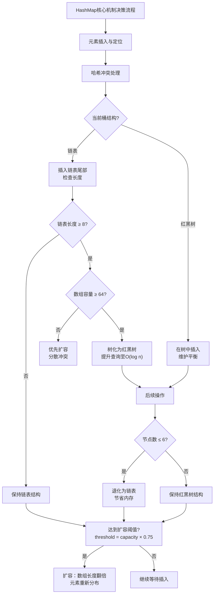

# 链表
## 1. 反转链表(迭代+递归2种写法，时间和空间复杂度分别是多少)
反转链表是数据结构中非常经典的题目。这里我们以最常见的**单链表**为例，分别提供迭代法和递归法的代码实现，并详细分析它们的时间复杂度和空间复杂度。
假设链表节点的定义如下：
```java
class ListNode {
    int val;
    ListNode next;
    ListNode(int val) { this.val = val; }
}
```
---
### 1. 迭代法
**思路：**
使用三个指针 `prev`、`curr` 和 `next`。在遍历链表时，将当前节点 `curr` 的 `next` 指针指向前一个节点 `prev`，然后整体向后移动一步，直到遍历完整个链表。
**代码实现：**
```java
public ListNode reverseList(ListNode head) {
    ListNode prev = null;
    ListNode curr = head;
    while (curr != null) {
        ListNode next = curr.next; // 暂存当前节点的下一个节点
        curr.next = prev;          // 当前节点指向前一个节点（完成反转）
        prev = curr;               // prev 指针后移
        curr = next;               // curr 指针后移
    }
    return prev; // 循环结束时，curr 为 null，prev 指向原链表的最后一个节点
}
```
**复杂度分析：**
*   **时间复杂度：$O(n)$**，其中 $n$ 是链表的长度。需要遍历链表一次。
*   **空间复杂度：$O(1)$**，只使用了几个固定的指针变量，不需要额外的存储空间。
---
### 2. 递归法
**思路：**
递归的目的是一直走到链表的最后一个节点，然后将该节点作为新的头节点返回。在递归回溯的过程中，让当前节点的下一个节点的 `next` 指针指向当前节点，同时将当前节点的 `next` 指针置为 `null`，以防止形成环。
**代码实现：**
```java
public ListNode reverseList(ListNode head) {
    // 递归终止条件：当前节点为空，或者当前节点的下一个节点为空（即到了原链表的尾节点）
    if (head == null || head.next == null) {
        return head;
    }
    
    // 递归调用，反转后面的链表，返回反转后的新头节点
    ListNode newHead = reverseList(head.next);
    
    // 在回溯阶段进行指针反转操作
    // head.next 此时还是指向原链表中的下一个节点
    // 让下一个节点的 next 指向当前节点 head
    head.next.next = head;
    // 断开当前节点原本指向下一个节点的指针，防止成环
    head.next = null;
    
    // 返回新链表的头节点
    return newHead;
}
```
**复杂度分析：**
*   **时间复杂度：$O(n)$**，其中 $n$ 是链表的长度。递归函数需要遍历链表中的每个节点一次。
*   **空间复杂度：$O(n)$**，其中 $n$ 是链表的长度。空间复杂度主要取决于递归调用栈的深度，最多会进行 $n$ 层递归调用。
---
### 总结对比
| 实现方式 | 时间复杂度 | 空间复杂度 | 特点 |
| :--- | :--- | :--- | :--- |
| **迭代法** | $O(n)$ | $O(1)$ | 效率高，不会造成栈溢出，**实际开发中首选**。 |
| **递归法** | $O(n)$ | $O(n)$ | 代码简洁优雅，但由于需要 $O(n)$ 的栈空间，如果链表过长会导致 **StackOverflowError**（栈溢出）。**常用于面试考察递归思维**。 |

## 2. 环形链表检测(快慢指针的原理：为什么快指针每次走2步而不是3步)
环形链表检测通常使用**快慢指针法（Floyd's Tortoise and Hare Algorithm，弗洛伊德龟兔赛跑算法）**。
你问到了一个非常核心且经典的问题：“为什么快指针每次走 2 步，而不是 3 步或更多？”
简单来说：**走 2 步能保证在环内快慢指针一定会相遇；而走 3 步（或更多）在特定长度的环中，快慢指针可能会永远“擦肩而过”，导致死循环。**
下面为你详细进行数学原理解析。

### 一、 快慢指针走 2 步的原理（为什么一定能相遇？）
假设：
*   慢指针 `slow` 每次走 1 步。
*   快指针 `fast` 每次走 2 步。
*   链表头节点到环的入口点距离为 $a$。
*   环的长度为 $L$。
**1. 为什么一定会进环？**
慢指针每次走 1 步，快指针每次走 2 步。快指针比慢指针每次多走 1 步。
因为快指针走得快，它一定会先进入环内。慢指针后进入环内。此时两个指针都在环里转圈。
**2. 为什么在环里一定能相遇？**
当慢指针刚进入环的入口时，快指针已经在环里转了若干圈了。
假设此时快指针距离慢指针的“追赶距离”为 $N$（$0 \le N < L$）。
接下来，它们同时移动：
*   每次移动后，慢指针向前走 1 步。
*   快指针向前走 2 步。
*   因此，**每移动一次，快指针与慢指针的距离就会缩小 $2 - 1 = 1$ 步**。
距离变化序列为：$N \rightarrow N-1 \rightarrow N-2 \rightarrow \dots \rightarrow 1 \rightarrow 0$。
当距离变成 $0$ 时，快慢指针就相遇了。
**结论：只要快慢指针速度差为 1，无论初始距离 $N$ 是多少，每步缩减 1，最终必定会相遇。**

### 二、 如果快指针走 3 步会怎样？（为什么可能永远不相遇？）
假设慢指针 `slow` 每次走 1 步，快指针 `fast` 每次走 3 步。
**1. 相对速度发生变化**
此时，每次移动，快指针比慢指针多走 $3 - 1 = 2$ 步。
也就是说，它们之间的距离每次**缩小 2 步**。
**2. 为什么会错过？（数学证明）**
当慢指针刚进入环时，假设快指针距离慢指针的追赶距离为 $N$。
每次移动，距离缩小 2。距离变化序列为：
$N \rightarrow N-2 \rightarrow N-4 \rightarrow \dots$
这里就会出现两种情况：
*   **情况 A：如果 $N$ 是偶数**
    距离会按照 $4 \rightarrow 2 \rightarrow 0$ 变化。**可以相遇。**
*   **情况 B：如果 $N$ 是奇数**
    距离会按照 $5 \rightarrow 3 \rightarrow 1 \rightarrow -1$ 变化。
    注意这个 $-1$，这意味着什么？意味着快指针直接跨过了慢指针，跑到了慢指针前面 1 步的位置！
**3. 错过后还能再相遇吗？**
当快指针跨过慢指针，跑到慢指针前面 1 步时（此时相对距离 $N = 1$），由于环的长度是固定的，快指针想要再追上慢指针，需要绕环一圈。
此时它们之间的距离变成了 $L - 1$（其中 $L$ 是环的长度）。
下一次追赶，距离依然每次缩小 2：
*   如果 $L - 1$ 是偶数（即 **环长 $L$ 是奇数**）：那么距离可以缩小到 0，**最终相遇**。
*   如果 $L - 1$ 是奇数（即 **环长 $L$ 是偶数**）：那么距离又会缩小到 $-1$，快指针**再次跨过**慢指针，跑到前面 1 步。
**致命死循环：**
如果 $N$ 是奇数，且环的长度 $L$ 是偶数，快指针会永远在慢指针后面 1 步或者跨过去变成前面 1 步，无限循环，**永远不会相遇**！

### 总结
*   **快指针走 2 步（速度差为 1）：** 距离每次减小 1，是一定能完美减到 0 的，不可能出现“跨过”的情况，所以**必然相遇**。
*   **快指针走 3 步（速度差为 2）：** 距离每次减小 2，可能会出现“跨过”现象（距离变成 -1）。如果此时环的长度正好是偶数，它们就会永远互相跨越，**永远无法相遇**。
这就是为什么在环形链表检测中，快指针必须设定为每次走 2 步的原因。
**附：环形链表检测标准代码（快慢指针走2步）**
```java
public boolean hasCycle(ListNode head) {
    if (head == null || head.next == null) {
        return false;
    }
    
    ListNode slow = head;
    ListNode fast = head;
    
    while (fast != null && fast.next != null) {
        slow = slow.next;       // 慢指针走1步
        fast = fast.next.next;  // 快指针走2步
        
        if (slow == fast) {     // 相遇说明有环
            return true;
        }
    }
    
    return false; // fast走到头了，说明无环
}
```

## 3. 合并两个有序链表(迭代和递归写法)
合并两个有序链表也是链表操作中非常经典的题目。这里我们同样以**单链表**为例，提供迭代和递归两种写法，并附带详细的注释和复杂度分析。
假设链表节点的定义如下：
```java
class ListNode {
    int val;
    ListNode next;
    ListNode(int val) { this.val = val; }
}
```
---
### 1. 迭代法
**思路：**
创建一个虚拟头节点，这样可以方便处理头节点为空的情况。使用一个指针 `prev` 遍历两个链表，每次比较两个链表当前节点的值，将较小的一个接到 `prev` 的后面，并移动对应链表的指针。最后将非空的那个链表直接接到末尾即可。
**代码实现：**
```java
public ListNode mergeTwoLists(ListNode list1, ListNode list2) {
    // 创建虚拟头节点，简化头部的边界处理（不用单独判断新链表的头是谁）
    ListNode dummy = new ListNode(-1);
    ListNode prev = dummy; // prev 指针用于构建新链表
    // 当两个链表都还没遍历完时，比较它们的当前节点值
    while (list1 != null && list2 != null) {
        if (list1.val <= list2.val) {
            prev.next = list1;  // 把 list1 当前节点接上
            list1 = list1.next; // list1 指针后移
        } else {
            prev.next = list2;  // 把 list2 当前节点接上
            list2 = list2.next; // list2 指针后移
        }
        prev = prev.next; // prev 指针后移，准备接下一个节点
    }
    // 当其中一个链表遍历结束后，直接将另一个非空链表剩余的部分拼接到末尾
    // 因为是有序链表，剩余部分肯定都大于已合并部分
    prev.next = (list1 != null) ? list1 : list2;
    // 返回真正的头节点（跳过虚拟节点）
    return dummy.next;
}
```
**复杂度分析：**
*   **时间复杂度：$O(n + m)$**，其中 $n$ 和 $m$ 分别是两个链表的长度。因为每次循环迭代中，`list1` 或 `list2` 都会向后推进一步，最多遍历 $n + m$ 次。
*   **空间复杂度：$O(1)$**，只需要常数级的额外指针空间（`dummy` 和 `prev`），原地操作。
---
### 2. 递归法
**思路：**
递归的核心思想是：比较两个链表的头节点，较小的那个节点作为合并后新链表的头节点，然后它的 `next` 指针指向“剩余两个子链表合并后的结果”。
**代码实现：**
```java
public ListNode mergeTwoLists(ListNode list1, ListNode list2) {
    // 递归终止条件：如果其中一个链表为空，直接返回另一个链表
    if (list1 == null) {
        return list2;
    }
    if (list2 == null) {
        return list1;
    }
    // 比较两个头节点的值
    if (list1.val <= list2.val) {
        // list1 较小，list1 作为头节点，其 next 指向去掉 list1 头节点后与 list2 合并的结果
        list1.next = mergeTwoLists(list1.next, list2);
        return list1;
    } else {
        // list2 较小，list2 作为头节点，其 next 指向去掉 list2 头节点后与 list1 合并的结果
        list2.next = mergeTwoLists(list1, list2.next);
        return list2;
    }
}
```
**复杂度分析：**
*   **时间复杂度：$O(n + m)$**，每次递归调用都会去掉两个链表中某一个的头节点，最多进行 $n + m$ 次递归调用。
*   **空间复杂度：$O(n + m)$**，空间复杂度主要取决于递归调用栈的深度，最多会达到 $n + m$ 层。
---
### 总结对比
| 实现方式 | 时间复杂度 | 空间复杂度 | 特点 |
| :--- | :--- | :--- | :--- |
| **迭代法** | $O(n + m)$ | $O(1)$ | 空间效率高，不会造成栈溢出，**实际开发中首选**。 |
| **递归法** | $O(n + m)$ | $O(n + m)$ | 代码极其简洁优雅，符合数学直觉，但存在栈溢出风险，**常用于面试展示递归思维**。 |

## 4. 删除链表倒数第N个节点(一次遍历怎么做)
删除链表的倒数第 $N$ 个节点，常规思路是先遍历一遍求出链表总长度 $L$，然后再遍历一遍走到第 $L-N$ 个节点进行删除。但这需要遍历两次。
如果要**只遍历一次（一次遍历）**，最经典的解法是使用**双指针（快慢指针）法**。
### 核心思路：快慢指针（制造长度差）
1. **制造距离差**：让快指针 `fast` 先走 $N$ 步。
2. **同步移动**：然后让慢指针 `slow` 和快指针 `fast` 同时出发，一起往后走。
3. **命中目标**：当 `fast` 走到链表末尾（即 `fast == null`）时，由于 `fast` 比 `slow` 先走了 $N$ 步，此时 `slow` 刚好指向倒数第 $N$ 个节点。
**重要优化（dummyHead 虚拟头节点）：**
因为我们需要**删除**节点，所以我们需要找到倒数第 $N$ 个节点的**前一个节点**（即倒数第 $N+1$ 个节点）才能修改它的 `next` 指针。
如果我们直接用 `slow` 指向倒数第 $N$ 个节点，删除操作会比较麻烦（需要交换节点值或者特判头节点）。
**技巧**：让 `slow` 落后 `fast` $N+1$ 步。这样当 `fast` 为空时，`slow` 刚好指向要删除节点的**前一个节点**。为了避免删除头节点时的空指针异常，我们引入一个虚拟头节点 `dummy`。

### 代码实现
```java
public ListNode removeNthFromEnd(ListNode head, int n) {
    // 1. 创建虚拟头节点，并指向真正的头节点
    ListNode dummy = new ListNode(0);
    dummy.next = head;
    
    // 2. 快慢指针初始都指向虚拟头节点
    ListNode fast = dummy;
    ListNode slow = dummy;
    
    // 3. 快指针先走 n+1 步
    // 这样最终慢指针会停在要删除节点的前一个节点
    for (int i = 0; i <= n; i++) {
        fast = fast.next;
    }
    
    // 4. 快慢指针同时移动，直到快指针走到末尾（null）
    while (fast != null) {
        fast = fast.next;
        slow = slow.next;
    }
    
    // 5. 此时 slow 指向要删除节点的前一个节点，执行删除操作
    slow.next = slow.next.next;
    
    // 6. 返回新链表的头节点（注意不能返回 head，因为 head 可能被删了）
    return dummy.next;
}
```
---
### 图解推演（以链表 1->2->3->4->5，n=2 为例）
1. **初始化**：`dummy(0) -> 1 -> 2 -> 3 -> 4 -> 5 -> null`，`fast` 和 `slow` 都指向 `dummy(0)`。
2. **快指针先走 3 步 (n+1=3)**：
   * `fast` 指向 `1`
   * `fast` 指向 `2`
   * `fast` 指向 `3`
   此时状态：`slow` 在 `0`，`fast` 在 `3`。
3. **快慢指针同步移动**：
   * 第一轮：`fast` 到 `4`，`slow` 到 `1`
   * 第二轮：`fast` 到 `5`，`slow` 到 `2`
   * 第三轮：`fast` 到 `null`，`slow` 到 `3`
4. **此时快指针为 null，循环结束**：
   `slow` 停在节点 `3`，而节点 `3` 正好是倒数第 2 个节点（节点 `4`）的前一个节点！
5. **删除操作**：`slow.next = slow.next.next`（节点 `3` 的 next 直接指向节点 `5`），节点 `4` 被成功删除。
---
### 复杂度分析
*   **时间复杂度：$O(L)$**，其中 $L$ 是链表的长度。快指针遍历了前 $N+1$ 个节点，随后快慢指针一起遍历了剩余的 $L-N-1$ 个节点。总共遍历了 $L$ 个节点，即**一次遍历**。
*   **空间复杂度：$O(1)$**，只使用了 `dummy`、`fast`、`slow` 三个固定的指针变量，没有额外的空间开销。
### 总结要点
* **为什么用 `dummy` 虚拟头节点？** 解决要删除的节点恰好是原链表头节点的问题，省去了繁琐的 `if (head == null)` 边界判断。
* **为什么快指针走 $n+1$ 步而不是 $n$ 步？** 因为要删除一个节点，必须定位到它的**前驱节点**，所以慢指针需要比快指针落后 $N+1$ 步，而不是 $N$ 步。


# 二叉树
## 1. 二叉树的前序/中序/后序遍历(三种顺序的递归和迭代写法)
二叉树的前序、中序、后序遍历是树结构的基础。递归写法非常直观，而迭代写法则需要借助**栈**来模拟系统递归的过程。
这里我们统一二叉树节点的定义如下：
```java
class TreeNode {
    int val;
    TreeNode left;
    TreeNode right;
    TreeNode(int val) { this.val = val; }
}
```
为了方便记忆，你可以将三种遍历的本质理解为：
*   **前序遍历**：根 -> 左 -> 右
*   **中序遍历**：左 -> 根 -> 右
*   **后序遍历**：左 -> 右 -> 根
下面分别给出三种遍历的递归和迭代写法（返回节点值的 List 集合）。
---
### 一、前序遍历
#### 1. 递归写法
**思路**：按照“根 -> 左 -> 右”的顺序直接递归调用。
```java
public List<Integer> preorderTraversal(TreeNode root) {
    List<Integer> res = new ArrayList<>();
    preorder(root, res);
    return res;
}
private void preorder(TreeNode node, List<Integer> res) {
    if (node == null) return;
    res.add(node.val);       // 1. 访问根节点
    preorder(node.left, res);  // 2. 遍历左子树
    preorder(node.right, res); // 3. 遍历右子树
}
```
#### 2. 迭代写法
**思路**：用栈模拟。前序遍历先处理根，再处理左右。由于栈是“后进先出”的，所以入栈顺序必须是**先右后左**，这样出栈时才是先左后右。
```java
public List<Integer> preorderTraversal(TreeNode root) {
    List<Integer> res = new ArrayList<>();
    if (root == null) return res;
    
    Deque<TreeNode> stack = new ArrayDeque<>();
    stack.push(root);
    
    while (!stack.isEmpty()) {
        TreeNode node = stack.pop();
        res.add(node.val);       // 1. 访问根节点
        
        // 2. 右孩子先入栈（后出）
        if (node.right != null) {
            stack.push(node.right);
        }
        // 3. 左孩子后入栈（先出）
        if (node.left != null) {
            stack.push(node.left);
        }
    }
    return res;
}
```
---
### 二、中序遍历
#### 1. 递归写法
**思路**：按照“左 -> 根 -> 右”的顺序递归。
```java
public List<Integer> inorderTraversal(TreeNode root) {
    List<Integer> res = new ArrayList<>();
    inorder(root, res);
    return res;
}
private void inorder(TreeNode node, List<Integer> res) {
    if (node == null) return;
    inorder(node.left, res);  // 1. 遍历左子树
    res.add(node.val);       // 2. 访问根节点
    inorder(node.right, res); // 3. 遍历右子树
}
```
#### 2. 迭代写法
**思路**：中序遍历需要先找到最左边的节点。过程是：不断将左孩子压入栈中，直到为空；然后弹出栈顶节点访问，再转向其右子树，重复上述过程。
```java
public List<Integer> inorderTraversal(TreeNode root) {
    List<Integer> res = new ArrayList<>();
    Deque<TreeNode> stack = new ArrayDeque<>();
    TreeNode curr = root;
    
    while (curr != null || !stack.isEmpty()) {
        // 1. 一直向左走，把沿途节点全部压入栈中
        while (curr != null) {
            stack.push(curr);
            curr = curr.left;
        }
        
        // 2. 弹出栈顶节点并访问
        curr = stack.pop();
        res.add(curr.val);
        
        // 3. 转向右子树（如果右子树为空，下一轮循环会直接再 pop 栈顶）
        curr = curr.right;
    }
    return res;
}
```
---
### 三、后序遍历
#### 1. 递归写法
**思路**：按照“左 -> 右 -> 根”的顺序递归。
```java
public List<Integer> postorderTraversal(TreeNode root) {
    List<Integer> res = new ArrayList<>();
    postorder(root, res);
    return res;
}
private void postorder(TreeNode node, List<Integer> res) {
    if (node == null) return;
    postorder(node.left, res);  // 1. 遍历左子树
    postorder(node.right, res); // 2. 遍历右子树
    res.add(node.val);       // 3. 访问根节点
}
```
#### 2. 迭代写法
**思路**：后序遍历的迭代稍微复杂。这里介绍一种巧妙的**前序遍历翻转法**。
前序遍历是“根 -> 左 -> 右”。我们稍微修改前序遍历，变成“根 -> 右 -> 左”（即栈中先压左再压右），这样得到的序列逆序之后，刚好就是“左 -> 右 -> 根”，即后序遍历的结果。
```java
public List<Integer> postorderTraversal(TreeNode root) {
    LinkedList<Integer> res = new LinkedList<>(); // 用 LinkedList 方便在头部插入
    if (root == null) return res;
    
    Deque<TreeNode> stack = new ArrayDeque<>();
    stack.push(root);
    
    while (!stack.isEmpty()) {
        TreeNode node = stack.pop();
        res.addFirst(node.val); // 1. 根节点插入结果集的头部（关键点）
        
        // 2. 左孩子先入栈（后出）
        if (node.left != null) {
            stack.push(node.left);
        }
        // 3. 右孩子后入栈（先出）
        if (node.right != null) {
            stack.push(node.right);
        }
    }
    // 整体效果：入栈出栈顺序为 根->右->左，因为 addFirst 逆序，最终结果为 左->右->根
    return res;
}
```
---
### 复杂度总结
无论是递归还是迭代，三种遍历方式的时间和空间复杂度都是一样的：
*   **时间复杂度：$O(N)$**，其中 $N$ 是二叉树的节点数。每一个节点都需要被访问且仅被访问一次。
*   **空间复杂度：$O(H)$**，其中 $H$ 是二叉树的高度。
    *   递归的空间复杂度主要取决于递归调用栈的深度，最大为树的高度 $H$。
    *   迭代的空间复杂度主要取决于我们手动维护的栈的大小，最大也为树的高度 $H$。
    *   最坏情况下（树退化成单链表），空间复杂度为 $O(N)$。平衡二叉树情况下，空间复杂度为 $O(\log N)$。

## 2. 二叉树的层序遍历(队列和linkedList怎么配合)
二叉树的层序遍历是指按层数从上到下、从左到右的顺序访问二叉树的所有节点。
在 Java 中，实现层序遍历的标准做法是使用 **BFS（广度优先搜索）**，而 BFS 的核心数据结构就是**队列**。
那么，`Queue` 和 `LinkedList` 是怎么配合的呢？下面为你详细拆解。

### 一、 Queue 和 LinkedList 的配合原理
1. **为什么需要队列？**
   队列的特性是**先进先出**。在遍历第 $i$ 层时，我们将第 $i+1$ 层的节点（先左孩子，后右孩子）依次放入队列。这样在第 $i$ 层节点全部出队后，第 $i+1$ 层的节点刚好按照从左到右的顺序排在队列头部，完美符合层序遍历的要求。
2. **为什么用 LinkedList 实现Queue？**
   在 Java 中，`Queue` 是一个接口，不能直接实例化。`LinkedList` 实现了 `Deque`（双端队列）接口，而 `Deque` 继承了 `Queue`。
   - **插入和删除效率高**：`LinkedList` 基于链表实现，在队尾插入（`offer`）和在队头删除（`poll`）的时间复杂度都是 $O(1)$，非常适合做队列。
   - **用法**：我们通常通过面向接口编程的方式来声明：`Queue<TreeNode> queue = new LinkedList<>();`
3. **核心 API 配合：**
   - `queue.offer(node)`：入队，将节点添加到队尾。
   - `queue.poll()`：出队，取出并移除队头节点。
   - `queue.isEmpty()`：判断队列是否还有元素。
---
### 二、 基础版：返回一维列表（拍平输出）
如果不要求区分每一层，只是把所有节点按顺序输出，实现非常简单。
```java
public List<Integer> levelOrderFlat(TreeNode root) {
    List<Integer> res = new ArrayList<>();
    if (root == null) return res;
    
    // 1. Queue 接口配合 LinkedList 实现
    Queue<TreeNode> queue = new LinkedList<>();
    queue.offer(root); // 根节点入队
    
    while (!queue.isEmpty()) {
        // 2. 队头节点出队
        TreeNode node = queue.poll();
        res.add(node.val);
        
        // 3. 将出队节点的左、右孩子依次入队
        if (node.left != null) {
            queue.offer(node.left);
        }
        if (node.right != null) {
            queue.offer(node.right);
        }
    }
    return res;
}
```
---
### 三、 进阶版：返回二维列表（按层分组）
在面试中，通常会要求返回 `List<List<Integer>>`，即把每一层的节点值放在一个单独的子列表里。
**关键点：如何控制按层分离？**
在遍历每层开始前，先获取当前队列的长度 `size`，这个 `size` 就是当前层的节点数。然后使用一个 `for` 循环，精准地出队 `size` 次，这就保证了一层处理干净后再进入下一层。
```java
public List<List<Integer>> levelOrder(TreeNode root) {
    List<List<Integer>> res = new ArrayList<>();
    if (root == null) return res;
    
    // 初始化队列
    Queue<TreeNode> queue = new LinkedList<>();
    queue.offer(root);
    
    while (!queue.isEmpty()) {
        // 关键点1：获取当前层的节点个数
        int size = queue.size();
        List<Integer> levelList = new ArrayList<>();
        
        // 关键点2：只循环 size 次，刚好把当前层的节点全部出队
        for (int i = 0; i < size; i++) {
            TreeNode node = queue.poll();
            levelList.add(node.val);
            
            // 同时把下一层的节点按序入队
            if (node.left != null) {
                queue.offer(node.left);
            }
            if (node.right != null) {
                queue.offer(node.right);
            }
        }
        // 当前层的结果加入总结果集
        res.add(levelList);
    }
    return res;
}
```
---
### 四、 复杂度分析
*   **时间复杂度：$O(N)$**，其中 $N$ 是二叉树的节点数。每个节点确切地入队一次、出队一次。
*   **空间复杂度：$O(W)$**，其中 $W$ 是二叉树的最大宽度（某一层的最大节点数）。队列中最多会同时存储一层的所有节点。对于满二叉树，最大宽度约为 $N/2$，所以空间复杂度最坏情况下为 $O(N)$。
### 总结
`Queue` 定义了先进先出的行为规范，`LinkedList` 提供了底层基于链表的快速增删实现。通过 **`while` 循环驱动队列出队** + **`for` 循环按 `size` 精准控制层级**，就能优雅地完成二叉树的层序遍历。

## 3. 二叉树的最大深度(递归和BFS两种解法)
求二叉树的最大深度是非常经典的题目。这里提供两种最常用的解法：**DFS（深度优先搜索，即递归）** 和 **BFS（广度优先搜索，即层序遍历）**。
二叉树节点的定义如下：
```java
class TreeNode {
    int val;
    TreeNode left;
    TreeNode right;
    TreeNode(int val) { this.val = val; }
}
```
---
### 解法一：DFS（递归 / 后序遍历）
**思路：**
二叉树的最大深度等于“左子树的最大深度”和“右子树的最大深度”中的较大者，再加上根节点本身的高度（+1）。
这天然符合后序遍历（左 -> 右 -> 根）的逻辑：先递归计算出左右子树的深度，最后再汇总到当前节点。
**代码实现：**
```java
public int maxDepth(TreeNode root) {
    // 递归终止条件：如果节点为空，深度为 0
    if (root == null) {
        return 0;
    }
    
    // 1. 递归计算左子树的最大深度
    int leftDepth = maxDepth(root.left);
    // 2. 递归计算右子树的最大深度
    int rightDepth = maxDepth(root.right);
    
    // 3. 当前节点的最大深度 = 左右子树深度的最大值 + 1（当前节点本身）
    return Math.max(leftDepth, rightDepth) + 1;
}
```
*注：这种方法也可以精简为一行代码 `return root == null ? 0 : Math.max(maxDepth(root.left), maxDepth(root.right)) + 1;`，但拆解出来更易于理解。*
**复杂度分析：**
*   **时间复杂度：$O(N)$**，其中 $N$ 是节点数。每个节点在递归过程中被访问且仅被访问一次。
*   **空间复杂度：$O(H)$**，其中 $H$ 是树的高度。空间复杂度主要取决于递归调用栈的深度。最坏情况下（树退化为单链表），空间复杂度为 $O(N)$；最好情况下（平衡二叉树），空间复杂度为 $O(\log N)$。
---
### 解法二：BFS（迭代 / 层序遍历）
**思路：**
在上一节我们讲了层序遍历的 `Queue` 和 `LinkedList` 的配合。二叉树的深度实际上就等于**树的层数**。我们只需要使用 BFS 进行层序遍历，每遍历完一层（即内层 `for` 循环结束时），就把深度计数器 `+1`，直到遍历完所有层。
**代码实现：**
```java
public int maxDepth(TreeNode root) {
    if (root == null) {
        return 0;
    }
    
    int depth = 0;
    // 使用 LinkedList 实现的 Queue
    Queue<TreeNode> queue = new LinkedList<>();
    queue.offer(root); // 根节点入队
    
    while (!queue.isEmpty()) {
        int size = queue.size(); // 当前层的节点个数
        
        // 遍历当前层的所有节点
        for (int i = 0; i < size; i++) {
            TreeNode node = queue.poll(); // 队头出队
            
            // 将下一层的节点按序入队
            if (node.left != null) {
                queue.offer(node.left);
            }
            if (node.right != null) {
                queue.offer(node.right);
            }
        }
        
        // 关键点：当前层遍历完毕，深度 +1
        depth++;
    }
    
    return depth;
}
```
**复杂度分析：**
*   **时间复杂度：$O(N)$**，其中 $N$ 是节点数。每个节点确切地入队一次、出队一次。
*   **空间复杂度：$O(W)$**，其中 $W$ 是树的最大宽度。空间复杂度主要取决于队列中同时存储的节点数。最坏情况下（完全平衡二叉树的最底层），队列中最多存储约 $N/2$ 个节点，空间复杂度为 $O(N)$。
---
### 总结对比
| 解法 | 核心思想 | 代码风格 | 时间复杂度 | 空间复杂度 | 特点 |
| :--- | :--- | :--- | :--- | :--- | :--- |
| **DFS (递归)** | 后序遍历，自底向上汇总高度 | 简洁优雅 | $O(N)$ | $O(H)$ (树高) | 代码最简单，**面试首选写法**。 |
| **BFS (迭代)** | 层序遍历，自顶向下累加层数 | 稍微复杂 | $O(N)$ | $O(W)$ (树宽) | 不会造成栈溢出，**当树极度不平衡时（如单链表），空间复杂度优于 DFS**。 |

## 4. 对称二叉树(什么是对称，递归的判断条件怎么写)
判断对称二叉树是二叉树章节里非常经典的题目。这道题的核心在于理解“对称”的定义，并将其转化为代码逻辑。
### 一、 什么是对称二叉树？
简单来说，如果一个二叉树沿着根节点的中心线对折，左右两边能够完全重合，它就是对称的。
用语言描述定义如下：
1. 根节点的左右子树必须不为空（或者同时为空）。
2. 左子树的**左孩子** 必须等于 右子树的**右孩子**（外侧对应外侧）。
3. 左子树的**右孩子** 必须等于 右子树的**左孩子**（内侧对应内侧）。
4. 递归下去，所有对应的节点都满足上述条件。
---
### 二、 递归的判断条件怎么写？
既然是判断左右两棵子树是否对称，我们需要写一个辅助递归函数：`boolean check(TreeNode left, TreeNode right)`。
递归的核心在于**明确终止条件**和**单层递归逻辑**：
#### 1. 明确终止条件（Base Cases）
当我们将两个节点传入 `check` 函数时，有几种情况可以直接得出结论，不需要继续往下递归：
*   **条件 A：两个节点都为空。**
    `if (left == null && right == null) return true;`
    *(说明两边都走到了叶子节点的尽头，完美对称)*
*   **条件 B：其中一个节点为空，另一个不为空。**
    `if (left == null || right == null) return false;`
    *(说明结构不对称，一边有孩子一边没有)*
    *注：因为前面的条件 A 已经拦截了“两者都为空”的情况，所以这里只要其中一个为空，必定是“一空一非空”，直接返回 false。*
*   **条件 C：两个节点的值不相等。**
    `if (left.val != right.val) return false;`
    *(说明结构虽然对称了，但数值不对称)*
#### 2. 明确单层递归逻辑
如果上述三个终止条件都没触发，说明当前这两个节点：**都不为空，且值相等**。
此时，我们需要继续向内层递归，比较它们的孩子节点。根据对称的定义，必须做“交叉比较”：
*   **外侧对比**：`left` 的左孩子  对比  `right` 的右孩子
*   **内侧对比**：`left` 的右孩子  对比  `right` 的左孩子
只有外侧和内侧**同时**对称，当前子树才对称。所以用 `&&` 连接：
```java
boolean outside = check(left.left, right.right); // 外侧
boolean inside  = check(left.right, right.left);  // 内侧
return outside && inside;
```
---
### 三、 完整代码实现
#### 解法 1：递归法（推荐，最符合直觉）
```java
class Solution {
    public boolean isSymmetric(TreeNode root) {
        // 根节点如果为空，算作对称；如果非空，比较其左右子树
        if (root == null) return true;
        // 调用递归辅助函数比较左右子树
        return check(root.left, root.right);
    }
    private boolean check(TreeNode left, TreeNode right) {
        // 1. 终止条件：两个都为空，对称
        if (left == null && right == null) return true;
        
        // 2. 终止条件：一空一非空，不对称
        // (因为上一步已经排除了两个都为空，这里写其中一个为空即可)
        if (left == null || right == null) return false;
        
        // 3. 终止条件：两个值不相等，不对称
        if (left.val != right.val) return false;
        
        // 4. 单层递归逻辑：交叉比较
        // 左的左 对比 右的右；左的右 对比 右的左
        return check(left.left, right.right) && check(left.right, right.left);
    }
}
```
**复杂度分析：**
*   **时间复杂度：$O(N)$**，其中 $N$ 是节点数。我们最多遍历整棵树的一半的节点。
*   **空间复杂度：$O(H)$**，其中 $H$ 是树的高度。空间复杂度取决于递归调用栈的深度。最坏情况（退化为链表）为 $O(N)$，最好情况（平衡树）为 $O(\log N)$。
---
#### 解法 2：迭代法（使用队列）
**思路：**
递归本质上是隐式使用系统栈。我们可以显式地引入一个队列（或栈），每次将需要比较的两个相邻节点成对入队，然后成对出队进行比较。这其实类似于层序遍历的思想，只不过是成对处理。
```java
public boolean isSymmetric(TreeNode root) {
    if (root == null) return true;
    
    Queue<TreeNode> queue = new LinkedList<>();
    // 将根节点的左右子树根节点入队
    queue.offer(root.left);
    queue.offer(root.right);
    
    while (!queue.isEmpty()) {
        // 每次出队两个节点进行比较
        TreeNode left = queue.poll();
        TreeNode right = queue.poll();
        
        // 1. 如果两个都为空，说明这一路走到头了，继续比较队列里的下一对
        if (left == null && right == null) continue;
        
        // 2. 如果一空一非空，或者值不相等，直接返回 false
        if (left == null || right == null || left.val != right.val) return false;
        
        // 3. 按照对称的顺序，将孩子节点成对入队
        // 外侧对（左的左 + 右的右）
        queue.offer(left.left);
        queue.offer(right.right);
        
        // 内侧对（左的右 + 右的左）
        queue.offer(left.right);
        queue.offer(right.left);
    }
    return true;
}
```
**复杂度分析：**
*   **时间复杂度：$O(N)$**，每个节点入队出队一次。
*   **空间复杂度：$O(N)$**，队列中最多存放约 $N/2$ 个节点（最底层节点数）。
### 总结
写对称二叉树的递归条件，关键在于**打破“只看一个节点”的思维定势**。必须把递归函数定义为**同时处理两个节点**，并且比较的时候要**“交叉”**（左左 vs 右右，左右 vs 右左）。只要牢记终止条件的先后顺序，代码就能写得非常稳健。


# 数组/字符串
## 1. 两数之和(HashMap的O(n)解法，为什么不能用双指针)
“两数之和”是LeetCode的第一题，也是面试中最基础、最高频的题目之一。
假设题目要求：在一个整数数组 `nums` 中找出和为目标值 `target` 的两个整数的**下标**。

### 一、 HashMap 的 $O(n)$ 解法
**核心思路：以空间换时间。**
我们在遍历数组时，把已经遍历过的数字存入 HashMap 中。对于当前数字 `num`，我们只需要去 HashMap 里查一下有没有 `target - num` 存在。如果有，直接返回两者的下标；如果没有，把当前数字存入 HashMap，继续往后走。
**代码实现：**
```java
public int[] twoSum(int[] nums, int target) {
    // Key: 数组中的数字, Value: 该数字的下标
    Map<Integer, Integer> map = new HashMap<>();
    
    for (int i = 0; i < nums.length; i++) {
        int complement = target - nums[i]; // 计算需要的另一个数
        
        // 查询 HashMap 中是否已经存在这个需要的数
        if (map.containsKey(complement)) {
            // 找到了，返回 [补数的下标, 当前下标]
            return new int[]{map.get(complement), i};
        }
        
        // 没找到，把当前数字和它的下标存入 HashMap，供后面的数字查找
        map.put(nums[i], i);
    }
    
    // 题目保证一定有解，不会走到这里
    return new int[0]; 
}
```
**复杂度分析：**
*   **时间复杂度：$O(n)$**。我们只需要遍历一次数组，每次在 HashMap 中查询和插入的时间复杂度都是 $O(1)$。
*   **空间复杂度：$O(n)$**。最坏情况下，我们需要把前 $n-1$ 个元素都存入 HashMap 中。
---
### 二、 为什么不能用双指针？
熟悉算法的同学一定知道“两数之和”有一个经典的双指针解法。但针对这道题（返回下标），**直接用双指针是错误的**。
#### 1. 双指针的前提条件是：数组必须有序
双指针法（左指针指向开头，右指针指向结尾，根据两数之和与 target 的比较来移动指针）利用的是**单调性**。只有数组排好序了，左指针右移才会让和变大，右指针左移才会让和变小，从而巧妙地省去嵌套循环。
#### 2. 双指针会导致原始下标丢失
这道题要求返回的是**原始数组的下标**。
如果你为了用双指针而先对数组进行排序（`Arrays.sort(nums)`），那么数组元素的位置就被打乱了。当你用双指针找到这两个数字时，你拿到的是排序后数组的下标，**已经无法对应回原数组的下标了**。
#### 3. 如果硬要用双指针，代价是什么？
如果你非要用双指针，并且想保留原下标，你需要做以下操作：
1. 把原数组转换成一个包含“值+原下标”的自定义对象数组。
2. 根据值对这个对象数组进行排序（耗时 $O(n \log n)$）。
3. 对排序后的数组使用双指针查找（耗时 $O(n)$）。
4. 从对象中取出原下标返回。
**对比分析：**
*   **HashMap 解法**：时间 $O(n)$，空间 $O(n)$。
*   **排序+双指针解法**：时间 $O(n \log n)$，空间 $O(n)$（因为要创建对象数组）。
可以看出，为了用双指针强行找回下标，不仅写起来更复杂，时间复杂度还退化到了 $O(n \log n)$，性能全面被 HashMap 碾压。
---
### 总结：什么时候用双指针，什么时候用 HashMap？
*   **用 HashMap**：当数组**无序**，或者题目明确要求返回**原始下标**时。只需一次遍历，时间最优 $O(n)$。
*   **用双指针**：当数组**已经是有序的**，或者题目只要求返回**任意一对数字的值**（不要求下标），甚至要求不能使用额外空间（空间复杂度要求 $O(1)$）时。双指针法时间 $O(n)$，空间 $O(1)$，非常优雅。
LeetCode 第一题的无序数组求下标，正是 HashMap 的主场。

## 2. 最长无重复子串(滑动串口+HashSet的窗口收缩条件)
寻找最长无重复字符的子串（Longest Substring Without Repeating Characters）是滑动窗口算法的最经典入门题。
使用“滑动窗口 + HashSet”的核心在于：**如何维护一个始终没有重复字符的窗口，并在遇到重复时如何进行“收缩”。**
### 一、 核心思路：滑动窗口
1. **定义窗口**：使用两个指针 `left` 和 `right`，分别代表窗口的左右边界。窗口内的子串就是我们当前考察的无重复子串。
2. **维护状态**：使用一个 `HashSet<Character>` 来存储当前窗口内包含的所有字符。利用 HashSet 的 $O(1)$ 查询特性，快速判断新字符是否重复。
3. **窗口扩张**：`right` 指针不断向右移动，将新字符尝试加入窗口。
4. **窗口收缩条件（关键）**：当 `right` 指向的新字符已经存在于 HashSet 中时，说明出现了重复。此时不能直接加入，必须**将 `left` 指针不断右移，并从 HashSet 中移除 `left` 经过的字符，直到窗口内不再包含这个重复字符**。
---
### 二、 窗口收缩条件详解
假设字符串是 `a b c b`，目标考察到第二个 `b`（下标为 3）。
当前窗口是 `[a, b, c]`（下标 0~2），HashSet 中有 `{a, b, c}`。
1. `right` 来到下标 3，字符是 `'b'`。
2. 查询 HashSet，发现 `'b'` 已经在里面了。**触发收缩条件**。
3. **怎么收缩？**
   - 移除 `left`（下标 0）指向的字符 `'a'`，HashSet 变为 `{b, c}`，`left` 变为 1。此时 `'b'` 仍在 HashSet 中，**收缩继续**。
   - 移除 `left`（下标 1）指向的字符 `'b'`，HashSet 变为 `{c}`，`left` 变为 2。此时 `'b'` 不在 HashSet 中了，**收缩完成**。
4. 将新的 `'b'` 加入 HashSet，HashSet 变为 `{c, b}`。窗口变为 `[c, b]`（下标 2~3）。
5. 更新最长长度。
**总结收缩条件**：只要 `set.contains(nums[right])` 为 `true`，就不断执行 `set.remove(nums[left])` 并且 `left++`。这是一种**“排队剔除”**的暴力收缩法，确保窗口合法性。
---
### 三、 代码实现
```java
public int lengthOfLongestSubstring(String s) {
    if (s == null || s.length() == 0) return 0;
    
    Set<Character> set = new HashSet<>();
    int left = 0;
    int maxLen = 0;
    
    // right 指针不断向右扩张窗口
    for (int right = 0; right < s.length(); right++) {
        char c = s.charAt(right);
        
        // 【窗口收缩条件】：当新字符已经在窗口集合中时，不断收缩左边界
        while (set.contains(c)) {
            set.remove(s.charAt(left));
            left++;
        }
        
        // 此时窗口内必定没有字符 c，将其加入
        set.add(c);
        
        // 计算当前窗口长度，更新最大值
        // 窗口长度 = right - left + 1
        maxLen = Math.max(maxLen, right - left + 1);
    }
    
    return maxLen;
}
```
---
### 四、 复杂度分析
*   **时间复杂度：$O(N)$**，其中 $N$ 是字符串的长度。
    *   虽然里面有一个 `while` 循环，看起来像双重循环，但 `left` 指针在整个生命周期内最多从 0 走到 `s.length()`。`right` 指针也是最多走 `s.length()` 次。两个指针总共最多执行 $2N$ 次操作，所以平摊下来的时间复杂度是 $O(N)$。
*   **空间复杂度：$O(M)$**，其中 $M$ 是字符集的大小（例如 ASCII 字符集是 128 或 256，扩展 ASCII 是 256）。HashSet 最多存储窗口内的字符数，由于字符集大小是固定的，空间复杂度可以视为 $O(1)$（如果只考虑英文字母和符号）。如果是 Unicode 字符，则取决于字符串长度。
---
### 五、 进阶优化：HashMap 替代 HashSet
使用 HashSet 的缺点是：遇到重复时，`left` 只能**一步一步**地向右移动剔除字符。如果重复字符在窗口的最右边，`left` 要走很多步。
**优化思路**：使用 `HashMap<Character, Integer>` 记录字符及其**最新出现的下标**。
当遇到重复字符 `c` 时，直接判断 `map.get(c)` 是否大于等于 `left`。如果是，说明重复字符在当前窗口内，直接将 `left` 一步跳跃到 `map.get(c) + 1` 即可，不需要 `while` 循环逐步剔除。
```java
// 优化版：HashMap 实现 O(N) 的绝对单次遍历
public int lengthOfLongestSubstring(String s) {
    if (s == null || s.length() == 0) return 0;
    
    Map<Character, Integer> map = new HashMap<>();
    int left = 0;
    int maxLen = 0;
    
    for (int right = 0; right < s.length(); right++) {
        char c = s.charAt(right);
        
        // 如果字符 c 已经在 map 中，并且它的下标在当前窗口 [left, right] 内
        if (map.containsKey(c) && map.get(c) >= left) {
            // 直接将 left 跳跃到重复字符的下一个位置
            left = map.get(c) + 1;
        }
        
        // 更新字符 c 的最新下标
        map.put(c, right);
        // 更新最大长度
        maxLen = Math.max(maxLen, right - left + 1);
    }
    
    return maxLen;
}
```
**面试建议**：在面试中，可以先讲清楚 HashSet + 滑动窗口的思路（因为更容易理解和手写），然后再提出可以使用 HashMap 优化左指针的跳跃，这样能体现出你对算法优化的思考。

## 3. 合并区间(排序+一次遍历，怎么判断区间重叠)
“合并区间”是一道非常经典的算法题，也是面试中的高频题。它的核心在于**排序**和**贪心**思想。
### 题目描述
给出一组区间，其中每个区间表示为 `[start, end]`。合并所有重叠的区间，并返回一个不重叠的区间数组。
例如：
输入：`intervals = [[1,3],[2,6],[8,10],[15,18]]`
输出：`[[1,6],[8,10],[15,18]]`
解释：区间 `[1,3]` 和 `[2,6]` 重叠，合并为 `[1,6]`。

### 一、 核心思路
1. **按左端点排序**：首先将所有区间按照**左边界**进行升序排序。排序后，能够合并的区间在物理位置上一定是连续的。
2. **维护当前合并区间**：将排序后的第一个区间作为“当前区间”放入结果集。
3. **遍历比较与合并**：从第二个区间开始遍历：
   - **重叠情况**：如果当前区间的左端点 `<=` 结果集中最后一个区间的右端点，说明两者重叠。此时更新结果集中最后一个区间的右端点为两者的较大值（扩展右边界）。
   - **不重叠情况**：如果当前区间的左端点 `>` 结果集中最后一个区间的右端点，说明两者不重叠。直接将当前区间加入结果集。
---
### 二、 代码实现
在 Java 中，通常使用 `int[][]` 二维数组来表示区间集合。
```java
import java.util.Arrays;
import java.util.ArrayList;
import java.util.List;
public int[][] merge(int[][] intervals) {
    // 1. 边界条件处理
    if (intervals == null || intervals.length == 0) {
        return new int[0][2];
    }
    // 2. 按区间的左端点进行升序排序
    // 使用 Lambda 表达式简化比较器的写法
    Arrays.sort(intervals, (a, b) -> Integer.compare(a[0], b[0]));
    // 3. 使用 List 来动态保存合并后的结果
    List<int[]> merged = new ArrayList<>();
    // 4. 遍历排序后的区间
    for (int[] interval : intervals) {
        // 获取当前区间的左右端点
        int L = interval[0];
        int R = interval[1];
        // 如果结果集为空，或者当前区间的左端点 > 结果集最后一个区间的右端点
        // 说明不重叠，直接将当前区间加入结果集
        if (merged.isEmpty() || L > merged.get(merged.size() - 1)[1]) {
            merged.add(interval);
        } else {
            // 否则说明重叠（当前区间左端点 <= 结果集最后一个区间的右端点）
            // 合并区间：更新结果集最后一个区间的右端点为两者右端点的最大值
            merged.get(merged.size() - 1)[1] = Math.max(merged.get(merged.size() - 1)[1], R);
        }
    }
    // 5. 将 List 转换为 int[][] 数组返回
    return merged.toArray(new int[merged.size()][]);
}
```
---
### 三、 复杂度分析
*   **时间复杂度：$O(N \log N)$**
    *   排序的时间复杂度为 $O(N \log N)$，其中 $N$ 是区间的数量。
    *   遍历一遍数组进行合并的时间复杂度为 $O(N)$。
    *   总体时间复杂度由排序决定，为 $O(N \log N)$。
*   **空间复杂度：$O(\log N)$ 到 $O(N)$**
    *   排序需要使用的栈空间为 $O(\log N)$（快速排序的递归深度）。
    *   如果算上返回结果集 `merged` 占用的空间，则为 $O(N)$。如果不将输出结果算作额外空间，则空间复杂度为 $O(\log N)$。
---
### 四、 总结与易错点
1. **为什么要按左端点排序？**
   按左端点排序后，我们能保证具有较小起始点的区间排在前面。这样在遍历时，我们只需要关心当前区间的左端点和前一个区间的右端点的关系，就能判断是否重叠。如果不排序，区间关系杂乱无章，需要两两比较，时间复杂度会退化为 $O(N^2)$。
2. **右端点合并时记得取 Max**：
   重叠时，新的右端点应该是 `Math.max(前一个右端点, 当前右端点)`。
   *比如 `[1, 5]` 和 `[2, 3]`，当前区间 `[2, 3]` 被完全包含在前一个区间内，合并后右边界仍然是 `5`，不能直接覆盖成 `3`。*
3. **Java 中二维数组的排序写法**：
   `Arrays.sort(intervals, (a, b) -> Integer.compare(a[0], b[0]))` 是比较规范的写法，避免了直接使用 `a[0] - b[0]` 可能导致的整数溢出问题。

## 4. 三数之和(排序+固定一个+双指针，去重的写法)
“三数之和”是“两数之和”的进阶版，也是面试中极高频的题目。这道题最大的难点不在于“能不能做出来”，而在于**如何高效地去除重复解**。
### 题目描述
给你一个整数数组 `nums`，判断是否存在三元组 `[nums[i], nums[j], nums[k]]` 满足 `i != j`、`i != k` 且 `j != k`，并且还满足 `nums[i] + nums[j] + nums[k] == 0`。请你返回所有和为 `0` 且不重复的三元组。

### 一、 核心思路：排序 + 双指针
为什么不用 HashMap？
在“两数之和”中我们用了 HashMap，但如果在三数之和中用 HashMap，去重会非常痛苦（你需要对三元组进行排序并存入 HashSet，效率极低）。
**最优解法是：排序 + 双指针**。
1. **排序**：首先将数组升序排序。排序后，相同的数字会排在一起，方便我们跳过重复值；同时，利用单调性可以使用双指针。
2. **固定一个数，双指针找另外两个数**：
   - 遍历数组，将当前数字 `nums[i]` 固定为三元组的第一个数。
   - 使用左指针 `left = i + 1`，右指针 `right = nums.length - 1`。
   - 在 `[left, right]` 区间内，利用双指针寻找剩下两个数，使得 `nums[i] + nums[left] + nums[right] == 0`。
3. **根据和移动指针**：
   - 如果 `sum == 0`：找到一组解，加入结果集。然后**左右指针同时向内收缩，并跳过重复值**。
   - 如果 `sum < 0`：说明三数之和太小，`left` 右移让和变大。
   - 如果 `sum > 0`：说明三数之和太大，`right` 左移让和变小。
---
### 二、 去重逻辑（本题灵魂）
去重分为三个层级，缺一不可：
1. **外层循环 `i` 的去重**：
   如果 `nums[i] == nums[i - 1]`，说明这个数作为三元组的第一个数的结果，在上一轮已经找完了，直接 `continue` 跳过。
2. **找到解时，`left` 的去重**：
   当找到一组解后，如果 `nums[left] == nums[left + 1]`，说明下一个数字和当前一样，会得到重复解，`left` 一直向右移动直到遇到不同的数。
3. **找到解时，`right` 的去重**：
   同理，如果 `nums[right] == nums[right - 1]`，`right` 一直向左移动直到遇到不同的数。
---
### 三、 代码实现
```java
import java.util.ArrayList;
import java.util.Arrays;
import java.util.List;
class Solution {
    public List<List<Integer>> threeSum(int[] nums) {
        List<List<Integer>> res = new ArrayList<>();
        if (nums == null || nums.length < 3) return res;
        // 1. 排序
        Arrays.sort(nums);
        // 2. 遍历数组，固定第一个数 nums[i]
        for (int i = 0; i < nums.length - 2; i++) {
            // 优化1：如果当前最小的数已经 > 0，后面不可能凑出三个数之和等于 0
            if (nums[i] > 0) break; 
            
            // 去重1：如果当前数和前一个数一样，跳过（避免结果集出现重复三元组）
            if (i > 0 && nums[i] == nums[i - 1]) continue;
            int left = i + 1;
            int right = nums.length - 1;
            while (left < right) {
                int sum = nums[i] + nums[left] + nums[right];
                if (sum == 0) {
                    // 找到一组解
                    res.add(Arrays.asList(nums[i], nums[left], nums[right]));
                    
                    // 去重2：跳过 left 重复的值
                    while (left < right && nums[left] == nums[left + 1]) {
                        left++;
                    }
                    // 去重3：跳过 right 重复的值
                    while (left < right && nums[right] == nums[right - 1]) {
                        right--;
                    }
                    
                    // 跳过重复值后，左右指针还要再收缩一步，指向真正不同的数
                    left++;
                    right--;
                } else if (sum < 0) {
                    // 和太小，左指针右移
                    left++;
                } else {
                    // 和太大，右指针左移
                    right--;
                }
            }
        }
        return res;
    }
}
```
---
### 四、 复杂度分析
*   **时间复杂度：$O(N^2)$**
    *   排序的时间复杂度为 $O(N \log N)$。
    *   外层循环遍历数组的时间复杂度为 $O(N)$。
    *   对于每个外层循环，内层的双指针遍历数组的时间复杂度为 $O(N)$。
    *   总体时间复杂度为 $O(N \log N) + O(N^2) = O(N^2)$。
*   **空间复杂度：$O(\log N)$ 到 $O(N)$**
    *   主要取决于排序算法所使用的栈空间（快速排序的递归深度）。如果不计算返回结果集占用的空间，空间复杂度为 $O(\log N)$。
---
### 五、 面试易错点总结
1. **去重条件写错**：
   外层 `i` 的去重千万不能写成 `nums[i] == nums[i + 1]`！
   如果写成 `i+1`，那么对于数组 `[-1, -1, 2]`，当 `i=0` 时，判断 `nums[0] == nums[1]` 为 true，直接 `continue` 跳过了，这就导致唯一正确的解被错过了。
   **正确的逻辑是回头看：`nums[i] == nums[i - 1]`**，说明前一个相同的数已经处理过了，当前这个不用再处理。
2. **找到解后指针移动遗漏**：
   在 `sum == 0` 时，执行完 `while` 跳过重复元素后，**一定要记得再执行一次 `left++; right--;`**。因为当前的 `nums[left]` 和 `nums[right]` 已经被加入结果集了，必须移动到下一个未被处理的元素上。
3. **边界条件优化**：
   在外层循环加上 `if (nums[i] > 0) break;`，因为数组已经排序，如果第一个数都大于 0，三个大于 0 的数相加绝不可能等于 0，可以直接提前结束，这是一个很好的性能优化点。


## 5. 去除连续重复的数组元素

去除数组中“连续重复”的元素，是一个经典的算法问题。根据你使用的编程语言和具体需求（是否保留原顺序、是否要求原地修改），有多种实现方式。
以下是几种主流的解法，以最典型的**原地修改并返回新长度**（类似 LeetCode 26. 删除有序数组中的重复项）的需求为例进行说明。
### 方法一：双指针法（最优解）
这是处理数组去重最经典、最高效的方法。它的核心思想是：使用一个“慢指针”记录当前不重复元素应该放置的位置，用一个“快指针”遍历数组寻找下一个不重复的元素。
**适用场景**：需要原地修改数组，且对空间复杂度有要求（$O(1)$）。
**时间复杂度**：$O(n)$
**空间复杂度**：$O(1)$
#### Java 实现
```java
public int removeDuplicates(int[] nums) {
    if (nums == null || nums.length == 0) return 0;
    
    int slow = 0; // 慢指针，指向最后一个不重复的元素
    for (int fast = 1; fast < nums.length; fast++) {
        // 当快指针遇到与慢指针不同的元素时，说明找到了新的不重复元素
        if (nums[fast] != nums[slow]) {
            slow++; // 慢指针先向前移动一步
            nums[slow] = nums[fast]; // 将新元素放到慢指针的位置
        }
    }
    // 数组的有效长度为 slow + 1
    return slow + 1; 
}
```
#### Python 实现（原地修改版）
```python
def remove_duplicates(nums):
    if not nums: return 0
    slow = 0
    for fast in range(1, len(nums)):
        if nums[fast] != nums[slow]:
            slow += 1
            nums[slow] = nums[fast]
    return slow + 1
```
---
### 方法二：利用集合特性（不要求原地修改）
如果你不需要在原数组上修改，而是希望直接得到一个新的去重后的列表，利用集合或语言内置的特性会更简洁。
但要注意：**单纯用 Set 会打乱原有顺序**。如果要求保持原顺序并去除连续重复，可以使用以下方式。
#### Python 实现（推荐写法，简洁优雅）
```python
def remove_consecutive_duplicates(arr):
    if not arr: return []
    # 将数组转换为字符串，相邻元素用特殊字符分隔，再用正则或者 itertools 去重
    # 这里演示一种更直观的列表推导式写法
    return [arr[i] for i in range(len(arr)) if i == 0 or arr[i] != arr[i-1]]
```
---
### 方法三：通用遍历构建新数组法
如果数据结构不是数组而是链表，或者不要求原地修改，可以顺序遍历一遍，只把与前一个元素不同的值加入结果集中。
#### Java 实现（构建新列表）
```java
public List<Integer> removeDuplicatesToList(int[] nums) {
    List<Integer> result = new ArrayList<>();
    if (nums == null || nums.length == 0) return result;
    
    result.add(nums[0]);
    for (int i = 1; i < nums.length; i++) {
        // 只要当前元素和前一个元素不同，就加入结果集
        if (nums[i] != nums[i - 1]) {
            result.add(nums[i]);
        }
    }
    return result;
}
```
---
### 💡 核心逻辑总结
无论用什么语言或数据结构，去除**连续**重复元素的核心判断逻辑只有一个：
> **“当前元素” 是否等于 “前一个保留的元素”？**
> *   如果相等，跳过（说明是连续重复）。
> *   如果不等，保留（说明遇到了新的值）。
### 拓展：如果是去除“所有”重复元素（而非仅连续重复）怎么办？
如果题目意思是：只要元素出现过多次，就全部删掉，只保留那些只出现过1次的元素。
*   **解法**：需要先遍历一次用 `HashMap` 统计每个元素的频率，然后再遍历一次，把频率为 1 的元素挑出来。这需要 $O(n)$ 的额外空间。


## 6. 顺时针打印数组

顺时针打印二维数组（矩阵）是一个经典的算法题（类似 LeetCode 54. 螺旋矩阵）。最清晰直观的解法是**边界收缩法**。
### 💡 核心思路：边界收缩法
我们将矩阵想象成由四个边界围成：上、下、左、右。
按顺时针方向（上 -> 右 -> 下 -> 左）依次打印边界上的元素，每打印完一条边，就将对应的边界向内收缩 1，直到所有边界相遇，打印结束。
### 🖼️ 图解过程
假设矩阵为：
```text
[ 1,  2,  3,  4]
[ 5,  6,  7,  8]
[ 9, 10, 11, 12]
```
1. 定义边界：`top = 0`, `bottom = 2`, `left = 0`, `right = 3`
2. 打印上边界（从左到右）：1, 2, 3, 4。`top++` (变为1)
3. 打印右边界（从上到下）：8, 12。`right--` (变为2)
4. 打印下边界（从右到左）：11, 10, 9。`bottom--` (变为1)
5. 打印左边界（从下到上）：5。`left++` (变为1)
6. 下一轮打印内部矩阵：6, 7。结束。
---
### 💻 Java 代码实现
```java
import java.util.ArrayList;
import java.util.List;
public class SpiralMatrix {
    public List<Integer> spiralOrder(int[][] matrix) {
        List<Integer> result = new ArrayList<>();
        if (matrix == null || matrix.length == 0 || matrix[0].length == 0) {
            return result;
        }
        // 初始化四个边界
        int top = 0;
        int bottom = matrix.length - 1;
        int left = 0;
        int right = matrix[0].length - 1;
        while (top <= bottom && left <= right) {
            // 1. 打印上边界：从左到右
            for (int i = left; i <= right; i++) {
                result.add(matrix[top][i]);
            }
            top++; // 上边界向下收缩
            // 2. 打印右边界：从上到下
            for (int i = top; i <= bottom; i++) {
                result.add(matrix[i][right]);
            }
            right--; // 右边界向左收缩
            // ⚠️ 关键判断：如果上下边界相遇，说明只剩一行了，无需再走下边界
            if (top > bottom) break;
            // 3. 打印下边界：从右到左
            for (int i = right; i >= left; i--) {
                result.add(matrix[bottom][i]);
            }
            bottom--; // 下边界向上收缩
            // ⚠️ 关键判断：如果左右边界相遇，说明只剩一列了，无需再走左边界
            if (left > right) break;
            // 4. 打印左边界：从下到上
            for (int i = bottom; i >= top; i--) {
                result.add(matrix[i][left]);
            }
            left++; // 左边界向右收缩
        }
        return result;
    }
    public static void main(String[] args) {
        SpiralMatrix sm = new SpiralMatrix();
        int[][] matrix = {
            {1, 2, 3, 4},
            {5, 6, 7, 8},
            {9, 10, 11, 12}
        };
        System.out.println(sm.spiralOrder(matrix)); 
        // 输出: [1, 2, 3, 4, 8, 12, 11, 10, 9, 5, 6, 7]
    }
}
```
### 📝 复杂度分析
*   **时间复杂度：$O(m \times n)$**。其中 $m$ 是矩阵的行数，$n$ 是列数。因为每个元素只被访问且仅被访问一次。
*   **空间复杂度：$O(1)$**。除了返回结果的数组外，只使用了 4 个边界变量，常数级空间。
### 🛡️ 细节避坑指南
在打印下边界和左边界之前，**必须加上 `if (top > bottom) break;` 和 `if (left > right) break;` 的判断**。
因为在上边界或右边界收缩后，可能导致边界越过（比如只剩一行或一列的情况），如果不加判断，下边界和左边界会重复打印这一行/列的元素，导致结果出错。

# 动态规划
## 1. 爬楼梯(低腿公式怎么推导，空间优化怎么做)
## 2. 打家劫舍(相邻不能偷的递堆公式是什么，环形数组怎么处理)
## 3. 最大子序和(dp[i]代表什么？Kadane算法和DP的关系)
## 4. 零钱兑换(最少硬币数：递推公式和初始化条件)

# 排序
## 1. 手写快速排序(选基准、分区、递归-最坏时间复杂度和最好时间复杂度分别是多少)
手写快速排序是面试中的高频考点。为了兼顾代码的简洁性和面试时的容错率，这里提供一种最经典且不易出错的写法：**选取最右侧元素作为基准+ 单边扫描分区法**。
### 一、 完整代码实现
```java
public class QuickSort {
    // 对外暴露的主方法
    public void quickSort(int[] arr) {
        if (arr == null || arr.length < 2) return;
        sort(arr, 0, arr.length - 1);
    }
    // 递归主体
    private void sort(int[] arr, int left, int right) {
        // 递归终止条件：区间长度为 0 或 1
        if (left >= right) return;
        // 1. 分区操作，获取基准元素最终所在的下标
        int pivotIndex = partition(arr, left, right);
        // 2. 递归排序基准元素的左边部分
        sort(arr, left, pivotIndex - 1);
        
        // 3. 递归排序基准元素的右边部分
        sort(arr, pivotIndex + 1, right);
    }
    // 分区操作 (Lomuto 分区法：单边扫描)
    private int partition(int[] arr, int left, int right) {
        // 选取最右侧的元素作为基准
        int pivot = arr[right];
        
        // i 指向当前小于等于 pivot 的区域的最后一个位置
        int i = left - 1; 
        // j 遍历当前区间 [left, right - 1]
        for (int j = left; j < right; j++) {
            // 如果当前元素小于等于 pivot，则将其交换到左侧区域
            if (arr[j] <= pivot) {
                i++;
                swap(arr, i, j);
            }
        }
        
        // 最后，将基准元素放到它最终应该在的位置 (i + 1)
        // 此时 [left, i] 都 <= pivot, [i+2, right] 都 > pivot
        swap(arr, i + 1, right);
        
        // 返回基准元素最终下标
        return i + 1; 
    }
    // 交换数组中两个元素的位置
    private void swap(int[] arr, int i, int j) {
        int temp = arr[i];
        arr[i] = arr[j];
        arr[j] = temp;
    }
}
```
### 二、 核心步骤拆解
1. **选基准**：
   选取 `arr[right]`（最后一个元素）作为基准。这种选法配合单边扫描逻辑最清晰。
2. **分区**：
   - 维护一个指针 `i`，它的左侧（含 `i` 指向的位置）全是 `<= pivot` 的数。
   - 用指针 `j` 从左到右扫描，遇到比 `pivot` 小的数，就把它和 `i+1` 位置的数交换，并让 `i` 前进一步。
   - 扫描结束后，把 `pivot` 放到 `i+1` 的位置。
3. **递归**：
   基准元素归位后，它左边的数都小于等于它，右边的数都大于它。然后对 `[left, pivotIndex - 1]` 和 `[pivotIndex + 1, right]` 重复此过程。
### 三、 面试加分项
如果在手写完快排后，面试官问到你关于优化或复杂度的问题，可以按以下思路回答：
1. **最坏时间复杂度 $O(N^2)$ 是怎么产生的？**
   当数组**已经是有序的**（正序或逆序），并且每次都选取最后一个元素作为基准时，每次分区后一边为空，另一边有 $N-1$ 个元素，递归树退化为单链表，比较次数变成 $N + (N-1) + ... + 1 \approx N^2/2$。
2. **如何优化？**
   - **随机化基准**：不取最后一个，而是在区间内随机选一个数与最后一个数交换，然后再取最后一个。这能极大概率避免最坏情况。
   - **三数取中法**：取左、右、中三个数，将中间值与最后一个数交换。
   - **小数组切换插入排序**：当区间长度小于某个阈值（如 47）时，直接使用插入排序，因为递归调用在小数据量下有额外开销。
3. **空间复杂度**：
   主要是递归调用的栈空间。最好和平均为 $O(\log N)$，最坏退化为单链表时为 $O(N)$。

## 2. 手写归并排序(分治+合并，空间复杂度O(n)能优化吗)
归并排序是建立在**分治法**基础上的一种高效的排序算法。它的核心思想是：将数组不断对半拆分，直到每个子数组只有一个元素（天然有序），然后再将这些有序的子数组两两合并，最终得到一个完全有序的数组。
下面是标准的归并排序实现，以及对空间复杂度优化的详细解答。

### 一、 手写标准归并排序（分治 + 合并）
标准的归并排序需要一个长度为 $N$ 的辅助数组 `temp`，用于在合并时暂存数据。
```java
public class MergeSort {
    // 主入口
    public void sort(int[] arr) {
        if (arr == null || arr.length < 2) return;
        // 申请一个固定大小的辅助数组，避免在递归中频繁 new 数组导致性能下降
        int[] temp = new int[arr.length];
        mergeSort(arr, 0, arr.length - 1, temp);
    }
    // 1. 分治：递归拆分数组
    private void mergeSort(int[] arr, int left, int right, int[] temp) {
        if (left >= right) return; // 递归终止条件：区间只有一个元素
        
        int mid = left + (right - left) / 2; // 防溢出写法
        // 左边拆分
        mergeSort(arr, left, mid, temp);
        // 右边拆分
        mergeSort(arr, mid + 1, right, temp);
        // 2. 合并：将两个有序子数组合并
        merge(arr, left, mid, right, temp);
    }
    // 3. 合并两个有序区间 [left, mid] 和 [mid+1, right]
    private void merge(int[] arr, int left, int mid, int right, int[] temp) {
        // 将当前区间的元素拷贝到 temp 中，方便直接在 temp 上比较并写回原数组 arr
        for (int i = left; i <= right; i++) {
            temp[i] = arr[i];
        }
        int i = left;       // 左半部分指针
        int j = mid + 1;    // 右半部分指针
        int k = left;       // 原数组 arr 的写入指针
        // 双指针遍历，将较小的元素放回原数组
        while (i <= mid && j <= right) {
            if (temp[i] <= temp[j]) { // 用 <= 保证排序的稳定性
                arr[k++] = temp[i++];
            } else {
                arr[k++] = temp[j++];
            }
        }
        // 如果左半部分还有剩余，直接放回
        while (i <= mid) {
            arr[k++] = temp[i++];
        }
        // 如果右半部分还有剩余，直接放回
        // (其实如果右半部分有剩余，它们本来就在原数组的正确位置上，可以不写，但为了逻辑清晰通常写上)
        while (j <= right) {
            arr[k++] = temp[j++];
        }
    }
}
```
---
### 二、 空间复杂度 $O(N)$ 能优化吗？
**结论是：在纯数组实现下，$O(N)$ 的空间复杂度已经是极限，无法在保证时间复杂度 $O(N \log N)$ 的前提下进一步降低。但可以通过特定技巧进行微小的常数优化，或者改用其他数据结构。**
为什么标准归并排序必须需要 $O(N)$ 的额外空间？
因为在合并两个相邻的有序区间时，如果我们直接在原数组上挪动数据，会导致未比较的数据被覆盖。因此，必须有一块等大小的“缓冲区”来暂存至少一半（或全部）的数据。
以下是几种常见的优化或替代思路：
#### 1. 工程优化：内部缓冲法
虽然理论空间复杂度仍是 $O(N)$，但我们可以减少内存分配的开销。
在上述代码中，我们已经在主入口处 `new int[arr.length]` 申请了一个全局的 `temp` 数组，并在整个递归过程中复用它。这避免了在每一次 `merge` 时都去 `new int[right - left + 1]`，极大地减少了垃圾回收（GC）的压力和内存分配耗时。这是工程实践中最标准的写法。
#### 2. 原地归并排序—— 徒劳无功
学术界有研究“原地归并排序”，比如使用**手摇算法（三次反转法）**在原数组上实现合并，而不需要额外数组。
- **缺点**：这种做法虽然将空间复杂度降到了 $O(1)$，但会导致合并阶段的时间复杂度从 $O(N)$ 退化到 $O(N^2)$，使得总时间复杂度变成 $O(N^2)$，彻底失去了归并排序高效的优点。甚至有更复杂的原地归并能把时间复杂度维持在 $O(N \log N)$，但常数极大，极其不实用。**面试和工程中基本不用。**
#### 3. 改用链表数据结构（真正的 $O(1)$ 空间优化）
如果排序的数据结构不是数组，而是**链表**，那么归并排序可以做到真正的 $O(1)$ 额外空间复杂度！
- 链表的合并操作只需要修改指针的指向，不需要像数组那样把数据搬来搬去。
- 因此，如果是链表排序，归并排序不仅时间复杂度是 $O(N \log N)$，空间复杂度也是完美的 $O(1)$（不考虑递归栈空间的话），这也是为什么链表排序通常首选归并排序的原因。
#### 4. 块归并排序
这是一种比较现代的算法（类似 Timsort 的底层思想），它将数组划分为固定大小的块。在合并时，利用数组中未被处理的部分作为“内部缓冲区”来暂存数据。这种方法可以在不牺牲时间复杂度的情况下，将额外空间需求降低到 $\sqrt{N}$ 级别，但实现极其复杂，只存在于极端底层的标准库中。
### 总结
对于数组归并排序，**$O(N)$ 的辅助空间是必须的**，这也是归并排序相比于快速排序（空间 $O(\log N)$）的主要缺点。在实际开发中，我们通过**复用一个全局辅助数组**来优化性能，这就是最合理、最标准的做法。

## 3. 堆排序(大顶堆和小顶堆在堆排序中各做了什么)
在堆排序中，**大顶堆**和**小顶堆**的核心作用都是**维护一种数据结构，使得每次都能以 $O(1)$ 的时间取出当前集合中的最值，并以 $O(\log N)$ 的时间将其从结构中剥离**。
但在具体的排序过程和应用场景中，它们各自承担的任务有所不同。简单来说：
*   **大顶堆**用于将数组**升序**排列。
*   **小顶堆**用于将数组**降序**排列。
以下是它们在堆排序中各自具体做的事情：
---
### 一、 大顶堆在堆排序中做了什么？（实现升序排序）
**大顶堆的特性**：每个节点的值都大于或等于其左右子节点的值。即根节点（堆顶）总是当前堆中的**最大值**。
如果我们要将一个数组按**升序（从小到大）**排列，使用大顶堆的完整过程如下：
1. **构建大顶堆（Build Max Heap）**：
   - 将给定的无序数组视为一个完全二叉树。
   - 从最后一个非叶子节点开始，从下往上、从右往左依次执行“向下调整”操作。
   - **大顶堆的作用**：经过这一步，大顶堆将数组中的**最大值“浮”到了数组的第一个位置（索引 0，即根节点）**。
2. **交换堆顶与末尾元素**：
   - 将堆顶元素（当前最大值）与堆的最后一个元素交换。
   - **作用**：此时最大值被放到了数组的最末尾，这就是它最终在升序数组中应该所在的位置。
3. **堆缩减与重新调整**：
   - 将堆的有效长度减 1（把刚排好序的末尾元素排除在堆之外）。
   - 对新的堆顶元素执行“向下调整”，使其重新满足大顶堆的性质。
   - **大顶堆的作用**：再次将剩余元素中的最大值“浮”到堆顶。
4. **重复步骤 2 和 3**，直到堆中只剩下一个元素。
**总结**：大顶堆在每一次迭代中，负责**挑出剩余元素中的最大值，并将其推到数组的尾部**，从而实现升序排列。
---
### 二、 小顶堆在堆排序中做了什么？（实现降序排序）
**小顶堆的特性**：每个节点的值都小于或等于其左右子节点的值。即根节点（堆顶）总是当前堆中的**最小值**。
如果我们要将一个数组按**降序（从大到小）**排列，使用小顶堆的过程如下：
1. **构建小顶堆（Build Min Heap）**：
   - 同样将无序数组视为完全二叉树，从最后一个非叶子节点开始调整。
   - **小顶堆的作用**：将数组中的**最小值“浮”到数组的第一个位置（根节点）**。
2. **交换堆顶与末尾元素**：
   - 将堆顶元素（当前最小值）与堆的最后一个元素交换。
   - **作用**：最小值被放到了数组的最末尾，这就是它最终在降序数组中应该所在的位置。
3. **堆缩减与重新调整**：
   - 堆有效长度减 1，并对新堆顶进行“向下调整”以恢复小顶堆性质。
   - **小顶堆的作用**：再次挑出剩余元素中的最小值放到堆顶。
4. **重复上述过程**直到排序完成。
**总结**：小顶堆在每一次迭代中，负责**挑出剩余元素中的最小值，并将其推到数组的尾部**，从而实现降序排列。
---
### 三、 为什么常规堆排序通常默认使用大顶堆？
在实际工程和面试中，当我们提到“堆排序”时，通常默认是指**升序排序**，因此默认使用的是**大顶堆**。原因在于**空间原位性**：
*   **大顶堆升序排序**：最大值放数组末尾，然后有效边界往前移。整个过程在原数组上直接操作，**空间复杂度为 $O(1)$**。
*   如果用小顶堆进行升序排序会怎样？每次取出最小值放末尾会导致原本在末尾的大值被交换到前面，破坏整体的顺序。要想用小顶堆升序，通常得借助额外的辅助数组（每次弹出最小值存入新数组），这就导致了 $O(N)$ 的额外空间复杂度，失去了堆排序“原地排序”的优势。
### 四、 补充：Top K 问题中的大顶堆与小顶堆
除了完整的堆排序，大/小顶堆在处理海量数据的 **Top K 问题**（找最大/最小的 K 个数）时有着极其巧妙的分工：
*   **找最大的 K 个数**：使用**小顶堆**（容量为 K）。遍历数据时，小顶堆始终保持当前遇到过的最大的 K 个数，堆顶是这 K 个数中的最小值。遇到比堆顶大的数就替换堆顶。空间复杂度 $O(K)$。
*   **找最小的 K 个数**：使用**大顶堆**（容量为 K）。大顶堆始终保持当前遇到过的最小的 K 个数，堆顶是这 K 个数中的最大值。遇到比堆顶小的数就替换堆顶。空间复杂度 $O(K)$。

## 4. Android中Arrays.sort内部用了什么排序，为什么

在 Android 开发中，`Arrays.sort()` 的内部实现与标准 JDK 中的实现**有所不同**。这不仅涉及到排序算法的选择，还涉及到 Android 底层虚拟机（Dalvik / ART）的演进。
一句话总结：**Android 中的 `Arrays.sort()` 针对基本数据类型使用的是 Dual-Pivot Quicksort（双轴快速排序）；针对对象数组使用的是 TimSort。选择它们的核心原因是为了在“最坏时间复杂度”和“平均性能”之间取得最佳平衡，同时保证排序的稳定性。**
以下是详细的拆解：
---
### 一、 针对基本数据类型（如 `int[]`, `double[]`）
#### 1. 使用的算法：Dual-Pivot Quicksort（双轴快速排序）
在 Android 中，对基本类型数组排序时，底层调用的是经过高度优化的**双轴快速排序**（通常基于 Vladimir Yaroslavskiy 的算法实现）。
传统的单轴快排只选取一个基准值，将数组分为两部分（小于基准和大于基准）。而双轴快排选取**两个基准值**（$P_1$ 和 $P_2$，且 $P_1 \le P_2$），将数组划分为**三个区域**：
- 区域 1：小于 $P_1$ 的元素
- 区域 2：大于等于 $P_1$ 且小于等于 $P_2$ 的元素
- 区域 3：大于 $P_2$ 的元素
#### 2. 为什么使用双轴快排？
*   **更高的缓存命中率**：划分成三个区域使得元素的移动和比较更加紧凑，减少了对内存的跳跃性访问，更好地利用了现代 CPU 的 L1/L2 缓存。
*   **平均时间复杂度更优**：虽然理论上的平均时间复杂度依然是 $O(N \log N)$，但常数因子更小。实际工程测试中，双轴快排比传统的单轴快排快约 10%~20%。
*   **工程优化结合**：Android 的实现并非纯粹的双轴快排，它是一个**混合排序**：
    *   当数组长度极短（通常小于 47）时，使用**插入排序**，因为在小数据量下插入排序没有递归调用的开销，速度最快。
    *   为了防止极端情况下退化为 $O(N^2)$，在选取基准值时通常会采用“三数取中”或更复杂的策略来避免最坏情况。
---
### 二、 针对对象类型（如 `String[]`, `Object[]`）
#### 1. 使用的算法：TimSort
当调用 `Arrays.sort(Object[])` 时，底层使用的是 **TimSort** 算法。
TimSort 是一种结合了归并排序和插入排序的混合算法。它的核心思想是利用现实世界中数据往往存在局部有序（称为 "Run"）的特点。
#### 2. 为什么对象排序必须用 TimSort？
*   **稳定性**：这是最根本的原因。基本类型不需要区分相等的值（`1` 和 `1` 谁在前谁在后无所谓），所以可以用不稳定的快排。但**对象比较通常需要保持稳定性**（例如：按年龄排序学生对象，年龄相同的两个学生必须保持排序前的相对顺序）。快速排序是不稳定的，而 TimSort 是**稳定排序**。
*   **应对部分有序数据**：如果对象数组本身已经有部分排好序了，TimSort 能识别出这些有序序列，并大幅减少比较和移动次数，最好时间复杂度可以达到 $O(N)$。
*   **最坏时间复杂度可控**：TimSort 的最坏和平均时间复杂度都是 $O(N \log N)$，不会像纯快排那样退化到 $O(N^2)$。
---
### 三、 Android 系统的演进（ART vs Dalvik）
虽然算法相同，但在 Android 系统内部，底层引擎的演进对排序性能影响巨大：
1.  **早期 Dalvik 时代**：早期 Android 2.2 之前，`Arrays.sort()` 是在 Java 层实现的。Dalvik 解释执行字节码，性能较弱。
2.  **Android 7.0 (Nougat) 及以后 (ART 时代)**：为了提升性能，Android 在 ART 虚拟机中将一些核心类库（包括 `Arrays.sort`）替换为了**本地代码（C/C++ 实现）**。ART 会直接调用底层的 `libcore` 中的 C++ 排序实现。由于 C/C++ 直接编译为机器码运行，没有 JIT 开销，这使得 Android 中的排序性能获得了质的飞跃，与桌面端 JVM 的性能差距大幅缩小。
### 四、 面试简答总结
> **问：Android 中 Arrays.sort 内部用了什么排序，为什么？**
>
> **答**：Android 中的 `Arrays.sort()` 是一个混合排序体系，会根据数据类型进行分流：
> 1.  **对于基本数据类型**（如 `int[]`），使用的是**双轴快速排序**，并在小数组（长度<47）时降级为**插入排序**。选择双轴快排是因为它对 CPU 缓存更友好，常数因子小，平均性能优于单轴快排，且基本类型不需要保证排序稳定性。
> 2.  **对于对象数组**（如 `Object[]`），使用的是 **TimSort**（归并+插入）。因为对象比较必须保证**稳定性**（相同 Key 的元素相对顺序不变），而快排是不稳定的。同时 TimSort 对部分有序数据有极好的性能表现，最好情况可达 $O(N)$。


# HashMap原理
## 1. HashMap的底层数据结构(数组+链表+红黑树)
简要来说，JDK 1.8 的 `HashMap` 底层是 **数组 + 链表 + 红黑树**。
1. **主体结构（数组）**：核心是一个 `Node<K,V>` 类型的数组（哈希桶表 `table`），每个数组位置称为一个“桶”。通过哈希值与数组长度取模来决定元素存放的位置。
2. **处理冲突（链表）**：当多个元素的哈希值相同（发生哈希冲突）时，它们在对应的桶里以**链表**形式存储（采用尾插法）。
3. **性能优化（红黑树）**：为了防止哈希冲突严重时链表过长导致查询退化到 $O(N)$，当链表长度**大于 8** 且数组容量**大于等于 64** 时，链表会转化为**红黑树**，将查询效率提升至 $O(\log N)$；当红黑树节点数缩减到 **小于等于 6** 时，又会退化回链表。

## 2. put和get过程，哈希冲突如何解决
结合 JDK 1.8 的源码实现，`HashMap` 的 `put` 和 `get` 过程以及哈希冲突的解决机制如下：
### 一、 put 过程（写入键值对）
1. **计算哈希值**：调用 key 的 `hashCode()`，再进行一次“扰动处理”（高16位与低16位异或），得到最终的 hash 值。
2. **定位桶位置**：判断数组 `table` 是否为空，如果为空则进行初始化（懒加载）。然后用 `(n - 1) & hash` 计算出存放在数组中的索引位置（`n` 为数组长度）。
3. **判断是否哈希冲突**：
   - **无冲突**：如果该位置为空，直接新建 `Node` 节点放进去。
   - **有冲突**：发生哈希冲突，进行以下处理：
     - 判断第一个节点的 key 是否与当前 key 相等（`==` 或 `equals`），如果相等，说明是覆盖操作，记录下这个旧节点。
     - 如果不相等，判断该节点是否是红黑树节点。如果是，走红黑树的插入逻辑。
     - 如果是链表，遍历链表准备尾插。如果在遍历过程中发现有节点的 key 相等，同样记录为覆盖旧节点；如果没找到，则插到链表尾部。插入后判断链表长度是否 $\ge 8$，如果是则触发**树化**（`treeifyBin`，前提是数组容量达到 64，否则只扩容）。
4. **处理覆盖**：如果是覆盖操作，更新旧节点的 value，并返回旧 value。方法结束。
5. **检查扩容**：如果是新增节点，修改次数 `++modCount`，元素个数 `++size`。判断 `size` 是否大于阈值（`threshold`，默认是 容量 × 负载因子0.75），如果大于则触发 `resize()` 扩容。
### 二、 get 过程（读取键值对）
1. **计算哈希与定位**：同样对 key 进行扰动计算 hash 值，通过 `(n - 1) & hash` 定位到数组桶的位置。
2. **判空**：如果该位置为空，直接返回 `null`。
3. **查找节点**：
   - 先判断桶位置的第一个节点的 key 是否相等，如果相等，直接返回该节点的 value。
   - 如果不相等，判断该节点是否是红黑树节点。如果是，走红黑树的查找逻辑（时间复杂度 $O(\log N)$）。
   - 如果是链表，顺着 next 指针遍历链表查找（时间复杂度 $O(N)$），找到 key 相等的节点就返回其 value，找不到返回 `null`。
---
### 三、 哈希冲突如何解决？
`HashMap` 主要采用 **链地址法**，并在 JDK 1.8 引入了 **红黑树优化**。
1. **链地址法**：
   当两个不同的 key 计算出的数组索引相同时，`HashMap` 不会覆盖原有数据，而是在该数组位置维护一个链表。新元素（JDK 1.7 是头插法，JDK 1.8 改为尾插法）会被追加到链表中。
2. **红黑树优化**：
   极端情况下（如恶意构造的哈希攻击），所有元素都落在同一个桶里，链表会变得极长，导致 `get` 查询时间从 $O(1)$ 退化到 $O(N)$。
   为解决这个问题，JDK 1.8 规定：当链表长度超过 8 且数组容量达到 64 时，将该链表转换为红黑树。红黑树是一种自平衡二叉查找树，它能把查询时间复杂度降维到 $O(\log N)$，大大提高了极端情况下的性能。当树节点缩减到 6 时，又会退化回链表。
3. **扩容间接缓解冲突**：
   虽然不是直接解决方法，但当元素过多达到阈值时，`HashMap` 会进行扩容（容量翻倍）。扩容后，原有的元素会重新分配哈希位置，从而将原本挤在一个桶里的长链表打散到不同的桶里，从整体上降低了哈希冲突的概率。

## 3. 为什么扩容因子默认0.75，树化阈值为什么是8
HashMap 的默认负载因子 **0.75** 和树化阈值 **8** 并非随意设定，而是基于**数学统计、性能权衡和工程实践**的精密设计。下面为你详细解析其背后的原因。
### 📊 一、默认负载因子为什么是0.75？
负载因子决定了 HashMap 的扩容时机，其核心公式为：
$$\text{扩容阈值} = \text{数组容量} \times \text{负载因子}$$
当元素数量超过阈值时触发扩容。选择0.75是**时间与空间成本之间的最佳折中**。
#### 1. 时间与空间成本的平衡
负载因子过低（如0.5）或过高（如1.0）都会带来问题：

| 负载因子 | 空间利用率 | 哈希冲突概率 | 查询性能 | 扩容频率 |
| :--- | :--- | :--- | :--- | :--- |
| **过低 (如0.5)** | 低（浪费50%空间） | 极低 | 极快（接近O(1)） | 高（频繁扩容） |
| **适中 (0.75)** | 适中（利用75%） | 适中 | 快（接近O(1)） | 适中 |
| **过高 (如1.0)** | 高（无浪费） | 高 | 慢（链表长，退化O(n)） | 低（极少扩容） |
0.75 在**保证较高查询效率**（平均时间复杂度接近O(1)）的同时，**避免了过多的内存浪费**和**过于频繁的扩容操作**。
#### 2. 泊松分布的数学依据
HashMap 源码注释指出，在理想哈希函数下，桶中元素个数服从**泊松分布**。当负载因子为0.75时，每个桶平均元素数 $\lambda \approx 0.5$。此时，不同桶长度的概率为：

| 链表长度 | 发生概率 |
| :--- | :--- |
| 0 | 0.6065 |
| 1 | 0.3033 |
| 2 | 0.0758 |
| 3 | 0.0126 |
| 4 | 0.0016 |
| 5 | 0.0002 |
| 6 | 0.00001 |
| 7 | 0.000001 |
| **8** | **0.00000006** |
这意味着**链表长度达到8的概率极低**（千万分之六），在正常情况下几乎不会发生。因此，0.75 是一个让哈希冲突概率保持在很低水平的“安全”值。
#### 3. 实践经验与验证
0.75 是经过大量实际测试得出的经验值。它在各种使用场景下表现稳定，既能保证较好的查询性能，又不会过度浪费内存，是经过长期实践验证的工程决策。
> 💡 **总结一下**：0.75 是数学最优（泊松分布）、性能平衡（时空折中）和实践验证的共同结果。它使得 HashMap 在**绝大部分桶保持很短**（0或1个元素）的同时，**内存利用率达到75%**。
---
### 🌳 二、树化阈值为什么是8？
将链表转为红黑树需要同时满足两个条件：
1.  **单个桶的链表长度 ≥ 8**
2.  **整个哈希表的数组容量 ≥ 64**
选择8作为阈值，同样基于多方面的考量。
#### 1. 泊松分布：8是“小概率事件”的临界点
如上表所示，在 $\lambda=0.5$（对应负载因子0.75）的泊松分布下，链表长度达到8的概率仅为 **0.00000006**。这意味着：
-   **正常情况下**，链表几乎永远不会达到8。若达到8，则极大概率说明发生了**异常哈希碰撞**（如哈希函数设计不佳、恶意构造Key攻击），或数据分布严重倾斜。
-   此时，链表O(n)的查询效率已成瓶颈，必须升级为红黑树O(log n)来兜底，防止性能雪崩。
#### 2. 性能拐点：8是链表与红黑树的效率分水岭
-   **链表优势**：结构简单，内存占用小（仅存hash, key, value, next）。在长度 ≤ 7时，平均查找次数仍可控（平均约3.5次比较）。
-   **红黑树优势**：查找、插入、删除的时间复杂度从O(n)降至O(log n)。但**树节点占用约2倍于链表节点的内存**，且插入删除需要维护平衡（旋转、着色），常数开销大。
-   **8是拐点**：当链表长度达到8时，红黑树的查找效率（log₂8 = 3次比较）开始明显优于链表遍历（平均4-5次）。JDK团队通过基准测试确认，8是链表性能开始显著劣化的临界点。
#### 3. 工程稳定性：避免频繁转换的“抖动”
-   **树化阈值是8，退化阈值是6**：两者之间差值2形成一个**缓冲带**。
-   **防止震荡**：如果退化阈值也是8，那么当桶中元素在7-8之间增减时，会引发链表与红黑树之间的频繁相互转换，徒增开销。设置6为退化阈值，相当于操作系统的“高低水位线”，有效避免这种“抖动”。
#### 4. 配合容量阈值64：避免过早树化
-   **小表扩容更优**：当数组容量 < 64时，即使某个桶链表长度 ≥ 8，HashMap也会**优先选择扩容**而非树化。
-   **原因**：小表（如16, 32）更容易通过扩容来分散冲突。扩容后数组拉长，哈希值重散列，原本长链表往往自动拆散。扩容的成本远低于树化（树化后节点占用内存大，且后续操作复杂）。
-   **64是门槛**：只有当表足够大（≥64）时，才认为扩容的性价比降低，此时若仍有长链表，才值得用树化来根治冲突。
> 💡 **总结一下**：树化阈值8是**概率统计**（泊松分布，8是极小概率）、**性能权衡**（8是效率拐点）和**工程实践**（防止抖动、小表优先扩容）的综合产物。它确保了HashMap在**绝大多数正常场景下保持轻量高效的链表**，仅在**极少数极端场景下才动用开销更大的红黑树**来保障性能下限。
---
### 📝 三、核心机制总结与对比
为了更直观地理解，下图梳理了HashMap的核心机制与决策流程：

#### 关键参数一览表
| 参数 | 默认值 | 作用与意义 |
| :--- | :--- | :--- |
| **初始容量** | 16 | 数组初始长度，必须为2的幂，保证哈希分布均匀。 |
| **负载因子** | **0.75** | 决定扩容时机，平衡空间与时间，基于泊松分布。 |
| **扩容阈值** | 容量 × 负载因子 | 元素数量超过此值触发扩容（默认12）。 |
| **树化阈值** | **8** | 链表长度≥8且数组≥64时转红黑树，基于泊松分布和性能拐点。 |
| **退化阈值** | **6** | 红黑树节点数≤6时退化为链表，防止结构频繁转换抖动。 |
| **最小树化容量** | **64** | 数组长度<64时优先扩容而非树化，避免过早树化。 |
#### 🎯 设计哲学：自适应的平衡之道
HashMap的演进（JDK 1.7 → 1.8）体现了其核心设计哲学：
-   **JDK 1.7**：数组 + 链表。简单，但冲突严重时查询退化O(n)。
-   **JDK 1.8**：数组 + 链表 + **红黑树**。引入“**自适应结构选择**”。
    -   **低冲突（绝大多数桶）**：保持链表，**轻量高效**。
    -   **高冲突（极少数桶）**：升级为红黑树，**保障性能下限**。
    -   **通过动态阈值**（8和6）和**容量门槛**（64）实现智能切换，避免无谓开销。
这种设计使得HashMap能够在**不同负载和数据分布下**，自动选择当时最优的数据结构，在时间（查询性能）和空间（内存占用）之间取得**动态平衡**。

### 💎 总结
HashMap 中 **0.75的负载因子**和 **8的树化阈值**，是Java工程师们基于**数学概率模型（泊松分布）**、**严谨的性能测试**和**丰富的工程实践经验**精心设计的。它们共同作用，使得HashMap能够：
1.  **在99.9999%的情况下**，保持**轻量高效的链表结构**，提供接近O(1)的查询性能。
2.  **仅在极端哈希冲突的罕见情况下**，才**动用开销更大的红黑树**来保障性能下限，防止O(n)的退化。
3.  通过**扩容机制**和**缓冲阈值**，实现**自适应的结构选择**，在时间和空间成本之间取得动态平衡。
这体现了Java集合框架设计中**对性能的极致追求**和**对工程稳定性的深思熟虑**。

## 4. ConcurrentHashMap如何保证线程安全(Java 7的分段锁 vs Java 8的CAS+synchronized)
`ConcurrentHashMap` 是 Java 中并发编程的基石，用于在多线程环境下提供高并发、线程安全的哈希表操作。
为了兼顾**线程安全**和**并发性能**，`ConcurrentHashMap` 在 Java 7 和 Java 8 中采用了截然不同的实现策略。以下是两者的核心原理对比：

### 一、 Java 7：分段锁
Java 7 的核心思想是**“化整为零，分而治之”**。
#### 1. 数据结构
- 采用 **`Segment` 数组 + `HashEntry` 数组 + 链表** 的结构。
- 整个 `ConcurrentHashMap` 被划分为多个 `Segment`（默认 16 个）。
- 每个 `Segment` 内部包含一个小的 `HashEntry` 数组（即一个小型的 HashMap）。
- **`Segment` 继承了 `ReentrantLock`（可重入锁）**。
#### 2. 如何保证线程安全
- **加锁粒度**：锁的粒度是 **`Segment`**。
- **写操作（如 `put`）**：
  1. 首先通过哈希算法定位到具体的 `Segment`。
  2. 尝试获取该 `Segment` 的锁（`tryLock`）。
  3. 如果获取成功，直接在对应的 `HashEntry` 数组上进行插入/更新操作。
  4. 如果获取失败，则自旋等待；如果自旋超过一定次数仍未获取锁，则阻塞挂起当前线程。
- **读操作（如 `get`）**：
  - **不加锁**。`HashEntry` 的 `value` 和 `next` 都被声明为 `volatile`，保证了内存可见性，每次读取都能拿到最新值。
- **并发度**：理论上，有多少个 `Segment`，就能支持多少个线程同时写操作。默认并发度为 16。
#### 3. 缺点
- **并发度固定**：并发度由 `Segment` 数组长度决定，初始化后无法扩容。如果并发量极大，16 个锁依然会成为瓶颈。
- **内存占用大**：`Segment` 本质是一个可重入锁，对象头和锁状态等占用额外内存。
- **二次哈希**：需要先定位 `Segment`，再定位 `HashEntry`，哈希计算开销略大。
---
### 二、 Java 8：CAS + synchronized
Java 8 摒弃了 `Segment` 分段锁，回归到了与 `HashMap` 类似的结构，但引入了更细粒度的并发控制。
#### 1. 数据结构
- 采用 **`Node` 数组 + 链表 + 红黑树** 的结构（与 `HashMap` 一致）。
- 取消了 `Segment` 类，直接使用 `table` 数组（哈希桶）。
- 锁的粒度精细化到了**每一个哈希桶的头节点**。
#### 2. 如何保证线程安全
- **加锁粒度**：锁的粒度是 **桶的头节点**。如果数组长度为 `n`，理论上支持 `n` 个线程并发写。
- **写操作（如 `put`）核心逻辑**：
  1. 计算 hash 值，定位到数组的桶位置 `i`。
  2. 如果桶 `i` 为空（无哈希冲突）：使用 **CAS（Compare-And-Swap）** 操作直接将新节点插入。CAS 是无锁操作，保证了原子性，性能极高。
  3. 如果桶 `i` 不为空（发生哈希冲突）：对**桶的头节点**加锁。注意，这里使用的是 **`synchronized`** 关键字，而不是 `ReentrantLock`。在锁的保护下，遍历链表或红黑树进行插入/更新。
  4. 如果链表长度超过 8 且数组长度达到 64，触发树化，转为红黑树。
- **读操作（如 `get`）**：
  - **不加锁**。`Node` 的 `val` 和 `next` 都用 `volatile` 修饰，保证了可见性。在读取时，即使有线程正在修改节点，也能通过 `volatile` 读到最新值（或者利用内存屏障保证不读到半初始化的对象）。
#### 3. 为什么 Java 8 放弃 `ReentrantLock` 改用 `synchronized`？
1. **锁粒度更细**：Java 8 锁的是单个桶头节点，不需要 `ReentrantLock` 那样维护复杂的 AQS 队列状态。对于每个桶这种极小的临界区，`synchronized` 的开销更小。
2. **JVM 层面的优化**：从 Java 6 开始，JVM 对 `synchronized` 进行了大量优化（偏向锁、轻量级锁、重量级锁升级）。在大多数低竞争场景下，`synchronized` 的性能并不逊色于 `ReentrantLock`，甚至更好。
3. **内存占用更少**：`synchronized` 是 JVM 内置锁，不需要像 `ReentrantLock` 那样在每个对象中维护额外的同步器字段。
#### 4. 辅助工具：`size` 方法的改进
- 在 Java 7 中，计算 `size` 需要统计所有 `Segment` 的元素个数，先尝试不加锁统计，如果不一致再加锁统计。
- 在 Java 8 中，引入了 `baseCount` 和 `CounterCell` 数组。大部分情况下，通过 CAS 更新 `baseCount` 即可；发生并发冲突时，不同的线程会去更新不同的 `CounterCell`，最后 `size = baseCount + sum(CounterCell)`。这是一种经典的**分布式计数**思想，避免了单点竞争。
---
### 三、 总结对比
| 特性 | Java 7 (Segment 分段锁) | Java 8 (CAS + synchronized) |
| :--- | :--- | :--- |
| **数据结构** | Segment数组 + HashEntry数组 + 链表 | Node数组 + 链表 + 红黑树 |
| **锁粒度** | Segment（段） | Node（桶的头节点） |
| **锁实现** | ReentrantLock | synchronized + CAS |
| **并发度** | 固定（默认16） | 随数组长度动态增长（最高为数组长度） |
| **哈希冲突处理**| 链表（头插法，并发扩容可能死循环） | 链表（尾插法） + 红黑树 |
| **内存占用** | 较大（Segment对象多） | 较小（无需Segment层） |
**一句话总结**：
Java 7 的 `ConcurrentHashMap` 像是把一个大 HashMap 切成了 16 块，每块上把独立的锁；Java 8 则去掉了切块，直接在每个哈希桶的入口处上了把细粒度的锁，并利用无锁的 CAS 技术处理空桶的插入，从而实现了更高的并发吞吐量。

