# 项目深度追问
## 1. 介绍一个你主导的最复杂的架构设计项目，你为什么做这些技术选型
最复杂的项目应该算是T11那个项目，该项目是我从0到1搭建的，最初的架构是Android原生+H5活动页，随着业务的扩张，公司需要以更快的速度去迭代APP的版本，逐步增加了Flutter模块、UniAPP小程序模块；UniApp模块接入后，可以在不发布主应用的情况下，动态扩展新业务的上架(类似小程序)，同时公司里前端也比较多，上手UniApp难度不大；Flutter是当时刚出来的新技术，支持跨平台，为解决移动端人员不够，同时保证ios和Android交互一致性，将部分新增模块使用Flutter开发，提升移动端的开发效率
## 2. 你做的TV盒子插件化架构，如果现在重新设计，有哪些会做得不一样，为什么
这个不是我们主导的，我们只是插件端，只能按照运营商的规范去开发我们的插件。
## 3. 插件化架构中，插件间通信协议你是怎么设计的，和EventBus/LiveData有什么不同

EventBus/LiveData 是**同进程、强类型**的通信工具；插件化通信协议是**跨模块、弱依赖、支持动态卸载**的架构级设计，基于RePlugin插件已有的协议，将我们的业务接口抽象暴露出来，形成一套完整的协议与其他插件通讯。
## 4. MDM设备管控对接了联想和华为，两家厂商的API差异有多大，你怎么抽象同一层的

根据我们自己的业务，需要哪些能力，将这些能力设计成接口，不同厂商调用自己的sdk实现这套接口，最终满足我们的定制需求

## 8. 你做过的项目中，哪个技术决策事后证明是错的，你学到了什么

早期有部分项目，不懂业务，只是看竞品公司都这样做，跟着采用了一些大公司的技术架构，导致团队的学习成本提高，从而导致了开发效率的降低，让我意识到后续选择技术架构时，需要结合团队成员的技术能力、项目实际场景、学习能力，不要为了技术而做技术，需要结合实际的业务场景去做

## 9. 如果你加入新公司，接受一个遗留Android项目，你会从哪些维度快速评估他的健康情况

如果按AI出现之前的逻辑，会先大概了解下业务，然后将项目跑起来，找同时了解下当前项目的情况，有哪些痛点，当前急需解决的问题是什么，当前正在开发哪些新功能这个逻辑去了解整个项目的情况。
AI出现之后，上述逻辑保持不变，还需要使用AI工具去诊断当前项目的整体架构，检测当前有哪些问题，是否与了解到的情况一致。

# 架构与设计
## 1. 你如何判断一个项目适合采用Clean Architecture,什么情况下会简化他
判断一个项目是否适合采用Clean Architecture，以及何时进行简化，核心在于**权衡其带来的收益与成本**。下面我将结合实践经验和常见的架构模式，为你梳理一个清晰的决策框架。
### 🧭 一、Clean Architecture的适用场景：当“复杂度”和“长期维护”成为主要挑战
Clean Architecture通过**分离关注点**、**依赖倒置**和**明确的分层依赖规则**，旨在构建高内聚、低耦合的系统。它非常适合以下情况：

| 判断维度 | 具体表现 | 说明 |
| :--- | :--- | :--- |
| **业务复杂度** | 业务规则多、领域模型复杂、流程长 | Clean Architecture的核心是**以业务逻辑为中心**。复杂的业务逻辑需要被妥善封装和保护，避免被技术细节“污染”。 |
| **团队协作规模** | 多人（尤其是跨团队）协作开发 | 清晰的分层和接口定义能**明确团队边界**，减少代码冲突。例如，美团、京东等大厂在Android开发中采用Clean Architecture，就是为了解决跨团队协作的耦合问题。 |
| **长期维护预期** | 项目需要长期演进（通常3年以上），需求频繁变更 | 通过抽象隔离，**业务逻辑的核心（实体层、用例层）应保持稳定**。更换数据库、UI框架或外部服务时，理论上只需修改外层适配器，不影响核心业务。 |
| **可测试性要求** | 对单元测试、自动化测试有较高要求 | Clean Architecture的**分层结构天然支持单元测试**。核心业务逻辑（用例、实体）可以脱离UI、数据库等外部依赖进行测试，极大提升测试覆盖率和效率。 |
| **技术栈稳定性** | 预期未来技术栈可能发生重大变化 | 例如，可能从Spring MVC迁移到Spring WebFlux，或从MySQL迁移到MongoDB。Clean Architecture的**依赖规则**确保了这种变化对核心业务逻辑的影响最小。 |
> 💡 **一个典型例子**：一个企业级ERP系统，包含复杂的财务核算、库存管理、供应链流程，由多个团队共同开发，且需要持续运营数年。这类项目非常适合Clean Architecture。
### ⚖️ 二、何时简化Clean Architecture：警惕“过度设计”
Clean Architecture并非银弹，其**严格的分层和抽象会引入额外的复杂性和开发成本**。在以下情况下，应考虑简化或采用更轻量的方案：
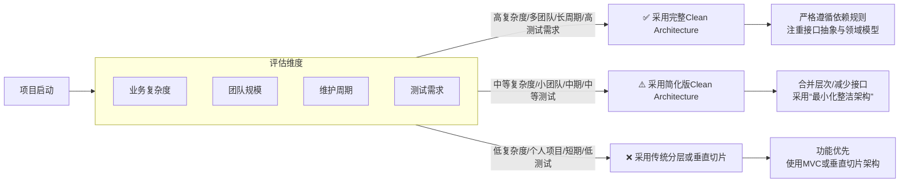
#### 1. 项目规模与复杂度较低
*   **特征**：功能简单（如纯CRUD应用）、领域模型扁平、业务规则少。
*   **简化策略**：
    *   **合并层次**：不必严格区分`Entities`、`Use Cases`和`Interface Adapters`。可以将用例逻辑直接放入领域服务或控制器中。
    *   **减少抽象**：对于简单的数据访问，可以直接使用ORM的Repository，无需再定义一层接口。例如，在.NET中可以直接依赖`DbContext`，而非定义`IRepository`接口。
    *   **采用“最小化整洁架构”**：借鉴其思想，但实施更轻量。例如，仅保留一个核心的`Application`项目，包含所有业务逻辑，并依赖一个`Infrastructure`项目用于数据访问和外部服务调用。
#### 2. 团队规模小或个人项目
*   **特征**：开发者少，甚至单人全栈开发。
*   **简化策略**：
    *   **垂直切片架构** 是一个绝佳的替代方案。它按**业务功能**而非技术层切分代码（如`/Features/Products/CreateProduct.cs`包含该功能的所有逻辑），极大减少了文件跳转和认知负荷，开发效率更高。
    *   **功能优先**：在项目初期，优先用最简单的方式实现功能。可以先用传统的三层架构（Controller-Service-Repository），待代码出现明显的“坏味道”（如业务逻辑散落、测试困难）时，再逐步向Clean Architecture演进。
#### 3. 开发周期极短或原型验证
*   **特征**：需要快速验证想法，时间以天或周计。
*   **简化策略**：
    *   **彻底放弃分层**：甚至可以考虑将所有代码写在一个项目里，使用脚本或简单的函数式编程风格。**核心是快速交付价值，验证业务模式**。
    *   **“重构”而非“预设”**：Bob大叔也强调，架构是演进出来的，不是一开始就设计完美的。先写简单的代码，如果证明有价值，再通过重构引入Clean Architecture的边界。
#### 4. 对可测试性要求不高
*   **特征**：项目以手工测试为主，或非核心业务系统。
*   **简化策略**：
    *   **弱化依赖倒置**：不必为所有外部依赖定义接口。可以直接在业务逻辑中实例化使用，或使用静态类。但需注意，这会降低代码的灵活性和可维护性。
### 📊 三、决策流程图：如何做出选择
你可以通过以下流程图来快速判断：
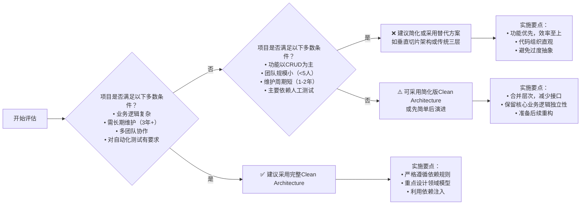
### 🔧 四、简化实施的核心原则
即使决定简化，也应保留Clean Architecture的**精神内核**，避免代码重新陷入混乱：
1.  **依赖方向不可破**：无论怎么分层，**源代码依赖关系必须指向内层**（业务逻辑核心）。这是最不可妥协的原则。
2.  **业务逻辑与技术细节分离**：即使将用例写在控制器里，也要确保它不直接依赖`DbContext`或`HttpClient`，而是通过构造函数注入一个抽象的接口。**“业务逻辑不依赖框架”** 是Clean Architecture的精髓。
3.  **通过接口隔离外部依赖**：对于数据库、第三方API等，定义一个简单的接口。这不仅是解耦，更是为了**可测试性**（可以Mock接口进行单元测试）。
4.  **领域模型保持纯净**：`Entity`或`Domain Model`类应只包含业务属性和行为，不沾染任何技术注解（如`@Entity`、`@Table`）。这保证了业务逻辑的稳定性和可复用性。
### 💎 总结
总而言之，判断是否采用Clean Architecture，关键是看**项目的复杂度和长期维护价值是否足以支撑其引入的成本**。
*   **适合采用**：中大型企业应用、复杂业务系统、多团队协作、长期演进项目。
*   **考虑简化**：中小型项目、CRUD应用、短期项目、个人或小团队项目。
*   **简化方法**：合并层次、减少不必要的抽象、采用垂直切片架构、先简单后演进。
> 🚨 **最重要的提醒**：**架构决策不是非黑即白**。很多成功的项目采用了“**整洁单体**”或“**最小化整洁架构**”。它们借鉴了Clean Architecture的分层思想和依赖规则，但根据自身情况进行了裁剪。**最好的架构是适合你团队、项目阶段和业务需求的架构**，而不是教科书上最完美的架构。
希望这个分析框架能帮助你做出更明智的决策。如果你能分享具体项目的背景（如业务领域、团队规模、技术栈），我可以给出更具体的建议。

## 2. MVVM/MVI/MVP 在Android中的实践差异，你更偏好哪个，为什么
在Android开发中，MVC、MVP、MVVM和MVI这几种架构模式各有其特点和适用场景。它们的核心目标都是**分离关注点**，让代码更清晰、可维护、易测试。我会先用一个表格快速对比它们的核心差异，然后详细说明我的偏好及原因。
### 🆚 四种架构模式核心对比
| 特性维度 | MVC | MVP | MVVM | MVI |
| :--- | :--- | :--- | :--- | :--- |
| **核心思想** | 经典分层，View与Model可直接通信 | **Presenter**作为中介，隔离View与Model | **数据驱动**，ViewModel不持有View引用 | **单向数据流**，状态统一管理 |
| **数据流向** | 双向（View ↔ Controller ↔ Model） | 单向（View → Presenter → Model → View） | 双向绑定（View ↔ ViewModel ↔ Model） | **严格单向**（View → Intent → ViewModel → State → View） |
| **状态管理** | 分散，易混乱 | Presenter中集中，但接口多 | 分散在多个LiveData/StateFlow中 | **集中**于唯一不可变**ViewState** |
| **可测试性** | ⭐⭐ | ⭐⭐⭐⭐ | ⭐⭐⭐⭐ | ⭐⭐⭐⭐⭐ |
| **样板代码** | 少 | 多（接口定义） | 较少（依赖DataBinding/LiveData） | 中等（需定义State/Intent） |
| **主要适用场景** | 超简单原型 | 需要强测试的中型项目 | **绝大多数通用应用** | **高交互、复杂状态**的应用 |
| **演进关系** | 基础 | 解决MVC的View/Controller耦合 | 解决MVP的接口爆炸与生命周期问题 | MVVM的增强，解决状态不一致问题 |

### 🧭 我的偏好与原因
综合来看，我更倾向于在**现代Android项目中优先选择MVVM**，并在**特定复杂场景下采用MVI**。我的偏好基于以下考量：
1.  **MVVM是Google官方推荐且与Jetpack组件深度集成**：`ViewModel`、`LiveData`/`StateFlow`、`DataBinding`等组件天然为MVVM设计，生命周期管理成熟，社区支持和文档丰富，是当前Android开发的**事实标准**。对于绝大多数业务页面，MVVM能提供良好的开发效率和可维护性。
2.  **MVVM的“数据驱动”模式更符合现代UI开发趋势**：尤其在搭配**Jetpack Compose**时，`ViewModel`暴露的`StateFlow`或`LiveData`与`@Composable`函数结合非常自然，UI是一个**状态函数**，简化了UI更新的逻辑。
3.  **MVI在复杂状态管理上的优势突出**：对于状态复杂、交互频繁的页面（如电商详情页、实时聊天、金融行情），MVI的**单向数据流**和**唯一可信数据源**能极大提升状态的可预测性和调试效率。它强制开发者将所有状态变化收敛到一条路径，避免了MVVM中多数据源可能导致的“状态同步”和“循环更新”问题。虽然MVI的样板代码略多，但带来的收益是值得的。
4.  **实践中的权衡与混合**：在实际项目中，**不必强制统一**。可以：
    *   **简单页面（如设置页、列表页）**：使用**MVVM**，开发效率高。
    *   **核心复杂页面（如商品详情、实时交易）**：采用**MVI**，确保状态强一致性。
    *   **渐进式迁移**：现有MVVM项目可逐步将复杂模块重构为MVI，两者可以共存。
### 📊 架构选择决策图
你可以通过以下流程来快速判断哪种架构更适合你的特定场景：
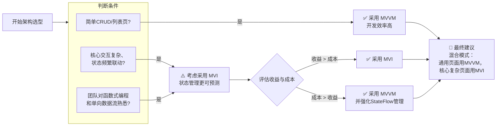
### ⚠️ 实践中的关键考量
无论选择哪种架构，以下几点至关重要：
*   **避免过度设计**：**最简单的架构能解决当前问题，就不要用更复杂的**。对于一个只有几个字段的表单页，MVC或简单的MVVM足矣，引入MVI是“杀鸡用牛刀”。
*   **统一项目内的架构模式**：在一个项目中，**尽量统一**使用一种或少数几种模式，避免在一个项目里混用MVC、MVP、MVVM、MVI，这会让团队认知成本急剧上升。
*   **关注核心原则**：无论哪种模式，最终都是为了**分离关注点**和**管理状态**。确保业务逻辑清晰、UI与逻辑解耦、状态变化可追踪，比死板套用模式更重要。
### 💎 总结
总而言之，**MVVM是Android开发的安全选择和现代起点**，它平衡了开发效率、可维护性和官方支持。**MVI则是解决复杂状态管理问题的利器**，在特定高交互场景下能显著提升代码的可预测性和调试体验。
我的建议是：**以MVVM为基础架构**，当你遇到一个页面状态极其复杂、交互极其频繁，且MVVM的状态管理开始让你感到“力不从心”时，**果断地为这个模块引入MVI模式**。这种**混合模式**既能保证整体开发效率，又能确保核心模块的稳定性，是实践中的智慧选择。

## 3. 一个App从单体架构演进到模块化/组件化，你的拆分策略是什么

### 🧭 一、核心策略：分层解耦与组件独立
组件化并非一蹴而就的简单拆分，其核心在于**建立清晰的分层架构**和**实现组件间的彻底解耦**。我推荐的策略是：**“分层拆分、独立运行、接口通信、二进制交付”**。
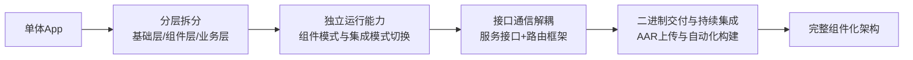
#### 1. 分层拆分：建立清晰的架构边界
首先，根据**功能边界**而非简单的业务边界进行拆分，确保每个组件**高内聚、低耦合**。通常划分为以下三层：

| 层级 | 职责 | 示例 | 依赖方向 |
| :--- | :--- | :--- | :--- |
| **基础组件层** | 提供与业务无关的通用能力。 | 网络请求、图片加载、数据存储、工具类、基础UI控件。 | **只能被依赖**，不依赖其他业务层。 |
| **业务组件层** | 按业务功能拆分的核心模块，是业务逻辑的载体。 | 登录组件、个人中心组件、直播核心组件、商品详情组件。 | 依赖**基础组件层**，可通过接口/路由与其他业务组件交互。 |
| **业务层** | 面向用户的具体业务场景，由多个业务组件组装而成。 | 首页、视频页、购物车页等。 | 依赖**业务组件层**和**基础组件层**。 |
> 💡 **拆分原则**：拆分时需遵循“**最小作用域**”原则，即资源文件和类应尽量放在最上层业务模块中，避免下层公共库膨胀。同时，为避免资源冲突，需在`build.gradle`中为每个模块设置`resourcePrefix`。
#### 2. 独立运行：实现组件模式与集成模式切换
这是组件化最显著的优势，允许每个业务组件**作为独立App运行调试**，极大提升开发效率。其核心是通过Gradle配置动态切换：
```groovy
// 在模块的 build.gradle 文件中
if (isModule.toBoolean()) { // isModule 在 gradle.properties 中定义
    apply plugin: 'com.android.application' // 作为独立App运行
} else {
    apply plugin: 'com.android.library' // 作为库被主App依赖
}
```
同时，需要为组件模式配置独立的`AndroidManifest.xml`（声明Application和启动Activity）和源集路径。这样，开发某个模块时，无需编译整个工程，速度提升显著。
#### 3. 接口通信：彻底解耦组件间依赖
**禁止业务组件之间直接依赖**是组件化的铁律。所有跨组件调用必须通过以下两种方式解耦：
*   **UI跳转 - 使用路由框架（如ARouter）**：
    通过**路径字符串**进行跳转，无需引用目标Activity类。ARouter会在编译期通过APT生成路由表，运行时通过路径找到目标类，性能优异。
    ```java
    // 在目标Activity上声明路由
    @Route(path = "/login/LoginActivity")
    public class LoginActivity extends AppCompatActivity { ... }
    // 在任何地方发起跳转
    ARouter.getInstance().build("/login/LoginActivity")
           .withString("username", "user")
           .navigation();
    ```
*   **业务逻辑调用 - 使用服务接口**：
    1.  在**公共接口模块**（如`base-service`）中定义服务接口：
        ```java
        // base-service 模块
        public interface ILoginService {
            boolean isLoggedIn();
            void logout();
        }
        ```
    2.  在**业务组件**（如`login`）中实现该接口，并通过**依赖注入**或**路由**的方式提供给其他组件使用。
        ```java
        // login 模块
        @Route(path = "/service/login") // 可通过路由暴露服务
        public class LoginServiceImpl implements ILoginService {
            @Override
            public boolean isLoggedIn() { ... }
            @Override
            public void logout() { ... }
        }
        ```
    3.  其他组件（如`home`）只需依赖`base-service`接口模块，并通过工厂或路由获取实现，无需知道`LoginServiceImpl`的存在。
#### 4. 二进制交付：组件的最终形态
成熟的组件化项目，业务组件最终会编译成**AAR文件**并上传至Maven私服。主App的`build.gradle`只需声明坐标依赖：
```groovy
implementation 'com.yourcompany:component-login:1.0.0'
```
这彻底隔离了源码，简化了依赖管理，并为**插件化热修复**奠定了基础。
### 🛠️ 二、实战演进路径：从单体到组件化
将一个庞大的单体项目演进为组件化架构，无法一蹴而就。建议遵循以下“**三步走**”策略：
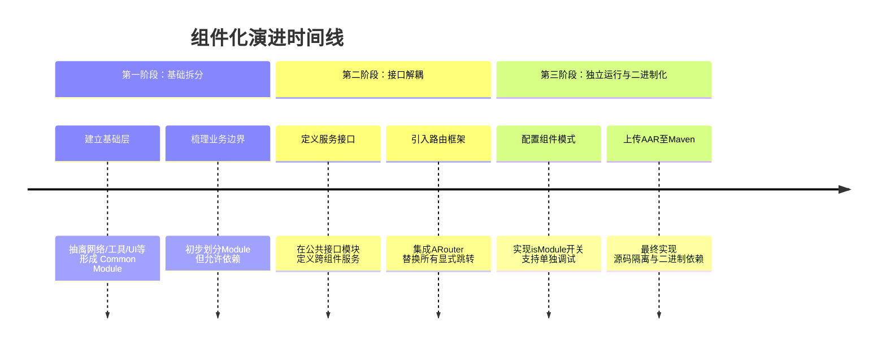
1.  **第一阶段：基础拆分（物理隔离）**
    *   **目标**：按层拆分，先建立基础库。
    *   **操作**：将网络请求、图片加载、通用工具类、BaseActivity等抽离到`common`或`base`模块。业务模块暂时仍可依赖`common`，也允许相互依赖，但已迈出第一步。
2.  **第二阶段：接口解耦（逻辑隔离）**
    *   **目标**：消除业务组件间的直接依赖。
    *   **操作**：
        *   引入ARouter，**全面替换**项目中的显式Intent跳转为路由跳转。
        *   定义**公共接口服务模块**（如`service`），逐步将业务组件间的直接调用改为接口调用。
        *   此阶段可能需要大量重构，是工作量最大的一步，但至关重要。
3.  **第三阶段：独立运行与二进制化（完全组件化）**
    *   **目标**：实现组件独立调试和最终二进制交付。
    *   **操作**：
        *   为每个业务组件配置`isModule`开关，实现组件模式与集成模式切换。
        *   配置CI/CD流程，将每个业务组件编译为AAR并上传至Maven仓库。
        *   主App通过Maven坐标依赖各组件AAR。
### ⚠️ 三、常见陷阱与规避策略
| 陷阱 | 规避策略 |
| :--- | :--- |
| **组件拆分粒度过细或过粗** | **原则：单一职责、高内聚低耦合**。以业务功能为边界，一个组件应能独立完成一个明确的业务功能（如“登录”）。 |
| **基础组件层臃肿** | 严格遵循“**最小作用域**”原则。只将真正被多个模块共享的基础能力下沉，业务相关的内容留在业务组件内。 |
| **资源命名冲突** | 为每个模块设置`resourcePrefix`（如`login_`），并在代码中严格遵守。使用脚本检查重复资源。 |
| **依赖版本冲突** | 在根目录的`build.gradle`或使用`config.gradle`**统一管理所有第三方库的版本号**，确保全局一致。 |
| **过度设计，增加复杂度** | **渐进式演进**。从最臃肿、改动最频繁的模块开始拆分，不必强求一步到位。初期可保留部分依赖，逐步解耦。 |
| **忽视独立调试的配置** | 务必为组件模式配置好独立的`AndroidManifest`、`Application`和入口Activity，否则无法真正独立运行。 |
### 📦 四、工具与框架支撑
*   **路由框架**：**ARouter** 是Android组件化的事实标准，功能强大、社区活跃。它负责处理UI跳转、服务调用、参数传递、拦截器等。
*   **依赖注入**：可考虑使用**Hilt**或**Koin**来管理服务接口的依赖注入，进一步解耦。
*   **构建工具**：熟练使用**Gradle**的`sourceSets`、`buildTypes`、`productFlavors`来灵活配置构建变体。
*   **持续集成**：配置**Jenkins**或**GitLab CI**，实现组件AAR的自动构建和上传。
### 💎 总结与建议
将单体App演进到组件化，是一个**渐进式重构**的过程，其核心策略可以概括为：
1.  **分层拆分**：建立基础组件层、业务组件层、业务层的三层架构。
2.  **独立运行**：通过Gradle配置实现组件模式与集成模式的动态切换。
3.  **接口通信**：使用ARouter路由框架进行UI跳转，通过公共接口服务模块进行业务逻辑调用，**彻底禁止业务组件间的直接依赖**。
4.  **二进制交付**：最终将组件编译为AAR上传Maven，实现源码隔离。
**建议**：**先从最独立、最核心的业务模块（如登录）开始试点**，验证整套流程和规范，再逐步推广到其他模块。同时，务必**统一团队的编码规范和依赖管理**，这是组件化成功的基础。
组件化不是银弹，但它能有效解决大型项目的协作和维护难题。希望这套策略能为你提供清晰的路线图。如果你在具体实践（如ARouter配置、Gradle脚本编写）中遇到问题，我很乐意提供更详细的帮助。


## 4. 你如何设计一个可扩展的埋点系统，业务埋点和用户行为埋点的设计差异
你正在思考如何设计一个既能支撑当下需求、又能适应未来变化且对业务侵入性低的埋点系统，这是一个非常核心的架构问题。下面我将结合实践经验和主流技术方案，为你梳理一套可扩展的埋点系统设计思路，并重点分析**业务埋点**与**用户行为埋点**的关键差异。
### 🎯 一、可扩展埋点系统核心设计原则
一个可扩展的埋点系统，其核心在于**分层抽象**和**机制与策略分离**。它应当让业务开发者尽量无需感知埋点逻辑，同时又能灵活地支持复杂的业务场景。

#### 1. 分层架构设计
埋点系统应分层设计，各层职责单一，便于独立扩展和替换。

| 层级 | 核心职责 | 关键技术/方案 | 扩展性考虑 |
| :--- | :--- | :--- | :--- |
| **采集层** | **捕获事件**，生成原始事件数据。 | AOP字节码插桩（ASM/AspectJ）、代理模式、AccessibilityService、Lifecycle回调 | 通过**注解**或**配置文件**定义采集规则，实现动态插桩，无需修改业务代码即可新增埋点。 |
| **处理层** | 对原始事件进行**清洗、富化、格式化**。 | 数据校验、字段映射、公共属性注入（如用户ID、设备信息）、会话管理 | 提供**事件处理管道**，支持插件化处理器，可灵活添加新的处理逻辑（如数据脱敏）。 |
| **传输层** | 将处理后的数据**可靠地发送到服务端**。 | 批量打包、数据压缩、网络状态感知、失败重试、流量控制 | 支持**多通道上报**（如HTTP、TCP、文件），并可根据网络状况和电量策略动态切换。 |
| **存储层** | 在本地**持久化缓存**事件数据，保障数据不丢失。 | SQLite、MMKV、文件队列 | 采用**可插拔存储策略**，根据数据重要性和设备性能选择存储方式，支持数据过期清理。 |
#### 2. 核心机制：面向接口编程与依赖注入
这是实现“可扩展”的基石。埋点系统不应与具体的业务逻辑或第三方SDK耦合。
```java
// 1. 定义事件采集接口
public interface EventCollector {
    void track(Event event);
    void trackPageView(String pageName, Bundle params);
    void trackClick(String viewPath, Bundle params);
    // ... 其他事件类型
}
// 2. 定义数据上报接口
public interface EventReporter {
    void report(List<Event> events);
    void flush();
}
// 3. 定义存储接口
public interface EventStorage {
    void save(Event event);
    List<Event> load(int batchSize);
    void clear();
}
// 4. 依赖注入，组装系统
public class TrackingSystem {
    private EventCollector collector;
    private EventStorage storage;
    private EventReporter reporter;
    
    public TrackingSystem(EventCollector collector, EventStorage storage, EventReporter reporter) {
        this.collector = collector;
        this.storage = storage;
        this.reporter = reporter;
        // 初始化时启动后台消费循环
        startConsumerLoop();
    }
    
    private void startConsumerLoop() {
        // 定期从storage取数据，通过reporter上报
    }
}
```
这样，你可以**轻松替换**任何一层实现，例如：
*   将`EventReporter`从`HttpReporter`替换为`TcpReporter`或`FileReporter`。
*   将`EventStorage`从`SQLiteStorage`替换为`MmkvStorage`。
*   在`EventCollector`中动态添加新的采集规则，无需修改核心逻辑。
#### 3. 数据模型设计：统一事件结构
所有埋点事件都应遵循统一的数据模型，这是数据可分析、可治理的基础。
```json
{
  "event_id": "purchase_click",          // 事件唯一标识
  "event_name": "点击购买按钮",           // 事件名称，用于展示
  "event_type": "click",                 // 事件类型：click, page_view, exposure, custom...
  "timestamp": 1719264000000,            // 事件发生时间戳（毫秒）
  "user_id": "u123456",                  // 用户ID
  "device_id": "abcdef123456",           // 设备ID
  "session_id": "s_987654321",           // 会话ID
  "page_name": "product_detail",         // 当前页面名
  "view_path": "/ LinearLayout/ RecyclerView/ Button", // 控件路径（用于无埋点）
  "params": {                            // 事件自定义参数
    "product_id": "p_001",
    "product_name": "蓝牙耳机",
    "price": 299.00,
    "source": "search_result"
  },
  "app_info": {                          // 应用公共属性
    "version": "1.2.0",
    "channel": "xiaomi"
  },
  "device_info": {                       // 设备公共属性
    "os": "Android 13",
    "model": "MI 13",
    "screen_width": 1080
  }
}
```
通过**抽象的Event类**和**Builder模式**，可以灵活构建各种复杂事件，同时保证公共字段的一致性。
#### 4. 配置化与动态化
为了最大化灵活性，埋点系统应支持**配置化**甚至**动态化**。
*   **本地配置**：在`assets`或`raw`目录下放置`tracking_config.json`文件，定义需要全局采集的页面、控件路径及其事件名。
    ```json
    // tracking_config.json
    {
      "auto_track_pages": [
        {"path": "/home", "event_name": "home_view"},
        {"path": "/search", "event_name": "search_view"}
      ],
      "auto_track_clicks": [
        {"view_id": "btn_buy", "event_name": "buy_click"},
        {"view_text": "立即购买", "event_name": "buy_click"}
      ]
    }
    ```
*   **远程配置**：定期从服务器拉取配置规则，实现**无需发版**即可新增或修改埋点。这对于运营活动或快速迭代场景至关重要。
### 🔍 二、业务埋点 vs. 用户行为埋点：设计差异
这是埋点系统设计的核心分水岭。它们的目标、采集策略、数据模型和实现方式都有显著不同。
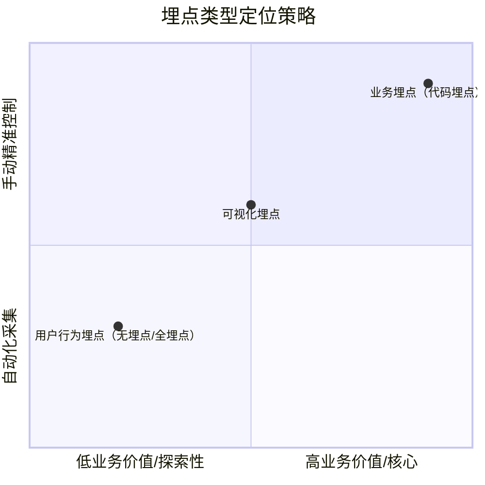
#### 1. 核心目标与设计哲学
| 维度 | 用户行为埋点 (Behavioral Tracking) | 业务埋点 (Business/Custom Tracking) |
| :--- | :--- | :--- |
| **核心目标** | **“用户做了什么？”** 复现用户行为路径，进行宏观的流程分析、漏斗分析、留存分析。 | **“业务结果如何？”** 精准记录业务关键节点和状态，用于计算核心业务指标（GMV、转化率、成功率）、业务监控和告警。 |
| **设计哲学** | **广覆盖、低精度**。追求**尽可能全**地采集用户交互，容忍一定冗余，侧重**行为模式**分析。 | **精准控、高精度**。追求**按需采集**，确保数据100%准确，与业务状态强一致，侧重**业务结果**分析。 |
| **典型事件** | `page_view`（页面浏览）、`click`（点击）、`exposure`（曝光）、`scroll`（滑动） | `order_create`（创建订单）、`pay_success`（支付成功）、`login_success`（登录成功）、`api_call`（接口调用） |
| **数据使用者** | 产品经理、数据分析师、用户体验设计师 | 业务运营、数据分析师、开发工程师、风控系统 |
#### 2. 采集策略与技术实现
| 方面 | 用户行为埋点 | 业务埋点 |
| :--- | :--- | :--- |
| **主要采集方式** | **无埋点** 或 **可视化埋点** | **代码埋点** |
| **技术实现** | AOP字节码插桩、代理`View.OnClickListener`、`AccessibilityService` | 在业务逻辑关键节点**显式调用**埋点API |
| **侵入性** | **极低**。业务代码几乎无感知。 | **高**。埋点代码直接耦合在业务逻辑中。 |
| **灵活性** | **低**。采集的数据维度有限（主要是控件ID、路径、文本），难以获取复杂业务上下文。 | **极高**。可携带任意复杂的业务参数，完全可控。 |
| **开发成本** | **低**。一次集成，全局生效。 | **高**。每个埋点需开发、测试、维护，成本高。 |
| **适用场景** | 产品初期探索、通用交互分析、快速上线临时活动页、用户路径回溯。 | 核心业务流程、关键转化节点、需要精确业务参数的场景、业务监控。 |
> 💡 **实践建议**：**两者结合**。核心业务路径用**代码埋点**确保精度，通用交互和页面浏览用**无埋点**覆盖广度，是成熟团队的常见做法。
#### 3. 数据模型与参数设计
这是两者最本质的差异。
*   **用户行为埋点**：参数**简单、通用、预定义**。通常只包含：
    *   事件类型（`click`, `view`）
    *   控件路径或ID（`view_path`, `view_id`）
    *   控件文本或描述（`view_text`）
    *   页面名（`page_name`）
    *   时间戳（`timestamp`）
    *   **很难**携带业务上下文（如商品ID、订单金额）。
*   **业务埋点**：参数**复杂、定制、业务相关**。除了公共字段，**必须**包含：
    *   业务主键（如`order_id`, `product_id`, `user_id`）
    *   业务状态码（如`status`, `error_code`）
    *   业务数值（如`amount`, `quantity`, `duration`）
    *   业务来源（如`source`, `channel`）
    *   **可以**包含任意JSON格式的扩展字段。
```java
// 业务埋点示例：支付成功
Map<String, Object> params = new HashMap<>();
params.put("order_id", "20240625000123");
params.put("amount", 299.00);
params.put("payment_method", "alipay");
params.put("coupon_id", "C12345");
params.put("products", Arrays.asList("p001", "p002")); // 商品列表
TrackingSystem.getInstance().track("pay_success", params);
```
#### 4. 上报策略与可靠性要求
| 策略 | 用户行为埋点 | 业务埋点 |
| :--- | :--- | :--- |
| **上报时机** | **批量上报**。优先聚合，减少网络请求，容忍一定延迟。 | **实时或准实时上报**。尤其对于关键业务事件（如支付），需优先保障。 |
| **数据可靠性** | **中**。可容忍少量数据丢失（如崩溃时），侧重整体趋势。 | **极高**。**绝不能丢失**。必须有本地持久化、失败重试、数据校验机制。 |
| **数据量** | **大**。所有用户操作都会产生数据。 | **小**。仅关键业务节点产生。 |
| **网络要求** | **低**。弱网下可缓存，网络恢复后补传。 | **高**。关键事件需即时上报，必要时提供**同步上报**接口。 |
#### 5. 治理与维护
*   **用户行为埋点**：治理重点在于**事件命名规范**、**控件路径稳定性**（避免UI重构导致路径变化）、**数据采样策略**（应对海量数据）。
*   **业务埋点**：治理重点在于**事件文档管理**（每个事件含义、参数、触发时机）、**埋点代码Review**（确保与业务逻辑一致）、**数据质量校验**（上线后必做数据校验）、**版本兼容性**（参数变更需考虑历史数据）。
### 🛠️ 三、推荐技术选型与实现路径
基于以上分析，以下是构建可扩展埋点系统的推荐技术栈和演进路径。
#### 1. 技术选型
| 模块 | 推荐方案 | 理由 |
| :--- | :--- | :--- |
| **采集框架** | **ASM字节码插桩** | 编译期注入，无运行时性能损耗，稳定性高，覆盖全项目（含第三方库）。 |
| **AOP框架** | **AspectJ** 或 **Hugo** | 基于ASM，提供更友好的注解式API，适合处理简单埋点，学习曲线较平缓。 |
| **事件总线** | **LiveData** 或 **StateFlow** | 响应式数据流，便于在架构各层间传递事件，与Jetpack组件契合。 |
| **本地存储** | **MMKV** 或 **SQLite** | MMKV高性能，适合频繁读写；SQLite适合复杂查询和大量数据缓存。 |
| **数据上报** | **OkHttp** + **WorkManager** | OkHttp负责网络传输，WorkManager负责调度后台任务，保障可靠上报。 |
| **配置管理** | **远程配置** | 实现动态埋点，无需发版即可调整采集策略。 |
#### 2. 演进路径
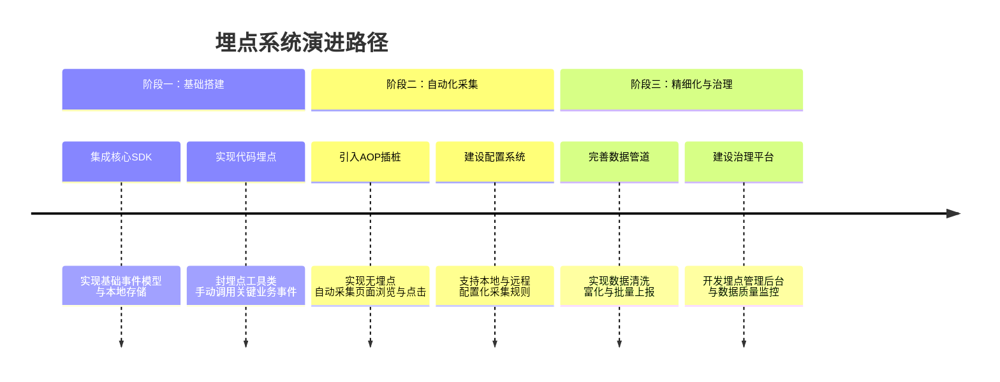
### ⚠️ 四、常见陷阱与规避策略
1.  **过度采集**：无埋点会产生海量冗余数据。**规避**：严格定义采集规则，只采集有分析价值的页面和控件，设置合理的数据采样率。
2.  **控件路径不稳定**：UI微小改动导致无埋点失效。**规避**：为关键控件设置**稳定的资源ID**（`android:id`）或**Tag**，采集时优先使用这些标识。
3.  **业务参数错误**：代码埋点参数传递错误或遗漏。**规避**：建立**埋点需求文档**模板，开发前对齐；上线后**必做数据校验**。
4.  **性能瓶颈**：频繁的磁盘I/O和网络请求影响App性能。**规避**：所有埋点操作**异步化**，使用**批量上报**和**压缩**，在主线程仅做轻量采集。
5.  **隐私合规风险**：采集了敏感用户数据。**规避**：严格遵守**GDPR**、**个保法**，实现**数据脱敏**、**匿名化**，提供**用户授权管理**界面。
### 📊 五、总结：可扩展埋点系统设计蓝图
一个设计良好的埋点系统，其核心在于**清晰的分层**和**机制与策略的分离**。
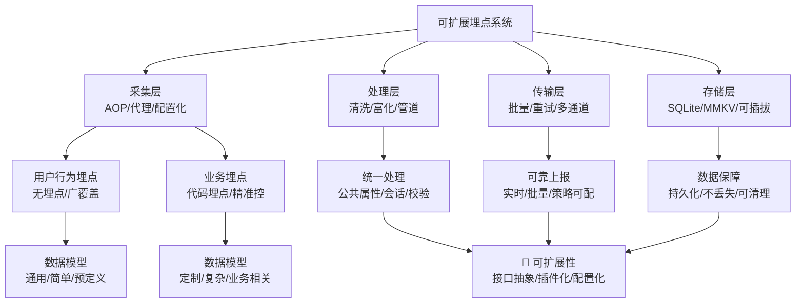
最终，你的系统应该能够：
*   通过**配置文件**或**注解**动态调整采集策略，无需修改核心代码。
*   通过**依赖注入**和**接口抽象**，轻松替换任何一层组件（如更换存储引擎或上报协议）。
*   同时支持**无埋点**和**代码埋点**，并能将它们的数据**统一处理**。
*   提供**数据质量保障机制**，确保业务埋点的数据准确无误。
希望这份详尽的梳理能为你设计埋点系统提供清晰的思路和可行的方案。如果你在具体技术选型或实现细节上有进一步疑问，我很乐意继续探讨。

## 5. 如何设计一个APP的离线缓存策略，什么时候该用缓存，什么时候必须实时请求
设计一个APP的离线缓存策略，关键在于**平衡数据的新鲜度、用户体验和设备资源**。下面我将结合实践为你梳理一套决策框架和实现方案。
### 🧭 一、核心决策：何时用缓存，何时实时请求？
这个决策没有标准答案，但可以根据数据的**更新频率、实时性要求、用户操作重要性**来划分。下图清晰地展示了不同数据类型的推荐策略：
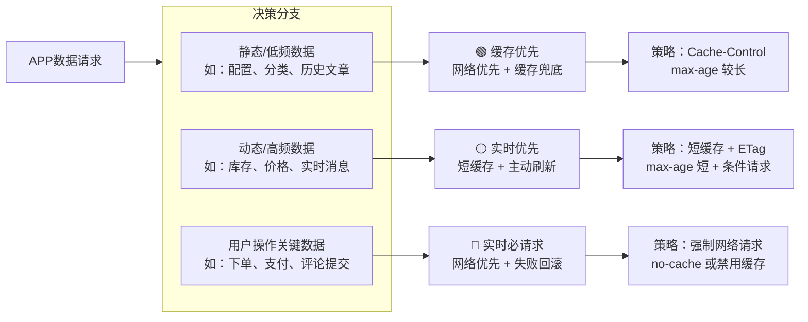
#### 1. 🟢 **适合缓存的数据**（缓存优先）
这类数据更新频率低，即使短暂展示旧数据，对用户体验影响也不大。目标是**减少网络请求，提升加载速度，节省流量**。

| 数据特征 | 典型例子 | 推荐策略 | 缓存时长建议 |
| :--- | :--- | :--- | :--- |
| **静态资源** | 图片、CSS/JS文件、图标、字体 | **长期缓存** + **版本验证** | 7-30天，配合 `ETag`/`Last-Modified` 验证 |
| **低频变更配置** | APP配置、首页分类、帮助文档 | **定期缓存** + **后台静默更新** | 24小时，启动时检查更新 |
| **历史/详情数据** | 已读文章、历史订单、收藏列表 | **本地持久化** + **下拉手动刷新** | 无限期，用户主动刷新或数据变更通知 |
| **用户生成内容(UGC)** | 草稿、笔记、已发布的动态 | **本地优先** + **后台同步** | 无限期，操作先存本地，网络恢复后同步 |
> 💡 **实现要点**：利用OkHttp的`Cache-Control`请求头或拦截器实现。对于图片等大文件，使用`Glide`/`Picasso`等库的内置磁盘缓存。
#### 2. 🟡 **适合实时请求的数据**（网络优先）
这类数据更新频繁，用户需要最新信息。目标是**保证数据准确性，但用缓存作为兜底避免白屏**。

| 数据特征 | 典型例子 | 推荐策略 | 缓存时长建议 |
| :--- | :--- | :--- | :--- |
| **库存/价格** | 商品库存、机票价格、票价 | **短缓存** + **条件请求** | 1-5分钟，使用 `ETag`/`If-Modified-Since` |
| **实时内容** | 新闻Feed、最新评论、股票行情 | **网络优先** + **缓存兜底** | 5-30分钟，失败时回退缓存并提示“数据更新于X分钟前” |
| **位置信息** | 附近店铺、实时位置 | **实时请求** | 0，不缓存，每次请求最新 |
| **消息列表** | 未读消息、通知 | **网络优先** + **本地最新** | 1-5分钟，但始终保留最新一页的本地副本 |
> 💡 **实现要点**：使用Retrofit + OkHttp的拦截器，在响应头添加`Cache-Control`。例如：
> ```kotlin
> // 网络拦截器：给响应头添加缓存策略
> .addNetworkInterceptor { chain ->
>     val response = chain.proceed(chain.request())
>     val cacheControl = CacheControl.Builder()
>         .maxAge(2, TimeUnit.MINUTES) // 缓存2分钟
>         .build()
>     response.newBuilder()
>         .header("Cache-Control", cacheControl.toString())
>         .build()
> }
> // 离线拦截器：无网络时强制使用缓存
> .addInterceptor { chain ->
>     var request = chain.request()
>     if (!isNetworkAvailable()) {
>         request = request.newBuilder()
>             .cacheControl(CacheControl.FORCE_CACHE)
>             .build()
>     }
>     chain.proceed(request)
> }
> ```
#### 3. 🔴 **必须实时请求的操作**（强制网络）
这些操作涉及**金钱交易、权限验证、即时通讯**等，**绝不能使用缓存**，必须确保与服务器实时交互。

| 数据特征 | 典型例子 | 推荐策略 | 原因 |
| :--- | :--- | :--- | :--- |
| **支付与交易** | 下单、支付、退款 | **强制网络** | 涉及资金安全，必须实时验证库存、价格、用户状态 |
| **认证与授权** | 登录、密码修改、敏感操作验证 | **强制网络** | 安全性要求高，必须实时校验 |
| **实时互动** | 聊天、直播弹幕、多人协作 | **强制网络** | 时效性要求极高，延迟不可接受 |
| **数据提交** | 发布评论、上传内容、修改资料 | **网络优先** + **失败回滚** | 确保数据一致性，失败时提示用户并保留输入 |
> ⚠️ **注意**：即使这类操作，在网络失败时也应**缓存用户输入**，待网络恢复后自动重试。这属于“离线提交”策略。
---
### 🏗️ 二、离线优先架构的核心设计
当决定缓存策略后，如何让APP在无网络时仍能流畅使用？核心是**离线优先架构**，其核心思想是：**本地数据库是单一真实数据源（SSOT），网络只负责更新它**。
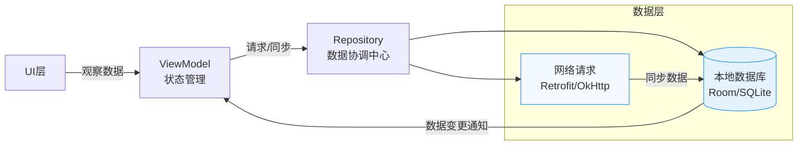
#### 1. 数据层设计：Repository模式
Repository是**数据协调中心**，统一管理本地和远程数据源，为上层提供统一接口。
-   **职责**：决定何时使用缓存、何时请求网络、如何合并数据、如何处理冲突。
-   **实现**：
    ```kotlin
    class UserRepository(
        private val userDao: UserDao, // 本地数据源
        private val userApi: UserApi   // 远程数据源
    ) {
        // 获取用户数据：网络优先，缓存兜底
        fun getUser(userId: String): Flow<User> = flow {
            // 1. 先尝试从网络获取最新数据
            try {
                val remoteUser = userApi.getUser(userId)
                // 2. 网络成功，保存到本地数据库
                userDao.insert(remoteUser)
                // 3. 发射最新数据
                emit(remoteUser)
            } catch (e: Exception) {
                // 4. 网络失败，从本地数据库读取
                val localUser = userDao.getUserById(userId)
                if (localUser != null) {
                    emit(localUser)
                } else {
                    throw e // 本地也没有，抛出异常
                }
            }
        }
        
        // 刷新用户数据：强制网络
        suspend fun refreshUser(userId: String) {
            val remoteUser = userApi.getUser(userId)
            userDao.insert(remoteUser)
        }
    }
    ```
#### 2. 同步机制：离线操作队列
对于**离线状态下的用户操作**（如点赞、评论、表单提交），需要设计同步队列。
-   **核心流程**：
    1.  **操作先存本地**：用户操作立即写入本地数据库，并标记为“待同步”状态。
    2.  **加入同步队列**：将操作封装成任务，加入待同步队列。
    3.  **网络恢复后同步**：监听网络状态，恢复后按顺序执行队列中的任务。
    4.  **处理冲突**：根据策略解决冲突（如：服务器优先、客户端优先、时间戳优先）。
-   **冲突解决策略**：
- 
    
    | 冲突类型 | 推荐策略 | 适用场景 |
    | :--- | :--- | :--- |
    | **同一字段修改** | **时间戳 + 版本号** | 用户资料修改、文档编辑 |
    | **资源竞争** | **乐观锁 + 重试** | 库存扣减、票务预订 |
    | **多设备同步** | **CRDT算法** 或 **业务规则合并** | 协作编辑、聊天记录 |
    | **数据格式变更** | **迁移脚本 + 兼容层** | APP版本升级 |
    
#### 3. 存储方案选型
根据数据类型选择合适的存储方式。

| 存储方案 | 适用数据 | 优势 | 劣势 |
| :--- | :--- | :--- | :--- |
| **Room (SQLite)** | 结构化数据<br>（用户、订单、列表） | 编译时SQL检查、类型安全、支持复杂查询 | 学习曲线略陡 |
| **DataStore/SharedPreferences** | 轻量级配置<br>（用户偏好、设置） | 简单易用、协程友好 | 不适合大数据、无法复杂查询 |
| **文件存储** | 非结构化数据<br>（图片、音频、缓存文件） | 灵活、适合大文件 | 管理复杂、需手动清理 |
| **OkHttp Cache** | HTTP响应缓存<br>（API返回的JSON） | 自动管理、遵循HTTP缓存标准 | 不适用于非HTTP数据 |

### ⚙️ 三、缓存策略的进阶优化
#### 1. 多级缓存策略
构建“内存-磁盘-网络”三级缓存，最大化性能。
-   **L1 内存缓存** (`LruCache`)：存储高频访问数据（如用户头像、首页配置），访问速度最快，但易被回收。
-   **L2 磁盘缓存** (Room/OkHttp Cache)：持久化存储，应用重启后数据不丢失。
-   **L3 网络**：最终数据源。
#### 2. 智能预加载与后台刷新
-   **预加载**：在Wi-Fi环境下，预测用户行为，提前缓存可能访问的内容。
    ```kotlin
    // 在应用空闲时预加载首页数据
    WorkManager.getInstance(context)
        .enqueue(OneTimeWorkRequestBuilder<PreloadWorker>().build())
    ```
-   **后台刷新**：使用`WorkManager`定期在后台刷新关键数据，但需注意电量消耗。
#### 3. 缓存失效与更新策略
-   **TTL (Time To Live)**：设置缓存过期时间，超时后下次请求强制刷新。
-   **ETag/Last-Modified**：条件请求，仅当数据变更时下载新数据，节省流量。
-   **版本号/时间戳**：客户端记录最后同步时间，请求时携带，服务端返回增量数据。
-   **主动失效**：在特定业务操作后（如发布内容、修改设置），主动清除相关缓存。
#### 4. 用户体验设计
-   **状态指示**：在UI上清晰展示网络状态和数据来源（如“数据更新于5分钟前”、“离线模式”）。
-   **加载反馈**：提供骨架屏、下拉刷新等交互，缓解等待焦虑。
-   **错误处理**：网络失败时，优雅降级展示缓存数据，并提供重试按钮。
---
### 📊 四、总结：决策流程与最佳实践
设计缓存策略时，可以遵循以下决策流程：
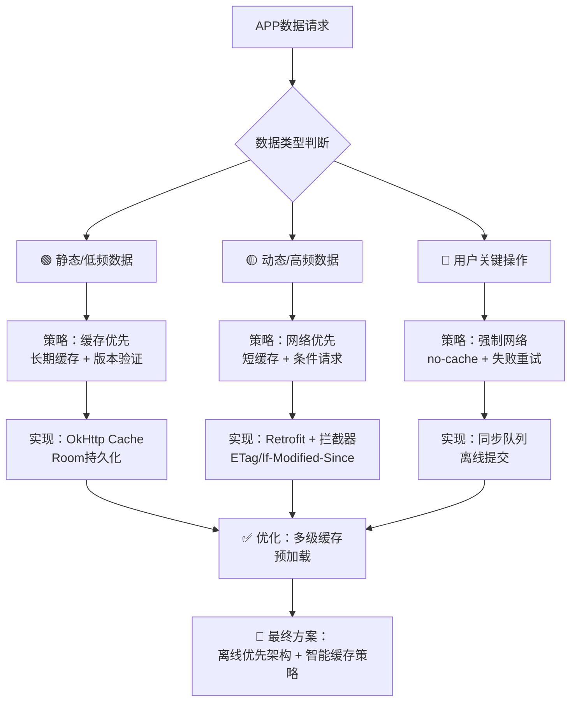
> 💡 **最佳实践总结**：
> 1.  **离线优先**：让本地数据库成为单一数据源，UI只观察本地数据，网络在后台同步。
> 2.  **按需缓存**：不是所有数据都需要缓存，根据更新频率和重要性分级处理。
> 3.  **智能同步**：设计离线操作队列，自动重试和冲突解决机制，确保数据一致性。
> 4.  **透明体验**：清晰向用户传达数据状态，让用户对离线模式有预期。
> 5.  **持续优化**：监控缓存命中率，根据实际使用情况调整缓存策略。
通过以上策略，你可以为APP设计出既能保证关键数据实时性，又能在弱网/无网环境下提供流畅用户体验的缓存系统。记住，**没有一招通吃的方案**，关键是根据你的业务场景和数据特性进行权衡和选择。

## 6. 技术选型的核心评估维度有哪些(团队能力/社区活跃度/长期维护成本/业务匹配度)
首先技术选型肯定是要为我们的业务和团队服务的，我们要先考虑该技术引入后，长期和短期的效益及成本；从短期来说：该技术引入我们需要哪些成本，金钱上和时效，新的技术团队肯定是要学习才能掌握的，我们的团队是否有足够的时间来掌握这项能力，另外该技术架构是否有充足的文档或技术支持，能解决我们当前项目的什么问题，长远来看，是否值得投入。
## 7. 如何平衡短期交付压力和长期代码质量，有没有具体的案例
平衡短期交付与长期质量，关键在于**系统性的策略和工程实践**，而非简单取舍。核心思路是：**让质量成为速度的加速器，而非阻碍**。
### 📊 核心策略与案例概览
| 策略维度 | 核心做法 | 典型案例 | 效果与收益 |
| :--- | :--- | :--- | :--- |
| **需求管理** | 精准拆解，优先核心功能（MVP），非核心功能标记为“延期选项”。 | 教育APP“优化学习路径”需求被拆解为基础、增强、可选三层，按时交付核心并争取完善期。 | 避免返工，资源集中，保证关键路径质量。 |
| **流程工程化** | 将技术债治理融入敏捷流程：**预留固定比例时间**（如20%）偿债、**建立技术债看板**可视化、**设置质量门禁**（静态扫描、覆盖率阈值）。 | XcodesApp开源项目采用“20%规则”专时偿债，并通过TODO注释和静态分析管理债务。 | 债务可控，避免“雪球效应”，系统健康度可衡量。 |
| **自动化与左移** | **投资自动化测试**（单元/集成/E2E）和**持续集成**，将质量检查前置。 | 某团队坚持三轮测试（单元、集成、压力），发现支付计算漏洞，避免了百万损失。 | 缺陷早发现，修复成本降低（开发阶段修复成本是生产环境的1/30）。 |
| **文化与沟通** | 建立**“共同目标”**（交付有质量的产品），技术团队主动向业务方**量化技术债的长期成本**。 | 程序员用测试数据证明Bug严重性，产品经理放弃“上线后再改”，团队达成共识延迟3天上线。 | 打破部门壁垒，从“对立”走向“协同”，决策基于数据而非情绪。 |
### 🔧 关键实践细节
1.  **精准需求拆解（源头控制）**：
    *   采用 **“需求三问法”**：这个功能解决什么问题？不实现会怎样？有没有替代方案？
    *   制作 **“必做功能清单”**（MVP核心，不超过5项）和 **“延期选项标记”**（灰色标注可后续迭代内容）。
2.  **技术债的显性化管理**：
    *   **建立技术债看板**：在项目管理工具（如Jira）中，为技术债创建独立任务卡片，描述症状、影响、修复成本，并排入Product Backlog。
    *   **量化与预警**：设定技术健康度KPI（如代码坏味数量、测试覆盖率、MTTR）。当债务超过阈值（如SonarQube技术债务天数超过30人日）时触发红灯。
3.  **质量内建于流程**：
    *   **实施RDD（评审驱动开发）**：所有代码变更通过Pull Request提交，CI/CD流水线自动触发静态代码分析、单元测试等检查。只有通过自动化检查的PR才能进入人工评审环节。
    *   **应用“童子军规则”**：鼓励开发者在每次修改代码时，都尝试让代码比之前变得“更干净一点”，进行持续的小规模重构。
4.  **分层投入测试资源**：
    *   遵循**二八原则**：将80%的测试资源投入20%的核心功能（如支付链路、用户认证）。
    *   **ROI优先的自动化**：高频执行用例（登录流程）优先自动化；易变需求（UI调整）保留人工测试。
### ⚠️ 避免常见陷阱
*   **陷阱一：为了速度，完全放弃质量**。后果是技术债指数级增长，后期迭代速度骤降，甚至引发线上事故。
*   **陷阱二：过度设计，追求完美**。在业务探索阶段，为并不确定的未来过度设计，会延误市场时机。应采用“**演进式架构**”，按需扩展。
*   **陷阱三：技术债无记录、无管理**。债务散落在团队成员脑中，导致重复评估、决策失误。必须让技术债“可见”。
### 💎 总结
平衡短期与长期，本质是**管理技术债如同管理金融投资**：有意识、有记录、有计划地“借贷”与“偿还”。其核心公式是：
**可持续的高效交付 = 精准的需求管理 + 内建质量的工程实践 + 显性化的技术债治理 + 协同的团队文化**
通过系统性地应用上述策略，团队完全可以在紧迫的期限内交付高质量产品，实现速度与质量的动态平衡。


# 技术领导力
## 1. 作为技术负责人，你是怎么推动一项技术改进的(比如推动团队从Java转向Kotlin)
作为技术负责人，推动从Java到Kotlin的迁移是一项系统性的工程挑战。它远不止是简单的语言切换，而是涉及团队文化、技术流程和工程实践的深度变革。下面我将结合实践经验，为你梳理一套可落地的推动策略。
### 🧭 一、明确迁移价值与目标：建立共识基础
一切推动始于对“为什么”的清晰认知和共识。你需要用数据、案例和事实说服团队、管理层，甚至自己。

| 维度 | 核价值点 | 数据/案例支撑 |
| :--- | :--- | :--- |
| **开发效率** | 减少约40%的样板代码，代码量显著减少，开发速度提升约20%。 | Jetbrains官方数据、团队内实测对比。 |
| **代码质量与安全** | **空安全**设计从编译期杜绝NPE，线上空指针异常可减少90%+。 | 团队历史线上故障复盘、Kotlin编译器静态检查。 |
| **现代语言特性** | 扩展函数、协程、数据类等提升表达力，简化异步编程。 | 同一业务逻辑Java与Kotlin代码对比（如协程替代AsyncTask）。 |
| **生态与未来** | Google Android官方首选语言，Spring 5+全面支持，社区活跃。 | 行业趋势报告、知名公司（Twitter、Netflix、Uber）采用案例。 |
> 💡 **实践建议**：制作一份简明的《技术选型评估报告》，包含上述对比数据、初步迁移成本估算和收益分析，在技术评审会上与团队核心成员、产品经理甚至老板达成“**为什么迁移**”的共识。**共识不是每个人都同意，而是每个人都感受到自己的声音被倾听和认真对待**。
### 📋 二、制定科学迁移策略：渐进式与模块化
切勿追求“一次性全量重构”，应采用**渐进式迁移** 策略，这是大型项目成功迁移的关键。其核心路线图如下：
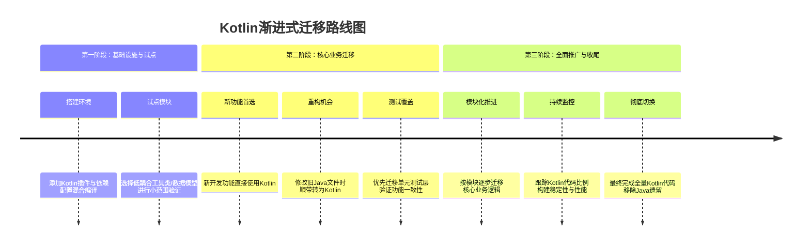
#### 1. 环境准备与混合编译
首先在项目中引入Kotlin支持，实现Java与Kotlin代码的无缝互操作。
*   **Gradle配置**：在模块的 `build.gradle` 中应用Kotlin插件。
    ```groovy
    // app/build.gradle
    plugins {
        id 'com.android.application'
        id 'kotlin-android'
        id 'kotlin-kapt' // 如果使用注解处理器如Room, Dagger等
    }
    ```
*   **目录结构**：在 `src/main/` 下创建 `kotlin` 目录，或将Kotlin文件放在 `java` 目录下，现代IDE均能正确识别。
#### 2. 模块化迁移优先级
并非所有模块都适合同步迁移，需制定科学的优先级策略：
*   **优先迁移**：**工具类**（`Utils`）、**数据模型**（`Bean/Entity`）、**扩展函数**。这些模块耦合度低、风险小，能快速让团队体验Kotlin的简洁性，例如将Java的`User`类转换为`data class`。
*   **其次迁移**：**单元测试**。测试代码是验证业务逻辑的基石，迁移风险极低，能极大提升测试编写效率。
*   **随后推进**：**新功能开发**。强制要求新功能使用Kotlin编写，这样新代码天然享受Kotlin优势，且不影响存量功能。
*   **最后攻坚**：**核心业务逻辑**与**UI层**。在团队积累一定Kotlin经验后，再逐步重构核心模块。对于UI层，可结合Jetpack Compose的迁移一同考虑。
#### 3. 利用自动化工具，但保持审慎
*   **IDE一键转换**：IntelliJ IDEA/Android Studio内置的 `Convert Java File to Kotlin File`（快捷键 `Ctrl+Alt+Shift+K`）是起点，但**转换后的代码往往需要手动优化**，例如简化冗余的空判断、应用Kotlin惯用法。
*   **大型项目考虑自动化工具**：对于千万行级代码库，可参考Meta开发的 **Kotlinator** 类工具，它通过六阶段流程（预处理、无界面转换、后处理、自动修复等）实现批量转换。但这需要专门的工程投入。
### 👥 三、赋能团队与推动文化：解决人的问题
技术变革的阻力往往来自于人，而非技术本身。你的核心任务是**降低学习曲线，创造安全环境，激发内生动力**。
#### 1. 系统化培训与知识分享
*   **分层培训**：组织系列分享会，从基础语法、空安全、扩展函数到协程、高阶函数，循序渐进。
*   **代码规范先行**：制定《Kotlin编码规范》，明确如`lateinit`的使用场景、扩展函数的放置位置、协程的调度器选择等，避免“Java式的Kotlin”代码。
*   **结对编程与Review**：鼓励Java老手与Kotlin新手结对，在Code Review中互相学习，重点审查空安全处理、协程使用是否恰当。
#### 2. 利用管理杠杆，引导行为
作为管理者，你拥有三个重要的变革工具：**系统流程**、**行为** 和 **奖励**。
*   **系统流程**：将Kotlin迁移纳入迭代计划，为技术债偿还分配固定比例（如20%）的时间。在CI流程中增加Kotlin代码风格的静态检查（如Ktlint）。
*   **行为以身作则**：**你的行为会被团队观察和效仿**。在技术讨论中，主动用Kotlin分析问题；在代码评审中，关注Kotlin代码的质量；在站会上，询问迁移进展和遇到的困难。
*   **奖励与认可**：**通过小型反馈循环，为团队注入动力**。公开表扬在Kotlin迁移中做出贡献的成员；在绩效考核中，将技术改进、代码质量提升作为重要指标；为主动学习Kotlin并产出成果的成员提供更多成长机会。
#### 3. 建立反馈与支持机制
*   **定期复盘**：设立每月的“Kotlin迁移同步会”，分享最佳实践，讨论踩坑记录（如互操作时的`NullPointerException`、协程的异常处理等）。
*   **提供资源**：购买Kotlin相关书籍、订阅Jetbrains Academy等学习资源，为团队学习扫清障碍。
### ⚖️ 四、控制风险与保障质量：平稳过渡
在追求速度的同时，必须建立安全网，确保迁移过程“**不破坏现有功能，不引入新风险**”。
*   **充分测试是生命线**：**迁移前后的功能一致性必须通过测试验证**。优先迁移并完善单元测试，对于核心业务，确保有足够的集成测试覆盖。
*   **互操作中的空安全陷阱**：这是Java与Kotlin混编时最大的风险点。Kotlin调用Java代码时，Java返回值可能为`null`，需显式处理（`?.` 或 `!!`）。反之，Kotlin的可空类型传递给Java时，Java侧需做null检查。可在Java侧广泛使用`@Nullable`/`@NonNull`注解帮助Kotlin编译器识别。
*   **构建与性能监控**：持续监控构建速度、APK大小、运行时性能（如协程是否造成主线程阻塞）。Kotlin的协程虽好，但滥用也可能导致问题。
*   **制定回退计划**：对于每个迁移模块，保留回退至Java的能力。在完全验证Kotlin版本稳定前，不要轻易删除Java代码。
### 📊 五、衡量成果与持续改进：形成闭环
迁移不是一劳永逸的项目，而是持续演进的过程。需要用数据说话，展示成果，并持续优化。
*   **设定量化指标**：
    *   **代码层面**：Kotlin代码占比、单元测试覆盖率、静态代码分析问题数。
    *   **效率与质量**：线上NPE故障率、开发新功能所需代码行数、构建耗时。
    *   **团队反馈**：定期进行开发者满意度调查。
*   **展示阶段性成果**：将“Kotlin代码占比突破50%”、“线上NPE故障归零”等成果可视化，向团队和管理层展示迁移价值，增强信心。
*   **持续优化**：根据实践反馈，不断调整迁移策略、编码规范和培训内容。例如，如果发现协程滥用，就加强协程最佳实践的培训。
### 💎 总结与核心要点
推动Java到Kotlin的迁移，核心是**管理一场技术文化的变革**。作为技术负责人，你的角色是**教练、协调者和推动者**。
1.  **始于共识，终于习惯**：用价值说服人，用流程规范人，用文化影响人。
2.  **渐进迁移，小步快跑**：模块化、分阶段迁移是控制风险的王道，新功能首选Kotlin。
3.  **赋能团队，以身作则**：提供学习资源，制定规范，你的行为是团队最好的标杆。
4.  **测试先行，安全第一**：用测试保障迁移质量，警惕互操作中的空安全陷阱。
5.  **数据驱动，持续迭代**：用指标衡量成果，根据反馈调整策略，让技术改进成为团队持续成长的动力。
记住，**技术迁移的终极目的不是使用新语言，而是提升团队的开发效率和系统的工程质量**。通过科学的策略和耐心的推动，你一定能带领团队平稳地完成这次技术升级，享受Kotlin带来的开发红利。

## 2. CodeReview时，需要指定哪些规则，如何让团队接受CodeReviewe并且都参与进来，而不是走流程
你提的这个问题非常核心，它直接关系到代码审查是成为团队的“质量护城河”，还是沦为“走过场的负担”。让Code Review真正落地，需要**规则、流程、文化和工具**四轮驱动。我会结合实践和搜索结果，为你梳理一套可落地的方案。
### 📋 一、制定清晰且聚焦的审查规则
规则是团队对“好代码”的共识，它让审查有据可依，减少主观争论。规则应**少而精，重点突出**，并随团队成熟度逐步迭代。
#### 核心审查清单（示例）
| 维度 | 关键检查点 | 说明与示例 |
| :--- | :--- | :--- |
| **功能正确性** | 逻辑实现、边界条件、异常处理 | 是否处理了空值、越界、非法输入？ |
| **架构与设计** | 是否遵循SOLID原则？模块划分是否合理？是否存在过度设计或设计不足？依赖关系是否清晰？ | 评估变更对系统整体架构的影响，防止“破窗效应”。 |
| **代码可读性与可维护性** | 命名是否清晰？函数/类是否过长？是否有必要的注释？是否存在重复代码？ | 遵循“营地法则”：让代码比你发现时更整洁。 |
| **性能与安全** | 是否存在N+1查询？是否使用线程安全的数据结构？输入参数是否做了校验？敏感数据是否加密？ | 特别关注循环调用、资源未释放、SQL注入等常见隐患。 |
| **测试与文档** | 是否有适当的测试？测试覆盖率是否达标？相关文档是否更新？ | 单元测试是功能正确性的重要保障，PR应包含相关测试。 |
> 💡 **规则制定技巧**：
> 1.  **自动化优先**：将编码规范（如命名、格式）、静态分析规则（如SonarQube）集成到CI/CD流水线，**让机器处理低级问题**，人工聚焦高价值的设计与逻辑审查。
> 2.  **分级处理**：根据变更风险等级（如影响核心业务、新增公开API）匹配不同的审查深度和审查人数，避免“一刀切”。
> 3.  **动态更新**：定期回顾审查中发现的典型问题，将其补充到清单中，让规则成为活文档。
### 🔄 二、建立高效且低阻力的流程
流程的目的是让Code Review成为开发习惯中自然的一环，而非额外负担。
#### 推荐的Code Review流程（融入PR工作流）
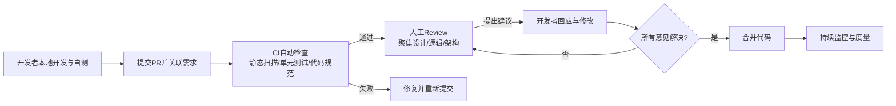
#### 关键流程原则
1.  **小步快跑，小PR优先**：鼓励每个PR只包含一个独立的功能或修复，**代码行数建议控制在200-400行以内**。这能极大降低审查者的认知负担，提高缺陷检出率，也便于回滚。
2.  **明确角色与责任**：
    *   **作者责任**：自测通过、提供清晰的PR描述（背景、方案、影响面）、主动说明设计取舍。
    *   **审查者责任**：及时响应（如24小时内）、客观评论、提供具体可操作的建议、最终批准或要求修改。
    *   **Owner机制**：每个模块/领域有明确的Code Owner，负责最终把关和知识沉淀。
3.  **善用工具**：利用GitHub/GitLab的PR/MR功能，集成SonarQube、ESLint等自动化检查工具。**将自动化检查设置为合并前的必要条件**，能过滤掉大量低级问题。
4.  **异步与同步结合**：鼓励异步线上评论，对于复杂或争议大的问题，及时发起**短时（30-60分钟）的同步评审会议**，避免在PR里无休止地讨论。
### 🤝 三、塑造积极正向的团队文化
文化是让Code Review免于流于形式的最深层次保障。核心是**将对人的评价转化为对代码的共建**。

| 文化毒药 | 文化解药 |
| :--- | :--- |
| **“评审者高高在上”** | **“平等协作，共同进步”** |
| **“这是我的代码，你凭什么指手画脚”** | **“这是我们的代码，我们一起让它更好”** |
| **“LGTM（Looks Good To Me）”敷衍通过** | **“认真对待每一次反馈，负责地提出或解决”** |
| **“抓住历史问题不放”** | **“聚焦当前变更，就事论事”** |
| **“评论模糊或人身攻击”** | **“评论具体、客观、可操作，对事不对人”** |
#### 培养文化的具体做法
1.  **领导与资深开发者以身作则**：主动发起对自己的代码评审，虚心接受意见，展示“代码可被质疑”的氛围。
2.  **强调“学习与分享”而非“找茬”**：Code Review是极佳的知识共享机会。鼓励审查者分享设计思路，作者解释业务背景，将“个人知识”转化为“团队共识”。
3.  **建立反馈与认可机制**：
    *   **公开认可**：在团队会议或频道中，表扬那些提出高质量建议或积极改进代码的开发者。
    *   **定期复盘**：每月选择一个“典型PR”进行集体复盘，讨论哪些做得好、哪些可改进，**复盘过程本身也是培训**。
    *   **与成长挂钩**：将Code Review中的表现（如提出有效建议数、代码质量改进情况）作为开发者绩效和成长评估的参考维度之一。
4.  **营造心理安全感**：明确“**没有完美的代码，只有更好的代码**”。鼓励提问，即使是最简单的问题，也要确保提问者不感到被嘲笑。**新手代码需要更多鼓励和指导**。
### ⚙️ 四、利用工具与度量持续优化
工具和度量能让Code Review的效果可视化，驱动持续改进。
#### 工具链集成
| 工具类型 | 推荐工具 | 作用 |
| :--- | :--- | :--- |
| **代码托管与PR** | GitHub, GitLab, Bitbucket | 提供PR/MR、评论、讨论、保护分支等基础功能 |
| **静态代码分析** | SonarQube, ESLint, P3C (阿里) | 自动检测代码规范、潜在Bug、安全漏洞、复杂度 |
| **CI/CD流水线** | Jenkins, GitLab CI, GitHub Actions | 将静态分析、单元测试设为合并前必过关卡，**自动化拦截不合格代码** |
| **AI辅助评审** | GitHub Copilot Review, CodeGuru | 快速识别逻辑漏洞、提供优化建议，提升评审速度 |
#### 关键度量指标
定期跟踪这些指标，能帮你诊断Code Review流程的健康度：

| 指标类别 | 具体指标 | 目标与洞察 |
| :--- | :--- | :--- |
| **质量** | 线上Bug密度、缺陷逃逸率（CR未发现但线上出现的Bug）、严重问题占比 | **缺陷逃逸率应持续降低**，说明CR有效拦截了问题。 |
| **效率** | 平均PR评审时长、PR合并周期、代码返工率 | **平衡速度与质量**，避免过长PR阻塞流程。返工率下降说明PR质量提升。 |
| **参与度** | 人均评审代码量、评审意见采纳率、跨模块协作顺畅度 | **鼓励广泛参与**，避免少数人负担过重。高采纳率说明反馈有价值。 |
| **团队成长** | 新人融入周期、技术知识共享度、低级错误重复率 | **新人融入周期缩短**、重复错误减少是CR文化成熟的标志。 |
> ⚠️ **度量陷阱**：度量是为了改进，而非考核。避免将指标直接用于惩罚个人，否则会扭曲行为，让数据失真。
### 🚀 五、落地推进路线图
推行Code Review切忌“一刀切”地全面强制，建议采用**渐进式推广策略**：
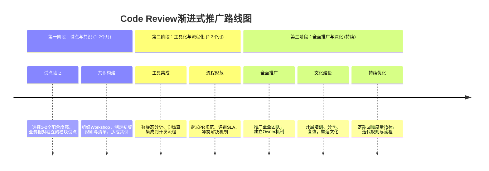
### 💎 总结与核心建议
让Code Review真正生效，远不止是定义规则，其核心是**重塑团队协作的价值观**。
1.  **规则是骨架**：用清晰、聚焦、自动化的规则为质量筑起第一道防线。
2.  **流程是经络**：用高效、低阻力、融入开发流的流程让审查成为习惯。
3.  **文化是灵魂**：用平等、共建、学习的文化让审查从“要我做”变为“我要做”。
4.  **工具与度量是放大器**：用工具自动处理重复劳动，用度量数据驱动持续改进。
**最重要的建议**：从**小处着手，快速试点，展示价值**。选择一个痛点的模块或一个配合度高的子团队开始，用数据证明Code Review带来的Bug减少、效率提升，用案例说服团队，比任何说教都有效。
记住，**Code Review的终极目的不是发现Bug，而是防止Bug的产生，并让团队在共同打造优质代码的过程中共同成长**。这需要耐心、坚持和领导者的智慧。

## 3. 你觉得什么是好的技术文档，你自己写文档的风格和原则
一句话：要让看这些文档的人看得懂；所以有几个基础逻辑要遵循：1、表述清晰，让人看第一眼就知道后面大概是讲个什么东西；2、结构化，使用户能快速获取自己需要的信息；3、以用户为中心，思考用户来读这个文档，是想获取什么内容，要快速的提供给用户；

## 5. 遇到两个团队成员对同一个技术方案有严重分歧时，你怎么处理
面对团队成员对技术方案的严重分歧，你的目标不仅是**解决当前的技术争端**，更是要**借此机会优化团队的决策机制**，将冲突转化为提升方案质量和团队凝聚力的契机。下面我结合实践和搜索结果，为你梳理一套结构化的处理流程和实用技巧。
### 🧭 一、冷静评估与初步干预：避免情绪化升级
当分歧发生时，首先要**防止讨论演变成情绪化的对抗**，并快速判断分歧的性质和影响范围。
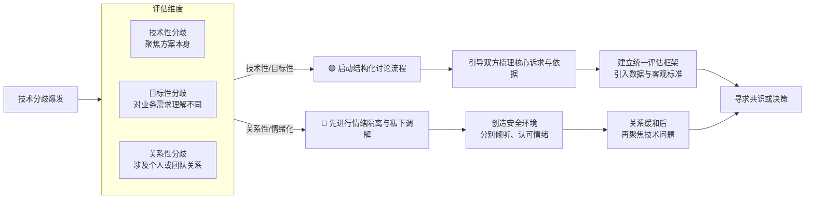
1.  **及时“叫停”无休止的争论**：如果讨论已超过1小时且双方仍各执一词、情绪激动，作为负责人应**及时中断讨论**。这并非回避，而是避免在情绪化状态下说出无法挽回的话，或做出非理性的决策。可以说：“我们今天先讨论到这里。双方都冷静一下，各自梳理一下核心观点和依据，明天我们再继续。”
2.  **快速判断分歧类型**：初步判断分歧是**纯粹的技术观点差异**（如微服务 vs. 单体），还是**对业务目标理解不同**（如追求极致性能 vs. 保证快速上线），抑或是**夹杂了个人情绪或历史积怨**。这决定了你后续的介入深度和方式。
3.  **营造安全沟通环境**：向双方明确，**目标是寻找最优解，而非决出胜负**。强调“**对事不对人**”的原则，禁止人身攻击和绝对化表述（如“你总是…”、“你从不…”）。可以重申团队共同目标，例如：“我们都是为了把项目做好，只是在实现路径上有不同想法，这很正常。”
### 🔍 二、深度介入与引导分析：探寻根本分歧点
在情绪平复后，引导双方从“立场”转向“利益”，深入分析技术方案背后的深层原因和约束条件。
1.  **分别倾听与梳理**：与双方进行**一对一面谈**，了解其方案的核心逻辑、担忧点、假设条件以及背后的业务诉求。这能帮助你发现信息差和误解。使用**积极倾听**技巧，复述对方观点确认理解，例如：“你的意思是，选择方案A主要是因为它能更好地支持未来的XX扩展，而当前团队对方案B的运维经验不足，是这样吗？”
2.  **聚焦核心分歧点**：将双方的观点和依据进行**结构化梳理和对比**。常用的工具是**决策矩阵**：

| 评估维度        | 方案A  | 方案B   | 说明与权重             |
| :---------- | :--- | :---- | :---------------- |
| **技术可行性**   | ⭐⭐⭐⭐ | ⭐⭐⭐   | 评估技术成熟度、团队熟悉度     |
| **性能与效率**   | ⭐⭐⭐  | ⭐⭐⭐⭐  | 评估吞吐量、响应时间、资源占用   |
| **开发与运维成本** | ⭐⭐⭐⭐ | ⭐⭐    | 评估开发周期、部署复杂度、维护难度 |
| **扩展性与灵活性** | ⭐⭐   | ⭐⭐⭐⭐⭐ | 评估未来功能迭代和系统扩展的难易度 |
| **风险与依赖**   | ⭐⭐⭐  | ⭐⭐    | 评估外部依赖、安全风险、迁移成本  |
| **业务价值匹配度** | ⭐⭐⭐⭐ | ⭐⭐⭐   | 评估与当前业务核心需求的契合度   |

*此矩阵可根据具体项目调整维度和权重。*
3.  **引入数据与客观依据**：鼓励双方用**数据、原型、POC（概念验证）测试结果**来说话，而非仅仅依靠经验或直觉。例如：“我们能否花半天时间，分别搭建一个最简原型，对比一下两个方案在模拟高并发下的实际表现？”**用数据缩小分歧，而不是放大立场**。
4.  **寻求“第三选择”**：引导团队跳出“非A即B”的二元思维，**寻找融合双方优势的第三方案**。例如，在微服务与单体的争论中，最终可能采用“**核心模块微服务化，辅助模块保持单体**”的混合架构。这需要你引导大家思考：“有没有可能，我们不用二选一，而是组合两者的优点？”
### ⚖️ 三、决策与执行：明确规则与承诺
如果经过充分讨论和分析，仍无法达成完全共识，就需要**启动决策流程**。关键是决策过程要透明、规则要明确，并争取团队的承诺。
1.  **明确决策机制**：事先明确或在此刻说明，**谁拥有最终决策权**（通常是技术负责人、架构师或项目负责人）。同时，可引入**“不同意和承诺”** 原则：允许保留意见，但决策一旦做出，所有成员都必须全力支持并执行，不得消极怠工或私下抵触。
2.  **参考既定标准与原则**：决策应基于**预先定义的技术设计原则、公司技术栈规范、行业最佳实践**，以及**业务目标的优先级**。例如，如果公司技术战略是“云原生优先”，那么在同等条件下，更符合云原生理念的方案可能被优先选择。
3.  **考虑引入第三方视角**：如果团队内部僵持不下，可邀请**团队外部资深专家、架构师或相关领域的顾问**参与评审，提供独立、客观的意见。这有助于打破信息茧房和思维局限。
4.  **决策与记录**：由决策人根据讨论结果、数据分析和评估矩阵做出最终决定。**务必记录决策过程、依据、未采纳方案的原因及后续行动计划**。这不仅能避免日后重复争论，也是宝贵的知识资产。例如，决策记录可包含：*“最终选择方案A。主要依据：1) 业务核心诉求是3个月内快速上线，方案A团队更熟悉，开发周期预估短2周；2) 虽然方案B在长期扩展性上更优，但当前业务量未达瓶颈，后续可再行迁移；3) 风险可控，已预留接口便于未来演进。”*
### 🔄 四、事后复盘与机制优化：将冲突转化为组织能力
冲突解决后，进行**复盘**并**优化团队协作与决策机制**，是防止类似冲突再次发生、提升团队成熟度的关键。
1.  **组织复盘会议**：在决策执行一段时间后（如一个迭代周期），组织团队回顾整个决策过程和结果。讨论：
    *   **决策效果如何**？是否达到了预期目标？
    *   **过程有何可改进之处**？沟通是否充分？评估是否全面？
    *   **团队对决策的接受度和执行情况如何**？
    *   **是否有遗留问题或新的风险产生**？
2.  **识别并优化机制**：根据复盘发现，**优化团队的协作机制**：
    *   **明确权责边界**：使用RACI矩阵等工具明确各角色的责任、决策权和咨询权，避免“责任不清”导致的冲突。
    *   **建立技术评审规范**：制定技术方案评审的标准流程、必评估维度、决策机制和记录模板，使未来的决策有章可循。
    *   **加强知识共享与对齐**：定期组织技术分享、架构培训，确保团队成员对技术栈和设计原则有共同理解。
    *   **营造“心理安全”氛围**：明确鼓励建设性冲突，保护少数意见，让成员敢于表达不同观点而不担心被惩罚。谷歌的研究表明，**心理安全是高绩效团队的首要特征**。
### 💎 核心原则与提醒
处理技术分歧时，牢记以下核心原则，能让你更从容有效：

| 核心原则 | 内涵与实践要点 |
| :--- | :--- |
| **🎯 对事不对人** | 始终聚焦于技术方案本身的问题与风险，避免将技术分歧升级为对个人能力或态度的质疑。 |
| **📊 数据驱动** | 尽可能用数据、测试结果、原型验证来支撑观点，而非主观感觉或经验判断。 |
| **🤝 目标导向** | 技术是服务于业务的手段。将讨论拉回业务目标，评估方案对业务价值的贡献。 |
| **⏱️ 设定时限** | 为分歧讨论设定一个“最晚解决时间”，避免无休止的争论延误项目。 |
| **✅ 决策与承诺** | 一旦做出决策，团队需承诺执行。允许保留意见，但必须全力以赴，确保项目向前推进。 |
> 💡 **一句话总结**：好的团队不是没有分歧，而是**有一套成熟的方法把分歧转化为决策动力**。你的角色不是消灭分歧，而是**管理分歧**，将其控制在建设性的范围内，并最终转化为更优的方案和更凝聚的团队。
希望这套方法能帮助你有效化解当前的技术分歧。如果你能分享一下分歧的具体技术点（比如是关于架构、选型还是实现方案），或许我能给出更具针对性的建议。


## 7. 线上事故复盘的流程和目标，如何确保复盘不变成追责大会

### 🎯 一、明确复盘的核心目标
一次有效的复盘，其核心目标应围绕以下几点：
| 维度 | 核心目标 | 说明 |
| :--- | :--- | :--- |
| **🔍 事实层面** | **还原真相** | 清晰、客观地还原事故发生的完整时间线、处理过程和影响范围。 |
| **🧠 学习层面** | **洞察根因** | 识别导致事故的**技术根因**和**机制/流程根因**（如上线流程缺失、测试覆盖不足）。 |
| **🚀 改进层面** | **产出行动** | 制定具体的、可落地的改进措施（Action Items），并明确负责人和验收标准，避免同类事故再次发生。 |
| **🧰 资产层面** | **沉淀资产** | 将经验教训转化为团队的**规范、流程、工具、知识库**，提升团队整体的系统能力和免疫力。 |
> 💡 **关键认知转变**：复盘的本质是**投资未来的系统稳定性**，其回报是**减少未来的故障和成本**。每一次事故，都是一次“昂贵的”学习机会，浪费它就是双重损失。
### 📋 二、结构化复盘流程（五步法）
一个清晰、结构化的流程能有效引导讨论，避免陷入细节和情绪的泥沼。以下是经过验证的复盘流程：
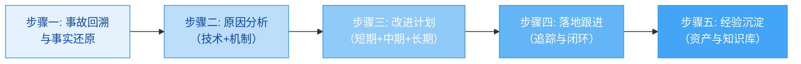
#### 步骤一：事故回溯与事实还原（Timeline & Impact）
此阶段的目标是**客观呈现事实**，不带任何评价和指责。
*   **绘制事故时间线**：精确到分钟，记录关键节点。
    *   `T0`：首次告警或用户反馈时间
    *   `T1`：影响范围扩大时间
    *   `T2`：开始止损动作时间（如回滚、限流）
    *   `T3`：服务恢复时间（业务不再受影响）
    *   `T4`：完全验证恢复时间
*   **评估影响面**：用数据说话。
    *   **用户影响**：影响用户数、用户投诉量
    *   **业务影响**：影响接口/功能、业务损失金额（如有）
    *   **系统影响**：影响时长、错误率峰值、服务依赖关系
*   **记录处置过程**：当时做了哪些尝试，哪些有效，哪些无效？
    *   例如：`12:05 开启限流`（效果：有效控制流量）`12:10 数据库扩容`（效果：缓解压力但未根治）
#### 步骤二：原因分析（技术根因 + 机制根因）
这是复盘的核心。**务必采用“双层分析”**，避免只修表面。
*   **技术根因**：直接的技术故障点。例如，慢SQL导致超时、空指针导致崩溃、第三方接口变更导致失败。
*   **机制根因（或流程根因）**：**为什么技术根因没有被提前拦截？** 这通常指向设计、开发、测试、发布、监控等流程的缺陷。
    *   **问“为什么”**：例如，慢SQL为什么没被测出来？→ 因为测试环境数据量小，没模拟线上场景。
    *   **再问“为什么”**：为什么没有模拟线上数据量？→ 因为测试团队资源有限，且没有明确的压测标准。
    *   **再问“为什么”**：为什么没有压测标准？→ 因为没有针对核心接口建立性能基线规范。
    *   **结论**：技术根因是“慢SQL”，但**机制根因是“缺乏核心接口压测基线和规范”**。只修SQL，下次还可能出别的性能问题。
<details>
<summary><strong>🔧 深入分析：常用工具与原则</strong></summary>
*   **5 Whys分析法**：通过连续追问“为什么”，层层下钻，找到根本原因。但要注意避免过度归因到个人。
*   **鱼骨图（因果图）**：从人员、流程、技术、环境等多个维度分析问题原因，全面系统。
*   **归因原则**：默认归因于**系统问题**，而非个人错误。除非有明确证据表明存在**主观恶意或重大违规操作**。举证责任在“追责方”。
*   **区分“人”与“系统”**：大多数问题都是“系统设计”未能防范“人的正常局限性”（如疲劳、疏忽、认知偏差）。靠“小心”防不住的问题，要靠“系统”来防。
</details>
#### 步骤三：改进计划（可落地、可追踪）
将分析出的根因转化为具体的行动项，并遵循**SMART原则**。

| 改进项 | 负责人 (Owner) | 截止时间 (Deadline) | 验收标准 (Acceptance Criteria) |
| :--- | :--- | :--- | :--- |
| 为所有慢查询上线前增加 `EXPLAIN` 审查流程 | DBA团队 (张三) | 2024-01-15 | 发布《SQL上线规范》，所有PR需附带执行计划说明 |
| 为订单核心接口补充压测基线（要求TPS>5000, P99<100ms） | 测试团队 (李四) | 2024-01-30 | 压测报告通过评审，并集成到CI流水线 |
| 增加组合告警：订单接口错误率>1% **且** P95延迟>200ms | 运维团队 (王五) | 2024-01-10 | 监控平台配置生效，并触发一次演练 |
| 将降级开关纳入值班手册，并进行全员培训 | 运维团队 (王五) | 2024-01-20 | 所有值班人员通过实操考核 |
**改进项分类**：
*   **短期治标（短期目标）**：快速止血或修复当前明显漏洞。例如，修复Bug、增加监控告警、补充文档。
*   **长期治本（中长期目标）**：修改流程、架构或工具，从系统上防范。例如，完善测试流程、架构重构、开发自动化工具。
*   **收益大且容易做的**：优先做。
*   **收益小或难做的**：搁置或重新评估。
#### 步骤四：落地跟进（闭环管理）
没有跟进的复盘，其价值减半。必须确保改进措施真正落地。
*   **明确责任人**：**每个改进项必须有唯一负责人（Owner）**，不能是“某团队”。
*   **设置里程碑与检查点**：对于长期项目，设置阶段性检查点。
*   **定期同步与通报**：在站会、周会或专门的复盘跟进会上同步进展。
*   **验证与验收**：改进项完成后，必须进行验收。例如，评审新的流程文档、查看压测报告、验证新的监控是否生效。
*   **复盘改进措施本身**：在后续的复盘会上，可以回顾之前改进措施的效果，形成持续的闭环。
#### 步骤五：经验沉淀（资产化）
将复盘中提炼出的教训和智慧，转化为组织的资产，避免“失忆”。
*   **更新知识库**：将事故分析、经验教训、最佳实践整理成文档，存入团队知识库。
*   **完善规范与流程**：更新开发规范、测试流程、发布流程、应急响应手册等。
*   **进行分享与培训**：组织技术分享会，让更多人从中学习。
*   **自动化与工具化**：将改进措施尽可能固化为自动化工具或脚本。例如，将SQL检查工具集成到CI流水线，从流程上强制要求。
### 🛡️ 三、确保复盘不变成追责大会：营造“心理安全”氛围
这是复盘成功与否的**最关键前提**。如果参与者感到害怕，他们就会隐藏信息，复盘就会失效。
#### 1. 前置声明与规则设定
复盘开始前，由**主持人**（最好是第三方或技术负责人）**明确重申复盘的原则和规则**：
> 📢 **复盘开场白范例**
> “今天我们坐在这里，只有一个目的：**看看从这次事故中，我们的团队和系统可以学到什么，以便下一次我们能处理得更好。我们不是来找‘罪人’的，我们一起来找‘金子’——那些能让我们系统更强大的经验。**”
> “复盘会上讨论的信息，**不会用于绩效考核或追责**（除非发现主观恶意）。我们遵循‘**无指责文化**’，默认相信大家都是出于好意，基于当时的信息做了最好的选择。”
> “请大家坦诚分享，**对事不对人**。我们的目标是改进系统，而不是评判个人。”
#### 2. 领导以身作则
领导者的行为是团队最强的信号。
*   **主动自我批评**：如果事故涉及决策或流程问题，领导者应**主动承担自己应负的责任**，例如：“我在项目排期时，对风险评估不足，给团队造成了压力，这是我的责任。” 这能极大地降低团队的防御心理。
*   **控制情绪，聚焦学习**：面对失误，**先关注解决方案和学习，再谈责任**。切忌在复盘会上发怒或指责，这会立即摧毁心理安全氛围。
*   **将“人”与“事”彻底分离**：明确告诉大家，“事故”本身是学习的机会，而“个人绩效”是另一回事，两件事分开处理。
#### 3. 采用结构化工具引导
使用结构化的工具和问题，能有效引导对话聚焦于系统和流程，而非个人。
*   **使用“时间线回顾法”**：先按时间顺序还原事实，再讨论原因，减少主观臆断。
*   **采用“匿名反馈”机制**：在会前，可以通过匿名问卷收集大家的观察和想法，作为讨论的起点，保护发言者。
*   **使用“引导式问题”**：
    *   ❌ 错误提问：“王工，你为什么没做这个测试？”（指向个人，引发防御）
    *   ✅ 正确提问：“我们来看看，这个环节的测试用例设计是否有覆盖不够的地方？为什么当时没有覆盖到这个场景？我们的测试流程中，有没有可以改进的地方？”（指向系统，引发分析）
#### 4. 制度保障：将学习与追责流程分离
最根本的保障是**制度设计**。
*   **责任豁免规则**：明确**“在复盘会上主动暴露和讨论的问题，不作为追责的依据”**。但要注意，这**不是纵容所有错误**，而是保护坦诚交流的渠道。重大违规或重复犯同样低级错误，仍需通过**独立的**绩效或管理流程处理。
*   **归因原则制度化**：在复盘规范中明确，**默认进行系统归因**，举证责任在主张“个人责任”的一方。
*   **信息隔离**：复盘会的纪要和讨论内容，**默认不进入人事档案或直接用于绩效考核**。如果需要追责，应基于独立的调查流程进行。
> ⚠️ **注意**：“无指责文化”不等于“不承担责任”。它的真正含义是：**在复盘阶段，我们聚焦于学习；在管理阶段，我们再根据复盘结果和独立流程，讨论责任和改进。学习的优先级高于问责，因为学习解决的是“下一次”，问责解决的是“上一次”**。
### 📝 四、可直接使用的复盘模板
你可以直接使用或参考以下模板来组织复盘报告和会议：
#### 事故复盘报告模板
```markdown
# [事故简述]：例如，订单接口超时导致用户支付失败
## 1. 事故概述
*   **事故时间**：YYYY-MM-DD HH:MM - HH:MM
*   **事故等级**：P1/P2/P3/P4
*   **发现方式**：监控告警/用户反馈
*   **影响范围**：
    *   受影响用户数：XX
    *   受影响接口/业务：XX
    *   业务损失（如有）：XX
*   **初步止损措施**：例如，回滚至V1.2版本、开启限流、临时降级非核心功能
## 2. 事故时间线 (Timeline)
| 时间 | 事件 | 处理人 | 备注 |
| :--- | :--- | :--- | :--- |
| 2024-01-10 10:05 | 监控告警，订单接口错误率激增 | 运维（张三） | |
| 2024-01-10 10:10 | 确认影响范围，成立应急小组 | 技术负责人（李四） | |
| ... | ... | ... | |
| 2024-01-10 11:30 | 服务完全恢复 | 开发（王五） | |
## 3. 根因分析
*   **技术根因**：例如，数据库索引失效导致慢查询，接口超时。
*   **机制/流程根因**（重点）：
    1.  **设计缺陷**：新接口未考虑历史数据量，未进行容量规划。
    2.  **测试覆盖不足**：测试环境数据量小，未模拟线上海量数据场景，导致性能问题未暴露。
    3.  **发布流程缺失**：新接口上线前未进行压测，无性能基线作为参考。
    4.  **监控告警不足**：只有错误率告警，缺乏P95/P99延迟组合告警，未能早期发现性能退化趋势。
## 4. 改进措施 (Action Items)
| 序号 | 改进措施 | 负责人 | 截止时间 | 验收标准 | 状态 |
| :--- | :--- | :--- | :--- | :--- | :--- |
| 1 | 为所有慢查询上线前增加EXPLAIN审查流程 | DBA团队 | 2024-01-15 | 发布规范并落地执行 | ⏳ 进行中 |
| 2 | 为订单核心接口补充压测基线 | 测试团队 | 2024-01-30 | 压测报告通过评审 | ⏳ 进行中 |
| 3 | 增加组合告警：错误率&延迟 | 运维团队 | 2024-01-10 | 告警生效并演练 | ✅ 已完成 |
| 4 | 将降级开关纳入值班手册 | 运维团队 | 2024-01-20 | 全员培训通过考核 | ⏳ 进行中 |
## 5. 经验与教训
*   **成功经验**：应急响应团队快速集结，止损动作及时有效。
*   **待改进点**：性能测试流程、监控覆盖度、容量评估机制。
*   **后续沉淀**：更新《性能测试规范》、完善《监控告警手册》、补充《容量评估清单》。
## 6. 附录
*   相关日志、监控截图
*   详细的技术分析报告
```
### 💎 总结
一次成功的线上事故复盘，其标志不是一篇漂亮的报告，而是：
1.  **大家坦诚分享了所有信息**，没有隐瞒。
2.  **找到了深层次的系统原因**，而不仅仅是表面的技术错误。
3.  **产出了真正有效的改进措施**，并得到了跟踪和落地。
4.  **团队感到学到了东西**，对系统更有信心，而不是感到恐惧和沮丧。
记住，**系统是由人构建和维护的，人的脆弱性和局限性是系统的一部分**。优秀的复盘不会否认人的因素，但会通过改进流程和设计，让系统能够更“宽容”地对待人的不完美，从而让整个系统更健壮。
希望这套流程和原则能帮助你开好每一次复盘会，真正地将“失败”转化为团队前进的“路标”和“资产”。


# 团队管理
## 1. 带30人团队时，是怎么做任务分配和进度跟踪的，用了什么工具和流程
管理30人的团队，确实需要一套**系统化**、**可视化**且**赋能团队**的体系。这远不止是分配任务和检查进度，更重要的是**建立共识、降低沟通成本、激发团队自驱力**。下面我会结合我的经验和工具实践，为你梳理一套框架。
### 🧭 一、核心管理理念与流程
带大团队，核心是**从“人管人”转向“流程管人、文化育人”**。我采用的是**敏捷开发框架（Scrum）**，它非常适合应对需求变化和跨职能协作。
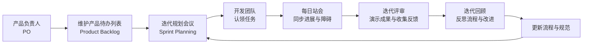
这个闭环流程的关键在于：
*   **迭代（Sprint）**：将长周期项目分解为**2-4周**的固定时间盒。每个迭代都产出可用的软件增量。
*   **角色分工明确**：
    *   **产品负责人（PO）**：负责**价值判断**，管理产品待办列表，确定优先级，确保团队做正确的事。
    *   **Scrum Master**：负责**流程保障**，移除障碍，确保Scrum流程得以顺利执行（可由技术负责人或资深工程师兼任）。
    *   **开发团队**：**自组织、跨职能**，负责在迭代内完成选定的任务，把事做正确。
*   **核心会议**：
    *   **迭代规划会议**：团队共同估算任务，决定本次迭代完成哪些故事。
    *   **每日站会**：**15分钟**，轮流回答“昨天做了什么？今天计划做什么？遇到什么障碍？”**同步信息、暴露问题，而非汇报给领导**。
    *   **迭代评审会**：向团队和干系人**演示本迭代完成的功能**，收集反馈。
    *   **迭代回顾会**：**团队内部**，反思本次迭代在流程、协作、工具上的成功经验和改进点。
### 🛠️ 二、工具选择与组合拳
工具是流程的载体。对于30人团队，我推荐一个**组合方案**，而非单一工具。

| 功能需求 | 推荐工具 | 核心用途与优势 |
| :--- | :--- | :--- |
| **核心项目管理**<br>（任务、进度、看板） | **Jira** (或 **PingCode**) | **敏捷开发的事实来源**。强大的自定义工作流、字段、权限；支持Scrum板、看板、时间线视图；与开发工具（Git）、CI/CD深度集成，**自动化回写开发状态**。 |
| **知识库与文档**<br>（需求、设计、会议记录） | **Confluence** (或 **Notion**) | **信息沉淀中心**。与Jira深度联动，每个任务卡片可关联对应的设计文档、测试用例、决策记录，形成**单一信息源**。 |
| **代码与CI/CD** | **GitLab** / **GitHub** + **Jenkins** | **代码托管与自动化流水线**。提交信息可自动关联到Jira任务，实现**代码任务双向追溯**。 |
| **实时沟通** | **Slack** / **飞书** / **企业微信** | **沟通加速器**。集成Jira/Confluence，任务更新、@提及直接推送至聊天频道，减少切换成本。 |
| **即时协作与白板** | **Miro** / **FigJam** | **远程头脑风暴与架构设计**。异步协作，绘制架构图、流程图、任务分解图，替代传统白板。 |
> 💡 **为何推荐Jira？**
> 对于30人以上的技术团队，Jira的**深度可配置性**和**DevOps集成能力**是其他工具难以替代的。它一开始可能复杂，但**投入的配置成本会在规模化协作中成百倍地收回**。国内团队也可考虑**PingCode**，它在国产化适配、价格和本地化服务上有优势。
### 📋 三、任务分配与进度跟踪实践
有了流程和工具，关键是如何日常运作。
#### 1. 任务分配：认领与协商，而非指派
我推崇 **“Pull” 而非 “Push”** 的模式。
*   **颗粒度拆解**：用户故事（需求）在迭代规划会上由**团队共同分解**成具体的技术任务（Task），每个任务估算工时（理想情况下不超过2天）。
*   **团队认领**：在Jira的Scrum板中，将待办任务（To Do）拖动到“进行中”（In Progress）时，**自行认领**。这体现了团队的**自组织**和对任务的责任感。
*   **技术负责人的角色**：
    *   **前期平衡**：在规划会上，关注**技能匹配**和**负载均衡**（Jira的工作负载视图很有用）。
    *   **中后期辅导**：如果某成员连续领任务困难，或技术风险过高，主动介入，提供结对编程或技术指导，而非简单强行分配。
#### 2. 进度跟踪：可视化与数据驱动
让进度和风险**无处遁形**。
*   **看板是灵魂**：**每日必看**。任务卡片在列间的流动就是最直观的进度图。关注**“进行中”列的任务数量**（WIP限制）和**“待办”列中高优先级任务的积压情况**。
*   **燃尽图（Burndown Chart）**：**迭代的核心仪表盘**。每日更新剩余工作量，直观判断能否按期完成。如果曲线平缓，说明进度滞后，需立即调整或加班。
*   **定期汇报**：**每周向团队和利益相关者同步项目整体进度**。可使用Jira仪表盘生成报告，内容包括：
    *   本迭代完成情况（基于燃尽图）
    *   下迭代计划
    *   **关键风险与障碍**（例如：某第三方API延期）
    *   需要支持的决策
#### 3. 流程优化：从回顾会开始
**迭代回顾会（Retrospective）** 是团队效率提升的**金矿**。一定要认真对待，切忌流于形式。
*   **氛围**：**营造心理安全感**，鼓励“对事不对人”的讨论。
*   **方法**：采用“**开始做、停止做、继续做**”或“**点赞与土豆**”（好经验与待改进）等框架。
*   **产出**：**必须生成1-2个具体的、可执行的改进项（Action Item）**，并明确负责人和截止日期，纳入下一个迭代的任务板中跟踪落实。
### 🚨 四、常见挑战与应对
| 挑战 | 应对策略 |
| :--- | :--- |
| **任务估算偏差大** | 1.  **计划扑克（Planning Poker）**：团队成员共同估算，避免个人偏差。<br>2.  **基于历史数据**：记录任务实际工时，不断校准估算标准。<br>3.  **预留缓冲**：在迭代规划时，预留20%的容量作为缓冲。 |
| **团队成员过度承诺** | 1.  **每日站会关注**：发现成员任务过多，主动提出协商。<br>2.  **利用Jira工作负载视图**：可视化每个人的任务量，识别过载。<br>3.  **倡导“Done”的定义**：任务必须完成、测试通过、文档齐全才算Done，避免“差不多”心态。 |
| **跨团队依赖阻塞** | 1.  **尽早识别**：在任务卡片上明确标注依赖关系。<br>2.  **建立跨团队同步机制**：如每周一次的技术负责人会议，协调依赖。<br>3.  **纳入风险清单**：在站会上重点汇报阻塞的依赖，升级解决。 |
| **工具复杂，团队抗拒使用** | 1.  **“最小可行性流程”**：先启用最核心的看板和任务分配功能，再逐步引入高级特性。<br>2.  **培训与赋能**：组织培训，制作操作手册，甚至安排“工具辅导员”。<br>3.  **以身作则**：技术负责人和经理必须**带头使用**工具，所有决策和数据都基于工具。 |
### 📊 五、关键度量指标（Metrics）
用数据说话，持续优化。

| 指标 | 用途 | 如何衡量 |
| :--- | :--- | :--- |
| **迭代燃尽图** | 追踪迭代进度，预测延期风险。 | Jira自动生成。 |
| **周期时间（Cycle Time）** | 衡量任务从“开始”到“完成”的耗时，**流程效率的核心指标**。 | 在Jira中，从“进行中”到“完成”的平均时间。 |
| **吞吐量（Throughput）** | 单位时间内（如一个迭代）完成的任务数或故事点数。 | 统计每个迭代完成的任务卡片数或总故事点。 |
| **在制品限制（WIP Limit）** | 限制并行任务数，**减少任务切换，提升效率**。 | 为“进行中”列设置最大任务数（例如，团队人数 * 1.5）。 |
| **缺陷逃逸率** | 衡量测试质量。 | 上线后发现的缺陷数 / 测试阶段发现的缺陷总数。 |
> ⚠️ **注意**：**避免用数据惩罚个人**。这些指标用于**识别系统性问题和瓶颈**，并作为团队改进的输入。
### 💎 核心总结
带30人团队，任务分配和进度跟踪的成功要素可浓缩为：
1.  **流程是骨架**：采用**敏捷Scrum框架**，固定节奏、清晰角色、闭环反馈。
2.  **工具是肌肉**：选择**Jira + Confluence**等成熟组合，投资于流程自动化和集成。
3.  **文化是灵魂**：营造**自组织、数据驱动、持续改进**的团队文化。技术负责人的角色是**服务型领导**，负责**建立系统、移除障碍、赋能团队**。
## 2. 招聘工程师时，你面试最看重哪三个特质，你会问什么问题来验证
招聘Android工程师时，在技术能力达标的前提下，我会最看重**扎实的技术根基、解决实际问题的能力以及良好的技术沟通与协作意识**。这三个特质是区分“合格”与“优秀”工程师的关键，也预示着其在团队中长期发展的潜力。
下面我会详细阐述这三个特质，并提供相应的面试问题来验证，希望能为你的面试准备提供参考。
### 🧩 我最看重的三个核心特质
| 特质 | 为什么重要 | 面试验证侧重点 |
| :--- | :--- | :--- |
| **🔧 扎实的技术根基与系统化思维** | Android平台庞大且复杂，根基不牢会导致遇到疑难杂症时知其然不知其所以然，难以做出最优技术选型和解决深层问题。 | 对核心原理的理解深度、知识体系的连贯性、技术决策的依据。 |
| **🧩 解决实际问题的能力与工程实践** | 理论知识最终要服务于实践。考察其如何运用技术工具、分析思维和工程经验来定位、剖析并解决真实项目中的复杂问题。 | 问题排查思路、工具使用熟练度、解决方案的权衡与取舍、优化效果可量化。 |
| **🤝 技术沟通协作意识与持续学习热情** | 现代软件开发是团队运动。清晰表达技术方案、有效进行代码评审、主动分享知识、并能适应技术快速迭代至关重要。 | 技术交流的清晰度、团队协作的主动性、对新技术的学习路径和应用意识。 |

### 🧪 如何通过面试问题验证特质
我会通过**行为面试问题（STAR法则）** 和**技术深度剖析问题**相结合的方式来验证这些特质。关键不是答案本身，而是其**思考过程、逻辑结构、实践经验和表达方式**。
#### 1. 验证“扎实的技术根基与系统化思维”
我可能会从某个核心知识点切入，层层深入，观察其理解是停留在表面还是触及本质。
**典型问题与追问：**
*   **Q1：** “请你描述一下Android的四大组件及其生命周期，并说明在实际开发中，你是如何在不同组件间传递数据的？”
    *   **验证点：** 这是考察基础必问题。但我会**追问**：
        *   “Activity A启动一个透明主题的Activity B，两者的生命周期会怎么变化？” （考察对启动模式、任务栈和生命周期的深度理解）
        *   “如果Service被系统回收了，如何保证它能重启或通知你？” （考察对进程生命周期、Service重启机制的理解）
        *   “使用Intent传递大数据时，大小限制是多少？超出限制有什么替代方案？” （考察对通信机制局限性的了解和解决方案的思考）
*   **Q2：** “请解释Handler的机制原理，并谈谈为什么Handler使用不当容易导致内存泄漏？如何避免？”
    *   **验证点：** 考察对异步消息机制、线程间通信、生命周期管理的理解。
    *   **理想回答框架：**
        1.  **原理阐述**：清晰描述`Looper`、`MessageQueue`、`Handler`、`Message`的协作关系，特别是`Looper.loop()`的死循环机制。
        2.  **泄漏原因**：准确指出**非静态内部类/匿名内部类的Handler持有外部Activity引用**，若Message延迟处理导致Activity无法回收。
        3.  **解决方案**：给出`静态内部类 + WeakReference`的组合方案，并强调在`Activity.onDestroy()`中调用`handler.removeCallbacksAndMessages(null)`清空消息队列。
*   **Q3：** “你如何理解Android的架构模式（如MVC/MVP/MVVM）？它们各自的优缺点是什么？你在项目中是如何选择和应用的？”
    *   **验证点：** 考察对架构设计原则、分层思想、技术选型权衡的理解。
    *   **验证方法：** 看其能否清晰对比不同模式的核心差异（如MVVM通过数据绑定实现View与ViewModel的解耦），并结合**具体项目场景**说明选择理由（如项目规模、团队熟悉度、可测试性需求），而非机械罗列概念。
#### 2. 验证“解决实际问题的能力与工程实践”
我会通过项目经历中的具体案例，考察其问题分析、排查和解决的能力。
**典型问题与追问：**
*   **Q4（经典行为面试题）：** “请描述你在过去项目中遇到的最具挑战性的技术难题是什么？你是如何分析并解决的？”
    *   **验证点：** 这是**最核心、最能体现综合能力**的问题。我会运用**STAR法则**引导其回答：
        *   **Situation (情景)**：问题发生在什么项目背景下？业务目标是什么？
        *   **Task (任务)**：你的职责是什么？面临的挑战具体是什么？（例如：一个社交App的Feed流滑动卡顿，导致用户流失严重）
        *   **Action (行动)**：**这是最重要的部分**。你具体做了什么？
            *   你是如何**定位和诊断**问题的？（如使用`Android Profiler`分析CPU、内存、网络情况，或通过日志分析、埋点排查）
            *   你尝试了哪些**解决方案**？方案背后的**技术依据**是什么？（如：优化RecyclerView的绑定逻辑、开启DiffUtil、使用Glide的图片加载缓存、优化布局层级减少过度绘制）
            *   你是否考虑了**多种方案的权衡**？最终选择该方案的理由是什么？
        *   **Result (结果)**：最终的结果如何？**能量化最好**。（如：页面滑动平均帧率从45fps提升至58fps，OOM崩溃率降低80%）你从中获得了什么**经验和反思**？
*   **Q5：** “线上出现了一个ANR（Application Not Responding）或崩溃问题，你通常会如何排查？能结合一个你处理过的案例讲讲吗？”
    *   **验证点：** 考察对线上问题排查流程、工具使用和根因分析的能力。
    *   **验证方法：** 看其是否能系统性地回答：
        1.  **初步定位**：通过`logcat`、`crash`日志堆栈信息初步判断。
        2.  **工具分析**：使用`TraceView`/`Systrace`分析主线程耗时操作，或用`LeakCanary`检测内存泄漏。
        3.  **深入根因**：结合代码、日志、复现路径分析，判断是主线程IO、死锁、循环卡顿还是内存泄漏等。
        4.  **解决与预防**：描述解决方案（如异步化、优化算法、修复泄漏），并思考如何通过机制、工具避免再次发生（如增加StrictMode检测、改进Code Review规范）。
#### 3. 验证“技术沟通协作意识与持续学习热情”
我会通过询问其在团队中的角色、知识分享和技术学习的情况来判断。
**典型问题与追问：**
*   **Q6：** “你在团队中通常如何进行Code Review？当你对团队成员的代码有不同意见时，会如何沟通？”
    *   **验证点：** 考察技术沟通的成熟度、协作意愿和以理服人的能力。
    *   **验证方法：** 听其是否能区分**“个人风格”**和**“代码质量/规范问题”**。优秀的回答会强调：
        *   **对事不对人**：评论针对代码本身，而非个人能力。
        *   **基于事实和标准**：用代码规范、最佳实践、性能数据等客观依据支持观点。
        *   **建设性沟通**：先肯定优点，再提出改进建议，并说明理由。例如，“这里我建议使用WeakReference，是为了避免潜在的内存泄漏风险，根据Handler机制原理…”
        *   **开放心态**：也愿意倾听对方的解释和想法，共同学习。
*   **Q7：** “你最近在关注和学习哪些Android新技术或新框架？为什么学它？你觉得它可能如何应用到我们的项目中？”
    *   **验证点：** 考察**主动学习意识**、**学习路径的有效性**以及**学以致用的思考能力**。
    *   **验证方法：** 看其能否：
        *   清晰说明**学什么**（如Jetpack Compose、Kotlin协程、KMP、R8优化、Privacy Sandbox等）。
        *   合理解释**为什么学**（解决现有痛点、提升开发效率、适应行业趋势、个人兴趣驱动）。
        *   **如何学**（阅读官方文档、源码、技术博客、实践Demo）。
        *   **如何用**（能结合自身项目或假设场景，思考其适用性和可能带来的价值，而非泛泛而谈）。例如，“Compose能极大提升UI开发效率，对于我们的新模块可以尝试引入，但需要考虑与现有View系统的互操作性和团队学习成本。”
### 💎 面试官的“小心机”
在提问和倾听时，我会特别注意：
*   **追问“为什么”**：除了“怎么做”，我更想知道“为什么这么做”，这能揭示其思考深度和决策依据。
*   **关注“怎么做”**：对于复杂问题，看其能否**结构化、步骤化地阐述**，这体现了工程化和条理性。
*   **观察“是否坦诚”**：遇到不确定或不会的问题时，是坦诚承认并尝试分析思路，还是不懂装懂或回避问题。**持续学习和勇于承认未知的能力同样重要**。
*   **审视“技术平衡感”**：在追求技术先进性时，是否会考虑**业务价值、团队成本、稳定性**等因素，而非盲目炫技。
### 📋 总结：给面试者的建议
1.  **夯实基础，理解原理**：不要只知其然，更要知其所以然。对核心知识点（四大组件、Handler、生命周期、架构模式等）要理解透彻。
2.  **梳理项目，提炼亮点**：按照STAR法则，梳理2-3个项目中你**主导或深度参与**的、**有挑战性**且**有量化结果**的技术案例。这是你最有说服力的证据。
3.  **模拟练习，清晰表达**：提前准备和练习这些问题的回答，确保逻辑清晰、重点突出。可以试着对自己或朋友讲出来。
4.  **展示热情，保持好奇**：在交流中展示你对技术的热爱、对团队协作的重视以及持续学习的意愿。这能让你从众多“合格”候选人中脱颖而出。
记住，面试是一个**双向选择**的过程。你也在评估这家公司、这个团队和这位面试官是否与你匹配。保持自信、真诚，充分展示你的技术和能力，祝你成功！

## 3. 你怎么处理团队中的老油条-技术还行但态度消极的成员
处理团队中“技术还行但态度消极”的成员（俗称“老油条”），确实是管理中很棘手但必须面对的挑战。这需要你**刚柔并济、系统化应对**，目标不仅是让其改变，更是**维护团队健康度和公平性**。
我会结合实践和搜索结果，为你梳理一套从**诊断、干预到最终可能需要分离**的完整思路和具体方法。
### 🔍 一、精准诊断：洞察“老油条”的成因与类型
“老油条”并非天生，其消极态度通常是**个人、组织、管理**三方面因素交织的结果。在行动前，先冷静诊断，避免误判。
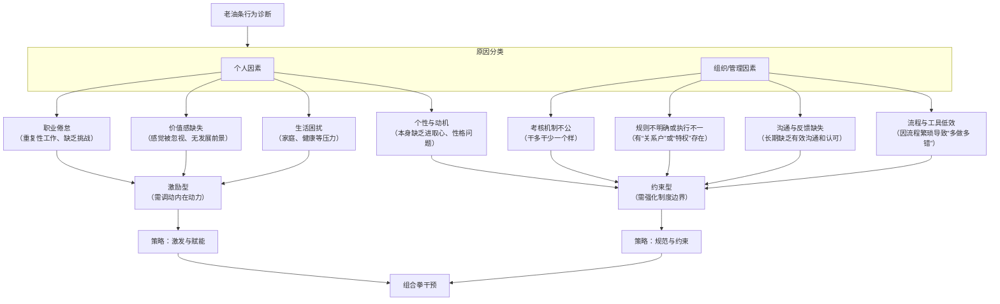
#### 了解“老油条”的常见类型
根据成因和表现，可以初步判断其类型，这有助于选择后续策略。

| 类型 | 典型表现 | 可能成因 | 管理策略侧重 |
| :--- | :--- | :--- | :--- |
| **🔥 燃尽型** | 曾积极，但遭遇挫折或长期重复性工作后心灰意冷，无精打采，但无破坏性行为。 | **职业倦怠**、价值感未被认可。 | **重新点燃**：给予新挑战、认可过往贡献、赋予导师角色。 |
| **🎯 混日型** | 不追求卓越，但求无过，拒绝额外任务，对团队影响相对隐蔽。 | 缺乏激励、发展无望、**“大锅饭”心态**。 | **激活目标**：设定明确且具挑战性的个人目标、关联绩效与激励。 |
| **⚡ 刺头型** | **技术过硬**，但**公开抵触管理**，会议怼人，Code Review不留情面，破坏团队氛围，严重时成为“定时炸弹”。 | 自身能力超群却未被赋予匹配的责任或权力；或曾受不公对待，心生不满。 | **双管齐下**：**肯定技术能力**，**严肃沟通行为边界**，必要时**隔离或分离**。 |
| **🧱 障碍型** | 工作方式陈旧，**固守旧流程**，抗拒新工具和方法，成为技术革新的阻力。 | 能力固化、缺乏学习动力、**对未知的恐惧**、曾因创新受挫。 | **赋能与淘汰**：提供培训、展示新工具优势；若仍不改进，则调岗或淘汰。 |
> 💡 **重要提示**：**避免贴标签**。诊断是为了选择策略，而非定性。许多人可能兼具多种特征。
### 🧭 二、分层干预：从“软”到“硬”的系统性措施
基于诊断结果，你可以采取一系列措施，遵循 **“先软后硬、先激励后约束”** 的原则。
#### 1. 激励与赋能：针对“燃尽型”与“混日型”
目标是**重新激活其内在动力**，让他感受到被需要和有前景。
*   **深度沟通，倾听诉求**：进行一次**一对一的正式沟通**。**坦诚地表达你的观察和担忧**（例如：“我注意到你最近在XX项目上的投入度不如从前，是不是遇到了什么困难？”），**真诚地倾听**他的解释、不满和期望。这能让你找到破局的关键，也能让他感受到被尊重。
*   **调整工作内容，赋予新挑战与价值**：如果因职业倦怠，可尝试调整其工作内容。例如：
    *   **从执行者到顾问/导师**：让其负责带领新人、梳理技术文档、优化基础架构或担任技术评审专家。**“传帮带”能极大提升其价值感**。
    *   **分配核心、有挑战性的任务**：给予他主导一个重要模块或攻克技术难题的机会，并**公开认可其贡献**。
*   **个性化激励与发展规划**：
    *   **设置“技术专家”通道**：对于不善管理但技术精湛的员工，可设立与管理职级对等的**技术职级序列**，让其通过技术深度获得尊重和回报。
    *   **支持个人成长**：根据其兴趣，提供外部培训、参加技术大会的机会，或支持其学习新技术。这表明公司愿意在他身上投资。
*   **强化正向反馈与认可**：**及时、公开地表扬**其任何积极的改变或贡献。**人都是渴望被认可的**，尤其是老员工。
#### 2. 规范与约束：针对“刺头型”与“障碍型”
目标是**明确规则底线，强化组织纪律，必要时清除负面影响**。
*   **公开、透明地重申规则与期望**：
    *   在团队会议上，**公开、清晰地强调**团队的核心价值观、行为准则和绩效考核标准（如协作评分、任务响应时限等）。
    *   建立明确的“**负面行为清单**”（如拖延工作、推诿责任、传播负能量、公开攻击同事等），并告知相应的处理措施，让管理有据可依。
*   **绩效与行为直接挂钩**：
    *   将**工作态度、团队协作、遵守流程**等纳入绩效考核指标，并设定合理权重。
    *   对于“刺头型”员工，**持续记录其负面行为及具体事例**（如会议冲突记录、同事投诉邮件），作为绩效评估和后续处理的客观依据。
*   **正式面谈与书面警告**：
    *   对于持续消极或破坏行为，进行**正式面谈**。**明确指出其行为违反了公司制度或团队规则**，**具体说明其行为对团队和业务造成的负面影响**，并给予**书面警告**。
    *   **明确告知其改进的期望和期限**，以及若不改进将面临的后果（如绩效不合格、调岗、解除劳动合同）。**整个面谈过程需形成书面记录，并请员工签字确认**。
*   **启动绩效改进计划（PIP）**：
    *   对于因能力或态度问题导致绩效不达标的员工，应制定**书面的绩效改进计划（Performance Improvement Plan, PIP）**。
    *   **PIP应包含**：明确的问题领域、具体的改进目标（SMART原则）、可衡量的指标、详细的行动计划、提供哪些支持（如培训、辅导）、明确的评估期限（通常为30-90天）以及未达标的后果。
    *   **定期跟进（如每周）**，记录其进展和仍存在的问题。这是**法律程序中非常关键的一环**。
<details>
<summary><strong>📋 绩效改进计划（PIP）模板要点</strong></summary>
**员工信息**：姓名、部门、岗位、职级
**当前绩效问题**：具体描述（如“近3个月内，4次未按时交付代码，且未提前说明原因；在2次团队会议中，对同事提出的技术方案进行人身攻击而非技术讨论。”）
**改进目标**：如“在接下来30天内，所有分配的代码任务按时交付率≥90%；在团队沟通中，保持专业和尊重，不再出现人身攻击。”
**行动计划与支持**：
1.  每周五下午4点与经理进行30分钟同步， review本周工作。
2.  经理提供时间管理方法的辅导。
3.  若遇技术难题，可提前向架构师申请1小时的咨询时间。
4.  **员工需签署此计划并承诺执行。**
**评估时间**：2024年X月X日
**后果**：若上述目标未达成，公司将根据《员工手册》第X章第X条，考虑调岗或解除劳动合同。
**员工签字**：__________ 日期：__________
**经理签字**：__________ 日期：__________
</details>
#### 3. 最终手段：调岗或分离
当所有激励和约束措施均无效，且其持续对团队造成严重负面影响时，需要**为了团队的整体健康而做出艰难决定**。
*   **调岗**：如果其技术能力尚可，但当前岗位与团队无法匹配，可考虑将其**调至非核心团队、独立项目或支持性岗位**，减少其破坏力，并观察其在新环境中的表现。
*   **依法解除劳动合同**：
    *   这是**最后、最慎重的一步**，必须确保**合法合规**，避免劳动纠纷。
    *   **关键前提**：**拥有充分、确凿的证据链**，包括：持续的绩效不佳记录、多次书面警告记录、PIP记录及评估结果、行为违纪证据（如旷工记录）、沟通记录等。
    *   **依据**：主要依据《劳动合同法》第三十九条“严重违反用人单位的规章制度”（前提是规章制度合法且已公示）或第四十条“不能胜任工作，经过培训或者调整工作岗位，仍不能胜任工作”（前提是经过PIP等程序）。
    *   **流程**：**提前通知**（或支付代通知金）、出具解除劳动合同证明、**依法支付经济补偿金**（N+1，N为本单位工作年限，每满一年支付一个月工资）。整个过程需**保持尊重和冷静**。
### 🧩 三、文化预防：从源头减少“老油条”的产生
处理个案是必要的，但更重要的是**从组织层面预防“老油条”文化的滋生**。
1.  **营造公平、透明、有活力的团队文化**：
    *   **公平绩效**：确保绩效考核**客观、公正、透明**，并与激励紧密挂钩，真正做到“**多劳多得、少劳少得**”。
    *   **透明沟通**：建立**定期、真诚的沟通机制**，如一对一会议、匿名反馈渠道、坦诚的团队回顾会，让员工感到被倾听和尊重。
    *   **认可贡献**：**建立多元化的认可机制**，不仅奖励业绩，也奖励协作、创新、导师行为等，让优秀以多种方式被看见。
2.  **建立持续学习与成长的环境**：
    *   提供丰富的**内外部培训、技术分享、轮岗机会**，让员工感到持续成长，避免因技能固化而停滞。
    *   鼓励**尝试和容错**，营造“**对事不对人**”的氛围，让员工敢于负责和创新，而不是因害怕犯错而变得“油滑”和“推诿”。
3.  **在招聘时严格筛选“同频”人才**：
    *   **雷军曾说，他80%的时间花在找人上**。在面试时，除了技术能力，**重点考察候选人的价值观、学习动力、团队协作精神**。
    *   多问行为问题，如“描述一次你主动解决团队难题的经历”、“你如何与一个难以相处的同事合作？”，通过过去行为预测未来表现。**一个顶级的组织，一开始就通过严苛的筛选，杜绝了大部分未来需要磨合的问题**。
### 💎 核心原则与心态总结
处理“老油条”是一场**考验管理智慧和耐心的持久战**。请牢记：

| 原则 | 内涵与操作 |
| :--- | :--- |
| **🛡️ 先团队，后个人** | 你的首要责任是**保护整个团队的士气和效率**，而不是迁就某一个人。**纵容“老油条”是对其他努力工作的最大不公**。 |
| **⚖️ 公平公开，有据可依** | 所有处理必须**基于明确的规则和充分的事实证据**，避免情绪化和“因人设事”。透明的过程能让其他员工信服。 |
| **🤝 刚柔并济，系统推进** | **沟通要柔，立场要刚**。先尝试激励和赋能，后运用规范和约束。**不可一步到位直接摊牌**，给足改变的机会和面子。 |
| **🧘 管理预期，接受现实** | 不是所有“老油条”都能被改变。**你的目标不是“拯救”每个人，而是让团队整体向好**。若其持续为负，分离是负责任的选择。 |
| **🌱 治本之策在预防** | 最终极的解决方案是**打造一个让人不想变“油”、不能变“油”的健康组织生态和文化土壤**。 |


## 4. 新员工入职后的前三个月，你的培养计划通常是什么样的
为新员工设计一套科学、系统的入职前三个月培养计划，是帮助他们**快速融入团队、掌握岗位技能、并尽早为团队创造价值**的关键。这不仅是新员工的“黄金适应期”，也是团队“选育用留”的第一道关卡。
我通常会围绕一个核心流程和四个关键维度来构建这个计划，并辅以清晰的工具和机制保障。
### 🧭 一、核心流程：从“局外人”到“自己人”
我会将三个月划分为三个递进的阶段，每个阶段都有明确的核心目标和重点任务，形成一个清晰、可衡量的成长路径。
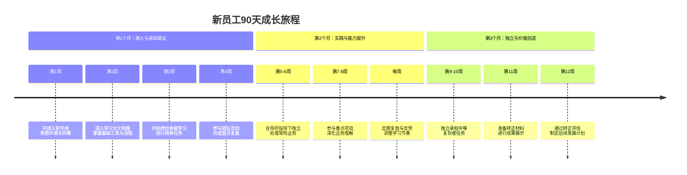
#### 📅 第1个月：融入与基础建设 - **“我要知道我在哪，我该做什么”**
这个阶段的核心目标是**消除陌生感，建立安全感，掌握“生存”所需的最低限度知识**。
*   **第1周：入职引导与团队初识**
    *   **核心任务**：
        *   完成所有入职手续（劳动合同、账号、设备、工位）。
        *   **环境熟悉**：不仅指办公室物理环境，更重要的是**“信息环境”**。介绍部门组织架构、关键协作接口人、常用办公地点（会议室、茶水间、打印机）。
        *   **团队破冰**：安排简单的欢迎会或午餐，让新员工与团队成员逐一进行**不少于1分钟的相互介绍**，快速建立初步人际连接。
    *   **关键成果**：完成入职 checklist，与团队主要成员有过初步交流，了解团队的基本工作节奏和沟通风格。
*   **第2-3周：文化制度学习与岗位技能入门**
    *   **核心任务**：
        *   **文化制度深度学习**：通过企业文化手册、内部培训视频、高管分享会等方式，深入学习企业使命、愿景、价值观、行为准则。**重点学习**考勤、报销、信息安全、绩效考核等与日常工作和利益直接相关的核心制度。
        *   **岗位基础培训**：系统学习岗位职责说明书、工作流程（SOP）、工作规范。开始学习岗位所需的专用软件、工具和系统（如CRM、ERP、开发环境、数据分析工具等）。
        *   **知识预热**：通过阅读公司产品手册、行业白皮书、内部知识库，快速建立对业务和行业的初步认知。
    *   **关键成果**：通过公司基础制度考试，能熟练使用岗位必备工具，理解并复述岗位核心职责和流程。
*   **第4周：首月融入与复盘**
    *   **核心任务**：
        *   **参与实际任务**：在导师指导下，开始尝试完成**非常规的、低风险的辅助性任务**（如数据整理、会议纪要、文档撰写、简单Bug修复）。
        *   **首月复盘**：与新员工进行一次正式的**1v1沟通**，反馈其首月表现（**肯定优点，明确改进点**），解答疑问，并共同调整后续培养计划。
    *   **关键成果**：完成首月学习评估表，明确第二个月的核心学习目标和任务优先级。
#### 📅 第2个月：实践与能力提升 - **“我要尝试自己做，但需要有人支持”**
这个阶段的核心目标是**在实践中应用所学知识，逐步独立完成常规任务，建立初步的工作自信**。
*   **核心任务**：
    *   **在导师指导下独立工作**：开始独立处理**常规的、重复性的岗位任务**，但导师需在旁观察，随时提供答疑和指导。
    *   **参与重点项目支持**：分配至1-2个部门重点项目，承担**数据整理、资料调研、会议支持、辅助方案设计**等具体任务，积累实战经验，并理解项目整体运作。
    *   **建立问题解决意识**：鼓励新员工遇到问题时，先**尝试自行查找解决方案**（查阅文档、搜索引擎、代码库），无法解决时再请教导师，并记录问题及解决方法。
*   **关键机制**：
    *   **每周双周复盘**：**每周或每两周**与导师进行一次固定时长的1v1复盘会议，检视工作完成情况、技能掌握程度，及时调整学习计划和方法。
    *   **影子学习**：安排新员工跟随资深员工或协作部门同事参与跨部门会议、客户沟通或现场服务，**观察和学习真实的业务场景和沟通技巧**。
*   **关键成果**：能**独立且高质量地完成**本岗位70%的常规任务，输出至少一份有个人思考的工作总结或小项目报告。
#### 📅 第3个月：独立与价值创造 - **“我能独立负责，并开始贡献价值”**
这个阶段的核心目标是**完全胜任岗位基本职责，能独立承担中等复杂度的任务，并准备转正**。
*   **核心任务**：
    *   **独立负责模块/任务**：**完全独立**地分配和完成一个**有明确目标、验收标准和交付成果的任务模块**（如一个小功能的端到端开发、一个小型客户项目的策划与执行）。
    *   **提出优化建议**：基于两个月的实践，鼓励新员工从**业务流程、工具使用、协作效率**等方面，提出1-2条有建设性的、可落地的优化建议。
    *   **准备转正述职**：梳理三个月的学习成果、工作产出、对岗位的理解，以及未来的工作规划，准备转正评估材料。
*   **关键成果**：**高质量完成**转正评估中设定的核心绩效目标（KPI/OKR），通过转正答辩，与团队和上级达成一致的发展规划。
### 🧩 二、培养计划的四个关键维度
为了让计划更立体，我会从以下四个维度同步推进新员工的培养：

| 维度 | 核心内涵 | 具体做法与工具 |
| :--- | :--- | :--- |
| **🧠 业务与知识** | 掌握岗位所需“硬知识”和“软技能”。 | **导师带教**（核心）、**岗位技能培训**、**知识库学习**、**案例研讨**、**外部培训资源**。 |
| **🛠️ 工具与流程** | 熟练使用“武器”和“地图”。 | **系统操作培训**、**工作流演练**、**权限开通与配置**、**最佳实践分享**。 |
| **🤝 人际与文化** | 融入团队，建立协作网络。 | **团队活动**、**1v1沟通**（与导师、同事、上级）、**跨部门协作任务**、**非正式交流**（午餐、茶歇）。 |
| **🎯 职业与发展** | 建立归属感，规划成长路径。 | **职业发展咨询**、**个人发展计划（IDP）**、**绩效反馈与辅导**、**晋升通道说明**。 |
### ⚙️ 三、保障计划落地的机制与工具
“三分计划，七分执行”。以下机制和工具能确保培养计划真正落地，而不是一纸空文。
1.  **导师制度（Mentorship）- 核心保障**
    *   **导师选拔**：选择**业务熟练、责任心强、沟通意愿高**的资深员工（通常要求入职2年以上）担任导师。
    *   **明确职责**：导师不仅是技能传授者，更是**文化引路人和成长陪伴者**。其职责应包括：制定个性化带教计划、日常答疑、定期复盘、提供反馈、帮助融入团队。
    *   **双导师制（可选）**：对于复杂岗位，可配置“**业务导师**”（传授岗位技能）和“**文化导师**”（关注团队融入与职业发展），分工协作。
2.  **结构化沟通与反馈机制**
    *   **固定复盘节奏**：建立**每周/双周导师复盘**、**每月直属上级沟通**的固定节奏，让反馈常态化、及时化。
    *   **使用模板工具**：利用《**周反馈表**》、《**月度评估表**》、《**转正评估表**》等标准化工具，确保沟通有记录、反馈有依据、成长有迹可循。
3.  **清晰的考核与转正标准**
    *   **量化目标**：在入职第一周内，与新员工共同制定**可量化、可达成、有时限的试用期目标**（SMART原则），并将其作为转正评估的核心依据。
    *   **多维评估**：转正评估不仅看业绩结果，还应综合评估**文化匹配度、学习成长速度、团队协作表现**等多个维度。
4.  **新员工赋能与资源清单**
    *   **新员工入职包**：在入职当天，为新人提供一份精心准备的“**入职大礼包**”，包含：
        *   **《新员工手册》**：文化、制度、流程、通讯录、常用链接一应俱全。
        *   **《岗位学习地图》**：本岗位的学习路径、核心技能、推荐资源。
        *   **《必备工具清单》**：所有软件、账号、权限的获取方式和使用指南。
        *   **《欢迎信》**：来自团队或CEO的欢迎信，传递温暖与期待。
    *   **学习资源**：提供丰富的学习资源，如**内部知识库、在线课程平台、技术书籍、行业报告**等，支持自主学习。
### 📋 四、新员工培养计划核心工具表
为了方便你快速上手和落地，我为你梳理了几个核心工具，你可以根据团队情况调整使用。
#### **1. 新员工入职90天成长计划表（模板）**
| 阶段 | 时间节点 | 核心目标 | 关键任务与学习内容 | 成果与验收标准 | 负责人/支持资源 |
| :--- | :--- | :--- | :--- | :--- | :--- |
| **第1个月<br>融入与基础** | **第1周** | 完成入职，熟悉环境，初步破冰 | 办理入职手续；熟悉办公环境与团队；参加欢迎会 | 完成入职Checklist；与团队成员逐一交流 | HR、行政、部门同事 |
| | **第2周** | 学习文化制度，掌握基础工具 | 深度学习企业文化与核心制度；学习岗位基础工具与流程 | 通过制度考试；能熟练使用岗位必备软件 | HR、导师 |
| | **第3周** | 开始岗位技能学习，执行简单任务 | 岗位技能入门；在指导下完成辅助性任务（如数据整理、文档撰写） | 完成3项以上基础任务；输出任务清单 | 导师 |
| | **第4周** | 首月复盘，调整计划 | 参与实际任务；进行首月1v1复盘 | 完成首月学习评估；明确第二月目标 | 导师、直属上级 |
| **第2个月<br>实践与提升** | **第5-6周** | 独立处理常规业务 | 在导师指导下独立处理常规业务；参与项目支持 | 能独立完成70%的常规任务；参与1个项目 | 导师、项目经理 |
| | **第7-8周** | 深化业务理解，提升问题解决能力 | 独立承担任务模块；尝试解决日常问题；参与跨部门协作 | 输出工作总结或小项目报告；提出1个流程优化建议 | 导师、协作同事 |
| **第2个月<br>实践与提升** | **每周/双周** | **固定复盘与反馈** | 与导师进行固定时长的1v1复盘会议，检视进度与问题 | 形成周/双周反馈记录，调整计划 | 导师 |
| **第3个月<br>独立与创造** | **第9-10周** | 独立负责模块，创造价值 | **完全独立**完成一个有明确成果的任务模块 | 高质量完成任务并交付 | 直属上级、导师 |
| | **第11周** | 准备转正，展示成果 | 梳理三个月成果，准备转正述职材料 | 完成转正评估材料准备 | 新员工 |
| | **第12周** | **转正评估，制定规划** | 通过转正答辩；与上级沟通后续发展计划 | **通过转正评估**；制定个人发展计划（IDP） | HR、直属上级、团队 |
#### **2. 导师带教任务清单（示例）**
| 任务类别 | 具体内容与要求 | 完成时限 |
| :--- | :--- | :--- |
| **入职引导** | 介绍团队成员、办公环境、基本设施；帮助新员工熟悉日常行政流程（如用餐、打卡、报销）。 | 入职第1天 |
| **文化融入** | 主动分享团队工作习惯、沟通风格、非正式交流渠道（如午餐、群聊）；邀请新员工参加团队活动。 | 持续进行 |
| **技能传授** | 根据岗位技能清单，制定学习路径；提供必要的技能培训和指导；解答新员工在技术上的疑问。 | 持续进行 |
| **任务分配与指导** | 逐步分配从简单到复杂的任务；提供清晰的指令和期望；在过程中给予反馈和纠正。 | 持续进行 |
| **定期复盘** | **每周/双周**与新员工进行1v1复盘，回顾工作进展、技能掌握情况，并调整下一步计划。 | 固定频率 |
| **反馈与辅导** | 及时肯定新员工的进步，指出需要改进的地方；帮助新员工分析失败原因，总结经验。 | 持续进行 |
| **转正评估** | 根据新员工三个月的表现，提供客观、全面的转正评估意见。 | 第3个月末 |
#### **3. 新员工首周关键任务清单**
| 任务 | 负责人 | 说明 |
| :--- | :--- | :--- |
| ✅ 完成所有入职手续（签字、账号、设备） | HR、新员工 | 确保一切就绪，无遗漏。 |
| ✅ 熟悉办公环境（工位、打印机、会议室、茶水间） | 行政、导师 | **“硬件”环境熟悉**。 |
| ✅ 熟悉团队（与每位成员进行至少1分钟的交流） | 导师、团队 | **“软件”环境熟悉**，快速建立连接。 |
| ✅ 参加欢迎会或团队午餐 | 团队、导师 | 消除陌生感，感受团队温暖。 |
| ✅ 领取《新员工手册》和《岗位学习地图》 | HR、导师 | 提供“自学”路线图。 |
| ✅ 设置所有必需的系统账号和权限 | IT、HR | 确保工具可用，无技术障碍。 |
| ✅ 与直属上级进行第一次1v1沟通 | 直属上级、新员工 | 明确试用期核心目标和期望。 |
> 💡 **小贴士**：将此清单打印出来，贴在新员工的工位上，作为首周的“导航图”。
### 🎯 五、给你的核心建议
作为管理者或导师，在执行这套计划时，有几点需要特别注意：
1.  **新员工不是“缩小版的老员工”**：他们的背景、学习方式和速度各不相同。计划是**框架和指南**，而非僵化的教条。要**个性化调整**，关注每个人的需求。
2.  **“带教”是投资，而非负担**：花时间系统化地培养新人，能极大降低后续沟通和纠错的成本，并为你培养出得力的副手。**这是对你未来时间的高效投资**。
3.  **“反馈”是成长的氧气**：**及时、具体、真诚的反馈**是新员工最需要的养料。不要等到转正时才说问题，**“小步快跑、持续校准”** 才是正道。
4.  **“文化”比“技能”更难教**：技能可以培训，但文化认同和团队融入需要**日复一日的示范和潜移默化的影响**。你自己和团队的行为就是最好的“文化教材”。
5.  **庆祝每一个小里程碑**：新员工完成首月目标、独立处理第一个任务、提出第一个好建议……都值得**公开表扬和鼓励**。这些小胜利是建立自信和归属感的关键。
希望这份详细的培养计划和工具能帮助你系统地引入新人才，为他们也为团队开启一段成功的旅程。

## 5. 绩效评估中，你怎么量化一个人的技术贡献，CodeReview数量算不算KPI

量化技术贡献是技术管理中的难题，而将Code Review数量纳入KPI更需谨慎。我会结合实践和行业研究，为你梳理一套更科学、多维度的评估体系，并明确Code Review的角色。
### 📊 一、技术贡献的量化维度与指标
技术贡献远不止代码，它是一个从个人能力到业务价值的立体体系。下表汇总了核心维度、关键指标及其权重建议，供你参考。

| 维度 | 关键指标 | 权重建议 | 数据来源与说明 |
| :--- | :--- | :--- | :--- |
| **🧠 技术能力与成长** | 技术深度（如架构设计合理性、复杂问题解决能力） | 20% | **技术评审记录**、**技术分享次数**、**新技术预研成果** |
| | 技术广度（如跨领域知识、工具链熟练度） | | **技术认证**、**代码质量报告**（如SonarQube复杂度分析） |
| **📦 项目与交付价值** | 项目计划完成率 | 30% | **项目管理工具**（如Jira）中的任务完成情况 |
| | 交付质量（如代码缺陷率、线上故障率） | | **Bug跟踪系统**、**线上监控数据**（如DORA的变更失败率） |
| | 业务价值（如功能上线后用户满意度、业务指标提升） | | **业务数据平台**、**客户反馈系统**、**产品经理评价** |
| **⚡ 效能与效率** | 变更前置时间（Lead Time for Changes） | 20% | **CI/CD工具**（如Jenkins、GitLab CI）数据，反映从代码提交到部署上线的效率 |
| | 服务恢复时间（MTTR） | | **故障管理平台**数据，反映故障处理效率 |
| | 自主开发工具/框架带来的效率提升 | | **工具使用情况**、**团队反馈的效率提升数据** |
| **🤝 协作与影响力** | 知识分享与沉淀（技术文档产出、知识库更新频次） | 15% | **文档平台**（如Confluence）统计、**内部培训次数** |
| | 团队赋能（新人带教效果、技术方案被采纳率） | | **新人成长速度**、**技术评审记录**、**同事360度反馈** |
| | 技术社区贡献（开源项目Star数、行业标准参与度） | | **GitHub等平台数据**、**外部技术社区反馈** |
| **🌟 创新与优化** | 技术创新带来的成本节约（如优化算法降低服务器成本） | 15% | **财务数据**（如云服务账单）、**技术改进报告** |
| | 技术创新使效率提升率（如自动化测试覆盖率提升） | | **效能指标对比**、**自动化工具数据** |
| | 专利申请、技术论文发表 | | **专利证书**、**发表记录** |

### ⚖️ 二、Code Review的角色与正确用法
直接将Code Review数量设为KPI是**非常危险且容易误导的**。但它绝对是评估技术贡献中**协作与影响力**维度的重要**信号**和**输入**。
#### ❌ 为什么Code Review数量不宜作为直接KPI？
1.  **易扭曲行为**：单纯追求数量会导致“为了审而审”，出现**敷衍了事**（只看表面，不深入）、**追求浅显问题**（纠结变量名、格式）或**互相刷单**（为了凑数互相评审）。这会严重破坏Code Review的质量和初衷。
2.  **忽视质量**：**一次深入、高质量的评审**（如发现架构风险、性能瓶颈）远比十次浅尝辄止的评审更有价值。数量无法衡量评审的深度和有效性。
3.  **忽略角色差异**：不同角色（如架构师、资深开发、初级开发）在评审中的**目标和产出质量本就不同**。用同一数量标准衡量所有人有失公允。
4.  **忽视参与度与贡献度**：除了数量，更重要的是评审的**参与度**（是否及时）、**贡献度**（是否提出有价值的问题和改进建议）、**建设性**（评论是否对事不对人，能否帮助作者成长）。
#### ✅ 如何正确将Code Review纳入评估？
它应该作为**“协作与影响力”** 维度下的一个**定性参考**或**辅助指标**，而非硬性KPI。评估时更应关注：

| 评估角度 | 关注点 | 如何衡量 |
| :--- | :--- | :--- |
| **参与度与响应速度** | 评审的**及时性**和**覆盖率**。是否积极认领评审任务？是否在约定时间内完成？ | **评审任务平均处理时间**（可由GitLab/GitHub PR数据计算）、**评审覆盖率**（参与的评审任务占比） |
| **贡献质量与深度** | 评审意见的**价值**、**准确性**和**深度**。能否发现真正的Bug、架构隐患或性能问题？能否提出建设性的改进建议？ | **被采纳的评审意见比例**（作者后续修改中采纳的意见数）、**重大问题发现数**（发现并阻止了潜在线上问题的评审）、**技术难题解决贡献**（在评审中协助解决复杂问题的次数） |
| **知识传递与赋能** | 评审是否成为**知识分享**和**新人培养**的渠道？评论是否清晰、具有教育意义？ | **新人带教效果**（新人通过评审反馈成长的速度）、**技术文档产出**（将评审中发现的共性问题整理成技术文档或分享） |
| **团队协作与影响力** | 评审者是否在推动代码规范、最佳实践落地？其评论是否能被团队广泛接受和尊重？ | **技术方案被采纳率**（提出的架构或设计改进被采纳的比例）、**同事360度反馈**（在跨团队协作、知识分享、技术推动方面的评价） |
> 💡 **实践建议**：可以设定一些**“底线标准”**（例如，每个周期内至少参与X个评审），但**不应设置“上限”或“绝对数量目标”**。**鼓励和奖励高质量的评审**，例如，在季度内评选“最佳评审官”，表彰那些发现重大问题或提出卓越建设性意见的工程师。
---
### 🧭 三、构建科学的评估体系：原则与流程
量化指标是骨架，但要让评估体系真正有效，还需要遵循一些核心原则和流程。
#### 1. 核心原则：SMART+E与多维度评价
设计评估指标时，可参考 **“SMART+E”原则**：
*   **Specific（具体）**：指标定义清晰，与岗位强关联（如考核开发工程师代码缺陷率，而非文档产出量）。
*   **Measurable（可衡量）**：数据可采集、可量化（使用工具自动抓取Git提交记录、CI/CD数据等）。
*   **Attainable（可达成）**：分层级设定目标（如初级工程师代码量权重30%，先进架构师技术方案采纳率权重50%）。
*   **Relevant（相关）**：与公司战略目标对齐（如云计算部门增加技术降本指标，AI部门侧重模型优化效率）。
*   **Time-bound（有实效）**：明确周期限制（如季度评估代码质量，年度评估专利转化收益）。
*   **Evolutionary（动态调整）**：每半年迭代50%的评估参数（如新增AI伦理审查指标）。
同时，采用 **“360度评价”**  等多维度评价机制，综合上级、同事、下属甚至客户的反馈，以获得更全面的评价结果，避免单一评价者的偏见。
#### 2. 评估流程：从数据到发展
一个健康的评估流程应该是一个闭环，不仅是为了评价，更是为了发展。
```mermaid
flowchart LR
    A[数据采集与整合<br>（CI/CD、Git、Jira、监控平台等）] --> B[指标计算与可视化<br>（生成个人与团队效能看板）]
    B --> C[绩效面谈与反馈<br>（结合数据与360度反馈进行深入沟通）]
    C --> D[制定个人发展计划<br>（IDP）与改进措施]
    D --> E[跟踪与调整<br>（持续监测指标变化，动态调整计划）]
    E --> A
```
1.  **数据采集与整合**：利用工具自动化采集数据，减少人工统计的误差和成本。许多HR系统（如利唐i人事）和效能平台（如ONES Performance）都支持与Jira、GitLab等开发工具集成，自动生成技术贡献热力图。
2.  **指标计算与可视化**：将原始数据转化为有意义的指标，并生成可视化看板。这能帮助个人和团队直观了解自身表现，定位优势与短板。
3.  **绩效面谈与反馈**：这是评估流程中最关键的环节。**切忌只谈数字**。管理者应基于数据，与员工进行深入沟通：
    *   **肯定成就**：用数据证明其价值（“你主导的数据库优化项目使查询效率提升了40%，直接支撑了Q3的促销活动”）。
    *   **指出差距**：客观指出未达标的领域，并分析根因（“虽然你完成了所有任务，但变更失败率略高于团队平均，我们来看看是测试覆盖度还是发布流程的问题”）。
    *   **聚焦未来**：共同制定下一周期的改进目标和发展计划。
4.  **制定个人发展计划（IDP）**：评估的最终目的是为了成长。根据评估结果，为员工制定个性化的个人发展计划，明确技能提升方向、所需资源和目标。
5.  **跟踪与调整**：在下一个周期内，持续跟踪改进措施的进展，并根据实际情况动态调整目标和计划，形成持续改进的闭环。
#### 3. 文化保障：超越指标的心理安全感
再完善的指标体系，如果缺乏“心理安全感”作为文化土壤，也会失效。团队必须相信：
*   **评估是为了发展，而非惩罚**：员工应感知到，评估是为了帮助他们成长，而不是为了扣工资或裁员。
*   **错误是学习的机会**：鼓励对技术问题进行复盘（Root Cause Analysis），聚焦于流程和系统改进，而非个人追责。
*   **数据用于对话，而非决策**：数据是开启对话的起点，而非代替管理者做决策的终点。管理者需结合情境、人情和未来潜力进行综合判断。
> ⚠️ **重要提醒**：**没有完美的单一指标**。务必采用**平衡的指标组合**，并定期回顾其有效性，警惕古德哈特定律（“当一个指标成为目标时，它就不再是一个好的指标”）。
### 💎 总结
量化技术贡献是一个需要**科学指标、合理流程和健康文化**三者协同的复杂课题。Code Review**不应作为直接的KPI数量目标**，但其背后的**参与度、贡献质量和协作价值**，是评估“协作与影响力”维度不可或缺的重要信号。
一个有效的评估体系，最终应服务于**个人成长、团队效能和业务价值**的三重奏。它帮助管理者做出更公正的决策，帮助工程师看到清晰的成长路径，并最终让技术真正成为驱动业务发展的核心引擎。


# 跨团队协作
## 1. 你在项目中怎么和产品经理沟通技术限制，产品经理强烈坚持一个技术上不合理的需求时，你怎么处理
- 先问清楚这个需求的目的是什么；
- 告诉他这么做为什么不合理，同时兼顾技术与需求提出更合理的方案；
- 如果还是不行，视问题大小，上升领导决策；
- 不管最终如何决策，都需要通过文档和邮件的形式，记录下来，存档备案；

## 3. 你在对接外部团队时，怎么管理接口契约和变更，用什么保证双方的通信协议不跑偏
- 首先，定义的接口要双方都理解并达成一致，形成文档发给双方
- 约定有变更，及时同步，并且需要保证变更不能频繁，需要有变更依据，并文档邮件同步变更
- 按照接口多少，是分批还是一次性调试，要有规划
- 约定deadline，最后时间必须完成所有调试


# 职业发展
## 1. 你管过30人团队，为什么现在选择回到纯技术路线
- 简单来说，我喜欢纯粹点的生活和工作，正式因为做了一段时间的管理，让我认清了自己，我这个人比较直接，不喜欢周旋于人际关系里
## 2. 你最近在学习什么新技术，你是怎么保持技术敏感度的
- 最近主要是在看AI相关的内容，学习AI与代码结合，如何更有效率的工作，如何更好的管理技术文档以及如何让AI自动帮我工作，我们只处理和关注产物。
## 3. 你对自己未来3-5年的技术方向规划是什么
- 持续学习AI技术，让AI技术与代码结合，创造出更多可行的想法，当然还要去了解业务，让技术更好的服务工作和生活

## 4. 你认为Android开发者的终局是什么，AI会替代Android开发吗

- 一个新技术的诞生，肯定对当前老的行业是有冲击的，这个已经不是可预见，而是已经在发生的事情，但是作为一个拥有10多年开发经验的我来说，这是风险也是机遇，为什么这样说呢，程序员35岁后的魔咒，这个是风险，很多人之前说程序员35岁后，有了家庭，精力消退，不能更专注的投入到工作中，作为36岁的我来说，确实是这么回事；但是我觉得作为一个程序员来说，程序员本身就是一项体力+脑力的工作，适度的转移注意力，才能更好的工作，这个年龄段的人都有了相对丰富的生活阅历，开始思考自己的生活和工作，在这中间找平衡点，而不会像年轻时那样去过度消耗自己，另外AI的出现，我觉得是对35+程序员更友好的，他能帮我解决编码的体力活，你只要专注的去处理架构和设计上的事情。
## 5. 你对加班怎么看，怎么平衡高强度交付和个人成长

- 我可以接受加班，但前提是确实是有事情，比如说项目急或者线上出问题了，需要救火
- 但是，我想表明没人会喜欢加班，如果贵司是那种要求每天/每月必须加满多少小时的公司，只能说这不是我会选择的公司；